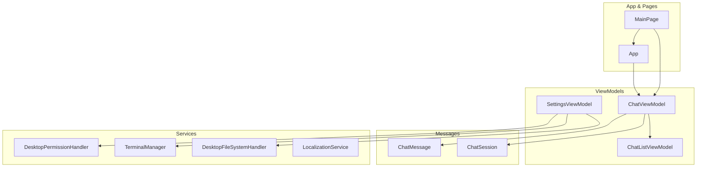
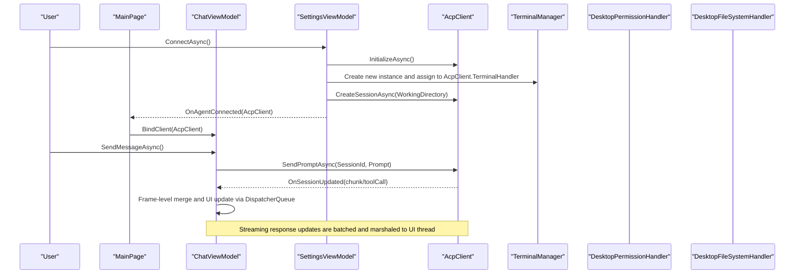
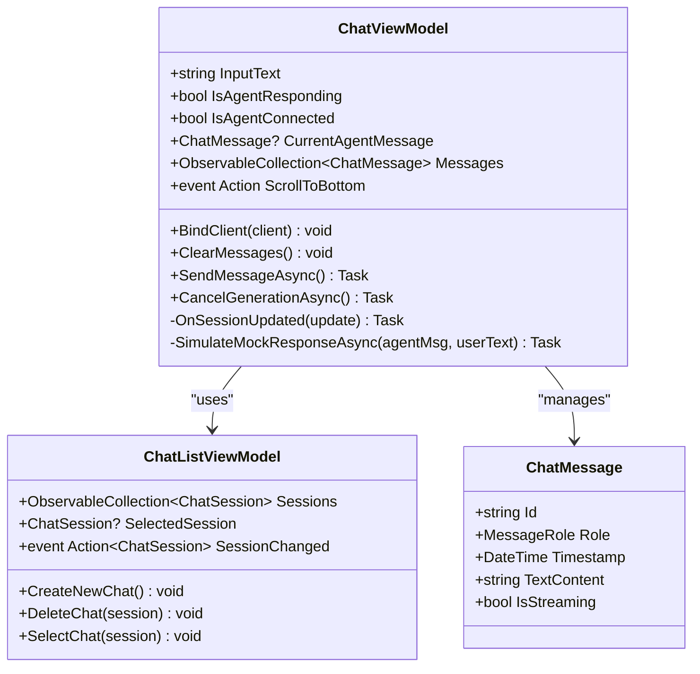
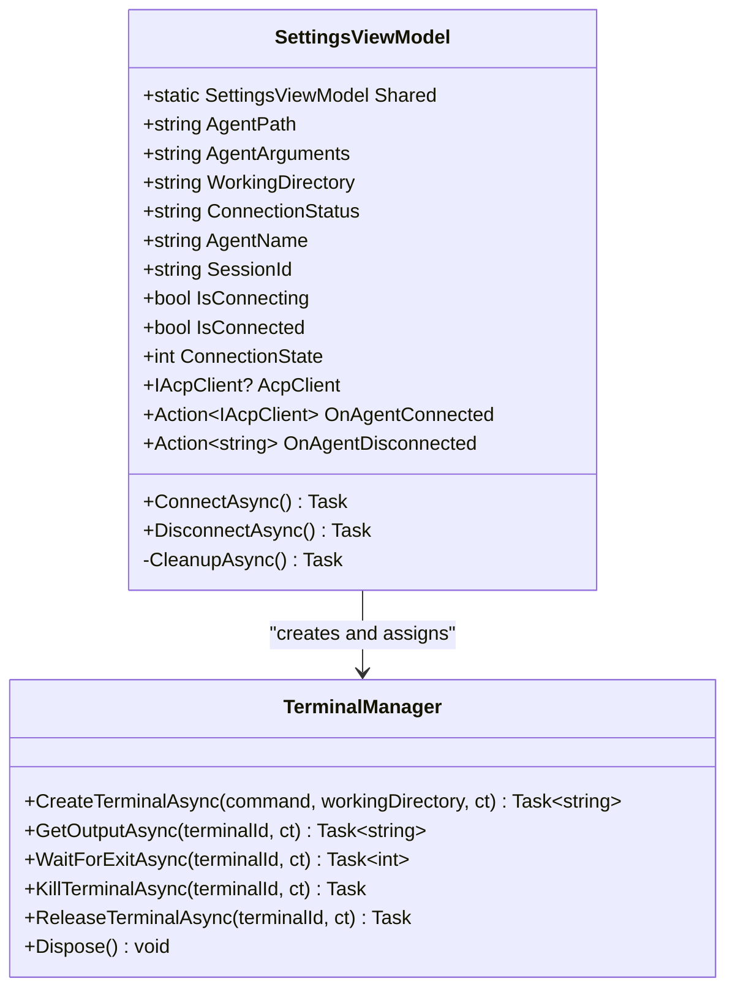
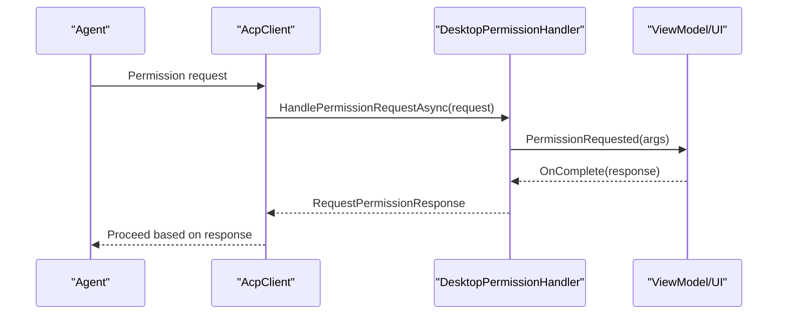
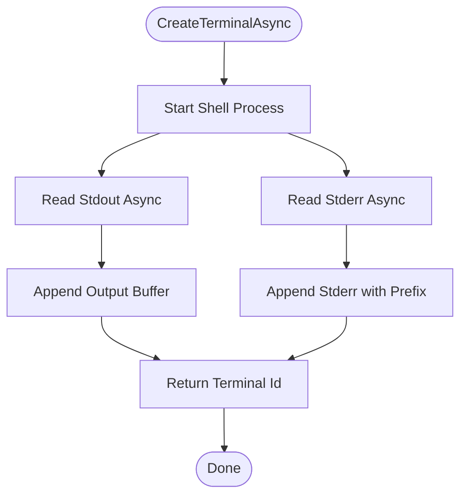
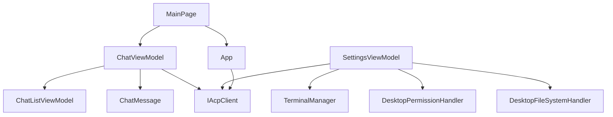

# API Reference

<cite>
**Referenced Files in This Document**
- [ChatViewModel.cs](file://Agentic.Desktop/ViewModels/ChatViewModel.cs)
- [SettingsViewModel.cs](file://Agentic.Desktop/ViewModels/SettingsViewModel.cs)
- [ChatMessage.cs](file://Agentic.Desktop/ViewModels/Messages/ChatMessage.cs)
- [ChatSession.cs](file://Agentic.Desktop/ViewModels/Messages/ChatSession.cs)
- [ChatListViewModel.cs](file://Agentic.Desktop/ViewModels/ChatListViewModel.cs)
- [PermissionHandler.cs](file://Agentic.Desktop/Services/PermissionHandler.cs)
- [TerminalManager.cs](file://Agentic.Desktop/Services/TerminalManager.cs)
- [FileSystemHandler.cs](file://Agentic.Desktop/Services/FileSystemHandler.cs)
- [LocalizationService.cs](file://Agentic.Desktop/Services/LocalizationService.cs)
- [App.xaml.cs](file://Agentic.Desktop/App.xaml.cs)
- [MainPage.xaml.cs](file://Agentic.Desktop/MainPage.xaml.cs)
</cite>

## Table of Contents
1. [Introduction](#introduction)
2. [Project Structure](#project-structure)
3. [Core Components](#core-components)
4. [Architecture Overview](#architecture-overview)
5. [Detailed Component Analysis](#detailed-component-analysis)
6. [Dependency Analysis](#dependency-analysis)
7. [Performance Considerations](#performance-considerations)
8. [Troubleshooting Guide](#troubleshooting-guide)
9. [Conclusion](#conclusion)

## Introduction
This document provides a comprehensive API reference for Agentic.Desktop’s public interfaces and classes, focusing on the chat experience, agent connection lifecycle, and secure service integrations. It covers:
- ChatViewModel: message management, sending messages, streaming responses, and connection state events.
- SettingsViewModel: singleton pattern, agent configuration properties, and connection lifecycle methods.
- ChatMessage model: role, content, and streaming state properties.
- Service interfaces and implementations: IPermissionHandler (DesktopPermissionHandler), ITerminalHandler (TerminalManager), and IFileSystemHandler (DesktopFileSystemHandler).
- Parameter specifications, return values, exception handling patterns, usage examples, threading considerations, and async/await patterns used throughout the codebase.

## Project Structure
The application is organized by feature areas:
- ViewModels: UI state and behavior for chat sessions and settings.
- Services: cross-cutting concerns like permissions, terminal process management, file system access, and localization.
- Messages: data models for chat messages and sessions.
- App and Page infrastructure: application-level services and page wiring.

**Diagram sources**
- [ChatViewModel.cs:1-235](file://Agentic.Desktop/ViewModels/ChatViewModel.cs#L1-L235)
- [SettingsViewModel.cs:1-162](file://Agentic.Desktop/ViewModels/SettingsViewModel.cs#L1-L162)
- [ChatMessage.cs:1-39](file://Agentic.Desktop/ViewModels/Messages/ChatMessage.cs#L1-L39)
- [ChatSession.cs:1-28](file://Agentic.Desktop/ViewModels/Messages/ChatSession.cs#L1-L28)
- [ChatListViewModel.cs:1-64](file://Agentic.Desktop/ViewModels/ChatListViewModel.cs#L1-L64)
- [PermissionHandler.cs:1-52](file://Agentic.Desktop/Services/PermissionHandler.cs#L1-L52)
- [TerminalManager.cs:1-161](file://Agentic.Desktop/Services/TerminalManager.cs#L1-L161)
- [FileSystemHandler.cs:1-42](file://Agentic.Desktop/Services/FileSystemHandler.cs#L1-L42)
- [LocalizationService.cs:1-23](file://Agentic.Desktop/Services/LocalizationService.cs#L1-L23)
- [App.xaml.cs:1-73](file://Agentic.Desktop/App.xaml.cs#L1-L73)
- [MainPage.xaml.cs:1-51](file://Agentic.Desktop/MainPage.xaml.cs#L1-L51)

**Section sources**
- [ChatViewModel.cs:1-235](file://Agentic.Desktop/ViewModels/ChatViewModel.cs#L1-L235)
- [SettingsViewModel.cs:1-162](file://Agentic.Desktop/ViewModels/SettingsViewModel.cs#L1-L162)
- [ChatMessage.cs:1-39](file://Agentic.Desktop/ViewModels/Messages/ChatMessage.cs#L1-L39)
- [ChatSession.cs:1-28](file://Agentic.Desktop/ViewModels/Messages/ChatSession.cs#L1-L28)
- [ChatListViewModel.cs:1-64](file://Agentic.Desktop/ViewModels/ChatListViewModel.cs#L1-L64)
- [PermissionHandler.cs:1-52](file://Agentic.Desktop/Services/PermissionHandler.cs#L1-L52)
- [TerminalManager.cs:1-161](file://Agentic.Desktop/Services/TerminalManager.cs#L1-L161)
- [FileSystemHandler.cs:1-42](file://Agentic.Desktop/Services/FileSystemHandler.cs#L1-L42)
- [LocalizationService.cs:1-23](file://Agentic.Desktop/Services/LocalizationService.cs#L1-L23)
- [App.xaml.cs:1-73](file://Agentic.Desktop/App.xaml.cs#L1-L73)
- [MainPage.xaml.cs:1-51](file://Agentic.Desktop/MainPage.xaml.cs#L1-L51)

## Core Components
This section summarizes the primary APIs exposed to the UI and integration points with external agents.

- ChatViewModel
  - Properties: InputText, IsAgentResponding, IsAgentConnected, CurrentAgentMessage, Messages (derived from selected session), ScrollToBottom event.
  - Methods: BindClient(IAcpClient), ClearMessages(), SendMessageAsync(), CancelGenerationAsync().
  - Events: SessionChanged subscription via ChatList; internal OnSessionUpdated handler for streaming updates.
  - Threading: Uses DispatcherQueue to marshal UI updates; frame-level merging to batch text chunks.

- SettingsViewModel
  - Singleton: Shared property ensures global persistence across navigation.
  - Properties: AgentPath, AgentArguments, WorkingDirectory, ConnectionStatus, AgentName, SessionId, IsConnecting, IsConnected, ConnectionState.
  - Methods: ConnectAsync(), DisconnectAsync(), CleanupAsync().
  - Events: OnAgentConnected(IAcpClient), OnAgentDisconnected(string).

- ChatMessage
  - Properties: Id, Role, Timestamp, TextContent, IsStreaming.
  - Constructor: Initializes Role and optional initial TextContent.

- Services
  - DesktopPermissionHandler: Implements permission request flow with UI dialog dispatch.
  - TerminalManager: Manages multiple terminal processes, output buffering, and lifecycle.
  - DesktopFileSystemHandler: Secure file operations within working directory with path validation.

**Section sources**
- [ChatViewModel.cs:1-235](file://Agentic.Desktop/ViewModels/ChatViewModel.cs#L1-L235)
- [SettingsViewModel.cs:1-162](file://Agentic.Desktop/ViewModels/SettingsViewModel.cs#L1-L162)
- [ChatMessage.cs:1-39](file://Agentic.Desktop/ViewModels/Messages/ChatMessage.cs#L1-L39)
- [PermissionHandler.cs:1-52](file://Agentic.Desktop/Services/PermissionHandler.cs#L1-L52)
- [TerminalManager.cs:1-161](file://Agentic.Desktop/Services/TerminalManager.cs#L1-L161)
- [FileSystemHandler.cs:1-42](file://Agentic.Desktop/Services/FileSystemHandler.cs#L1-L42)

## Architecture Overview
The architecture separates UI state (ViewModels), domain models (Messages), and cross-cutting services (Permissions, Terminal, File System). The AcpClient acts as the bridge to the agent, while the app coordinates connection lifecycle and UI binding.

**Diagram sources**
- [SettingsViewModel.cs:60-126](file://Agentic.Desktop/ViewModels/SettingsViewModel.cs#L60-L126)
- [MainPage.xaml.cs:26-47](file://Agentic.Desktop/MainPage.xaml.cs#L26-L47)
- [ChatViewModel.cs:94-149](file://Agentic.Desktop/ViewModels/ChatViewModel.cs#L94-L149)
- [ChatViewModel.cs:151-204](file://Agentic.Desktop/ViewModels/ChatViewModel.cs#L151-L204)
- [TerminalManager.cs:16-68](file://Agentic.Desktop/Services/TerminalManager.cs#L16-L68)
- [PermissionHandler.cs:26-44](file://Agentic.Desktop/Services/PermissionHandler.cs#L26-L44)
- [FileSystemHandler.cs:17-30](file://Agentic.Desktop/Services/FileSystemHandler.cs#L17-L30)

## Detailed Component Analysis

### ChatViewModel API
Responsibilities:
- Manage current session messages and streaming state.
- Send user prompts and handle agent responses (streaming or mock).
- Coordinate with ChatListViewModel for session selection and scroll behavior.

Key properties:
- InputText: string, user input buffer.
- IsAgentResponding: bool, indicates active generation.
- IsAgentConnected: bool, reflects AcpClient connection state.
- CurrentAgentMessage: ChatMessage?, currently streaming agent message.
- Messages: ObservableCollection<ChatMessage>, derived from selected session.
- ScrollToBottom: event, triggers UI scrolling.

Key methods:
- BindClient(IAcpClient client): Subscribes to session updates and sets connection flag.
- ClearMessages(): Clears messages and resets connection flag.
- SendMessageAsync(): Adds user message, creates placeholder agent message, sends prompt or simulates mock response, handles exceptions and streaming completion.
- CancelGenerationAsync(): Cancels ongoing session and resets streaming flags.

Events:
- OnSessionUpdated(SessionUpdate update): Handles AgentMessageChunk and ToolCallNotification, merges text frames, enqueues UI updates.

Threading and async patterns:
- Uses DispatcherQueue.TryEnqueue to marshal UI updates.
- Frame-level merging accumulates text chunks and flushes every 50ms to reduce UI churn.
- Exceptions caught include OperationCanceledException and general Exception; error messages localized.

Usage example:
- MainPage binds ChatListPanel to ChatViewModel.ChatList and subscribes to ScrollToBottom.
- When App.CurrentAcpClient changes, MainPage calls ViewModel.BindClient or ClearMessages accordingly.

Parameter specifications:
- BindClient(client: IAcpClient): No return value.
- SendMessageAsync(): Async Task; no parameters.
- CancelGenerationAsync(): Async Task; no parameters.

Return values:
- SendMessageAsync(): None; side effects update Messages and streaming state.
- CancelGenerationAsync(): None; resets state and cancels session if available.

Exception handling:
- OperationCanceledException handled gracefully during cancellation.
- General exceptions append localized error prefix to agent message.

**Section sources**
- [ChatViewModel.cs:17-34](file://Agentic.Desktop/ViewModels/ChatViewModel.cs#L17-L34)
- [ChatViewModel.cs:74-92](file://Agentic.Desktop/ViewModels/ChatViewModel.cs#L74-L92)
- [ChatViewModel.cs:94-149](file://Agentic.Desktop/ViewModels/ChatViewModel.cs#L94-L149)
- [ChatViewModel.cs:151-204](file://Agentic.Desktop/ViewModels/ChatViewModel.cs#L151-L204)
- [ChatViewModel.cs:206-216](file://Agentic.Desktop/ViewModels/ChatViewModel.cs#L206-L216)
- [MainPage.xaml.cs:26-47](file://Agentic.Desktop/MainPage.xaml.cs#L26-L47)

#### ChatViewModel Class Diagram

**Diagram sources**
- [ChatViewModel.cs:11-45](file://Agentic.Desktop/ViewModels/ChatViewModel.cs#L11-L45)
- [ChatListViewModel.cs:8-28](file://Agentic.Desktop/ViewModels/ChatListViewModel.cs#L8-L28)
- [ChatMessage.cs:14-31](file://Agentic.Desktop/ViewModels/Messages/ChatMessage.cs#L14-L31)

### SettingsViewModel API
Responsibilities:
- Provide a globally shared instance for connection state persistence.
- Configure agent transport (mock or stdio), initialize AcpClient, create sessions, and manage lifecycle.
- Notify subscribers when connected or disconnected.

Singleton pattern:
- Shared property returns a single instance reused across pages.

Properties:
- AgentPath: string, executable path for agent.
- AgentArguments: string, command-line arguments.
- WorkingDirectory: string, process working directory.
- ConnectionStatus: string, localized status text.
- AgentName: string, resolved agent name/title.
- SessionId: string, current session identifier.
- IsConnecting: bool, connecting state.
- IsConnected: bool, connected state.
- ConnectionState: int, enum-like state (0=Disconnected, 1=Connecting, 2=Connected).

Methods:
- ConnectAsync(): Establishes transport, initializes AcpClient, assigns TerminalManager, creates session, updates state, and notifies OnAgentConnected.
- DisconnectAsync(): Cleans up resources, resets state, and clears global AcpClient.
- CleanupAsync(): Detaches handlers, shuts down AcpClient, disposes TerminalManager.

Events:
- OnAgentConnected(IAcpClient): Notifies UI to bind client.
- OnAgentDisconnected(string): Reports unexpected disconnect with message.

Threading and async patterns:
- All connection steps are asynchronous; exceptions are caught and localized.
- Uses ILoggerFactory for logging and LocalizationService for messages.

Usage example:
- Settings page invokes ConnectAsync(); upon success, MainPage receives OnAgentConnected and binds ChatViewModel.

Parameter specifications:
- ConnectAsync(): Async Task; no parameters.
- DisconnectAsync(): Async Task; no parameters.
- CleanupAsync(): Async Task; no parameters.

Return values:
- ConnectAsync(): None; updates state and raises events.
- DisconnectAsync(): None; resets state and clears global client.

Exception handling:
- Any exception during connection sets ConnectionStatus to localized failure message and resets state.

**Section sources**
- [SettingsViewModel.cs:15-58](file://Agentic.Desktop/ViewModels/SettingsViewModel.cs#L15-L58)
- [SettingsViewModel.cs:60-126](file://Agentic.Desktop/ViewModels/SettingsViewModel.cs#L60-L126)
- [SettingsViewModel.cs:128-140](file://Agentic.Desktop/ViewModels/SettingsViewModel.cs#L128-L140)
- [SettingsViewModel.cs:142-160](file://Agentic.Desktop/ViewModels/SettingsViewModel.cs#L142-L160)

#### SettingsViewModel Class Diagram

**Diagram sources**
- [SettingsViewModel.cs:15-58](file://Agentic.Desktop/ViewModels/SettingsViewModel.cs#L15-L58)
- [TerminalManager.cs:11-20](file://Agentic.Desktop/Services/TerminalManager.cs#L11-L20)

### ChatMessage Model API
Responsibilities:
- Represent individual chat messages with role, timestamp, content, and streaming state.

Properties:
- Id: string, unique identifier generated at creation.
- Role: MessageRole enum (User, Agent, System).
- Timestamp: DateTime, creation time.
- TextContent: string, observable content that may contain Markdown.
- IsStreaming: bool, observable flag indicating live updates.

Constructor:
- ChatMessage(MessageRole role, string textContent = ""): Initializes role and optional content.

Threading considerations:
- Observable properties integrate with CommunityToolkit.Mvvm for UI updates.
- Content updates should be performed on UI thread when streaming.

Usage example:
- ChatViewModel adds ChatMessage instances to Messages collection and toggles IsStreaming during generation.

**Section sources**
- [ChatMessage.cs:14-31](file://Agentic.Desktop/ViewModels/Messages/ChatMessage.cs#L14-L31)
- [ChatMessage.cs:33-39](file://Agentic.Desktop/ViewModels/Messages/ChatMessage.cs#L33-L39)

### Permission Handler API (IPermissionHandler)
Responsibilities:
- Handle permission requests from the agent by showing a UI dialog and returning a response.

Implementation:
- DesktopPermissionHandler implements IPermissionHandler.
- Exposes PermissionRequested event; ViewModel shows dialog and invokes OnComplete callback.

Methods:
- HandlePermissionRequestAsync(RequestPermissionRequest request, CancellationToken ct = default): Returns RequestPermissionResponse after UI decision.

Threading:
- Uses DispatcherQueue to ensure dialog is shown on UI thread.

Usage example:
- AcpClient configured with DesktopPermissionHandler; when agent requests permission, UI displays dialog and completes the request.

Parameter specifications:
- HandlePermissionRequestAsync(request: RequestPermissionRequest, ct: CancellationToken): Async Task<RequestPermissionResponse>.

Return values:
- RequestPermissionResponse indicating allow/deny outcome.

Exception handling:
- No explicit exceptions; relies on UI interaction and TaskCompletionSource resolution.

**Section sources**
- [PermissionHandler.cs:11-44](file://Agentic.Desktop/Services/PermissionHandler.cs#L11-L44)

#### Permission Handler Sequence Diagram

**Diagram sources**
- [PermissionHandler.cs:26-44](file://Agentic.Desktop/Services/PermissionHandler.cs#L26-L44)

### Terminal Manager API (ITerminalHandler)
Responsibilities:
- Manage multiple terminal processes, capture output, and control lifecycle.

Methods:
- CreateTerminalAsync(command, workingDirectory, ct = default): Starts shell process, reads stdout/stderr asynchronously, returns terminal id.
- GetOutputAsync(terminalId, ct = default): Retrieves buffered output.
- WaitForExitAsync(terminalId, ct = default): Waits for process exit and returns exit code.
- KillTerminalAsync(terminalId, ct = default): Kills process tree.
- ReleaseTerminalAsync(terminalId, ct = default): Releases resources and kills if still running.
- Dispose(): Ensures all terminals are terminated and disposed.

Threading:
- Asynchronously reads stdout/stderr using Task.Run and cancellation tokens.
- Thread-safe output buffering with locks.

Usage example:
- SettingsViewModel assigns TerminalManager to AcpClient.TerminalHandler for tool execution.

Parameter specifications:
- CreateTerminalAsync(command: string, workingDirectory: string?, ct: CancellationToken): Async Task<string> (terminal id).
- GetOutputAsync(terminalId: string, ct: CancellationToken): Async Task<string>.
- WaitForExitAsync(terminalId: string, ct: CancellationToken): Async Task<int>.
- KillTerminalAsync(terminalId: string, ct: CancellationToken): Async Task.
- ReleaseTerminalAsync(terminalId: string, ct: CancellationToken): Async Task.

Return values:
- Terminal id, output string, exit code, or completed tasks.

Exception handling:
- Catches OperationCanceledException and general exceptions during stream reading; ensures cleanup.

**Section sources**
- [TerminalManager.cs:16-68](file://Agentic.Desktop/Services/TerminalManager.cs#L16-L68)
- [TerminalManager.cs:70-113](file://Agentic.Desktop/Services/TerminalManager.cs#L70-L113)
- [TerminalManager.cs:115-128](file://Agentic.Desktop/Services/TerminalManager.cs#L115-L128)

#### Terminal Manager Flowchart

**Diagram sources**
- [TerminalManager.cs:16-68](file://Agentic.Desktop/Services/TerminalManager.cs#L16-L68)

### File System Handler API (IFileSystemHandler)
Responsibilities:
- Provide secure file read/write operations restricted to a working directory.

Methods:
- ReadTextFileAsync(path, ct = default): Reads file content after path validation.
- WriteTextFileAsync(path, content, ct = default): Writes content after path validation and ensures directories exist.

Security:
- ValidatePath ensures full path starts with working directory; throws UnauthorizedAccessException otherwise.

Threading:
- Async file operations with cancellation support.

Usage example:
- AcpClient uses DesktopFileSystemHandler to restrict agent file access to safe paths.

Parameter specifications:
- ReadTextFileAsync(path: string, ct: CancellationToken): Async Task<string>.
- WriteTextFileAsync(path: string, content: string, ct: CancellationToken): Async Task.

Return values:
- File content string or completed task.

Exception handling:
- UnauthorizedAccessException thrown for invalid paths.

**Section sources**
- [FileSystemHandler.cs:17-30](file://Agentic.Desktop/Services/FileSystemHandler.cs#L17-L30)
- [FileSystemHandler.cs:32-40](file://Agentic.Desktop/Services/FileSystemHandler.cs#L32-L40)

## Dependency Analysis
The following diagram illustrates key dependencies between components:

**Diagram sources**
- [ChatViewModel.cs:1-235](file://Agentic.Desktop/ViewModels/ChatViewModel.cs#L1-L235)
- [SettingsViewModel.cs:1-162](file://Agentic.Desktop/ViewModels/SettingsViewModel.cs#L1-L162)
- [MainPage.xaml.cs:1-51](file://Agentic.Desktop/MainPage.xaml.cs#L1-L51)
- [App.xaml.cs:1-73](file://Agentic.Desktop/App.xaml.cs#L1-L73)

**Section sources**
- [ChatViewModel.cs:1-235](file://Agentic.Desktop/ViewModels/ChatViewModel.cs#L1-L235)
- [SettingsViewModel.cs:1-162](file://Agentic.Desktop/ViewModels/SettingsViewModel.cs#L1-L162)
- [MainPage.xaml.cs:1-51](file://Agentic.Desktop/MainPage.xaml.cs#L1-L51)
- [App.xaml.cs:1-73](file://Agentic.Desktop/App.xaml.cs#L1-L73)

## Performance Considerations
- Frame-level merging in ChatViewModel batches streaming text updates every 50ms to minimize UI re-renders.
- TerminalManager reads stdout/stderr asynchronously and buffers output with locks to avoid contention.
- Use of DispatcherQueue ensures UI updates are marshaled efficiently.
- Avoid unnecessary allocations in hot paths; reuse collections where possible.

[No sources needed since this section provides general guidance]

## Troubleshooting Guide
Common issues and resolutions:
- Connection failures: Check AgentPath and AgentArguments; inspect ConnectionStatus for localized error messages.
- Unexpected disconnect: OnAgentDisconnected provides reason; verify agent process lifecycle and TerminalManager disposal.
- Permission dialogs not appearing: Ensure DesktopPermissionHandler.PermissionRequested is subscribed and invoked on UI thread.
- File access denied: Validate working directory configuration; UnauthorizedAccessException indicates path outside allowed scope.
- Streaming glitches: Verify frame-level merging logic and DispatcherQueue usage; check for unhandled exceptions in stream readers.

**Section sources**
- [SettingsViewModel.cs:115-126](file://Agentic.Desktop/ViewModels/SettingsViewModel.cs#L115-L126)
- [PermissionHandler.cs:26-44](file://Agentic.Desktop/Services/PermissionHandler.cs#L26-L44)
- [FileSystemHandler.cs:32-40](file://Agentic.Desktop/Services/FileSystemHandler.cs#L32-L40)
- [TerminalManager.cs:39-64](file://Agentic.Desktop/Services/TerminalManager.cs#L39-L64)

## Conclusion
Agentic.Desktop provides a robust API surface for managing chat interactions, agent connections, and secure service integrations. The design emphasizes clear separation of concerns, efficient streaming updates, and safe resource management. By adhering to the documented interfaces and patterns, developers can extend functionality while maintaining reliability and performance.

[No sources needed since this section summarizes without analyzing specific files]