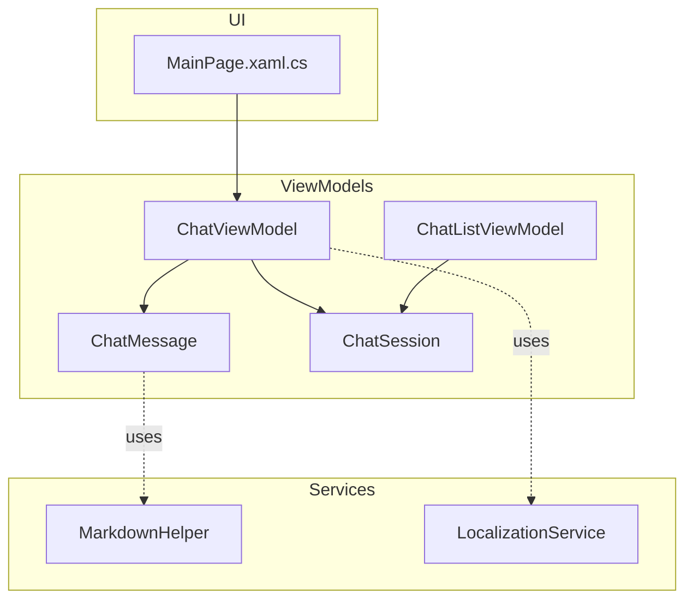
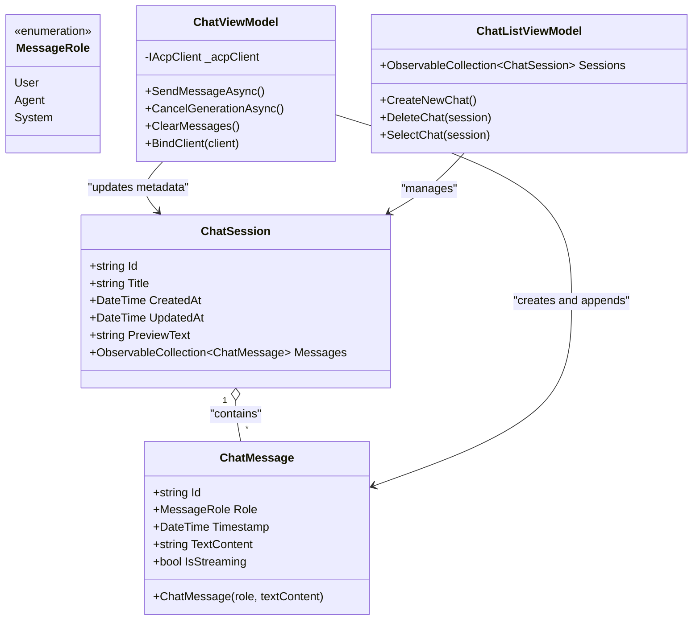
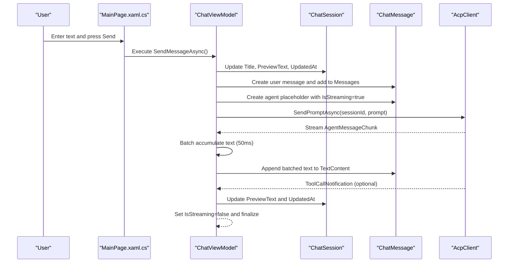
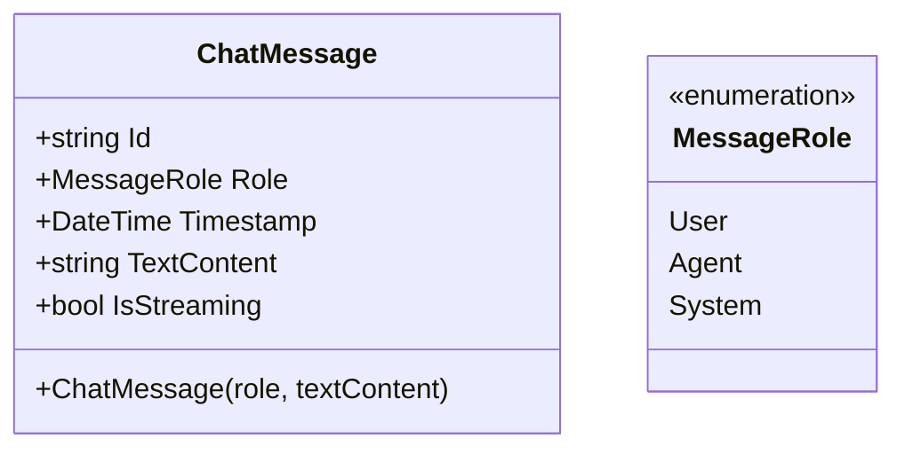
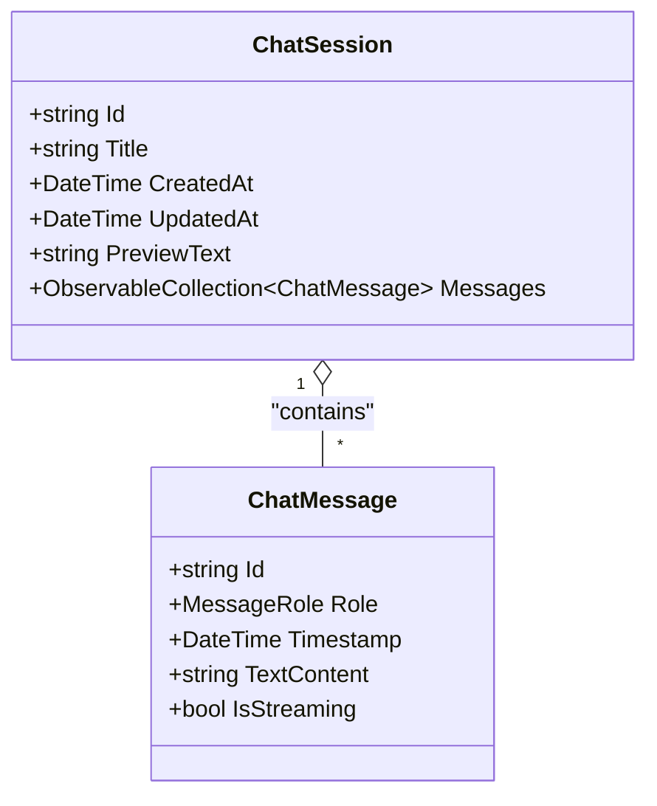
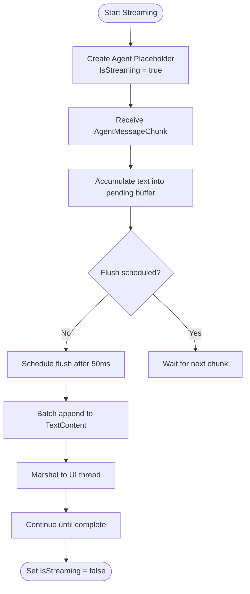
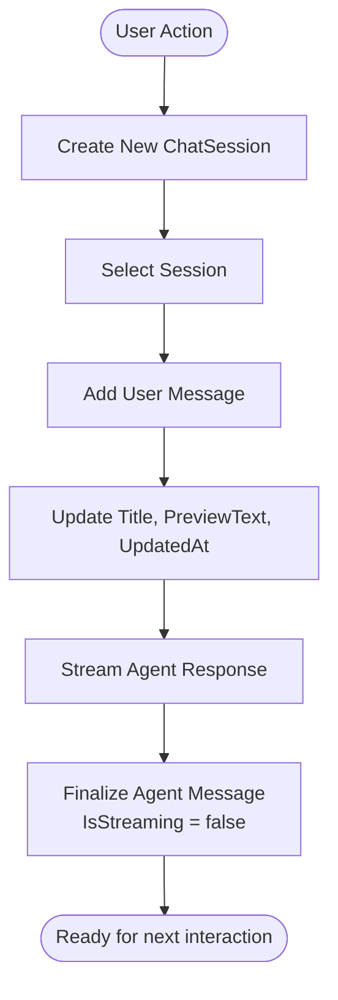
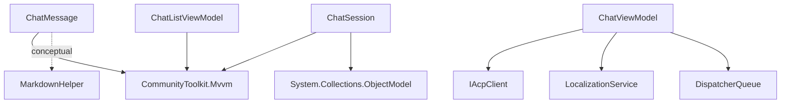

# Message Models API

<cite>
**Referenced Files in This Document**
- [ChatMessage.cs](file://Agentic.Desktop/ViewModels/Messages/ChatMessage.cs)
- [ChatSession.cs](file://Agentic.Desktop/ViewModels/Messages/ChatSession.cs)
- [ChatViewModel.cs](file://Agentic.Desktop/ViewModels/ChatViewModel.cs)
- [ChatListViewModel.cs](file://Agentic.Desktop/ViewModels/ChatListViewModel.cs)
- [MarkdownHelper.cs](file://Agentic.Desktop/Services/MarkdownHelper.cs)
- [LocalizationService.cs](file://Agentic.Desktop/Services/LocalizationService.cs)
- [MainPage.xaml.cs](file://Agentic.Desktop/MainPage.xaml.cs)
</cite>

## Table of Contents
1. [Introduction](#introduction)
2. [Project Structure](#project-structure)
3. [Core Components](#core-components)
4. [Architecture Overview](#architecture-overview)
5. [Detailed Component Analysis](#detailed-component-analysis)
6. [Dependency Analysis](#dependency-analysis)
7. [Performance Considerations](#performance-considerations)
8. [Troubleshooting Guide](#troubleshooting-guide)
9. [Conclusion](#conclusion)
10. [Appendices](#appendices)

## Introduction
This document provides detailed API documentation for Agentic.Desktop’s message model classes: ChatMessage and ChatSession. It explains their properties, data validation rules, property change notifications, relationships, and usage patterns for creating messages, managing streaming states, and handling session lifecycle. It also covers thread safety considerations and performance implications when working with large message collections.

## Project Structure
The message models live under the ViewModels/Messages namespace and are consumed by view models that manage UI state and interactions. Markdown rendering utilities and localization services support text content handling.

**Diagram sources**
- [ChatMessage.cs](file://Agentic.Desktop/ViewModels/Messages/ChatMessage.cs)
- [ChatSession.cs](file://Agentic.Desktop/ViewModels/Messages/ChatSession.cs)
- [ChatViewModel.cs](file://Agentic.Desktop/ViewModels/ChatViewModel.cs)
- [ChatListViewModel.cs](file://Agentic.Desktop/ViewModels/ChatListViewModel.cs)
- [MarkdownHelper.cs](file://Agentic.Desktop/Services/MarkdownHelper.cs)
- [LocalizationService.cs](file://Agentic.Desktop/Services/LocalizationService.cs)
- [MainPage.xaml.cs](file://Agentic.Desktop/MainPage.xaml.cs)

**Section sources**
- [ChatMessage.cs](file://Agentic.Desktop/ViewModels/Messages/ChatMessage.cs)
- [ChatSession.cs](file://Agentic.Desktop/ViewModels/Messages/ChatSession.cs)
- [ChatViewModel.cs](file://Agentic.Desktop/ViewModels/ChatViewModel.cs)
- [ChatListViewModel.cs](file://Agentic.Desktop/ViewModels/ChatListViewModel.cs)
- [MarkdownHelper.cs](file://Agentic.Desktop/Services/MarkdownHelper.cs)
- [LocalizationService.cs](file://Agentic.Desktop/Services/LocalizationService.cs)
- [MainPage.xaml.cs](file://Agentic.Desktop/MainPage.xaml.cs)

## Core Components
- ChatMessage: Represents a single message with role, immutable identity, timestamp, and observable text content and streaming state.
- ChatSession: Represents a conversation with an observable title, creation/update timestamps, preview text, and a collection of messages.
- ChatViewModel: Orchestrates sending messages, streaming updates, and updating session metadata.
- ChatListViewModel: Manages multiple sessions and selection changes.

Key responsibilities:
- ChatMessage encapsulates per-message state and exposes observable properties for UI binding.
- ChatSession holds a collection of ChatMessage instances and tracks metadata for display and persistence.
- ChatViewModel coordinates user input, agent responses, and session updates.
- ChatListViewModel manages session lifecycle (create, delete, select).

**Section sources**
- [ChatMessage.cs](file://Agentic.Desktop/ViewModels/Messages/ChatMessage.cs)
- [ChatSession.cs](file://Agentic.Desktop/ViewModels/Messages/ChatSession.cs)
- [ChatViewModel.cs](file://Agentic.Desktop/ViewModels/ChatViewModel.cs)
- [ChatListViewModel.cs](file://Agentic.Desktop/ViewModels/ChatListViewModel.cs)

## Architecture Overview
The message models integrate with MVVM via CommunityToolkit.Mvvm’s ObservableObject and [ObservableProperty] attributes to notify UI of changes. Streaming is implemented by incrementally appending to TextContent while IsStreaming indicates ongoing updates. Session metadata updates occur on user actions and tool call notifications.

**Diagram sources**
- [ChatMessage.cs](file://Agentic.Desktop/ViewModels/Messages/ChatMessage.cs)
- [ChatSession.cs](file://Agentic.Desktop/ViewModels/Messages/ChatSession.cs)
- [ChatViewModel.cs](file://Agentic.Desktop/ViewModels/ChatViewModel.cs)
- [ChatListViewModel.cs](file://Agentic.Desktop/ViewModels/ChatListViewModel.cs)

## Detailed Component Analysis

### ChatMessage
- Purpose: Encapsulates a single chat message with role-based semantics and streaming support.
- Properties:
  - Id: Immutable unique identifier generated at construction.
  - Role: Immutable role indicating origin (User, Agent, System).
  - Timestamp: Immutable creation time.
  - TextContent: Observable string used for displaying raw text or Markdown; updated incrementally during streaming.
  - IsStreaming: Observable boolean flag indicating whether the message is currently receiving streamed content.
- Validation rules:
  - Role must be one of the defined enum values.
  - TextContent can be empty initially; it accumulates content during streaming.
- Property change notifications:
  - TextContent and IsStreaming use [ObservableProperty] to raise PropertyChanged events automatically.
- Usage examples:
  - Create a user message: new ChatMessage(MessageRole.User, initialText).
  - Create an agent placeholder for streaming: new ChatMessage(MessageRole.Agent) then set IsStreaming = true and append to TextContent incrementally.
  - Toggle streaming state: set IsStreaming to false when streaming completes.

**Section sources**
- [ChatMessage.cs](file://Agentic.Desktop/ViewModels/Messages/ChatMessage.cs)

### ChatSession
- Purpose: Represents a conversation session with metadata and a message history.
- Properties:
  - Id: Immutable unique identifier.
  - Title: Observable string; defaults to localized “NewChatTitle”.
  - CreatedAt: Observable DateTime set at creation.
  - UpdatedAt: Observable DateTime updated on significant changes.
  - PreviewText: Observable string used for list previews; updated based on recent activity.
  - Messages: ObservableCollection of ChatMessage; supports UI binding and automatic notifications on add/remove.
- Validation rules:
  - Title defaults to a localized value; can be replaced with a truncated snippet of the first user message.
  - PreviewText is updated to reflect recent content or tool calls.
- Property change notifications:
  - Title, CreatedAt, UpdatedAt, and PreviewText use [ObservableProperty].
- Usage examples:
  - Create a new session: new ChatSession().
  - Update metadata after sending a message: update Title, PreviewText, and UpdatedAt.
  - Append messages: Messages.Add(new ChatMessage(...)).

**Section sources**
- [ChatSession.cs](file://Agentic.Desktop/ViewModels/Messages/ChatSession.cs)

### ChatViewModel
- Purpose: Coordinates message sending, streaming updates, and session metadata management.
- Key behaviors:
  - SendMessageAsync: Validates input, adds a user message, updates session metadata, creates an agent placeholder with IsStreaming = true, and streams content.
  - OnSessionUpdated: Handles streaming chunks and tool call notifications; batches text updates to reduce UI churn.
  - CancelGenerationAsync: Cancels ongoing generation and resets streaming flags.
  - ClearMessages: Clears current session messages and updates connection state.
- Thread safety:
  - Uses a lock around pending text accumulation and DispatcherQueue.TryEnqueue to marshal UI updates to the correct thread.
- Performance:
  - Batches incremental text updates every 50ms to minimize UI re-renders during streaming.

**Section sources**
- [ChatViewModel.cs](file://Agentic.Desktop/ViewModels/ChatViewModel.cs)

### ChatListViewModel
- Purpose: Manages multiple sessions and selection changes.
- Key behaviors:
  - CreateNewChat: Inserts a new session at the top and selects it.
  - DeleteChat: Removes a session and adjusts selection if needed.
  - SelectChat: Updates SelectedSession and raises SessionChanged event.
- Relationship to ChatSession:
  - Holds an ObservableCollection of ChatSession instances; selection drives which session’s Messages are displayed.

**Section sources**
- [ChatListViewModel.cs](file://Agentic.Desktop/ViewModels/ChatListViewModel.cs)

### Text Content Handling and Markdown
- ChatMessage.TextContent may contain Markdown from the Agent. WinUI 3 TextBlock does not render HTML/Markdown natively; raw text is displayed.
- MarkdownHelper provides conversion utilities:
  - ToHtml: Converts Markdown to HTML for future WebView2 rendering.
  - ToPlainText: Strips formatting markers to produce plain text for current TextBlock rendering.
- LocalizationService supplies localized strings for titles, previews, and error messages.

**Section sources**
- [MarkdownHelper.cs](file://Agentic.Desktop/Services/MarkdownHelper.cs)
- [LocalizationService.cs](file://Agentic.Desktop/Services/LocalizationService.cs)

### UI Binding and Data Templates
- MainPage.xaml.cs demonstrates how ChatMessage.Role drives template selection for user vs. agent messages.
- The UI binds to TextContent and IsStreaming to show typing indicators and dynamic content.

**Section sources**
- [MainPage.xaml.cs](file://Agentic.Desktop/MainPage.xaml.cs)

## Architecture Overview
The following sequence illustrates the flow of sending a message, streaming agent responses, and updating session metadata.

**Diagram sources**
- [ChatViewModel.cs](file://Agentic.Desktop/ViewModels/ChatViewModel.cs)
- [ChatSession.cs](file://Agentic.Desktop/ViewModels/Messages/ChatSession.cs)
- [ChatMessage.cs](file://Agentic.Desktop/ViewModels/Messages/ChatMessage.cs)

## Detailed Component Analysis

### ChatMessage Class Diagram

**Diagram sources**
- [ChatMessage.cs](file://Agentic.Desktop/ViewModels/Messages/ChatMessage.cs)

### ChatSession Class Diagram

**Diagram sources**
- [ChatSession.cs](file://Agentic.Desktop/ViewModels/Messages/ChatSession.cs)
- [ChatMessage.cs](file://Agentic.Desktop/ViewModels/Messages/ChatMessage.cs)

### Streaming Flowchart

**Diagram sources**
- [ChatViewModel.cs](file://Agentic.Desktop/ViewModels/ChatViewModel.cs)

### Session Lifecycle Flowchart

**Diagram sources**
- [ChatListViewModel.cs](file://Agentic.Desktop/ViewModels/ChatListViewModel.cs)
- [ChatViewModel.cs](file://Agentic.Desktop/ViewModels/ChatViewModel.cs)

## Dependency Analysis
- ChatMessage depends on CommunityToolkit.Mvvm for observable properties and defines MessageRole enumeration.
- ChatSession depends on CommunityToolkit.Mvvm and System.Collections.ObjectModel for observable collections.
- ChatViewModel depends on IAcpClient for communication with the agent, LocalizationService for localized strings, and DispatcherQueue for UI marshaling.
- ChatListViewModel depends on CommunityToolkit.Mvvm and manages ChatSession instances.
- MarkdownHelper is referenced conceptually for text processing; actual usage occurs via comments and potential future integration.

**Diagram sources**
- [ChatMessage.cs](file://Agentic.Desktop/ViewModels/Messages/ChatMessage.cs)
- [ChatSession.cs](file://Agentic.Desktop/ViewModels/Messages/ChatSession.cs)
- [ChatViewModel.cs](file://Agentic.Desktop/ViewModels/ChatViewModel.cs)
- [ChatListViewModel.cs](file://Agentic.Desktop/ViewModels/ChatListViewModel.cs)
- [LocalizationService.cs](file://Agentic.Desktop/Services/LocalizationService.cs)
- [MarkdownHelper.cs](file://Agentic.Desktop/Services/MarkdownHelper.cs)

**Section sources**
- [ChatMessage.cs](file://Agentic.Desktop/ViewModels/Messages/ChatMessage.cs)
- [ChatSession.cs](file://Agentic.Desktop/ViewModels/Messages/ChatSession.cs)
- [ChatViewModel.cs](file://Agentic.Desktop/ViewModels/ChatViewModel.cs)
- [ChatListViewModel.cs](file://Agentic.Desktop/ViewModels/ChatListViewModel.cs)
- [LocalizationService.cs](file://Agentic.Desktop/Services/LocalizationService.cs)
- [MarkdownHelper.cs](file://Agentic.Desktop/Services/MarkdownHelper.cs)

## Performance Considerations
- Large message collections:
  - Use ObservableCollection efficiently; avoid frequent bulk operations that cause excessive change notifications.
  - Consider virtualization in UI components to render only visible items.
- Streaming performance:
  - Batch text updates (as implemented in ChatViewModel) to reduce UI re-renders.
  - Marshal updates to the UI thread using DispatcherQueue to prevent cross-thread exceptions.
- Memory usage:
  - Keep historical messages concise; consider truncating or archiving old sessions.
  - Avoid holding references to large temporary buffers beyond necessary.

[No sources needed since this section provides general guidance]

## Troubleshooting Guide
- Streaming not updating UI:
  - Ensure IsStreaming is toggled correctly and TextContent is appended on the UI thread.
  - Verify DispatcherQueue.TryEnqueue is used for UI-bound updates.
- Session metadata not reflecting changes:
  - Confirm that Title, PreviewText, and UpdatedAt are updated after user actions and tool calls.
- Cross-thread exceptions:
  - Always marshal UI updates to the dispatcher queue; avoid direct manipulation of UI-bound properties from background threads.
- Localization issues:
  - Check resource keys and ensure LocalizationService.Get and Format return expected values.

**Section sources**
- [ChatViewModel.cs](file://Agentic.Desktop/ViewModels/ChatViewModel.cs)
- [LocalizationService.cs](file://Agentic.Desktop/Services/LocalizationService.cs)

## Conclusion
ChatMessage and ChatSession provide a robust foundation for representing chat conversations in Agentic.Desktop. Their observable properties enable responsive UI binding, while streaming support allows real-time updates. Proper thread marshaling and batching ensure smooth performance even with large message collections. Integrating MarkdownHelper and LocalizationService enhances text handling and internationalization.

[No sources needed since this section summarizes without analyzing specific files]

## Appendices

### Examples of Creating Messages and Managing Streaming States
- Create a user message:
  - Instantiate ChatMessage with MessageRole.User and initial text.
  - Add to the selected session’s Messages collection.
- Manage streaming:
  - Create an agent placeholder with MessageRole.Agent and set IsStreaming = true.
  - Append incremental text to TextContent during streaming.
  - Set IsStreaming = false when streaming completes.

**Section sources**
- [ChatViewModel.cs](file://Agentic.Desktop/ViewModels/ChatViewModel.cs)
- [ChatMessage.cs](file://Agentic.Desktop/ViewModels/Messages/ChatMessage.cs)

### Handling Session Lifecycle
- Create a new session:
  - Use ChatListViewModel.CreateNewChat to insert and select a new ChatSession.
- Update session metadata:
  - After sending a message, update Title, PreviewText, and UpdatedAt.
- Delete a session:
  - Use ChatListViewModel.DeleteChat to remove and adjust selection.

**Section sources**
- [ChatListViewModel.cs](file://Agentic.Desktop/ViewModels/ChatListViewModel.cs)
- [ChatViewModel.cs](file://Agentic.Desktop/ViewModels/ChatViewModel.cs)