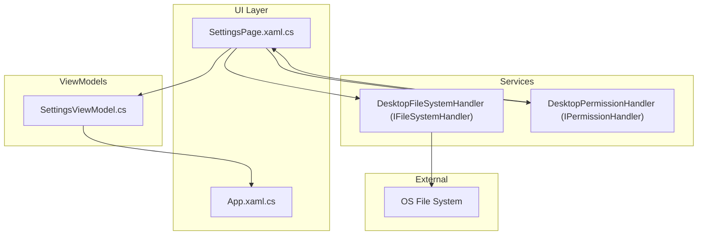
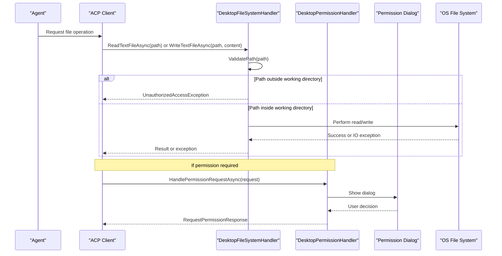
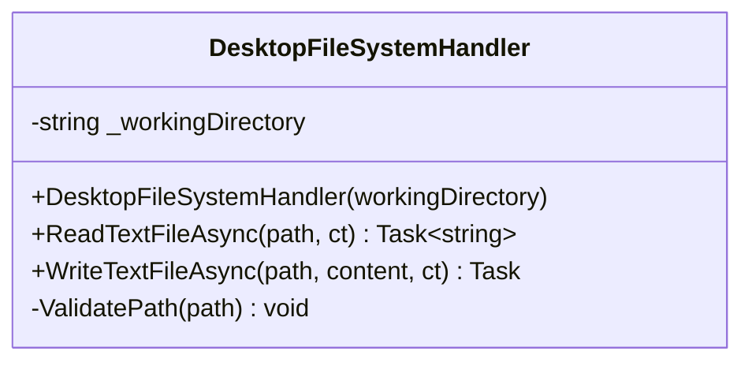
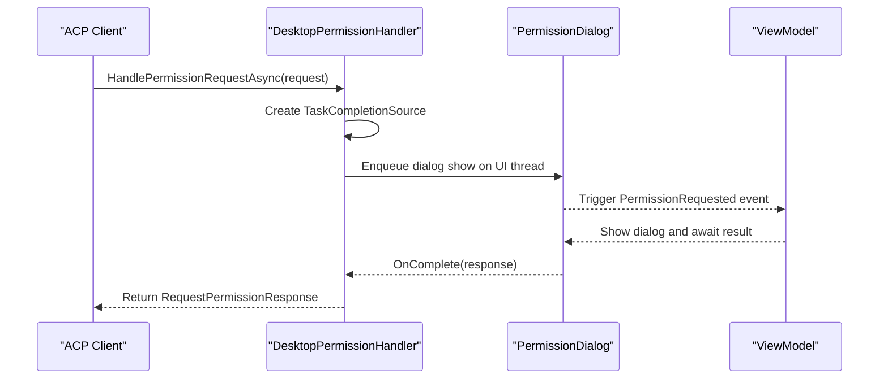
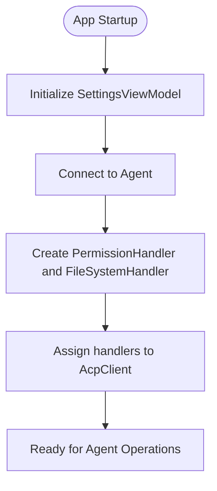
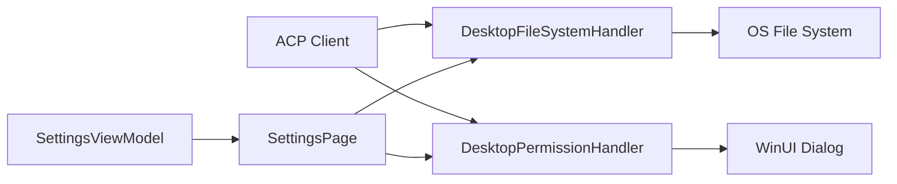

# File System Handler API

<cite>
**Referenced Files in This Document**
- [FileSystemHandler.cs](file://Agentic.Desktop/Services/FileSystemHandler.cs)
- [PermissionHandler.cs](file://Agentic.Desktop/Services/PermissionHandler.cs)
- [SettingsPage.xaml.cs](file://Agentic.Desktop/SettingsPage.xaml.cs)
- [SettingsViewModel.cs](file://Agentic.Desktop/ViewModels/SettingsViewModel.cs)
- [App.xaml.cs](file://Agentic.Desktop/App.xaml.cs)
- [README.md](file://README.md)
</cite>

## Table of Contents
1. [Introduction](#introduction)
2. [Project Structure](#project-structure)
3. [Core Components](#core-components)
4. [Architecture Overview](#architecture-overview)
5. [Detailed Component Analysis](#detailed-component-analysis)
6. [Dependency Analysis](#dependency-analysis)
7. [Performance Considerations](#performance-considerations)
8. [Troubleshooting Guide](#troubleshooting-guide)
9. [Conclusion](#conclusion)

## Introduction
This document provides detailed API documentation for the FileSystemHandler service used by the desktop application to perform secure file operations on behalf of an AI Agent. It focuses on path validation, working directory isolation, and access control mechanisms that prevent unauthorized file system access. The implementation ensures that all read and write operations are restricted to a configured working directory and leverages localization for consistent error messaging.

## Project Structure
The file system handler is implemented as a dedicated service class within the Services layer. It is wired into the application during agent connection setup and integrated with the permission system via UI events.

**Diagram sources**
- [SettingsPage.xaml.cs](file://Agentic.Desktop/SettingsPage.xaml.cs)
- [SettingsViewModel.cs](file://Agentic.Desktop/ViewModels/SettingsViewModel.cs)
- [FileSystemHandler.cs](file://Agentic.Desktop/Services/FileSystemHandler.cs)
- [PermissionHandler.cs](file://Agentic.Desktop/Services/PermissionHandler.cs)
- [App.xaml.cs](file://Agentic.Desktop/App.xaml.cs)

**Section sources**
- [README.md](file://README.md)
- [SettingsPage.xaml.cs](file://Agentic.Desktop/SettingsPage.xaml.cs)
- [SettingsViewModel.cs](file://Agentic.Desktop/ViewModels/SettingsViewModel.cs)

## Core Components
- DesktopFileSystemHandler: Implements IFileSystemHandler and enforces path validation against a configured working directory. Provides asynchronous text file read and write operations.
- DesktopPermissionHandler: Implements IPermissionHandler to coordinate user consent for sensitive operations through UI dialogs.

Key responsibilities:
- Validate and normalize paths before any file operation.
- Restrict operations to files under the allowed working directory.
- Create necessary directories when writing files.
- Raise localized security exceptions for unauthorized access attempts.
- Integrate with the permission system to request user approval for operations requiring explicit consent.

**Section sources**
- [FileSystemHandler.cs](file://Agentic.Desktop/Services/FileSystemHandler.cs)
- [PermissionHandler.cs](file://Agentic.Desktop/Services/PermissionHandler.cs)

## Architecture Overview
The FileSystemHandler is instantiated during agent connection and assigned to the ACP client. All file operations requested by the agent flow through this handler, which validates paths and performs safe I/O. Permission requests are handled via the permission handler, which triggers UI dialogs and returns results asynchronously.

**Diagram sources**
- [SettingsPage.xaml.cs](file://Agentic.Desktop/SettingsPage.xaml.cs)
- [FileSystemHandler.cs](file://Agentic.Desktop/Services/FileSystemHandler.cs)
- [PermissionHandler.cs](file://Agentic.Desktop/Services/PermissionHandler.cs)

## Detailed Component Analysis

### DesktopFileSystemHandler (IFileSystemHandler)
Implements secure file operations with strict path validation.

Public methods:
- ReadTextFileAsync(path, ct): Reads a text file after validating the path is within the working directory.
- WriteTextFileAsync(path, content, ct): Writes a text file after validating the path and ensuring parent directories exist.

Security model:
- Working directory isolation: Paths are normalized and checked to ensure they start with the configured working directory.
- Path traversal prevention: Uses full path resolution to avoid escape sequences like “..”.
- Access control: Throws a localized UnauthorizedAccessException if the path is not allowed.

Configuration:
- Constructor accepts a workingDirectory parameter, which is normalized to a full path at initialization.

Error handling:
- UnauthorizedAccessException for disallowed paths.
- Standard IO exceptions propagated from underlying file operations.

**Diagram sources**
- [FileSystemHandler.cs](file://Agentic.Desktop/Services/FileSystemHandler.cs)

**Section sources**
- [FileSystemHandler.cs](file://Agentic.Desktop/Services/FileSystemHandler.cs)

### DesktopPermissionHandler (IPermissionHandler)
Coordinates user consent for operations requiring explicit permission.

Key behaviors:
- Subscribes to a PermissionRequested event to show a UI dialog on the UI thread.
- Returns a RequestPermissionResponse once the user completes the dialog.

Integration points:
- Initialized with a DispatcherQueue to marshal UI interactions.
- Used by the ACP client to gate sensitive operations behind user confirmation.

**Diagram sources**
- [PermissionHandler.cs](file://Agentic.Desktop/Services/PermissionHandler.cs)
- [SettingsPage.xaml.cs](file://Agentic.Desktop/SettingsPage.xaml.cs)

**Section sources**
- [PermissionHandler.cs](file://Agentic.Desktop/Services/PermissionHandler.cs)
- [SettingsPage.xaml.cs](file://Agentic.Desktop/SettingsPage.xaml.cs)

### Configuration and Integration
- Working directory configuration:
  - SettingsViewModel exposes a WorkingDirectory property, defaulting to the user profile folder.
  - SettingsPage wires the AcpClient’s FileSystemHandler using the current WorkingDirectory value.
- Permission system integration:
  - SettingsPage creates a DesktopPermissionHandler bound to the app’s DispatcherQueue and assigns it to the AcpClient.
  - The ViewModel manages connection lifecycle and updates global state.

**Diagram sources**
- [SettingsViewModel.cs](file://Agentic.Desktop/ViewModels/SettingsViewModel.cs)
- [SettingsPage.xaml.cs](file://Agentic.Desktop/SettingsPage.xaml.cs)

**Section sources**
- [SettingsViewModel.cs](file://Agentic.Desktop/ViewModels/SettingsViewModel.cs)
- [SettingsPage.xaml.cs](file://Agentic.Desktop/SettingsPage.xaml.cs)

## Dependency Analysis
- DesktopFileSystemHandler depends on:
  - IFileSystemHandler interface (from Agentic.ACPLibrary.Client).
  - .NET file APIs for async read/write.
  - LocalizationService for formatted error messages.
- DesktopPermissionHandler depends on:
  - IPermissionHandler interface (from Agentic.ACPLibrary.Client).
  - DispatcherQueue for UI thread marshaling.
  - PermissionRequestEventArgs for passing requests and callbacks.
- Integration dependencies:
  - SettingsPage constructs both handlers and assigns them to the AcpClient instance.
  - SettingsViewModel manages connection state and working directory configuration.

**Diagram sources**
- [SettingsPage.xaml.cs](file://Agentic.Desktop/SettingsPage.xaml.cs)
- [SettingsViewModel.cs](file://Agentic.Desktop/ViewModels/SettingsViewModel.cs)
- [FileSystemHandler.cs](file://Agentic.Desktop/Services/FileSystemHandler.cs)
- [PermissionHandler.cs](file://Agentic.Desktop/Services/PermissionHandler.cs)

**Section sources**
- [SettingsPage.xaml.cs](file://Agentic.Desktop/SettingsPage.xaml.cs)
- [SettingsViewModel.cs](file://Agentic.Desktop/ViewModels/SettingsViewModel.cs)
- [FileSystemHandler.cs](file://Agentic.Desktop/Services/FileSystemHandler.cs)
- [PermissionHandler.cs](file://Agentic.Desktop/Services/PermissionHandler.cs)

## Performance Considerations
- Asynchronous I/O: Both read and write operations use async file APIs to avoid blocking the UI thread.
- Directory creation: When writing, parent directories are created only if needed, minimizing overhead.
- Path normalization: Full path resolution occurs once per operation; consider caching the working directory normalization if frequent operations are expected.
- Cancellation support: CancellationToken parameters allow cancellation of long-running operations.

[No sources needed since this section provides general guidance]

## Troubleshooting Guide
Common issues and resolutions:
- Unauthorized access errors:
  - Cause: Attempted to access a file outside the configured working directory.
  - Resolution: Ensure the requested path resolves within the working directory; verify path normalization and relative path inputs.
- Missing directories on write:
  - Behavior: Parent directories are automatically created before writing.
  - Resolution: Check permissions for creating directories; ensure the working directory allows nested writes.
- Permission dialog not appearing:
  - Cause: Permission handler not properly initialized or UI thread not available.
  - Resolution: Confirm DesktopPermissionHandler is constructed with a valid DispatcherQueue and assigned to the AcpClient.

Operational tips:
- Log and inspect the working directory value during initialization.
- Use localized error messages to guide users about access restrictions.
- Validate paths early in development to catch misconfigurations.

**Section sources**
- [FileSystemHandler.cs](file://Agentic.Desktop/Services/FileSystemHandler.cs)
- [PermissionHandler.cs](file://Agentic.Desktop/Services/PermissionHandler.cs)
- [SettingsPage.xaml.cs](file://Agentic.Desktop/SettingsPage.xaml.cs)

## Conclusion
The FileSystemHandler service provides a secure, configurable, and user-friendly mechanism for performing file operations on behalf of an AI Agent. By enforcing strict path validation and integrating with the permission system, it ensures that agents can only access files within an allowed working directory and that sensitive operations require explicit user consent. Proper configuration of the working directory and handlers during agent connection is essential for correct behavior.

[No sources needed since this section summarizes without analyzing specific files]