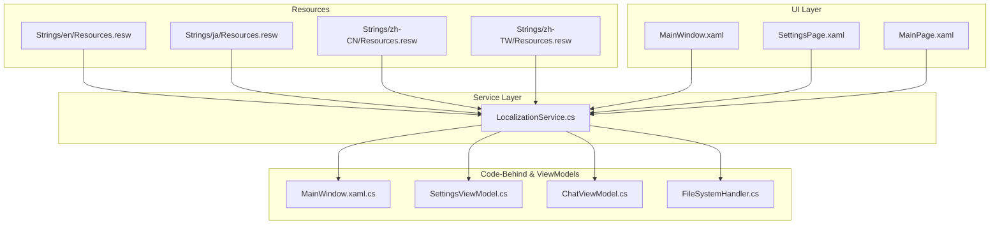
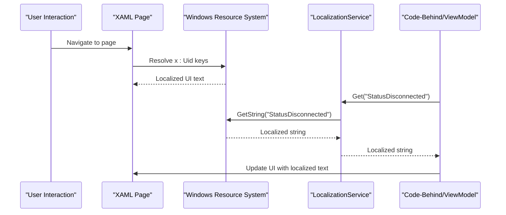
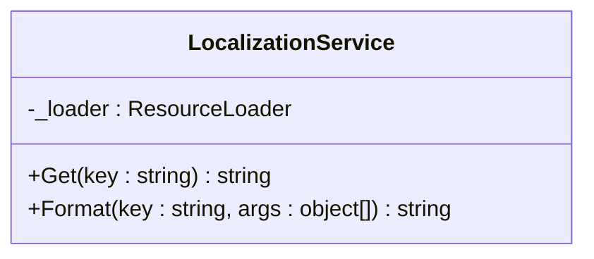
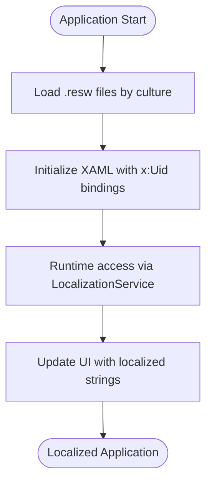
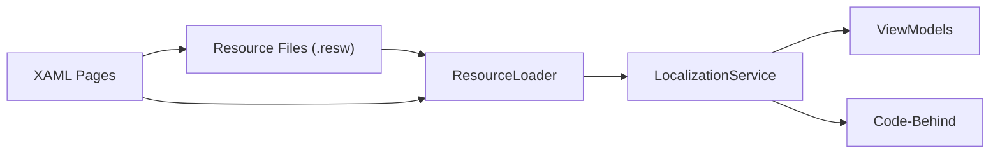

# Localization Service API

<cite>
**Referenced Files in This Document**
- [LocalizationService.cs](file://Agentic.Desktop/Services/LocalizationService.cs)
- [Resources.resw (en)](file://Agentic.Desktop/Strings/en/Resources.resw)
- [Resources.resw (ja)](file://Agentic.Desktop/Strings/ja/Resources.resw)
- [Resources.resw (zh-CN)](file://Agentic.Desktop/Strings/zh-CN/Resources.resw)
- [Resources.resw (zh-TW)](file://Agentic.Desktop/Strings/zh-TW/Resources.resw)
- [MainWindow.xaml.cs](file://Agentic.Desktop/MainWindow.xaml.cs)
- [SettingsViewModel.cs](file://Agentic.Desktop/ViewModels/SettingsViewModel.cs)
- [ChatViewModel.cs](file://Agentic.Desktop/ViewModels/ChatViewModel.cs)
- [FileSystemHandler.cs](file://Agentic.Desktop/Services/FileSystemHandler.cs)
- [MainWindow.xaml](file://Agentic.Desktop/MainWindow.xaml)
- [SettingsPage.xaml](file://Agentic.Desktop/SettingsPage.xaml)
- [MainPage.xaml](file://Agentic.Desktop/MainPage.xaml)
- [App.xaml.cs](file://Agentic.Desktop/App.xaml.cs)
- [Agentic.Desktop.csproj](file://Agentic.Desktop/Agentic.Desktop.csproj)
- [validate_resw.ps1](file://validate_resw.ps1)
</cite>

## Table of Contents
1. [Introduction](#introduction)
2. [Project Structure](#project-structure)
3. [Core Components](#core-components)
4. [Architecture Overview](#architecture-overview)
5. [Detailed Component Analysis](#detailed-component-analysis)
6. [Dependency Analysis](#dependency-analysis)
7. [Performance Considerations](#performance-considerations)
8. [Troubleshooting Guide](#troubleshooting-guide)
9. [Conclusion](#conclusion)
10. [Appendices](#appendices)

## Introduction
This document provides comprehensive API documentation for the LocalizationService used in the application. It explains how multi-language support is implemented using .resw resource files for English, Japanese, and Chinese (Simplified and Traditional). It details the service methods for retrieving localized strings, demonstrates integration with Windows resource system and XAML localization, and provides best practices for string management, pluralization handling, and culture-specific formatting.

## Project Structure
The localization implementation consists of:
- A static LocalizationService that wraps the Windows ResourceLoader to retrieve localized strings from .resw files.
- .resw resource files organized by language under Strings/{culture}/Resources.resw.
- XAML pages using x:Uid-based localization for UI text.
- ViewModels and code-behind accessing localized strings via LocalizationService.

**Diagram sources**
- [LocalizationService.cs](file://Agentic.Desktop/Services/LocalizationService.cs)
- [Resources.resw (en)](file://Agentic.Desktop/Strings/en/Resources.resw)
- [Resources.resw (ja)](file://Agentic.Desktop/Strings/ja/Resources.resw)
- [Resources.resw (zh-CN)](file://Agentic.Desktop/Strings/zh-CN/Resources.resw)
- [Resources.resw (zh-TW)](file://Agentic.Desktop/Strings/zh-TW/Resources.resw)
- [MainWindow.xaml](file://Agentic.Desktop/MainWindow.xaml)
- [SettingsPage.xaml](file://Agentic.Desktop/SettingsPage.xaml)
- [MainPage.xaml](file://Agentic.Desktop/MainPage.xaml)
- [MainWindow.xaml.cs](file://Agentic.Desktop/MainWindow.xaml.cs)
- [SettingsViewModel.cs](file://Agentic.Desktop/ViewModels/SettingsViewModel.cs)
- [ChatViewModel.cs](file://Agentic.Desktop/ViewModels/ChatViewModel.cs)
- [FileSystemHandler.cs](file://Agentic.Desktop/Services/FileSystemHandler.cs)

**Section sources**
- [LocalizationService.cs](file://Agentic.Desktop/Services/LocalizationService.cs)
- [Agentic.Desktop.csproj](file://Agentic.Desktop/Agentic.Desktop.csproj)

## Core Components
- LocalizationService: A static class providing two primary methods:
  - Get(key): Retrieves a localized string by key from the current culture’s Resources.resw.
  - Format(key, params): Retrieves a localized string and formats it with provided arguments.
- Resource files (.resw): XML-based resources per culture containing key-value pairs for UI and runtime strings.
- XAML localization: Uses x:Uid attributes on elements to bind to resource keys; Windows resource system resolves the appropriate culture at runtime.

Key usage examples across the app:
- MainWindow.xaml.cs uses LocalizationService.Get to update status text based on connection state.
- SettingsViewModel initializes properties with localized strings.
- ChatViewModel uses both Get and Format for chat titles, error messages, and tool call notifications.
- FileSystemHandler formats access denied messages with localized strings.

**Section sources**
- [LocalizationService.cs](file://Agentic.Desktop/Services/LocalizationService.cs)
- [MainWindow.xaml.cs](file://Agentic.Desktop/MainWindow.xaml.cs)
- [SettingsViewModel.cs](file://Agentic.Desktop/ViewModels/SettingsViewModel.cs)
- [ChatViewModel.cs](file://Agentic.Desktop/ViewModels/ChatViewModel.cs)
- [FileSystemHandler.cs](file://Agentic.Desktop/Services/FileSystemHandler.cs)

## Architecture Overview
The localization architecture integrates three layers:
- Resource layer: .resw files define localized content per culture.
- Service layer: LocalizationService abstracts Windows ResourceLoader for consistent access.
- Presentation layer: XAML uses x:Uid for declarative localization; code-behind and ViewModels use LocalizationService for dynamic strings.

**Diagram sources**
- [MainWindow.xaml](file://Agentic.Desktop/MainWindow.xaml)
- [SettingsPage.xaml](file://Agentic.Desktop/SettingsPage.xaml)
- [MainPage.xaml](file://Agentic.Desktop/MainPage.xaml)
- [LocalizationService.cs](file://Agentic.Desktop/Services/LocalizationService.cs)

## Detailed Component Analysis

### LocalizationService API
The LocalizationService is a simple, efficient wrapper around Windows.ResourceLoader. It exposes:
- Get(string key): Returns the localized string for the given key.
- Format(string key, params object[] args): Formats the localized string with arguments.

**Diagram sources**
- [LocalizationService.cs](file://Agentic.Desktop/Services/LocalizationService.cs)

**Section sources**
- [LocalizationService.cs](file://Agentic.Desktop/Services/LocalizationService.cs)

### Resource File Structure and Content
Each .resw file contains:
- XML schema and headers
- Data entries with name and value attributes
- Organized comments indicating usage context (e.g., Global, Chat Page, Settings Page)

Example structure for English:
- Navigation keys: NavChat.Content, NavSettings.Content
- Status keys: StatusText.Text, StatusDisconnected, StatusConnecting, StatusConnected
- Chat UI keys: TypingIndicator.Text, InputTextBox.PlaceholderText
- Settings keys: SettingsAgentConfig.Text, SettingsAgentPathLabel.Text
- ViewModel keys: StatusNotConnected, StatusConnectingProgress, ErrorPrefix, ToolCallPrefix

All cultures maintain identical keys with translated values.

**Section sources**
- [Resources.resw (en)](file://Agentic.Desktop/Strings/en/Resources.resw)
- [Resources.resw (ja)](file://Agentic.Desktop/Strings/ja/Resources.resw)
- [Resources.resw (zh-CN)](file://Agentic.Desktop/Strings/zh-CN/Resources.resw)
- [Resources.resw (zh-TW)](file://Agentic.Desktop/Strings/zh-TW/Resources.resw)

### XAML Integration with x:Uid
XAML elements use x:Uid attributes to bind to resource keys:
- MainWindow.xaml: StatusText.Text, NavChat.Content, NavSettings.Content
- SettingsPage.xaml: SettingsAgentConfig.Text, SettingsAgentPathLabel.Text, etc.
- MainPage.xaml: ConnectHint, OpenSettingsButton.Content

The Windows resource system automatically resolves the correct culture based on user preferences or system settings.

**Section sources**
- [MainWindow.xaml](file://Agentic.Desktop/MainWindow.xaml)
- [SettingsPage.xaml](file://Agentic.Desktop/SettingsPage.xaml)
- [MainPage.xaml](file://Agentic.Desktop/MainPage.xaml)

### Code-Behind and ViewModel Usage
- MainWindow.xaml.cs: Updates connection status text using LocalizationService.Get
- SettingsViewModel.cs: Initializes connection status with localized strings
- ChatViewModel.cs: Uses Get for chat titles and mock responses, Format for error messages and tool call notifications
- FileSystemHandler.cs: Formats access denied messages with localized strings

**Diagram sources**
- [MainWindow.xaml.cs](file://Agentic.Desktop/MainWindow.xaml.cs)
- [SettingsViewModel.cs](file://Agentic.Desktop/ViewModels/SettingsViewModel.cs)
- [ChatViewModel.cs](file://Agentic.Desktop/ViewModels/ChatViewModel.cs)
- [FileSystemHandler.cs](file://Agentic.Desktop/Services/FileSystemHandler.cs)

**Section sources**
- [MainWindow.xaml.cs](file://Agentic.Desktop/MainWindow.xaml.cs)
- [SettingsViewModel.cs](file://Agentic.Desktop/ViewModels/SettingsViewModel.cs)
- [ChatViewModel.cs](file://Agentic.Desktop/ViewModels/ChatViewModel.cs)
- [FileSystemHandler.cs](file://Agentic.Desktop/Services/FileSystemHandler.cs)

## Dependency Analysis
The localization system has clear dependencies:
- LocalizationService depends on Windows.ApplicationModel.Resources.ResourceLoader
- XAML pages depend on Windows resource system for x:Uid resolution
- ViewModels and code-behind depend on LocalizationService for dynamic string retrieval
- All components depend on properly structured .resw files

**Diagram sources**
- [LocalizationService.cs](file://Agentic.Desktop/Services/LocalizationService.cs)
- [Agentic.Desktop.csproj](file://Agentic.Desktop/Agentic.Desktop.csproj)

**Section sources**
- [LocalizationService.cs](file://Agentic.Desktop/Services/LocalizationService.cs)
- [Agentic.Desktop.csproj](file://Agentic.Desktop/Agentic.Desktop.csproj)

## Performance Considerations
- ResourceLoader caching: The Windows ResourceLoader caches resource strings, making repeated calls efficient
- Static service instance: LocalizationService uses a static ResourceLoader instance to avoid recreation overhead
- Minimal string operations: Format method uses standard string.Format for performance
- XAML x:Uid resolution: Handled by the platform at load time, not during runtime updates

Best practices for performance:
- Use Get for simple string retrieval
- Use Format only when parameter substitution is needed
- Avoid frequent culture switching in tight loops
- Cache frequently used localized strings in ViewModels if accessed repeatedly

[No sources needed since this section provides general guidance]

## Troubleshooting Guide
Common issues and solutions:

1. Missing resource keys:
   - Ensure all keys used in code exist in all .resw files
   - Use the validate_resw.ps1 script to check resource file validity

2. Culture not resolving correctly:
   - Verify DefaultLanguage setting in project file
   - Check Windows region/language settings
   - Ensure .resw files are in correct folder structure

3. String formatting errors:
   - Ensure Format method parameters match placeholder count
   - Validate string format syntax in .resw files

4. XAML localization not working:
   - Verify x:Uid matches resource key exactly
   - Check element property names match resource key suffixes

**Section sources**
- [validate_resw.ps1](file://validate_resw.ps1)
- [Agentic.Desktop.csproj](file://Agentic.Desktop/Agentic.Desktop.csproj)

## Conclusion
The LocalizationService provides a clean, efficient abstraction over Windows resource management for multi-language support. The combination of .resw files, x:Uid-based XAML localization, and programmatic access through LocalizationService creates a robust internationalization system. The implementation supports four languages (English, Japanese, Simplified Chinese, Traditional Chinese) with consistent key naming and proper fallback mechanisms through the Windows resource system.

[No sources needed since this section summarizes without analyzing specific files]

## Appendices

### Adding New Languages
To add a new language:
1. Create a new folder under Strings/ with the culture code (e.g., Strings/fr/)
2. Copy the English Resources.resw file to the new folder
3. Translate all values while keeping the same keys
4. Rebuild the application

### Updating Resource Files
Best practices for maintaining .resw files:
- Keep all cultures synchronized with the same keys
- Use descriptive key names that indicate purpose and context
- Group related strings with comments in the .resw files
- Validate changes using the validation script

### Accessing Localized Content
In XAML:
- Use x:Uid attribute on elements
- Match property names with resource key suffixes

In code-behind and ViewModels:
- Use LocalizationService.Get() for simple strings
- Use LocalizationService.Format() for strings with parameters

### Pluralization Handling
For pluralization needs:
- Create separate keys for singular and plural forms
- Use conditional logic in code to select the appropriate key
- Example: "ItemCount_Singular", "ItemCount_Plural"

### Culture-Specific Formatting
For numbers, dates, and currency:
- Use standard .NET formatting with CultureInfo
- Leverage Windows resource system for culturally aware formatting
- Consider using FormatWithCulture helper methods for complex scenarios

**Section sources**
- [Resources.resw (en)](file://Agentic.Desktop/Strings/en/Resources.resw)
- [validate_resw.ps1](file://validate_resw.ps1)
- [Agentic.Desktop.csproj](file://Agentic.Desktop/Agentic.Desktop.csproj)