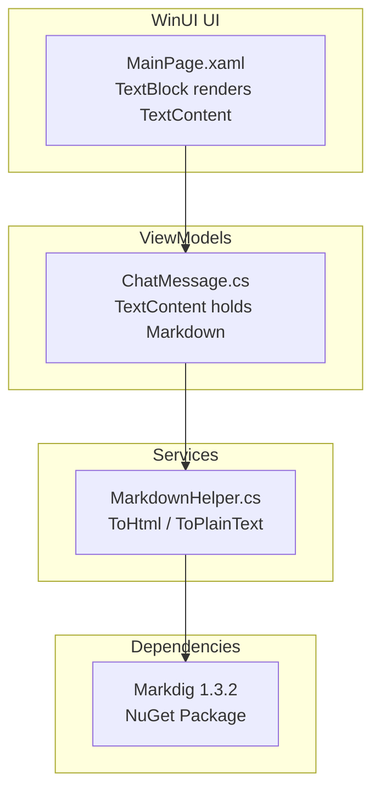
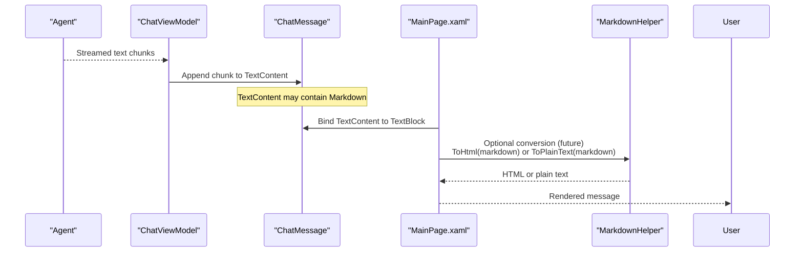
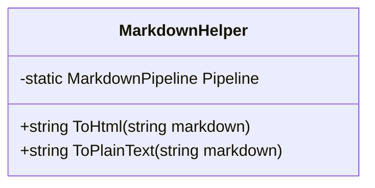
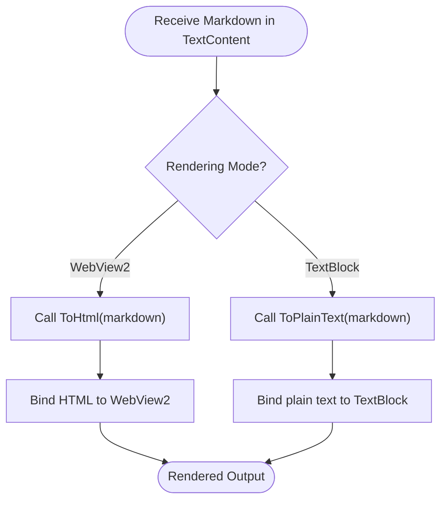
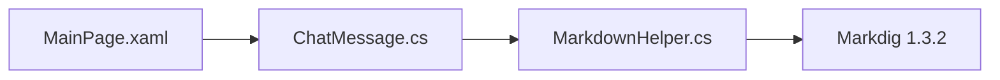

# Markdown Helper API

<cite>
**Referenced Files in This Document**
- [MarkdownHelper.cs](file://Agentic.Desktop/Agentic.Desktop/Services/MarkdownHelper.cs)
- [ChatMessage.cs](file://Agentic.Desktop/Agentic.Desktop/ViewModels/Messages/ChatMessage.cs)
- [MainPage.xaml](file://Agentic.Desktop/Agentic.Desktop/MainPage.xaml)
- [Agentic.Desktop.csproj](file://Agentic.Desktop/Agentic.Desktop/Agentic.Desktop.csproj)
</cite>

## Table of Contents
1. [Introduction](#introduction)
2. [Project Structure](#project-structure)
3. [Core Components](#core-components)
4. [Architecture Overview](#architecture-overview)
5. [Detailed Component Analysis](#detailed-component-analysis)
6. [Dependency Analysis](#dependency-analysis)
7. [Performance Considerations](#performance-considerations)
8. [Troubleshooting Guide](#troubleshooting-guide)
9. [Conclusion](#conclusion)
10. [Appendices](#appendices)

## Introduction
This document provides detailed API documentation for the MarkdownHelper service used to render Markdown content with high performance via the Markdig library. It explains how to convert Markdown text to HTML and plain text, outlines configuration options for the Markdig pipeline, addresses security considerations for user-generated content, and offers guidance on performance optimization and future integration with a WebView2-based renderer. It also includes examples of rendering Markdown from agent responses and handling unsupported syntax gracefully.

## Project Structure
The MarkdownHelper is implemented as a static utility class within the Services layer. The chat UI currently displays raw text; comments indicate that HTML output can be used with a future WebView2 integration.

**Diagram sources**
- [MainPage.xaml:29-45](file://Agentic.Desktop/Agentic.Desktop/MainPage.xaml#L29-L45)
- [ChatMessage.cs:1-39](file://Agentic.Desktop/Agentic.Desktop/ViewModels/Messages/ChatMessage.cs#L1-L39)
- [MarkdownHelper.cs:1-52](file://Agentic.Desktop/Agentic.Desktop/Services/MarkdownHelper.cs#L1-L52)
- [Agentic.Desktop.csproj:53-53](file://Agentic.Desktop/Agentic.Desktop/Agentic.Desktop.csproj#L53-L53)

**Section sources**
- [MarkdownHelper.cs:1-52](file://Agentic.Desktop/Agentic.Desktop/Services/MarkdownHelper.cs#L1-L52)
- [ChatMessage.cs:1-39](file://Agentic.Desktop/Agentic.Desktop/ViewModels/Messages/ChatMessage.cs#L1-L39)
- [MainPage.xaml:29-45](file://Agentic.Desktop/Agentic.Desktop/MainPage.xaml#L29-L45)
- [Agentic.Desktop.csproj:53-53](file://Agentic.Desktop/Agentic.Desktop/Agentic.Desktop.csproj#L53-L53)

## Core Components
MarkdownHelper exposes two primary methods:
- ToHtml(string markdown): Converts Markdown to HTML using a prebuilt Markdig pipeline configured with advanced extensions.
- ToPlainText(string markdown): Strips common Markdown formatting markers to produce plain text suitable for current TextBlock rendering.

Key characteristics:
- Uses a static MarkdownPipeline instance built once at class load time for performance.
- Handles null or whitespace-only input by returning an empty string.
- Provides a temporary plain-text fallback until WebView2 is integrated.

**Section sources**
- [MarkdownHelper.cs:12-25](file://Agentic.Desktop/Agentic.Desktop/Services/MarkdownHelper.cs#L12-L25)
- [MarkdownHelper.cs:31-50](file://Agentic.Desktop/Agentic.Desktop/Services/MarkdownHelper.cs#L31-L50)

## Architecture Overview
At runtime, agent responses are streamed into ChatMessage.TextContent. Currently, the UI binds directly to this property and displays raw text. The MarkdownHelper is intended to be used to transform Markdown into either HTML (for future WebView2 rendering) or plain text (current approach).

**Diagram sources**
- [ChatMessage.cs:16-30](file://Agentic.Desktop/Agentic.Desktop/ViewModels/Messages/ChatMessage.cs#L16-L30)
- [MainPage.xaml:29-45](file://Agentic.Desktop/Agentic.Desktop/MainPage.xaml#L29-L45)
- [MarkdownHelper.cs:19-25](file://Agentic.Desktop/Agentic.Desktop/Services/MarkdownHelper.cs#L19-L25)

## Detailed Component Analysis

### MarkdownHelper API
MarkdownHelper is a static class with two public methods:
- ToHtml(string markdown) -> string
  - Returns empty string for null/whitespace input.
  - Uses Markdig.Markdown.ToHtml with a shared MarkdownPipeline configured via UseAdvancedExtensions().
- ToPlainText(string markdown) -> string
  - Returns empty string for null/whitespace input.
  - Applies regex-based stripping of headings, bold/italic markers, code blocks, inline code, and link markers.

**Diagram sources**
- [MarkdownHelper.cs:10-25](file://Agentic.Desktop/Agentic.Desktop/Services/MarkdownHelper.cs#L10-L25)
- [MarkdownHelper.cs:31-50](file://Agentic.Desktop/Agentic.Desktop/Services/MarkdownHelper.cs#L31-L50)

**Section sources**
- [MarkdownHelper.cs:12-25](file://Agentic.Desktop/Agentic.Desktop/Services/MarkdownHelper.cs#L12-L25)
- [MarkdownHelper.cs:31-50](file://Agentic.Desktop/Agentic.Desktop/Services/MarkdownHelper.cs#L31-L50)

### Integration Points and Usage Guidance
- Current UI binding:
  - MainPage.xaml binds TextContent directly to TextBlock, showing raw Markdown.
  - Comments in ChatMessage.cs indicate MarkdownHelper should be used to convert to HTML for WebView2 or plain text for current TextBlock.
- Suggested usage patterns:
  - For rich rendering: Convert TextContent to HTML via ToHtml and display in WebView2 when available.
  - For simple rendering: Convert TextContent to plain text via ToPlainText and bind to TextBlock.

**Diagram sources**
- [MainPage.xaml:29-45](file://Agentic.Desktop/Agentic.Desktop/MainPage.xaml#L29-L45)
- [ChatMessage.cs:8-12](file://Agentic.Desktop/Agentic.Desktop/ViewModels/Messages/ChatMessage.cs#L8-L12)
- [MarkdownHelper.cs:19-25](file://Agentic.Desktop/Agentic.Desktop/Services/MarkdownHelper.cs#L19-L25)
- [MarkdownHelper.cs:31-50](file://Agentic.Desktop/Agentic.Desktop/Services/MarkdownHelper.cs#L31-L50)

**Section sources**
- [MainPage.xaml:29-45](file://Agentic.Desktop/Agentic.Desktop/MainPage.xaml#L29-L45)
- [ChatMessage.cs:8-12](file://Agentic.Desktop/Agentic.Desktop/ViewModels/Messages/ChatMessage.cs#L8-L12)

## Dependency Analysis
MarkdownHelper depends on the Markdig library for parsing and HTML generation. The project references Markdig version 1.3.2.

**Diagram sources**
- [MarkdownHelper.cs:1-1](file://Agentic.Desktop/Agentic.Desktop/Services/MarkdownHelper.cs#L1-L1)
- [Agentic.Desktop.csproj:53-53](file://Agentic.Desktop/Agentic.Desktop/Agentic.Desktop.csproj#L53-L53)
- [ChatMessage.cs:1-39](file://Agentic.Desktop/Agentic.Desktop/ViewModels/Messages/ChatMessage.cs#L1-L39)
- [MainPage.xaml:29-45](file://Agentic.Desktop/Agentic.Desktop/MainPage.xaml#L29-L45)

**Section sources**
- [Agentic.Desktop.csproj:53-53](file://Agentic.Desktop/Agentic.Desktop/Agentic.Desktop.csproj#L53-L53)
- [MarkdownHelper.cs:1-1](file://Agentic.Desktop/Agentic.Desktop/Services/MarkdownHelper.cs#L1-L1)

## Performance Considerations
- Pipeline reuse: A single MarkdownPipeline is created statically and reused across calls, minimizing overhead.
- Input validation: Early return for null/whitespace avoids unnecessary processing.
- Regex-based plain text stripping: Simple transformations are applied sequentially; consider batching or optimizing if large volumes of content are processed frequently.
- Future enhancements:
  - Introduce caching for repeated Markdown inputs to avoid redundant conversions.
  - Offload heavy conversions to background threads and marshal results back to the UI thread.
  - When integrating WebView2, consider incremental updates and virtualization to reduce layout costs.

[No sources needed since this section provides general guidance]

## Troubleshooting Guide
- Empty output:
  - If ToHtml or ToPlainText returns an empty string, verify that the input is not null or whitespace.
- Unexpected plain text:
  - Ensure ToPlainText is used only when displaying in TextBlock; otherwise use ToHtml for rich rendering.
- Rendering issues in UI:
  - Confirm that the UI binding uses the converted output (HTML for WebView2 or plain text for TextBlock).
- Unsupported Markdown features:
  - The current pipeline enables advanced extensions; if additional features are required, extend the pipeline configuration accordingly.

**Section sources**
- [MarkdownHelper.cs:19-25](file://Agentic.Desktop/Agentic.Desktop/Services/MarkdownHelper.cs#L19-L25)
- [MarkdownHelper.cs:31-50](file://Agentic.Desktop/Agentic.Desktop/Services/MarkdownHelper.cs#L31-L50)

## Conclusion
MarkdownHelper provides a concise, high-performance interface for converting Markdown to HTML and plain text using Markdig. While the current UI displays raw text, the service is designed to support future WebView2 integration for rich rendering. By leveraging a shared pipeline, validating inputs, and considering caching and offloading strategies, the application can efficiently handle Markdown content from agent responses while maintaining responsiveness and security.

[No sources needed since this section summarizes without analyzing specific files]

## Appendices

### API Reference Summary
- MarkdownHelper.ToHtml(string markdown) -> string
  - Purpose: Convert Markdown to HTML using Markdig with advanced extensions.
  - Behavior: Returns empty string for null/whitespace input.
- MarkdownHelper.ToPlainText(string markdown) -> string
  - Purpose: Strip Markdown formatting markers to produce plain text.
  - Behavior: Returns empty string for null/whitespace input.

**Section sources**
- [MarkdownHelper.cs:19-25](file://Agentic.Desktop/Agentic.Desktop/Services/MarkdownHelper.cs#L19-L25)
- [MarkdownHelper.cs:31-50](file://Agentic.Desktop/Agentic.Desktop/Services/MarkdownHelper.cs#L31-L50)

### Example Scenarios
- Rendering Markdown from agent responses:
  - Use ToHtml when integrating WebView2 for rich rendering.
  - Use ToPlainText for current TextBlock display.
- Customizing rendering behavior:
  - Extend the MarkdownPipeline configuration to enable additional Markdig extensions as needed.
- Handling unsupported syntax gracefully:
  - Rely on Markdig’s robust parsing; for custom behaviors, preprocess Markdown before conversion.

**Section sources**
- [ChatMessage.cs:8-12](file://Agentic.Desktop/Agentic.Desktop/ViewModels/Messages/ChatMessage.cs#L8-L12)
- [MarkdownHelper.cs:12-14](file://Agentic.Desktop/Agentic.Desktop/Services/MarkdownHelper.cs#L12-L14)