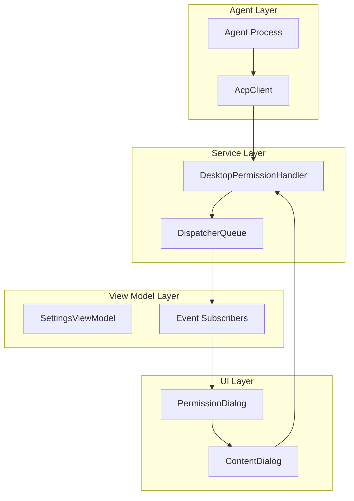
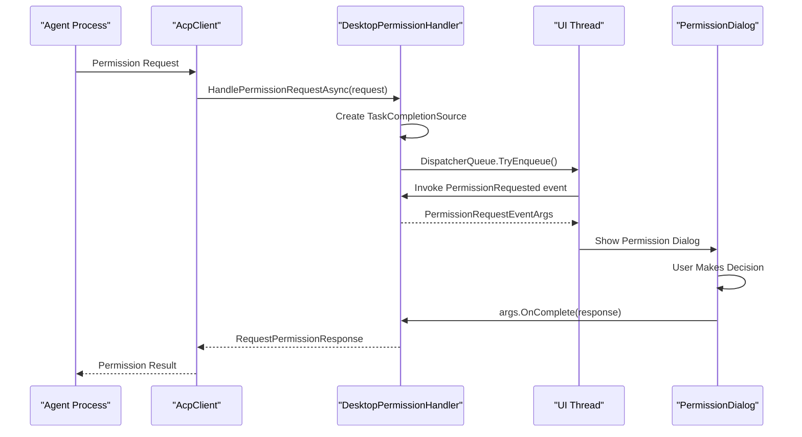
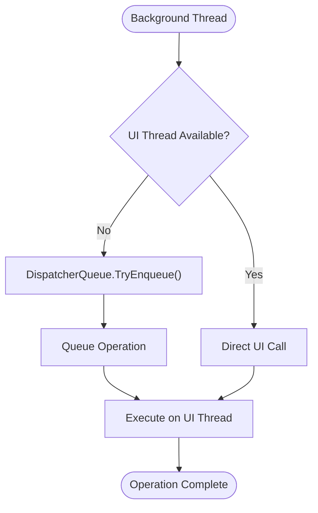

# Permission Handler API

<cite>
**Referenced Files in This Document**
- [PermissionHandler.cs](file://Agentic.Desktop/Services/PermissionHandler.cs)
- [PermissionDialog.xaml](file://Agentic.Desktop/Views/PermissionDialog.xaml)
- [PermissionDialog.xaml.cs](file://Agentic.Desktop/Views/PermissionDialog.xaml.cs)
- [SettingsPage.xaml.cs](file://Agentic.Desktop/SettingsPage.xaml.cs)
- [App.xaml.cs](file://Agentic.Desktop/App.xaml.cs)
</cite>

## Table of Contents
1. [Introduction](#introduction)
2. [Architecture Overview](#architecture-overview)
3. [Core Components](#core-components)
4. [DesktopPermissionHandler Implementation](#desktoppermissionhandler-implementation)
5. [Event-Driven Architecture](#event-driven-architecture)
6. [UI Thread Marshaling](#ui-thread-marshaling)
7. [Permission Dialog Implementation](#permission-dialog-implementation)
8. [MVVM Integration Pattern](#mvvm-integration-pattern)
9. [Error Handling and Cancellation](#error-handling-and-cancellation)
10. [Usage Examples](#usage-examples)
11. [Performance Considerations](#performance-considerations)
12. [Troubleshooting Guide](#troubleshooting-guide)

## Introduction

The Permission Handler API provides a sophisticated event-driven architecture for managing user permissions in the Agentic Desktop application. It implements a clean separation between business logic and UI concerns, leveraging the MVVM pattern to handle permission requests from the agent through a user-friendly dialog interface.

The system is built around the `IPermissionHandler` interface, with `DesktopPermissionHandler` serving as the concrete implementation that bridges the gap between background operations and UI thread execution using WinUI 3's `DispatcherQueue`.

## Architecture Overview

The permission handling system follows an event-driven architecture that separates concerns across multiple layers:



**Diagram sources**
- [PermissionHandler.cs:11-44](file://Agentic.Desktop/Services/PermissionHandler.cs#L11-L44)
- [SettingsPage.xaml.cs:23-34](file://Agentic.Desktop/SettingsPage.xaml.cs#L23-L34)

## Core Components

### DesktopPermissionHandler Class

The `DesktopPermissionHandler` class serves as the central orchestrator for permission requests, implementing the `IPermissionHandler` interface and providing the core functionality for handling permission dialogs.

#### Key Responsibilities:
- **Request Processing**: Handles incoming permission requests from the agent
- **UI Thread Marshaling**: Ensures UI operations execute on the correct thread
- **Event Broadcasting**: Notifies subscribers when permission dialogs are needed
- **Response Management**: Manages the lifecycle of permission responses

#### Constructor Parameters:
- `dispatcherQueue`: The `DispatcherQueue` instance used for UI thread marshaling

**Section sources**
- [PermissionHandler.cs:21-24](file://Agentic.Desktop/Services/PermissionHandler.cs#L21-L24)

### PermissionRequestEventArgs Structure

The `PermissionRequestEventArgs` class encapsulates all information needed to process a permission request and complete the response cycle.

#### Properties:
- `Request`: The original `RequestPermissionRequest` object containing permission details
- `OnComplete`: Action delegate to signal completion with the final response

**Section sources**
- [PermissionHandler.cs:47-51](file://Agentic.Desktop/Services/PermissionHandler.cs#L47-L51)

## DesktopPermissionHandler Implementation

### HandlePermissionRequestAsync Method

This is the primary entry point for processing permission requests. It implements an asynchronous pattern that bridges background operations with UI interactions.

#### Method Signature:
```csharp
public async Task<RequestPermissionResponse> HandlePermissionRequestAsync(
    RequestPermissionRequest request, 
    CancellationToken ct = default)
```

#### Parameters:
- `request`: Contains the permission details including tool call information and available options
- `ct`: Optional cancellation token for supporting operation cancellation

#### Return Value:
- `Task<RequestPermissionResponse>`: A task that completes when the user has made their decision

#### Processing Flow:
1. Creates a `TaskCompletionSource` to manage the asynchronous response
2. Constructs `PermissionRequestEventArgs` with the request and completion callback
3. Dispatches the permission request to the UI thread via `DispatcherQueue`
4. Waits for the user's response through the completion callback

**Section sources**
- [PermissionHandler.cs:26-44](file://Agentic.Desktop/Services/PermissionHandler.cs#L26-L44)

### PermissionRequested Event

The `PermissionRequested` event serves as the bridge between the permission handler and UI components. It uses a functional event pattern that allows for flexible subscription and handling.

#### Event Signature:
```csharp
public event Func<PermissionRequestEventArgs, Task>? PermissionRequested;
```

#### Event Characteristics:
- **Asynchronous**: Returns a `Task` allowing for async operations in handlers
- **Nullable**: Supports scenarios where no subscribers are present
- **Flexible**: Allows multiple subscribers to handle the same event

**Section sources**
- [PermissionHandler.cs:19](file://Agentic.Desktop/Services/PermissionHandler.cs#L19)

## Event-Driven Architecture

The permission system leverages a sophisticated event-driven architecture that promotes loose coupling and high cohesion:



**Diagram sources**
- [PermissionHandler.cs:26-44](file://Agentic.Desktop/Services/PermissionHandler.cs#L26-L44)
- [SettingsPage.xaml.cs:24-33](file://Agentic.Desktop/SettingsPage.xaml.cs#L24-L33)

## UI Thread Marshaling

The system ensures proper UI thread marshaling through WinUI 3's `DispatcherQueue`, which is essential for preventing cross-thread exceptions and maintaining UI responsiveness.

### DispatcherQueue Usage:
- **Initialization**: Obtained from `App.DispatcherQueue` during application startup
- **Marshaling**: Uses `TryEnqueue()` to safely marshal UI operations
- **Thread Safety**: Prevents cross-thread UI access violations

### Thread Context Management:


**Diagram sources**
- [PermissionHandler.cs:37-41](file://Agentic.Desktop/Services/PermissionHandler.cs#L37-L41)
- [App.xaml.cs:74](file://Agentic.Desktop/App.xaml.cs#L74)

## Permission Dialog Implementation

The `PermissionDialog` provides a user-friendly interface for presenting permission requests and collecting user decisions.

### Dialog Features:
- **Dynamic Content**: Displays tool call information and available permission options
- **User Interaction**: Supports both button selection and standard dialog actions
- **Localization**: Integrates with the application's localization system
- **Accessibility**: Includes automation properties for screen readers

### Dialog Lifecycle:
1. **Initialization**: Receives `RequestPermissionRequest` and sets up UI elements
2. **Display**: Shows as a `ContentDialog` with appropriate styling
3. **Interaction**: Captures user input through buttons or dialog actions
4. **Completion**: Sets the result and closes the dialog

**Section sources**
- [PermissionDialog.xaml.cs:15-50](file://Agentic.Desktop/Views/PermissionDialog.xaml.cs#L15-L50)

## MVVM Integration Pattern

The permission handler integrates seamlessly with the MVVM pattern through careful separation of concerns:

### ViewModel Responsibilities:
- **Event Subscription**: Subscribes to `PermissionRequested` events
- **UI Orchestration**: Manages dialog display and user interaction
- **State Management**: Maintains connection state and dialog lifecycle

### View Responsibilities:
- **Presentation**: Renders the permission dialog with appropriate styling
- **User Input**: Captures user decisions through interactive elements
- **Data Binding**: Binds permission data to UI elements

### Service Responsibilities:
- **Request Processing**: Handles permission request logic
- **Threading**: Manages UI thread marshaling
- **Event Coordination**: Coordinates between services and UI components

**Section sources**
- [SettingsPage.xaml.cs:23-34](file://Agentic.Desktop/SettingsPage.xaml.cs#L23-L34)

## Error Handling and Cancellation

The permission system implements robust error handling and cancellation support:

### Error Handling Patterns:
- **Null Safety**: Checks for null event subscribers before invocation
- **Exception Isolation**: Wraps UI operations in try-catch blocks
- **Graceful Degradation**: Provides fallback behavior when dialogs fail

### Cancellation Support:
- **CancellationToken**: Accepts optional cancellation tokens in async methods
- **Resource Cleanup**: Properly disposes of resources when operations are cancelled
- **State Consistency**: Maintains consistent state even when operations are cancelled

### Exception Scenarios:
- **Cross-thread Operations**: Handled through proper dispatcher usage
- **Dialog Dismissal**: Managed through dialog lifecycle events
- **Network Failures**: Handled at the client layer above the permission handler

## Usage Examples

### Basic Setup and Subscription:

```csharp
// In your view model or page constructor
var permHandler = new DesktopPermissionHandler(App.DispatcherQueue);

permHandler.PermissionRequested += async args =>
{
    // Create and show the permission dialog
    var dialog = new PermissionDialog(args.Request)
    {
        XamlRoot = App.Window.Content.XamlRoot
    };
    
    await dialog.ShowAsync();
    
    // Complete the permission request with the dialog result
    args.OnComplete(await dialog.Result);
};
```

### Advanced Usage with Error Handling:

```csharp
try
{
    var response = await permHandler.HandlePermissionRequestAsync(
        request, 
        cancellationToken);
    
    switch (response.Outcome)
    {
        case PermissionOutcome.Selected selected:
            // Handle selected option
            break;
        case PermissionOutcome.Cancelled:
            // Handle cancellation
            break;
    }
}
catch (OperationCanceledException)
{
    // Handle cancellation
}
catch (Exception ex)
{
    // Log and handle unexpected errors
}
```

### MVVM Integration Pattern:

```csharp
// In your ViewModel
private void InitializePermissionHandler()
{
    var permHandler = new DesktopPermissionHandler(App.DispatcherQueue);
    permHandler.PermissionRequested += HandlePermissionRequest;
    
    // Store reference for cleanup
    _permissionHandler = permHandler;
}

private async Task HandlePermissionRequest(PermissionRequestEventArgs args)
{
    try
    {
        var dialog = new PermissionDialog(args.Request)
        {
            XamlRoot = App.Window.Content.XamlRoot
        };
        
        await dialog.ShowAsync();
        args.OnComplete(await dialog.Result);
    }
    catch (Exception ex)
    {
        // Log error and provide user feedback
        await ShowErrorMessage("Failed to show permission dialog");
    }
}
```

**Section sources**
- [SettingsPage.xaml.cs:23-34](file://Agentic.Desktop/SettingsPage.xaml.cs#L23-L34)

## Performance Considerations

### Memory Management:
- **Event Unsubscription**: Ensure proper unsubscription to prevent memory leaks
- **Dialog Lifecycle**: Dispose of dialog instances appropriately
- **Task Completion**: Use `TrySetResult` to avoid unnecessary allocations

### Threading Performance:
- **Dispatcher Efficiency**: Minimize dispatcher calls by batching UI updates
- **Async/Await**: Use asynchronous patterns to maintain UI responsiveness
- **Resource Pooling**: Reuse common objects where possible

### UI Responsiveness:
- **Non-blocking Operations**: Keep UI thread free for user interactions
- **Progress Feedback**: Provide visual feedback during long-running operations
- **Lazy Loading**: Load dialog content only when needed

## Troubleshooting Guide

### Common Issues and Solutions:

#### Cross-thread Exceptions:
**Problem**: `InvalidOperationException` when accessing UI from background threads
**Solution**: Always use `DispatcherQueue.TryEnqueue()` for UI operations

#### Memory Leaks:
**Problem**: Application memory grows over time
**Solution**: Ensure proper event unsubscription and resource disposal

#### Dialog Not Showing:
**Problem**: Permission dialog doesn't appear
**Solution**: Verify `XamlRoot` is set correctly and dispatcher queue is valid

#### Cancellation Not Working:
**Problem**: Operations continue after cancellation
**Solution**: Check cancellation token propagation and implement proper cancellation checks

### Debugging Tips:
- **Logging**: Add detailed logging around permission request flow
- **Breakpoints**: Set breakpoints in event handlers and dialog methods
- **Memory Profiling**: Use Visual Studio memory profiler to identify leaks
- **Thread Analysis**: Monitor thread context switches and UI responsiveness

### Performance Monitoring:
- **UI Responsiveness**: Track frame rates and UI thread blocking
- **Memory Usage**: Monitor heap growth and garbage collection frequency
- **Event Frequency**: Count permission requests per session
- **Dialog Duration**: Measure time from request to completion

**Section sources**
- [PermissionHandler.cs:37-41](file://Agentic.Desktop/Services/PermissionHandler.cs#L37-L41)
- [PermissionDialog.xaml.cs:26-49](file://Agentic.Desktop/Views/PermissionDialog.xaml.cs#L26-L49)