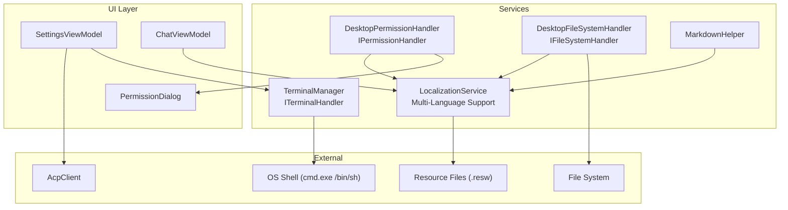
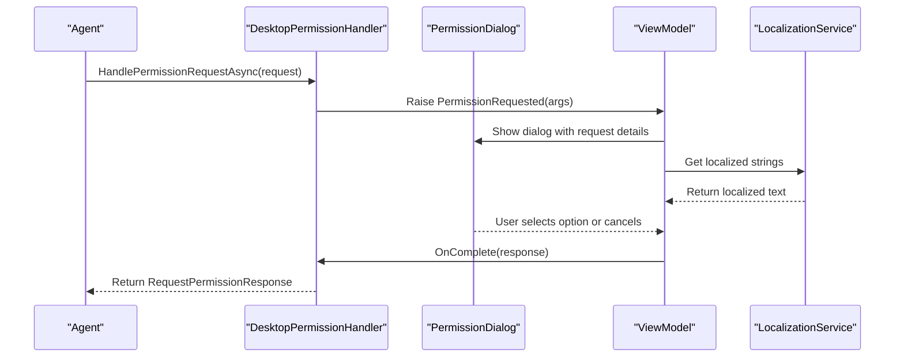
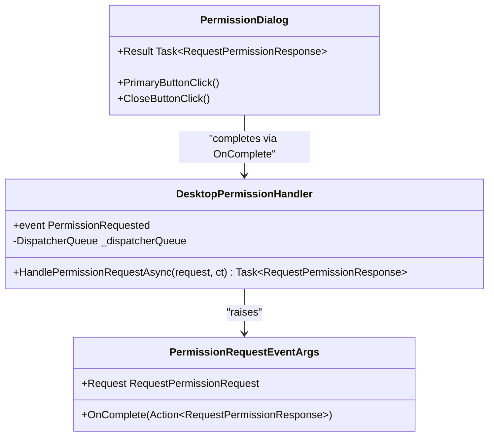
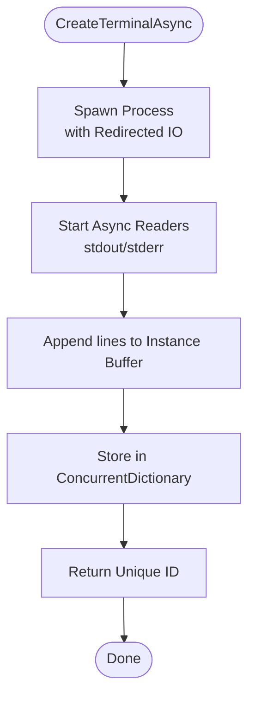
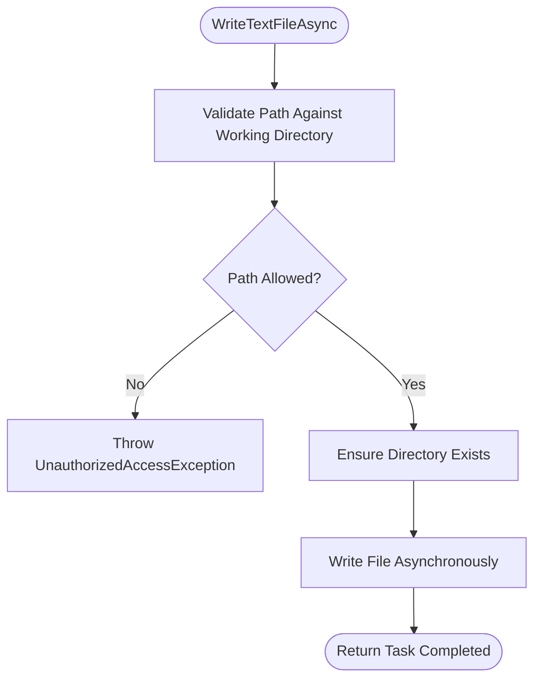
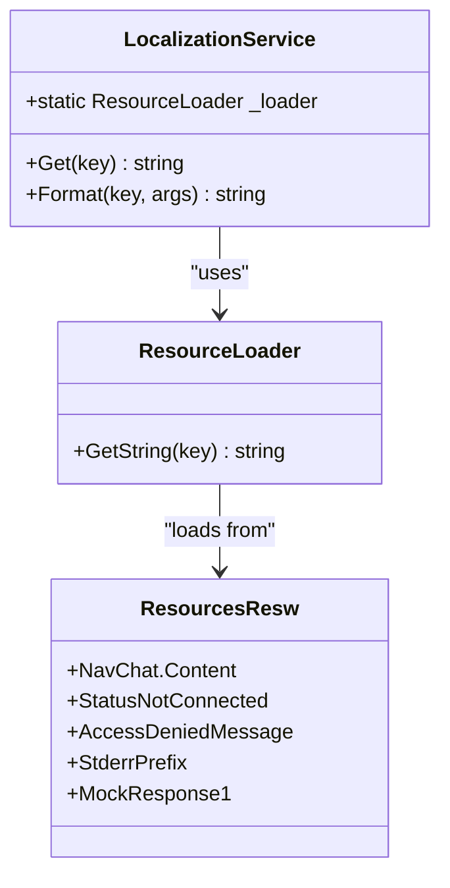
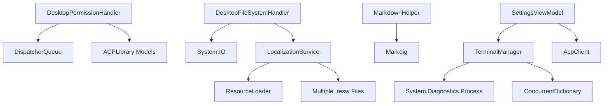

# Services API

<cite>
**Referenced Files in This Document**
- [PermissionHandler.cs](file://Agentic.Desktop/Services/PermissionHandler.cs)
- [TerminalManager.cs](file://Agentic.Desktop/Services/TerminalManager.cs)
- [FileSystemHandler.cs](file://Agentic.Desktop/Services/FileSystemHandler.cs)
- [LocalizationService.cs](file://Agentic.Desktop/Services/LocalizationService.cs)
- [MarkdownHelper.cs](file://Agentic.Desktop/Services/MarkdownHelper.cs)
- [SettingsViewModel.cs](file://Agentic.Desktop/ViewModels/SettingsViewModel.cs)
- [ChatViewModel.cs](file://Agentic.Desktop/ViewModels/ChatViewModel.cs)
- [PermissionDialog.xaml.cs](file://Agentic.Desktop/Views/PermissionDialog.xaml.cs)
- [Resources.resw](file://Agentic.Desktop/Strings/en/Resources.resw)
- [Resources.resw](file://Agentic.Desktop/Strings/zh-CN/Resources.resw)
- [Resources.resw](file://Agentic.Desktop/Strings/zh-TW/Resources.resw)
- [Resources.resw](file://Agentic.Desktop/Strings/ja/Resources.resw)
</cite>

## Update Summary
**Changes Made**
- Enhanced LocalizationService documentation with comprehensive multi-language support details
- Added detailed coverage of the four supported languages (English, Simplified Chinese, Traditional Chinese, Japanese)
- Updated integration examples to show proper usage patterns for both Get() and Format() methods
- Expanded resource file structure documentation with specific key categories
- Enhanced troubleshooting section with localization-specific guidance

## Table of Contents
1. [Introduction](#introduction)
2. [Project Structure](#project-structure)
3. [Core Components](#core-components)
4. [Architecture Overview](#architecture-overview)
5. [Detailed Component Analysis](#detailed-component-analysis)
6. [Dependency Analysis](#dependency-analysis)
7. [Performance Considerations](#performance-considerations)
8. [Troubleshooting Guide](#troubleshooting-guide)
9. [Conclusion](#conclusion)

## Introduction
This document provides comprehensive API documentation for Agentic.Desktop's service layer interfaces and implementations. It focuses on:
- IPermissionHandler implementation for permission request handling with an event-driven architecture and UI thread marshaling.
- ITerminalHandler implementation for concurrent terminal process management, unique IDs, and asynchronous output streaming.
- IFileSystemHandler implementation for secure file operations with path validation and working directory isolation.
- **Enhanced LocalizationService for comprehensive multi-language support across four languages.**
- MarkdownHelper for content rendering (HTML and plain text).

Each section includes parameter specifications, return values, error handling patterns, and integration examples.

## Project Structure
The services reside under the Services folder and are consumed by ViewModels and Views. The key files involved in this API surface are:
- PermissionHandler.cs: DesktopPermissionHandler implements IPermissionHandler and raises events to show a UI dialog.
- TerminalManager.cs: TerminalManager implements ITerminalHandler and manages multiple terminal processes concurrently.
- FileSystemHandler.cs: DesktopFileSystemHandler implements IFileSystemHandler with strict path validation.
- **LocalizationService.cs: Static helper to load localized strings from .resw resources with support for four languages.**
- MarkdownHelper.cs: Utility to convert Markdown to HTML or plain text.
- SettingsViewModel.cs: Wires up AcpClient, TerminalManager, and session lifecycle.
- ChatViewModel.cs: Uses localization and orchestrates agent interactions.
- PermissionDialog.xaml.cs: UI dialog that resolves permission outcomes.
- **Resources.resw files: Localized string keys organized by language and functionality category.**

**Diagram sources**
- [PermissionHandler.cs:11-44](file://Agentic.Desktop/Services/PermissionHandler.cs#L11-L44)
- [TerminalManager.cs:11-135](file://Agentic.Desktop/Services/TerminalManager.cs#L11-L135)
- [FileSystemHandler.cs:8-41](file://Agentic.Desktop/Services/FileSystemHandler.cs#L8-L41)
- [LocalizationService.cs:8-22](file://Agentic.Desktop/Services/LocalizationService.cs#L8-L22)
- [MarkdownHelper.cs:10-51](file://Agentic.Desktop/Services/MarkdownHelper.cs#L10-L51)
- [SettingsViewModel.cs:100-113](file://Agentic.Desktop/ViewModels/SettingsViewModel.cs#L100-L113)
- [ChatViewModel.cs:109-111](file://Agentic.Desktop/ViewModels/ChatViewModel.cs#L109-L111)
- [PermissionDialog.xaml.cs:15-50](file://Agentic.Desktop/Views/PermissionDialog.xaml.cs#L15-L50)

**Section sources**
- [PermissionHandler.cs:1-52](file://Agentic.Desktop/Services/PermissionHandler.cs#L1-L52)
- [TerminalManager.cs:1-161](file://Agentic.Desktop/Services/TerminalManager.cs#L1-L161)
- [FileSystemHandler.cs:1-42](file://Agentic.Desktop/Services/FileSystemHandler.cs#L1-L42)
- [LocalizationService.cs:1-23](file://Agentic.Desktop/Services/LocalizationService.cs#L1-L23)
- [MarkdownHelper.cs:1-52](file://Agentic.Desktop/Services/MarkdownHelper.cs#L1-L52)
- [SettingsViewModel.cs:1-162](file://Agentic.Desktop/ViewModels/SettingsViewModel.cs#L1-L162)
- [ChatViewModel.cs:1-235](file://Agentic.Desktop/ViewModels/ChatViewModel.cs#L1-L235)
- [PermissionDialog.xaml.cs:1-64](file://Agentic.Desktop/Views/PermissionDialog.xaml.cs#L1-L64)
- [Resources.resw:160-222](file://Agentic.Desktop/Strings/en/Resources.resw#L160-L222)

## Core Components
- IPermissionHandler (implemented by DesktopPermissionHandler): Handles permission requests via an event and returns a response asynchronously. Marshals UI updates to the UI thread using DispatcherQueue.
- ITerminalHandler (implemented by TerminalManager): Creates and manages terminal processes, streams stdout/stderr asynchronously, supports unique IDs, waiting for exit, killing, and releasing terminals.
- IFileSystemHandler (implemented by DesktopFileSystemHandler): Provides secure read/write text file operations with path validation against a configured working directory.
- **LocalizationService: Comprehensive multi-language support with static ResourceLoader instance providing Get() and Format() methods for accessing localized strings from .resw resources across English, Simplified Chinese, Traditional Chinese, and Japanese.**
- MarkdownHelper: Converts Markdown to HTML or plain text; uses Markdig pipeline for HTML conversion and regex-based stripping for plain text.

**Section sources**
- [PermissionHandler.cs:11-44](file://Agentic.Desktop/Services/PermissionHandler.cs#L11-L44)
- [TerminalManager.cs:11-135](file://Agentic.Desktop/Services/TerminalManager.cs#L11-L135)
- [FileSystemHandler.cs:8-41](file://Agentic.Desktop/Services/FileSystemHandler.cs#L8-L41)
- [LocalizationService.cs:8-22](file://Agentic.Desktop/Services/LocalizationService.cs#L8-L22)
- [MarkdownHelper.cs:10-51](file://Agentic.Desktop/Services/MarkdownHelper.cs#L10-L51)

## Architecture Overview
The service layer integrates tightly with the UI and external systems:
- Permission flow: Agent requests permission → DesktopPermissionHandler raises PermissionRequested → ViewModel shows PermissionDialog → Dialog sets result → Handler completes Task.
- Terminal flow: CreateTerminalAsync spawns shell process → Streams stdout/stderr into per-terminal buffers → Consumers poll GetOutputAsync or wait for exit.
- File system flow: Read/Write methods validate paths against working directory → Throw UnauthorizedAccessException if outside bounds.
- **Localization flow: All user-facing messages use LocalizationService.Get/Format with resource keys defined in Resources.resw files, automatically selecting appropriate language based on system culture.**
- Markdown: Content rendered as HTML for WebView2 or stripped to plain text for TextBlock.

**Diagram sources**
- [PermissionHandler.cs:26-44](file://Agentic.Desktop/Services/PermissionHandler.cs#L26-L44)
- [PermissionDialog.xaml.cs:15-50](file://Agentic.Desktop/Views/PermissionDialog.xaml.cs#L15-L50)
- [LocalizationService.cs:15-21](file://Agentic.Desktop/Services/LocalizationService.cs#L15-L21)

## Detailed Component Analysis

### IPermissionHandler: DesktopPermissionHandler
Purpose:
- Bridges Agent permission requests to the UI via an event-driven pattern.
- Ensures UI interactions occur on the UI thread using DispatcherQueue.

Key behaviors:
- Exposes an event PermissionRequested carrying the request and a completion callback.
- HandlePermissionRequestAsync constructs a TaskCompletionSource, enqueues UI invocation, and awaits the response set by the UI.

Parameters:
- HandlePermissionRequestAsync(RequestPermissionRequest request, CancellationToken ct = default)
  - request: Contains tool call metadata and options for the permission prompt.
  - ct: Cancellation token for long-running operations.

Return value:
- Task<RequestPermissionResponse>: Outcome selected by the user or cancellation.

Error handling:
- If no subscriber handles PermissionRequested, the task will not complete; ensure ViewModel subscribes promptly.
- Cancellation is supported via ct but depends on UI completing the dialog.

Integration example:
- In ViewModel, subscribe to PermissionRequested, display PermissionDialog, and call args.OnComplete(response) when user interacts.

**Diagram sources**
- [PermissionHandler.cs:11-44](file://Agentic.Desktop/Services/PermissionHandler.cs#L11-L44)
- [PermissionDialog.xaml.cs:15-50](file://Agentic.Desktop/Views/PermissionDialog.xaml.cs#L15-L50)

**Section sources**
- [PermissionHandler.cs:11-44](file://Agentic.Desktop/Services/PermissionHandler.cs#L11-L44)
- [PermissionDialog.xaml.cs:15-50](file://Agentic.Desktop/Views/PermissionDialog.xaml.cs#L15-L50)

### ITerminalHandler: TerminalManager
Purpose:
- Manages multiple terminal processes concurrently with unique IDs.
- Streams stdout and stderr asynchronously into per-instance buffers.
- Supports waiting for exit, killing entire process trees, and releasing resources.

Key behaviors:
- CreateTerminalAsync(command, workingDirectory, ct): Spawns shell process, starts async readers for stdout/stderr, stores instance in ConcurrentDictionary, returns unique ID.
- GetOutputAsync(terminalId, ct): Returns current buffered output for the terminal.
- WaitForExitAsync(terminalId, ct): Waits for process exit and returns exit code.
- KillTerminalAsync(terminalId, ct): Kills process tree if still running.
- ReleaseTerminalAsync(terminalId, ct): Removes instance and disposes process.

Parameters:
- command: Shell command to execute.
- workingDirectory: Optional working directory; defaults to Environment.CurrentDirectory if null.
- ct: Cancellation token for async operations.

Return values:
- CreateTerminalAsync returns Task<string> with unique terminal ID.
- GetOutputAsync returns Task<string> with accumulated output.
- WaitForExitAsync returns Task<int> with exit code (-1 if not found).
- KillTerminalAsync and ReleaseTerminalAsync return Task.CompletedTask.

Error handling:
- OperationCanceledException is caught during stream reading.
- Exceptions during kill/release are swallowed to avoid failures during disposal.
- Non-existent terminal IDs return empty output or -1 exit code.

Integration example:
- SettingsViewModel creates TerminalManager and assigns it to AcpClient.TerminalHandler.
- Consumers can poll GetOutputAsync or await WaitForExitAsync to manage terminal lifecycle.

**Diagram sources**
- [TerminalManager.cs:16-68](file://Agentic.Desktop/Services/TerminalManager.cs#L16-L68)

**Section sources**
- [TerminalManager.cs:11-135](file://Agentic.Desktop/Services/TerminalManager.cs#L11-L135)
- [SettingsViewModel.cs:100-113](file://Agentic.Desktop/ViewModels/SettingsViewModel.cs#L100-L113)

### IFileSystemHandler: DesktopFileSystemHandler
Purpose:
- Provides secure file read/write operations constrained to a working directory.
- Validates paths to prevent access outside the allowed scope.

Key behaviors:
- ReadTextFileAsync(path, ct): Validates path, reads file contents asynchronously.
- WriteTextFileAsync(path, content, ct): Validates path, ensures directory exists, writes content asynchronously.

Parameters:
- path: Target file path; must resolve within the configured working directory.
- content: String content to write.
- ct: Cancellation token.

Return values:
- ReadTextFileAsync returns Task<string> with file contents.
- WriteTextFileAsync returns Task upon successful write.

Error handling:
- Throws UnauthorizedAccessException if path is outside working directory.
- Message formatted using LocalizationService.Format("AccessDeniedMessage", path).

Integration example:
- Configure DesktopFileSystemHandler with a specific working directory at startup.
- Use ReadTextFileAsync/WriteTextFileAsync throughout the application to enforce security boundaries.

**Diagram sources**
- [FileSystemHandler.cs:23-41](file://Agentic.Desktop/Services/FileSystemHandler.cs#L23-L41)

**Section sources**
- [FileSystemHandler.cs:8-41](file://Agentic.Desktop/Services/FileSystemHandler.cs#L8-L41)

### LocalizationService
**Updated** Comprehensive multi-language localization system supporting four languages with efficient resource loading and formatting capabilities.

Purpose:
- Centralizes access to localized strings from .resw resource files across multiple languages.
- Provides efficient caching through static ResourceLoader instance.
- Supports both simple string retrieval and parameterized string formatting.

Supported Languages:
- **English (en)**: Default language with complete resource coverage
- **Simplified Chinese (zh-CN)**: Full translation support for all UI elements
- **Traditional Chinese (zh-TW)**: Complete localization for traditional Chinese users
- **Japanese (ja)**: Comprehensive Japanese translations

Key behaviors:
- Get(key): Retrieves localized string by key using Windows.ApplicationModel.Resources.ResourceLoader.
- Format(key, params object[]): Formats localized string with provided arguments using standard string formatting.

Parameters:
- key: Resource key name (e.g., "StatusNotConnected", "AccessDeniedMessage", "StderrPrefix").
- args: Formatting arguments for parameterized strings (e.g., error messages, status updates).

Return values:
- Get returns string with localized content.
- Format returns formatted string with parameters applied.

Resource Key Categories:
- **Navigation**: NavChat.Content, NavSettings.Content, StatusText.Text
- **Status Messages**: StatusDisconnected, StatusConnecting, StatusConnected, StatusNotConnected
- **Chat Interface**: TypingIndicator.Text, ConnectHint.Text, InputTextBox.PlaceholderText
- **Settings Page**: SettingsAgentConfig.Text, SettingsAgentPathLabel.Text, SettingsWorkDirLabel.Text
- **Permission Dialog**: PermissionDialog.Title, PermissionDialog.PrimaryButtonText, PermissionDialog.CloseButtonText
- **Error Handling**: AccessDeniedMessage, ErrorPrefix, ToolCallPrefix
- **Mock Responses**: MockResponse1, MockResponse2, MockResponse3

Error handling:
- Missing keys may throw exceptions depending on ResourceLoader behavior; ensure keys exist in all Resources.resw files.
- Parameter formatting errors follow standard string.Format exception behavior.

Integration examples:
- Used across services for consistent user-facing messages (e.g., AccessDeniedMessage, StderrPrefix, StatusNotConnected).
- SettingsViewModel initializes connection status with LocalizationService.Get("StatusNotConnected").
- ChatViewModel formats error messages with LocalizationService.Format("ErrorPrefix", ex.Message).
- TerminalManager prefixes stderr output with LocalizationService.Get("StderrPrefix").

**Diagram sources**
- [LocalizationService.cs:8-22](file://Agentic.Desktop/Services/LocalizationService.cs#L8-L22)
- [Resources.resw:62-222](file://Agentic.Desktop/Strings/en/Resources.resw#L62-L222)

**Section sources**
- [LocalizationService.cs:8-22](file://Agentic.Desktop/Services/LocalizationService.cs#L8-L22)
- [Resources.resw:214-221](file://Agentic.Desktop/Strings/en/Resources.resw#L214-L221)
- [SettingsViewModel.cs:30](file://Agentic.Desktop/ViewModels/SettingsViewModel.cs#L30)
- [ChatViewModel.cs:141](file://Agentic.Desktop/ViewModels/ChatViewModel.cs#L141)
- [TerminalManager.cs:59](file://Agentic.Desktop/Services/TerminalManager.cs#L59)

### MarkdownHelper
Purpose:
- Converts Markdown to HTML for rich rendering or strips formatting for plain text display.

Key behaviors:
- ToHtml(markdown): Uses Markdig pipeline to convert Markdown to HTML.
- ToPlainText(markdown): Strips common Markdown markers to produce plain text.

Parameters:
- markdown: Input Markdown string.

Return values:
- ToHtml returns HTML string.
- ToPlainText returns cleaned plain text.

Error handling:
- Returns empty string for null/whitespace input.

Integration example:
- Use ToHtml for WebView2 rendering or ToPlainText for TextBlock fallback.

**Section sources**
- [MarkdownHelper.cs:10-51](file://Agentic.Desktop/Services/MarkdownHelper.cs#L10-L51)

## Dependency Analysis
- DesktopPermissionHandler depends on Microsoft.UI.Dispatching.DispatcherQueue for UI thread marshaling and on IPermissionHandler interface types from Agentic.ACPLibrary.Models.
- TerminalManager depends on System.Diagnostics.Process and System.Collections.Concurrent for process management and thread-safe storage.
- DesktopFileSystemHandler depends on System.IO for file operations and LocalizationService for error messages.
- **LocalizationService depends on Windows.ApplicationModel.Resources.ResourceLoader for efficient resource loading across multiple languages.**
- MarkdownHelper depends on Markdig library.
- SettingsViewModel wires TerminalManager to AcpClient and manages lifecycle.

**Diagram sources**
- [PermissionHandler.cs:1-4](file://Agentic.Desktop/Services/PermissionHandler.cs#L1-L4)
- [TerminalManager.cs:1-5](file://Agentic.Desktop/Services/TerminalManager.cs#L1-L5)
- [FileSystemHandler.cs:1-2](file://Agentic.Desktop/Services/FileSystemHandler.cs#L1-L2)
- [LocalizationService.cs:1-2](file://Agentic.Desktop/Services/LocalizationService.cs#L1-L2)
- [MarkdownHelper.cs:1](file://Agentic.Desktop/Services/MarkdownHelper.cs#L1)
- [SettingsViewModel.cs:1-10](file://Agentic.Desktop/ViewModels/SettingsViewModel.cs#L1-L10)

**Section sources**
- [PermissionHandler.cs:1-4](file://Agentic.Desktop/Services/PermissionHandler.cs#L1-L4)
- [TerminalManager.cs:1-5](file://Agentic.Desktop/Services/TerminalManager.cs#L1-L5)
- [FileSystemHandler.cs:1-2](file://Agentic.Desktop/Services/FileSystemHandler.cs#L1-L2)
- [LocalizationService.cs:1-2](file://Agentic.Desktop/Services/LocalizationService.cs#L1-L2)
- [MarkdownHelper.cs:1](file://Agentic.Desktop/Services/MarkdownHelper.cs#L1)
- [SettingsViewModel.cs:1-10](file://Agentic.Desktop/ViewModels/SettingsViewModel.cs#L1-L10)

## Performance Considerations
- TerminalManager streams stdout/stderr asynchronously; avoid blocking calls while polling GetOutputAsync.
- Use CancellationToken to cancel long-running operations where supported.
- DesktopFileSystemHandler performs synchronous path validation before async I/O; keep working directory configuration stable.
- **LocalizationService uses a static ResourceLoader instance for efficient resource caching across the application lifetime.**
- MarkdownHelper builds a reusable Markdig pipeline to avoid repeated initialization overhead.
- **Resource files are loaded on-demand by the Windows runtime, minimizing initial application startup time.**

## Troubleshooting Guide
Common issues and resolutions:
- Permission dialog does not appear: Ensure ViewModel subscribes to PermissionRequested and displays PermissionDialog promptly.
- Terminal output missing: Verify stdout/stderr redirection and check for OperationCanceledException during stream reading.
- UnauthorizedAccessException on file operations: Confirm path resolves within the configured working directory.
- **Localization errors: Verify resource keys exist in all Resources.resw files (en, zh-CN, zh-TW, ja) and match exact casing.**
- **Missing translations: Check that all required keys are present in each language's Resources.resw file.**
- **Parameter formatting issues: Ensure Format() method receives correct number and type of parameters matching the resource string format.**

**Section sources**
- [PermissionHandler.cs:26-44](file://Agentic.Desktop/Services/PermissionHandler.cs#L26-L44)
- [TerminalManager.cs:39-64](file://Agentic.Desktop/Services/TerminalManager.cs#L39-L64)
- [FileSystemHandler.cs:32-41](file://Agentic.Desktop/Services/FileSystemHandler.cs#L32-L41)
- [LocalizationService.cs:15-21](file://Agentic.Desktop/Services/LocalizationService.cs#L15-L21)
- [Resources.resw:214-221](file://Agentic.Desktop/Strings/en/Resources.resw#L214-L221)

## Conclusion
Agentic.Desktop's service layer provides robust, secure, and user-friendly abstractions for permissions, terminal management, file operations, **comprehensive multi-language localization**, and Markdown rendering. The enhanced LocalizationService enables seamless internationalization across four languages with efficient resource management. By adhering to the documented APIs and integration patterns, developers can extend functionality while maintaining safety, usability, and global accessibility.