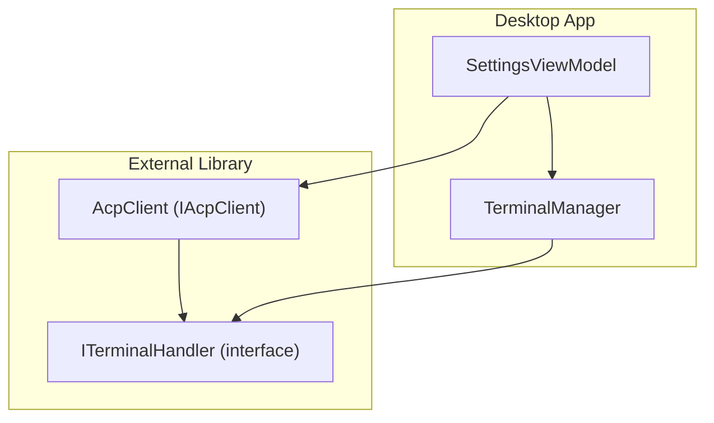
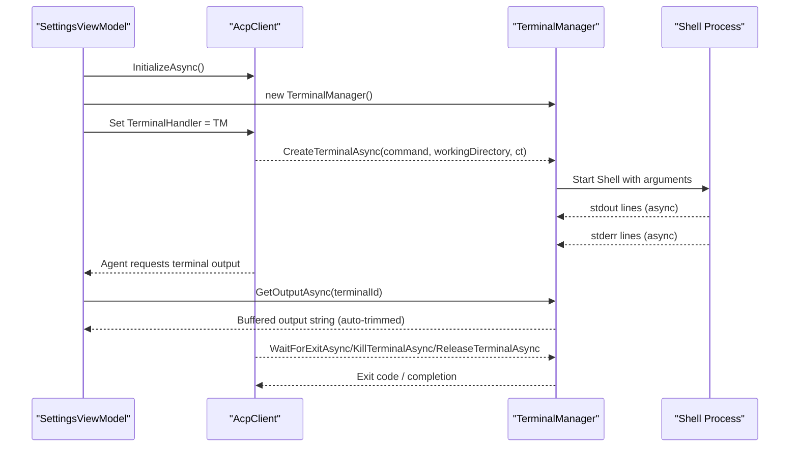
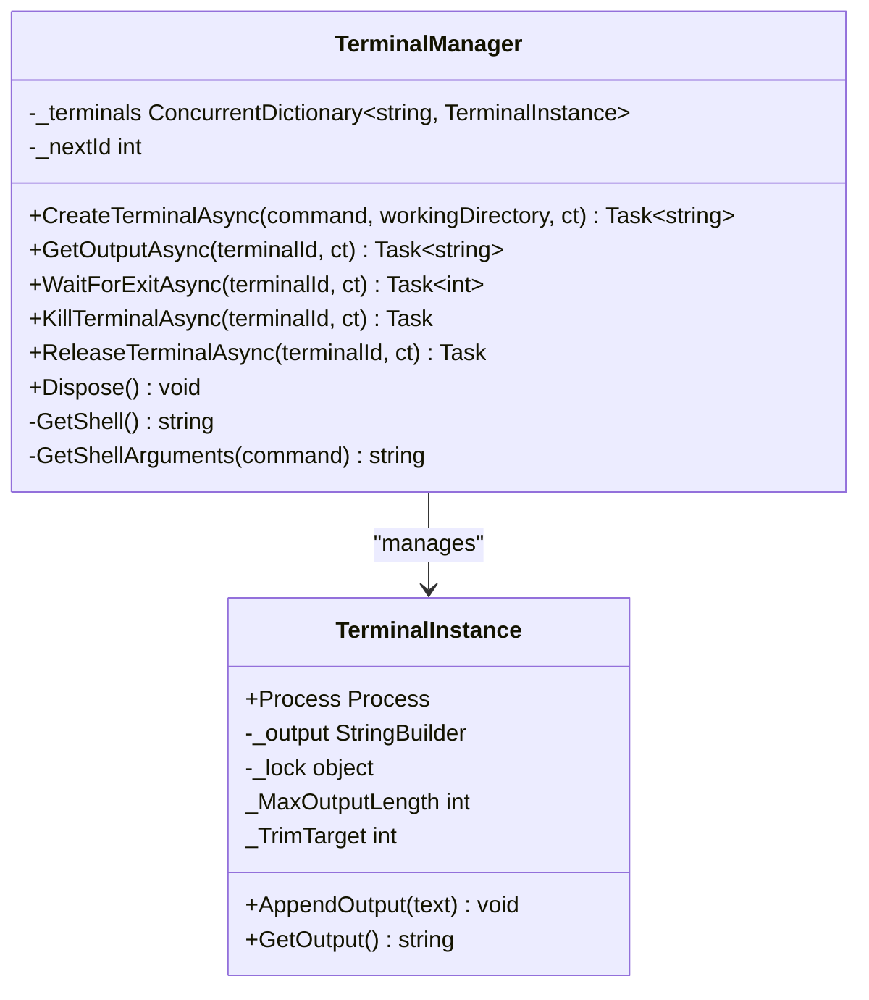
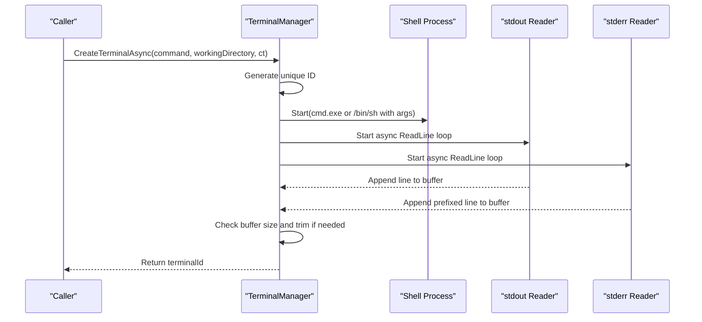
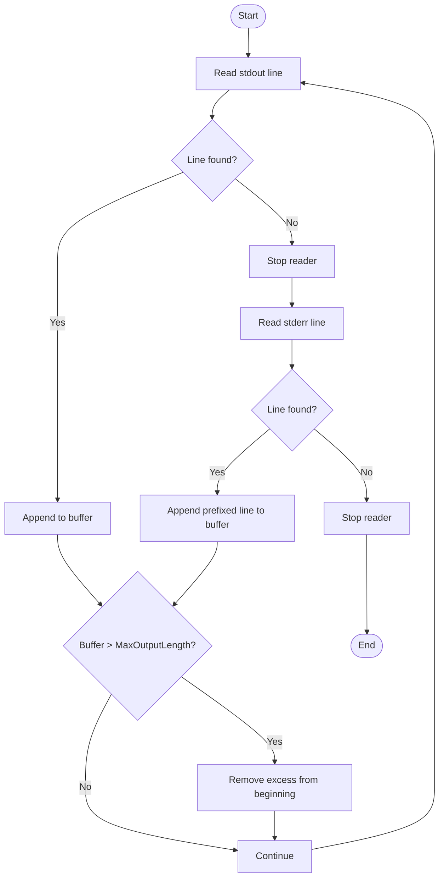
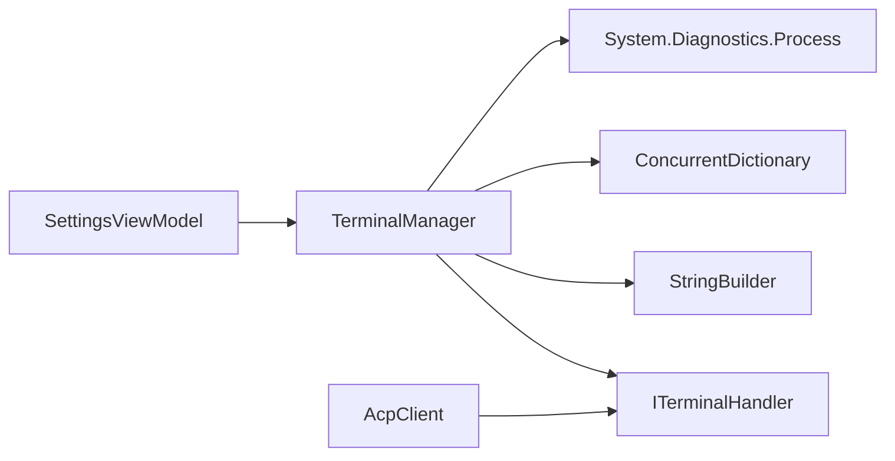

# Terminal Manager API

<cite>
**Referenced Files in This Document**
- [TerminalManager.cs](file://Agentic.Desktop/Services/TerminalManager.cs)
- [SettingsViewModel.cs](file://Agentic.Desktop/ViewModels/SettingsViewModel.cs)
- [Agentic.Desktop.csproj](file://Agentic.Desktop/Agentic.Desktop.csproj)
</cite>

## Update Summary
**Changes Made**
- Updated memory management section to document automatic output trimming functionality
- Enhanced performance considerations with new memory limits and trimming behavior
- Added detailed explanation of MaxOutputLength and TrimTarget constants
- Updated troubleshooting guide with memory-related issues and solutions

## Table of Contents
1. [Introduction](#introduction)
2. [Project Structure](#project-structure)
3. [Core Components](#core-components)
4. [Architecture Overview](#architecture-overview)
5. [Detailed Component Analysis](#detailed-component-analysis)
6. [Dependency Analysis](#dependency-analysis)
7. [Performance Considerations](#performance-considerations)
8. [Troubleshooting Guide](#troubleshooting-guide)
9. [Conclusion](#conclusion)

## Introduction
This document provides comprehensive API documentation for the TerminalManager service, which implements concurrent terminal process management with unique ID generation and asynchronous output streaming. It explains how to create, manage, and terminate terminal instances via the ITerminalHandler interface methods, details process lifecycle management, cross-platform shell compatibility, and output stream handling. It also includes examples of starting terminal processes, reading output asynchronously, handling process termination, managing multiple concurrent terminals, error handling patterns, resource cleanup, and performance considerations for high-frequency output processing.

## Project Structure
The TerminalManager is implemented as a UI service that manages one or more external shell processes. It is wired into the application's agent client during connection setup. The relevant files are:
- TerminalManager implementation and internal helper class
- SettingsViewModel where the TerminalManager is instantiated and assigned to the AcpClient
- Project file indicating the dependency on the ACPLibrary package that defines the ITerminalHandler interface contract

**Diagram sources**
- [SettingsViewModel.cs:100-102](file://Agentic.Desktop/ViewModels/SettingsViewModel.cs#L100-L102)
- [TerminalManager.cs:11](file://Agentic.Desktop/Services/TerminalManager.cs#L11)

**Section sources**
- [TerminalManager.cs:1-170](file://Agentic.Desktop/Services/TerminalManager.cs#L1-L170)
- [SettingsViewModel.cs:100-102](file://Agentic.Desktop/ViewModels/SettingsViewModel.cs#L100-L102)
- [Agentic.Desktop.csproj:46](file://Agentic.Desktop/Agentic.Desktop.csproj#L46)

## Core Components
- TerminalManager: Implements ITerminalHandler to manage multiple terminal processes concurrently. It generates unique IDs, starts shell processes, streams stdout/stderr asynchronously, and exposes lifecycle control methods.
- TerminalInstance: Internal helper that encapsulates a Process instance and thread-safe output buffering with automatic memory management.

Key responsibilities:
- Unique ID generation using an atomic counter
- Cross-platform shell selection and argument formatting
- Asynchronous output streaming from both stdout and stderr
- Process lifecycle operations: wait for exit, kill, release resources
- Thread-safe output accumulation and retrieval with automatic memory trimming

**Updated** The TerminalInstance now includes automatic output trimming to prevent memory leaks in long-running terminal sessions through configurable size limits.

**Section sources**
- [TerminalManager.cs:11-135](file://Agentic.Desktop/Services/TerminalManager.cs#L11-L135)
- [TerminalManager.cs:137-170](file://Agentic.Desktop/Services/TerminalManager.cs#L137-L170)

## Architecture Overview
The TerminalManager integrates with the AcpClient through the ITerminalHandler interface. When the application connects to an agent, it creates a TerminalManager and assigns it to the client. The client then invokes terminal-related methods on this handler when agents request terminal execution.

**Diagram sources**
- [SettingsViewModel.cs:100-102](file://Agentic.Desktop/ViewModels/SettingsViewModel.cs#L100-L102)
- [TerminalManager.cs:16-68](file://Agentic.Desktop/Services/TerminalManager.cs#L16-L68)
- [TerminalManager.cs:70-113](file://Agentic.Desktop/Services/TerminalManager.cs#L70-L113)

## Detailed Component Analysis

### ITerminalHandler Interface Methods
The TerminalManager implements the following methods defined by ITerminalHandler:

- CreateTerminalAsync(string command, string? workingDirectory, CancellationToken ct = default) -> Task<string>
  - Starts a shell process with the given command and working directory.
  - Returns a unique terminal ID used for subsequent operations.
  - Streams stdout and stderr asynchronously into a buffered output store with automatic memory management.

- GetOutputAsync(string terminalId, CancellationToken ct = default) -> Task<string>
  - Retrieves the accumulated output buffer for the specified terminal ID.
  - Returns an empty string if the terminal ID is not found.
  - Output is automatically trimmed to prevent memory growth in long-running sessions.

- WaitForExitAsync(string terminalId, CancellationToken ct = default) -> Task<int>
  - Waits for the process to exit and returns its exit code.
  - Returns -1 if the terminal ID is not found.

- KillTerminalAsync(string terminalId, CancellationToken ct = default) -> Task
  - Terminates the process tree associated with the terminal ID.
  - Silently handles exceptions during kill attempts.

- ReleaseTerminalAsync(string terminalId, CancellationToken ct = default) -> Task
  - Removes the terminal from the manager and ensures process resources are disposed.
  - Kills the process tree if still running before disposal.

- Dispose()
  - Ensures all managed terminal processes are killed and disposed.
  - Clears the internal dictionary of terminals.

Cross-platform shell compatibility:
- Windows: Uses cmd.exe with /c command argument.
- Non-Windows: Uses /bin/sh with -c "command" argument.

Asynchronous output streaming:
- Two background tasks read stdout and stderr line-by-line.
- Output is appended to a thread-safe StringBuilder within each TerminalInstance.
- Stderr lines are prefixed with a localized label for differentiation.
- Automatic trimming prevents memory leaks in long-running sessions.

Process lifecycle management:
- Processes are started with redirected input/output/error and no window.
- EnableRaisingEvents is set to true for event-driven behavior.
- Cancellation tokens are propagated to async readers.

Error handling:
- Exceptions in output readers are caught and ignored to prevent crashes.
- OperationCanceledException is handled gracefully.
- Kill and release operations wrap calls in try/catch blocks.

Resource cleanup patterns:
- ReleaseTerminalAsync removes entries from the concurrent dictionary and disposes the Process.
- Dispose iterates over all terminals, kills them, and disposes their Process objects.

Performance considerations:
- ConcurrentDictionary for O(1) average-time lookups and thread-safe storage.
- Interlocked.Increment for lock-free unique ID generation.
- Lock-based StringBuilder append to ensure thread safety without excessive allocations.
- Automatic output trimming prevents unbounded memory growth.

**Updated** The output buffering system now includes automatic memory management with configurable limits to prevent memory leaks in long-running terminal sessions.

**Section sources**
- [TerminalManager.cs:16-68](file://Agentic.Desktop/Services/TerminalManager.cs#L16-L68)
- [TerminalManager.cs:70-113](file://Agentic.Desktop/Services/TerminalManager.cs#L70-L113)
- [TerminalManager.cs:115-128](file://Agentic.Desktop/Services/TerminalManager.cs#L115-L128)
- [TerminalManager.cs:130-135](file://Agentic.Desktop/Services/TerminalManager.cs#L130-L135)
- [TerminalManager.cs:137-170](file://Agentic.Desktop/Services/TerminalManager.cs#L137-L170)

### Class Diagram

**Diagram sources**
- [TerminalManager.cs:11-135](file://Agentic.Desktop/Services/TerminalManager.cs#L11-L135)
- [TerminalManager.cs:137-170](file://Agentic.Desktop/Services/TerminalManager.cs#L137-L170)

### Sequence Diagram: Starting a Terminal and Streaming Output

**Diagram sources**
- [TerminalManager.cs:16-68](file://Agentic.Desktop/Services/TerminalManager.cs#L16-L68)

### Flowchart: Output Buffering Logic with Memory Management

**Diagram sources**
- [TerminalManager.cs:39-64](file://Agentic.Desktop/Services/TerminalManager.cs#L39-L64)
- [TerminalManager.cs:148-160](file://Agentic.Desktop/Services/TerminalManager.cs#L148-L160)

## Dependency Analysis
- TerminalManager depends on:
  - System.Diagnostics.Process for process management
  - System.Collections.Concurrent.ConcurrentDictionary for thread-safe storage
  - System.Text.StringBuilder for output buffering with automatic memory management
  - Agentic.ACPLibrary.Client.ITerminalHandler for interface contract
- Integration point:
  - SettingsViewModel instantiates TerminalManager and assigns it to AcpClient.TerminalHandler during connection setup.

**Diagram sources**
- [TerminalManager.cs:1-5](file://Agentic.Desktop/Services/TerminalManager.cs#L1-L5)
- [SettingsViewModel.cs:100-102](file://Agentic.Desktop/ViewModels/SettingsViewModel.cs#L100-L102)

**Section sources**
- [TerminalManager.cs:1-5](file://Agentic.Desktop/Services/TerminalManager.cs#L1-L5)
- [SettingsViewModel.cs:100-102](file://Agentic.Desktop/ViewModels/SettingsViewModel.cs#L100-L102)
- [Agentic.Desktop.csproj:46](file://Agentic.Desktop/Agentic.Desktop.csproj#L46)

## Performance Considerations
- High-frequency output processing:
  - Use line-by-line reading to avoid large memory spikes.
  - Avoid blocking the UI thread; rely on async readers.
  - Consider debouncing or throttling UI updates if rendering output frequently.
- Memory usage with automatic trimming:
  - **New**: Output buffer is automatically trimmed when exceeding MaxOutputLength (100KB).
  - **New**: Trimming preserves the most recent 75KB of output (TrimTarget) while removing older data.
  - **New**: Prevents memory leaks in long-running terminal sessions through proactive memory management.
  - Ensure timely ReleaseTerminalAsync calls to free buffers and processes.
- Concurrency:
  - ConcurrentDictionary provides efficient access under concurrency.
  - Lock granularity around StringBuilder operations minimizes contention.
- Cancellation:
  - Propagate cancellation tokens to async readers to stop I/O promptly.
- Process tree killing:
  - entireProcessTree: true ensures child processes are terminated, preventing orphaned processes.
- Memory optimization:
  - Automatic trimming reduces peak memory usage significantly.
  - Configurable limits allow tuning based on application requirements.
  - Recent output is always preserved for display purposes.

**Updated** The memory management system now includes automatic output trimming with configurable limits (MaxOutputLength=100KB, TrimTarget=75KB) to prevent memory leaks in long-running terminal sessions while preserving the most recent output for display.

## Troubleshooting Guide
Common issues and resolutions:
- No output appears:
  - Verify that stdout/stderr redirection is enabled and readers are started.
  - Check that the command executes successfully in the selected shell.
- Process hangs or does not exit:
  - Use KillTerminalAsync followed by ReleaseTerminalAsync to force cleanup.
  - Inspect whether the process spawns child processes requiring tree termination.
- Resource leaks:
  - Always call ReleaseTerminalAsync after use or dispose the TerminalManager at app shutdown.
  - Ensure Dispose is invoked during application cleanup.
- Cross-platform differences:
  - Confirm correct shell selection and argument formatting for the target OS.
- Error handling:
  - Review catch blocks in output readers and kill/release methods; they swallow exceptions intentionally to keep the app stable.
- Memory issues with long-running sessions:
  - **New**: Output is automatically trimmed to prevent memory growth beyond 100KB.
  - **New**: Only the most recent 75KB of output is preserved when trimming occurs.
  - **New**: Monitor application memory usage to ensure trimming is effective.
  - **New**: Consider adjusting MaxOutputLength and TrimTarget constants if different memory profiles are needed.
- Output truncation concerns:
  - **New**: Older output is automatically removed to maintain memory efficiency.
  - **New**: Recent output (last 75KB) is always available for display.
  - **New**: For applications requiring full output history, consider implementing custom buffering strategies.

**Updated** Added troubleshooting guidance for memory management features and automatic output trimming behavior.

**Section sources**
- [TerminalManager.cs:39-64](file://Agentic.Desktop/Services/TerminalManager.cs#L39-L64)
- [TerminalManager.cs:86-113](file://Agentic.Desktop/Services/TerminalManager.cs#L86-L113)
- [TerminalManager.cs:115-128](file://Agentic.Desktop/Services/TerminalManager.cs#L115-L128)
- [TerminalManager.cs:137-170](file://Agentic.Desktop/Services/TerminalManager.cs#L137-L170)

## Conclusion
The TerminalManager service provides robust, concurrent terminal process management with unique ID generation and asynchronous output streaming. It integrates seamlessly with the AcpClient via the ITerminalHandler interface, supports cross-platform shells, and offers clear lifecycle control methods. The enhanced memory management system with automatic output trimming prevents memory leaks in long-running terminal sessions while preserving recent output for display purposes. Proper usage involves creating terminals, polling output asynchronously, waiting for exits, and ensuring timely resource cleanup. For high-frequency output scenarios, the built-in memory management automatically handles buffer sizing and trimming to maintain optimal performance and memory usage.