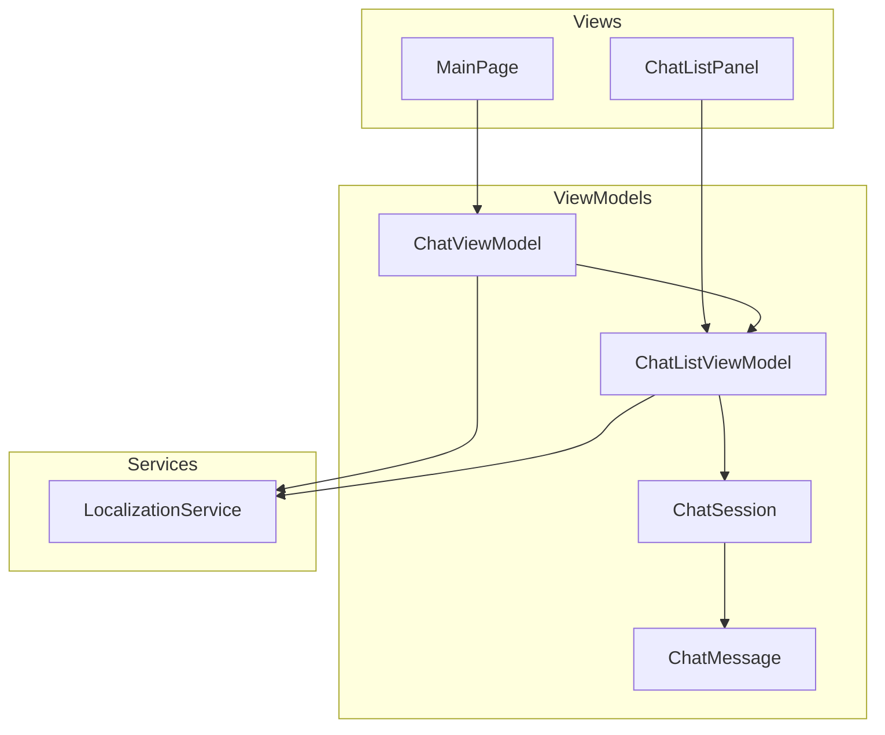
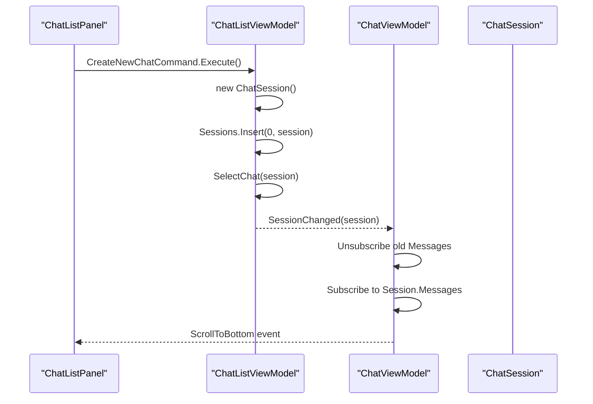
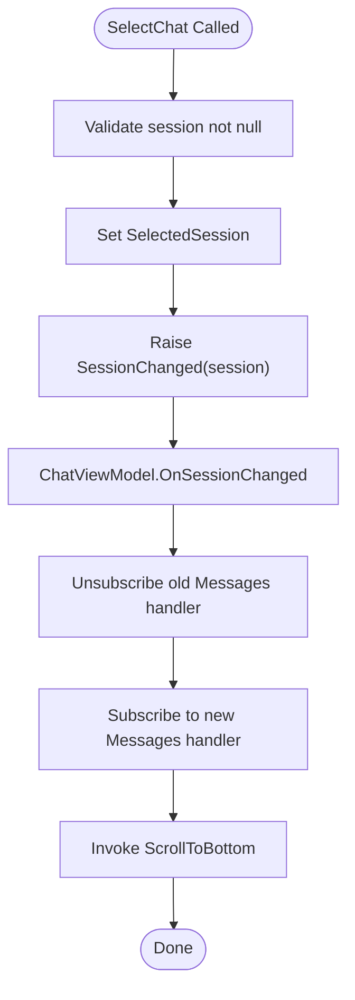
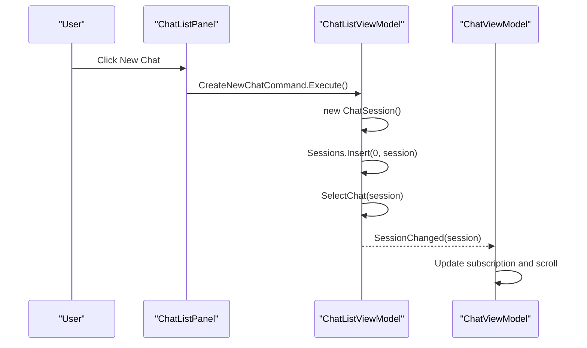
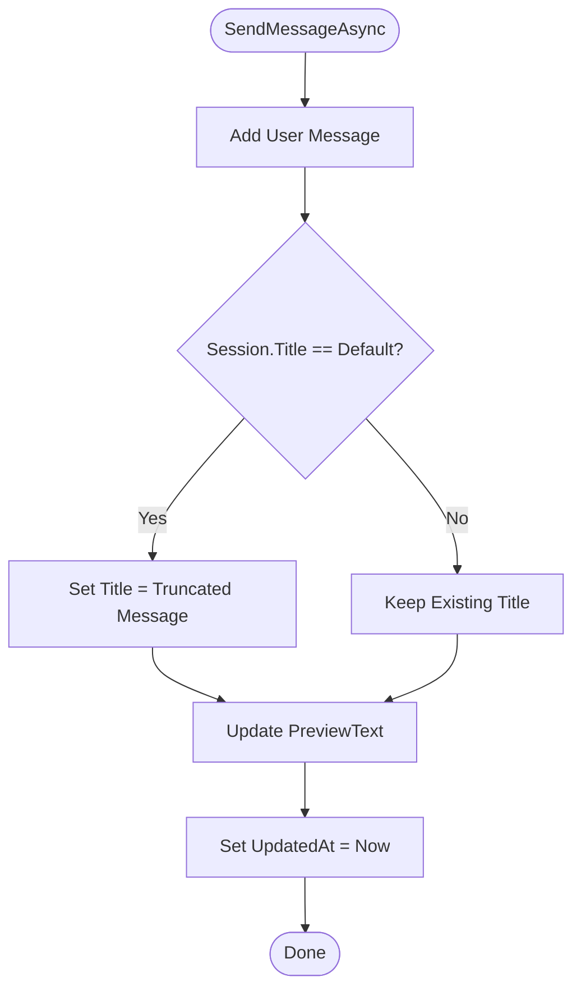
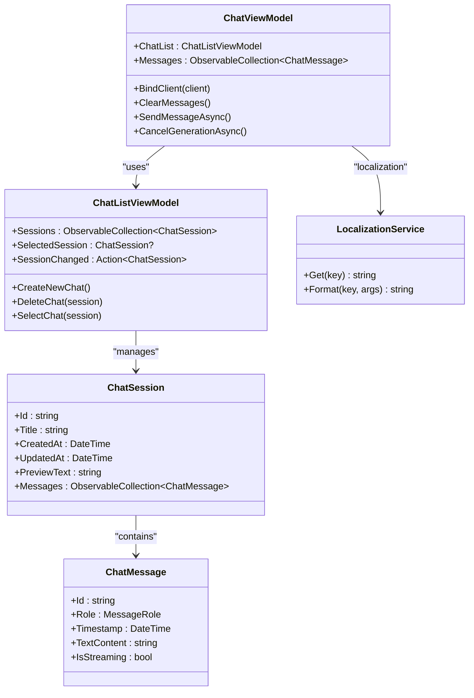

# ChatListViewModel

<cite>
**Referenced Files in This Document**
- [ChatListViewModel.cs](file://Agentic.Desktop/ViewModels/ChatListViewModel.cs)
- [ChatSession.cs](file://Agentic.Desktop/ViewModels/Messages/ChatSession.cs)
- [ChatMessage.cs](file://Agentic.Desktop/ViewModels/Messages/ChatMessage.cs)
- [ChatViewModel.cs](file://Agentic.Desktop/ViewModels/ChatViewModel.cs)
- [LocalizationService.cs](file://Agentic.Desktop/Services/LocalizationService.cs)
- [ChatListPanel.xaml](file://Agentic.Desktop/Views/ChatListPanel.xaml)
- [ChatListPanel.xaml.cs](file://Agentic.Desktop/Views/ChatListPanel.xaml.cs)
- [MainPage.xaml.cs](file://Agentic.Desktop/MainPage.xaml.cs)
</cite>

## Table of Contents
1. [Introduction](#introduction)
2. [Project Structure](#project-structure)
3. [Core Components](#core-components)
4. [Architecture Overview](#architecture-overview)
5. [Detailed Component Analysis](#detailed-component-analysis)
6. [Dependency Analysis](#dependency-analysis)
7. [Performance Considerations](#performance-considerations)
8. [Troubleshooting Guide](#troubleshooting-guide)
9. [Conclusion](#conclusion)
10. [Appendices](#appendices)

## Introduction
This document provides comprehensive API documentation for the ChatListViewModel class, which manages chat sessions and conversation history in the application. It explains how multiple conversation contexts are maintained via an observable collection, how selection changes are handled, and how session lifecycle events coordinate between view models. It also covers session creation, deletion, navigation patterns, automatic title generation from first messages, preview text updates, persistence considerations, memory management strategies for large histories, and guidance for extending functionality and integrating with external storage systems.

## Project Structure
The ChatListViewModel is part of a WinUI 3 MVVM architecture where:
- ChatListViewModel owns the list of active sessions and exposes commands to create, delete, and select sessions.
- ChatSession represents an individual conversation with metadata (title, timestamps, preview text) and a message history.
- ChatViewModel coordinates UI state, binds to the current session’s messages, and handles streaming responses.
- Views bind to these view models using XAML data binding and command invocations.

**Diagram sources**
- [ChatListViewModel.cs:1-64](file://Agentic.Desktop/ViewModels/ChatListViewModel.cs#L1-L64)
- [ChatViewModel.cs:1-235](file://Agentic.Desktop/ViewModels/ChatViewModel.cs#L1-L235)
- [ChatSession.cs:1-28](file://Agentic.Desktop/ViewModels/Messages/ChatSession.cs#L1-L28)
- [ChatMessage.cs:1-39](file://Agentic.Desktop/ViewModels/Messages/ChatMessage.cs#L1-L39)
- [LocalizationService.cs:1-23](file://Agentic.Desktop/Services/LocalizationService.cs#L1-L23)
- [ChatListPanel.xaml.cs:1-40](file://Agentic.Desktop/Views/ChatListPanel.xaml.cs#L1-L40)
- [MainPage.xaml.cs:1-51](file://Agentic.Desktop/MainPage.xaml.cs#L1-L51)

**Section sources**
- [ChatListViewModel.cs:1-64](file://Agentic.Desktop/ViewModels/ChatListViewModel.cs#L1-L64)
- [ChatViewModel.cs:1-235](file://Agentic.Desktop/ViewModels/ChatViewModel.cs#L1-L235)
- [ChatSession.cs:1-28](file://Agentic.Desktop/ViewModels/Messages/ChatSession.cs#L1-L28)
- [ChatMessage.cs:1-39](file://Agentic.Desktop/ViewModels/Messages/ChatMessage.cs#L1-L39)
- [LocalizationService.cs:1-23](file://Agentic.Desktop/Services/LocalizationService.cs#L1-L23)
- [ChatListPanel.xaml.cs:1-40](file://Agentic.Desktop/Views/ChatListPanel.xaml.cs#L1-L40)
- [MainPage.xaml.cs:1-51](file://Agentic.Desktop/MainPage.xaml.cs#L1-L51)

## Core Components
- ChatListViewModel: Manages the ObservableCollection<ChatSession> Sessions, SelectedSession, and SessionChanged event. Provides commands CreateNewChat, DeleteChat, SelectChat.
- ChatSession: Holds Id, Title, CreatedAt, UpdatedAt, PreviewText, and Messages (ObservableCollection<ChatMessage>).
- ChatMessage: Represents a single message with Role, Timestamp, TextContent, IsStreaming.
- ChatViewModel: Binds to ChatList.SelectedSession.Messages, handles streaming updates, and updates session metadata like Title and PreviewText on user interactions.

Key responsibilities:
- Maintain multiple conversation contexts via Sessions.
- Coordinate selection changes and notify subscribers through SessionChanged.
- Provide safe creation/deletion/select operations that keep UI consistent.

**Section sources**
- [ChatListViewModel.cs:1-64](file://Agentic.Desktop/ViewModels/ChatListViewModel.cs#L1-L64)
- [ChatSession.cs:1-28](file://Agentic.Desktop/ViewModels/Messages/ChatSession.cs#L1-L28)
- [ChatMessage.cs:1-39](file://Agentic.Desktop/ViewModels/Messages/ChatMessage.cs#L1-L39)
- [ChatViewModel.cs:1-235](file://Agentic.Desktop/ViewModels/ChatViewModel.cs#L1-L235)

## Architecture Overview
The system uses MVVM with observable collections and events to synchronize UI and state:
- ChatListViewModel owns the session list and selection state.
- ChatViewModel subscribes to SessionChanged to switch message subscriptions and update UI accordingly.
- Views bind to Commands and properties exposed by view models.

**Diagram sources**
- [ChatListPanel.xaml.cs:22-29](file://Agentic.Desktop/Views/ChatListPanel.xaml.cs#L22-L29)
- [ChatListViewModel.cs:22-28](file://Agentic.Desktop/ViewModels/ChatListViewModel.cs#L22-L28)
- [ChatListViewModel.cs:56-62](file://Agentic.Desktop/ViewModels/ChatListViewModel.cs#L56-L62)
- [ChatViewModel.cs:44-72](file://Agentic.Desktop/ViewModels/ChatViewModel.cs#L44-L72)

## Detailed Component Analysis

### ChatListViewModel API
- Public Properties:
  - Sessions: ObservableCollection<ChatSession> — holds all active conversations; supports UI binding and change notifications.
  - SelectedSession: ChatSession? — currently selected conversation; two-way bound in UI.
- Events:
  - SessionChanged: Action<ChatSession>? — raised when selection changes to coordinate other view models.
- Commands:
  - CreateNewChat: Creates a new ChatSession, inserts at index 0, selects it.
  - DeleteChat(ChatSession): Removes the session; if it was selected, selects adjacent or creates a new one if empty.
  - SelectChat(ChatSession): Sets SelectedSession and raises SessionChanged.

Behavioral notes:
- Inserting at index 0 ensures newest sessions appear first.
- Deleting a selected session maintains selection continuity.
- Selection changes propagate via SessionChanged to subscribers like ChatViewModel.

**Section sources**
- [ChatListViewModel.cs:10-15](file://Agentic.Desktop/ViewModels/ChatListViewModel.cs#L10-L15)
- [ChatListViewModel.cs:22-28](file://Agentic.Desktop/ViewModels/ChatListViewModel.cs#L22-L28)
- [ChatListViewModel.cs:30-54](file://Agentic.Desktop/ViewModels/ChatListViewModel.cs#L30-L54)
- [ChatListViewModel.cs:56-62](file://Agentic.Desktop/ViewModels/ChatListViewModel.cs#L56-L62)

### ChatSession Data Model
- Id: Unique identifier for the session.
- Title: Display name; defaults to localized “NewChatTitle”.
- CreatedAt / UpdatedAt: Timestamps for lifecycle tracking.
- PreviewText: Short snippet shown in the list; updated on activity.
- Messages: ObservableCollection<ChatMessage> — the conversation history.

Usage patterns:
- Title auto-generation occurs on first user message.
- PreviewText updates reflect recent activity or tool calls.
- UpdatedAt refreshes on meaningful changes.

**Section sources**
- [ChatSession.cs:12-26](file://Agentic.Desktop/ViewModels/Messages/ChatSession.cs#L12-L26)
- [ChatViewModel.cs:107-113](file://Agentic.Desktop/ViewModels/ChatViewModel.cs#L107-L113)
- [ChatViewModel.cs:194-198](file://Agentic.Desktop/ViewModels/ChatViewModel.cs#L194-L198)

### ChatMessage Data Model
- Id: Unique identifier per message.
- Role: MessageRole enum (User, Agent, System).
- Timestamp: Creation time.
- TextContent: Accumulates streamed content.
- IsStreaming: Indicates ongoing stream.

Integration:
- ChatViewModel adds User and Agent messages during send flow.
- Streaming updates append to TextContent safely.

**Section sources**
- [ChatMessage.cs:16-31](file://Agentic.Desktop/ViewModels/Messages/ChatMessage.cs#L16-L31)
- [ChatViewModel.cs:104-119](file://Agentic.Desktop/ViewModels/ChatViewModel.cs#L104-L119)

### Selection Change Handling and Coordination
- ChatListViewModel.SelectChat sets SelectedSession and raises SessionChanged.
- ChatViewModel.OnSessionChanged unsubscribes from previous session’s Messages, subscribes to the new session’s Messages, and triggers scroll-to-bottom.
- This pattern ensures only one session’s messages are actively observed at a time.

**Diagram sources**
- [ChatListViewModel.cs:56-62](file://Agentic.Desktop/ViewModels/ChatListViewModel.cs#L56-L62)
- [ChatViewModel.cs:50-72](file://Agentic.Desktop/ViewModels/ChatViewModel.cs#L50-L72)

**Section sources**
- [ChatListViewModel.cs:56-62](file://Agentic.Desktop/ViewModels/ChatListViewModel.cs#L56-L62)
- [ChatViewModel.cs:50-72](file://Agentic.Desktop/ViewModels/ChatViewModel.cs#L50-L72)

### Session Lifecycle Management Examples
- Creation: CreateNewChat instantiates a new ChatSession, inserts at index 0, and selects it.
- Deletion: DeleteChat removes the session and adjusts selection; if no sessions remain, automatically creates a new one.
- Navigation: SelectChat updates selection and notifies subscribers.

**Diagram sources**
- [ChatListPanel.xaml.cs:22-29](file://Agentic.Desktop/Views/ChatListPanel.xaml.cs#L22-L29)
- [ChatListViewModel.cs:22-28](file://Agentic.Desktop/ViewModels/ChatListViewModel.cs#L22-L28)
- [ChatListViewModel.cs:56-62](file://Agentic.Desktop/ViewModels/ChatListViewModel.cs#L56-L62)
- [ChatViewModel.cs:50-72](file://Agentic.Desktop/ViewModels/ChatViewModel.cs#L50-L72)

**Section sources**
- [ChatListViewModel.cs:22-28](file://Agentic.Desktop/ViewModels/ChatListViewModel.cs#L22-L28)
- [ChatListViewModel.cs:30-54](file://Agentic.Desktop/ViewModels/ChatListViewModel.cs#L30-L54)
- [ChatListViewModel.cs:56-62](file://Agentic.Desktop/ViewModels/ChatListViewModel.cs#L56-L62)

### Automatic Title Generation and Preview Updates
- On first user message, if the session title equals the default localized value, it is replaced with a truncated version of the message.
- PreviewText is updated to show a short snippet of the latest message or tool call notification.
- UpdatedAt is refreshed to reflect recent activity.

**Diagram sources**
- [ChatViewModel.cs:104-113](file://Agentic.Desktop/ViewModels/ChatViewModel.cs#L104-L113)
- [ChatViewModel.cs:194-198](file://Agentic.Desktop/ViewModels/ChatViewModel.cs#L194-L198)

**Section sources**
- [ChatViewModel.cs:104-113](file://Agentic.Desktop/ViewModels/ChatViewModel.cs#L104-L113)
- [ChatViewModel.cs:194-198](file://Agentic.Desktop/ViewModels/ChatViewModel.cs#L194-L198)

### Session Persistence Considerations
- Current implementation does not persist sessions to disk; they exist in-memory within the process lifetime.
- To add persistence:
  - Serialize ChatSession.Id, Title, CreatedAt, UpdatedAt, PreviewText, and Messages to JSON or another format.
  - Implement save/load hooks in ChatListViewModel (e.g., after CreateNewChat/DeleteChat/updates).
  - Use a background task or service to avoid blocking UI threads.
- Consider conflict resolution when merging remote and local states.

[No sources needed since this section provides general guidance]

### Memory Management for Large Conversation Histories
- Observables can grow unbounded; implement trimming policies:
  - Limit Messages count per session (e.g., keep last N messages).
  - Archive older messages to storage and remove from in-memory collection.
  - Dispose subscriptions properly when switching sessions to prevent leaks.
- Avoid holding references to large strings unnecessarily; consider lazy loading for long histories.

[No sources needed since this section provides general guidance]

### Extending Session Functionality and External Storage Integration
- Add custom fields to ChatSession (e.g., tags, status) and expose them via observable properties.
- Integrate with external storage:
  - Implement repository interfaces for saving/loading sessions.
  - Inject dependencies into ChatListViewModel constructor for testability.
  - Use async operations to avoid UI thread blocking.
- For real-time sync, subscribe to storage change events and reconcile with in-memory state.

[No sources needed since this section provides general guidance]

## Dependency Analysis
- ChatListViewModel depends on:
  - CommunityToolkit.Mvvm for ObservableObject and RelayCommand.
  - Agentic.Desktop.ViewModels.Messages.ChatSession.
- ChatViewModel depends on:
  - ChatListViewModel for session management.
  - LocalizationService for localized strings.
  - AcpClient for agent communication (optional mock path).
- Views depend on view models via x:Bind and command bindings.

**Diagram sources**
- [ChatListViewModel.cs:1-64](file://Agentic.Desktop/ViewModels/ChatListViewModel.cs#L1-L64)
- [ChatSession.cs:1-28](file://Agentic.Desktop/ViewModels/Messages/ChatSession.cs#L1-L28)
- [ChatMessage.cs:1-39](file://Agentic.Desktop/ViewModels/Messages/ChatMessage.cs#L1-L39)
- [ChatViewModel.cs:1-235](file://Agentic.Desktop/ViewModels/ChatViewModel.cs#L1-L235)
- [LocalizationService.cs:1-23](file://Agentic.Desktop/Services/LocalizationService.cs#L1-L23)

**Section sources**
- [ChatListViewModel.cs:1-64](file://Agentic.Desktop/ViewModels/ChatListViewModel.cs#L1-L64)
- [ChatViewModel.cs:1-235](file://Agentic.Desktop/ViewModels/ChatViewModel.cs#L1-L235)
- [ChatSession.cs:1-28](file://Agentic.Desktop/ViewModels/Messages/ChatSession.cs#L1-L28)
- [ChatMessage.cs:1-39](file://Agentic.Desktop/ViewModels/Messages/ChatMessage.cs#L1-L39)
- [LocalizationService.cs:1-23](file://Agentic.Desktop/Services/LocalizationService.cs#L1-L23)

## Performance Considerations
- ObservableCollection updates trigger UI re-renders; batch updates where possible.
- Streamed responses are merged in frames to reduce UI churn.
- Subscription management prevents memory leaks by unsubscribing from previous session’s Messages.
- Consider virtualizing lists for large session counts.

[No sources needed since this section provides general guidance]

## Troubleshooting Guide
Common issues and resolutions:
- Session not updating in UI: Ensure SelectedSession is set and SessionChanged is raised.
- Memory growth: Implement message trimming and archive strategies.
- Stale subscriptions: Verify unsubscribe logic in OnSessionChanged.
- Localization keys missing: Confirm resource files contain required keys.

**Section sources**
- [ChatListViewModel.cs:56-62](file://Agentic.Desktop/ViewModels/ChatListViewModel.cs#L56-L62)
- [ChatViewModel.cs:50-72](file://Agentic.Desktop/ViewModels/ChatViewModel.cs#L50-L72)
- [LocalizationService.cs:1-23](file://Agentic.Desktop/Services/LocalizationService.cs#L1-L23)

## Conclusion
ChatListViewModel serves as the central coordinator for chat session management, providing robust APIs for creating, deleting, and selecting sessions while maintaining UI consistency through observable collections and events. By following the patterns outlined here, developers can extend session functionality, integrate with external storage, and optimize performance for large conversation histories.

[No sources needed since this section summarizes without analyzing specific files]

## Appendices

### UI Binding Reference
- ChatListPanel binds to:
  - ItemsSource: ViewModel.Sessions
  - SelectedItem: ViewModel.SelectedSession (TwoWay)
  - Commands: CreateNewChatCommand, DeleteChatCommand, SelectChatCommand

**Section sources**
- [ChatListPanel.xaml:44-84](file://Agentic.Desktop/Views/ChatListPanel.xaml#L44-L84)
- [ChatListPanel.xaml.cs:22-38](file://Agentic.Desktop/Views/ChatListPanel.xaml.cs#L22-L38)

### Initialization Flow
- MainPage initializes ChatViewModel and binds ChatListPanel.ViewModel to ChatViewModel.ChatList.
- ChatViewModel subscribes to SessionChanged and manages client binding.

**Section sources**
- [MainPage.xaml.cs:14-34](file://Agentic.Desktop/MainPage.xaml.cs#L14-L34)
- [ChatViewModel.cs:41-45](file://Agentic.Desktop/ViewModels/ChatViewModel.cs#L41-L45)