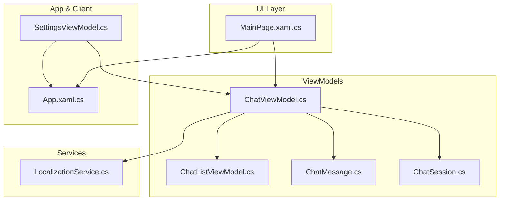
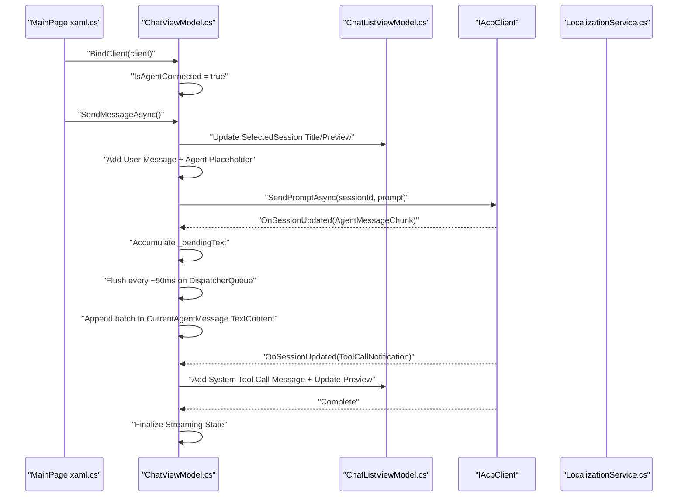
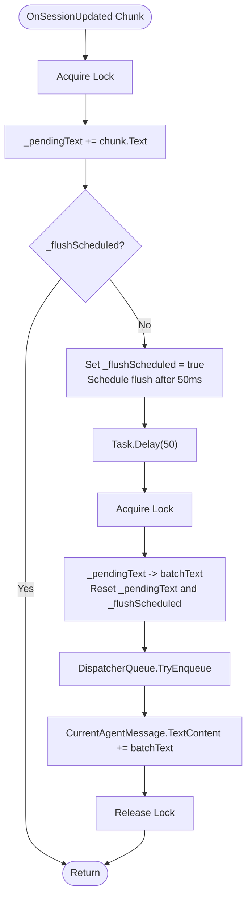
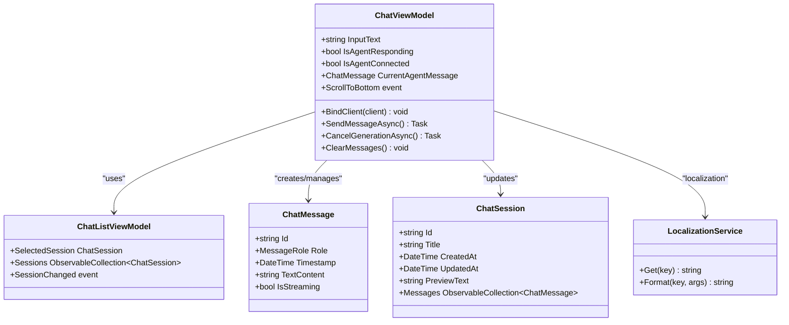

# ChatViewModel

<cite>
**Referenced Files in This Document**
- [ChatViewModel.cs](file://Agentic.Desktop/ViewModels/ChatViewModel.cs)
- [ChatMessage.cs](file://Agentic.Desktop/ViewModels/Messages/ChatMessage.cs)
- [ChatSession.cs](file://Agentic.Desktop/ViewModels/Messages/ChatSession.cs)
- [ChatListViewModel.cs](file://Agentic.Desktop/ViewModels/ChatListViewModel.cs)
- [MainPage.xaml.cs](file://Agentic.Desktop/MainPage.xaml.cs)
- [SettingsViewModel.cs](file://Agentic.Desktop/ViewModels/SettingsViewModel.cs)
- [App.xaml.cs](file://Agentic.Desktop/App.xaml.cs)
- [LocalizationService.cs](file://Agentic.Desktop/Services/LocalizationService.cs)
</cite>

## Table of Contents
1. [Introduction](#introduction)
2. [Project Structure](#project-structure)
3. [Core Components](#core-components)
4. [Architecture Overview](#architecture-overview)
5. [Detailed Component Analysis](#detailed-component-analysis)
6. [Dependency Analysis](#dependency-analysis)
7. [Performance Considerations](#performance-considerations)
8. [Troubleshooting Guide](#troubleshooting-guide)
9. [Conclusion](#conclusion)

## Introduction
This document provides comprehensive API documentation for the ChatViewModel class, which is the central view model for chat functionality in the desktop application. It explains observable properties, core methods, streaming behavior, frame-level merging for performance, and threading considerations using DispatcherQueue. It also includes practical examples of message flows, streaming response handling, and error scenarios.

## Project Structure
The ChatViewModel resides under the ViewModels folder and coordinates with:
- Message models (ChatMessage, ChatSession)
- Session list management (ChatListViewModel)
- ACP client binding and lifecycle (via IAcpClient exposed through App and SettingsViewModel)
- UI integration via MainPage and localization services

**Diagram sources**
- [ChatViewModel.cs:1-235](file://Agentic.Desktop/ViewModels/ChatViewModel.cs#L1-L235)
- [ChatListViewModel.cs:1-64](file://Agentic.Desktop/ViewModels/ChatListViewModel.cs#L1-L64)
- [ChatMessage.cs:1-39](file://Agentic.Desktop/ViewModels/Messages/ChatMessage.cs#L1-L39)
- [ChatSession.cs:1-28](file://Agentic.Desktop/ViewModels/Messages/ChatSession.cs#L1-L28)
- [MainPage.xaml.cs:1-94](file://Agentic.Desktop/MainPage.xaml.cs#L1-L94)
- [SettingsViewModel.cs:43-161](file://Agentic.Desktop/ViewModels/SettingsViewModel.cs#L43-L161)
- [App.xaml.cs:35-84](file://Agentic.Desktop/App.xaml.cs#L35-L84)
- [LocalizationService.cs:1-23](file://Agentic.Desktop/Services/LocalizationService.cs#L1-L23)

**Section sources**
- [ChatViewModel.cs:1-235](file://Agentic.Desktop/ViewModels/ChatViewModel.cs#L1-L235)
- [ChatListViewModel.cs:1-64](file://Agentic.Desktop/ViewModels/ChatListViewModel.cs#L1-L64)
- [ChatMessage.cs:1-39](file://Agentic.Desktop/ViewModels/Messages/ChatMessage.cs#L1-L39)
- [ChatSession.cs:1-28](file://Agentic.Desktop/ViewModels/Messages/ChatSession.cs#L1-L28)
- [MainPage.xaml.cs:1-94](file://Agentic.Desktop/MainPage.xaml.cs#L1-L94)
- [SettingsViewModel.cs:43-161](file://Agentic.Desktop/ViewModels/SettingsViewModel.cs#L43-L161)
- [App.xaml.cs:35-84](file://Agentic.Desktop/App.xaml.cs#L35-L84)
- [LocalizationService.cs:1-23](file://Agentic.Desktop/Services/LocalizationService.cs#L1-L23)

## Core Components
ChatViewModel exposes the following key observable properties and methods:

Observable Properties
- InputText: string — The current text entered by the user in the input field. Two-way bound to the UI TextBox.
- IsAgentResponding: bool — Indicates whether an agent response stream is currently active. Used to disable further sends and show typing indicators.
- IsAgentConnected: bool — Reflects whether an ACP client is connected and ready to send prompts.
- CurrentAgentMessage: ChatMessage? — The active agent message being streamed; used to append incremental content during streaming.

Core Methods
- BindClient(IAcpClient client): void — Binds the ACP client instance to the view model and sets connection state.
- SendMessageAsync(): Task — Sends a user message, creates an agent placeholder, streams updates, and handles errors or cancellation.
- CancelGenerationAsync(): Task — Cancels ongoing generation via the ACP client and resets streaming state.
- ClearMessages(): void — Clears messages for the current session and resets connection state.

Additional Events
- ScrollToBottom: Action — Raised when new messages are added to prompt the UI to scroll to the latest content.

Threading
- Uses Microsoft.UI.Dispatching.DispatcherQueue to marshal UI updates safely from background callbacks.

Frame-Level Merging
- Accumulates incoming text chunks and flushes them once per frame (~50ms) to reduce UI churn and improve rendering performance.

**Section sources**
- [ChatViewModel.cs:17-34](file://Agentic.Desktop/ViewModels/ChatViewModel.cs#L17-L34)
- [ChatViewModel.cs:74-92](file://Agentic.Desktop/ViewModels/ChatViewModel.cs#L74-L92)
- [ChatViewModel.cs:94-149](file://Agentic.Desktop/ViewModels/ChatViewModel.cs#L94-L149)
- [ChatViewModel.cs:206-216](file://Agentic.Desktop/ViewModels/ChatViewModel.cs#L206-L216)
- [ChatViewModel.cs:151-204](file://Agentic.Desktop/ViewModels/ChatViewModel.cs#L151-L204)
- [ChatViewModel.cs:14-15](file://Agentic.Desktop/ViewModels/ChatViewModel.cs#L14-L15)

## Architecture Overview
ChatViewModel orchestrates the chat flow between the UI, session management, and the ACP client. It subscribes to session changes, manages message collections, and handles streaming updates.

**Diagram sources**
- [MainPage.xaml.cs:26-47](file://Agentic.Desktop/MainPage.xaml.cs#L26-L47)
- [ChatViewModel.cs:74-92](file://Agentic.Desktop/ViewModels/ChatViewModel.cs#L74-L92)
- [ChatViewModel.cs:94-149](file://Agentic.Desktop/ViewModels/ChatViewModel.cs#L94-L149)
- [ChatViewModel.cs:151-204](file://Agentic.Desktop/ViewModels/ChatViewModel.cs#L151-L204)
- [ChatListViewModel.cs:56-63](file://Agentic.Desktop/ViewModels/ChatListViewModel.cs#L56-L63)
- [LocalizationService.cs:15-21](file://Agentic.Desktop/Services/LocalizationService.cs#L15-L21)

## Detailed Component Analysis

### Observable Properties
- InputText (string)
  - Purpose: Captures user input for sending messages.
  - Data Type: string
  - Behavior: Cleared after sending a message; two-way bound to UI TextBox.
- IsAgentResponding (bool)
  - Purpose: Prevents concurrent sends and indicates streaming activity.
  - Data Type: bool
  - Behavior: Set to true when starting a send; reset to false in finally block or cancel.
- IsAgentConnected (bool)
  - Purpose: Indicates ACP client connectivity status.
  - Data Type: bool
  - Behavior: Set to true on BindClient; set to false on ClearMessages.
- CurrentAgentMessage (ChatMessage?)
  - Purpose: Holds the active agent message being streamed; used to append incremental content.
  - Data Type: ChatMessage?
  - Behavior: Assigned when creating agent placeholder; cleared after streaming completes.

**Section sources**
- [ChatViewModel.cs:17-27](file://Agentic.Desktop/ViewModels/ChatViewModel.cs#L17-L27)
- [ChatMessage.cs:14-31](file://Agentic.Desktop/ViewModels/Messages/ChatMessage.cs#L14-L31)

### Core Methods

#### BindClient(IAcpClient client)
- Purpose: Binds the ACP client instance to the view model and enables messaging.
- Parameters:
  - client: IAcpClient — The ACP client instance to use for sending prompts and receiving updates.
- Return Value: void
- Side Effects:
  - Subscribes to client’s SessionUpdated event.
  - Sets IsAgentConnected to true.
  - Unsubscribes from previous client if present.
- Exception Handling: None explicitly thrown; safe re-binding supported.
- Threading: No direct UI updates; event subscription occurs synchronously.

Usage Pattern
- Called from MainPage when a client becomes available or changes.
- Ensures ChatViewModel uses the correct client instance throughout its lifecycle.

**Section sources**
- [ChatViewModel.cs:74-85](file://Agentic.Desktop/ViewModels/ChatViewModel.cs#L74-L85)
- [MainPage.xaml.cs:26-47](file://Agentic.Desktop/MainPage.xaml.cs#L26-L47)

#### SendMessageAsync()
- Purpose: Sends a user message, creates an agent placeholder, and streams responses.
- Parameters: None (uses InputText).
- Return Value: Task (async operation).
- Behavior:
  - Validates input and prevents concurrent sends.
  - Adds user message to the current session.
  - Updates session title and preview based on first message.
  - Creates an agent placeholder with streaming enabled.
  - Calls ACP client SendPromptAsync if connected; otherwise simulates mock response.
  - Handles OperationCanceledException and general exceptions.
  - Finalizes streaming state and clears CurrentAgentMessage.
- Exception Handling:
  - OperationCanceledException: Ignored (user canceled).
  - General Exception: Appends formatted error message to agent message.
- Threading:
  - Uses DispatcherQueue to marshal UI updates.
  - Frame-level merging batches text updates to minimize UI churn.

Practical Example
- User types a message and presses Enter.
- ViewModel adds user message, creates agent placeholder, and starts streaming.
- On each chunk, text is accumulated and flushed every ~50ms.
- On completion or error, streaming flags are reset.

**Section sources**
- [ChatViewModel.cs:94-149](file://Agentic.Desktop/ViewModels/ChatViewModel.cs#L94-L149)
- [ChatViewModel.cs:151-204](file://Agentic.Desktop/ViewModels/ChatViewModel.cs#L151-L204)
- [LocalizationService.cs:15-21](file://Agentic.Desktop/Services/LocalizationService.cs#L15-L21)

#### CancelGenerationAsync()
- Purpose: Cancels ongoing generation and resets streaming state.
- Parameters: None.
- Return Value: Task (async operation).
- Behavior:
  - If ACP client has a current session ID, calls CancelSessionAsync.
  - Resets IsAgentResponding to false.
  - Sets CurrentAgentMessage.IsStreaming to false if present.
- Exception Handling: None explicitly handled; relies on underlying client behavior.
- Threading: Safe to call from UI thread; no direct UI updates.

Usage Pattern
- Invoked when user cancels an ongoing response or switches sessions.

**Section sources**
- [ChatViewModel.cs:206-216](file://Agentic.Desktop/ViewModels/ChatViewModel.cs#L206-L216)

#### ClearMessages()
- Purpose: Clears messages for the current session and resets connection state.
- Parameters: None.
- Return Value: void
- Behavior:
  - Clears Messages collection for the selected session.
  - Sets IsAgentConnected to false.
- Exception Handling: None.
- Threading: Direct UI update; should be called from UI thread.

Usage Pattern
- Called when ACP client disconnects or when resetting the UI state.

**Section sources**
- [ChatViewModel.cs:87-92](file://Agentic.Desktop/ViewModels/ChatViewModel.cs#L87-L92)
- [MainPage.xaml.cs:36-47](file://Agentic.Desktop/MainPage.xaml.cs#L36-L47)

### Frame-Level Merging Mechanism
- Purpose: Batches UI updates to optimize performance during streaming.
- Implementation:
  - Accumulates incoming text chunks into _pendingText with a lock for thread safety.
  - Schedules a flush every ~50ms using Task.Delay and ContinueWith.
  - Marshals UI updates via DispatcherQueue.TryEnqueue to ensure thread safety.
  - Appends batched text to CurrentAgentMessage.TextContent.
- Benefits:
  - Reduces frequency of UI updates.
  - Minimizes layout recalculations and improves perceived responsiveness.

Flowchart

**Diagram sources**
- [ChatViewModel.cs:151-204](file://Agentic.Desktop/ViewModels/ChatViewModel.cs#L151-L204)

**Section sources**
- [ChatViewModel.cs:151-204](file://Agentic.Desktop/ViewModels/ChatViewModel.cs#L151-L204)

### ScrollToBottom Event
- Purpose: Notifies the UI to scroll to the latest message when new content is added.
- Usage Pattern:
  - Raised when messages are added to the session.
  - MainPage subscribes to this event and scrolls the message container to the bottom.
- Threading:
  - Raised from UI thread context (message collection change handler).
  - MainPage ensures scrolling happens on the UI thread using DispatcherQueue.

Practical Example
- When a new agent message chunk arrives, the view model appends it to the current agent message.
- The message collection change triggers ScrollToBottom.
- MainPage scrolls the Scroller to the bottom after layout updates.

**Section sources**
- [ChatViewModel.cs:34](file://Agentic.Desktop/ViewModels/ChatViewModel.cs#L34)
- [ChatViewModel.cs:67-72](file://Agentic.Desktop/ViewModels/ChatViewModel.cs#L67-L72)
- [MainPage.xaml.cs:23-25](file://Agentic.Desktop/MainPage.xaml.cs#L23-L25)
- [MainPage.xaml.cs:72-80](file://Agentic.Desktop/MainPage.xaml.cs#L72-L80)

## Dependency Analysis
ChatViewModel depends on several components to function correctly:

**Diagram sources**
- [ChatViewModel.cs:1-235](file://Agentic.Desktop/ViewModels/ChatViewModel.cs#L1-L235)
- [ChatListViewModel.cs:1-64](file://Agentic.Desktop/ViewModels/ChatListViewModel.cs#L1-L64)
- [ChatMessage.cs:1-39](file://Agentic.Desktop/ViewModels/Messages/ChatMessage.cs#L1-L39)
- [ChatSession.cs:1-28](file://Agentic.Desktop/ViewModels/Messages/ChatSession.cs#L1-L28)
- [LocalizationService.cs:1-23](file://Agentic.Desktop/Services/LocalizationService.cs#L1-L23)

**Section sources**
- [ChatViewModel.cs:1-235](file://Agentic.Desktop/ViewModels/ChatViewModel.cs#L1-L235)
- [ChatListViewModel.cs:1-64](file://Agentic.Desktop/ViewModels/ChatListViewModel.cs#L1-L64)
- [ChatMessage.cs:1-39](file://Agentic.Desktop/ViewModels/Messages/ChatMessage.cs#L1-L39)
- [ChatSession.cs:1-28](file://Agentic.Desktop/ViewModels/Messages/ChatSession.cs#L1-L28)
- [LocalizationService.cs:1-23](file://Agentic.Desktop/Services/LocalizationService.cs#L1-L23)

## Performance Considerations
- Frame-Level Merging: Batches text updates every ~50ms to reduce UI churn and improve rendering performance.
- DispatcherQueue: Ensures UI updates occur on the correct thread, preventing cross-thread exceptions.
- Stream Optimization: Avoids frequent property changes by accumulating text before updating the UI.
- Memory Management: Properly unsubscribes from events and clears references to prevent memory leaks.

[No sources needed since this section provides general guidance]

## Troubleshooting Guide
Common Issues and Solutions
- Agent Not Responding:
  - Ensure BindClient is called with a valid IAcpClient instance.
  - Verify IsAgentConnected is true.
- Concurrent Sends:
  - IsAgentResponding prevents multiple simultaneous sends. Wait for completion or cancel.
- UI Freezing During Streaming:
  - Frame-level merging reduces UI updates. Check that DispatcherQueue is used for all UI operations.
- Session Switching Issues:
  - OnSessionChanged cancels ongoing streaming and unsubscribes from old session messages.
- Error Messages:
  - Exceptions are caught and appended to the agent message with localized formatting.

**Section sources**
- [ChatViewModel.cs:94-149](file://Agentic.Desktop/ViewModels/ChatViewModel.cs#L94-L149)
- [ChatViewModel.cs:151-204](file://Agentic.Desktop/ViewModels/ChatViewModel.cs#L151-L204)
- [ChatViewModel.cs:206-216](file://Agentic.Desktop/ViewModels/ChatViewModel.cs#L206-L216)

## Conclusion
ChatViewModel serves as the central coordinator for chat functionality, managing user interactions, streaming responses, and UI updates. Its design emphasizes performance through frame-level merging and thread safety via DispatcherQueue. The clear separation of concerns and robust error handling make it suitable for both real ACP clients and mock implementations. By following the documented patterns, developers can extend and customize the chat experience effectively.

[No sources needed since this section summarizes without analyzing specific files]