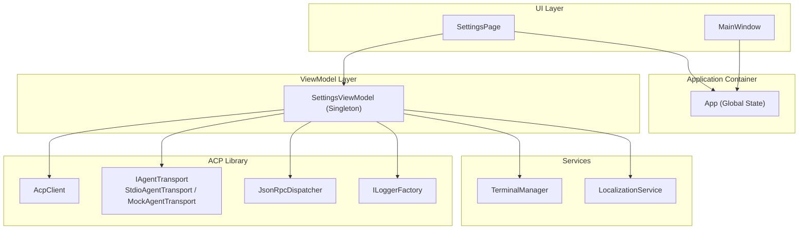
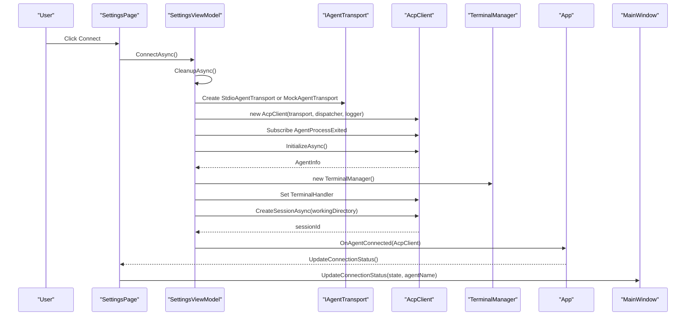
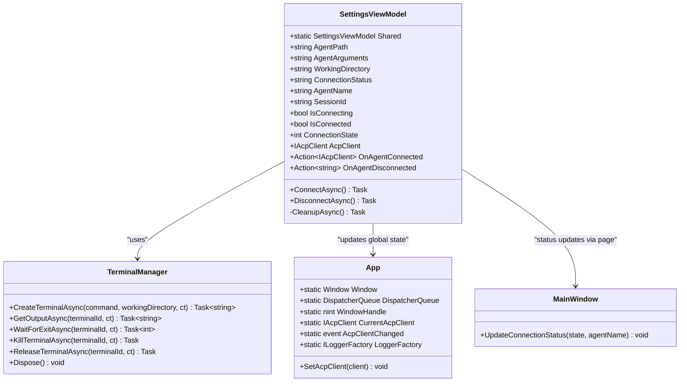
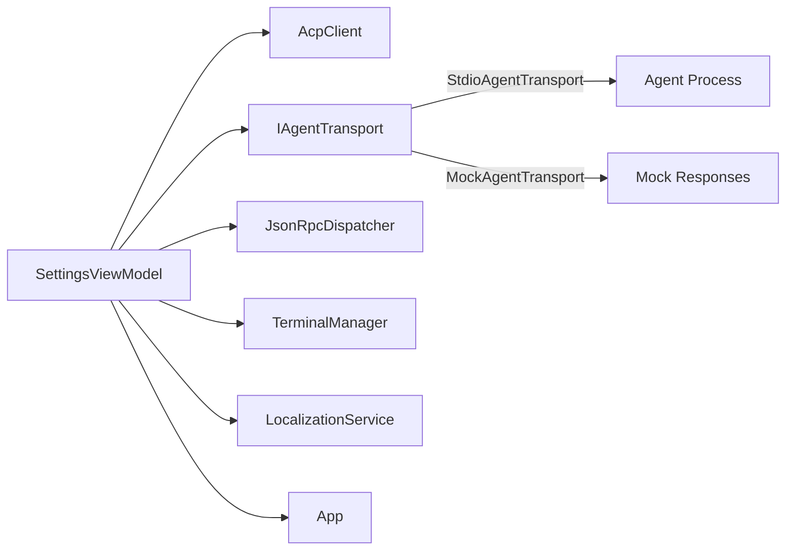

# SettingsViewModel

<cite>
**Referenced Files in This Document**
- [SettingsViewModel.cs](file://Agentic.Desktop/ViewModels/SettingsViewModel.cs)
- [App.xaml.cs](file://Agentic.Desktop/App.xaml.cs)
- [MainWindow.xaml.cs](file://Agentic.Desktop/MainWindow.xaml.cs)
- [SettingsPage.xaml.cs](file://Agentic.Desktop/SettingsPage.xaml.cs)
- [MockAgentTransport.cs](file://Agentic.Desktop/Mocks/MockAgentTransport.cs)
- [TerminalManager.cs](file://Agentic.Desktop/Services/TerminalManager.cs)
- [LocalizationService.cs](file://Agentic.Desktop/Services/LocalizationService.cs)
- [Resources.resw](file://Agentic.Desktop/Strings/en/Resources.resw)
</cite>

## Table of Contents
1. [Introduction](#introduction)
2. [Project Structure](#project-structure)
3. [Core Components](#core-components)
4. [Architecture Overview](#architecture-overview)
5. [Detailed Component Analysis](#detailed-component-analysis)
6. [Dependency Analysis](#dependency-analysis)
7. [Performance Considerations](#performance-considerations)
8. [Troubleshooting Guide](#troubleshooting-guide)
9. [Conclusion](#conclusion)
10. [Appendices](#appendices)

## Introduction
This document provides detailed API documentation for the SettingsViewModel singleton class that manages application-wide settings and the agent connection lifecycle. It explains the shared instance pattern, global state management, configuration properties, connection methods, error handling, reconnection strategies, thread safety considerations, property binding examples, and common issues such as invalid agent paths and resource cleanup during shutdown.

## Project Structure
The SettingsViewModel resides in the ViewModels layer and coordinates with UI pages (SettingsPage), the application container (App), and external ACP library components to manage connections to an Agent process or a mock transport.

**Diagram sources**
- [SettingsViewModel.cs:15-161](file://Agentic.Desktop/ViewModels/SettingsViewModel.cs#L15-L161)
- [App.xaml.cs:44-83](file://Agentic.Desktop/App.xaml.cs#L44-L83)
- [MainWindow.xaml.cs:30-50](file://Agentic.Desktop/MainWindow.xaml.cs#L30-L50)
- [SettingsPage.xaml.cs:13-58](file://Agentic.Desktop/SettingsPage.xaml.cs#L13-L58)
- [MockAgentTransport.cs:9-124](file://Agentic.Desktop/Mocks/MockAgentTransport.cs#L9-L124)
- [TerminalManager.cs:11-128](file://Agentic.Desktop/Services/TerminalManager.cs#L11-L128)
- [LocalizationService.cs:8-22](file://Agentic.Desktop/Services/LocalizationService.cs#L8-L22)

**Section sources**
- [SettingsViewModel.cs:15-161](file://Agentic.Desktop/ViewModels/SettingsViewModel.cs#L15-L161)
- [App.xaml.cs:44-83](file://Agentic.Desktop/App.xaml.cs#L44-L83)
- [MainWindow.xaml.cs:30-50](file://Agentic.Desktop/MainWindow.xaml.cs#L30-L50)
- [SettingsPage.xaml.cs:13-58](file://Agentic.Desktop/SettingsPage.xaml.cs#L13-L58)

## Core Components
- SettingsViewModel: Singleton view model managing agent configuration and connection lifecycle.
- App: Global application container exposing current AcpClient and change notifications.
- MainWindow: UI window updating status indicators based on connection state.
- SettingsPage: Binds to SettingsViewModel and wires up permission and file system handlers after connection.
- TerminalManager: Manages terminal processes for ACP sessions.
- LocalizationService: Provides localized strings used across the app.

Key responsibilities:
- Maintain shared instance via static property.
- Expose observable configuration properties.
- Manage connection lifecycle (connect/disconnect/cleanup).
- Notify subscribers when connection changes.
- Coordinate with UI for status updates and permissions.

**Section sources**
- [SettingsViewModel.cs:15-161](file://Agentic.Desktop/ViewModels/SettingsViewModel.cs#L15-L161)
- [App.xaml.cs:44-83](file://Agentic.Desktop/App.xaml.cs#L44-L83)
- [MainWindow.xaml.cs:30-50](file://Agentic.Desktop/MainWindow.xaml.cs#L30-L50)
- [SettingsPage.xaml.cs:13-58](file://Agentic.Desktop/SettingsPage.xaml.cs#L13-L58)
- [TerminalManager.cs:11-128](file://Agentic.Desktop/Services/TerminalManager.cs#L11-L128)
- [LocalizationService.cs:8-22](file://Agentic.Desktop/Services/LocalizationService.cs#L8-L22)

## Architecture Overview
The SettingsViewModel orchestrates the ACP connection flow by selecting a transport (mock or stdio), initializing the client, creating a session, and notifying consumers. The App maintains the current AcpClient and raises change events for other parts of the application to react.

**Diagram sources**
- [SettingsViewModel.cs:60-126](file://Agentic.Desktop/ViewModels/SettingsViewModel.cs#L60-L126)
- [App.xaml.cs:78-83](file://Agentic.Desktop/App.xaml.cs#L78-L83)
- [MainWindow.xaml.cs:30-50](file://Agentic.Desktop/MainWindow.xaml.cs#L30-L50)
- [MockAgentTransport.cs:21-124](file://Agentic.Desktop/Mocks/MockAgentTransport.cs#L21-L124)
- [TerminalManager.cs:16-68](file://Agentic.Desktop/Services/TerminalManager.cs#L16-L68)

## Detailed Component Analysis

### SettingsViewModel API
- Shared Instance Pattern
  - Static property exposes a single instance accessible across navigation and page recreation.
  - Ensures connection state persists even when pages are recreated.

- Configuration Properties
  - AgentPath: Path to the agent executable; empty value triggers mock transport.
  - AgentArguments: Optional arguments passed to the agent process.
  - WorkingDirectory: Default is user profile; used for session creation and terminal operations.
  - ConnectionStatus: Localized status string updated throughout lifecycle.
  - AgentName: Populated from agent info after initialization.
  - SessionId: Assigned after session creation.
  - IsConnecting: Boolean flag indicating ongoing connection attempt.
  - IsConnected: Boolean flag indicating active connection.
  - ConnectionState: Integer enum-like state (0=Disconnected, 1=Connecting, 2=Connected).

- Connection Lifecycle Methods
  - ConnectAsync(): Establishes connection using selected transport, initializes client, creates session, sets terminal handler, and notifies subscribers.
  - DisconnectAsync(): Cleans up resources, resets state, and clears global AcpClient.
  - CleanupAsync(): Detaches event handlers, shuts down client, disposes terminal manager.

- Events and Notifications
  - OnAgentConnected: Action invoked with IAcpClient upon successful connection.
  - OnAgentDisconnected: Action invoked with a localized message when the agent process exits unexpectedly.

- Error Handling
  - Exceptions during connection set ConnectionStatus to a formatted failure message, clear AgentName and SessionId, and reset ConnectionState to Disconnected.

- Thread Safety Considerations
  - Observable properties are managed by CommunityToolkit.Mvvm; UI updates should be marshaled via App.DispatcherQueue where necessary.
  - Event subscriptions are safely detached during cleanup to avoid memory leaks.

**Diagram sources**
- [SettingsViewModel.cs:15-161](file://Agentic.Desktop/ViewModels/SettingsViewModel.cs#L15-L161)
- [TerminalManager.cs:11-128](file://Agentic.Desktop/Services/TerminalManager.cs#L11-L128)
- [App.xaml.cs:44-83](file://Agentic.Desktop/App.xaml.cs#L44-L83)
- [MainWindow.xaml.cs:30-50](file://Agentic.Desktop/MainWindow.xaml.cs#L30-L50)

**Section sources**
- [SettingsViewModel.cs:15-161](file://Agentic.Desktop/ViewModels/SettingsViewModel.cs#L15-L161)

### Property Binding Examples
- Bind AgentPath, AgentArguments, and WorkingDirectory to input controls in SettingsPage.
- Bind ConnectionStatus, IsConnecting, IsConnected, and ConnectionState to UI elements for real-time feedback.
- Use RelayCommand commands to trigger ConnectAsync and DisconnectAsync.

Example binding patterns:
- Text inputs bound to AgentPath and AgentArguments.
- Button commands bound to ConnectAsync and DisconnectAsync.
- Status text bound to ConnectionStatus.
- Visual indicators bound to ConnectionState (e.g., color-coded dot).

Note: Replace placeholders with actual XAML bindings in your project files.

**Section sources**
- [SettingsPage.xaml.cs:13-58](file://Agentic.Desktop/SettingsPage.xaml.cs#L13-L58)
- [Resources.resw:108-146](file://Agentic.Desktop/Strings/en/Resources.resw#L108-L146)

### Connection State Monitoring
- Subscribe to SettingsViewModel.PropertyChanged to react to ConnectionState changes.
- Update MainWindow status indicator based on state and agent name.
- Handle OnAgentConnected to wire permission and file system handlers.

Monitoring flow:
- ViewModel raises PropertyChanged on state changes.
- Page listens and calls UpdateConnectionStatus on MainWindow.
- MainWindow updates UI elements accordingly.

**Section sources**
- [SettingsPage.xaml.cs:56-77](file://Agentic.Desktop/SettingsPage.xaml.cs#L56-L77)
- [MainWindow.xaml.cs:30-50](file://Agentic.Desktop/MainWindow.xaml.cs#L30-L50)

### Configuration Validation
- Validate AgentPath before connecting:
  - If empty, use MockAgentTransport.
  - If provided, ensure path exists and is executable.
- Validate AgentArguments format if required by the agent.
- Ensure WorkingDirectory exists and is writable.

Validation recommendations:
- Add pre-connect checks in ConnectAsync or via validation attributes.
- Provide user-friendly error messages through LocalizationService.

**Section sources**
- [SettingsViewModel.cs:75-83](file://Agentic.Desktop/ViewModels/SettingsViewModel.cs#L75-L83)
- [LocalizationService.cs:15-21](file://Agentic.Desktop/Services/LocalizationService.cs#L15-L21)

### Reconnection Strategies
- Automatic reconnection can be implemented by subscribing to OnAgentDisconnected and retrying ConnectAsync with exponential backoff.
- Debounce rapid reconnection attempts to avoid excessive retries.
- Preserve configuration (AgentPath, AgentArguments, WorkingDirectory) across reconnections.

Reconnection flow:
- Detect disconnect via OnAgentDisconnected.
- Attempt reconnect after delay.
- Update UI and global state on success or failure.

[No sources needed since this section provides general guidance]

### Resource Cleanup During Shutdown
- Ensure CleanupAsync is called on DisconnectAsync and at application shutdown.
- Dispose TerminalManager to kill terminal processes.
- Unsubscribe from AcpClient.AgentProcessExited to prevent memory leaks.
- Clear global AcpClient via App.SetAcpClient(null).

Shutdown checklist:
- Call DisconnectAsync or CleanupAsync explicitly.
- Verify all event handlers are detached.
- Confirm TerminalManager.Dispose has been invoked.

**Section sources**
- [SettingsViewModel.cs:128-160](file://Agentic.Desktop/ViewModels/SettingsViewModel.cs#L128-L160)
- [TerminalManager.cs:115-128](file://Agentic.Desktop/Services/TerminalManager.cs#L115-L128)

## Dependency Analysis
SettingsViewModel depends on several components:
- AcpClient for communication with the agent.
- IAgentTransport implementations (StdioAgentTransport or MockAgentTransport).
- JsonRpcDispatcher for protocol handling.
- TerminalManager for terminal process management.
- LocalizationService for user-facing messages.
- App for global state and logging.

**Diagram sources**
- [SettingsViewModel.cs:73-106](file://Agentic.Desktop/ViewModels/SettingsViewModel.cs#L73-L106)
- [MockAgentTransport.cs:9-124](file://Agentic.Desktop/Mocks/MockAgentTransport.cs#L9-L124)
- [TerminalManager.cs:11-128](file://Agentic.Desktop/Services/TerminalManager.cs#L11-L128)
- [LocalizationService.cs:8-22](file://Agentic.Desktop/Services/LocalizationService.cs#L8-L22)
- [App.xaml.cs:44-83](file://Agentic.Desktop/App.xaml.cs#L44-L83)

**Section sources**
- [SettingsViewModel.cs:73-106](file://Agentic.Desktop/ViewModels/SettingsViewModel.cs#L73-L106)

## Performance Considerations
- Avoid repeated object creation: reuse AcpClient and TerminalManager instances where possible.
- Minimize UI thread work: marshal heavy operations off the UI thread.
- Debounce reconnection attempts to reduce load.
- Use efficient logging levels to avoid overhead.

[No sources needed since this section provides general guidance]

## Troubleshooting Guide
Common issues and resolutions:
- Invalid Agent Path:
  - Ensure the path points to a valid executable.
  - Use MockAgentTransport for development if path is empty.
- Connection Failures:
  - Check network and process availability.
  - Review exception messages in ConnectionStatus.
- Unexpected Disconnects:
  - Monitor AgentProcessExited events.
  - Implement reconnection logic with backoff.
- Resource Leaks:
  - Always call CleanupAsync on disconnect.
  - Dispose TerminalManager to terminate processes.

Debugging tips:
- Inspect LocalizationService keys for accurate error messages.
- Use App.LoggerFactory for detailed logs.
- Verify MainWindow status updates reflect correct state.

**Section sources**
- [SettingsViewModel.cs:115-126](file://Agentic.Desktop/ViewModels/SettingsViewModel.cs#L115-L126)
- [LocalizationService.cs:15-21](file://Agentic.Desktop/Services/LocalizationService.cs#L15-L21)
- [Resources.resw:176-191](file://Agentic.Desktop/Strings/en/Resources.resw#L176-L191)

## Conclusion
SettingsViewModel serves as the central coordinator for agent connections and application settings. Its singleton design ensures consistent state across navigation, while robust lifecycle management and error handling provide a reliable user experience. By following the documented patterns and guidelines, developers can implement secure, efficient, and maintainable agent connectivity within the desktop application.

[No sources needed since this section summarizes without analyzing specific files]

## Appendices

### Appendix A: Key Localization Keys
- StatusNotConnected, StatusConnectingProgress, StatusConnectedConfirm, StatusAgentDisconnected, StatusConnectionFailed.

**Section sources**
- [Resources.resw:176-191](file://Agentic.Desktop/Strings/en/Resources.resw#L176-L191)

### Appendix B: Example Usage Patterns
- Property binding for configuration inputs.
- Command binding for connect/disconnect actions.
- Event subscription for connection state monitoring.

[No sources needed since this section provides general guidance]