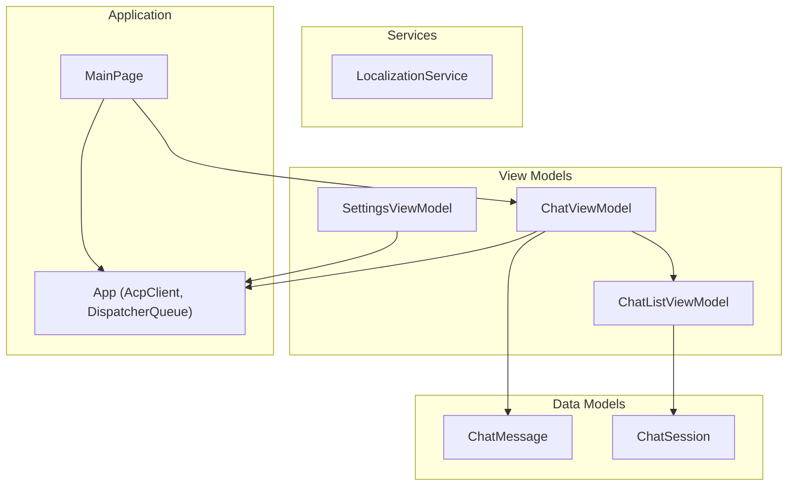
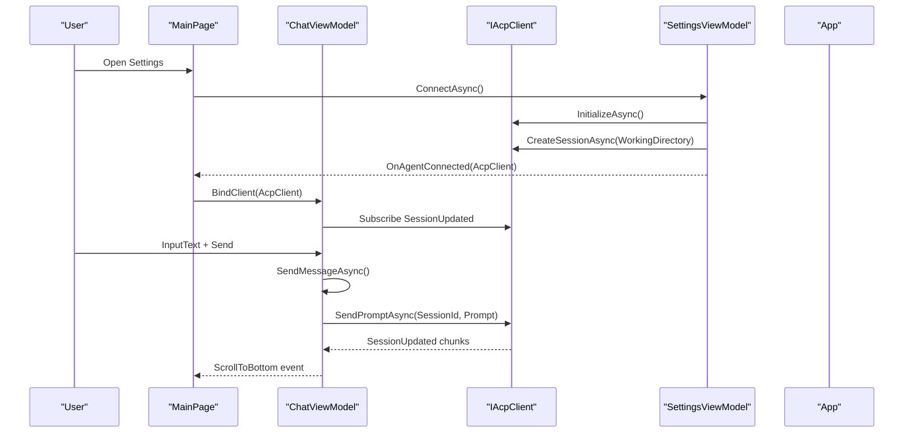
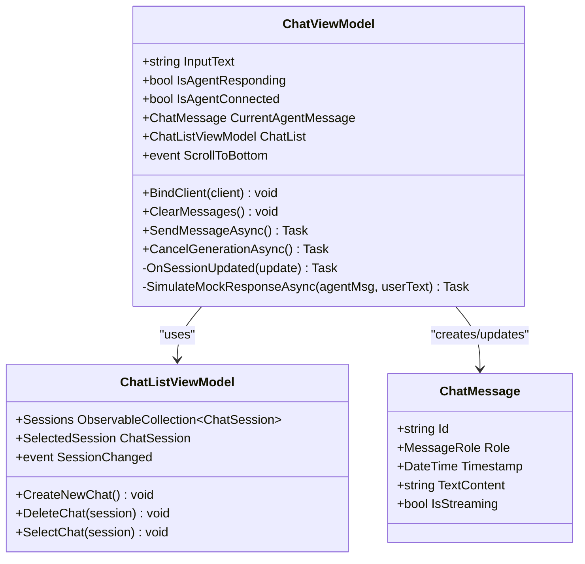
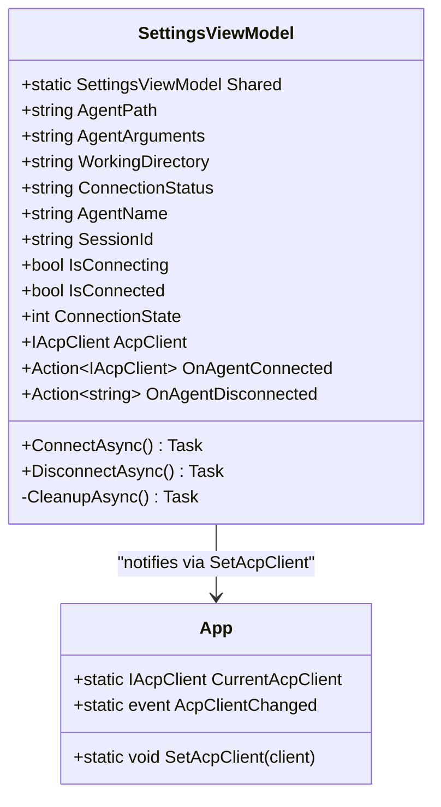
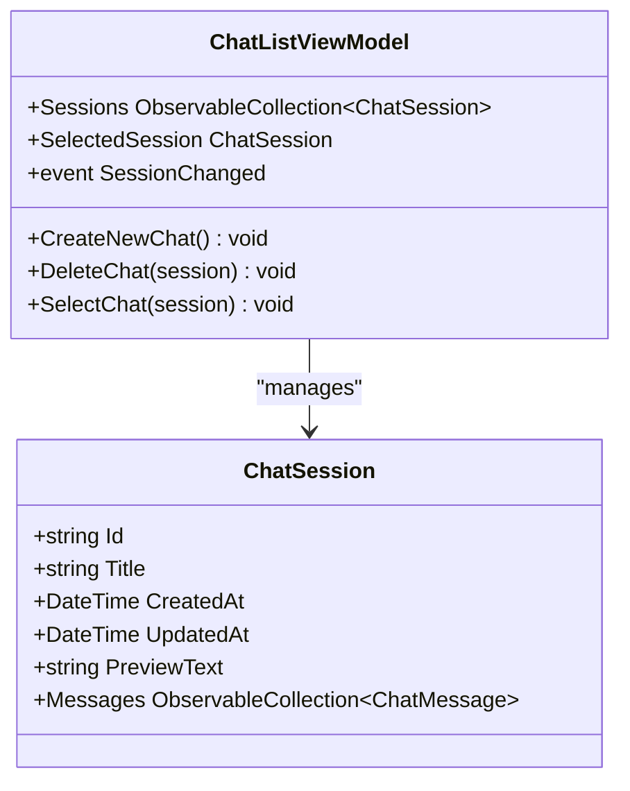
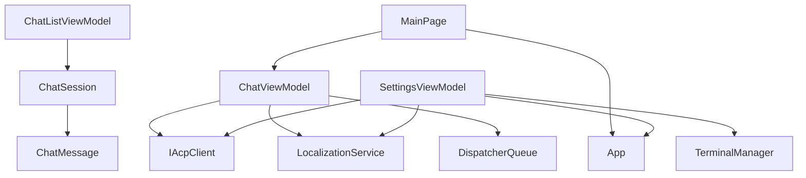

# View Models API

<cite>
**Referenced Files in This Document**
- [ChatViewModel.cs](file://Agentic.Desktop/ViewModels/ChatViewModel.cs)
- [SettingsViewModel.cs](file://Agentic.Desktop/ViewModels/SettingsViewModel.cs)
- [ChatListViewModel.cs](file://Agentic.Desktop/ViewModels/ChatListViewModel.cs)
- [ChatMessage.cs](file://Agentic.Desktop/ViewModels/Messages/ChatMessage.cs)
- [ChatSession.cs](file://Agentic.Desktop/ViewModels/Messages/ChatSession.cs)
- [LocalizationService.cs](file://Agentic.Desktop/Services/LocalizationService.cs)
- [App.xaml.cs](file://Agentic.Desktop/App.xaml.cs)
- [MainPage.xaml.cs](file://Agentic.Desktop/MainPage.xaml.cs)
</cite>

## Table of Contents
1. [Introduction](#introduction)
2. [Project Structure](#project-structure)
3. [Core Components](#core-components)
4. [Architecture Overview](#architecture-overview)
5. [Detailed Component Analysis](#detailed-component-analysis)
6. [Dependency Analysis](#dependency-analysis)
7. [Performance Considerations](#performance-considerations)
8. [Troubleshooting Guide](#troubleshooting-guide)
9. [Conclusion](#conclusion)

## Introduction
This document provides comprehensive API documentation for the Agentic.Desktop view model classes that power the chat UI and agent connection lifecycle. It focuses on:
- ChatViewModel: observable properties, message management methods, and events
- SettingsViewModel: singleton pattern, agent configuration, and connection lifecycle
- ChatListViewModel: session management
It also covers parameter specifications, return values, exception handling patterns, usage examples, and threading considerations using DispatcherQueue and async/await throughout the codebase.

## Project Structure
The view models are organized under the ViewModels folder with a clear separation between UI state (view models), data models (messages and sessions), and shared services (localization). The application coordinates connection state via App-level static members and page bindings.

**Diagram sources**
- [ChatViewModel.cs:11-34](file://Agentic.Desktop/ViewModels/ChatViewModel.cs#L11-L34)
- [SettingsViewModel.cs:15-58](file://Agentic.Desktop/ViewModels/SettingsViewModel.cs#L15-L58)
- [ChatListViewModel.cs:8-20](file://Agentic.Desktop/ViewModels/ChatListViewModel.cs#L8-L20)
- [ChatMessage.cs:14-31](file://Agentic.Desktop/ViewModels/Messages/ChatMessage.cs#L14-L31)
- [ChatSession.cs:10-27](file://Agentic.Desktop/ViewModels/Messages/ChatSession.cs#L10-L27)
- [LocalizationService.cs:8-22](file://Agentic.Desktop/Services/LocalizationService.cs#L8-L22)
- [App.xaml.cs:44-83](file://Agentic.Desktop/App.xaml.cs#L44-L83)
- [MainPage.xaml.cs:14-47](file://Agentic.Desktop/MainPage.xaml.cs#L14-L47)

**Section sources**
- [ChatViewModel.cs:11-34](file://Agentic.Desktop/ViewModels/ChatViewModel.cs#L11-L34)
- [SettingsViewModel.cs:15-58](file://Agentic.Desktop/ViewModels/SettingsViewModel.cs#L15-L58)
- [ChatListViewModel.cs:8-20](file://Agentic.Desktop/ViewModels/ChatListViewModel.cs#L8-L20)
- [ChatMessage.cs:14-31](file://Agentic.Desktop/ViewModels/Messages/ChatMessage.cs#L14-L31)
- [ChatSession.cs:10-27](file://Agentic.Desktop/ViewModels/Messages/ChatSession.cs#L10-L27)
- [LocalizationService.cs:8-22](file://Agentic.Desktop/Services/LocalizationService.cs#L8-L22)
- [App.xaml.cs:44-83](file://Agentic.Desktop/App.xaml.cs#L44-L83)
- [MainPage.xaml.cs:14-47](file://Agentic.Desktop/MainPage.xaml.cs#L14-L47)

## Core Components
- ChatViewModel: Manages user input, streaming responses, current agent message, and scroll behavior. Binds to IAcpClient for real-time updates and falls back to mock simulation when not connected.
- SettingsViewModel: Singleton providing agent configuration (path, arguments, working directory), connection status, and lifecycle methods (connect/disconnect/cleanup). Notifies external consumers upon successful connection.
- ChatListViewModel: Maintains a list of ChatSession objects, selection state, and operations to create/delete/select sessions. Emits SessionChanged events.

Key observable properties and commands are implemented using CommunityToolkit.Mvvm attributes, which generate INotifyPropertyChanged and RelayCommand implementations automatically.

**Section sources**
- [ChatViewModel.cs:17-34](file://Agentic.Desktop/ViewModels/ChatViewModel.cs#L17-L34)
- [SettingsViewModel.cs:20-46](file://Agentic.Desktop/ViewModels/SettingsViewModel.cs#L20-L46)
- [ChatListViewModel.cs:10-15](file://Agentic.Desktop/ViewModels/ChatListViewModel.cs#L10-L15)

## Architecture Overview
The architecture separates UI state from connection logic and uses events to coordinate cross-view-model communication.

**Diagram sources**
- [MainPage.xaml.cs:26-47](file://Agentic.Desktop/MainPage.xaml.cs#L26-L47)
- [SettingsViewModel.cs:60-126](file://Agentic.Desktop/ViewModels/SettingsViewModel.cs#L60-L126)
- [ChatViewModel.cs:74-85](file://Agentic.Desktop/ViewModels/ChatViewModel.cs#L74-L85)
- [ChatViewModel.cs:94-149](file://Agentic.Desktop/ViewModels/ChatViewModel.cs#L94-L149)
- [ChatViewModel.cs:151-204](file://Agentic.Desktop/ViewModels/ChatViewModel.cs#L151-L204)

## Detailed Component Analysis

### ChatViewModel
Responsibilities:
- Observable properties: InputText, IsAgentResponding, IsAgentConnected, CurrentAgentMessage
- Message management: SendMessageAsync, CancelGenerationAsync, BindClient, ClearMessages
- Events: ScrollToBottom
- Streaming updates: OnSessionUpdated handles AgentMessageChunk and ToolCallNotification

Observable Properties:
- InputText: string; two-way bound to UI input
- IsAgentResponding: bool; indicates active generation
- IsAgentConnected: bool; reflects IAcpClient binding state
- CurrentAgentMessage: ChatMessage?; reference to the currently streaming agent message

Methods:
- BindClient(IAcpClient client): void
  - Purpose: Subscribes to IAcpClient.SessionUpdated and sets IsAgentConnected = true
  - Parameters: client (IAcpClient)
  - Returns: void
  - Exceptions: None explicitly thrown; relies on IAcpClient events
  - Usage example: Called by MainPage when App.CurrentAcpClient is available or after SettingsViewModel connects

- ClearMessages(): void
  - Purpose: Clears Messages collection and resets IsAgentConnected to false
  - Parameters: none
  - Returns: void
  - Exceptions: None
  - Usage example: Invoked by MainPage when App.AcpClientChanged raises null

- SendMessageAsync(): Task
  - Purpose: Adds user message, creates placeholder agent message, streams response via IAcpClient or mock
  - Parameters: none
  - Returns: Task
  - Exceptions: OperationCanceledException handled; other exceptions formatted into agent message text
  - Threading: Uses DispatcherQueue.TryEnqueue to update UI safely
  - Usage example: Bound to UI command; clears InputText after sending

- CancelGenerationAsync(): Task
  - Purpose: Cancels ongoing generation via IAcpClient.CancelSessionAsync if available; resets streaming flags
  - Parameters: none
  - Returns: Task
  - Exceptions: None
  - Usage example: Bound to UI cancel action

Events:
- ScrollToBottom: Action
  - Raised when messages change to auto-scroll chat view
  - Subscribed by MainPage to perform scrolling

Streaming Logic:
- OnSessionUpdated(SessionUpdate update): Task
  - Handles AgentMessageChunk: accumulates text with frame-level merging and flushes batched updates every 50ms on UI thread
  - Handles ToolCallNotification: inserts system tool call message and updates session preview
  - Threading: All UI updates marshaled via DispatcherQueue.TryEnqueue

Threading Considerations:
- Uses Microsoft.UI.Dispatching.DispatcherQueue.GetForCurrentThread() to marshal UI updates
- Avoids direct UI updates from background threads
- Batched text accumulation reduces UI churn during streaming

Usage Examples:
- Binding IAcpClient: MainPage checks App.CurrentAcpClient and calls ViewModel.BindClient(client)
- Sending messages: User types InputText and triggers SendMessageAsync via UI command
- Handling disconnect: MainPage subscribes to App.AcpClientChanged and calls ViewModel.ClearMessages() when client is null

**Section sources**
- [ChatViewModel.cs:17-34](file://Agentic.Desktop/ViewModels/ChatViewModel.cs#L17-L34)
- [ChatViewModel.cs:74-92](file://Agentic.Desktop/ViewModels/ChatViewModel.cs#L74-L92)
- [ChatViewModel.cs:94-149](file://Agentic.Desktop/ViewModels/ChatViewModel.cs#L94-L149)
- [ChatViewModel.cs:151-204](file://Agentic.Desktop/ViewModels/ChatViewModel.cs#L151-L204)
- [ChatViewModel.cs:206-216](file://Agentic.Desktop/ViewModels/ChatViewModel.cs#L206-L216)
- [MainPage.xaml.cs:26-47](file://Agentic.Desktop/MainPage.xaml.cs#L26-L47)

#### ChatViewModel Class Diagram

**Diagram sources**
- [ChatViewModel.cs:11-34](file://Agentic.Desktop/ViewModels/ChatViewModel.cs#L11-L34)
- [ChatListViewModel.cs:8-63](file://Agentic.Desktop/ViewModels/ChatListViewModel.cs#L8-L63)
- [ChatMessage.cs:14-31](file://Agentic.Desktop/ViewModels/Messages/ChatMessage.cs#L14-L31)

### SettingsViewModel
Responsibilities:
- Singleton instance via Shared property
- Agent configuration properties: AgentPath, AgentArguments, WorkingDirectory
- Connection state: ConnectionStatus, AgentName, SessionId, IsConnecting, IsConnected, ConnectionState
- Lifecycle methods: ConnectAsync, DisconnectAsync, CleanupAsync
- Events: OnAgentConnected, OnAgentDisconnected

Singleton Pattern:
- Shared: static property returns a single instance across navigation and page recreation
- Ensures connection state persists across UI instances

Configuration Properties:
- AgentPath: string; path to agent executable (empty uses Mock transport)
- AgentArguments: string; arguments passed to agent process
- WorkingDirectory: string; defaults to user profile directory

Connection State Properties:
- ConnectionStatus: string; localized status text
- AgentName: string; agent title/name retrieved from InitializeAsync
- SessionId: string; created session identifier
- IsConnecting: bool; prevents concurrent connect attempts
- IsConnected: bool; reflects current connection state
- ConnectionState: int; enum-like state (0=Disconnected, 1=Connecting, 2=Connected)

Lifecycle Methods:
- ConnectAsync(): Task
  - Purpose: Initializes AcpClient, sets up terminal handler, creates session, updates state, notifies subscribers
  - Parameters: none
  - Returns: Task
  - Exceptions: Catches all exceptions; updates ConnectionStatus with localized error message
  - Threading: Updates observable properties directly; no explicit UI thread marshaling needed since it runs on UI thread via RelayCommand
  - Usage example: Bound to UI connect button

- DisconnectAsync(): Task
  - Purpose: Cleans up resources, resets state, notifies global app state
  - Parameters: none
  - Returns: Task
  - Exceptions: None
  - Usage example: Bound to UI disconnect button

- CleanupAsync(): Task
  - Purpose: Unsubscribes from events, shuts down AcpClient, disposes TerminalManager
  - Parameters: none
  - Returns: Task
  - Exceptions: None
  - Usage example: Called at start of ConnectAsync and within DisconnectAsync

Events:
- OnAgentConnected: Action<IAcpClient>; invoked after successful connection to notify MainPage to bind client
- OnAgentDisconnected: Action<string>; invoked when agent process exits unexpectedly

Usage Examples:
- Connecting with mock transport: Leave AgentPath empty; ConnectAsync uses MockAgentTransport
- Connecting with real agent: Set AgentPath and AgentArguments; ConnectAsync uses StdioAgentTransport
- Handling disconnect: Subscribe to OnAgentDisconnected to show notifications and reset UI

**Section sources**
- [SettingsViewModel.cs:15-58](file://Agentic.Desktop/ViewModels/SettingsViewModel.cs#L15-L58)
- [SettingsViewModel.cs:60-126](file://Agentic.Desktop/ViewModels/SettingsViewModel.cs#L60-L126)
- [SettingsViewModel.cs:128-140](file://Agentic.Desktop/ViewModels/SettingsViewModel.cs#L128-L140)
- [SettingsViewModel.cs:142-160](file://Agentic.Desktop/ViewModels/SettingsViewModel.cs#L142-L160)

#### SettingsViewModel Class Diagram

**Diagram sources**
- [SettingsViewModel.cs:15-58](file://Agentic.Desktop/ViewModels/SettingsViewModel.cs#L15-L58)
- [App.xaml.cs:44-83](file://Agentic.Desktop/App.xaml.cs#L44-L83)

### ChatListViewModel
Responsibilities:
- Maintains Sessions collection and SelectedSession
- Provides commands to create, delete, and select sessions
- Emits SessionChanged event when selection changes

Properties:
- Sessions: ObservableCollection<ChatSession>; list of chat sessions
- SelectedSession: ChatSession?; currently selected session

Commands:
- CreateNewChat(): void
  - Creates a new ChatSession, inserts at top, selects it
  - Parameters: none
  - Returns: void

- DeleteChat(ChatSession session): void
  - Removes session from list; adjusts selection if deleted session was selected
  - Parameters: session (ChatSession)
  - Returns: void

- SelectChat(ChatSession session): void
  - Sets SelectedSession and raises SessionChanged event
  - Parameters: session (ChatSession)
  - Returns: void

Events:
- SessionChanged: Action<ChatSession>; raised when selection changes

Usage Examples:
- Initial creation: Constructor calls CreateNewChat() to ensure at least one session exists
- Deleting last session: Automatically creates a new session to maintain non-empty list
- Binding to UI: MainPage binds ChatListPanel.ViewModel to ChatListViewModel instance

**Section sources**
- [ChatListViewModel.cs:8-63](file://Agentic.Desktop/ViewModels/ChatListViewModel.cs#L8-L63)

#### ChatListViewModel Class Diagram

**Diagram sources**
- [ChatListViewModel.cs:8-63](file://Agentic.Desktop/ViewModels/ChatListViewModel.cs#L8-L63)
- [ChatSession.cs:10-27](file://Agentic.Desktop/ViewModels/Messages/ChatSession.cs#L10-L27)

### Data Models

#### ChatMessage
- Properties:
  - Id: string; unique identifier generated via Guid
  - Role: MessageRole; enum indicating sender (User, Agent, System)
  - Timestamp: DateTime; creation time
  - TextContent: string; message content (supports Markdown raw text)
  - IsStreaming: bool; indicates active streaming state

- Constructor:
  - ChatMessage(MessageRole role, string textContent = "")

- Usage:
  - Created for user messages and agent placeholders
  - TextContent updated during streaming responses

**Section sources**
- [ChatMessage.cs:14-31](file://Agentic.Desktop/ViewModels/Messages/ChatMessage.cs#L14-L31)

#### ChatSession
- Properties:
  - Id: string; unique identifier
  - Title: string; session title (localized default)
  - CreatedAt: DateTime; session creation time
  - UpdatedAt: DateTime; last update time
  - PreviewText: string; preview snippet shown in sidebar
  - Messages: ObservableCollection<ChatMessage>; message history

- Usage:
  - Managed by ChatListViewModel
  - Updated by ChatViewModel during message sending and streaming

**Section sources**
- [ChatSession.cs:10-27](file://Agentic.Desktop/ViewModels/Messages/ChatSession.cs#L10-L27)

## Dependency Analysis
The view models depend on external libraries and application services:

**Diagram sources**
- [ChatViewModel.cs:1-8](file://Agentic.Desktop/ViewModels/ChatViewModel.cs#L1-L8)
- [SettingsViewModel.cs:1-11](file://Agentic.Desktop/ViewModels/SettingsViewModel.cs#L1-L11)
- [ChatListViewModel.cs:1-5](file://Agentic.Desktop/ViewModels/ChatListViewModel.cs#L1-L5)
- [App.xaml.cs:44-83](file://Agentic.Desktop/App.xaml.cs#L44-L83)

**Section sources**
- [ChatViewModel.cs:1-8](file://Agentic.Desktop/ViewModels/ChatViewModel.cs#L1-L8)
- [SettingsViewModel.cs:1-11](file://Agentic.Desktop/ViewModels/SettingsViewModel.cs#L1-L11)
- [ChatListViewModel.cs:1-5](file://Agentic.Desktop/ViewModels/ChatListViewModel.cs#L1-L5)
- [App.xaml.cs:44-83](file://Agentic.Desktop/App.xaml.cs#L44-L83)

## Performance Considerations
- Frame-level merging: ChatViewModel batches text chunks every 50ms to reduce UI updates during streaming
- DispatcherQueue marshaling: All UI updates are dispatched to the UI thread to prevent cross-thread exceptions
- Event subscription management: Properly unsubscribing from old session collections prevents memory leaks
- Async/await patterns: Non-blocking operations ensure UI responsiveness during network I/O and processing

[No sources needed since this section provides general guidance]

## Troubleshooting Guide
Common issues and resolutions:
- Connection failures: SettingsViewModel catches exceptions and updates ConnectionStatus with localized error messages
- Agent process exit: OnAgentDisconnected event notifies UI to handle unexpected disconnections
- Streaming interruptions: OperationCanceledException is handled gracefully; streaming flags are reset in finally blocks
- UI thread violations: Ensure all UI updates use DispatcherQueue.TryEnqueue to avoid cross-thread exceptions

**Section sources**
- [SettingsViewModel.cs:115-126](file://Agentic.Desktop/ViewModels/SettingsViewModel.cs#L115-L126)
- [ChatViewModel.cs:135-148](file://Agentic.Desktop/ViewModels/ChatViewModel.cs#L135-L148)

## Conclusion
The Agentic.Desktop view models provide a robust foundation for chat interactions and agent connectivity. ChatViewModel manages message flow and streaming with proper UI threading, SettingsViewModel implements a singleton pattern for persistent connection state, and ChatListViewModel handles session lifecycle. The architecture leverages async/await patterns and DispatcherQueue for responsive UI updates while maintaining clean separation of concerns.

[No sources needed since this section summarizes without analyzing specific files]