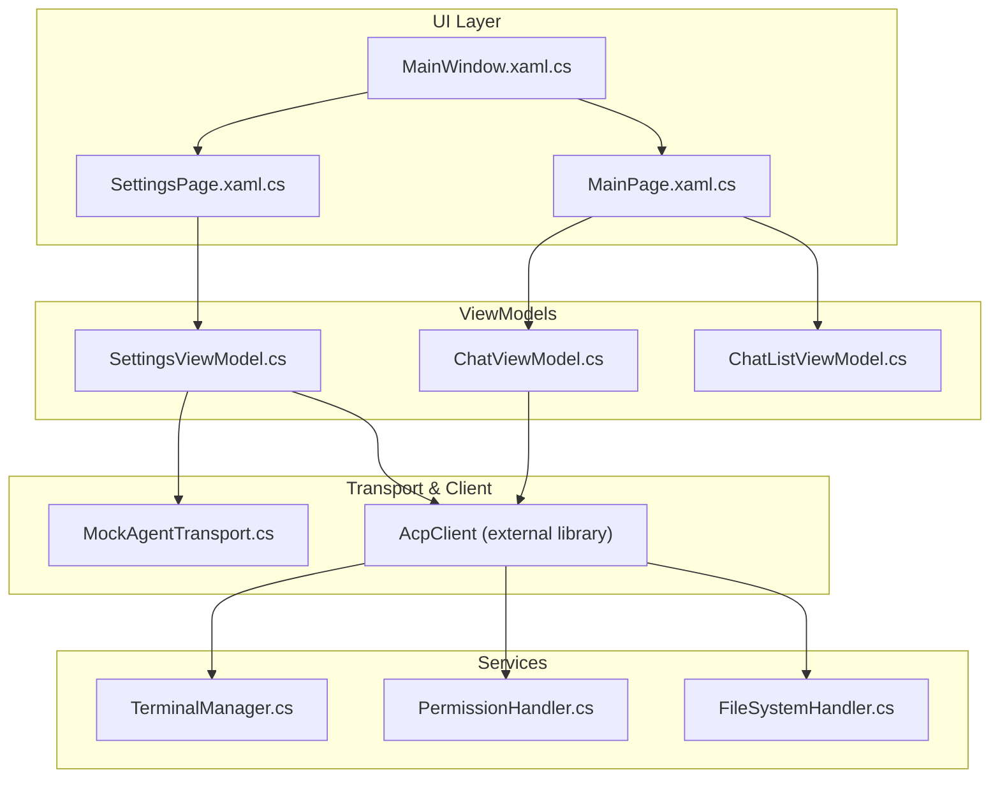
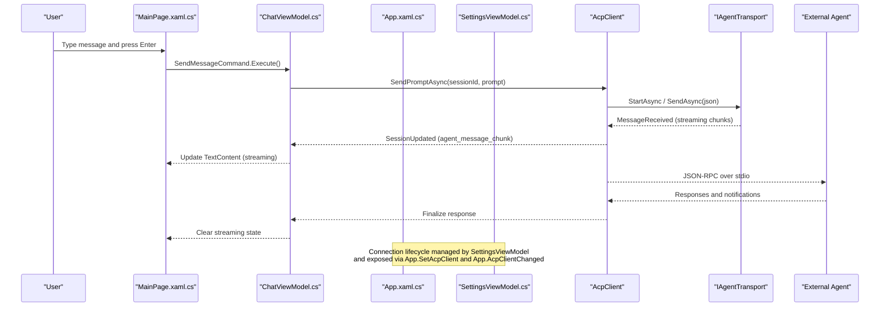
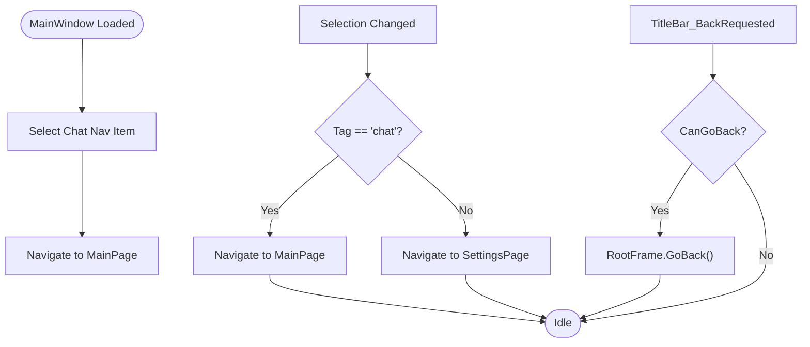
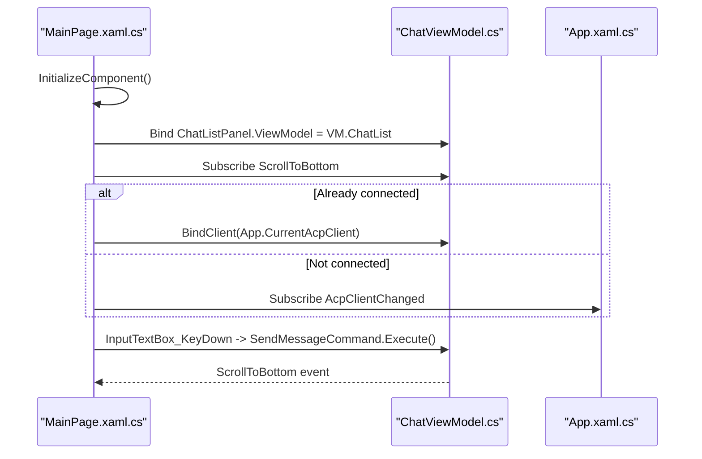
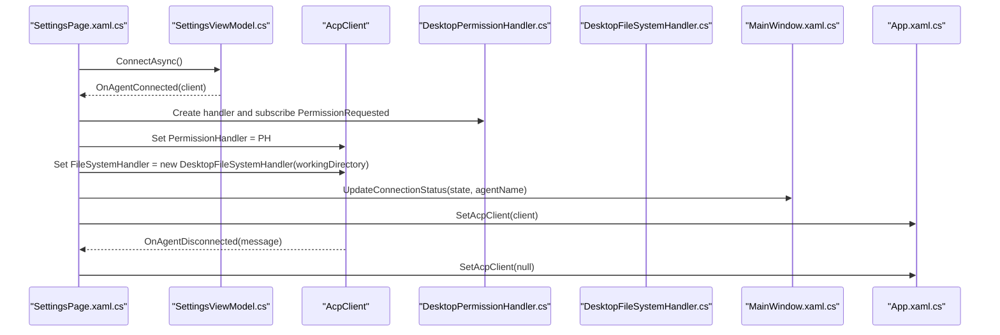
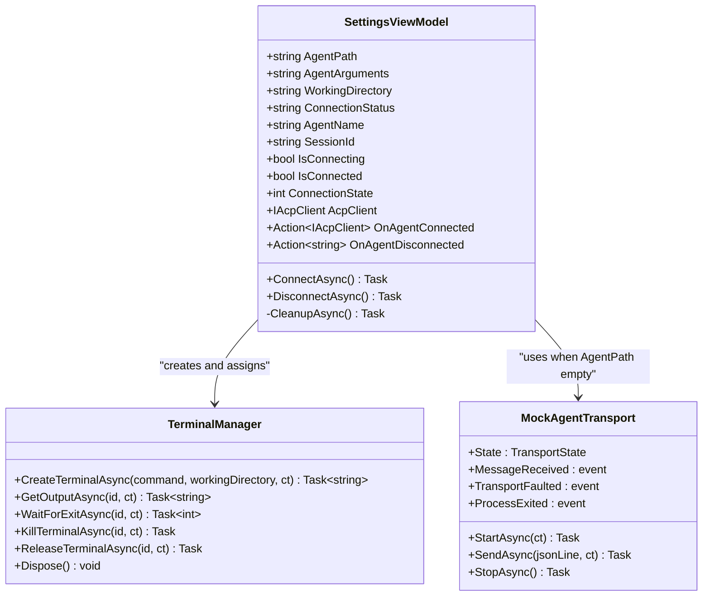
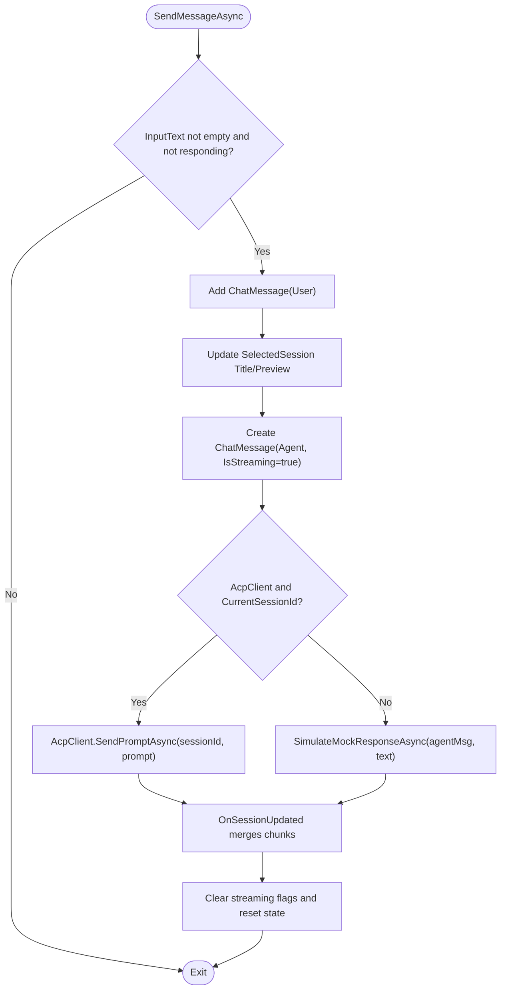
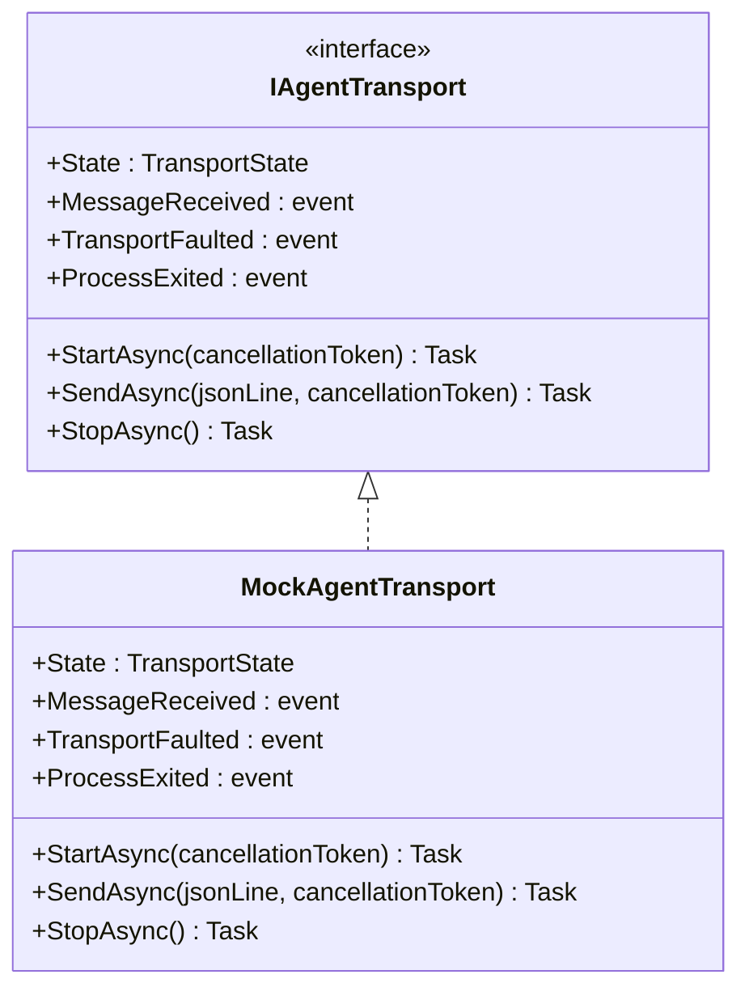
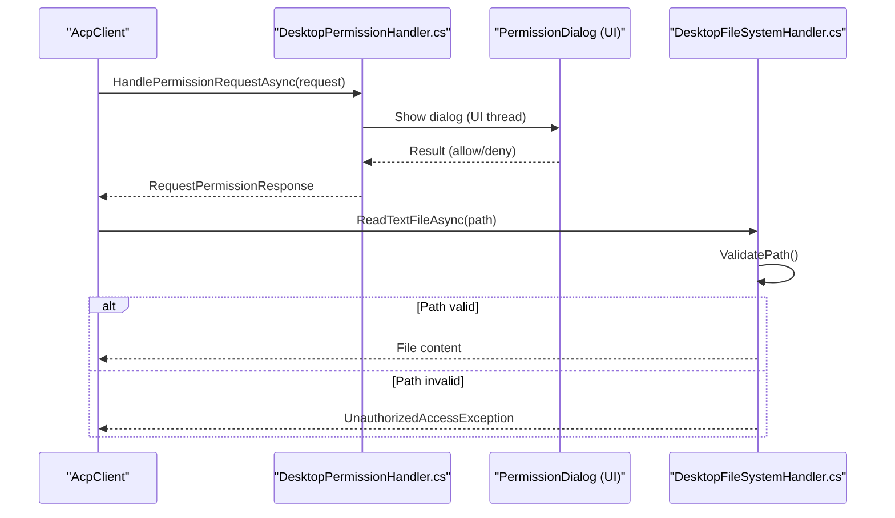
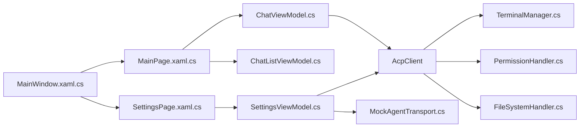

# Architecture Overview

<cite>
**Referenced Files in This Document**
- [MainWindow.xaml.cs](file://Agentic.Desktop/MainWindow.xaml.cs)
- [MainWindow.xaml](file://Agentic.Desktop/MainWindow.xaml)
- [MainPage.xaml.cs](file://Agentic.Desktop/MainPage.xaml.cs)
- [MainPage.xaml](file://Agentic.Desktop/MainPage.xaml)
- [App.xaml.cs](file://Agentic.Desktop/App.xaml.cs)
- [SettingsViewModel.cs](file://Agentic.Desktop/ViewModels/SettingsViewModel.cs)
- [ChatViewModel.cs](file://Agentic.Desktop/ViewModels/ChatViewModel.cs)
- [ChatListViewModel.cs](file://Agentic.Desktop/ViewModels/ChatListViewModel.cs)
- [TerminalManager.cs](file://Agentic.Desktop/Services/TerminalManager.cs)
- [PermissionHandler.cs](file://Agentic.Desktop/Services/PermissionHandler.cs)
- [FileSystemHandler.cs](file://Agentic.Desktop/Services/FileSystemHandler.cs)
- [MockAgentTransport.cs](file://Agentic.Desktop/Mocks/MockAgentTransport.cs)
- [ChatMessage.cs](file://Agentic.Desktop/ViewModels/Messages/ChatMessage.cs)
- [ChatSession.cs](file://Agentic.Desktop/ViewModels/Messages/ChatSession.cs)
</cite>

## Table of Contents
1. Introduction
2. Project Structure
3. Core Components
4. Architecture Overview
5. Detailed Component Analysis
6. Dependency Analysis
7. Performance Considerations
8. Troubleshooting Guide
9. Conclusion

## Introduction
This document explains the MVVM-based architecture of Agentic.Desktop, focusing on how the WinUI UI layer, CommunityToolkit.Mvvm ViewModels, and the AcpClient communication layer collaborate to deliver a responsive chat experience with external agents. It covers navigation, chat flow, transport abstraction (stdio vs mock), cross-cutting concerns (permissions, terminal management, file system security), event-driven patterns, and the singleton SettingsViewModel that manages global connection state.

## Project Structure
The application follows a clear separation:
- UI Layer (WinUI 3): MainWindow hosts navigation; MainPage renders the chat interface; SettingsPage configures connections.
- ViewModels: ChatViewModel orchestrates chat logic; ChatListViewModel manages sessions; SettingsViewModel is a singleton for connection lifecycle and global state.
- Services: TerminalManager implements ITerminalHandler; DesktopPermissionHandler implements IPermissionHandler; DesktopFileSystemHandler implements IFileSystemHandler.
- Transport Abstraction: MockAgentTransport provides a mock IAgentTransport for development; StdioAgentTransport is used when an agent path is configured.

**Diagram sources**
- [MainWindow.xaml.cs](file://Agentic.Desktop/MainWindow.xaml.cs)
- [MainPage.xaml.cs](file://Agentic.Desktop/MainPage.xaml.cs)
- [SettingsPage.xaml.cs](file://Agentic.Desktop/SettingsPage.xaml.cs)
- [SettingsViewModel.cs](file://Agentic.Desktop/ViewModels/SettingsViewModel.cs)
- [ChatViewModel.cs](file://Agentic.Desktop/ViewModels/ChatViewModel.cs)
- [ChatListViewModel.cs](file://Agentic.Desktop/ViewModels/ChatListViewModel.cs)
- [TerminalManager.cs](file://Agentic.Desktop/Services/TerminalManager.cs)
- [PermissionHandler.cs](file://Agentic.Desktop/Services/PermissionHandler.cs)
- [FileSystemHandler.cs](file://Agentic.Desktop/Services/FileSystemHandler.cs)
- [MockAgentTransport.cs](file://Agentic.Desktop/Mocks/MockAgentTransport.cs)

**Section sources**
- [MainWindow.xaml.cs](file://Agentic.Desktop/MainWindow.xaml.cs)
- [MainWindow.xaml](file://Agentic.Desktop/MainWindow.xaml)
- [MainPage.xaml.cs](file://Agentic.Desktop/MainPage.xaml.cs)
- [MainPage.xaml](file://Agentic.Desktop/MainPage.xaml)
- [App.xaml.cs](file://Agentic.Desktop/App.xaml.cs)

## Core Components
- MainWindow: Hosts NavigationView and RootFrame; updates title bar connection status; navigates between Chat and Settings pages.
- MainPage: Binds ChatListPanel to ChatListViewModel; subscribes to ViewModel events; binds AcpClient from App; handles user input and scroll behavior.
- SettingsPage: Uses SettingsViewModel.Shared; wires permission and file system handlers; updates window status and global AcpClient.
- SettingsViewModel (singleton): Manages connection lifecycle, creates AcpClient via selected transport, initializes session, sets TerminalManager and PermissionHandler, exposes OnAgentConnected/OnAgentDisconnected.
- ChatViewModel: Manages messages, streaming updates, cancellation, and delegates prompt sending to AcpClient or simulates locally if no client.
- ChatListViewModel: Maintains sessions and selection; raises SessionChanged to update active message list.
- Services: TerminalManager (process orchestration), DesktopPermissionHandler (UI dialog bridge), DesktopFileSystemHandler (sandboxed file access).
- Transport: MockAgentTransport emulates JSON-RPC over stdio for development; real usage uses StdioAgentTransport.

**Section sources**
- [MainWindow.xaml.cs](file://Agentic.Desktop/MainWindow.xaml.cs)
- [MainPage.xaml.cs](file://Agentic.Desktop/MainPage.xaml.cs)
- [SettingsPage.xaml.cs](file://Agentic.Desktop/SettingsPage.xaml.cs)
- [SettingsViewModel.cs](file://Agentic.Desktop/ViewModels/SettingsViewModel.cs)
- [ChatViewModel.cs](file://Agentic.Desktop/ViewModels/ChatViewModel.cs)
- [ChatListViewModel.cs](file://Agentic.Desktop/ViewModels/ChatListViewModel.cs)
- [TerminalManager.cs](file://Agentic.Desktop/Services/TerminalManager.cs)
- [PermissionHandler.cs](file://Agentic.Desktop/Services/PermissionHandler.cs)
- [FileSystemHandler.cs](file://Agentic.Desktop/Services/FileSystemHandler.cs)
- [MockAgentTransport.cs](file://Agentic.Desktop/Mocks/MockAgentTransport.cs)

## Architecture Overview
The application follows MVVM with event-driven interactions:
- User actions in WinUI trigger commands in ViewModels.
- ViewModels coordinate with AcpClient for agent communication.
- AcpClient uses IAgentTransport (Stdio or Mock) and integrates with services for permissions, terminals, and file system.
- Global state is centralized via App and SettingsViewModel.Shared.

**Diagram sources**
- [MainPage.xaml.cs](file://Agentic.Desktop/MainPage.xaml.cs)
- [ChatViewModel.cs](file://Agentic.Desktop/ViewModels/ChatViewModel.cs)
- [App.xaml.cs](file://Agentic.Desktop/App.xaml.cs)
- [SettingsViewModel.cs](file://Agentic.Desktop/ViewModels/SettingsViewModel.cs)
- [MockAgentTransport.cs](file://Agentic.Desktop/Mocks/MockAgentTransport.cs)

## Detailed Component Analysis

### MainWindow: Navigation and Status
- Initializes window, sets icon, size, and title bar integration.
- Updates connection status dot and text based on state codes.
- Handles back requests and pane toggle.
- Navigates RootFrame to MainPage or SettingsPage based on NavigationViewItem tags.
- Provides NavigateToSettings for programmatic navigation.

**Diagram sources**
- [MainWindow.xaml.cs](file://Agentic.Desktop/MainWindow.xaml.cs)
- [MainWindow.xaml](file://Agentic.Desktop/MainWindow.xaml)

**Section sources**
- [MainWindow.xaml.cs](file://Agentic.Desktop/MainWindow.xaml.cs)
- [MainWindow.xaml](file://Agentic.Desktop/MainWindow.xaml)

### MainPage: Chat Interface and Client Binding
- Creates ChatViewModel instance and binds ChatListPanel.ViewModel.
- Subscribes to ViewModel.ScrollToBottom for auto-scroll.
- Binds existing AcpClient from App.CurrentAcpClient and listens to App.AcpClientChanged for dynamic updates.
- Triggers ViewModel.SendMessageCommand on Enter key.
- Toggles sidebar and scrolls to bottom after layout.

**Diagram sources**
- [MainPage.xaml.cs](file://Agentic.Desktop/MainPage.xaml.cs)
- [App.xaml.cs](file://Agentic.Desktop/App.xaml.cs)
- [ChatViewModel.cs](file://Agentic.Desktop/ViewModels/ChatViewModel.cs)

**Section sources**
- [MainPage.xaml.cs](file://Agentic.Desktop/MainPage.xaml.cs)
- [MainPage.xaml](file://Agentic.Desktop/MainPage.xaml)

### SettingsPage: Connection Setup and Cross-Cutting Handlers
- Uses SettingsViewModel.Shared to persist connection state across page recreation.
- On successful connection:
  - Creates DesktopPermissionHandler and wires PermissionRequested to show PermissionDialog.
  - Sets AcpClient.PermissionHandler and FileSystemHandler.
  - Updates MainWindow connection status and stores AcpClient globally via App.SetAcpClient.
- On disconnect: resets UI state and clears global AcpClient.

**Diagram sources**
- [SettingsPage.xaml.cs](file://Agentic.Desktop/SettingsPage.xaml.cs)
- [SettingsViewModel.cs](file://Agentic.Desktop/ViewModels/SettingsViewModel.cs)
- [PermissionHandler.cs](file://Agentic.Desktop/Services/PermissionHandler.cs)
- [FileSystemHandler.cs](file://Agentic.Desktop/Services/FileSystemHandler.cs)
- [MainWindow.xaml.cs](file://Agentic.Desktop/MainWindow.xaml.cs)
- [App.xaml.cs](file://Agentic.Desktop/App.xaml.cs)

**Section sources**
- [SettingsPage.xaml.cs](file://Agentic.Desktop/SettingsPage.xaml.cs)

### SettingsViewModel: Singleton Global State and Lifecycle
- Shared singleton ensures connection state persists across page navigation.
- ConnectAsync selects transport:
  - If AgentPath is empty: use MockAgentTransport.
  - Else: use StdioAgentTransport with arguments and working directory.
- Creates AcpClient with JsonRpcDispatcher and logger; subscribes to AgentProcessExited.
- Initializes TerminalManager and assigns to AcpClient.TerminalHandler.
- Creates session using working directory; updates UI properties and notifies via OnAgentConnected.
- DisconnectAsync cleans up resources and clears global AcpClient.

**Diagram sources**
- [SettingsViewModel.cs](file://Agentic.Desktop/ViewModels/SettingsViewModel.cs)
- [TerminalManager.cs](file://Agentic.Desktop/Services/TerminalManager.cs)
- [MockAgentTransport.cs](file://Agentic.Desktop/Mocks/MockAgentTransport.cs)

**Section sources**
- [SettingsViewModel.cs](file://Agentic.Desktop/ViewModels/SettingsViewModel.cs)

### ChatViewModel: Business Logic and Streaming
- Manages input text, streaming state, and current agent message.
- Binds to AcpClient.SessionUpdated to merge streaming chunks efficiently with frame-level batching.
- Sends prompts via AcpClient.SendPromptAsync when connected; otherwise simulates local responses.
- Cancels generation via AcpClient.CancelSessionAsync and updates UI state.
- Integrates with ChatListViewModel for session selection and message updates.

**Diagram sources**
- [ChatViewModel.cs](file://Agentic.Desktop/ViewModels/ChatViewModel.cs)

**Section sources**
- [ChatViewModel.cs](file://Agentic.Desktop/ViewModels/ChatViewModel.cs)
- [ChatListViewModel.cs](file://Agentic.Desktop/ViewModels/ChatListViewModel.cs)
- [ChatMessage.cs](file://Agentic.Desktop/ViewModels/Messages/ChatMessage.cs)
- [ChatSession.cs](file://Agentic.Desktop/ViewModels/Messages/ChatSession.cs)

### IAgentTransport Abstraction: Stdio and Mock
- IAgentTransport defines StartAsync, SendAsync, StopAsync, and events for messaging and faults.
- MockAgentTransport implements scripted JSON-RPC responses for development without a real agent process.
- StdioAgentTransport is used when AgentPath is provided, enabling real agent communication over standard I/O.

**Diagram sources**
- [MockAgentTransport.cs](file://Agentic.Desktop/Mocks/MockAgentTransport.cs)

**Section sources**
- [MockAgentTransport.cs](file://Agentic.Desktop/Mocks/MockAgentTransport.cs)
- [SettingsViewModel.cs](file://Agentic.Desktop/ViewModels/SettingsViewModel.cs)

### Cross-Cutting Concerns: Permissions, Terminals, File System Security
- DesktopPermissionHandler bridges IPermissionHandler to UI dialogs; dispatches to UI thread and awaits user decision.
- TerminalManager implements ITerminalHandler, managing multiple shell processes, reading stdout/stderr asynchronously, and providing lifecycle methods.
- DesktopFileSystemHandler enforces sandboxed file access within the configured working directory, throwing UnauthorizedAccessException for out-of-scope paths.

**Diagram sources**
- [PermissionHandler.cs](file://Agentic.Desktop/Services/PermissionHandler.cs)
- [FileSystemHandler.cs](file://Agentic.Desktop/Services/FileSystemHandler.cs)

**Section sources**
- [PermissionHandler.cs](file://Agentic.Desktop/Services/PermissionHandler.cs)
- [TerminalManager.cs](file://Agentic.Desktop/Services/TerminalManager.cs)
- [FileSystemHandler.cs](file://Agentic.Desktop/Services/FileSystemHandler.cs)

## Dependency Analysis
Key dependencies and relationships:
- UI layers depend on ViewModels through data binding and command invocation.
- ViewModels depend on AcpClient for agent communication and on services for cross-cutting features.
- SettingsViewModel centralizes transport selection and lifecycle, exposing global state via App.
- Services implement interfaces expected by AcpClient, ensuring loose coupling and testability.

**Diagram sources**
- [MainWindow.xaml.cs](file://Agentic.Desktop/MainWindow.xaml.cs)
- [MainPage.xaml.cs](file://Agentic.Desktop/MainPage.xaml.cs)
- [SettingsPage.xaml.cs](file://Agentic.Desktop/SettingsPage.xaml.cs)
- [SettingsViewModel.cs](file://Agentic.Desktop/ViewModels/SettingsViewModel.cs)
- [ChatViewModel.cs](file://Agentic.Desktop/ViewModels/ChatViewModel.cs)
- [ChatListViewModel.cs](file://Agentic.Desktop/ViewModels/ChatListViewModel.cs)
- [TerminalManager.cs](file://Agentic.Desktop/Services/TerminalManager.cs)
- [PermissionHandler.cs](file://Agentic.Desktop/Services/PermissionHandler.cs)
- [FileSystemHandler.cs](file://Agentic.Desktop/Services/FileSystemHandler.cs)
- [MockAgentTransport.cs](file://Agentic.Desktop/Mocks/MockAgentTransport.cs)

**Section sources**
- [App.xaml.cs](file://Agentic.Desktop/App.xaml.cs)

## Performance Considerations
- Streaming updates are batched in ChatViewModel to reduce UI churn during high-frequency agent_message_chunk events.
- DispatcherQueue marshalling ensures UI updates occur on the correct thread.
- TerminalManager reads stdout/stderr asynchronously to avoid blocking the UI thread.
- MockAgentTransport introduces artificial delays to simulate realistic streaming behavior during development.

[No sources needed since this section provides general guidance]

## Troubleshooting Guide
- Connection failures: Check SettingsViewModel.ConnectAsync exception handling and ensure AgentPath and arguments are valid.
- No messages displayed: Verify App.CurrentAcpClient is set and MainPage subscribes to AcpClientChanged.
- Permission dialogs not appearing: Ensure DesktopPermissionHandler.PermissionRequested is wired and dispatched to UI thread.
- File access denied: Confirm DesktopFileSystemHandler.ValidatePath allows the requested path within the working directory.
- Terminal output missing: Inspect TerminalManager's async readers and ensure processes are started correctly.

**Section sources**
- [SettingsViewModel.cs](file://Agentic.Desktop/ViewModels/SettingsViewModel.cs)
- [MainPage.xaml.cs](file://Agentic.Desktop/MainPage.xaml.cs)
- [PermissionHandler.cs](file://Agentic.Desktop/Services/PermissionHandler.cs)
- [FileSystemHandler.cs](file://Agentic.Desktop/Services/FileSystemHandler.cs)
- [TerminalManager.cs](file://Agentic.Desktop/Services/TerminalManager.cs)

## Conclusion
Agentic.Desktop employs a robust MVVM architecture with clear separation of concerns: WinUI handles presentation, ViewModels encapsulate business logic, and AcpClient abstracts agent communication through IAgentTransport. Event-driven patterns enable reactive UI updates, while services provide secure and flexible cross-cutting capabilities. The singleton SettingsViewModel ensures consistent global state across navigation, and the transport abstraction supports both development-friendly mocking and production-grade stdio communication.

[No sources needed since this section summarizes without analyzing specific files]