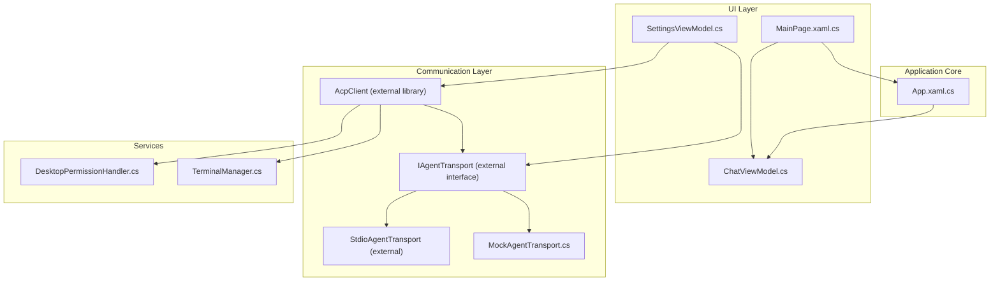
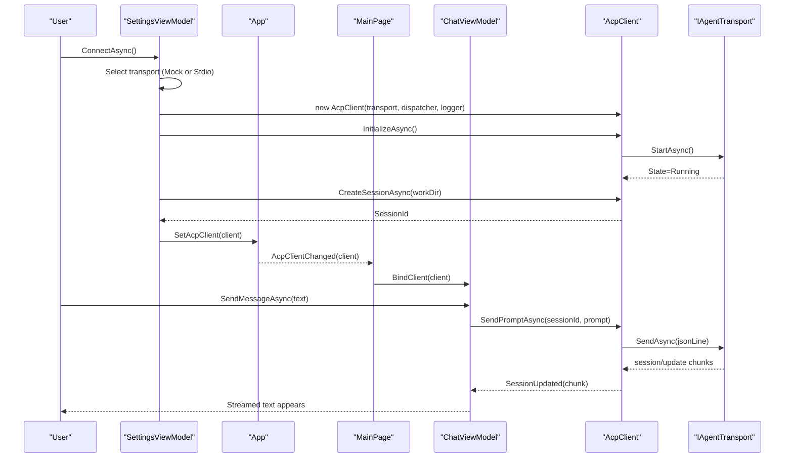
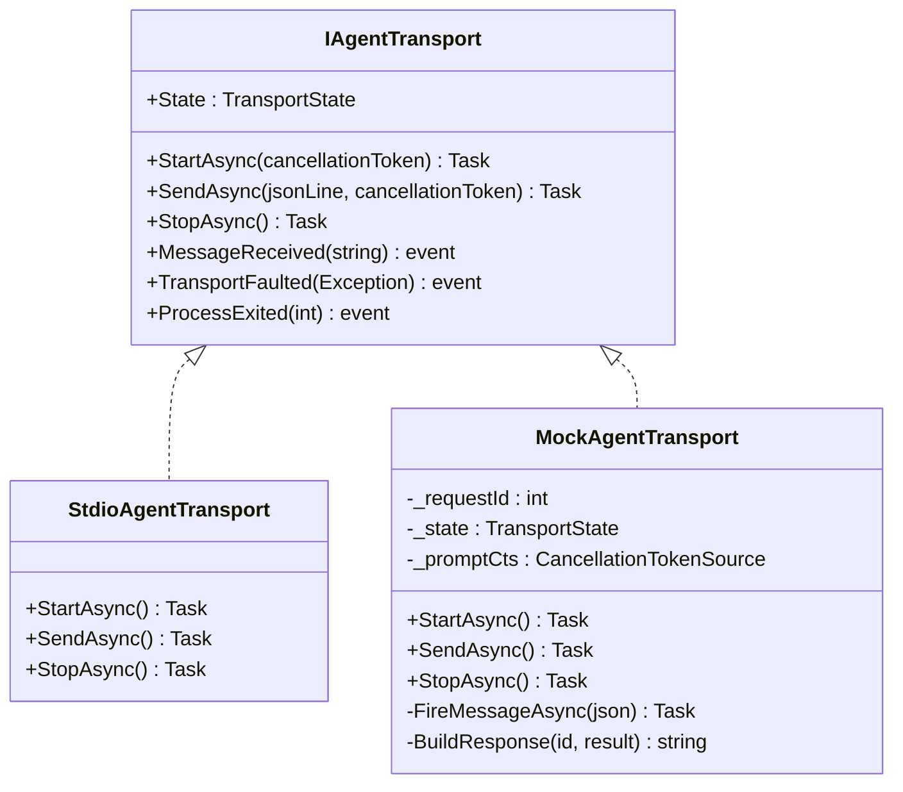
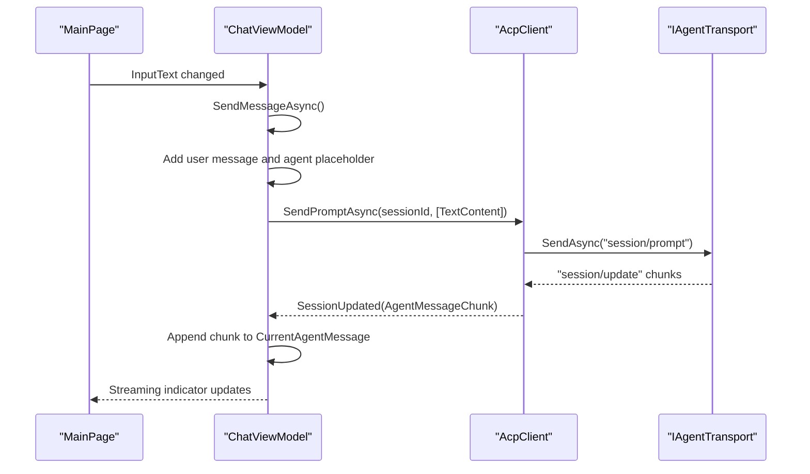
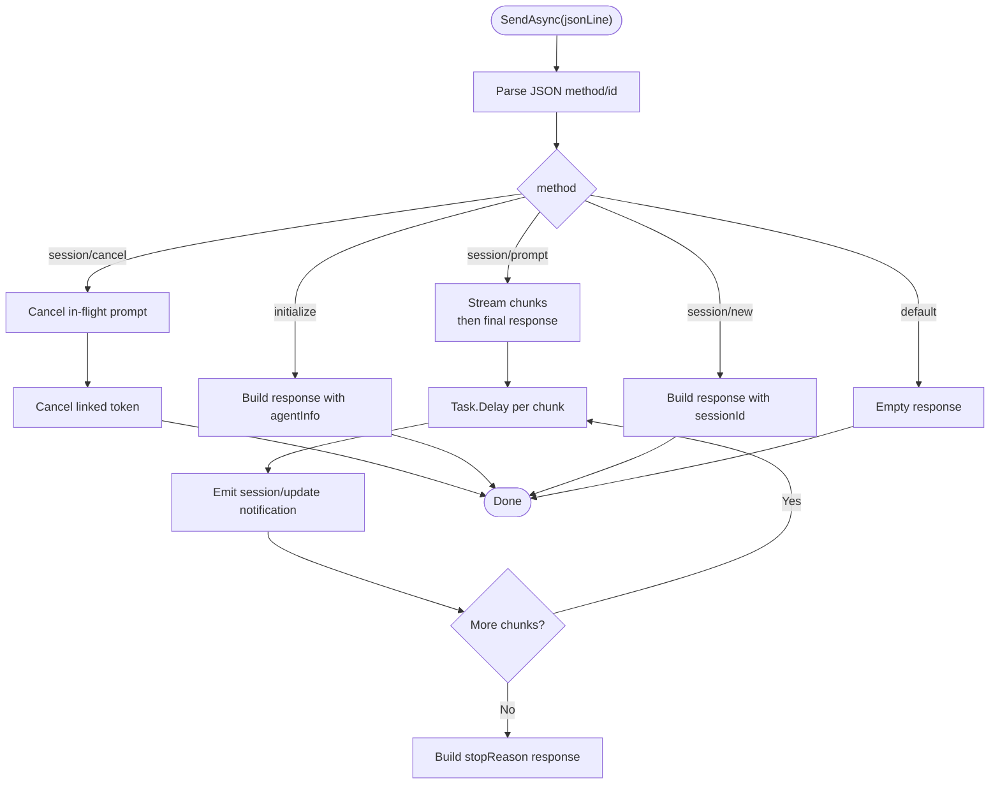
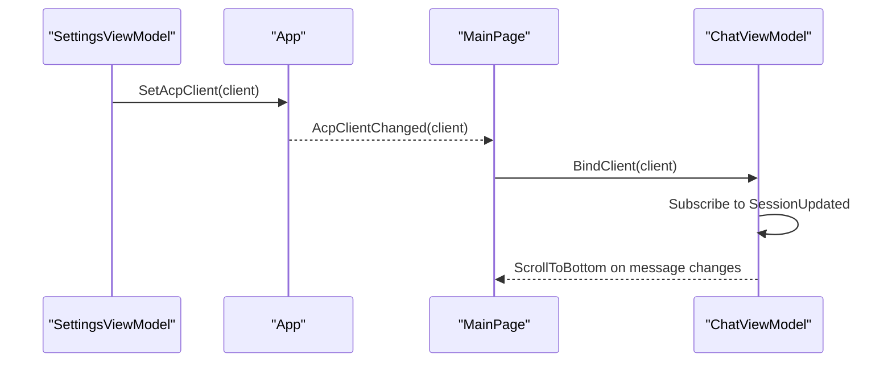
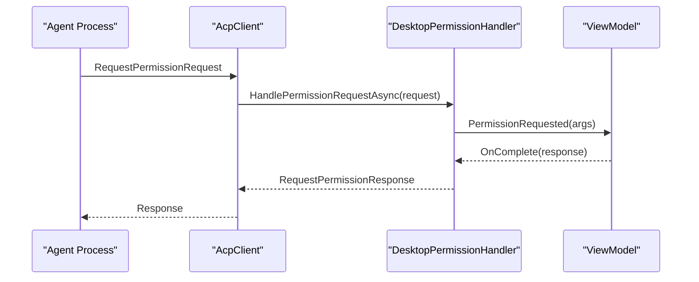
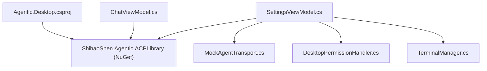

# Communication Layer Architecture

<cite>
**Referenced Files in This Document**
- [MockAgentTransport.cs](file://Agentic.Desktop/Mocks/MockAgentTransport.cs)
- [ChatViewModel.cs](file://Agentic.Desktop/ViewModels/ChatViewModel.cs)
- [SettingsViewModel.cs](file://Agentic.Desktop/ViewModels/SettingsViewModel.cs)
- [App.xaml.cs](file://Agentic.Desktop/App.xaml.cs)
- [MainPage.xaml.cs](file://Agentic.Desktop/MainPage.xaml.cs)
- [PermissionHandler.cs](file://Agentic.Desktop/Services/PermissionHandler.cs)
- [TerminalManager.cs](file://Agentic.Desktop/Services/TerminalManager.cs)
- [ChatMessage.cs](file://Agentic.Desktop/ViewModels/Messages/ChatMessage.cs)
- [Agentic.Desktop.csproj](file://Agentic.Desktop/Agentic.Desktop.csproj)
</cite>

## Table of Contents
1. [Introduction](#introduction)
2. [Project Structure](#project-structure)
3. [Core Components](#core-components)
4. [Architecture Overview](#architecture-overview)
5. [Detailed Component Analysis](#detailed-component-analysis)
6. [Dependency Analysis](#dependency-analysis)
7. [Performance Considerations](#performance-considerations)
8. [Troubleshooting Guide](#troubleshooting-guide)
9. [Conclusion](#conclusion)

## Introduction
This document explains the communication layer that abstracts agent interactions through a transport abstraction and a unified client interface. The AcpClient provides a single API for both real stdio-based agents and mock implementations used during development and testing. The design uses an event-driven architecture to handle connection state changes, streaming messages, and permission requests. ChatViewModel demonstrates how the UI consumes the AcpClient for real-time messaging, while MockAgentTransport simulates agent behavior to enable rapid iteration without external dependencies.

## Project Structure
The communication layer spans ViewModels, Services, and a Mock implementation:
- SettingsViewModel orchestrates transport selection (mock vs stdio), client initialization, session creation, and global connection state propagation.
- ChatViewModel binds to IAcpClient to send prompts, receive streaming updates, and manage UI state.
- App exposes a global current client and events to notify UI layers on connection changes.
- Services implement platform-specific handlers for permissions and terminal processes.
- MockAgentTransport implements the transport interface to simulate agent responses for local development.

**Diagram sources**
- [MainPage.xaml.cs](file://Agentic.Desktop/MainPage.xaml.cs)
- [ChatViewModel.cs](file://Agentic.Desktop/ViewModels/ChatViewModel.cs)
- [SettingsViewModel.cs](file://Agentic.Desktop/ViewModels/SettingsViewModel.cs)
- [App.xaml.cs](file://Agentic.Desktop/App.xaml.cs)
- [MockAgentTransport.cs](file://Agentic.Desktop/Mocks/MockAgentTransport.cs)
- [PermissionHandler.cs](file://Agentic.Desktop/Services/PermissionHandler.cs)
- [TerminalManager.cs](file://Agentic.Desktop/Services/TerminalManager.cs)

**Section sources**
- [SettingsViewModel.cs](file://Agentic.Desktop/ViewModels/SettingsViewModel.cs)
- [ChatViewModel.cs](file://Agentic.Desktop/ViewModels/ChatViewModel.cs)
- [App.xaml.cs](file://Agentic.Desktop/App.xaml.cs)
- [MainPage.xaml.cs](file://Agentic.Desktop/MainPage.xaml.cs)
- [MockAgentTransport.cs](file://Agentic.Desktop/Mocks/MockAgentTransport.cs)
- [PermissionHandler.cs](file://Agentic.Desktop/Services/PermissionHandler.cs)
- [TerminalManager.cs](file://Agentic.Desktop/Services/TerminalManager.cs)

## Core Components
- IAgentTransport: Abstraction for underlying communication mechanisms (stdio or mock). Implementations encapsulate start/stop lifecycle, message sending, and transport-level events.
- AcpClient: Unified client over IAgentTransport with JSON-RPC dispatching. It initializes sessions, sends prompts, handles streaming updates, and manages lifecycle events.
- MockAgentTransport: In-memory transport that responds to initialize, session/new, session/prompt, and session/cancel with scripted JSON-RPC messages and streaming chunks.
- DesktopPermissionHandler: Bridges agent permission requests to the UI thread, showing dialogs and returning user decisions asynchronously.
- TerminalManager: Manages multiple terminal processes, capturing stdout/stderr and providing lifecycle control.

Key responsibilities:
- Connection lifecycle: connect/disconnect, initialize, create session, shutdown.
- Message flow: send prompts, stream updates, cancel operations.
- Permission handling: request approval from the user before executing sensitive actions.
- Terminal integration: spawn and manage shell processes for tool execution.

**Section sources**
- [SettingsViewModel.cs](file://Agentic.Desktop/ViewModels/SettingsViewModel.cs)
- [ChatViewModel.cs](file://Agentic.Desktop/ViewModels/ChatViewModel.cs)
- [MockAgentTransport.cs](file://Agentic.Desktop/Mocks/MockAgentTransport.cs)
- [PermissionHandler.cs](file://Agentic.Desktop/Services/PermissionHandler.cs)
- [TerminalManager.cs](file://Agentic.Desktop/Services/TerminalManager.cs)

## Architecture Overview
The communication layer follows a transport abstraction pattern:
- SettingsViewModel selects a transport based on configuration (empty path implies mock; otherwise stdio).
- AcpClient is constructed with the selected transport, a JSON-RPC dispatcher, and optional logging.
- ChatViewModel binds to IAcpClient to send prompts and observe SessionUpdated events for streaming content.
- App maintains a global current client and raises AcpClientChanged to synchronize UI state across pages.

**Diagram sources**
- [SettingsViewModel.cs](file://Agentic.Desktop/ViewModels/SettingsViewModel.cs)
- [App.xaml.cs](file://Agentic.Desktop/App.xaml.cs)
- [MainPage.xaml.cs](file://Agentic.Desktop/MainPage.xaml.cs)
- [ChatViewModel.cs](file://Agentic.Desktop/ViewModels/ChatViewModel.cs)
- [MockAgentTransport.cs](file://Agentic.Desktop/Mocks/MockAgentTransport.cs)

## Detailed Component Analysis

### Transport Abstraction Pattern
IAgentTransport defines the contract for all transports. The application chooses between:
- StdioAgentTransport: Real stdio-based communication with an external agent process.
- MockAgentTransport: Deterministic, scripted responses for development and testing.

**Diagram sources**
- [MockAgentTransport.cs](file://Agentic.Desktop/Mocks/MockAgentTransport.cs)

**Section sources**
- [SettingsViewModel.cs](file://Agentic.Desktop/ViewModels/SettingsViewModel.cs)
- [MockAgentTransport.cs](file://Agentic.Desktop/Mocks/MockAgentTransport.cs)

### AcpClient Usage in ChatViewModel
ChatViewModel binds to IAcpClient to send prompts and render streamed responses:
- On user input, it creates a placeholder agent message and sets streaming state.
- It calls SendPromptAsync with the current session ID and a text content block.
- SessionUpdated events are handled to append text chunks to the current agent message, with batching to reduce UI churn.
- Cancellation is supported via CancelGenerationAsync which invokes CancelSessionAsync.

**Diagram sources**
- [ChatViewModel.cs](file://Agentic.Desktop/ViewModels/ChatViewModel.cs)
- [MockAgentTransport.cs](file://Agentic.Desktop/Mocks/MockAgentTransport.cs)

**Section sources**
- [ChatViewModel.cs](file://Agentic.Desktop/ViewModels/ChatViewModel.cs)
- [ChatMessage.cs](file://Agentic.Desktop/ViewModels/Messages/ChatMessage.cs)

### Mock Agent Behavior Simulation
MockAgentTransport simulates a full ACP conversation:
- initialize returns agent capabilities and info.
- session/new returns a fixed session ID.
- session/prompt streams multiple text chunks with delays, then returns a final stopReason.
- session/cancel cancels any in-flight prompt using a linked cancellation token.

**Diagram sources**
- [MockAgentTransport.cs](file://Agentic.Desktop/Mocks/MockAgentTransport.cs)

**Section sources**
- [MockAgentTransport.cs](file://Agentic.Desktop/Mocks/MockAgentTransport.cs)

### Event-Driven Connection State and Messaging
- SettingsViewModel manages connection lifecycle and emits OnAgentConnected when ready.
- App.SetAcpClient updates the global client and raises AcpClientChanged.
- MainPage subscribes to AcpClientChanged and binds/unbinds ChatViewModel accordingly.
- ChatViewModel subscribes to AcpClient.SessionUpdated to update messages in real time.

**Diagram sources**
- [SettingsViewModel.cs](file://Agentic.Desktop/ViewModels/SettingsViewModel.cs)
- [App.xaml.cs](file://Agentic.Desktop/App.xaml.cs)
- [MainPage.xaml.cs](file://Agentic.Desktop/MainPage.xaml.cs)
- [ChatViewModel.cs](file://Agentic.Desktop/ViewModels/ChatViewModel.cs)

**Section sources**
- [SettingsViewModel.cs](file://Agentic.Desktop/ViewModels/SettingsViewModel.cs)
- [App.xaml.cs](file://Agentic.Desktop/App.xaml.cs)
- [MainPage.xaml.cs](file://Agentic.Desktop/MainPage.xaml.cs)
- [ChatViewModel.cs](file://Agentic.Desktop/ViewModels/ChatViewModel.cs)

### Permission Requests and Terminal Integration
- DesktopPermissionHandler receives permission requests from the agent and marshals them to the UI thread.
- ViewModel shows a dialog and completes the request with the user’s decision.
- TerminalManager spawns shell processes, captures output streams, and supports lifecycle operations like kill/release/waitForExit.

**Diagram sources**
- [PermissionHandler.cs](file://Agentic.Desktop/Services/PermissionHandler.cs)

**Section sources**
- [PermissionHandler.cs](file://Agentic.Desktop/Services/PermissionHandler.cs)
- [TerminalManager.cs](file://Agentic.Desktop/Services/TerminalManager.cs)

## Dependency Analysis
The project depends on an external ACP library for the core client and transport abstractions. The dependency graph highlights how the desktop app composes these components:

**Diagram sources**
- [Agentic.Desktop.csproj](file://Agentic.Desktop/Agentic.Desktop.csproj)
- [SettingsViewModel.cs](file://Agentic.Desktop/ViewModels/SettingsViewModel.cs)
- [ChatViewModel.cs](file://Agentic.Desktop/ViewModels/ChatViewModel.cs)
- [MockAgentTransport.cs](file://Agentic.Desktop/Mocks/MockAgentTransport.cs)
- [PermissionHandler.cs](file://Agentic.Desktop/Services/PermissionHandler.cs)
- [TerminalManager.cs](file://Agentic.Desktop/Services/TerminalManager.cs)

**Section sources**
- [Agentic.Desktop.csproj](file://Agentic.Desktop/Agentic.Desktop.csproj)

## Performance Considerations
- Streaming batching: ChatViewModel batches incoming text chunks to minimize UI updates, reducing rendering overhead during high-frequency streaming.
- Dispatcher marshalling: All UI updates are dispatched to the UI thread to avoid cross-thread exceptions and ensure smooth rendering.
- Cancellation support: Both mock and real transports respect cancellation tokens, allowing responsive user-initiated cancellations.
- Resource cleanup: Proper disposal of terminal processes and client shutdown prevents resource leaks and ensures stable long-running sessions.

[No sources needed since this section provides general guidance]

## Troubleshooting Guide
Common issues and resolutions:
- No agent path configured: The app falls back to MockAgentTransport automatically. Verify settings if you intended to connect to a real agent.
- Connection failures: Check error messages in connection status and ensure the agent executable exists and arguments are correct.
- Permission dialog not appearing: Ensure DesktopPermissionHandler is wired to the ViewModel and the UI thread dispatcher is available.
- Terminal output missing: Confirm TerminalManager is assigned to AcpClient.TerminalHandler and that working directory paths are valid.

**Section sources**
- [SettingsViewModel.cs](file://Agentic.Desktop/ViewModels/SettingsViewModel.cs)
- [PermissionHandler.cs](file://Agentic.Desktop/Services/PermissionHandler.cs)
- [TerminalManager.cs](file://Agentic.Desktop/Services/TerminalManager.cs)

## Conclusion
The communication layer leverages a transport abstraction to unify stdio-based and mock agent interactions behind a consistent AcpClient interface. An event-driven architecture enables seamless connection state management, streaming message updates, and permission handling. ChatViewModel demonstrates real-time messaging consumption, while MockAgentTransport facilitates rapid development and testing without external dependencies. This design promotes flexibility, testability, and maintainability across different deployment scenarios.

[No sources needed since this section summarizes without analyzing specific files]