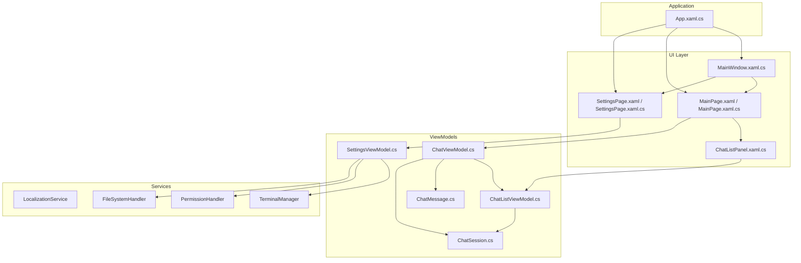
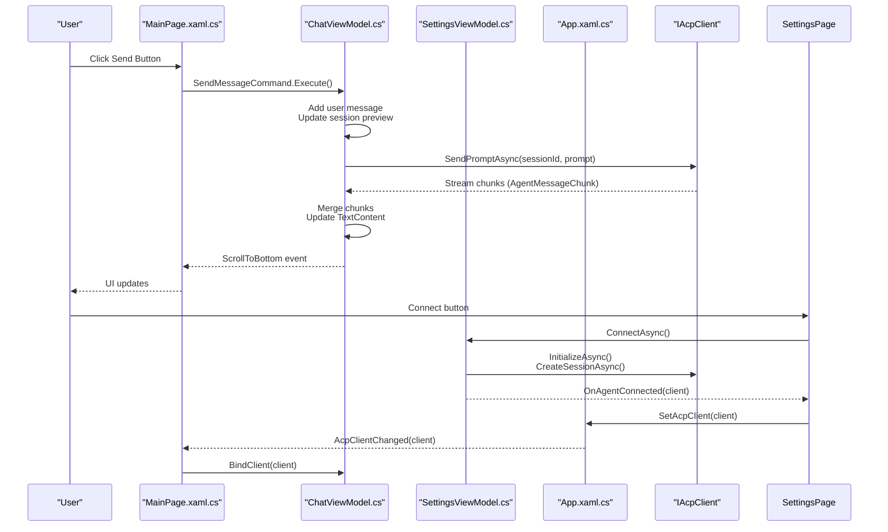
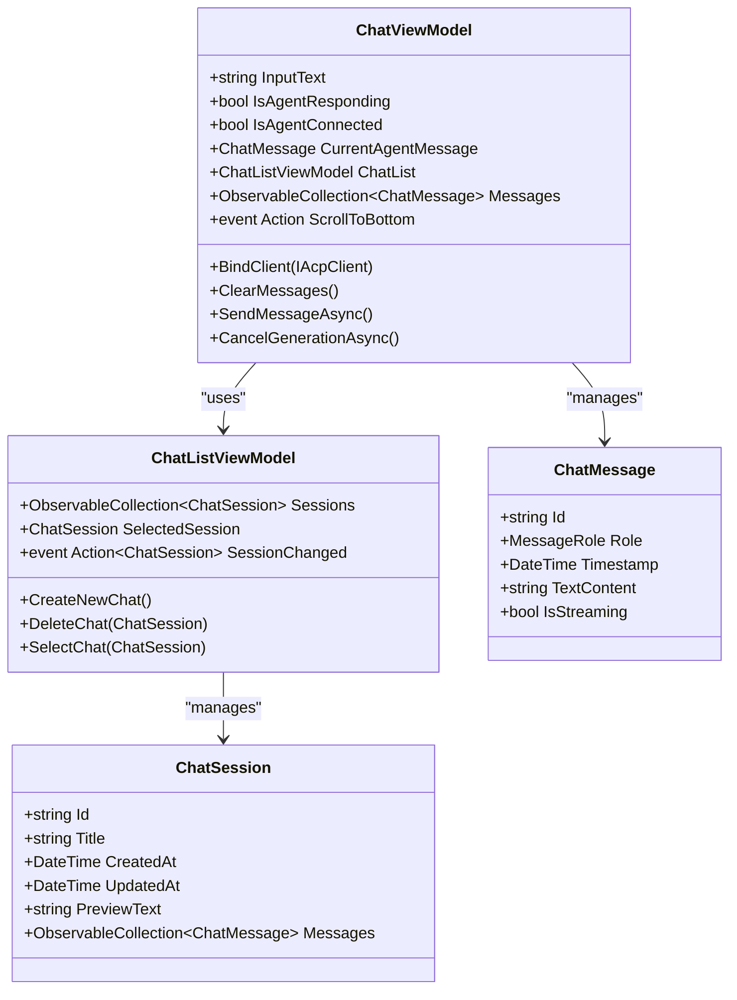
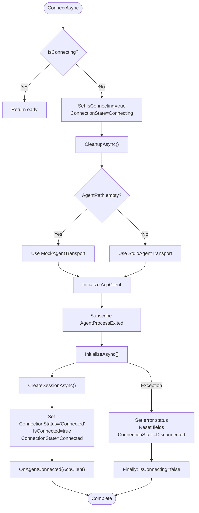

# MVVM Pattern Implementation

<cite>
**Referenced Files in This Document**
- [App.xaml.cs](file://Agentic.Desktop/App.xaml.cs)
- [MainWindow.xaml.cs](file://Agentic.Desktop/MainWindow.xaml.cs)
- [MainPage.xaml.cs](file://Agentic.Desktop/MainPage.xaml.cs)
- [MainPage.xaml](file://Agentic.Desktop/MainPage.xaml)
- [SettingsPage.xaml.cs](file://Agentic.Desktop/SettingsPage.xaml.cs)
- [SettingsPage.xaml](file://Agentic.Desktop/SettingsPage.xaml)
- [ChatListPanel.xaml.cs](file://Agentic.Desktop/Views/ChatListPanel.xaml.cs)
- [ChatViewModel.cs](file://Agentic.Desktop/ViewModels/ChatViewModel.cs)
- [SettingsViewModel.cs](file://Agentic.Desktop/ViewModels/SettingsViewModel.cs)
- [ChatListViewModel.cs](file://Agentic.Desktop/ViewModels/ChatListViewModel.cs)
- [ChatMessage.cs](file://Agentic.Desktop/ViewModels/Messages/ChatMessage.cs)
- [ChatSession.cs](file://Agentic.Desktop/ViewModels/Messages/ChatSession.cs)
- [BoolToVisibilityConverter.cs](file://Agentic.Desktop/Converters/BoolToVisibilityConverter.cs)
</cite>

## Table of Contents
1. [Introduction](#introduction)
2. [Project Structure](#project-structure)
3. [Core Components](#core-components)
4. [Architecture Overview](#architecture-overview)
5. [Detailed Component Analysis](#detailed-component-analysis)
6. [Dependency Analysis](#dependency-analysis)
7. [Performance Considerations](#performance-considerations)
8. [Troubleshooting Guide](#troubleshooting-guide)
9. [Conclusion](#conclusion)

## Introduction
This document explains how the MVVM pattern is implemented in Agentic.Desktop using CommunityToolkit.Mvvm. It focuses on source generators for INotifyPropertyChanged and RelayCommand, the separation between ViewModels and XAML views, property binding patterns, command implementations, and ViewModel-to-service coordination. It also covers observable properties, async command handling, event propagation, the singleton pattern used by SettingsViewModel for global state, and integration with App’s static properties.

## Project Structure
The application follows a clear separation of concerns:
- Views (XAML + code-behind) handle UI layout and user interactions.
- ViewModels encapsulate presentation logic and expose observable properties and commands.
- Services provide cross-cutting functionality such as localization, file system access, permissions, and terminal management.
- The App class exposes global resources like the current AcpClient and a DispatcherQueue.

**Diagram sources**
- [MainWindow.xaml.cs:10-96](file://Agentic.Desktop/MainWindow.xaml.cs#L10-L96)
- [MainPage.xaml.cs:1-105](file://Agentic.Desktop/MainPage.xaml.cs#L1-L105)
- [SettingsPage.xaml.cs:1-96](file://Agentic.Desktop/SettingsPage.xaml.cs#L1-L96)
- [ChatListPanel.xaml.cs:1-40](file://Agentic.Desktop/Views/ChatListPanel.xaml.cs#L1-L40)
- [ChatViewModel.cs:1-235](file://Agentic.Desktop/ViewModels/ChatViewModel.cs#L1-L235)
- [SettingsViewModel.cs:1-162](file://Agentic.Desktop/ViewModels/SettingsViewModel.cs#L1-L162)
- [ChatListViewModel.cs:1-64](file://Agentic.Desktop/ViewModels/ChatListViewModel.cs#L1-L64)
- [ChatMessage.cs:1-39](file://Agentic.Desktop/ViewModels/Messages/ChatMessage.cs#L1-L39)
- [ChatSession.cs:1-28](file://Agentic.Desktop/ViewModels/Messages/ChatSession.cs#L1-L28)
- [App.xaml.cs:1-85](file://Agentic.Desktop/App.xaml.cs#L1-L85)

**Section sources**
- [MainWindow.xaml.cs:10-96](file://Agentic.Desktop/MainWindow.xaml.cs#L10-L96)
- [MainPage.xaml.cs:1-105](file://Agentic.Desktop/MainPage.xaml.cs#L1-L105)
- [SettingsPage.xaml.cs:1-96](file://Agentic.Desktop/SettingsPage.xaml.cs#L1-L96)
- [App.xaml.cs:1-85](file://Agentic.Desktop/App.xaml.cs#L1-L85)

## Core Components
- ChatViewModel: Manages chat sessions, messages, streaming responses, and agent communication via IAcpClient. Uses [ObservableProperty] to generate INotifyPropertyChanged and [RelayCommand] to generate ICommand instances for sending and canceling generation.
- SettingsViewModel: Singleton instance shared across navigation frames to persist connection state. Exposes configuration properties and async connect/disconnect commands. Integrates with services and raises events when connection changes.
- ChatListViewModel: Maintains session list and selection, raising SessionChanged to coordinate with ChatViewModel.
- ChatMessage and ChatSession: Observable data models representing message content and session metadata.
- App: Provides global static properties (Window, DispatcherQueue, CurrentAcpClient) and an event for client change notifications.

Key MVVM features demonstrated:
- Source-generated INotifyPropertyChanged via [ObservableProperty].
- Source-generated commands via [RelayCommand], including async Task-returning methods.
- Two-way and one-way bindings from XAML to ViewModel properties.
- Event-driven coordination between ViewModels and Views.
- Singleton pattern for SettingsViewModel to maintain global state.

**Section sources**
- [ChatViewModel.cs:1-235](file://Agentic.Desktop/ViewModels/ChatViewModel.cs#L1-L235)
- [SettingsViewModel.cs:1-162](file://Agentic.Desktop/ViewModels/SettingsViewModel.cs#L1-L162)
- [ChatListViewModel.cs:1-64](file://Agentic.Desktop/ViewModels/ChatListViewModel.cs#L1-L64)
- [ChatMessage.cs:1-39](file://Agentic.Desktop/ViewModels/Messages/ChatMessage.cs#L1-L39)
- [ChatSession.cs:1-28](file://Agentic.Desktop/ViewModels/Messages/ChatSession.cs#L1-L28)
- [App.xaml.cs:1-85](file://Agentic.Desktop/App.xaml.cs#L1-L85)

## Architecture Overview
The MVVM architecture separates UI from logic:
- XAML binds to ViewModel properties and commands.
- Commands execute asynchronous operations and update observable properties.
- Events propagate state changes across components.
- Global state is centralized in App and SettingsViewModel.

**Diagram sources**
- [MainPage.xaml.cs:1-105](file://Agentic.Desktop/MainPage.xaml.cs#L1-L105)
- [ChatViewModel.cs:1-235](file://Agentic.Desktop/ViewModels/ChatViewModel.cs#L1-L235)
- [SettingsViewModel.cs:1-162](file://Agentic.Desktop/ViewModels/SettingsViewModel.cs#L1-L162)
- [App.xaml.cs:1-85](file://Agentic.Desktop/App.xaml.cs#L1-L85)

## Detailed Component Analysis

### ChatViewModel
Responsibilities:
- Manage input text, streaming state, and current agent message.
- Coordinate with ChatListViewModel for selected session and messages.
- Handle agent communication through IAcpClient or mock simulation.
- Implement frame-level merging for streaming updates to reduce UI churn.

MVVM implementation highlights:
- Observable properties generated via [ObservableProperty]: InputText, IsAgentResponding, IsAgentConnected, CurrentAgentMessage.
- Async commands generated via [RelayCommand]: SendMessageAsync, CancelGenerationAsync.
- Event subscription to ChatList.SessionChanged to manage message collection lifecycle and auto-scroll.
- DispatcherQueue marshaling to ensure UI updates occur on the correct thread.

**Diagram sources**
- [ChatViewModel.cs:1-235](file://Agentic.Desktop/ViewModels/ChatViewModel.cs#L1-L235)
- [ChatListViewModel.cs:1-64](file://Agentic.Desktop/ViewModels/ChatListViewModel.cs#L1-L64)
- [ChatMessage.cs:1-39](file://Agentic.Desktop/ViewModels/Messages/ChatMessage.cs#L1-L39)
- [ChatSession.cs:1-28](file://Agentic.Desktop/ViewModels/Messages/ChatSession.cs#L1-L28)

Binding patterns in XAML:
- Two-way binding for input: TextBox.Text bound to InputText with UpdateSourceTrigger=PropertyChanged.
- One-way binding for visibility and enabled states using BoolToVisibilityConverter.
- Command binding for Send and Cancel buttons to SendMessageCommand and CancelGenerationCommand.

Event propagation:
- ChatList.SessionChanged triggers message collection re-subscription and scroll behavior.
- ChatViewModel.ScrollToBottom event invoked when new messages arrive.

Async command handling:
- SendMessageAsync adds user message, creates placeholder agent message, streams response, and handles cancellation and errors.
- CancelGenerationAsync cancels ongoing generation and resets streaming state.

**Section sources**
- [ChatViewModel.cs:1-235](file://Agentic.Desktop/ViewModels/ChatViewModel.cs#L1-L235)
- [MainPage.xaml:1-163](file://Agentic.Desktop/MainPage.xaml#L1-L163)
- [ChatListViewModel.cs:1-64](file://Agentic.Desktop/ViewModels/ChatListViewModel.cs#L1-L64)
- [ChatMessage.cs:1-39](file://Agentic.Desktop/ViewModels/Messages/ChatMessage.cs#L1-L39)
- [ChatSession.cs:1-28](file://Agentic.Desktop/ViewModels/Messages/ChatSession.cs#L1-L28)

### SettingsViewModel
Responsibilities:
- Maintain global connection state and agent configuration.
- Provide async connect/disconnect commands.
- Integrate with IAcpClient, TerminalManager, and permission/file handlers.
- Raise events to notify UI and other components about connection changes.

MVVM implementation highlights:
- Singleton pattern via static Shared property to persist state across page navigations.
- Observable properties for configuration and status: AgentPath, AgentArguments, WorkingDirectory, ConnectionStatus, AgentName, SessionId, IsConnecting, IsConnected, ConnectionState.
- Async commands generated via [RelayCommand]: ConnectAsync, DisconnectAsync.
- Event hooks OnAgentConnected and OnAgentDisconnected to coordinate with SettingsPage and App.

Integration with App:
- On successful connection, SettingsPage sets App.CurrentAcpClient and triggers App.AcpClientChanged.
- On disconnect, App.SetAcpClient(null) clears global state and notifies subscribers.

**Diagram sources**
- [SettingsViewModel.cs:1-162](file://Agentic.Desktop/ViewModels/SettingsViewModel.cs#L1-L162)

**Section sources**
- [SettingsViewModel.cs:1-162](file://Agentic.Desktop/ViewModels/SettingsViewModel.cs#L1-L162)
- [SettingsPage.xaml.cs:1-96](file://Agentic.Desktop/SettingsPage.xaml.cs#L1-L96)
- [App.xaml.cs:1-85](file://Agentic.Desktop/App.xaml.cs#L1-L85)

### ChatListViewModel
Responsibilities:
- Manage collection of ChatSession objects.
- Handle creation, deletion, and selection of sessions.
- Raise SessionChanged event to notify ChatViewModel of selection changes.

MVVM implementation highlights:
- ObservableCollection for dynamic UI updates.
- [ObservableProperty] for SelectedSession.
- [RelayCommand] for CreateNewChat, DeleteChat, SelectChat.

**Section sources**
- [ChatListViewModel.cs:1-64](file://Agentic.Desktop/ViewModels/ChatListViewModel.cs#L1-L64)

### Data Models: ChatMessage and ChatSession
Both classes inherit from ObservableObject and use [ObservableProperty] to generate INotifyPropertyChanged for TextContent, IsStreaming, Title, PreviewText, and timestamps.

**Section sources**
- [ChatMessage.cs:1-39](file://Agentic.Desktop/ViewModels/Messages/ChatMessage.cs#L1-L39)
- [ChatSession.cs:1-28](file://Agentic.Desktop/ViewModels/Messages/ChatSession.cs#L1-L28)

### View Integration Patterns
- MainPage binds to ChatViewModel properties and commands, subscribes to ScrollToBottom, and manages AcpClient lifecycle via App events.
- SettingsPage uses SettingsViewModel.Shared to persist connection state and updates App state on connect/disconnect.
- ChatListPanel exposes a ViewModel property and invokes commands based on user interactions.

**Section sources**
- [MainPage.xaml.cs:1-105](file://Agentic.Desktop/MainPage.xaml.cs#L1-L105)
- [MainPage.xaml:1-163](file://Agentic.Desktop/MainPage.xaml#L1-L163)
- [SettingsPage.xaml.cs:1-96](file://Agentic.Desktop/SettingsPage.xaml.cs#L1-L96)
- [SettingsPage.xaml:1-121](file://Agentic.Desktop/SettingsPage.xaml#L1-L121)
- [ChatListPanel.xaml.cs:1-40](file://Agentic.Desktop/Views/ChatListPanel.xaml.cs#L1-L40)

## Dependency Analysis
CommunityToolkit.Mvvm provides source generators that eliminate boilerplate:
- [ObservableProperty] generates backing fields, properties, and OnPropertyChanged calls.
- [RelayCommand] generates ICommand implementations with CanExecute and Execute methods, supporting async Task-returning methods.

External dependencies:
- IAcpClient for agent communication.
- Microsoft.Extensions.Logging for logging.
- WinUI 3 controls and XAML binding infrastructure.

Coupling and cohesion:
- ViewModels are cohesive around their responsibilities and loosely coupled via events and interfaces.
- App centralizes global state and dispatcher access, reducing coupling across components.

Potential circular dependencies:
- None detected; ViewModels depend on services and interfaces, not on each other except ChatViewModel referencing ChatListViewModel.

**Section sources**
- [ChatViewModel.cs:1-235](file://Agentic.Desktop/ViewModels/ChatViewModel.cs#L1-L235)
- [SettingsViewModel.cs:1-162](file://Agentic.Desktop/ViewModels/SettingsViewModel.cs#L1-L162)
- [App.xaml.cs:1-85](file://Agentic.Desktop/App.xaml.cs#L1-L85)

## Performance Considerations
- Frame-level merging in ChatViewModel batches streaming updates to minimize UI refreshes.
- DispatcherQueue ensures UI updates occur on the correct thread without blocking.
- ObservableCollection and ItemsRepeater efficiently render large message lists.
- Avoid excessive property changes during streaming by accumulating text before updating.

[No sources needed since this section provides general guidance]

## Troubleshooting Guide
Common issues and resolutions:
- Streaming corruption on session switch: ChatViewModel cancels in-progress generation and unsubscribes from old message collections.
- UI thread violations: Use DispatcherQueue.TryEnqueue for all UI updates from background tasks.
- Connection state inconsistencies: Ensure App.SetAcpClient is called on connect/disconnect and AcpClientChanged is handled in MainPage.
- Memory leaks: Unsubscribe from events (e.g., AgentProcessExited, PropertyChanged) when pages unload.

**Section sources**
- [ChatViewModel.cs:1-235](file://Agentic.Desktop/ViewModels/ChatViewModel.cs#L1-L235)
- [SettingsViewModel.cs:1-162](file://Agentic.Desktop/ViewModels/SettingsViewModel.cs#L1-L162)
- [SettingsPage.xaml.cs:1-96](file://Agentic.Desktop/SettingsPage.xaml.cs#L1-L96)
- [MainPage.xaml.cs:1-105](file://Agentic.Desktop/MainPage.xaml.cs#L1-L105)

## Conclusion
Agentic.Desktop demonstrates a robust MVVM implementation using CommunityToolkit.Mvvm source generators. The separation between ViewModels and XAML views is clear, with observable properties and commands enabling declarative bindings. Event-driven coordination and singleton patterns ensure consistent global state management. The architecture supports efficient streaming updates, async command handling, and scalable service integration.

[No sources needed since this section summarizes without analyzing specific files]