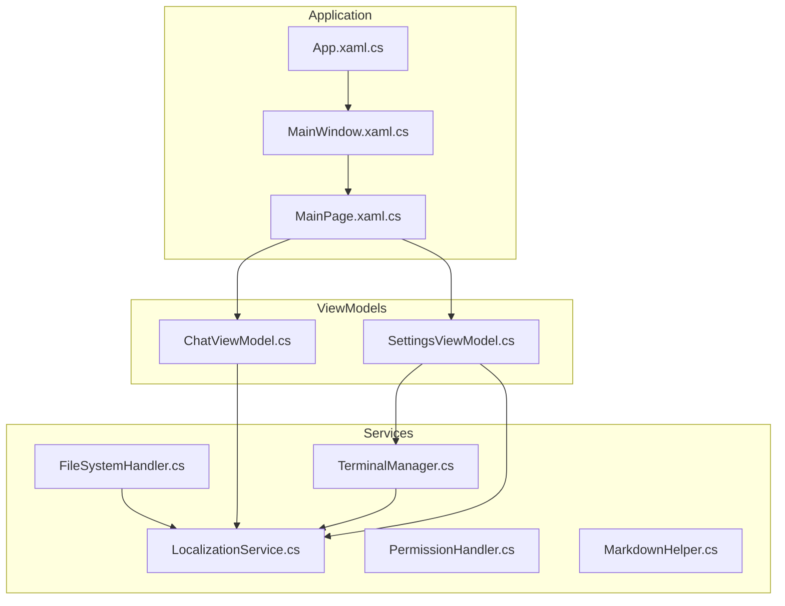
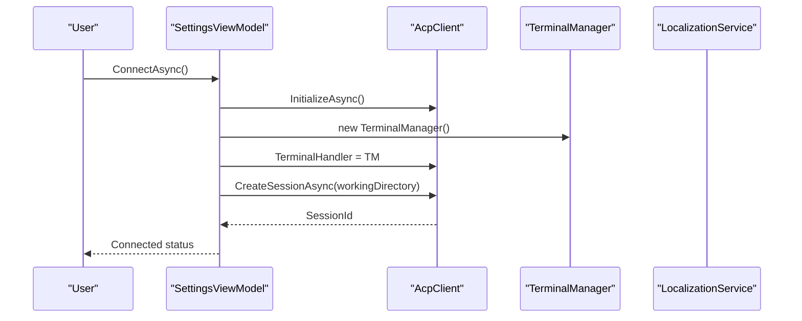
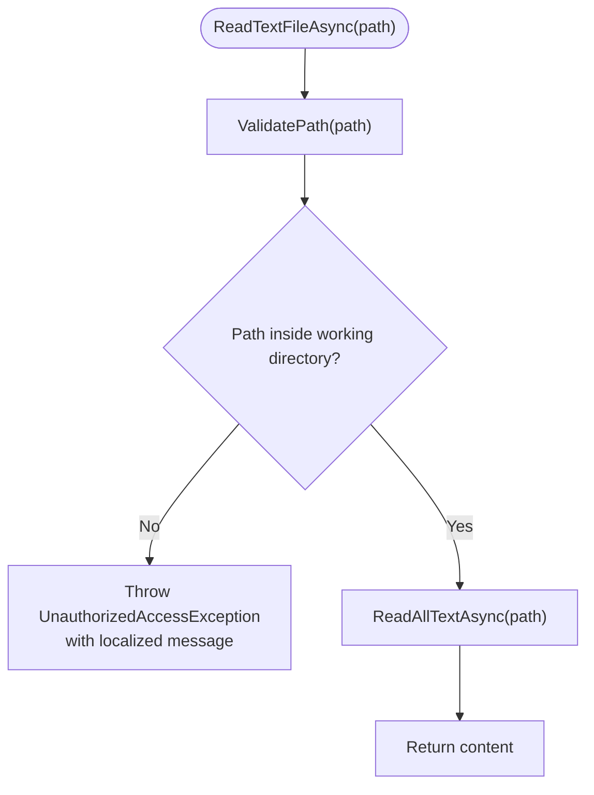
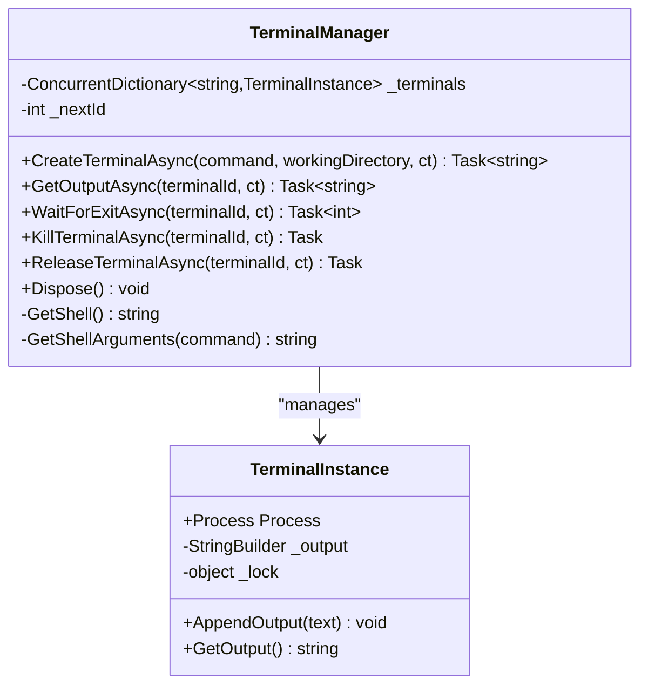
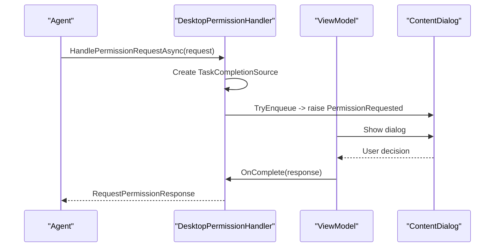
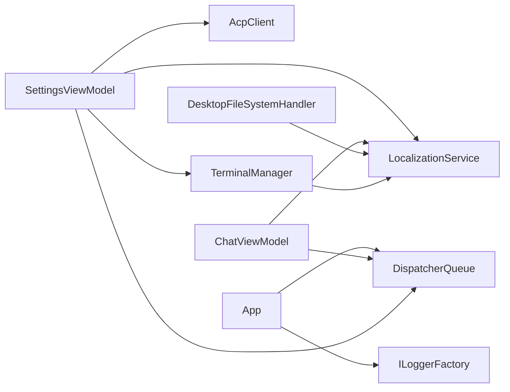

# Service Layer Design

<cite>
**Referenced Files in This Document**
- [FileSystemHandler.cs](file://Agentic.Desktop/Services/FileSystemHandler.cs)
- [TerminalManager.cs](file://Agentic.Desktop/Services/TerminalManager.cs)
- [LocalizationService.cs](file://Agentic.Desktop/Services/LocalizationService.cs)
- [PermissionHandler.cs](file://Agentic.Desktop/Services/PermissionHandler.cs)
- [MarkdownHelper.cs](file://Agentic.Desktop/Services/MarkdownHelper.cs)
- [ChatViewModel.cs](file://Agentic.Desktop/ViewModels/ChatViewModel.cs)
- [SettingsViewModel.cs](file://Agentic.Desktop/ViewModels/SettingsViewModel.cs)
- [App.xaml.cs](file://Agentic.Desktop/App.xaml.cs)
- [MainPage.xaml.cs](file://Agentic.Desktop/MainPage.xaml.cs)
- [MainWindow.xaml.cs](file://Agentic.Desktop/MainWindow.xaml.cs)
- [Agentic.Desktop.csproj](file://Agentic.Desktop/Agentic.Desktop.csproj)
</cite>

## Table of Contents
1. [Introduction](#introduction)
2. [Project Structure](#project-structure)
3. [Core Components](#core-components)
4. [Architecture Overview](#architecture-overview)
5. [Detailed Component Analysis](#detailed-component-analysis)
6. [Dependency Analysis](#dependency-analysis)
7. [Performance Considerations](#performance-considerations)
8. [Troubleshooting Guide](#troubleshooting-guide)
9. [Conclusion](#conclusion)

## Introduction
This document explains the service layer architecture in Agentic.Desktop with a focus on four core services:
- FileSystemHandler for secure file operations
- TerminalManager for concurrent terminal process management
- LocalizationService for multi-language support
- PermissionHandler for interactive security decisions

It details how these services are designed (singleton vs managed instances), their interfaces, dependency injection patterns, and how ViewModels consume them. It also documents cross-cutting concerns such as error handling, logging integration, and UI thread marshaling.

## Project Structure
The application is a WinUI 3 desktop app targeting Windows 10+. Services live under Agentic.Desktop/Services and are consumed by ViewModels under Agentic.Desktop/ViewModels. Application-level configuration and lifecycle are handled in App.xaml.cs, while navigation and page composition occur in MainWindow.xaml.cs and MainPage.xaml.cs.

**Diagram sources**
- [App.xaml.cs:1-85](file://Agentic.Desktop/App.xaml.cs#L1-L85)
- [MainWindow.xaml.cs:1-97](file://Agentic.Desktop/MainWindow.xaml.cs#L1-L97)
- [MainPage.xaml.cs:1-105](file://Agentic.Desktop/MainPage.xaml.cs#L1-L105)
- [ChatViewModel.cs:1-235](file://Agentic.Desktop/ViewModels/ChatViewModel.cs#L1-L235)
- [SettingsViewModel.cs:1-162](file://Agentic.Desktop/ViewModels/SettingsViewModel.cs#L1-L162)
- [FileSystemHandler.cs:1-42](file://Agentic.Desktop/Services/FileSystemHandler.cs#L1-L42)
- [TerminalManager.cs:1-161](file://Agentic.Desktop/Services/TerminalManager.cs#L1-L161)
- [LocalizationService.cs:1-23](file://Agentic.Desktop/Services/LocalizationService.cs#L1-L23)
- [PermissionHandler.cs:1-52](file://Agentic.Desktop/Services/PermissionHandler.cs#L1-L52)
- [MarkdownHelper.cs:1-52](file://Agentic.Desktop/Services/MarkdownHelper.cs#L1-L52)

**Section sources**
- [App.xaml.cs:1-85](file://Agentic.Desktop/App.xaml.cs#L1-L85)
- [MainWindow.xaml.cs:1-97](file://Agentic.Desktop/MainWindow.xaml.cs#L1-L97)
- [MainPage.xaml.cs:1-105](file://Agentic.Desktop/MainPage.xaml.cs#L1-L105)
- [Agentic.Desktop.csproj:1-79](file://Agentic.Desktop/Agentic.Desktop.csproj#L1-L79)

## Core Components
- DesktopFileSystemHandler: Implements IFileSystemHandler to perform secure read/write operations within an allowed working directory. Validates paths to prevent escape outside the sandbox.
- TerminalManager: Implements ITerminalHandler to manage multiple terminal processes concurrently, capturing stdout/stderr asynchronously and exposing control methods like kill and release.
- LocalizationService: Static helper that loads localized strings from .resw resources and supports formatting with arguments.
- DesktopPermissionHandler: Implements IPermissionHandler to interactively request permissions via UI dialogs; marshals requests to the UI thread using DispatcherQueue.
- MarkdownHelper: Utility for converting Markdown to HTML or plain text; used for future rich rendering or current plain-text fallback.

Key design notes:
- Some services are static singletons (LocalizationService, MarkdownHelper).
- Others are instantiated per-use or per-session (TerminalManager created during connection, DesktopFileSystemHandler constructed with a working directory).
- Dependency injection is not provided by a DI container; instead, services are composed directly in ViewModels or passed through constructors where appropriate.

**Section sources**
- [FileSystemHandler.cs:1-42](file://Agentic.Desktop/Services/FileSystemHandler.cs#L1-L42)
- [TerminalManager.cs:1-161](file://Agentic.Desktop/Services/TerminalManager.cs#L1-L161)
- [LocalizationService.cs:1-23](file://Agentic.Desktop/Services/LocalizationService.cs#L1-L23)
- [PermissionHandler.cs:1-52](file://Agentic.Desktop/Services/PermissionHandler.cs#L1-L52)
- [MarkdownHelper.cs:1-52](file://Agentic.Desktop/Services/MarkdownHelper.cs#L1-L52)

## Architecture Overview
The service layer integrates with the ACP client and UI framework:
- SettingsViewModel constructs AcpClient and assigns TerminalManager to handle terminal commands.
- ChatViewModel uses LocalizationService for messages and UI updates.
- DesktopPermissionHandler bridges agent permission requests to the UI thread and shows dialogs via events.
- DesktopFileSystemHandler enforces path validation against a configured working directory.

**Diagram sources**
- [SettingsViewModel.cs:60-126](file://Agentic.Desktop/ViewModels/SettingsViewModel.cs#L60-L126)
- [TerminalManager.cs:16-68](file://Agentic.Desktop/Services/TerminalManager.cs#L16-L68)
- [LocalizationService.cs:10-22](file://Agentic.Desktop/Services/LocalizationService.cs#L10-L22)

## Detailed Component Analysis

### DesktopFileSystemHandler
Responsibilities:
- Enforce access control by validating requested paths against a configured working directory.
- Provide asynchronous read/write operations for text files.
- Use localization for error messages when access is denied.

Design patterns:
- Constructor injection of working directory to define the sandbox boundary.
- Path normalization and prefix checks to prevent traversal attacks.

Error handling:
- Throws UnauthorizedAccessException with localized message when path escapes sandbox.

Performance considerations:
- Uses async file I/O to avoid blocking threads.

**Diagram sources**
- [FileSystemHandler.cs:17-40](file://Agentic.Desktop/Services/FileSystemHandler.cs#L17-L40)

**Section sources**
- [FileSystemHandler.cs:1-42](file://Agentic.Desktop/Services/FileSystemHandler.cs#L1-L42)
- [LocalizationService.cs:10-22](file://Agentic.Desktop/Services/LocalizationService.cs#L10-L22)

### TerminalManager
Responsibilities:
- Manage multiple terminal processes concurrently.
- Capture stdout and stderr asynchronously into buffers.
- Expose methods to get output, wait for exit, kill, and release terminals.

Concurrency model:
- ConcurrentDictionary to track active terminals.
- Background tasks to read streams without blocking.
- Thread-safe StringBuilder with lock for output accumulation.

Lifecycle:
- Implements IDisposable to ensure all processes are terminated and disposed.

**Diagram sources**
- [TerminalManager.cs:11-161](file://Agentic.Desktop/Services/TerminalManager.cs#L11-L161)

**Section sources**
- [TerminalManager.cs:1-161](file://Agentic.Desktop/Services/TerminalManager.cs#L1-L161)

### LocalizationService
Responsibilities:
- Provide localized strings from .resw resource files.
- Support formatting with parameters.

Design:
- Static class with a single ResourceLoader instance.
- Simple Get and Format methods.

Usage:
- Used across services and ViewModels for consistent messaging.

**Section sources**
- [LocalizationService.cs:1-23](file://Agentic.Desktop/Services/LocalizationService.cs#L1-L23)

### DesktopPermissionHandler
Responsibilities:
- Handle permission requests from the Agent.
- Marshal requests to the UI thread using DispatcherQueue.
- Raise an event for the ViewModel to show a dialog and complete the request.

Interaction flow:
- The handler creates a TaskCompletionSource to await user decision.
- The ViewModel subscribes to PermissionRequested, displays a ContentDialog, and invokes OnComplete with the response.

**Diagram sources**
- [PermissionHandler.cs:26-44](file://Agentic.Desktop/Services/PermissionHandler.cs#L26-L44)

**Section sources**
- [PermissionHandler.cs:1-52](file://Agentic.Desktop/Services/PermissionHandler.cs#L1-L52)

### MarkdownHelper
Responsibilities:
- Convert Markdown to HTML for potential WebView2 rendering.
- Strip formatting markers to produce plain text for TextBlock display.

Design:
- Static utility with a prebuilt MarkdownPipeline.

Usage:
- Optional enhancement for richer content rendering.

**Section sources**
- [MarkdownHelper.cs:1-52](file://Agentic.Desktop/Services/MarkdownHelper.cs#L1-L52)

## Dependency Analysis
- SettingsViewModel composes AcpClient and TerminalManager during connection.
- ChatViewModel consumes LocalizationService for messages and UI updates.
- DesktopFileSystemHandler depends on LocalizationService for error messages.
- TerminalManager depends on LocalizationService for stderr prefixes.
- App provides global Logger and DispatcherQueue; ViewModels use these for logging and UI marshaling.

**Diagram sources**
- [SettingsViewModel.cs:60-126](file://Agentic.Desktop/ViewModels/SettingsViewModel.cs#L60-L126)
- [ChatViewModel.cs:1-235](file://Agentic.Desktop/ViewModels/ChatViewModel.cs#L1-L235)
- [FileSystemHandler.cs:1-42](file://Agentic.Desktop/Services/FileSystemHandler.cs#L1-L42)
- [TerminalManager.cs:1-161](file://Agentic.Desktop/Services/TerminalManager.cs#L1-L161)
- [LocalizationService.cs:1-23](file://Agentic.Desktop/Services/LocalizationService.cs#L1-L23)
- [App.xaml.cs:49-76](file://Agentic.Desktop/App.xaml.cs#L49-L76)

**Section sources**
- [SettingsViewModel.cs:1-162](file://Agentic.Desktop/ViewModels/SettingsViewModel.cs#L1-L162)
- [ChatViewModel.cs:1-235](file://Agentic.Desktop/ViewModels/ChatViewModel.cs#L1-L235)
- [App.xaml.cs:1-85](file://Agentic.Desktop/App.xaml.cs#L1-L85)

## Performance Considerations
- TerminalManager reads stdout/stderr asynchronously and buffers output with locks to minimize contention.
- ChatViewModel batches streaming updates to reduce UI churn, flushing every 50ms.
- File I/O in DesktopFileSystemHandler uses async methods to avoid blocking.
- LocalizationService uses a single ResourceLoader instance to avoid repeated initialization overhead.

[No sources needed since this section provides general guidance]

## Troubleshooting Guide
Common issues and resolutions:
- Unauthorized access errors: Ensure the requested path is within the configured working directory. DesktopFileSystemHandler throws UnauthorizedAccessException if it escapes the sandbox.
- Terminal process not exiting: Verify ReleaseTerminalAsync or Dispose is called; TerminalManager ensures processes are killed and disposed.
- Permission dialog not appearing: Confirm DispatcherQueue is available and PermissionRequested event is subscribed in the ViewModel.
- Localization keys missing: Check .resw files for correct keys and ensure default language is set.

**Section sources**
- [FileSystemHandler.cs:32-40](file://Agentic.Desktop/Services/FileSystemHandler.cs#L32-L40)
- [TerminalManager.cs:115-128](file://Agentic.Desktop/Services/TerminalManager.cs#L115-L128)
- [PermissionHandler.cs:26-44](file://Agentic.Desktop/Services/PermissionHandler.cs#L26-L44)

## Conclusion
The Agentic.Desktop service layer emphasizes security, concurrency, and localization:
- DesktopFileSystemHandler enforces strict path validation for safe file operations.
- TerminalManager manages multiple terminal processes with robust concurrency and lifecycle control.
- LocalizationService centralizes multi-language support.
- DesktopPermissionHandler bridges agent requests to the UI thread for interactive decisions.

Services are composed directly in ViewModels rather than via a DI container, keeping dependencies explicit and easy to trace. Cross-cutting concerns like logging and UI marshaling are handled at the application level and consumed by ViewModels and services as needed.