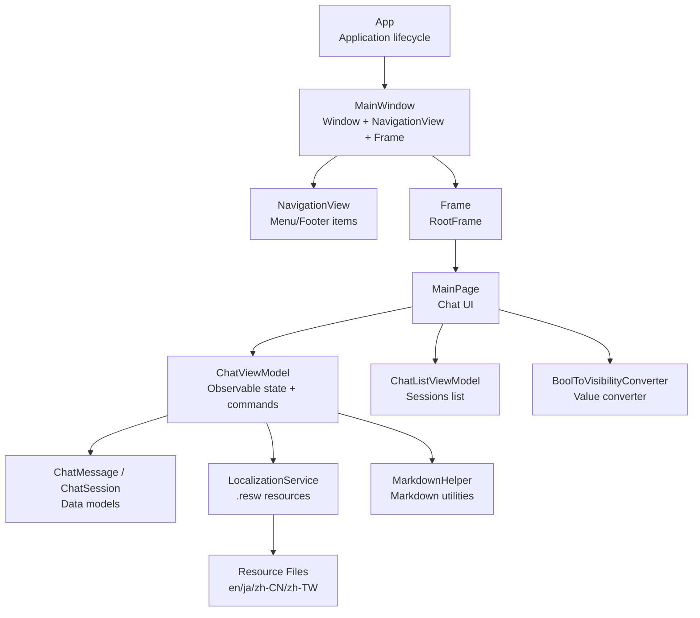
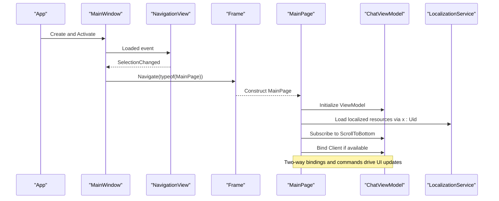
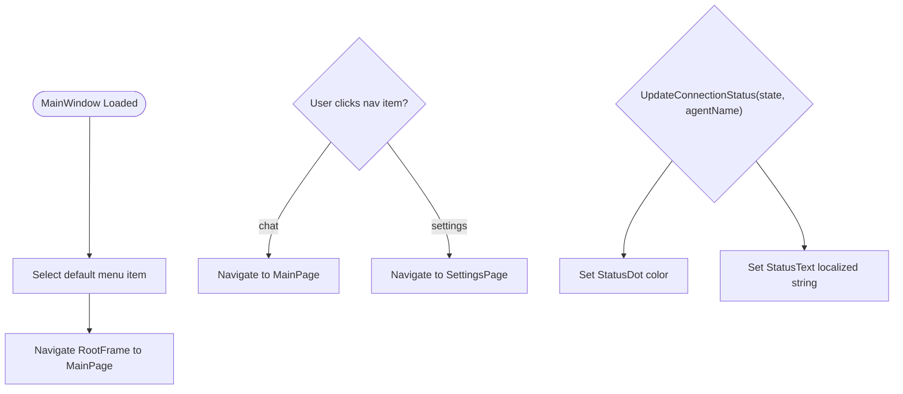
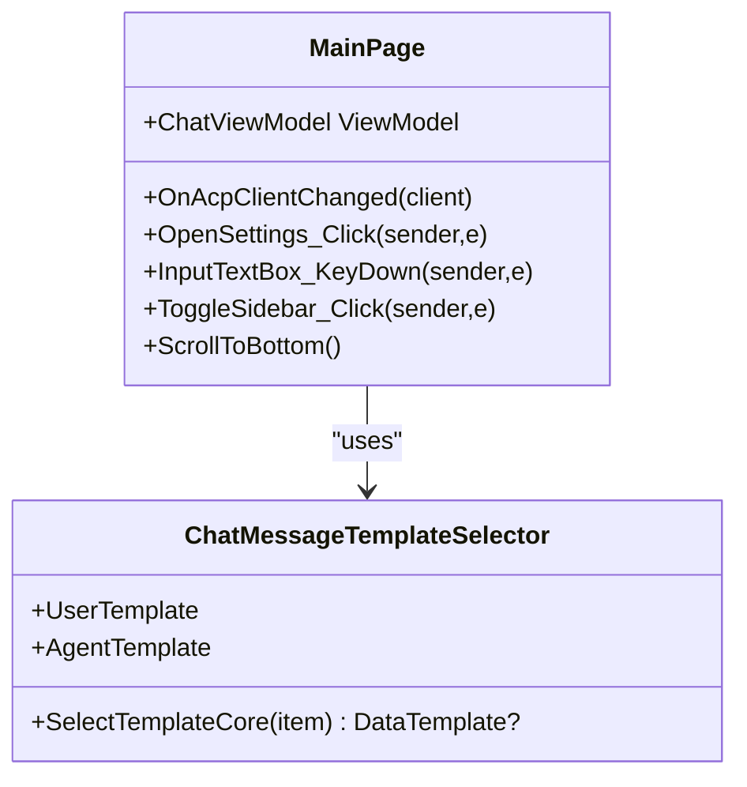
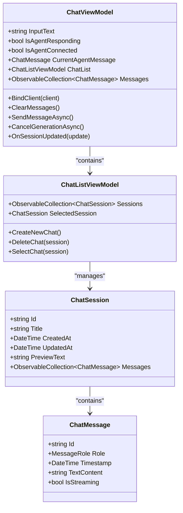
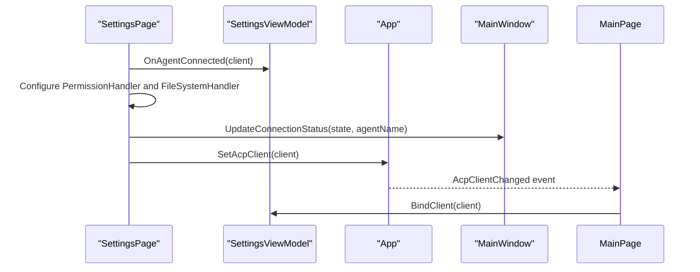
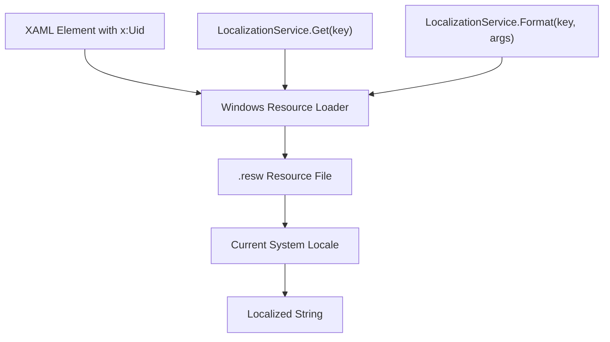
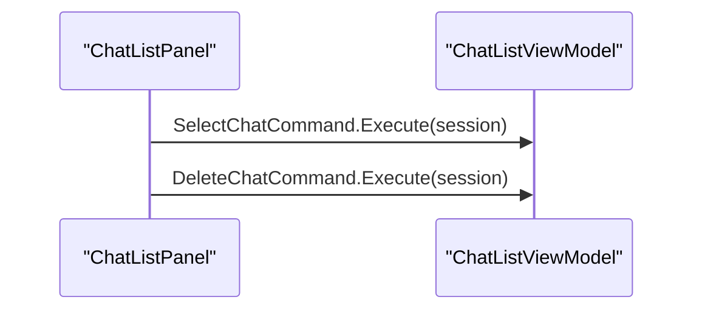
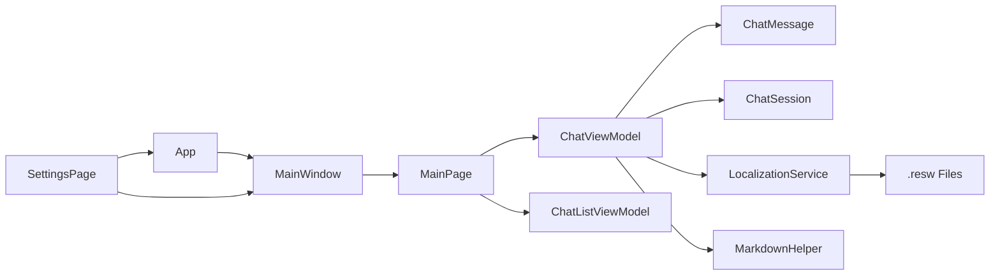

# UI Framework and Navigation

<cite>
**Referenced Files in This Document**
- [App.xaml.cs](file://Agentic.Desktop/App.xaml.cs)
- [MainWindow.xaml.cs](file://Agentic.Desktop/MainWindow.xaml.cs)
- [MainWindow.xaml](file://Agentic.Desktop/MainWindow.xaml)
- [MainPage.xaml.cs](file://Agentic.Desktop/MainPage.xaml.cs)
- [MainPage.xaml](file://Agentic.Desktop/MainPage.xaml)
- [SettingsPage.xaml.cs](file://Agentic.Desktop/SettingsPage.xaml.cs)
- [SettingsPage.xaml](file://Agentic.Desktop/SettingsPage.xaml)
- [ChatViewModel.cs](file://Agentic.Desktop/ViewModels/ChatViewModel.cs)
- [ChatListViewModel.cs](file://Agentic.Desktop/ViewModels/ChatListViewModel.cs)
- [ChatMessage.cs](file://Agentic.Desktop/ViewModels/Messages/ChatMessage.cs)
- [ChatSession.cs](file://Agentic.Desktop/ViewModels/Messages/ChatSession.cs)
- [LocalizationService.cs](file://Agentic.Desktop/Services/LocalizationService.cs)
- [BoolToVisibilityConverter.cs](file://Agentic.Desktop/Converters/BoolToVisibilityConverter.cs)
- [MarkdownHelper.cs](file://Agentic.Desktop/Services/MarkdownHelper.cs)
- [ChatListPanel.xaml.cs](file://Agentic.Desktop/Views/ChatListPanel.xaml.cs)
- [ChatListPanel.xaml](file://Agentic.Desktop/Views/ChatListPanel.xaml)
- [PermissionDialog.xaml.cs](file://Agentic.Desktop/Views/PermissionDialog.xaml.cs)
- [PermissionDialog.xaml](file://Agentic.Desktop/Views/PermissionDialog.xaml)
- [Resources.resw](file://Agentic.Desktop/Strings/en/Resources.resw)
</cite>

## Update Summary
**Changes Made**
- Updated Localization and Resources section to document comprehensive x:Uid attribute binding implementation
- Added detailed explanation of .resw resource file structure and multi-language support
- Enhanced examples showing how XAML elements use x:Uid for automatic localization
- Updated diagrams to reflect the complete internationalization architecture
- Added guidance on maintaining and extending localization support

## Table of Contents
1. Introduction
2. Project Structure
3. Core Components
4. Architecture Overview
5. Detailed Component Analysis
6. Dependency Analysis
7. Performance Considerations
8. Troubleshooting Guide
9. Conclusion

## Introduction
This document explains the WinUI 3 framework implementation and navigation architecture for the desktop application. It focuses on how MainWindow serves as the main window with a navigation frame, how MainPage implements the primary chat interface, and how data binding connects the UI to ViewModels. The application now features comprehensive internationalization support through x:Uid attribute binding, enabling seamless localization across all user interface components.

## Project Structure
The application follows a clear separation between Views (XAML + code-behind), ViewModels (MVVM), Services (localization, markdown, permissions), and Converters (value conversion). The entry point initializes logging, creates the main window, and exposes global services such as the dispatcher queue and current ACP client.

**Diagram sources**
- [App.xaml.cs](file://Agentic.Desktop/App.xaml.cs)
- [MainWindow.xaml.cs](file://Agentic.Desktop/MainWindow.xaml.cs)
- [MainWindow.xaml](file://Agentic.Desktop/MainWindow.xaml)
- [MainPage.xaml.cs](file://Agentic.Desktop/MainPage.xaml.cs)
- [MainPage.xaml](file://Agentic.Desktop/MainPage.xaml)
- [ChatViewModel.cs](file://Agentic.Desktop/ViewModels/ChatViewModel.cs)
- [ChatListViewModel.cs](file://Agentic.Desktop/ViewModels/ChatListViewModel.cs)
- [ChatMessage.cs](file://Agentic.Desktop/ViewModels/Messages/ChatMessage.cs)
- [ChatSession.cs](file://Agentic.Desktop/ViewModels/Messages/ChatSession.cs)
- [LocalizationService.cs](file://Agentic.Desktop/Services/LocalizationService.cs)
- [BoolToVisibilityConverter.cs](file://Agentic.Desktop/Converters/BoolToVisibilityConverter.cs)
- [MarkdownHelper.cs](file://Agentic.Desktop/Services/MarkdownHelper.cs)

**Section sources**
- [App.xaml.cs](file://Agentic.Desktop/App.xaml.cs)
- [MainWindow.xaml.cs](file://Agentic.Desktop/MainWindow.xaml.cs)
- [MainWindow.xaml](file://Agentic.Desktop/MainWindow.xaml)
- [MainPage.xaml.cs](file://Agentic.Desktop/MainPage.xaml.cs)
- [MainPage.xaml](file://Agentic.Desktop/MainPage.xaml)

## Core Components
- Application bootstrap: Initializes logging, creates the main window, and exposes DispatcherQueue and current AcpClient.
- MainWindow: Hosts TitleBar, NavigationView, and a Frame that navigates between pages. Provides connection status updates and navigation helpers.
- MainPage: Implements the chat UI using SplitView, ItemsRepeater, DataTemplateSelector, and binds to ChatViewModel. Handles keyboard input and scroll behavior.
- ViewModels: ChatViewModel manages messages, streaming, session selection, and commands; ChatListViewModel manages sessions and selection.
- Localization: Centralized access to .resw strings via LocalizationService with comprehensive x:Uid attribute binding support.
- Converters: BoolToVisibilityConverter supports visibility toggling with optional inversion.

**Section sources**
- [App.xaml.cs](file://Agentic.Desktop/App.xaml.cs)
- [MainWindow.xaml.cs](file://Agentic.Desktop/MainWindow.xaml.cs)
- [MainWindow.xaml](file://Agentic.Desktop/MainWindow.xaml)
- [MainPage.xaml.cs](file://Agentic.Desktop/MainPage.xaml.cs)
- [MainPage.xaml](file://Agentic.Desktop/MainPage.xaml)
- [ChatViewModel.cs](file://Agentic.Desktop/ViewModels/ChatViewModel.cs)
- [ChatListViewModel.cs](file://Agentic.Desktop/ViewModels/ChatListViewModel.cs)
- [LocalizationService.cs](file://Agentic.Desktop/Services/LocalizationService.cs)
- [BoolToVisibilityConverter.cs](file://Agentic.Desktop/Converters/BoolToVisibilityConverter.cs)

## Architecture Overview
The app uses a standard WinUI 3 MVVM pattern with comprehensive internationalization support:
- App orchestrates startup and global state.
- MainWindow provides navigation infrastructure and shared UI chrome.
- MainPage composes the chat experience and binds to ViewModels.
- ViewModels encapsulate business logic and expose observable properties and commands.
- Services provide cross-cutting concerns like localization and markdown processing.
- Resource files enable multi-language support through x:Uid attribute binding.

**Diagram sources**
- [App.xaml.cs](file://Agentic.Desktop/App.xaml.cs)
- [MainWindow.xaml.cs](file://Agentic.Desktop/MainWindow.xaml.cs)
- [MainWindow.xaml](file://Agentic.Desktop/MainWindow.xaml)
- [MainPage.xaml.cs](file://Agentic.Desktop/MainPage.xaml.cs)

## Detailed Component Analysis

### MainWindow: Window and Navigation Frame Management
- Extends content into the title bar and sets custom icon and size.
- Displays connection status dot and localized text using x:Uid attributes.
- Uses NavigationView to switch between Chat and Settings pages via tags.
- Exposes methods to navigate to settings and update connection status safely on the UI thread.

**Diagram sources**
- [MainWindow.xaml.cs](file://Agentic.Desktop/MainWindow.xaml.cs)
- [MainWindow.xaml](file://Agentic.Desktop/MainWindow.xaml)

**Section sources**
- [MainWindow.xaml.cs](file://Agentic.Desktop/MainWindow.xaml.cs)
- [MainWindow.xaml](file://Agentic.Desktop/MainWindow.xaml)

### MainPage: Primary Chat Interface
- Composes a SplitView with a sidebar (ChatListPanel) and message area.
- Binds ItemsSource to ViewModel.Messages and uses a DataTemplateSelector to render user vs agent messages.
- Handles Enter key to send messages and toggles sidebar visibility.
- Subscribes to ViewModel.ScrollToBottom and scrolls after layout.
- All UI text uses x:Uid attributes for automatic localization.

**Diagram sources**
- [MainPage.xaml.cs](file://Agentic.Desktop/MainPage.xaml.cs)
- [MainPage.xaml](file://Agentic.Desktop/MainPage.xaml)

**Section sources**
- [MainPage.xaml.cs](file://Agentic.Desktop/MainPage.xaml.cs)
- [MainPage.xaml](file://Agentic.Desktop/MainPage.xaml)

### ViewModels: Data Binding and Commands
- ChatViewModel:
  - Observable properties for input text, connection state, streaming state, and current agent message.
  - Manages session changes and subscribes to collection changes to auto-scroll.
  - Sends messages via IAcpClient or simulates mock responses when not connected.
  - Merges streaming chunks with batching to reduce UI churn.
- ChatListViewModel:
  - Maintains a list of sessions and selected session.
  - Provides commands to create, delete, and select sessions.

**Diagram sources**
- [ChatViewModel.cs](file://Agentic.Desktop/ViewModels/ChatViewModel.cs)
- [ChatListViewModel.cs](file://Agentic.Desktop/ViewModels/ChatListViewModel.cs)
- [ChatMessage.cs](file://Agentic.Desktop/ViewModels/Messages/ChatMessage.cs)
- [ChatSession.cs](file://Agentic.Desktop/ViewModels/Messages/ChatSession.cs)

**Section sources**
- [ChatViewModel.cs](file://Agentic.Desktop/ViewModels/ChatViewModel.cs)
- [ChatListViewModel.cs](file://Agentic.Desktop/ViewModels/ChatListViewModel.cs)
- [ChatMessage.cs](file://Agentic.Desktop/ViewModels/Messages/ChatMessage.cs)
- [ChatSession.cs](file://Agentic.Desktop/ViewModels/Messages/ChatSession.cs)

### Settings Integration and Permissions
- SettingsPage configures permission and file system handlers for the ACP client.
- Updates connection status in MainWindow's title bar and notifies App-level client changes.
- Uses FolderPicker with HWND initialization for WinRT interop.
- All interface text is fully localized through x:Uid attributes.

**Diagram sources**
- [SettingsPage.xaml.cs](file://Agentic.Desktop/SettingsPage.xaml.cs)
- [App.xaml.cs](file://Agentic.Desktop/App.xaml.cs)
- [MainWindow.xaml.cs](file://Agentic.Desktop/MainWindow.xaml.cs)
- [MainPage.xaml.cs](file://Agentic.Desktop/MainPage.xaml.cs)

**Section sources**
- [SettingsPage.xaml.cs](file://Agentic.Desktop/SettingsPage.xaml.cs)
- [App.xaml.cs](file://Agentic.Desktop/App.xaml.cs)

### Localization and Resources
**Updated** The application now features comprehensive internationalization support through x:Uid attribute binding in XAML files. All interface text has been localized including SettingsPage.xaml, MainPage.xaml, MainWindow.xaml, ChatListPanel.xaml, and PermissionDialog.xaml.

- **x:Uid Attribute Binding**: Every UI element uses x:Uid attributes for automatic localization, eliminating the need for manual text assignment in code-behind.
- **Resource Files**: Complete localization support in four languages (English, Japanese, Simplified Chinese, Traditional Chinese) through .resw files.
- **LocalizationService**: Centralized service providing programmatic access to localized strings with formatting support.
- **Automatic Language Detection**: Windows automatically selects the appropriate language based on system locale settings.

**Diagram sources**
- [LocalizationService.cs](file://Agentic.Desktop/Services/LocalizationService.cs)
- [MainPage.xaml](file://Agentic.Desktop/MainPage.xaml)
- [MainWindow.xaml](file://Agentic.Desktop/MainWindow.xaml)
- [SettingsPage.xaml](file://Agentic.Desktop/SettingsPage.xaml)
- [ChatListPanel.xaml](file://Agentic.Desktop/Views/ChatListPanel.xaml)
- [PermissionDialog.xaml](file://Agentic.Desktop/Views/PermissionDialog.xaml)

**Section sources**
- [LocalizationService.cs](file://Agentic.Desktop/Services/LocalizationService.cs)
- [MainPage.xaml](file://Agentic.Desktop/MainPage.xaml)
- [MainWindow.xaml](file://Agentic.Desktop/MainWindow.xaml)
- [SettingsPage.xaml](file://Agentic.Desktop/SettingsPage.xaml)
- [ChatListPanel.xaml](file://Agentic.Desktop/Views/ChatListPanel.xaml)
- [PermissionDialog.xaml](file://Agentic.Desktop/Views/PermissionDialog.xaml)
- [MarkdownHelper.cs](file://Agentic.Desktop/Services/MarkdownHelper.cs)

### Sidebar Panel and Command Execution
- ChatListPanel exposes a ViewModel property and triggers SelectChat/DeleteChat commands based on user interactions.
- All UI text uses x:Uid attributes for localization including titles, button tooltips, and labels.

**Diagram sources**
- [ChatListPanel.xaml.cs](file://Agentic.Desktop/Views/ChatListPanel.xaml.cs)
- [ChatListViewModel.cs](file://Agentic.Desktop/ViewModels/ChatListViewModel.cs)

**Section sources**
- [ChatListPanel.xaml.cs](file://Agentic.Desktop/Views/ChatListPanel.xaml.cs)
- [ChatListViewModel.cs](file://Agentic.Desktop/ViewModels/ChatListViewModel.cs)

## Dependency Analysis
- App depends on Microsoft.Extensions.Logging and WinUI types; it creates MainWindow and exposes DispatcherQueue and AcpClient.
- MainWindow depends on WinUI controls (TitleBar, NavigationView, Frame) and LocalizationService for status text.
- MainPage depends on ViewModels and Converters; it coordinates UI events and scrolling.
- ChatViewModel depends on IAcpClient, CommunityToolkit.Mvvm, and services for localization and markdown.
- SettingsPage integrates with WinRT interop (FolderPicker, InitializeWithWindow) and updates App and MainWindow.
- All XAML components depend on .resw resource files for localization through x:Uid attributes.

**Diagram sources**
- [App.xaml.cs](file://Agentic.Desktop/App.xaml.cs)
- [MainWindow.xaml.cs](file://Agentic.Desktop/MainWindow.xaml.cs)
- [MainPage.xaml.cs](file://Agentic.Desktop/MainPage.xaml.cs)
- [ChatViewModel.cs](file://Agentic.Desktop/ViewModels/ChatViewModel.cs)
- [ChatListViewModel.cs](file://Agentic.Desktop/ViewModels/ChatListViewModel.cs)
- [ChatMessage.cs](file://Agentic.Desktop/ViewModels/Messages/ChatMessage.cs)
- [ChatSession.cs](file://Agentic.Desktop/ViewModels/Messages/ChatSession.cs)
- [LocalizationService.cs](file://Agentic.Desktop/Services/LocalizationService.cs)
- [MarkdownHelper.cs](file://Agentic.Desktop/Services/MarkdownHelper.cs)
- [SettingsPage.xaml.cs](file://Agentic.Desktop/SettingsPage.xaml.cs)

**Section sources**
- [App.xaml.cs](file://Agentic.Desktop/App.xaml.cs)
- [MainWindow.xaml.cs](file://Agentic.Desktop/MainWindow.xaml.cs)
- [MainPage.xaml.cs](file://Agentic.Desktop/MainPage.xaml.cs)
- [ChatViewModel.cs](file://Agentic.Desktop/ViewModels/ChatViewModel.cs)
- [ChatListViewModel.cs](file://Agentic.Desktop/ViewModels/ChatListViewModel.cs)
- [LocalizationService.cs](file://Agentic.Desktop/Services/LocalizationService.cs)
- [MarkdownHelper.cs](file://Agentic.Desktop/Services/MarkdownHelper.cs)
- [SettingsPage.xaml.cs](file://Agentic.Desktop/SettingsPage.xaml.cs)

## Performance Considerations
- Streaming message updates are batched with a short delay to minimize UI churn during rapid chunk arrivals.
- Auto-scroll is scheduled on the UI thread using DispatcherQueue.TryEnqueue to avoid layout conflicts.
- ItemsRepeater efficiently renders large lists of messages compared to traditional ListView approaches.
- Avoid unnecessary property changes by clearing messages only on disconnect and updating session previews sparingly.
- Resource loading is optimized through Windows' built-in caching mechanism for .resw files.

## Troubleshooting Guide
- Connection status not updating: Ensure UpdateConnectionStatus is called from the UI thread and that MainWindow has initialized the TitleBar content.
- Messages not scrolling: Verify ScrollToBottom is invoked on collection changes and that MessageScroller has completed layout before scrolling.
- Localization missing: Confirm .resw files exist under Strings directory and keys match LocalizationService.Get calls and x:Uid attributes.
- Settings dialog issues: Ensure InitializeWithWindow is called with the correct HWND before showing pickers or dialogs.
- Language switching problems: Verify system locale settings and ensure all required .resw files are included in the build output.

**Section sources**
- [MainWindow.xaml.cs](file://Agentic.Desktop/MainWindow.xaml.cs)
- [MainPage.xaml.cs](file://Agentic.Desktop/MainPage.xaml.cs)
- [SettingsPage.xaml.cs](file://Agentic.Desktop/SettingsPage.xaml.cs)
- [LocalizationService.cs](file://Agentic.Desktop/Services/LocalizationService.cs)

## Conclusion
The application leverages WinUI 3 and MVVM to deliver a responsive chat interface with robust navigation and comprehensive internationalization support. MainWindow centralizes navigation and window chrome, while MainPage binds tightly to ViewModels for state-driven UI updates. The extensive use of x:Uid attribute binding ensures all user-facing text is properly localized across multiple languages. Services and converters encapsulate cross-cutting concerns, and integration points with Windows App SDK enable native features like file pickers and permissions. This structure promotes maintainability, scalability, and a clear separation of concerns across the UI layer while providing seamless multilingual support.