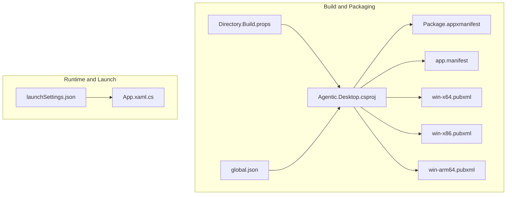
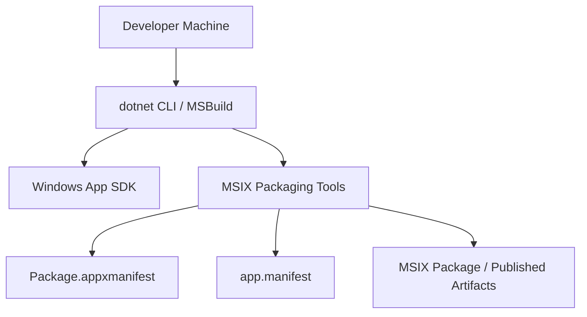
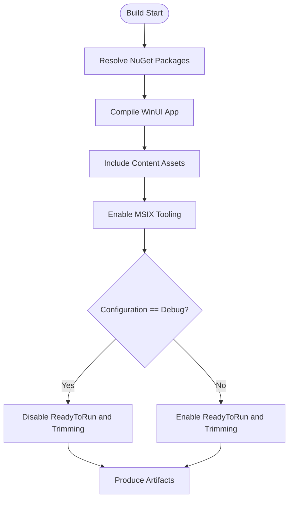
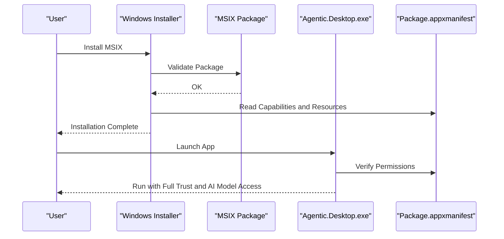
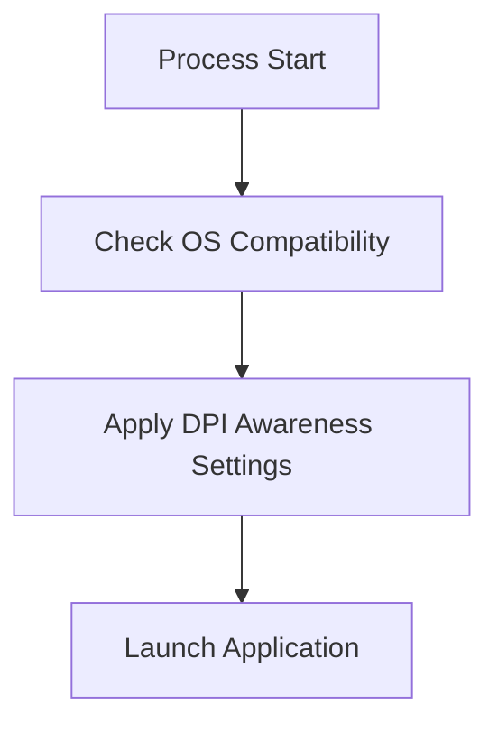
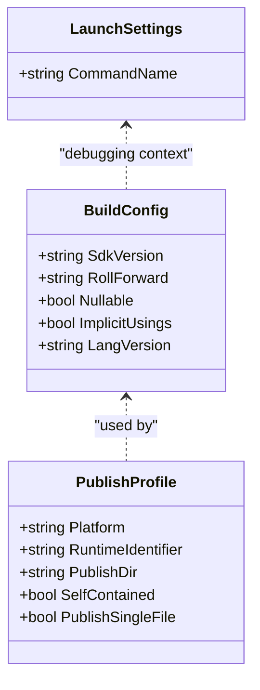
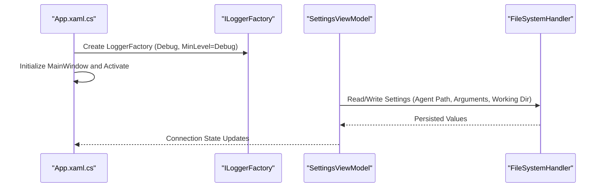
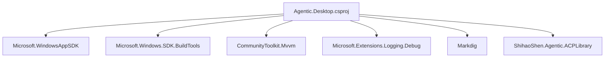

# Configuration and Deployment

<cite>
**Referenced Files in This Document**
- [Agentic.Desktop.csproj](file://Agentic.Desktop/Agentic.Desktop.csproj)
- [Package.appxmanifest](file://Agentic.Desktop/Package.appxmanifest)
- [app.manifest](file://Agentic.Desktop/app.manifest)
- [Directory.Build.props](file://Directory.Build.props)
- [global.json](file://global.json)
- [win-x64.pubxml](file://Agentic.Desktop/Properties/PublishProfiles/win-x64.pubxml)
- [win-x86.pubxml](file://Agentic.Desktop/Properties/PublishProfiles/win-x86.pubxml)
- [win-arm64.pubxml](file://Agentic.Desktop/Properties/PublishProfiles/win-arm64.pubxml)
- [launchSettings.json](file://Agentic.Desktop/Properties/launchSettings.json)
- [App.xaml.cs](file://Agentic.Desktop/App.xaml.cs)
</cite>

## Table of Contents
1. [Introduction](#introduction)
2. [Project Structure](#project-structure)
3. [Core Components](#core-components)
4. [Architecture Overview](#architecture-overview)
5. [Detailed Component Analysis](#detailed-component-analysis)
6. [Dependency Analysis](#dependency-analysis)
7. [Performance Considerations](#performance-considerations)
8. [Troubleshooting Guide](#troubleshooting-guide)
9. [Conclusion](#conclusion)
10. [Appendices](#appendices)

## Introduction
This document explains how Agentic.Desktop is configured for build, packaging, and deployment on Windows. It covers the .NET project configuration (target framework, platform targets, and NuGet dependencies), MSIX packaging via Package.appxmanifest, system-level settings in app.manifest, build options, signing procedures, distribution guidance, environment variables, configuration file formats, runtime behavior, troubleshooting steps, and validation checks to ensure a successful installation.

## Project Structure
At a high level, the project uses:
- A .NET WinUI 3 desktop application with MSIX packaging enabled
- Per-platform publish profiles for x86, x64, and ARM64
- Global SDK and language features controlled by global.json and Directory.Build.props
- Visual Studio launch profiles for packaged and unpackaged debugging

**Diagram sources**
- [Agentic.Desktop.csproj:1-79](file://Agentic.Desktop/Agentic.Desktop.csproj#L1-L79)
- [Directory.Build.props:1-8](file://Directory.Build.props#L1-L8)
- [global.json:1-8](file://global.json#L1-L8)
- [Package.appxmanifest:1-57](file://Agentic.Desktop/Package.appxmanifest#L1-L57)
- [app.manifest:1-19](file://Agentic.Desktop/app.manifest#L1-L19)
- [win-x64.pubxml:1-14](file://Agentic.Desktop/Properties/PublishProfiles/win-x64.pubxml#L1-L14)
- [win-x86.pubxml:1-14](file://Agentic.Desktop/Properties/PublishProfiles/win-x86.pubxml#L1-L14)
- [win-arm64.pubxml:1-14](file://Agentic.Desktop/Properties/PublishProfiles/win-arm64.pubxml#L1-L14)
- [launchSettings.json:1-10](file://Agentic.Desktop/Properties/launchSettings.json#L1-L10)

**Section sources**
- [Agentic.Desktop.csproj:1-79](file://Agentic.Desktop/Agentic.Desktop.csproj#L1-L79)
- [Directory.Build.props:1-8](file://Directory.Build.props#L1-L8)
- [global.json:1-8](file://global.json#L1-L8)
- [Package.appxmanifest:1-57](file://Agentic.Desktop/Package.appxmanifest#L1-L57)
- [app.manifest:1-19](file://Agentic.Desktop/app.manifest#L1-L19)
- [win-x64.pubxml:1-14](file://Agentic.Desktop/Properties/PublishProfiles/win-x64.pubxml#L1-L14)
- [win-x86.pubxml:1-14](file://Agentic.Desktop/Properties/PublishProfiles/win-x86.pubxml#L1-L14)
- [win-arm64.pubxml:1-14](file://Agentic.Desktop/Properties/PublishProfiles/win-arm64.pubxml#L1-L14)
- [launchSettings.json:1-10](file://Agentic.Desktop/Properties/launchSettings.json#L1-L10)

## Core Components
- .NET project configuration (Agentic.Desktop.csproj):
  - Target framework net10.0-windows10.0.26100.0 with minimum OS version 10.0.17763.0
  - Platforms x86, x64, ARM64; auto RuntimeIdentifier based on host architecture
  - MSIX tooling enabled and WinUI integration
  - NuGet packages for WinAppSDK, logging, MVVM toolkit, Markdown parsing, and agent library
- MSIX manifest (Package.appxmanifest):
  - Identity, display properties, resources, target device families
  - Application entry point and visual elements
  - Capabilities including full trust and system AI models
- System manifest (app.manifest):
  - Compatibility declarations and DPI awareness
- Publish profiles:
  - Self-contained FileSystem publishing per platform
- Global settings:
  - SDK version and roll-forward policy
  - Language features and nullable/implicit usings

**Section sources**
- [Agentic.Desktop.csproj:1-79](file://Agentic.Desktop/Agentic.Desktop.csproj#L1-L79)
- [Package.appxmanifest:1-57](file://Agentic.Desktop/Package.appxmanifest#L1-L57)
- [app.manifest:1-19](file://Agentic.Desktop/app.manifest#L1-L19)
- [win-x64.pubxml:1-14](file://Agentic.Desktop/Properties/PublishProfiles/win-x64.pubxml#L1-L14)
- [win-x86.pubxml:1-14](file://Agentic.Desktop/Properties/PublishProfiles/win-x86.pubxml#L1-L14)
- [win-arm64.pubxml:1-14](file://Agentic.Desktop/Properties/PublishProfiles/win-arm64.pubxml#L1-L14)
- [Directory.Build.props:1-8](file://Directory.Build.props#L1-L8)
- [global.json:1-8](file://global.json#L1-L8)

## Architecture Overview
The build and packaging pipeline integrates .NET SDK, WinUI 3, and MSIX tooling to produce an installable package. The application declares capabilities and resources required at runtime.

**Diagram sources**
- [Agentic.Desktop.csproj:1-79](file://Agentic.Desktop/Agentic.Desktop.csproj#L1-L79)
- [Package.appxmanifest:1-57](file://Agentic.Desktop/Package.appxmanifest#L1-L57)
- [app.manifest:1-19](file://Agentic.Desktop/app.manifest#L1-L19)

## Detailed Component Analysis

### .NET Project Configuration (Agentic.Desktop.csproj)
Key aspects:
- TargetFramework set to net10.0-windows10.0.26100.0 with TargetPlatformMinVersion 10.0.17763.0
- Platforms include x86, x64, ARM64; RuntimeIdentifier defaults to current process architecture
- MSIX tooling enabled; WinUI integration active
- Content assets included for splash screen, icons, and store logo
- NuGet packages:
  - Microsoft.WindowsAppSDK and related build tools
  - CommunityToolkit.Mvvm for MVVM patterns
  - Microsoft.Extensions.Logging.Debug for debug logging
  - Markdig for Markdown processing
  - ShihaoShen.Agentic.ACPLibrary for agent communication
- Publish optimizations:
  - ReadyToRun and trimming enabled in non-Debug configurations

**Diagram sources**
- [Agentic.Desktop.csproj:1-79](file://Agentic.Desktop/Agentic.Desktop.csproj#L1-L79)

**Section sources**
- [Agentic.Desktop.csproj:1-79](file://Agentic.Desktop/Agentic.Desktop.csproj#L1-L79)

### MSIX Packaging Configuration (Package.appxmanifest)
Highlights:
- Identity includes Name, Publisher, Version
- Properties define DisplayName, PublisherDisplayName, Logo
- Dependencies target Windows.Universal and Windows.Desktop families with min/max versions
- Resources declare supported languages
- Application entry points and VisualElements define UI branding and splash
- Capabilities:
  - runFullTrust allows full-trust execution
  - systemAIModels enables access to system AI model capabilities

**Diagram sources**
- [Package.appxmanifest:1-57](file://Agentic.Desktop/Package.appxmanifest#L1-L57)

**Section sources**
- [Package.appxmanifest:1-57](file://Agentic.Desktop/Package.appxmanifest#L1-L57)

### Windows Application Manifest (app.manifest)
System-level configuration:
- Assembly identity and compatibility declarations for Windows 10+
- DPI awareness set to PerMonitorV2 for correct scaling across monitors

**Diagram sources**
- [app.manifest:1-19](file://Agentic.Desktop/app.manifest#L1-L19)

**Section sources**
- [app.manifest:1-19](file://Agentic.Desktop/app.manifest#L1-L19)

### Build Configuration Options
- SDK and language features:
  - global.json pins SDK version and roll-forward policy
  - Directory.Build.props sets Nullable, ImplicitUsings, and LangVersion
- Publish profiles:
  - win-x64, win-x86, win-arm64 define Platform, RuntimeIdentifier, PublishDir, SelfContained, and single-file behavior
- Launch settings:
  - launchSettings.json provides profiles for packaged and unpackaged debugging

**Diagram sources**
- [global.json:1-8](file://global.json#L1-L8)
- [Directory.Build.props:1-8](file://Directory.Build.props#L1-L8)
- [win-x64.pubxml:1-14](file://Agentic.Desktop/Properties/PublishProfiles/win-x64.pubxml#L1-L14)
- [win-x86.pubxml:1-14](file://Agentic.Desktop/Properties/PublishProfiles/win-x86.pubxml#L1-L14)
- [win-arm64.pubxml:1-14](file://Agentic.Desktop/Properties/PublishProfiles/win-arm64.pubxml#L1-L14)
- [launchSettings.json:1-10](file://Agentic.Desktop/Properties/launchSettings.json#L1-L10)

**Section sources**
- [global.json:1-8](file://global.json#L1-L8)
- [Directory.Build.props:1-8](file://Directory.Build.props#L1-L8)
- [win-x64.pubxml:1-14](file://Agentic.Desktop/Properties/PublishProfiles/win-x64.pubxml#L1-L14)
- [win-x86.pubxml:1-14](file://Agentic.Desktop/Properties/PublishProfiles/win-x86.pubxml#L1-L14)
- [win-arm64.pubxml:1-14](file://Agentic.Desktop/Properties/PublishProfiles/win-arm64.pubxml#L1-L14)
- [launchSettings.json:1-10](file://Agentic.Desktop/Properties/launchSettings.json#L1-L10)

### Signing Procedures for Production Deployment
- For MSIX packages, sign using a trusted certificate:
  - Use signtool or Visual Studio packaging options to apply code signing
  - Ensure the certificate chain is valid and installed on target machines if sideloading
- For self-contained published artifacts:
  - Sign executables and dependent DLLs with Authenticode
  - Distribute certificates or use a trusted CA for automatic trust

[No sources needed since this section provides general guidance]

### Distribution Guidelines
- Microsoft Store:
  - Update Package.appxmanifest identity and logos
  - Prepare store submission assets and metadata
  - Use Visual Studio “Package and Publish” workflow
- Sideloading:
  - Export MSIX with proper signing
  - Provide instructions to enable sideloading on enterprise devices
- Self-contained publish:
  - Use publish profiles to output per-architecture binaries
  - Include all required redistributables and dependencies

[No sources needed since this section provides general guidance]

### Environment Variables, Configuration File Formats, and Runtime Settings
- Logging:
  - Application configures a logger factory with debug output and minimum level set during launch
- Runtime configuration:
  - Self-contained publishes bundle the runtime; no external runtime required
- Environment variables:
  - Agent path, arguments, and working directory are managed through the UI and persisted by the application’s settings layer
- Configuration files:
  - No explicit JSON/XML config files are referenced in the project; settings are handled in-memory and surfaced via the Settings page

**Diagram sources**
- [App.xaml.cs:1-85](file://Agentic.Desktop/App.xaml.cs#L1-L85)

**Section sources**
- [App.xaml.cs:1-85](file://Agentic.Desktop/App.xaml.cs#L1-L85)

## Dependency Analysis
The project depends on:
- Windows App SDK and build tools for WinUI 3 and MSIX packaging
- MVVM toolkit for observable properties and commands
- Logging infrastructure for diagnostics
- Markdown parser for content rendering
- Agent communication library for connecting to external agents

**Diagram sources**
- [Agentic.Desktop.csproj:1-79](file://Agentic.Desktop/Agentic.Desktop.csproj#L1-L79)

**Section sources**
- [Agentic.Desktop.csproj:1-79](file://Agentic.Desktop/Agentic.Desktop.csproj#L1-L79)

## Performance Considerations
- ReadyToRun compilation improves startup time in non-Debug builds
- Trimming reduces binary size by removing unused code paths
- Self-contained publishing avoids runtime resolution overhead but increases package size
- DPI awareness ensures crisp rendering across displays without extra scaling logic

[No sources needed since this section provides general guidance]

## Troubleshooting Guide
Common issues and resolutions:
- MSIX installation fails due to missing capabilities:
  - Verify Package.appxmanifest includes required capabilities such as runFullTrust and systemAIModels
- App does not start or crashes on launch:
  - Confirm app.manifest compatibility and DPI settings are present
  - Check that the executable entry point matches the manifest
- Publishing errors:
  - Ensure correct Platform and RuntimeIdentifier in publish profiles
  - Validate SelfContained and PublishSingleFile settings align with distribution needs
- Debugging:
  - Use launchSettings.json profiles to test both packaged and unpackaged modes
  - Inspect debug logs from the logger factory initialized at startup

**Section sources**
- [Package.appxmanifest:1-57](file://Agentic.Desktop/Package.appxmanifest#L1-L57)
- [app.manifest:1-19](file://Agentic.Desktop/app.manifest#L1-L19)
- [win-x64.pubxml:1-14](file://Agentic.Desktop/Properties/PublishProfiles/win-x64.pubxml#L1-L14)
- [win-x86.pubxml:1-14](file://Agentic.Desktop/Properties/PublishProfiles/win-x86.pubxml#L1-L14)
- [win-arm64.pubxml:1-14](file://Agentic.Desktop/Properties/PublishProfiles/win-arm64.pubxml#L1-L14)
- [launchSettings.json:1-10](file://Agentic.Desktop/Properties/launchSettings.json#L1-L10)
- [App.xaml.cs:1-85](file://Agentic.Desktop/App.xaml.cs#L1-L85)

## Conclusion
Agentic.Desktop is configured as a modern WinUI 3 desktop application targeting multiple Windows architectures with MSIX packaging. The project leverages robust build and publish configurations, clear capability declarations, and system-level manifests to ensure reliable deployment. By following the signing and distribution guidelines, validating configurations, and using the provided troubleshooting steps, you can confidently deliver the application to users via the Microsoft Store or sideloading channels.

## Appendices
- Recommended validation steps:
  - Build in Release mode to enable ReadyToRun and trimming
  - Test both packaged and unpackaged launch profiles
  - Verify MSIX signature and capabilities before distribution
  - Confirm DPI scaling and resource localization across languages

[No sources needed since this section provides general guidance]