# Configuration and Deployment

<cite>
**Referenced Files in This Document**
- [Agentic.Desktop.csproj](file://Agentic.Desktop/Agentic.Desktop.csproj)
- [Package.appxmanifest](file://Agentic.Desktop/Package.appxmanifest)
- [app.manifest](file://Agentic.Desktop/app.manifest)
- [Directory.Build.props](file://Directory.Build.props)
- [global.json](file://global.json)
- [launchSettings.json](file://Agentic.Desktop/Properties/launchSettings.json)
- [Program.cs](file://Agentic.Desktop/Platforms/Desktop/Program.cs)
- [App.xaml.cs](file://Agentic.Desktop/App.xaml.cs)
- [dependabot.yml](file://.github/dependabot.yml)
- [LocalizationService.cs](file://Agentic.Desktop/Services/LocalizationService.cs)
- [Resources.resw](file://Agentic.Desktop/Strings/en/Resources.resw)
</cite>

## Update Summary
**Changes Made**
- Updated project configuration to support cross-platform builds with multiple target frameworks (net10.0-windows10.0.26100;net10.0-desktop)
- Integrated Uno.Sdk for cross-platform application development with Skia desktop support
- Enhanced WinUI analyzer configuration with custom Microsoft.WindowsAppSDK.Analyzers
- Added conditional compilation symbols and platform-specific package references
- Configured cross-platform entry points with UnoPlatformHostBuilder for multi-platform deployment

## Table of Contents
1. [Introduction](#introduction)
2. [Project Structure](#project-structure)
3. [Core Components](#core-components)
4. [Architecture Overview](#architecture-overview)
5. [Detailed Component Analysis](#detailed-component-analysis)
6. [Dependency Analysis](#dependency-analysis)
7. [Performance Considerations](#performance-considerations)
8. [Troubleshooting Guide](#troubleshooting-guide)
9. [Conclusion](#conclusion)
10. [Appendices](#appendices)

## Introduction
This document explains how Agentic.Desktop is configured for build, packaging, and deployment across multiple platforms using the Uno.Sdk framework. The project now supports both Windows (WinAppSDK) and cross-platform desktop targets through a unified build system. It covers the .NET project configuration with multiple target frameworks, Uno.Sdk integration, MSIX packaging for Windows, system-level settings, build options, signing procedures, distribution guidance, environment variables, configuration file formats, runtime behavior, troubleshooting steps, and validation checks to ensure successful installation across all supported platforms.

## Project Structure
At a high level, the project uses:
- A cross-platform .NET application with Uno.Sdk supporting multiple target frameworks
- Conditional compilation for platform-specific features and packages
- Global SDK and language features controlled by global.json and Directory.Build.props
- Visual Studio launch profiles for packaged and unpackaged debugging
- GitHub Dependabot for automated NuGet package updates
- Comprehensive localization infrastructure with resource files for multiple languages
- Cross-platform entry points using UnoPlatformHostBuilder for Skia desktop support

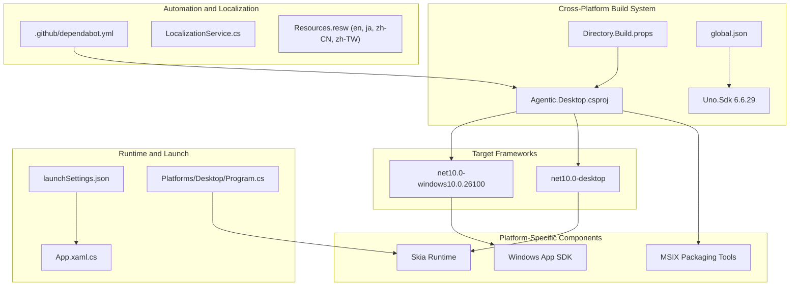

**Diagram sources**
- [Agentic.Desktop.csproj:1-83](file://Agentic.Desktop/Agentic.Desktop.csproj#L1-L83)
- [Directory.Build.props:1-23](file://Directory.Build.props#L1-L23)
- [global.json:1-11](file://global.json#L1-L11)
- [Program.cs:1-24](file://Agentic.Desktop/Platforms/Desktop/Program.cs#L1-L24)

**Section sources**
- [Agentic.Desktop.csproj:1-83](file://Agentic.Desktop/Agentic.Desktop.csproj#L1-L83)
- [Directory.Build.props:1-23](file://Directory.Build.props#L1-L23)
- [global.json:1-11](file://global.json#L1-L11)
- [Program.cs:1-24](file://Agentic.Desktop/Platforms/Desktop/Program.cs#L1-L24)

## Core Components
- **Cross-platform .NET project configuration (Agentic.Desktop.csproj)**:
  - Target frameworks: net10.0-windows10.0.26100 and net10.0-desktop with Uno.Sdk integration
  - DefaultLanguage set to 'en' for localization support
  - Conditional compilation symbols (WINDOWS) for platform-specific code
  - UnoSingleProject enabled for unified project structure
  - Platform-specific package references and conditional MSIX tooling
- **Uno.Sdk Integration**:
  - Version 6.6.29 specified in global.json
  - Cross-platform hosting with UnoPlatformHostBuilder
  - Support for X11, Linux FrameBuffer, macOS, and Win32 backends
- **WinUI Analyzer Enhancements**:
  - Custom Microsoft.WindowsAppSDK.Analyzers configuration
  - Pre-built DLL and targets loaded from analyzer directory
  - Shared configuration between dotnet CLI and BuildAndRun.ps1
- **MSIX manifest (Package.appxmanifest)**:
  - Identity, display properties, resources, target device families
  - Application entry point and visual elements
  - Capabilities including full trust and system AI models
  - Multi-language resource declarations (en, zh-CN, zh-TW, ja)
- **System manifest (app.manifest)**:
  - Compatibility declarations and DPI awareness
  - Windows 10+ compatibility with PerMonitorV2 DPI awareness

**Section sources**
- [Agentic.Desktop.csproj:1-83](file://Agentic.Desktop/Agentic.Desktop.csproj#L1-L83)
- [Directory.Build.props:1-23](file://Directory.Build.props#L1-L23)
- [global.json:1-11](file://global.json#L1-L11)
- [Program.cs:1-24](file://Agentic.Desktop/Platforms/Desktop/Program.cs#L1-L24)
- [Package.appxmanifest:1-57](file://Agentic.Desktop/Package.appxmanifest#L1-L57)
- [app.manifest:1-19](file://Agentic.Desktop/app.manifest#L1-L19)

## Architecture Overview
The build and packaging pipeline integrates .NET SDK, Uno.Sdk, WinUI 3, and MSIX tooling to produce installable packages across multiple platforms. The application uses conditional compilation to support both Windows-specific features and cross-platform capabilities. Automated dependency management ensures security updates are applied regularly through GitHub Dependabot.

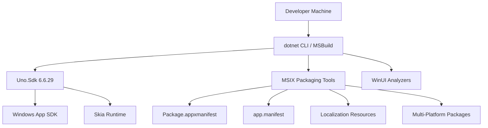

**Diagram sources**
- [Agentic.Desktop.csproj:1-83](file://Agentic.Desktop/Agentic.Desktop.csproj#L1-L83)
- [global.json:1-11](file://global.json#L1-L11)
- [Directory.Build.props:1-23](file://Directory.Build.props#L1-L23)

## Detailed Component Analysis

### Cross-Platform .NET Project Configuration (Agentic.Desktop.csproj)
Key aspects:
- **TargetFrameworks**: Set to net10.0-windows10.0.26100 and net10.0-desktop with Uno.Sdk integration
- **UnoSingleProject**: Enabled for unified project structure across platforms
- **Conditional Compilation**: WINDOWS symbol defined for Windows-specific code paths
- **Platform-Specific Assets**: Windows-only assets included conditionally for MSIX packaging
- **Cross-Platform Packages**: Markdig, CommunityToolkit.Mvvm, Microsoft.Extensions.Logging.Debug, ShihaoShen.Agentic.ACPLibrary
- **Windows-Only Packages**: Microsoft.WindowsAppSDK, Microsoft.Windows.SDK.BuildTools, Microsoft.Windows.SDK.BuildTools.WinApp
- **Uno Package Management**: Removal of conflicting Uno packages for Windows App SDK compatibility
- **Publish Optimizations**: ReadyToRun and trimming enabled in non-Debug configurations

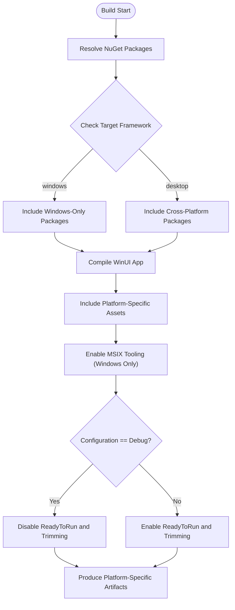

**Diagram sources**
- [Agentic.Desktop.csproj:1-83](file://Agentic.Desktop/Agentic.Desktop.csproj#L1-L83)

**Section sources**
- [Agentic.Desktop.csproj:1-83](file://Agentic.Desktop/Agentic.Desktop.csproj#L1-L83)

### Uno.Sdk Integration and Cross-Platform Entry Points
The project leverages Uno.Sdk for cross-platform support:
- **UnoPlatformHostBuilder**: Creates platform-agnostic application host
- **Multi-Platform Backends**: Supports X11, Linux FrameBuffer, macOS, and Win32
- **Conditional Entry Points**: Separate Program.cs for desktop target vs XAML-generated Main for Windows
- **Platform Detection**: Automatic backend selection based on target framework

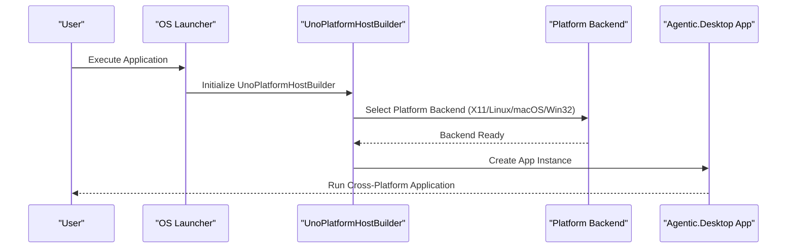

**Diagram sources**
- [Program.cs:1-24](file://Agentic.Desktop/Platforms/Desktop/Program.cs#L1-L24)

**Section sources**
- [Program.cs:1-24](file://Agentic.Desktop/Platforms/Desktop/Program.cs#L1-L24)

### WinUI Analyzer Configuration (Directory.Build.props)
Enhanced analyzer setup for improved development experience:
- **Custom Analyzer Directory**: Pre-built Microsoft.WindowsAppSDK.Analyzers.dll and targets
- **Shared Configuration**: Single source of truth for both dotnet CLI and BuildAndRun.ps1
- **Conditional Loading**: Analyzers only loaded if pre-built files exist
- **Latest Language Features**: C# latest version enabled for modern syntax support

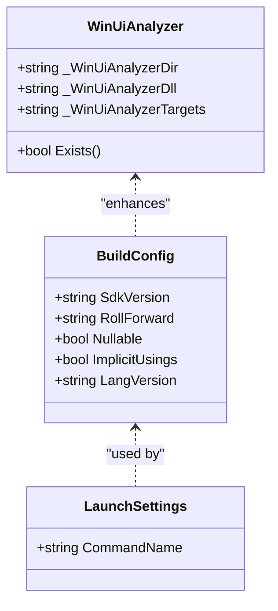

**Diagram sources**
- [Directory.Build.props:1-23](file://Directory.Build.props#L1-L23)
- [global.json:1-11](file://global.json#L1-L11)
- [launchSettings.json:1-10](file://Agentic.Desktop/Properties/launchSettings.json#L1-L10)

**Section sources**
- [Directory.Build.props:1-23](file://Directory.Build.props#L1-L23)

### MSIX Packaging Configuration (Package.appxmanifest)
Highlights:
- Identity includes Name, Publisher, Version
- Properties define DisplayName, PublisherDisplayName, Logo
- Dependencies target Windows.Universal and Windows.Desktop families with min/max versions
- Resources declare supported languages (en, zh-CN, zh-TW, ja)
- Application entry points and VisualElements define UI branding and splash
- Capabilities:
  - runFullTrust allows full-trust execution
  - systemAIModels enables access to system AI model capabilities

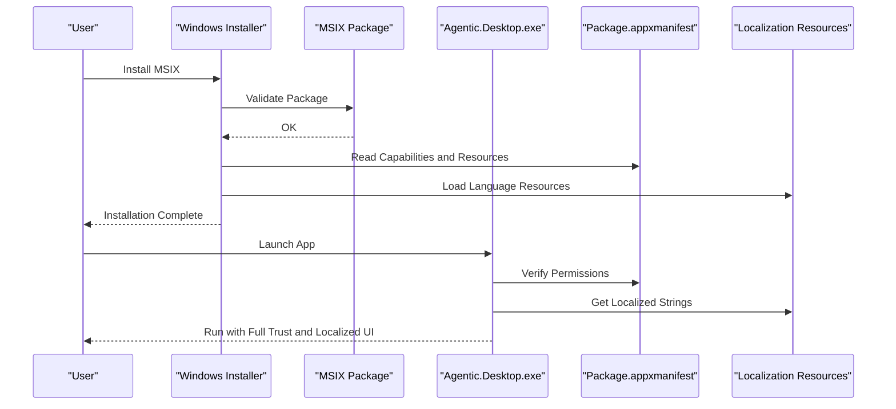

**Diagram sources**
- [Package.appxmanifest:1-57](file://Agentic.Desktop/Package.appxmanifest#L1-L57)

**Section sources**
- [Package.appxmanifest:1-57](file://Agentic.Desktop/Package.appxmanifest#L1-L57)

### Windows Application Manifest (app.manifest)
System-level configuration:
- Assembly identity and compatibility declarations for Windows 10+
- DPI awareness set to PerMonitorV2 for correct scaling across monitors

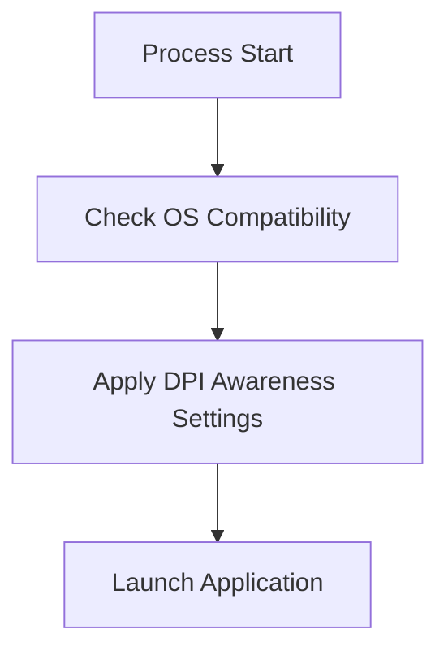

**Diagram sources**
- [app.manifest:1-19](file://Agentic.Desktop/app.manifest#L1-L19)

**Section sources**
- [app.manifest:1-19](file://Agentic.Desktop/app.manifest#L1-L19)

### GitHub Dependabot Configuration (.github/dependabot.yml)
Automated dependency management setup:
- Configured for NuGet package ecosystem
- Targets the Agentic.Desktop directory where package manifests are located
- Daily schedule for automatic dependency updates
- Ensures security patches and updates are applied automatically

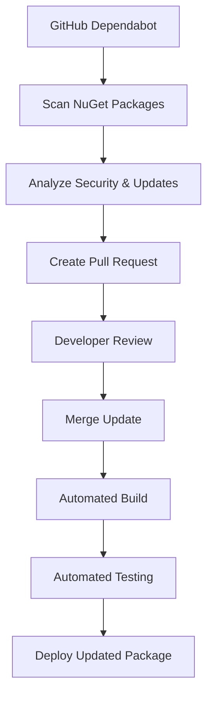

**Diagram sources**
- [dependabot.yml:1-12](file://.github/dependabot.yml#L1-L12)

**Section sources**
- [dependabot.yml:1-12](file://.github/dependabot.yml#L1-L12)

### Localization Infrastructure
Comprehensive localization support:
- LocalizationService class provides centralized access to localized strings
- Resource files (.resw) organized by language (en, ja, zh-CN, zh-TW)
- Supports both simple string retrieval and formatted string operations
- Integrated throughout the application UI and code-behind

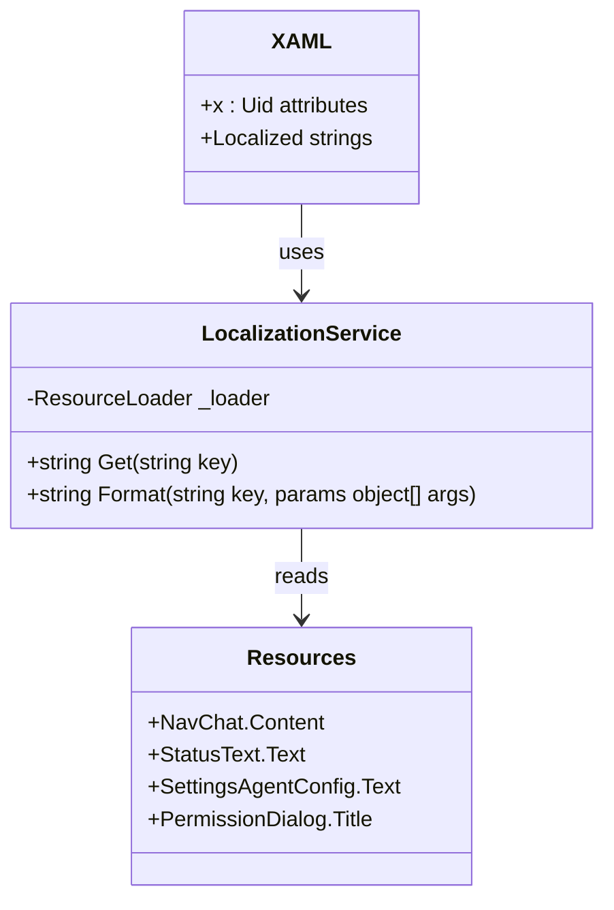

**Diagram sources**
- [LocalizationService.cs:1-23](file://Agentic.Desktop/Services/LocalizationService.cs#L1-L23)
- [Resources.resw:1-223](file://Agentic.Desktop/Strings/en/Resources.resw#L1-L223)

**Section sources**
- [LocalizationService.cs:1-23](file://Agentic.Desktop/Services/LocalizationService.cs#L1-L23)
- [Resources.resw:1-223](file://Agentic.Desktop/Strings/en/Resources.resw#L1-L223)

### Build Configuration Options
- **SDK and language features**:
  - global.json pins SDK version 10.0.100 with roll-forward policy
  - Uno.Sdk version 6.6.29 specified for MSBuild SDK resolution
  - Directory.Build.props sets Nullable, ImplicitUsings, and LangVersion
- **Launch settings**:
  - launchSettings.json provides profiles for packaged and unpackaged debugging

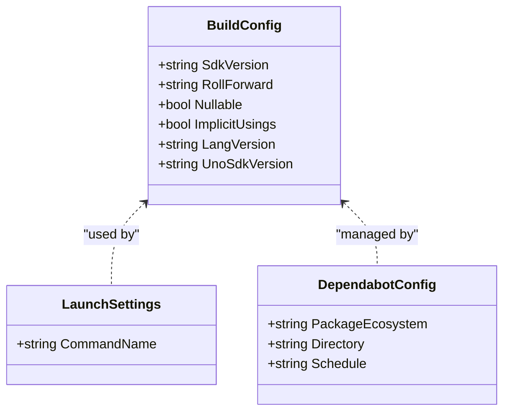

**Diagram sources**
- [global.json:1-11](file://global.json#L1-L11)
- [Directory.Build.props:1-23](file://Directory.Build.props#L1-L23)
- [launchSettings.json:1-10](file://Agentic.Desktop/Properties/launchSettings.json#L1-L10)
- [dependabot.yml:1-12](file://.github/dependabot.yml#L1-L12)

**Section sources**
- [global.json:1-11](file://global.json#L1-L11)
- [Directory.Build.props:1-23](file://Directory.Build.props#L1-L23)
- [launchSettings.json:1-10](file://Agentic.Desktop/Properties/launchSettings.json#L1-L10)
- [dependabot.yml:1-12](file://.github/dependabot.yml#L1-L12)

### Signing Procedures for Production Deployment
- For MSIX packages, sign using a trusted certificate:
  - Use signtool or Visual Studio packaging options to apply code signing
  - Ensure the certificate chain is valid and installed on target machines if sideloading
- For self-contained published artifacts:
  - Sign executables and dependent DLLs with Authenticode
  - Distribute certificates or use a trusted CA for automatic trust
- For cross-platform deployments:
  - Sign Windows binaries separately from other platforms
  - Use platform-specific signing tools for each target architecture

### Distribution Guidelines
- **Microsoft Store**:
  - Update Package.appxmanifest identity and logos
  - Prepare store submission assets and metadata
  - Use Visual Studio "Package and Publish" workflow
- **Sideloading**:
  - Export MSIX with proper signing
  - Provide instructions to enable sideloading on enterprise devices
- **Self-contained publish**:
  - Use publish profiles to output per-architecture binaries
  - Include all required redistributables and dependencies
- **Cross-platform distribution**:
  - Publish separate binaries for each target platform
  - Provide platform-specific installation instructions

### Environment Variables, Configuration File Formats, and Runtime Settings
- **Logging**:
  - Application configures a logger factory with debug output and minimum level set during launch
- **Runtime configuration**:
  - Self-contained publishes bundle the runtime; no external runtime required
- **Environment variables**:
  - Agent path, arguments, and working directory are managed through the UI and persisted by the application's settings layer
- **Configuration files**:
  - No explicit JSON/XML config files are referenced in the project; settings are handled in-memory and surfaced via the Settings page
- **Localization**:
  - String resources are loaded from .resw files based on user's system language preference
- **Cross-platform runtime**:
  - Uno.Platform handles platform-specific runtime initialization
  - Platform backends provide native functionality abstraction

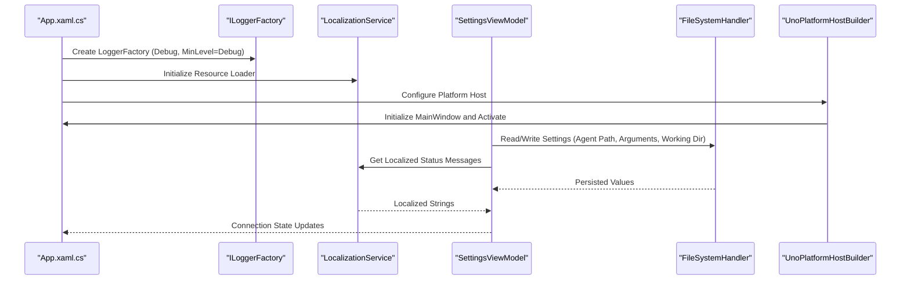

**Diagram sources**
- [App.xaml.cs:1-73](file://Agentic.Desktop/App.xaml.cs#L1-L73)
- [Program.cs:1-24](file://Agentic.Desktop/Platforms/Desktop/Program.cs#L1-L24)
- [LocalizationService.cs:1-23](file://Agentic.Desktop/Services/LocalizationService.cs#L1-L23)

**Section sources**
- [App.xaml.cs:1-73](file://Agentic.Desktop/App.xaml.cs#L1-L73)
- [Program.cs:1-24](file://Agentic.Desktop/Platforms/Desktop/Program.cs#L1-L24)
- [LocalizationService.cs:1-23](file://Agentic.Desktop/Services/LocalizationService.cs#L1-L23)

## Dependency Analysis
The project depends on:
- **Uno.Sdk 6.6.29**: Cross-platform application framework
- **Windows App SDK and build tools**: For WinUI 3 and MSIX packaging on Windows
- **MVVM toolkit**: For observable properties and commands
- **Logging infrastructure**: For diagnostics
- **Markdown parser**: For content rendering
- **Agent communication library**: For connecting to external agents
- **GitHub Dependabot**: For automated dependency management
- **Windows Resource Management**: For localization support
- **Skia runtime**: For cross-platform desktop rendering

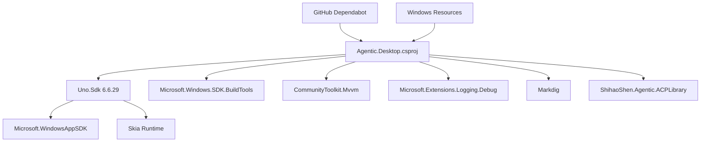

**Diagram sources**
- [Agentic.Desktop.csproj:1-83](file://Agentic.Desktop/Agentic.Desktop.csproj#L1-L83)
- [global.json:1-11](file://global.json#L1-L11)
- [Program.cs:1-24](file://Agentic.Desktop/Platforms/Desktop/Program.cs#L1-L24)
- [dependabot.yml:1-12](file://.github/dependabot.yml#L1-L12)

**Section sources**
- [Agentic.Desktop.csproj:1-83](file://Agentic.Desktop/Agentic.Desktop.csproj#L1-L83)
- [global.json:1-11](file://global.json#L1-L11)
- [Program.cs:1-24](file://Agentic.Desktop/Platforms/Desktop/Program.cs#L1-L24)
- [dependabot.yml:1-12](file://.github/dependabot.yml#L1-L12)

## Performance Considerations
- **ReadyToRun compilation**: Improves startup time in non-Debug builds
- **Trimming**: Reduces binary size by removing unused code paths
- **Self-contained publishing**: Avoids runtime resolution overhead but increases package size
- **DPI awareness**: Ensures crisp rendering across displays without extra scaling logic
- **Localization resources**: Loaded on-demand to minimize memory footprint
- **Uno.Sdk optimizations**: Platform-specific optimizations for each target framework
- **Conditional compilation**: Reduces binary size by excluding unused platform code
- **Dependabot updates**: Processed asynchronously to avoid build delays

## Troubleshooting Guide
Common issues and resolutions:
- **MSIX installation fails due to missing capabilities**:
  - Verify Package.appxmanifest includes required capabilities such as runFullTrust and systemAIModels
- **App does not start or crashes on launch**:
  - Confirm app.manifest compatibility and DPI settings are present
  - Check that the executable entry point matches the manifest
- **Cross-platform build errors**:
  - Ensure Uno.Sdk 6.6.29 is available and properly configured
  - Verify target frameworks are correctly specified
  - Check platform-specific package references
- **Publishing errors**:
  - Ensure correct Platform and RuntimeIdentifier in publish profiles
  - Validate SelfContained and PublishSingleFile settings align with distribution needs
- **Uno.Platform runtime issues**:
  - Verify platform backends are properly initialized
  - Check for missing platform-specific dependencies
- **Debugging**:
  - Use launchSettings.json profiles to test both packaged and unpackaged modes
  - Inspect debug logs from the logger factory initialized at startup
- **Localization issues**:
  - Verify .resw files exist for all supported languages
  - Check that x:Uid attributes match resource keys in .resw files
  - Ensure DefaultLanguage is properly configured in project file
- **Dependabot not updating packages**:
  - Verify dependabot.yml configuration is correct
  - Check GitHub Actions permissions for repository
  - Ensure package manifests are in the specified directory
- **WinUI analyzer issues**:
  - Ensure pre-built analyzer DLL and targets exist in analyzer directory
  - Verify analyzer configuration in Directory.Build.props

**Section sources**
- [Package.appxmanifest:1-57](file://Agentic.Desktop/Package.appxmanifest#L1-L57)
- [app.manifest:1-19](file://Agentic.Desktop/app.manifest#L1-L19)
- [Agentic.Desktop.csproj:1-83](file://Agentic.Desktop/Agentic.Desktop.csproj#L1-L83)
- [Directory.Build.props:1-23](file://Directory.Build.props#L1-L23)
- [global.json:1-11](file://global.json#L1-L11)
- [launchSettings.json:1-10](file://Agentic.Desktop/Properties/launchSettings.json#L1-L10)
- [App.xaml.cs:1-73](file://Agentic.Desktop/App.xaml.cs#L1-L73)
- [Program.cs:1-24](file://Agentic.Desktop/Platforms/Desktop/Program.cs#L1-L24)
- [dependabot.yml:1-12](file://.github/dependabot.yml#L1-L12)
- [LocalizationService.cs:1-23](file://Agentic.Desktop/Services/LocalizationService.cs#L1-L23)

## Conclusion
Agentic.Desktop is configured as a modern cross-platform application using Uno.Sdk 6.6.29, targeting both Windows (net10.0-windows10.0.26100) and desktop (net10.0-desktop) frameworks. The project leverages advanced build and publish configurations, conditional compilation for platform-specific features, clear capability declarations, and system-level manifests to ensure reliable deployment across multiple platforms. With the addition of GitHub Dependabot for automated dependency management, comprehensive localization infrastructure supporting multiple languages, and enhanced WinUI analyzers for improved development experience, the application maintains security and accessibility standards. By following the signing and distribution guidelines, validating configurations, and using the provided troubleshooting steps, you can confidently deliver the application to users via the Microsoft Store, sideloading channels, or cross-platform distribution methods.

## Appendices
- **Recommended validation steps**:
  - Build in Release mode to enable ReadyToRun and trimming
  - Test both packaged and unpackaged launch profiles
  - Verify MSIX signature and capabilities before distribution
  - Confirm DPI scaling and resource localization across languages
  - Monitor Dependabot pull requests for dependency updates
  - Test localization with different system language settings
  - Validate cross-platform builds for all target frameworks
  - Ensure Uno.Sdk version compatibility across development environments
  - Test platform-specific features on each target platform