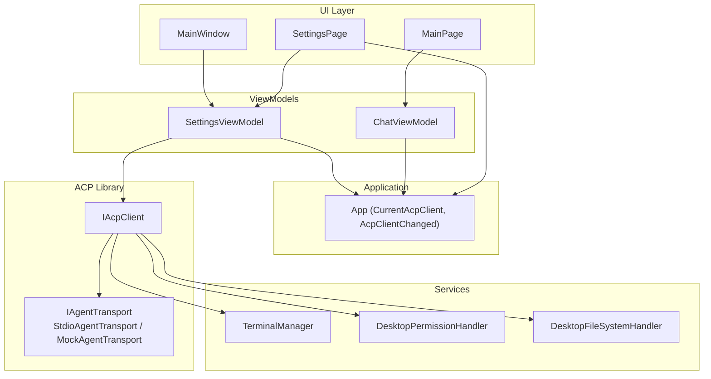
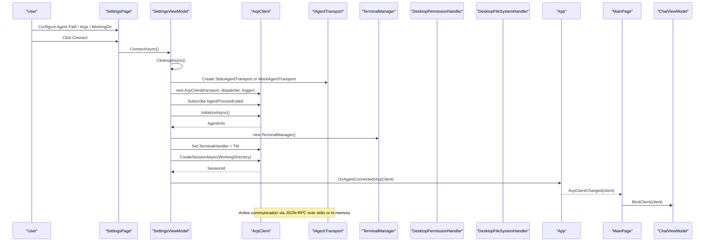
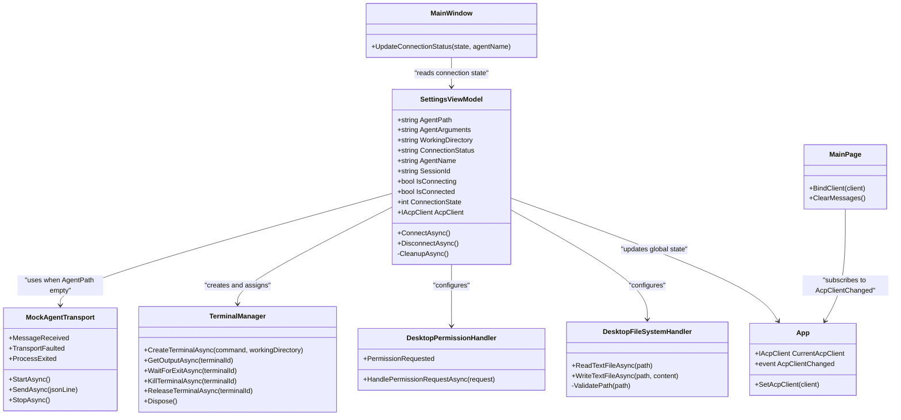

# Agent Connections

<cite>
**Referenced Files in This Document**
- [SettingsViewModel.cs](file://Agentic.Desktop/ViewModels/SettingsViewModel.cs)
- [MockAgentTransport.cs](file://Agentic.Desktop/Mocks/MockAgentTransport.cs)
- [TerminalManager.cs](file://Agentic.Desktop/Services/TerminalManager.cs)
- [PermissionHandler.cs](file://Agentic.Desktop/Services/PermissionHandler.cs)
- [FileSystemHandler.cs](file://Agentic.Desktop/Services/FileSystemHandler.cs)
- [App.xaml.cs](file://Agentic.Desktop/App.xaml.cs)
- [MainWindow.xaml.cs](file://Agentic.Desktop/MainWindow.xaml.cs)
- [MainPage.xaml.cs](file://Agentic.Desktop/MainPage.xaml.cs)
- [ChatViewModel.cs](file://Agentic.Desktop/ViewModels/ChatViewModel.cs)
- [SettingsPage.xaml.cs](file://Agentic.Desktop/SettingsPage.xaml.cs)
- [README.md](file://README.md)
</cite>

## Table of Contents
1. Introduction
2. Project Structure
3. Core Components
4. Architecture Overview
5. Detailed Component Analysis
6. Dependency Analysis
7. Performance Considerations
8. Troubleshooting Guide
9. Conclusion

## Introduction
This document explains the Agent Connection Management in the desktop application, focusing on how connections are established, maintained, and terminated. It covers:
- The SettingsViewModel’s role as the global connection state manager
- Transport selection between real agents (via stdio) and mock implementations
- The stdio transport mechanism for process-based communication
- Error handling strategies and recovery patterns
- Security considerations for external process execution and isolation boundaries
- Debugging techniques and performance optimization tips

The application uses an ACP client abstraction to communicate with external agent processes through a pluggable transport layer. When no agent path is configured, it falls back to a built-in mock transport for development and UI testing.

## Project Structure
At a high level, the connection lifecycle spans ViewModels, Services, and the Application singleton:
- SettingsViewModel orchestrates connection setup, transport selection, session creation, and cleanup
- MockAgentTransport provides a fully in-process mock implementation of IAgentTransport
- TerminalManager manages child terminal processes requested by agents
- PermissionHandler bridges agent permission requests to the UI
- App maintains the current IAcpClient instance and notifies subscribers when it changes
- MainWindow updates the title bar status based on connection state
- MainPage binds ChatViewModel to the active IAcpClient and handles disconnects

**Diagram sources**
- [SettingsViewModel.cs:15-161](file://Agentic.Desktop/ViewModels/SettingsViewModel.cs#L15-L161)
- [MockAgentTransport.cs:9-142](file://Agentic.Desktop/Mocks/MockAgentTransport.cs#L9-L142)
- [TerminalManager.cs:11-161](file://Agentic.Desktop/Services/TerminalManager.cs#L11-L161)
- [PermissionHandler.cs:11-52](file://Agentic.Desktop/Services/PermissionHandler.cs#L11-L52)
- [FileSystemHandler.cs:8-41](file://Agentic.Desktop/Services/FileSystemHandler.cs#L8-L41)
- [App.xaml.cs:44-84](file://Agentic.Desktop/App.xaml.cs#L44-L84)
- [MainWindow.xaml.cs:30-50](file://Agentic.Desktop/MainWindow.xaml.cs#L30-L50)
- [MainPage.xaml.cs:26-47](file://Agentic.Desktop/MainPage.xaml.cs#L26-L47)

**Section sources**
- [README.md:51-92](file://README.md#L51-L92)

## Core Components
- SettingsViewModel: Centralizes connection configuration and lifecycle; exposes observable properties for UI binding; selects transport based on settings; initializes AcpClient, subscribes to process exit events, creates sessions, and notifies consumers.
- MockAgentTransport: Implements IAgentTransport in-memory; simulates initialize, session/new, session/prompt, and session/cancel flows; emits streaming update notifications.
- TerminalManager: Manages multiple terminal processes per session; reads stdout/stderr asynchronously; supports kill/release/dispose semantics.
- DesktopPermissionHandler: Marshals permission requests to the UI thread and awaits user decisions.
- DesktopFileSystemHandler: Enforces working-directory isolation for file operations requested by agents.
- App: Holds CurrentAcpClient and raises AcpClientChanged to propagate connection state across pages.
- MainWindow: Updates title bar indicators reflecting connection state.
- MainPage: Binds ChatViewModel to the active AcpClient and clears messages on disconnect.

**Section sources**
- [SettingsViewModel.cs:15-161](file://Agentic.Desktop/ViewModels/SettingsViewModel.cs#L15-L161)
- [MockAgentTransport.cs:9-142](file://Agentic.Desktop/Mocks/MockAgentTransport.cs#L9-L142)
- [TerminalManager.cs:11-161](file://Agentic.Desktop/Services/TerminalManager.cs#L11-L161)
- [PermissionHandler.cs:11-52](file://Agentic.Desktop/Services/PermissionHandler.cs#L11-L52)
- [FileSystemHandler.cs:8-41](file://Agentic.Desktop/Services/FileSystemHandler.cs#L8-L41)
- [App.xaml.cs:44-84](file://Agentic.Desktop/App.xaml.cs#L44-L84)
- [MainWindow.xaml.cs:30-50](file://Agentic.Desktop/MainWindow.xaml.cs#L30-L50)
- [MainPage.xaml.cs:26-47](file://Agentic.Desktop/MainPage.xaml.cs#L26-L47)

## Architecture Overview
The connection architecture follows a clear separation of concerns:
- UI layers (MainWindow, SettingsPage, MainPage) interact with ViewModels
- SettingsViewModel constructs and owns the IAcpClient instance and its transport
- AcpClient communicates via IAgentTransport (real or mock)
- Services implement handlers required by AcpClient (terminal, permissions, filesystem)
- App coordinates global state and cross-page synchronization

**Diagram sources**
- [SettingsViewModel.cs:61-126](file://Agentic.Desktop/ViewModels/SettingsViewModel.cs#L61-L126)
- [MockAgentTransport.cs:21-124](file://Agentic.Desktop/Mocks/MockAgentTransport.cs#L21-L124)
- [TerminalManager.cs:16-68](file://Agentic.Desktop/Services/TerminalManager.cs#L16-L68)
- [PermissionHandler.cs:26-44](file://Agentic.Desktop/Services/PermissionHandler.cs#L26-L44)
- [App.xaml.cs:78-84](file://Agentic.Desktop/App.xaml.cs#L78-L84)
- [MainPage.xaml.cs:26-47](file://Agentic.Desktop/MainPage.xaml.cs#L26-L47)

## Detailed Component Analysis

### SettingsViewModel: Global Connection State Manager
Responsibilities:
- Maintains observable properties for agent path, arguments, working directory, connection status, agent name, session id, and connection state
- Selects transport:
  - If AgentPath is empty, use MockAgentTransport
  - Otherwise, use StdioAgentTransport with provided arguments and working directory
- Initializes AcpClient with JsonRpcDispatcher and logging
- Subscribes to AgentProcessExited to handle unexpected disconnections
- Creates TerminalManager and assigns it to AcpClient
- Creates a session using the configured working directory
- Notifies observers via OnAgentConnected and updates global state through App.SetAcpClient
- Handles errors by updating status and resetting state
- Disconnect flow:
  - Cleans up subscriptions, shuts down AcpClient, disposes TerminalManager
  - Resets UI-bound state and clears global AcpClient reference

Connection lifecycle highlights:
- Connecting state prevents concurrent connect attempts
- Cleanup ensures previous resources are released before reconnection
- Process exit triggers a disconnected notification and UI updates

Error handling:
- Exceptions during initialization set a localized failure message and reset state
- Unexpected process exit is captured and surfaced to UI

Recovery patterns:
- Reconnect can be triggered after fixing configuration; existing connection is cleaned first
- On disconnect, UI elements reflect Disconnected state and clear chat messages

Security considerations:
- Working directory is used for both agent execution context and filesystem access validation
- TerminalManager spawns shell processes with redirected streams and controlled working directories

Performance considerations:
- Avoid redundant reconnects by guarding IsConnecting
- Dispose TerminalManager promptly to release OS resources

**Section sources**
- [SettingsViewModel.cs:15-161](file://Agentic.Desktop/ViewModels/SettingsViewModel.cs#L15-L161)

### MockAgentTransport: In-Memory Development Transport
Behavior:
- Implements StartAsync, SendAsync, StopAsync
- Parses JSON-RPC lines and responds to initialize, session/new, session/prompt, session/cancel
- Emits streaming updates via MessageReceived for prompt responses
- Supports cancellation via CancellationTokenSource linked to prompt tasks
- Raises TransportFaulted on exceptions

Use cases:
- Enables full UI flow without running an external agent
- Useful for development, automated tests, and scenarios where network/process overhead is undesirable

Limitations:
- No actual process management or stdio I/O
- Streaming behavior is simulated with delays

**Section sources**
- [MockAgentTransport.cs:9-142](file://Agentic.Desktop/Mocks/MockAgentTransport.cs#L9-L142)

### TerminalManager: Process-Based Terminal Sessions
Capabilities:
- Creates terminal instances using platform-appropriate shells (cmd.exe on Windows, /bin/sh otherwise)
- Redirects stdin/stdout/stderr and runs asynchronous readers
- Buffers output per terminal instance with thread-safe append/get
- Provides methods to wait for exit, kill entire process tree, release resources, and dispose all terminals

Security and isolation:
- Uses UseShellExecute=false and redirects streams
- Working directory is explicitly set per terminal instance
- Kill(entireProcessTree: true) ensures child processes are terminated

Resource management:
- Dispose pattern ensures all processes are killed and disposed
- ConcurrentDictionary tracks instances safely

**Section sources**
- [TerminalManager.cs:11-161](file://Agentic.Desktop/Services/TerminalManager.cs#L11-L161)

### DesktopPermissionHandler: UI Permission Dialog Bridge
Functionality:
- Receives permission requests from AcpClient
- Dispatches to UI thread via DispatcherQueue
- Waits for user decision through TaskCompletionSource
- Returns RequestPermissionResponse to the caller

Integration:
- Configured on AcpClient.PermissionHandler during connection setup
- ViewModel shows a ContentDialog and completes the request

**Section sources**
- [PermissionHandler.cs:11-52](file://Agentic.Desktop/Services/PermissionHandler.cs#L11-L52)
- [SettingsPage.xaml.cs:22-34](file://Agentic.Desktop/SettingsPage.xaml.cs#L22-L34)

### DesktopFileSystemHandler: Working Directory Isolation
Policy:
- Validates requested paths against the configured working directory
- Throws UnauthorizedAccessException if path escapes the allowed root
- Ensures directories exist before writing

Security boundary:
- Prevents arbitrary file system access outside the sandboxed working directory

**Section sources**
- [FileSystemHandler.cs:8-41](file://Agentic.Desktop/Services/FileSystemHandler.cs#L8-L41)

### App, MainWindow, MainPage: Global State and UI Coordination
- App holds CurrentAcpClient and raises AcpClientChanged to notify subscribers
- MainWindow updates title bar status based on connection state
- MainPage binds ChatViewModel to the active AcpClient and clears messages on disconnect

**Section sources**
- [App.xaml.cs:44-84](file://Agentic.Desktop/App.xaml.cs#L44-L84)
- [MainWindow.xaml.cs:30-50](file://Agentic.Desktop/MainWindow.xaml.cs#L30-L50)
- [MainPage.xaml.cs:26-47](file://Agentic.Desktop/MainPage.xaml.cs#L26-L47)

### ChatViewModel: Active Communication Flow
Responsibilities:
- Sends prompts via AcpClient.SendPromptAsync when connected
- Streams agent responses into UI with frame-level batching
- Cancels ongoing generation on session change or explicit cancel
- Falls back to local mock simulation when no AcpClient is available

Error handling:
- Catches OperationCanceledException for cancellations
- Displays error messages for exceptions during send

**Section sources**
- [ChatViewModel.cs:94-149](file://Agentic.Desktop/ViewModels/ChatViewModel.cs#L94-L149)
- [ChatViewModel.cs:151-204](file://Agentic.Desktop/ViewModels/ChatViewModel.cs#L151-L204)
- [ChatViewModel.cs:206-216](file://Agentic.Desktop/ViewModels/ChatViewModel.cs#L206-L216)

## Dependency Analysis
Key dependencies and relationships:
- SettingsViewModel depends on:
  - AcpClient (from Agentic.ACPLibrary.Client)
  - JsonRpcDispatcher (protocol)
  - IAgentTransport implementations (StdioAgentTransport or MockAgentTransport)
  - TerminalManager (ITerminalHandler)
  - DesktopPermissionHandler (IPermissionHandler)
  - DesktopFileSystemHandler (IFileSystemHandler)
  - App for global state propagation
- ChatViewModel depends on IAcpClient for sending prompts and receiving updates
- TerminalManager depends on OS-specific shell commands and Process APIs
- PermissionHandler depends on WinUI DispatcherQueue for UI marshaling

**Diagram sources**
- [SettingsViewModel.cs:15-161](file://Agentic.Desktop/ViewModels/SettingsViewModel.cs#L15-L161)
- [MockAgentTransport.cs:9-142](file://Agentic.Desktop/Mocks/MockAgentTransport.cs#L9-L142)
- [TerminalManager.cs:11-161](file://Agentic.Desktop/Services/TerminalManager.cs#L11-L161)
- [PermissionHandler.cs:11-52](file://Agentic.Desktop/Services/PermissionHandler.cs#L11-L52)
- [FileSystemHandler.cs:8-41](file://Agentic.Desktop/Services/FileSystemHandler.cs#L8-L41)
- [App.xaml.cs:44-84](file://Agentic.Desktop/App.xaml.cs#L44-L84)
- [MainWindow.xaml.cs:30-50](file://Agentic.Desktop/MainWindow.xaml.cs#L30-L50)
- [MainPage.xaml.cs:26-47](file://Agentic.Desktop/MainPage.xaml.cs#L26-L47)

**Section sources**
- [SettingsViewModel.cs:15-161](file://Agentic.Desktop/ViewModels/SettingsViewModel.cs#L15-L161)
- [MockAgentTransport.cs:9-142](file://Agentic.Desktop/Mocks/MockAgentTransport.cs#L9-L142)
- [TerminalManager.cs:11-161](file://Agentic.Desktop/Services/TerminalManager.cs#L11-L161)
- [PermissionHandler.cs:11-52](file://Agentic.Desktop/Services/PermissionHandler.cs#L11-L52)
- [FileSystemHandler.cs:8-41](file://Agentic.Desktop/Services/FileSystemHandler.cs#L8-L41)
- [App.xaml.cs:44-84](file://Agentic.Desktop/App.xaml.cs#L44-L84)
- [MainWindow.xaml.cs:30-50](file://Agentic.Desktop/MainWindow.xaml.cs#L30-L50)
- [MainPage.xaml.cs:26-47](file://Agentic.Desktop/MainPage.xaml.cs#L26-L47)

## Performance Considerations
- Avoid redundant reconnections: SettingsViewModel guards against concurrent ConnectAsync calls via IsConnecting.
- Batch UI updates: ChatViewModel batches streaming text updates to reduce UI churn.
- Resource disposal: Ensure TerminalManager.Dispose is called to free OS handles and terminate processes.
- Logging: App configures ILoggerFactory with debug level; enable appropriate sinks for production monitoring.
- Stream cancellation: MockAgentTransport respects cancellation tokens to avoid unnecessary work during cancellations.

[No sources needed since this section provides general guidance]

## Troubleshooting Guide
Common issues and resolutions:
- Connection fails immediately:
  - Verify AgentPath points to a valid executable
  - Check AgentArguments for syntax errors
  - Confirm WorkingDirectory exists and has correct permissions
  - Inspect localized error messages set in ConnectionStatus
- Agent process exits unexpectedly:
  - AgentProcessExited handler updates status and notifies UI
  - Review logs around process start and initialization
- Permission dialog not appearing:
  - Ensure DesktopPermissionHandler is assigned to AcpClient.PermissionHandler
  - Confirm DispatcherQueue is available and UI thread dispatch succeeds
- File access denied:
  - Validate that requested paths are within the configured WorkingDirectory
  - DesktopFileSystemHandler throws UnauthorizedAccessException for escaped paths
- Terminal commands hang:
  - Check stdout/stderr buffering and ensure readers are running
  - Use KillTerminalAsync to terminate unresponsive processes
- Switching between development and production modes:
  - Leave AgentPath empty to use MockAgentTransport for development
  - Set AgentPath to the real agent executable for production

Debugging techniques:
- Enable detailed logging via App.LoggerFactory
- Observe ConnectionStatus and ConnectionState in SettingsViewModel
- Monitor AcpClientChanged events to track global state transitions
- Use MainWindow.UpdateConnectionStatus to validate UI state consistency

**Section sources**
- [SettingsViewModel.cs:61-126](file://Agentic.Desktop/ViewModels/SettingsViewModel.cs#L61-L126)
- [SettingsPage.xaml.cs:45-55](file://Agentic.Desktop/SettingsPage.xaml.cs#L45-L55)
- [FileSystemHandler.cs:32-41](file://Agentic.Desktop/Services/FileSystemHandler.cs#L32-L41)
- [TerminalManager.cs:77-113](file://Agentic.Desktop/Services/TerminalManager.cs#L77-L113)
- [App.xaml.cs:66-71](file://Agentic.Desktop/App.xaml.cs#L66-L71)

## Conclusion
Agent Connection Management in this application is centered around SettingsViewModel, which controls transport selection, AcpClient lifecycle, and global state synchronization. The design cleanly separates concerns:
- Real-world communication uses stdio-based transports for external agents
- Development and testing benefit from a robust mock transport
- Security is enforced through working directory isolation and permission dialogs
- Robust error handling and resource cleanup ensure stable operation

By following the configuration guidelines, leveraging debugging tools, and adhering to security boundaries, developers can maintain reliable and secure agent connections across development and production environments.

[No sources needed since this section summarizes without analyzing specific files]