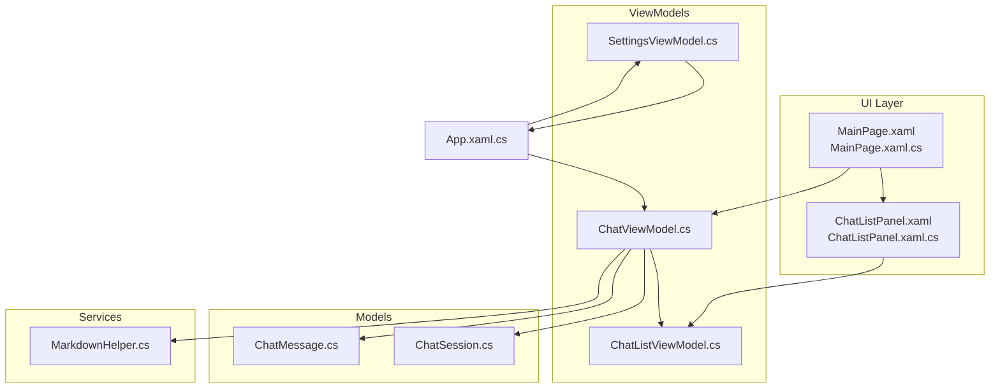
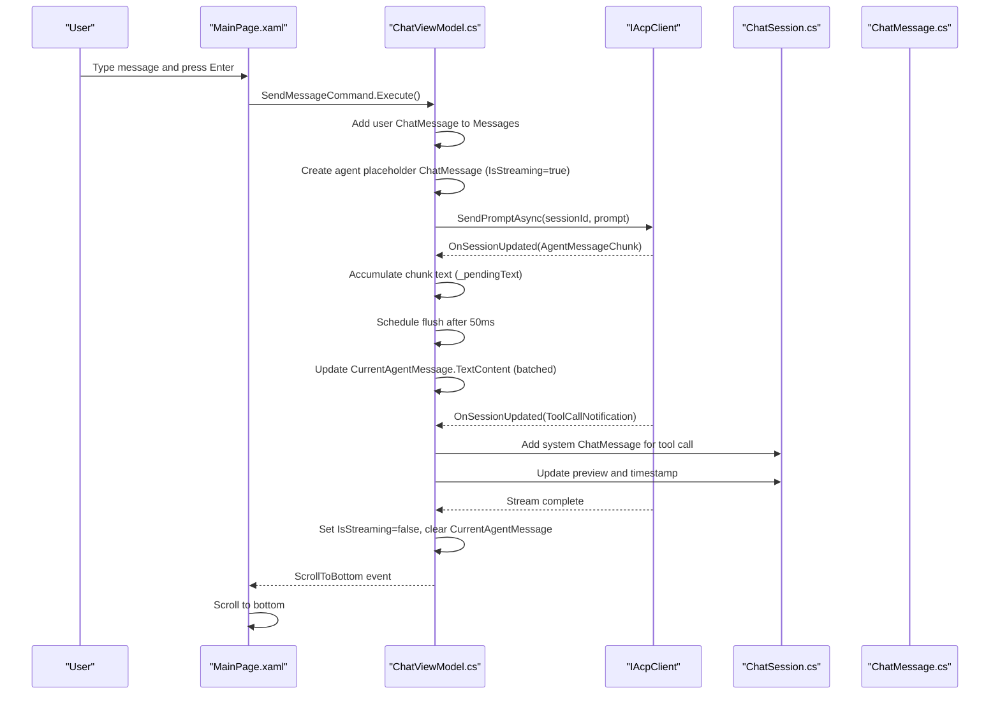
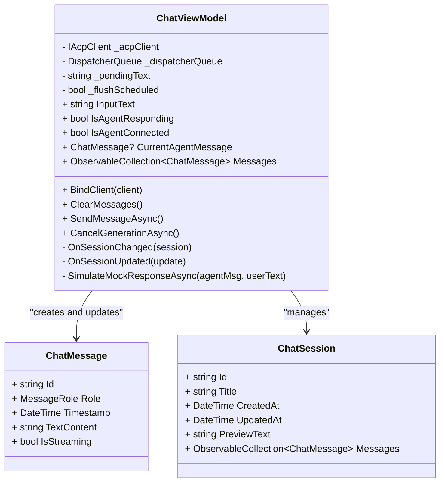
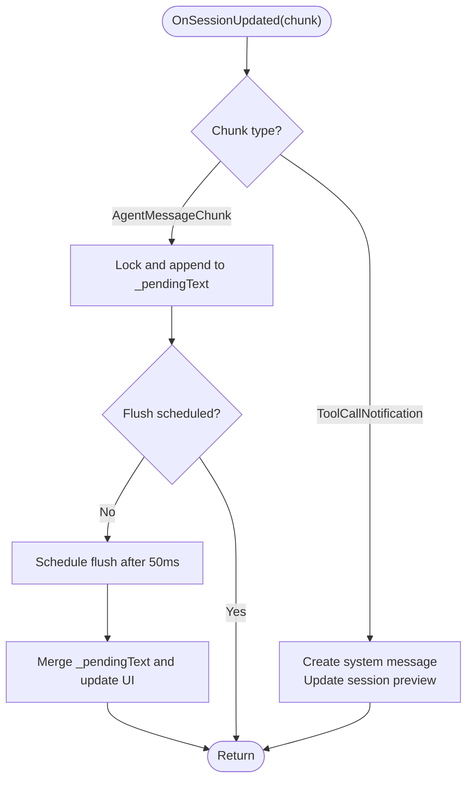
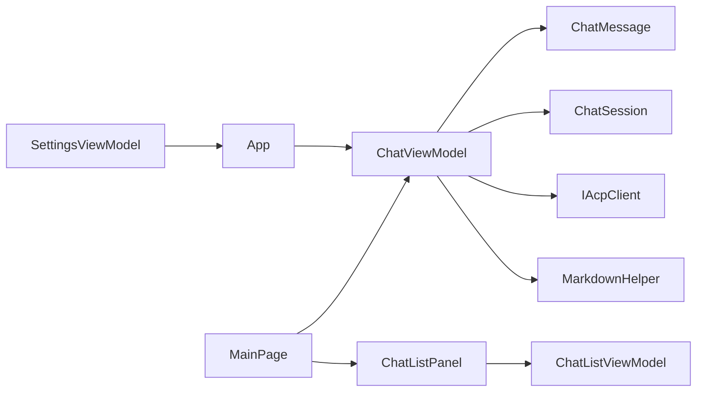

# Chat Interface

<cite>
**Referenced Files in This Document**
- [ChatViewModel.cs](file://Agentic.Desktop/ViewModels/ChatViewModel.cs)
- [ChatMessage.cs](file://Agentic.Desktop/ViewModels/Messages/ChatMessage.cs)
- [ChatSession.cs](file://Agentic.Desktop/ViewModels/Messages/ChatSession.cs)
- [ChatListViewModel.cs](file://Agentic.Desktop/ViewModels/ChatListViewModel.cs)
- [MarkdownHelper.cs](file://Agentic.Desktop/Services/MarkdownHelper.cs)
- [MainPage.xaml](file://Agentic.Desktop/MainPage.xaml)
- [MainPage.xaml.cs](file://Agentic.Desktop/MainPage.xaml.cs)
- [ChatListPanel.xaml](file://Agentic.Desktop/Views/ChatListPanel.xaml)
- [ChatListPanel.xaml.cs](file://Agentic.Desktop/Views/ChatListPanel.xaml.cs)
- [App.xaml.cs](file://Agentic.Desktop/App.xaml.cs)
- [SettingsViewModel.cs](file://Agentic.Desktop/ViewModels/SettingsViewModel.cs)
</cite>

## Table of Contents
1. [Introduction](#introduction)
2. [Project Structure](#project-structure)
3. [Core Components](#core-components)
4. [Architecture Overview](#architecture-overview)
5. [Detailed Component Analysis](#detailed-component-analysis)
6. [Dependency Analysis](#dependency-analysis)
7. [Performance Considerations](#performance-considerations)
8. [Troubleshooting Guide](#troubleshooting-guide)
9. [Conclusion](#conclusion)

## Introduction
This document explains the Chat Interface feature, focusing on real-time messaging with streaming updates, frame-level merging for smooth UI performance, and Markdown rendering capabilities. It details the ChatViewModel implementation, message lifecycle management, session handling, and async communication flow with ACP clients. It also covers the ChatMessage model structure, streaming state management, user message processing, and display behavior across different message types (user, agent, system). Performance optimizations such as batched UI updates and memory considerations for long conversations are included, along with troubleshooting guidance and customization options for message display.

## Project Structure
The chat interface spans ViewModels, Models, Services, and Views:
- ViewModels: ChatViewModel orchestrates messaging and streaming; ChatListViewModel manages sessions; SettingsViewModel handles connection lifecycle.
- Models: ChatMessage represents individual messages; ChatSession holds a conversation and its message history.
- Services: MarkdownHelper converts Markdown to HTML or plain text.
- Views: MainPage defines the chat UI layout and template selection; ChatListPanel renders the sidebar list of sessions.

**Diagram sources**
- [MainPage.xaml](file://Agentic.Desktop/MainPage.xaml)
- [MainPage.xaml.cs](file://Agentic.Desktop/MainPage.xaml.cs)
- [ChatListPanel.xaml](file://Agentic.Desktop/Views/ChatListPanel.xaml)
- [ChatListPanel.xaml.cs](file://Agentic.Desktop/Views/ChatListPanel.xaml.cs)
- [ChatViewModel.cs](file://Agentic.Desktop/ViewModels/ChatViewModel.cs)
- [ChatListViewModel.cs](file://Agentic.Desktop/ViewModels/ChatListViewModel.cs)
- [SettingsViewModel.cs](file://Agentic.Desktop/ViewModels/SettingsViewModel.cs)
- [ChatMessage.cs](file://Agentic.Desktop/ViewModels/Messages/ChatMessage.cs)
- [ChatSession.cs](file://Agentic.Desktop/ViewModels/Messages/ChatSession.cs)
- [MarkdownHelper.cs](file://Agentic.Desktop/Services/MarkdownHelper.cs)
- [App.xaml.cs](file://Agentic.Desktop/App.xaml.cs)

**Section sources**
- [MainPage.xaml](file://Agentic.Desktop/MainPage.xaml)
- [MainPage.xaml.cs](file://Agentic.Desktop/MainPage.xaml.cs)
- [ChatListPanel.xaml](file://Agentic.Desktop/Views/ChatListPanel.xaml)
- [ChatListPanel.xaml.cs](file://Agentic.Desktop/Views/ChatListPanel.xaml.cs)
- [ChatViewModel.cs](file://Agentic.Desktop/ViewModels/ChatViewModel.cs)
- [ChatListViewModel.cs](file://Agentic.Desktop/ViewModels/ChatListViewModel.cs)
- [SettingsViewModel.cs](file://Agentic.Desktop/ViewModels/SettingsViewModel.cs)
- [ChatMessage.cs](file://Agentic.Desktop/ViewModels/Messages/ChatMessage.cs)
- [ChatSession.cs](file://Agentic.Desktop/ViewModels/Messages/ChatSession.cs)
- [MarkdownHelper.cs](file://Agentic.Desktop/Services/MarkdownHelper.cs)
- [App.xaml.cs](file://Agentic.Desktop/App.xaml.cs)

## Core Components
- ChatViewModel: Central controller for sending messages, handling streaming responses, managing current agent message, and coordinating session changes. Implements frame-level merging to batch UI updates.
- ChatMessage: Observable model representing a single message with role, timestamp, streaming state, and text content. Supports Markdown in TextContent.
- ChatSession: Holds a conversation’s metadata and an ObservableCollection of ChatMessage instances.
- ChatListViewModel: Manages multiple sessions, selection, creation, and deletion.
- MarkdownHelper: Converts Markdown to HTML or plain text using Markdig.
- MainPage and ChatListPanel: Define the UI layout, data templates, and interactions.

Key responsibilities:
- Real-time streaming updates via AcpClient events.
- Frame-level merging to reduce UI churn during rapid updates.
- Session switching with automatic cleanup and subscription management.
- Message lifecycle from user input to agent response and system notifications.

**Section sources**
- [ChatViewModel.cs](file://Agentic.Desktop/ViewModels/ChatViewModel.cs)
- [ChatMessage.cs](file://Agentic.Desktop/ViewModels/Messages/ChatMessage.cs)
- [ChatSession.cs](file://Agentic.Desktop/ViewModels/Messages/ChatSession.cs)
- [ChatListViewModel.cs](file://Agentic.Desktop/ViewModels/ChatListViewModel.cs)
- [MarkdownHelper.cs](file://Agentic.Desktop/Services/MarkdownHelper.cs)
- [MainPage.xaml](file://Agentic.Desktop/MainPage.xaml)
- [MainPage.xaml.cs](file://Agentic.Desktop/MainPage.xaml.cs)
- [ChatListPanel.xaml](file://Agentic.Desktop/Views/ChatListPanel.xaml)
- [ChatListPanel.xaml.cs](file://Agentic.Desktop/Views/ChatListPanel.xaml.cs)

## Architecture Overview
The chat architecture follows MVVM with clear separation between UI, view models, and services. The ACP client provides real-time streaming through session events. The UI uses ItemsRepeater with DataTemplates to render messages efficiently.

**Diagram sources**
- [MainPage.xaml.cs](file://Agentic.Desktop/MainPage.xaml.cs)
- [ChatViewModel.cs](file://Agentic.Desktop/ViewModels/ChatViewModel.cs)
- [ChatSession.cs](file://Agentic.Desktop/ViewModels/Messages/ChatSession.cs)
- [ChatMessage.cs](file://Agentic.Desktop/ViewModels/Messages/ChatMessage.cs)

## Detailed Component Analysis

### ChatViewModel Implementation
Responsibilities:
- Binds IAcpClient and subscribes to SessionUpdated events.
- Sends user messages and creates agent placeholders.
- Handles streaming chunks by accumulating text and batching UI updates.
- Inserts system messages for tool calls and updates session previews.
- Provides cancellation support and error handling.

Key behaviors:
- Frame-level merging: Uses a lock and pending buffer to accumulate text chunks, then schedules a delayed flush to update the UI once per frame window.
- Session change handling: Unsubscribes from old session collections, subscribes to new ones, and ensures scroll-to-bottom behavior.
- Async flow: Uses asynchronous commands and tasks to avoid blocking the UI thread.

**Diagram sources**
- [ChatViewModel.cs](file://Agentic.Desktop/ViewModels/ChatViewModel.cs)
- [ChatMessage.cs](file://Agentic.Desktop/ViewModels/Messages/ChatMessage.cs)
- [ChatSession.cs](file://Agentic.Desktop/ViewModels/Messages/ChatSession.cs)

**Section sources**
- [ChatViewModel.cs](file://Agentic.Desktop/ViewModels/ChatViewModel.cs)

### ChatMessage Model Structure
- Properties: Unique Id, Role (User, Agent, System), Timestamp, TextContent (supports Markdown), IsStreaming flag.
- Observability: Uses CommunityToolkit.Mvvm observable properties to notify UI of changes.
- Streaming state: IsStreaming indicates ongoing updates; UI shows typing indicator when true.

Usage patterns:
- User messages created with role User and initial text.
- Agent placeholder created with role Agent and IsStreaming=true; TextContent appended incrementally.
- System messages created for tool calls and other non-user/agent events.

**Section sources**
- [ChatMessage.cs](file://Agentic.Desktop/ViewModels/Messages/ChatMessage.cs)

### Streaming State Management and Frame-Level Merging
Mechanism:
- Incoming AgentMessageChunk accumulates into _pendingText under a lock.
- First chunk schedules a flush task with a short delay (e.g., 50ms).
- Flush task merges accumulated text and updates CurrentAgentMessage.TextContent on the UI thread.
- ToolCallNotification triggers immediate system message insertion and session preview updates.

Benefits:
- Reduces UI re-renders by batching frequent updates.
- Ensures thread safety and consistent UI state.
- Maintains responsiveness even under high-frequency streaming.

**Diagram sources**
- [ChatViewModel.cs](file://Agentic.Desktop/ViewModels/ChatViewModel.cs)

**Section sources**
- [ChatViewModel.cs](file://Agentic.Desktop/ViewModels/ChatViewModel.cs)

### Session Handling and Lifecycle
- ChatListViewModel maintains a collection of ChatSession objects and exposes SelectedSession.
- Selecting a session triggers SessionChanged event; ChatViewModel unsubscribes from previous session and subscribes to the new one.
- Creating a new chat inserts a fresh ChatSession at the top and selects it.
- Deleting a chat removes the session and adjusts selection accordingly.

Session metadata:
- Title auto-updates based on first user message.
- PreviewText shows truncated content for quick scanning.
- UpdatedAt tracks last activity time.

**Section sources**
- [ChatListViewModel.cs](file://Agentic.Desktop/ViewModels/ChatListViewModel.cs)
- [ChatSession.cs](file://Agentic.Desktop/ViewModels/Messages/ChatSession.cs)
- [ChatViewModel.cs](file://Agentic.Desktop/ViewModels/ChatViewModel.cs)

### Async Communication Flow with ACP Clients
Connection lifecycle:
- SettingsViewModel connects to ACP client via transport (mock or stdio), initializes session, and notifies App of connection changes.
- App exposes CurrentAcpClient and AcpClientChanged event.
- MainPage binds ChatViewModel to the connected client and clears messages on disconnect.

Sending messages:
- ChatViewModel.SendMessageAsync adds user message, creates agent placeholder, and calls IAcpClient.SendPromptAsync.
- Streaming responses arrive via IAcpClient.SessionUpdated; ChatViewModel processes chunks and notifications.

Cancellation:
- CancelGenerationAsync calls IAcpClient.CancelSessionAsync and resets streaming state.

**Section sources**
- [SettingsViewModel.cs](file://Agentic.Desktop/ViewModels/SettingsViewModel.cs)
- [App.xaml.cs](file://Agentic.Desktop/App.xaml.cs)
- [MainPage.xaml.cs](file://Agentic.Desktop/MainPage.xaml.cs)
- [ChatViewModel.cs](file://Agentic.Desktop/ViewModels/ChatViewModel.cs)

### Markdown Rendering Capabilities
Current state:
- WinUI 3 TextBlock does not natively render HTML/Markdown; raw Markdown is displayed.
- MarkdownHelper.ToHtml converts Markdown to HTML for future WebView2 integration.
- MarkdownHelper.ToPlainText strips formatting markers for plain text display.

Future enhancements:
- Integrate WebView2 to render rich Markdown content.
- Use ToHtml for HTML rendering or ToPlainText for accessibility-focused views.

**Section sources**
- [MarkdownHelper.cs](file://Agentic.Desktop/Services/MarkdownHelper.cs)
- [ChatMessage.cs](file://Agentic.Desktop/ViewModels/Messages/ChatMessage.cs)

### UI Templates and Message Display
- MainPage defines separate DataTemplates for User and Agent messages.
- ChatMessageTemplateSelector chooses the appropriate template based on ChatMessage.Role.
- Typing indicator visibility bound to IsStreaming using BoolToVisibilityConverter.
- ItemsRepeater efficiently renders large message lists with minimal overhead.

Customization options:
- Modify DataTemplates to adjust styling, layout, and content.
- Extend ChatMessageTemplateSelector to handle additional roles (e.g., System).
- Replace TextBlock with WebView2 for rich Markdown rendering.

**Section sources**
- [MainPage.xaml](file://Agentic.Desktop/MainPage.xaml)
- [MainPage.xaml.cs](file://Agentic.Desktop/MainPage.xaml.cs)

## Dependency Analysis
The chat interface components have clear dependencies:
- ChatViewModel depends on IAcpClient, ChatListViewModel, and ChatMessage/ChatSession models.
- MainPage depends on ChatViewModel and ChatListPanel.
- ChatListPanel depends on ChatListViewModel.
- SettingsViewModel manages ACP client lifecycle and notifies App.

Potential circular dependencies:
- None detected; relationships are unidirectional from UI to ViewModels to Models/Services.

External integrations:
- ACP client library for real-time messaging.
- Markdig library for Markdown processing.
- CommunityToolkit.Mvvm for observable properties and commands.

**Diagram sources**
- [MainPage.xaml.cs](file://Agentic.Desktop/MainPage.xaml.cs)
- [ChatViewModel.cs](file://Agentic.Desktop/ViewModels/ChatViewModel.cs)
- [ChatListViewModel.cs](file://Agentic.Desktop/ViewModels/ChatListViewModel.cs)
- [ChatMessage.cs](file://Agentic.Desktop/ViewModels/Messages/ChatMessage.cs)
- [ChatSession.cs](file://Agentic.Desktop/ViewModels/Messages/ChatSession.cs)
- [SettingsViewModel.cs](file://Agentic.Desktop/ViewModels/SettingsViewModel.cs)
- [App.xaml.cs](file://Agentic.Desktop/App.xaml.cs)
- [MarkdownHelper.cs](file://Agentic.Desktop/Services/MarkdownHelper.cs)

**Section sources**
- [MainPage.xaml.cs](file://Agentic.Desktop/MainPage.xaml.cs)
- [ChatViewModel.cs](file://Agentic.Desktop/ViewModels/ChatViewModel.cs)
- [ChatListViewModel.cs](file://Agentic.Desktop/ViewModels/ChatListViewModel.cs)
- [ChatMessage.cs](file://Agentic.Desktop/ViewModels/Messages/ChatMessage.cs)
- [ChatSession.cs](file://Agentic.Desktop/ViewModels/Messages/ChatSession.cs)
- [SettingsViewModel.cs](file://Agentic.Desktop/ViewModels/SettingsViewModel.cs)
- [App.xaml.cs](file://Agentic.Desktop/App.xaml.cs)
- [MarkdownHelper.cs](file://Agentic.Desktop/Services/MarkdownHelper.cs)

## Performance Considerations
- Frame-level merging: Batched updates reduce UI re-render frequency during streaming.
- ItemsRepeater: Efficient virtualized rendering for large message lists.
- Observable properties: Minimize manual UI updates; rely on property change notifications.
- Memory management: Long conversations can grow memory usage; consider implementing message trimming or pagination.
- DispatcherQueue marshalling: All UI updates occur on the UI thread to prevent cross-thread exceptions.

Recommendations:
- Implement message archiving or lazy loading for very long sessions.
- Consider debouncing rapid input changes if needed.
- Monitor memory usage and implement garbage collection hints for large text buffers.

[No sources needed since this section provides general guidance]

## Troubleshooting Guide
Common issues and resolutions:
- No messages appearing: Verify IAcpClient is connected and bound to ChatViewModel. Check App.CurrentAcpClient and MainPage binding.
- Streaming not updating UI: Ensure OnSessionUpdated is called and _flushScheduled logic is executing. Verify DispatcherQueue.TryEnqueue is successful.
- Session switching problems: Confirm OnSessionChanged properly unsubscribes and resubscribes to Messages collection.
- Markdown not rendering: Current implementation displays raw Markdown; integrate WebView2 and use MarkdownHelper.ToHtml for rich rendering.
- Cancellation not working: Verify CancelGenerationAsync calls IAcpClient.CancelSessionAsync and resets IsAgentResponding and IsStreaming flags.

Debugging tips:
- Log IAcpClient events and ChatViewModel method calls.
- Inspect ChatMessage.IsStreaming and TextContent values during streaming.
- Use Visual Studio debugger to step through SendMessageAsync and OnSessionUpdated.

**Section sources**
- [ChatViewModel.cs](file://Agentic.Desktop/ViewModels/ChatViewModel.cs)
- [MainPage.xaml.cs](file://Agentic.Desktop/MainPage.xaml.cs)
- [App.xaml.cs](file://Agentic.Desktop/App.xaml.cs)

## Conclusion
The Chat Interface provides a robust, real-time messaging experience with efficient streaming updates and flexible message rendering. The ChatViewModel orchestrates complex interactions between UI, models, and ACP clients while maintaining performance through frame-level merging. Future enhancements can include rich Markdown rendering via WebView2 and improved memory management for long conversations. The modular architecture supports easy customization and extension of message types and display behaviors.

[No sources needed since this section summarizes without analyzing specific files]