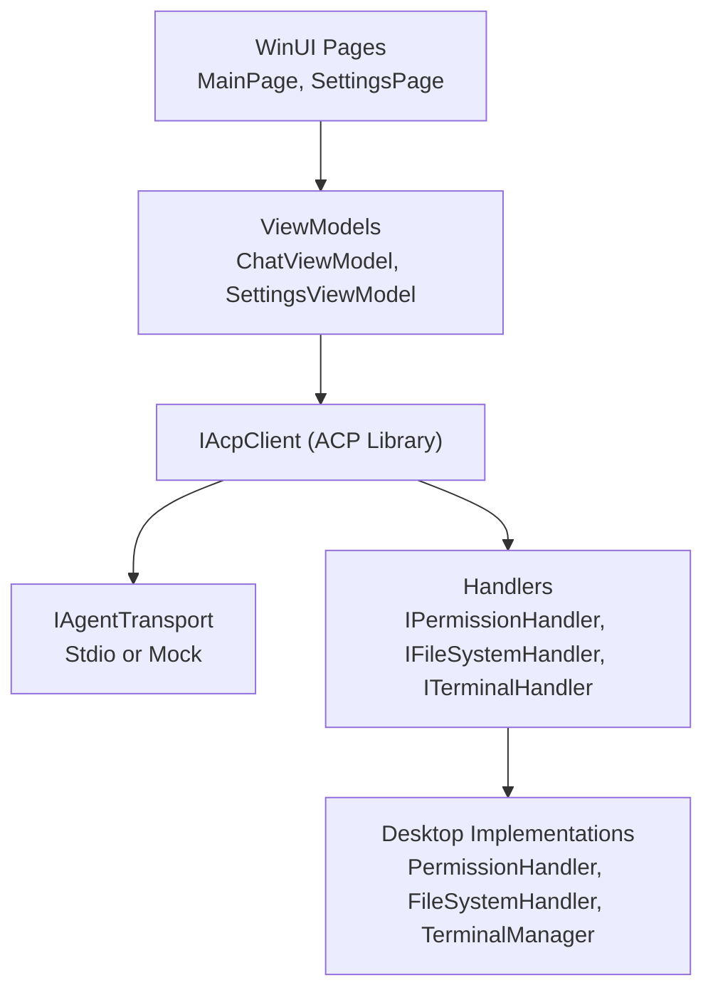
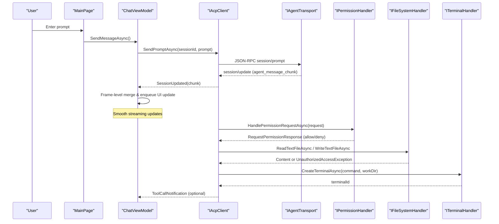
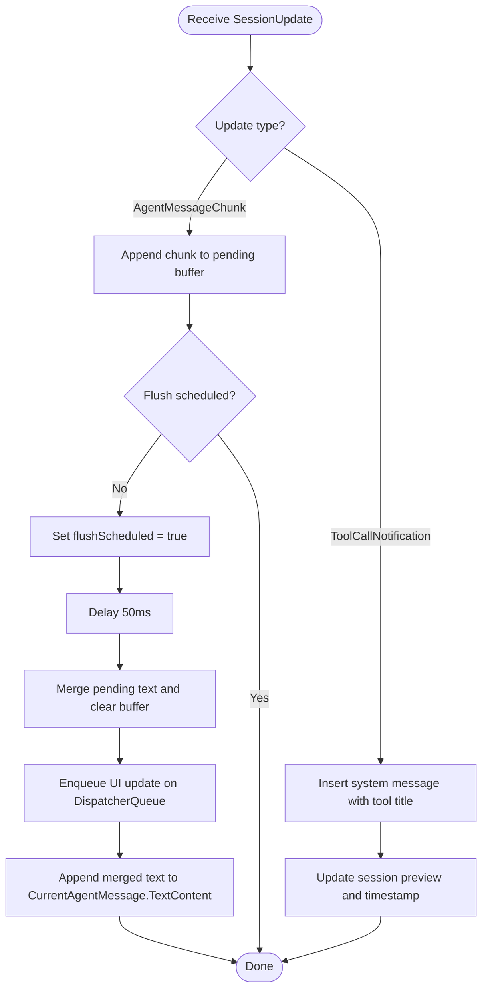
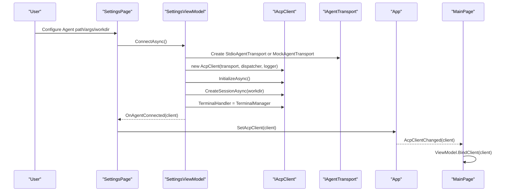
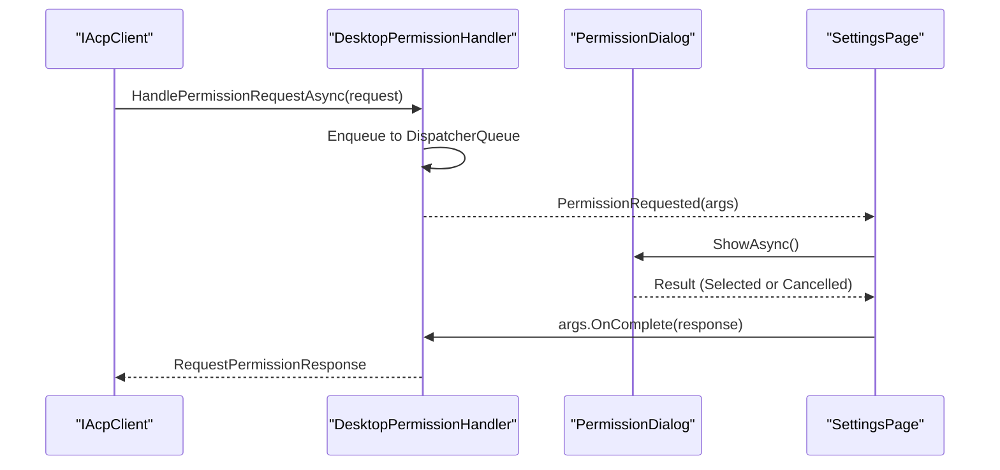
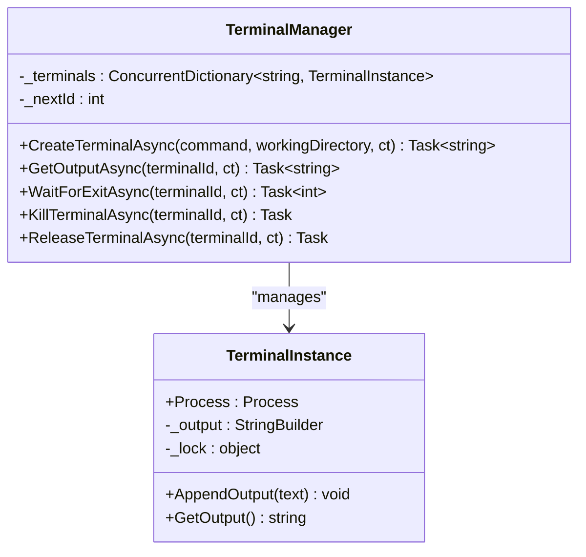
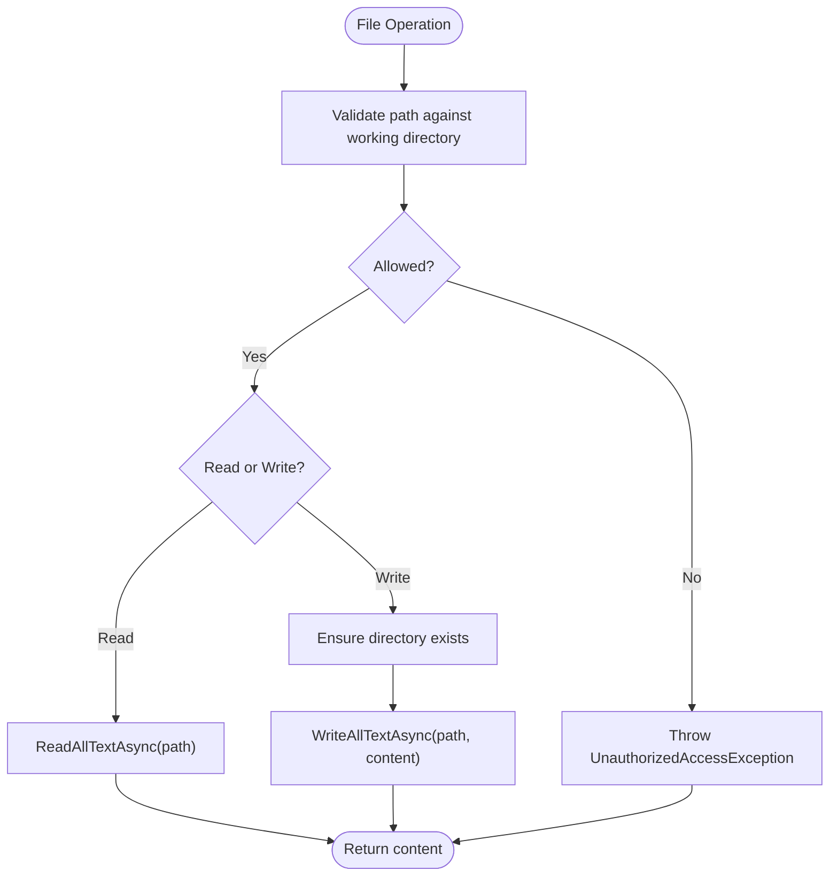
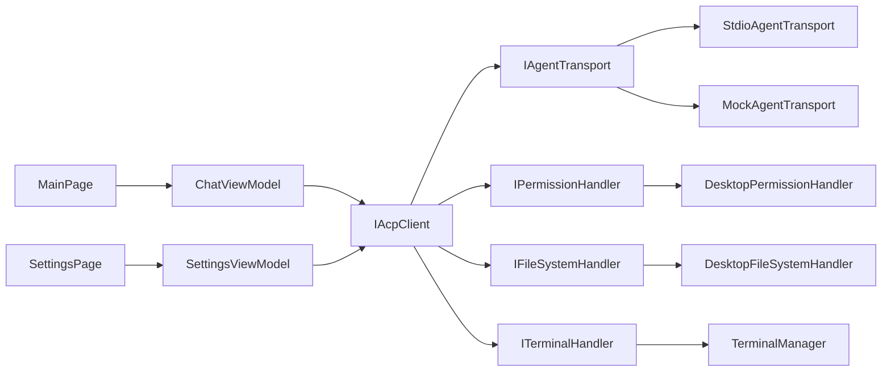

# Core Features

<cite>
**Referenced Files in This Document**
- [README.md](file://README.md)
- [App.xaml.cs](file://Agentic.Desktop/App.xaml.cs)
- [MainWindow.xaml.cs](file://Agentic.Desktop/MainWindow.xaml.cs)
- [MainPage.xaml.cs](file://Agentic.Desktop/MainPage.xaml.cs)
- [SettingsPage.xaml.cs](file://Agentic.Desktop/SettingsPage.xaml.cs)
- [SettingsViewModel.cs](file://Agentic.Desktop/ViewModels/SettingsViewModel.cs)
- [ChatViewModel.cs](file://Agentic.Desktop/ViewModels/ChatViewModel.cs)
- [ChatMessage.cs](file://Agentic.Desktop/ViewModels/Messages/ChatMessage.cs)
- [ChatSession.cs](file://Agentic.Desktop/ViewModels/Messages/ChatSession.cs)
- [TerminalManager.cs](file://Agentic.Desktop/Services/TerminalManager.cs)
- [PermissionHandler.cs](file://Agentic.Desktop/Services/PermissionHandler.cs)
- [FileSystemHandler.cs](file://Agentic.Desktop/Services/FileSystemHandler.cs)
- [MarkdownHelper.cs](file://Agentic.Desktop/Services/MarkdownHelper.cs)
- [MockAgentTransport.cs](file://Agentic.Desktop/Mocks/MockAgentTransport.cs)
- [LocalizationService.cs](file://Agentic.Desktop/Services/LocalizationService.cs)
</cite>

## Table of Contents
1. Introduction
2. Project Structure
3. Core Components
4. Architecture Overview
5. Detailed Component Analysis
6. Dependency Analysis
7. Performance Considerations
8. Troubleshooting Guide
9. Conclusion

## Introduction
This document explains Agentic.Desktop’s core features that enable a seamless agent interaction experience:
- Real-time chat interface with streaming message updates and Markdown rendering support
- Agent connection management through stdio transport (with a built-in mock for development)
- Interactive permission system with confirmation dialogs
- Concurrent terminal session management
- Secure file system access control

These features are orchestrated via the ACP protocol using an IAcpClient abstraction, enabling both real agents and a mock transport to provide consistent behavior.

## Project Structure
The application follows MVVM with WinUI 3 views, CommunityToolkit.Mvvm view models, and service abstractions for cross-cutting concerns like permissions, file system access, and terminal sessions. The README outlines the feature set and architecture overview.

**Diagram sources**
- [README.md](file://README.md)
- [App.xaml.cs](file://Agentic.Desktop/App.xaml.cs)
- [MainWindow.xaml.cs](file://Agentic.Desktop/MainWindow.xaml.cs)
- [MainPage.xaml.cs](file://Agentic.Desktop/MainPage.xaml.cs)
- [SettingsPage.xaml.cs](file://Agentic.Desktop/SettingsPage.xaml.cs)
- [SettingsViewModel.cs](file://Agentic.Desktop/ViewModels/SettingsViewModel.cs)
- [ChatViewModel.cs](file://Agentic.Desktop/ViewModels/ChatViewModel.cs)
- [TerminalManager.cs](file://Agentic.Desktop/Services/TerminalManager.cs)
- [PermissionHandler.cs](file://Agentic.Desktop/Services/PermissionHandler.cs)
- [FileSystemHandler.cs](file://Agentic.Desktop/Services/FileSystemHandler.cs)
- [MockAgentTransport.cs](file://Agentic.Desktop/Mocks/MockAgentTransport.cs)

**Section sources**
- [README.md](file://README.md)

## Core Components
- Chat interface and streaming updates: ChatViewModel manages messages, streaming chunks, and frame-level merging for smooth UI updates.
- Agent connection: SettingsViewModel initializes IAcpClient with either StdioAgentTransport or MockAgentTransport, sets up handlers, and notifies the UI.
- Permissions: DesktopPermissionHandler raises events to show PermissionDialog; user choices return RequestPermissionResponse.
- Terminal sessions: TerminalManager creates and manages multiple shell processes, reading stdout/stderr concurrently.
- File system access: DesktopFileSystemHandler enforces working directory scoping and validates paths before read/write operations.
- Markdown rendering: MarkdownHelper converts Markdown to HTML or plain text; current UI displays raw text but is ready for WebView2 integration.

**Section sources**
- [ChatViewModel.cs](file://Agentic.Desktop/ViewModels/ChatViewModel.cs)
- [SettingsViewModel.cs](file://Agentic.Desktop/ViewModels/SettingsViewModel.cs)
- [PermissionHandler.cs](file://Agentic.Desktop/Services/PermissionHandler.cs)
- [TerminalManager.cs](file://Agentic.Desktop/Services/TerminalManager.cs)
- [FileSystemHandler.cs](file://Agentic.Desktop/Services/FileSystemHandler.cs)
- [MarkdownHelper.cs](file://Agentic.Desktop/Services/MarkdownHelper.cs)

## Architecture Overview
The app uses IAcpClient as the central communication layer. Connection setup wires handlers for permissions, file system, and terminals. Streaming updates flow from the agent through AcpClient into ChatViewModel, which batches UI updates for performance.

**Diagram sources**
- [MainPage.xaml.cs](file://Agentic.Desktop/MainPage.xaml.cs)
- [ChatViewModel.cs](file://Agentic.Desktop/ViewModels/ChatViewModel.cs)
- [SettingsViewModel.cs](file://Agentic.Desktop/ViewModels/SettingsViewModel.cs)
- [PermissionHandler.cs](file://Agentic.Desktop/Services/PermissionHandler.cs)
- [FileSystemHandler.cs](file://Agentic.Desktop/Services/FileSystemHandler.cs)
- [TerminalManager.cs](file://Agentic.Desktop/Services/TerminalManager.cs)
- [MockAgentTransport.cs](file://Agentic.Desktop/Mocks/MockAgentTransport.cs)

## Detailed Component Analysis

### Real-Time Chat Interface with Streaming Updates and Markdown Rendering
- Message model: ChatMessage holds role, timestamp, streaming state, and text content.
- Session model: ChatSession maintains a collection of messages and metadata (title, preview).
- Streaming logic: ChatViewModel subscribes to AcpClient.SessionUpdated, accumulates text chunks, and flushes them on a short delay to reduce UI churn. It also handles tool call notifications by inserting system messages and updating session previews.
- Markdown: MarkdownHelper provides ToHtml and ToPlainText conversions; current UI shows raw text, with future WebView2 rendering planned.

**Diagram sources**
- [ChatViewModel.cs](file://Agentic.Desktop/ViewModels/ChatViewModel.cs)
- [ChatMessage.cs](file://Agentic.Desktop/ViewModels/Messages/ChatMessage.cs)
- [ChatSession.cs](file://Agentic.Desktop/ViewModels/Messages/ChatSession.cs)
- [MarkdownHelper.cs](file://Agentic.Desktop/Services/MarkdownHelper.cs)

**Section sources**
- [ChatViewModel.cs](file://Agentic.Desktop/ViewModels/ChatViewModel.cs)
- [ChatMessage.cs](file://Agentic.Desktop/ViewModels/Messages/ChatMessage.cs)
- [ChatSession.cs](file://Agentic.Desktop/ViewModels/Messages/ChatSession.cs)
- [MarkdownHelper.cs](file://Agentic.Desktop/Services/MarkdownHelper.cs)

### Agent Connection Management Through stdio Transport
- Connection lifecycle: SettingsViewModel constructs IAcpClient with either StdioAgentTransport or MockAgentTransport, initializes it, creates a session, and wires TerminalHandler.
- Global client sharing: App.SetAcpClient publishes the connected client; MainPage binds to it and updates ChatViewModel accordingly.
- Status updates: MainWindow.UpdateConnectionStatus reflects Disconnected/Connecting/Connected states in the title bar.

**Diagram sources**
- [SettingsViewModel.cs](file://Agentic.Desktop/ViewModels/SettingsViewModel.cs)
- [SettingsPage.xaml.cs](file://Agentic.Desktop/SettingsPage.xaml.cs)
- [App.xaml.cs](file://Agentic.Desktop/App.xaml.cs)
- [MainWindow.xaml.cs](file://Agentic.Desktop/MainWindow.xaml.cs)
- [MainPage.xaml.cs](file://Agentic.Desktop/MainPage.xaml.cs)
- [MockAgentTransport.cs](file://Agentic.Desktop/Mocks/MockAgentTransport.cs)

**Section sources**
- [SettingsViewModel.cs](file://Agentic.Desktop/ViewModels/SettingsViewModel.cs)
- [SettingsPage.xaml.cs](file://Agentic.Desktop/SettingsPage.xaml.cs)
- [App.xaml.cs](file://Agentic.Desktop/App.xaml.cs)
- [MainWindow.xaml.cs](file://Agentic.Desktop/MainWindow.xaml.cs)
- [MainPage.xaml.cs](file://Agentic.Desktop/MainPage.xaml.cs)
- [MockAgentTransport.cs](file://Agentic.Desktop/Mocks/MockAgentTransport.cs)

### Interactive Permission System with Confirmation Dialogs
- Permission flow: DesktopPermissionHandler.HandlePermissionRequestAsync dispatches to UI thread and raises PermissionRequested event.
- Dialog handling: PermissionDialog shows options and returns RequestPermissionResponse based on user selection or cancellation.
- Integration: SettingsPage wires the handler to the AcpClient so agent requests trigger the dialog.

**Diagram sources**
- [PermissionHandler.cs](file://Agentic.Desktop/Services/PermissionHandler.cs)
- [SettingsPage.xaml.cs](file://Agentic.Desktop/SettingsPage.xaml.cs)

**Section sources**
- [PermissionHandler.cs](file://Agentic.Desktop/Services/PermissionHandler.cs)
- [SettingsPage.xaml.cs](file://Agentic.Desktop/SettingsPage.xaml.cs)

### Concurrent Terminal Session Management
- Process creation: TerminalManager.CreateTerminalAsync spawns cmd.exe or sh depending on OS, redirects stdin/stdout/stderr, and runs background tasks to read output lines.
- Output buffering: TerminalInstance buffers output with a lock to ensure thread safety.
- Lifecycle: GetOutputAsync, WaitForExitAsync, KillTerminalAsync, ReleaseTerminalAsync manage concurrent sessions; Dispose ensures cleanup.

**Diagram sources**
- [TerminalManager.cs](file://Agentic.Desktop/Services/TerminalManager.cs)

**Section sources**
- [TerminalManager.cs](file://Agentic.Desktop/Services/TerminalManager.cs)

### Secure File System Access Control
- Path validation: DesktopFileSystemHandler.ValidatePath ensures requested paths resolve within the configured working directory.
- Operations: ReadTextFileAsync and WriteTextFileAsync enforce validation and create directories as needed.
- Error handling: UnauthorizedAccessException thrown when path escapes sandbox.

**Diagram sources**
- [FileSystemHandler.cs](file://Agentic.Desktop/Services/FileSystemHandler.cs)

**Section sources**
- [FileSystemHandler.cs](file://Agentic.Desktop/Services/FileSystemHandler.cs)

### Configuration Options Available to Users
- Agent configuration:
  - Agent path: Executable path for ACP-compatible agent; leave empty to use MockAgentTransport.
  - Agent arguments: Optional startup parameters passed to the agent process.
  - Working directory: Base directory for file operations and session context.
- Connection controls:
  - Connect/Disconnect buttons to manage IAcpClient lifecycle.
  - Status indicators reflecting Disconnected/Connecting/Connected states.
- Localization:
  - Strings loaded via LocalizationService from .resw files.

**Section sources**
- [SettingsViewModel.cs](file://Agentic.Desktop/ViewModels/SettingsViewModel.cs)
- [SettingsPage.xaml.cs](file://Agentic.Desktop/SettingsPage.xaml.cs)
- [LocalizationService.cs](file://Agentic.Desktop/Services/LocalizationService.cs)

### Integration Patterns With the Underlying ACP Protocol
- Transport abstraction: IAcpClient communicates via IAgentTransport; StdioAgentTransport sends JSON-RPC over stdio, while MockAgentTransport simulates responses for development.
- Session management: AcpClient.InitializeAsync establishes capabilities and agent info; CreateSessionAsync sets the working directory context.
- Event-driven updates: AcpClient.SessionUpdated emits AgentMessageChunk and ToolCallNotification, consumed by ChatViewModel.
- Handler injection: AcpClient.PermissionHandler, AcpClient.FileSystemHandler, and AcpClient.TerminalHandler are set during connection setup.

**Section sources**
- [SettingsViewModel.cs](file://Agentic.Desktop/ViewModels/SettingsViewModel.cs)
- [MockAgentTransport.cs](file://Agentic.Desktop/Mocks/MockAgentTransport.cs)
- [ChatViewModel.cs](file://Agentic.Desktop/ViewModels/ChatViewModel.cs)

## Dependency Analysis
- ViewModels depend on IAcpClient and services for permissions, file system, and terminals.
- UI pages subscribe to global App events to react to connection changes.
- MockAgentTransport decouples UI development from real agent dependencies.

**Diagram sources**
- [MainPage.xaml.cs](file://Agentic.Desktop/MainPage.xaml.cs)
- [SettingsPage.xaml.cs](file://Agentic.Desktop/SettingsPage.xaml.cs)
- [ChatViewModel.cs](file://Agentic.Desktop/ViewModels/ChatViewModel.cs)
- [SettingsViewModel.cs](file://Agentic.Desktop/ViewModels/SettingsViewModel.cs)
- [MockAgentTransport.cs](file://Agentic.Desktop/Mocks/MockAgentTransport.cs)
- [PermissionHandler.cs](file://Agentic.Desktop/Services/PermissionHandler.cs)
- [FileSystemHandler.cs](file://Agentic.Desktop/Services/FileSystemHandler.cs)
- [TerminalManager.cs](file://Agentic.Desktop/Services/TerminalManager.cs)

**Section sources**
- [MainPage.xaml.cs](file://Agentic.Desktop/MainPage.xaml.cs)
- [SettingsPage.xaml.cs](file://Agentic.Desktop/SettingsPage.xaml.cs)
- [ChatViewModel.cs](file://Agentic.Desktop/ViewModels/ChatViewModel.cs)
- [SettingsViewModel.cs](file://Agentic.Desktop/ViewModels/SettingsViewModel.cs)
- [MockAgentTransport.cs](file://Agentic.Desktop/Mocks/MockAgentTransport.cs)
- [PermissionHandler.cs](file://Agentic.Desktop/Services/PermissionHandler.cs)
- [FileSystemHandler.cs](file://Agentic.Desktop/Services/FileSystemHandler.cs)
- [TerminalManager.cs](file://Agentic.Desktop/Services/TerminalManager.cs)

## Performance Considerations
- Frame-level merging: ChatViewModel batches incoming text chunks with a 50ms delay to minimize UI updates and avoid excessive reflows.
- UI thread marshalling: All UI updates are enqueued via DispatcherQueue to prevent cross-thread exceptions and maintain responsiveness.
- Memory management:
  - TerminalManager buffers output per session; long-running sessions should be released via ReleaseTerminalAsync to free resources.
  - Dispose pattern ensures processes are killed and handles released.
- Streaming cancellation: ChatViewModel supports canceling ongoing prompts to stop memory growth and free CPU.

[No sources needed since this section provides general guidance]

## Troubleshooting Guide
- No agent response:
  - Verify IAcpClient is connected and CurrentSessionId is set.
  - Check logs via App.LoggerFactory and ensure transport is running.
- Permission dialog not appearing:
  - Confirm DesktopPermissionHandler is assigned to AcpClient.PermissionHandler.
  - Ensure UI thread dispatcher is available via App.DispatcherQueue.
- File access denied:
  - Ensure requested path resolves within the configured working directory.
  - Review DesktopFileSystemHandler.ValidatePath behavior.
- Terminal output missing:
  - Verify RedirectStandardInput/Output/Error are enabled and background readers are running.
  - Use GetOutputAsync to inspect buffered output; check process exit codes.
- UI freezes during streaming:
  - Ensure updates are enqueued on DispatcherQueue and frame-level merging is active.
  - Avoid heavy processing on the UI thread.

**Section sources**
- [App.xaml.cs](file://Agentic.Desktop/App.xaml.cs)
- [SettingsPage.xaml.cs](file://Agentic.Desktop/SettingsPage.xaml.cs)
- [PermissionHandler.cs](file://Agentic.Desktop/Services/PermissionHandler.cs)
- [FileSystemHandler.cs](file://Agentic.Desktop/Services/FileSystemHandler.cs)
- [TerminalManager.cs](file://Agentic.Desktop/Services/TerminalManager.cs)
- [ChatViewModel.cs](file://Agentic.Desktop/ViewModels/ChatViewModel.cs)

## Conclusion
Agentic.Desktop integrates a responsive chat interface, robust agent connectivity, interactive permissions, concurrent terminal sessions, and secure file system access into a cohesive ACP-based desktop client. By leveraging frame-level merging, proper UI threading, and careful resource management, it delivers a smooth and secure agent interaction experience suitable for both development and production scenarios.