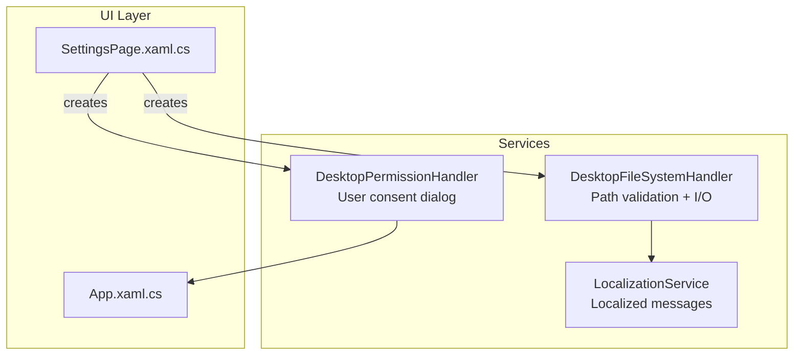
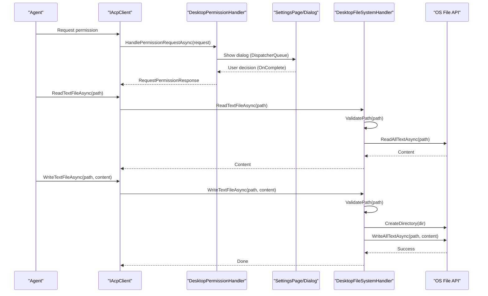
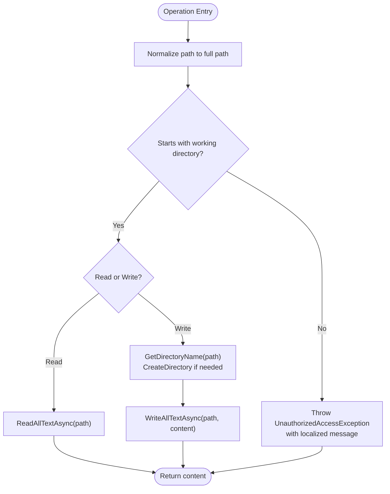
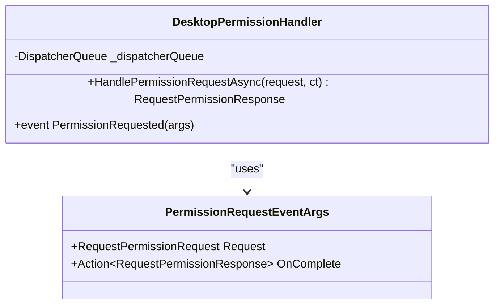
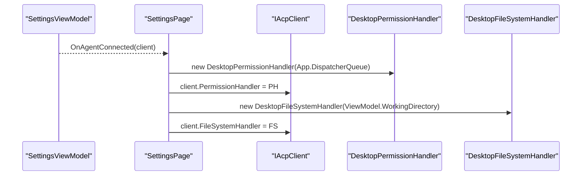
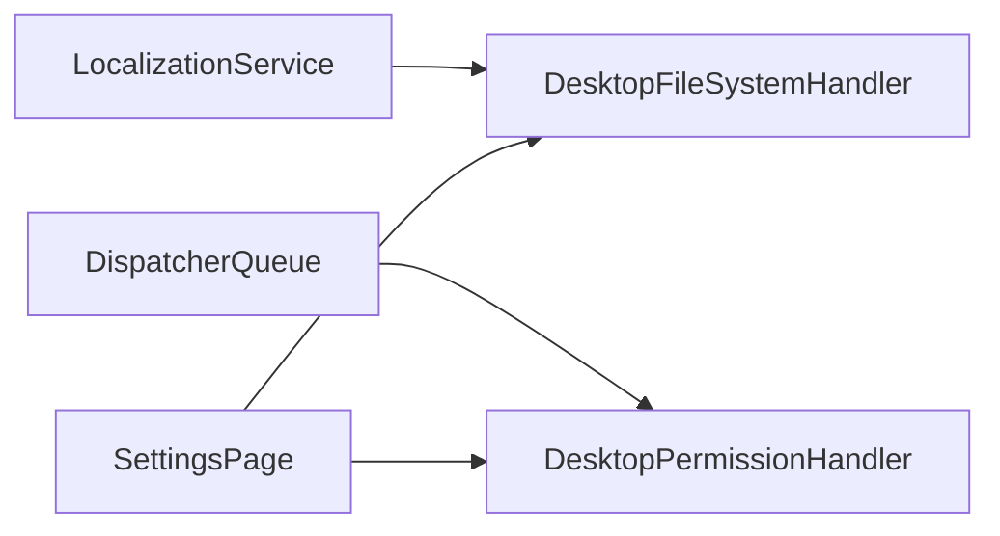

# File System Security

<cite>
**Referenced Files in This Document**
- [FileSystemHandler.cs](file://Agentic.Desktop/Services/FileSystemHandler.cs)
- [PermissionHandler.cs](file://Agentic.Desktop/Services/PermissionHandler.cs)
- [LocalizationService.cs](file://Agentic.Desktop/Services/LocalizationService.cs)
- [SettingsPage.xaml.cs](file://Agentic.Desktop/SettingsPage.xaml.cs)
- [App.xaml.cs](file://Agentic.Desktop/App.xaml.cs)
</cite>

## Table of Contents
1. [Introduction](#introduction)
2. [Project Structure](#project-structure)
3. [Core Components](#core-components)
4. [Architecture Overview](#architecture-overview)
5. [Detailed Component Analysis](#detailed-component-analysis)
6. [Dependency Analysis](#dependency-analysis)
7. [Performance Considerations](#performance-considerations)
8. [Troubleshooting Guide](#troubleshooting-guide)
9. [Conclusion](#conclusion)
10. [Appendices](#appendices)

## Introduction
This document explains the file system security features implemented in the desktop application, focusing on the FileSystemHandler service that provides secure file operations with path validation and working directory isolation. It details the security model including path traversal prevention, allowed operations filtering, sandboxing mechanisms, validation rules for file paths, supported operations (read, write), error handling strategies, and integration with the permission system. Guidance is provided for extending capabilities while maintaining security boundaries and testing approaches for file operation scenarios.

## Project Structure
The file system security implementation resides under Services and integrates with UI components during agent connection setup:
- DesktopFileSystemHandler enforces a sandboxed working directory and validates all file paths before performing read/write operations.
- DesktopPermissionHandler mediates user consent for privileged operations via a UI dialog.
- SettingsPage wires up both handlers to the client when an agent connects.
- LocalizationService supplies localized messages for errors such as access denied.

**Diagram sources**
- [SettingsPage.xaml.cs:22-37](file://Agentic.Desktop/SettingsPage.xaml.cs#L22-L37)
- [App.xaml.cs:73-75](file://Agentic.Desktop/App.xaml.cs#L73-L75)
- [FileSystemHandler.cs:8-41](file://Agentic.Desktop/Services/FileSystemHandler.cs#L8-L41)
- [PermissionHandler.cs:11-44](file://Agentic.Desktop/Services/PermissionHandler.cs#L11-L44)
- [LocalizationService.cs:8-22](file://Agentic.Desktop/Services/LocalizationService.cs#L8-L22)

**Section sources**
- [SettingsPage.xaml.cs:22-37](file://Agentic.Desktop/SettingsPage.xaml.cs#L22-L37)
- [App.xaml.cs:73-75](file://Agentic.Desktop/App.xaml.cs#L73-L75)
- [FileSystemHandler.cs:8-41](file://Agentic.Desktop/Services/FileSystemHandler.cs#L8-L41)
- [PermissionHandler.cs:11-44](file://Agentic.Desktop/Services/PermissionHandler.cs#L11-L44)
- [LocalizationService.cs:8-22](file://Agentic.Desktop/Services/LocalizationService.cs#L8-L22)

## Core Components
- DesktopFileSystemHandler: Implements secure file operations by validating every requested path against a configured working directory. Supports read and write text files; delete is not exposed.
- DesktopPermissionHandler: Bridges agent permission requests to the UI, showing a dialog and returning the user’s decision.
- LocalizationService: Provides localized strings used in error messages, ensuring consistent user-facing feedback.

Key responsibilities:
- Enforce working directory sandboxing for all file operations.
- Normalize and validate paths to prevent traversal attacks.
- Ensure directories exist before writing content.
- Surface localized error messages on unauthorized access attempts.

**Section sources**
- [FileSystemHandler.cs:8-41](file://Agentic.Desktop/Services/FileSystemHandler.cs#L8-L41)
- [PermissionHandler.cs:11-44](file://Agentic.Desktop/Services/PermissionHandler.cs#L11-L44)
- [LocalizationService.cs:8-22](file://Agentic.Desktop/Services/LocalizationService.cs#L8-L22)

## Architecture Overview
The architecture isolates file system access behind a validated handler and couples it with a permission mediation layer. When an agent connects, the settings page configures both handlers on the client instance. All file operations flow through the filesystem handler, which enforces path validation before delegating to the OS file APIs. Permission requests are mediated via the permission handler, which marshals to the UI thread and returns a response after user interaction.

**Diagram sources**
- [SettingsPage.xaml.cs:22-37](file://Agentic.Desktop/SettingsPage.xaml.cs#L22-L37)
- [PermissionHandler.cs:26-44](file://Agentic.Desktop/Services/PermissionHandler.cs#L26-L44)
- [FileSystemHandler.cs:17-30](file://Agentic.Desktop/Services/FileSystemHandler.cs#L17-L30)

## Detailed Component Analysis

### DesktopFileSystemHandler
- Purpose: Provide secure read/write operations constrained to a working directory.
- Security model:
  - Path normalization using full path resolution.
  - Prefix check against the configured working directory to prevent traversal.
  - Case-insensitive comparison to avoid bypass via mixed casing.
- Supported operations:
  - Read text files asynchronously.
  - Write text files asynchronously, creating parent directories if needed.
- Error handling:
  - Throws UnauthorizedAccessException with a localized message when path is outside the working directory.

**Diagram sources**
- [FileSystemHandler.cs:17-30](file://Agentic.Desktop/Services/FileSystemHandler.cs#L17-L30)
- [FileSystemHandler.cs:32-40](file://Agentic.Desktop/Services/FileSystemHandler.cs#L32-L40)
- [LocalizationService.cs:20-21](file://Agentic.Desktop/Services/LocalizationService.cs#L20-L21)

**Section sources**
- [FileSystemHandler.cs:8-41](file://Agentic.Desktop/Services/FileSystemHandler.cs#L8-L41)
- [LocalizationService.cs:8-22](file://Agentic.Desktop/Services/LocalizationService.cs#L8-L22)

### DesktopPermissionHandler
- Purpose: Mediate permission requests from the agent to the UI, ensuring dialogs are shown on the UI thread.
- Behavior:
  - Wraps the request in an event and dispatches to the UI thread via DispatcherQueue.
  - Waits for the user’s decision and returns a response object.
- Integration:
  - Configured on the client instance during agent connection in the settings page.

**Diagram sources**
- [PermissionHandler.cs:11-44](file://Agentic.Desktop/Services/PermissionHandler.cs#L11-L44)
- [PermissionHandler.cs:47-51](file://Agentic.Desktop/Services/PermissionHandler.cs#L47-L51)

**Section sources**
- [PermissionHandler.cs:11-44](file://Agentic.Desktop/Services/PermissionHandler.cs#L11-L44)
- [PermissionHandler.cs:47-51](file://Agentic.Desktop/Services/PermissionHandler.cs#L47-L51)

### Integration in SettingsPage
- Wires up DesktopPermissionHandler and DesktopFileSystemHandler to the connected client.
- Uses ViewModel.WorkingDirectory to configure the filesystem sandbox boundary.
- Shows a permission dialog and passes the result back to the agent via the handler.

**Diagram sources**
- [SettingsPage.xaml.cs:22-37](file://Agentic.Desktop/SettingsPage.xaml.cs#L22-L37)

**Section sources**
- [SettingsPage.xaml.cs:22-37](file://Agentic.Desktop/SettingsPage.xaml.cs#L22-L37)

## Dependency Analysis
- DesktopFileSystemHandler depends on:
  - .NET file APIs for reading/writing.
  - LocalizationService for error messages.
- DesktopPermissionHandler depends on:
  - Microsoft.UI.Dispatching.DispatcherQueue for UI threading.
  - Permission models from Agentic.ACPLibrary.Models.
- SettingsPage orchestrates configuration of both handlers at runtime.

**Diagram sources**
- [FileSystemHandler.cs:32-40](file://Agentic.Desktop/Services/FileSystemHandler.cs#L32-L40)
- [PermissionHandler.cs:26-44](file://Agentic.Desktop/Services/PermissionHandler.cs#L26-L44)
- [SettingsPage.xaml.cs:22-37](file://Agentic.Desktop/SettingsPage.xaml.cs#L22-L37)

**Section sources**
- [FileSystemHandler.cs:32-40](file://Agentic.Desktop/Services/FileSystemHandler.cs#L32-L40)
- [PermissionHandler.cs:26-44](file://Agentic.Desktop/Services/PermissionHandler.cs#L26-L44)
- [SettingsPage.xaml.cs:22-37](file://Agentic.Desktop/SettingsPage.xaml.cs#L22-L37)

## Performance Considerations
- Asynchronous I/O: Both read and write operations use async methods to avoid blocking the UI thread.
- Directory creation: Only created when necessary during writes to minimize overhead.
- Path normalization: Performed once per operation; consider caching normalized working directory if frequently accessed.
- Cancellation support: Operations accept CancellationToken to allow cancellation of long-running I/O.

[No sources needed since this section provides general guidance]

## Troubleshooting Guide
Common issues and resolutions:
- Unauthorized access errors:
  - Cause: Attempted file path outside the configured working directory.
  - Resolution: Ensure the path resolves within the working directory; verify case sensitivity and trailing slashes.
- Missing directories on write:
  - Behavior: Parent directories are created automatically; ensure the process has write permissions to the target location.
- Permission dialog not appearing:
  - Cause: Not dispatched to UI thread or event not subscribed.
  - Resolution: Confirm DispatcherQueue usage and that SettingsPage subscribes to PermissionRequested.

Operational checks:
- Verify WorkingDirectory is set correctly in ViewModel before connecting the agent.
- Confirm that localization resources include the AccessDeniedMessage key.

**Section sources**
- [FileSystemHandler.cs:32-40](file://Agentic.Desktop/Services/FileSystemHandler.cs#L32-L40)
- [LocalizationService.cs:20-21](file://Agentic.Desktop/Services/LocalizationService.cs#L20-L21)
- [SettingsPage.xaml.cs:22-37](file://Agentic.Desktop/SettingsPage.xaml.cs#L22-L37)

## Conclusion
The file system security model centers on strict path validation and working directory sandboxing enforced by DesktopFileSystemHandler, combined with user-mediated permission handling via DesktopPermissionHandler. This design prevents path traversal, limits operations to authorized actions, and ensures clear, localized error reporting. Extending capabilities should preserve these boundaries by adding new operations through the same validation pipeline and integrating with the permission system where appropriate.

[No sources needed since this section summarizes without analyzing specific files]

## Appendices

### Security Best Practices
- Always normalize and validate paths before any file operation.
- Use a fixed working directory and reject any path not strictly within it.
- Prefer asynchronous I/O with cancellation tokens.
- Centralize error messages via localization to avoid leaking internal details.
- Require explicit user consent for sensitive operations via the permission handler.

### Extending File System Capabilities
- Add new operations (e.g., delete) only after implementing path validation identical to existing operations.
- Integrate with the permission system for operations that require user approval.
- Keep operations stateless and idempotent where possible to simplify testing and recovery.

### Testing Approaches
- Unit tests for path validation:
  - Test absolute, relative, and edge-case paths (dot segments, trailing separators).
  - Assert UnauthorizedAccessException for out-of-scope paths.
- Integration tests for I/O:
  - Mock or isolate file system calls to verify behavior without touching disk.
  - Validate directory creation and content written.
- Permission flow tests:
  - Simulate user approvals and denials to ensure correct responses returned to the agent.

[No sources needed since this section provides general guidance]