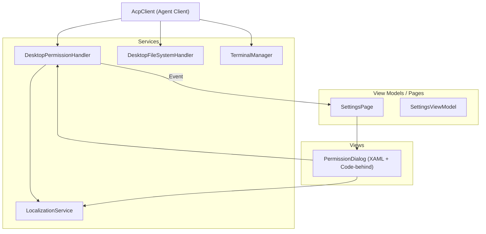
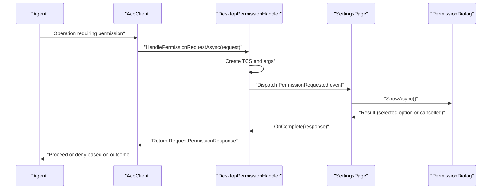
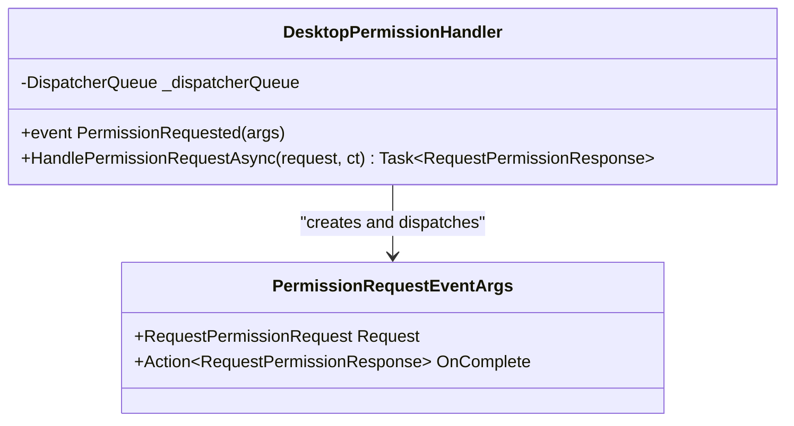
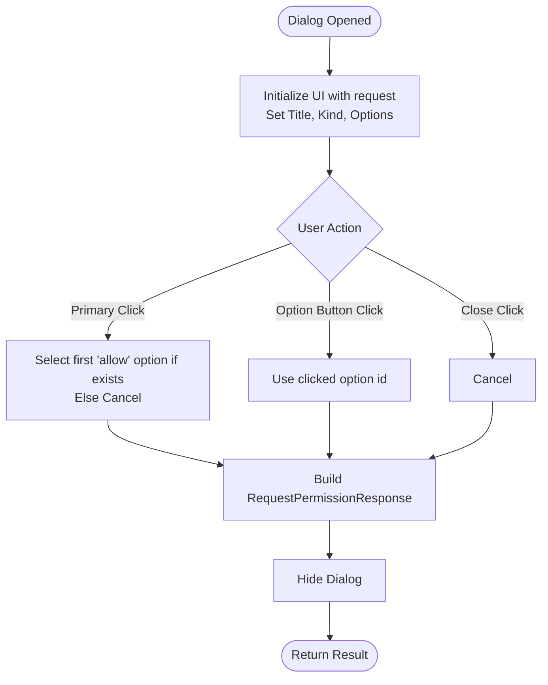
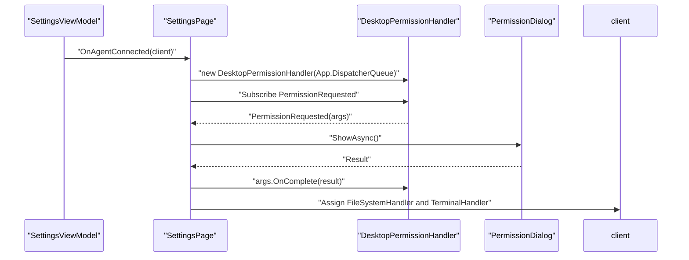
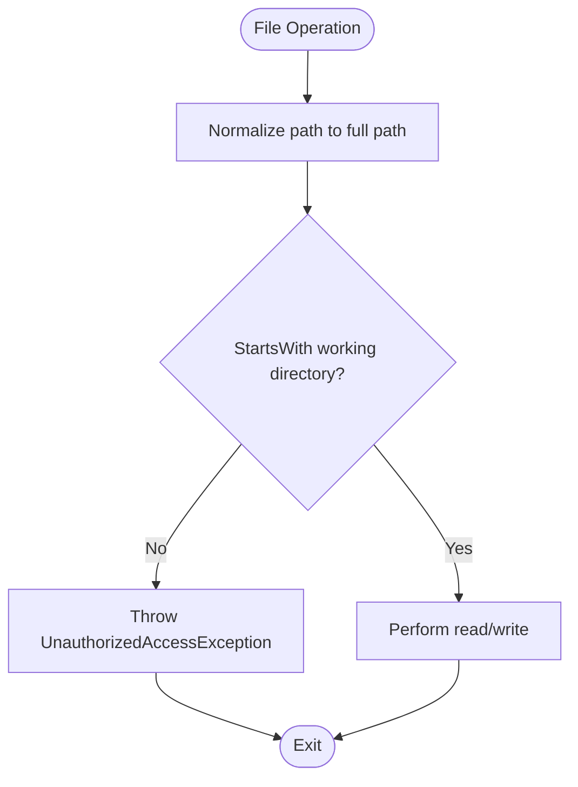
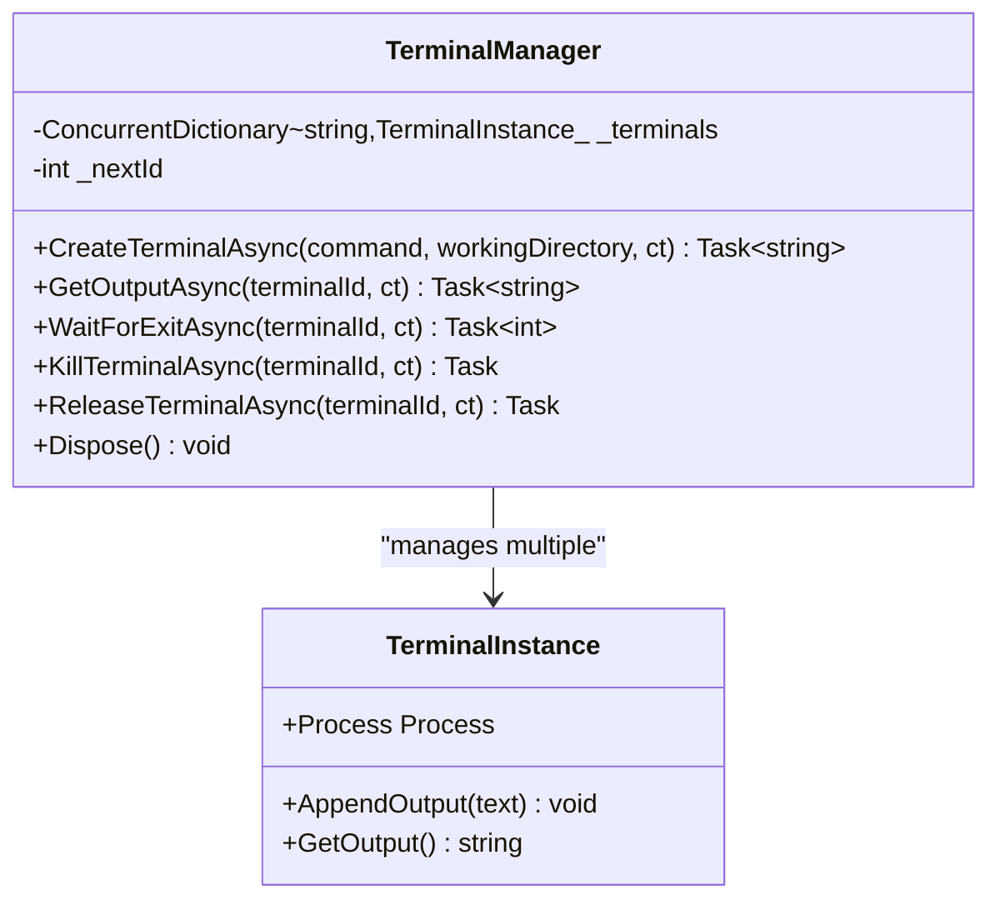
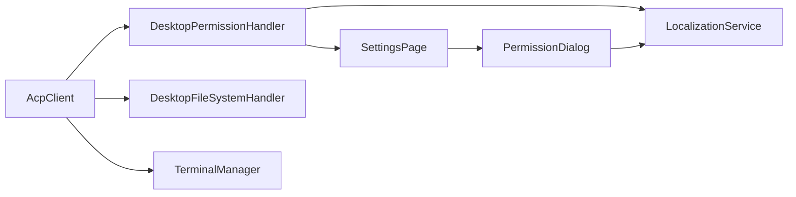

# Permission System

<cite>
**Referenced Files in This Document**
- [PermissionHandler.cs](file://Agentic.Desktop/Services/PermissionHandler.cs)
- [PermissionDialog.xaml](file://Agentic.Desktop/Views/PermissionDialog.xaml)
- [PermissionDialog.xaml.cs](file://Agentic.Desktop/Views/PermissionDialog.xaml.cs)
- [SettingsPage.xaml.cs](file://Agentic.Desktop/SettingsPage.xaml.cs)
- [FileSystemHandler.cs](file://Agentic.Desktop/Services/FileSystemHandler.cs)
- [TerminalManager.cs](file://Agentic.Desktop/Services/TerminalManager.cs)
- [LocalizationService.cs](file://Agentic.Desktop/Services/LocalizationService.cs)
- [SettingsViewModel.cs](file://Agentic.Desktop/ViewModels/SettingsViewModel.cs)
</cite>

## Table of Contents
1. [Introduction](#introduction)
2. [Project Structure](#project-structure)
3. [Core Components](#core-components)
4. [Architecture Overview](#architecture-overview)
5. [Detailed Component Analysis](#detailed-component-analysis)
6. [Dependency Analysis](#dependency-analysis)
7. [Performance Considerations](#performance-considerations)
8. [Troubleshooting Guide](#troubleshooting-guide)
9. [Conclusion](#conclusion)
10. [Appendices](#appendices)

## Introduction
This document explains the event-driven permission system used by the desktop application to mediate sensitive operations requested by an external Agent. The system ensures that potentially dangerous actions—such as file system access and terminal command execution—are explicitly approved by the user through a UI confirmation dialog before being executed. It covers:
- The permission request lifecycle from the Agent to the UI and back
- The PermissionHandler service that marshals requests to the UI thread
- The PermissionDialog UI component (XAML and code-behind)
- Integration with the MVVM pattern via SettingsPage and SettingsViewModel
- Examples of permission types, custom handlers, and programmatic granting
- Security best practices, scope limitations, and audit logging guidance
- Extensibility for new operation types and custom approval workflows

## Project Structure
The permission system spans services, views, and view models:
- Services: DesktopPermissionHandler, DesktopFileSystemHandler, TerminalManager, LocalizationService
- Views: PermissionDialog (XAML + code-behind)
- View Model integration: SettingsPage wires up the permission handler and shows the dialog on events

**Diagram sources**
- [PermissionHandler.cs:1-52](file://Agentic.Desktop/Services/PermissionHandler.cs#L1-L52)
- [PermissionDialog.xaml:1-42](file://Agentic.Desktop/Views/PermissionDialog.xaml#L1-L42)
- [PermissionDialog.xaml.cs:1-64](file://Agentic.Desktop/Views/PermissionDialog.xaml.cs#L1-L64)
- [SettingsPage.xaml.cs:1-96](file://Agentic.Desktop/SettingsPage.xaml.cs#L1-L96)
- [FileSystemHandler.cs:1-42](file://Agentic.Desktop/Services/FileSystemHandler.cs#L1-L42)
- [TerminalManager.cs:1-161](file://Agentic.Desktop/Services/TerminalManager.cs#L1-L161)
- [LocalizationService.cs:1-23](file://Agentic.Desktop/Services/LocalizationService.cs#L1-L23)
- [SettingsViewModel.cs:1-162](file://Agentic.Desktop/ViewModels/SettingsViewModel.cs#L1-L162)

**Section sources**
- [PermissionHandler.cs:1-52](file://Agentic.Desktop/Services/PermissionHandler.cs#L1-L52)
- [PermissionDialog.xaml:1-42](file://Agentic.Desktop/Views/PermissionDialog.xaml#L1-L42)
- [PermissionDialog.xaml.cs:1-64](file://Agentic.Desktop/Views/PermissionDialog.xaml.cs#L1-L64)
- [SettingsPage.xaml.cs:1-96](file://Agentic.Desktop/SettingsPage.xaml.cs#L1-L96)
- [FileSystemHandler.cs:1-42](file://Agentic.Desktop/Services/FileSystemHandler.cs#L1-L42)
- [TerminalManager.cs:1-161](file://Agentic.Desktop/Services/TerminalManager.cs#L1-L161)
- [LocalizationService.cs:1-23](file://Agentic.Desktop/Services/LocalizationService.cs#L1-L23)
- [SettingsViewModel.cs:1-162](file://Agentic.Desktop/ViewModels/SettingsViewModel.cs#L1-L162)

## Core Components
- DesktopPermissionHandler: Implements the permission handler interface and raises an event when the Agent requests permission. It marshals the call to the UI thread using DispatcherQueue and awaits user decision.
- PermissionDialog: A ContentDialog that displays tool call details and presents selectable options. It returns a RequestPermissionResponse based on user selection or cancellation.
- SettingsPage: Wires up the permission handler to the AcpClient, subscribes to PermissionRequested, and shows PermissionDialog. It also sets FileSystemHandler and TerminalHandler on the client.
- DesktopFileSystemHandler: Enforces path scoping to a working directory and throws UnauthorizedAccessException for out-of-scope paths.
- TerminalManager: Manages terminal process instances, output streaming, and lifecycle control.
- LocalizationService: Provides localized strings for messages and prompts.

Key responsibilities:
- Event-driven mediation between Agent and UI
- Thread-safe UI invocation
- Secure defaults and strict scope enforcement
- Clear user feedback and choice presentation

**Section sources**
- [PermissionHandler.cs:1-52](file://Agentic.Desktop/Services/PermissionHandler.cs#L1-L52)
- [PermissionDialog.xaml:1-42](file://Agentic.Desktop/Views/PermissionDialog.xaml#L1-L42)
- [PermissionDialog.xaml.cs:1-64](file://Agentic.Desktop/Views/PermissionDialog.xaml.cs#L1-L64)
- [SettingsPage.xaml.cs:1-96](file://Agentic.Desktop/SettingsPage.xaml.cs#L1-L96)
- [FileSystemHandler.cs:1-42](file://Agentic.Desktop/Services/FileSystemHandler.cs#L1-L42)
- [TerminalManager.cs:1-161](file://Agentic.Desktop/Services/TerminalManager.cs#L1-L161)
- [LocalizationService.cs:1-23](file://Agentic.Desktop/Services/LocalizationService.cs#L1-L23)

## Architecture Overview
The permission flow is event-driven and UI-bound:
1. The Agent calls into AcpClient methods that require permissions.
2. AcpClient invokes the registered IPermissionHandler.HandlePermissionRequestAsync.
3. DesktopPermissionHandler creates a task completion source and dispatches a PermissionRequested event to the UI thread.
4. SettingsPage receives the event, constructs PermissionDialog, shows it modally, and waits for Result.
5. PermissionDialog returns a RequestPermissionResponse based on user action.
6. DesktopPermissionHandler completes the awaited task with the response.
7. AcpClient proceeds or denies the operation based on the outcome.

**Diagram sources**
- [PermissionHandler.cs:26-44](file://Agentic.Desktop/Services/PermissionHandler.cs#L26-L44)
- [SettingsPage.xaml.cs:22-34](file://Agentic.Desktop/SettingsPage.xaml.cs#L22-L34)
- [PermissionDialog.xaml.cs:15-50](file://Agentic.Desktop/Views/PermissionDialog.xaml.cs#L15-L50)

## Detailed Component Analysis

### DesktopPermissionHandler
Responsibilities:
- Implement IPermissionHandler
- Raise PermissionRequested event on the UI thread
- Await user decision and return RequestPermissionResponse

Key behaviors:
- Uses DispatcherQueue.TryEnqueue to marshal to UI thread
- Creates a TaskCompletionSource to bridge async UI interaction with synchronous await
- Wraps the request and OnComplete callback in PermissionRequestEventArgs

**Diagram sources**
- [PermissionHandler.cs:11-51](file://Agentic.Desktop/Services/PermissionHandler.cs#L11-L51)

**Section sources**
- [PermissionHandler.cs:1-52](file://Agentic.Desktop/Services/PermissionHandler.cs#L1-L52)

### PermissionDialog (XAML and Code-behind)
Responsibilities:
- Display tool call title and kind
- Render dynamic options via ItemsRepeater
- Handle PrimaryButtonClick and CloseButtonClick
- Return RequestPermissionResponse based on selected option or cancellation

UI elements:
- TextBlock for description
- Border container for ToolTitle and ToolKind
- ItemsRepeater bound to PermissionOption list
- Buttons generated per option with click handlers

Code-behind logic:
- Initializes UI with request data
- Sets default primary behavior to first allow option if present
- Closes and returns result on option click or cancel

**Diagram sources**
- [PermissionDialog.xaml:1-42](file://Agentic.Desktop/Views/PermissionDialog.xaml#L1-L42)
- [PermissionDialog.xaml.cs:15-62](file://Agentic.Desktop/Views/PermissionDialog.xaml.cs#L15-L62)

**Section sources**
- [PermissionDialog.xaml:1-42](file://Agentic.Desktop/Views/PermissionDialog.xaml#L1-L42)
- [PermissionDialog.xaml.cs:1-64](file://Agentic.Desktop/Views/PermissionDialog.xaml.cs#L1-L64)

### SettingsPage Integration (MVVM Wiring)
Responsibilities:
- Create DesktopPermissionHandler with App.DispatcherQueue
- Subscribe to PermissionRequested event
- Show PermissionDialog modally and pass result back via OnComplete
- Assign FileSystemHandler and TerminalHandler to AcpClient

Integration points:
- ViewModel exposes connection state and callbacks
- Page updates UI status and binds commands to ViewModel
- Global client instance is set for other pages to use

**Diagram sources**
- [SettingsPage.xaml.cs:20-43](file://Agentic.Desktop/SettingsPage.xaml.cs#L20-L43)
- [PermissionHandler.cs:26-44](file://Agentic.Desktop/Services/PermissionHandler.cs#L26-L44)
- [PermissionDialog.xaml.cs:15-50](file://Agentic.Desktop/Views/PermissionDialog.xaml.cs#L15-L50)

**Section sources**
- [SettingsPage.xaml.cs:1-96](file://Agentic.Desktop/SettingsPage.xaml.cs#L1-L96)
- [SettingsViewModel.cs:1-162](file://Agentic.Desktop/ViewModels/SettingsViewModel.cs#L1-L162)

### DesktopFileSystemHandler
Responsibilities:
- Validate all file paths against a configured working directory
- Read and write text files asynchronously
- Throw UnauthorizedAccessException for out-of-scope paths

Security characteristics:
- Path normalization and prefix check ensure containment within working directory
- Directory creation handled safely before writing

**Diagram sources**
- [FileSystemHandler.cs:17-40](file://Agentic.Desktop/Services/FileSystemHandler.cs#L17-L40)

**Section sources**
- [FileSystemHandler.cs:1-42](file://Agentic.Desktop/Services/FileSystemHandler.cs#L1-L42)

### TerminalManager
Responsibilities:
- Create and manage terminal processes (cmd.exe on Windows, /bin/sh otherwise)
- Stream stdout and stderr asynchronously
- Provide methods to get output, wait for exit, kill, release, and dispose

Operational notes:
- Processes are started with redirected streams and no window
- Output buffering uses StringBuilder with locking for thread safety
- Lifecycle management ensures resources are released even on errors

**Diagram sources**
- [TerminalManager.cs:11-160](file://Agentic.Desktop/Services/TerminalManager.cs#L11-L160)

**Section sources**
- [TerminalManager.cs:1-161](file://Agentic.Desktop/Services/TerminalManager.cs#L1-L161)

### LocalizationService
Responsibilities:
- Load localized strings from .resw resources
- Provide Get(key) and Format(key, args) helpers

Usage:
- Used across components for consistent messaging and error formatting

**Section sources**
- [LocalizationService.cs:1-23](file://Agentic.Desktop/Services/LocalizationService.cs#L1-L23)

## Dependency Analysis
Component relationships and coupling:
- DesktopPermissionHandler depends on DispatcherQueue and raises events consumed by SettingsPage
- SettingsPage orchestrates the UI flow and assigns handlers to AcpClient
- PermissionDialog depends on model types from ACPLibrary.Models
- DesktopFileSystemHandler enforces security boundaries independent of UI
- TerminalManager manages OS processes and is independent of UI
- LocalizationService is a shared utility used by multiple components

**Diagram sources**
- [PermissionHandler.cs:1-52](file://Agentic.Desktop/Services/PermissionHandler.cs#L1-L52)
- [SettingsPage.xaml.cs:20-43](file://Agentic.Desktop/SettingsPage.xaml.cs#L20-L43)
- [PermissionDialog.xaml.cs:1-64](file://Agentic.Desktop/Views/PermissionDialog.xaml.cs#L1-L64)
- [FileSystemHandler.cs:1-42](file://Agentic.Desktop/Services/FileSystemHandler.cs#L1-L42)
- [TerminalManager.cs:1-161](file://Agentic.Desktop/Services/TerminalManager.cs#L1-L161)
- [LocalizationService.cs:1-23](file://Agentic.Desktop/Services/LocalizationService.cs#L1-L23)

**Section sources**
- [PermissionHandler.cs:1-52](file://Agentic.Desktop/Services/PermissionHandler.cs#L1-L52)
- [SettingsPage.xaml.cs:1-96](file://Agentic.Desktop/SettingsPage.xaml.cs#L1-L96)
- [PermissionDialog.xaml.cs:1-64](file://Agentic.Desktop/Views/PermissionDialog.xaml.cs#L1-L64)
- [FileSystemHandler.cs:1-42](file://Agentic.Desktop/Services/FileSystemHandler.cs#L1-L42)
- [TerminalManager.cs:1-161](file://Agentic.Desktop/Services/TerminalManager.cs#L1-L161)
- [LocalizationService.cs:1-23](file://Agentic.Desktop/Services/LocalizationService.cs#L1-L23)

## Performance Considerations
- UI thread marshalling: DesktopPermissionHandler uses DispatcherQueue.TryEnqueue to avoid blocking background threads and ensure responsive UI.
- Async I/O: File operations and terminal stream reading are fully asynchronous to prevent UI freezes.
- Resource cleanup: TerminalManager disposes processes and clears internal dictionaries to avoid leaks.
- Minimal allocations: PermissionRequestEventArgs is created once per request; TaskCompletionSource bridges async UI without extra overhead.

[No sources needed since this section provides general guidance]

## Troubleshooting Guide
Common issues and resolutions:
- Permission dialog not appearing:
  - Ensure SettingsPage subscribes to PermissionRequested and shows PermissionDialog with XamlRoot set.
  - Verify App.DispatcherQueue is available and non-null.
- Out-of-scope file access errors:
  - Confirm working directory is correctly set and paths are normalized before validation.
  - UnauthorizedAccessException indicates path traversal attempts outside allowed scope.
- Terminal output missing:
  - Check that stdout/stderr readers are running and exceptions are caught gracefully.
  - Ensure process has not exited prematurely.
- Localization keys missing:
  - Verify .resw files contain required keys and that resource loader is initialized.

**Section sources**
- [SettingsPage.xaml.cs:22-34](file://Agentic.Desktop/SettingsPage.xaml.cs#L22-L34)
- [FileSystemHandler.cs:32-40](file://Agentic.Desktop/Services/FileSystemHandler.cs#L32-L40)
- [TerminalManager.cs:39-64](file://Agentic.Desktop/Services/TerminalManager.cs#L39-L64)
- [LocalizationService.cs:10-21](file://Agentic.Desktop/Services/LocalizationService.cs#L10-L21)

## Conclusion
The permission system provides a secure, user-mediated pathway for agents to perform sensitive operations. By decoupling request handling from UI rendering and enforcing strict scope limits, it balances flexibility with safety. The design supports extensibility for new permission types and custom approval workflows while maintaining clear separation of concerns and robust error handling.

[No sources needed since this section summarizes without analyzing specific files]

## Appendices

### Examples of Permission Types
- File system read/write within working directory
- Terminal command execution with scoped working directory
- Custom operations can be modeled as PermissionOption entries with distinct kinds and identifiers

[No sources needed since this section provides general guidance]

### Custom Permission Handlers
To implement a custom approval workflow:
- Create a new IPermissionHandler implementation
- Marshal requests to your preferred UI mechanism (e.g., policy engine, admin approval queue)
- Return RequestPermissionResponse with appropriate Outcome

[No sources needed since this section provides general guidance]

### Programmatic Permission Granting
- Construct a RequestPermissionResponse with Outcome.Selected(optionId) to programmatically approve an operation
- Use Outcome.Cancelled() to deny
- Integrate with existing handler by invoking OnComplete with the constructed response

[No sources needed since this section provides general guidance]

### Security Best Practices
- Always validate and normalize paths before file operations
- Restrict terminal commands to safe subsets where possible
- Log permission decisions for auditability
- Avoid exposing sensitive information in dialogs or logs

[No sources needed since this section provides general guidance]

### Audit Logging Guidance
- Record timestamp, agent identity, session id, requested operation, and decision
- Store logs securely and consider retention policies
- Include context such as tool call title and kind for traceability

[No sources needed since this section provides general guidance]

### Extending the Permission System
- Add new PermissionOption kinds and names to represent additional operations
- Update PermissionDialog templates if new visualizations are required
- Extend DesktopPermissionHandler to handle custom logic before raising events
- Integrate with policy engines or multi-step approvals as needed

[No sources needed since this section provides general guidance]