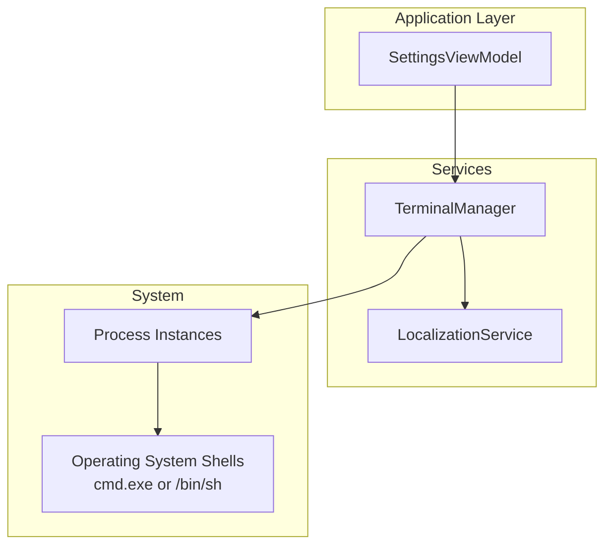
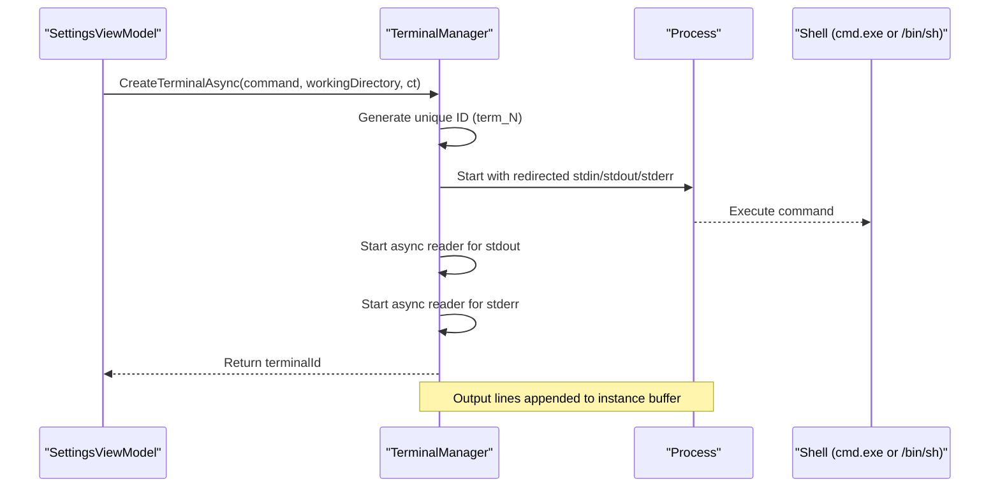
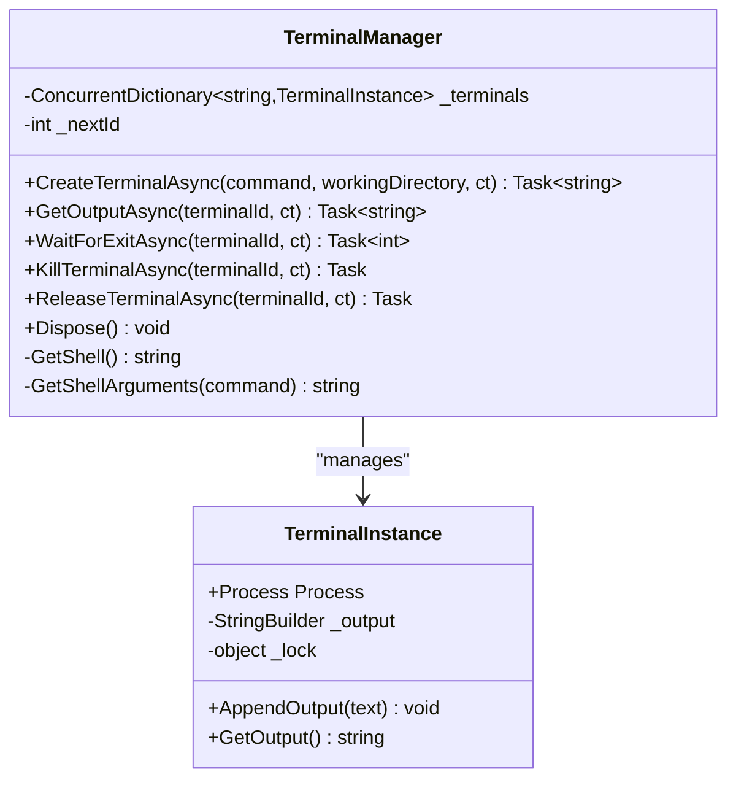
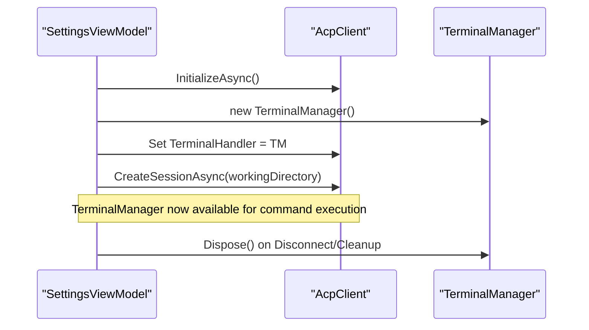
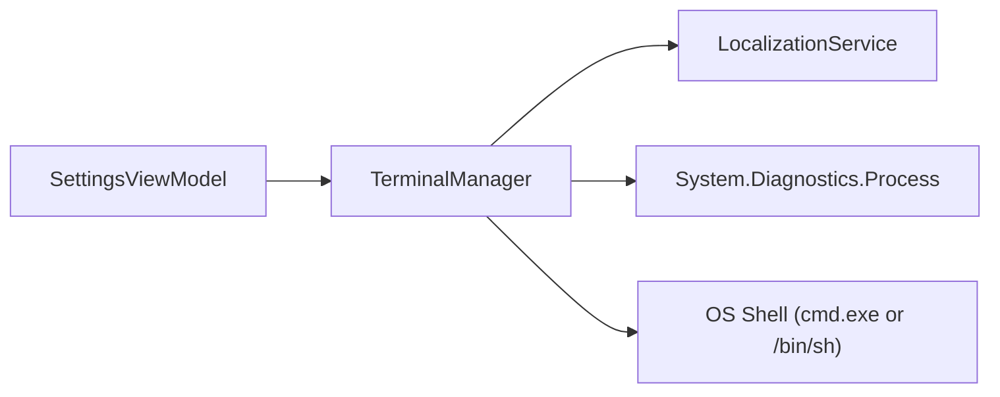

# Terminal Management

<cite>
**Referenced Files in This Document**
- [TerminalManager.cs](file://Agentic.Desktop/Services/TerminalManager.cs)
- [SettingsViewModel.cs](file://Agentic.Desktop/ViewModels/SettingsViewModel.cs)
- [LocalizationService.cs](file://Agentic.Desktop/Services/LocalizationService.cs)
- [Resources.resw (en)](file://Agentic.Desktop/Strings/en/Resources.resw)
</cite>

## Table of Contents
1. [Introduction](#introduction)
2. [Project Structure](#project-structure)
3. [Core Components](#core-components)
4. [Architecture Overview](#architecture-overview)
5. [Detailed Component Analysis](#detailed-component-analysis)
6. [Dependency Analysis](#dependency-analysis)
7. [Performance Considerations](#performance-considerations)
8. [Troubleshooting Guide](#troubleshooting-guide)
9. [Conclusion](#conclusion)

## Introduction
This document explains the Terminal Management functionality that enables concurrent terminal instances and shell command execution within the desktop application. The system centers around a TerminalManager service that:
- Manages multiple shell process lifecycles concurrently
- Streams stdout and stderr asynchronously to an in-memory buffer per instance
- Provides cross-platform shell compatibility (Windows cmd.exe and POSIX /bin/sh)
- Supports unique ID generation for each terminal session
- Enables graceful termination, resource cleanup, and cancellation support

The TerminalManager is integrated into the application via an ACP client interface and is instantiated during agent connection setup. It exposes methods to create terminals, read output, wait for exit, kill processes, and release resources safely.

## Project Structure
The terminal management feature resides primarily under Services and is wired up through the Settings view model. Localization strings are provided via .resw files.

**Diagram sources**
- [SettingsViewModel.cs:100-102](file://Agentic.Desktop/ViewModels/SettingsViewModel.cs#L100-L102)
- [TerminalManager.cs:11-135](file://Agentic.Desktop/Services/TerminalManager.cs#L11-L135)
- [LocalizationService.cs:8-22](file://Agentic.Desktop/Services/LocalizationService.cs#L8-L22)

**Section sources**
- [SettingsViewModel.cs:100-102](file://Agentic.Desktop/ViewModels/SettingsViewModel.cs#L100-L102)
- [TerminalManager.cs:11-135](file://Agentic.Desktop/Services/TerminalManager.cs#L11-L135)
- [LocalizationService.cs:8-22](file://Agentic.Desktop/Services/LocalizationService.cs#L8-L22)

## Core Components
- TerminalManager: Implements ITerminalHandler and IDisposable; manages concurrent terminal instances, asynchronous I/O, and lifecycle operations.
- TerminalInstance: Encapsulates a single Process and thread-safe output buffering.
- LocalizationService: Provides localized strings used by terminal output (e.g., stderr prefix).

Key responsibilities:
- CreateTerminalAsync: Starts a new shell process with redirected streams and returns a unique terminal ID.
- GetOutputAsync: Retrieves buffered output for a given terminal ID.
- WaitForExitAsync: Waits for the underlying process to exit and returns its exit code.
- KillTerminalAsync: Terminates the process tree if still running.
- ReleaseTerminalAsync: Removes the terminal from tracking, kills if needed, and disposes resources.
- Dispose: Ensures all tracked terminals are terminated and disposed when the manager is disposed.

**Section sources**
- [TerminalManager.cs:11-135](file://Agentic.Desktop/Services/TerminalManager.cs#L11-L135)
- [TerminalManager.cs:137-161](file://Agentic.Desktop/Services/TerminalManager.cs#L137-L161)
- [LocalizationService.cs:8-22](file://Agentic.Desktop/Services/LocalizationService.cs#L8-L22)

## Architecture Overview
The terminal subsystem follows a clear separation of concerns:
- View Model initializes and owns the TerminalManager instance.
- TerminalManager orchestrates process creation and stream handling.
- LocalizationService supplies user-facing labels.
- Operating system shells execute commands.

**Diagram sources**
- [SettingsViewModel.cs:100-102](file://Agentic.Desktop/ViewModels/SettingsViewModel.cs#L100-L102)
- [TerminalManager.cs:16-68](file://Agentic.Desktop/Services/TerminalManager.cs#L16-L68)
- [TerminalManager.cs:130-135](file://Agentic.Desktop/Services/TerminalManager.cs#L130-L135)

## Detailed Component Analysis

### TerminalManager
Responsibilities:
- Concurrent dictionary tracks active terminals by unique IDs.
- Asynchronous readers consume stdout and stderr line-by-line and append to the instance buffer.
- Cross-platform shell selection based on operating system.
- Graceful termination and disposal patterns ensure no leaked handles.

Concurrency and safety:
- Uses Interlocked counter for unique IDs.
- Thread-safe ConcurrentDictionary for instance storage.
- Per-instance lock protects StringBuilder output buffer.

Cancellation:
- CancellationToken propagated to async readers and process waits.

Error handling:
- Readers catch OperationCanceledException and general exceptions to avoid unhandled crashes.
- Kill calls wrapped in try/catch to tolerate already-exited processes.

**Diagram sources**
- [TerminalManager.cs:11-135](file://Agentic.Desktop/Services/TerminalManager.cs#L11-L135)
- [TerminalManager.cs:137-161](file://Agentic.Desktop/Services/TerminalManager.cs#L137-L161)

**Section sources**
- [TerminalManager.cs:11-135](file://Agentic.Desktop/Services/TerminalManager.cs#L11-L135)
- [TerminalManager.cs:137-161](file://Agentic.Desktop/Services/TerminalManager.cs#L137-L161)

### Integration with SettingsViewModel
- TerminalManager is created during agent connection and assigned to the ACP client’s TerminalHandler property.
- Cleanup ensures TerminalManager.Dispose is called on disconnect to terminate all managed processes.

**Diagram sources**
- [SettingsViewModel.cs:97-106](file://Agentic.Desktop/ViewModels/SettingsViewModel.cs#L97-L106)
- [SettingsViewModel.cs:142-160](file://Agentic.Desktop/ViewModels/SettingsViewModel.cs#L142-L160)

**Section sources**
- [SettingsViewModel.cs:97-106](file://Agentic.Desktop/ViewModels/SettingsViewModel.cs#L97-L106)
- [SettingsViewModel.cs:142-160](file://Agentic.Desktop/ViewModels/SettingsViewModel.cs#L142-L160)

### Localization and User-Facing Strings
- StderrPrefix is retrieved via LocalizationService.Get("StderrPrefix") and prepended to stderr lines for clarity.
- AccessDeniedMessage is used by file system handler for path validation errors.

**Section sources**
- [LocalizationService.cs:8-22](file://Agentic.Desktop/Services/LocalizationService.cs#L8-L22)
- [Resources.resw (en):218-221](file://Agentic.Desktop/Strings/en/Resources.resw#L218-L221)
- [Resources.resw (en):213-216](file://Agentic.Desktop/Strings/en/Resources.resw#L213-L216)

## Dependency Analysis
- TerminalManager depends on:
  - System.Diagnostics.Process for process lifecycle
  - System.Collections.Concurrent.ConcurrentDictionary for thread-safe instance registry
  - LocalizationService for localized strings
- SettingsViewModel depends on TerminalManager and integrates it into the ACP client lifecycle.

**Diagram sources**
- [SettingsViewModel.cs:100-102](file://Agentic.Desktop/ViewModels/SettingsViewModel.cs#L100-L102)
- [TerminalManager.cs:11-135](file://Agentic.Desktop/Services/TerminalManager.cs#L11-L135)
- [LocalizationService.cs:8-22](file://Agentic.Desktop/Services/LocalizationService.cs#L8-L22)

**Section sources**
- [SettingsViewModel.cs:100-102](file://Agentic.Desktop/ViewModels/SettingsViewModel.cs#L100-L102)
- [TerminalManager.cs:11-135](file://Agentic.Desktop/Services/TerminalManager.cs#L11-L135)
- [LocalizationService.cs:8-22](file://Agentic.Desktop/Services/LocalizationService.cs#L8-L22)

## Performance Considerations
- Asynchronous streaming:
  - Separate tasks read stdout and stderr concurrently to avoid blocking.
  - Line-based reading reduces memory spikes compared to bulk reads.
- Buffering:
  - In-memory StringBuilder per instance is protected by a lock to ensure thread-safety.
  - For high-volume output scenarios, consider periodic flushing or bounded buffers to prevent unbounded growth.
- Cancellation:
  - CancellationToken propagates to async readers and process waits, enabling responsive shutdown.
- Resource cleanup:
  - Ensure ReleaseTerminalAsync or Dispose is called to free process handles and prevent leaks.
- Cross-platform overhead:
  - Shell invocation differs between Windows and POSIX; keep commands minimal and avoid unnecessary subshells.

[No sources needed since this section provides general guidance]

## Troubleshooting Guide
Common issues and resolutions:
- No output appears:
  - Verify that stdout/stderr redirection is enabled and readers are started.
  - Check that the command produces output to standard streams.
- Process hangs or does not exit:
  - Use KillTerminalAsync to terminate the process tree.
  - Ensure working directory is valid and accessible.
- Memory growth with long-running sessions:
  - Implement periodic output trimming or external logging to disk.
  - Consider backpressure mechanisms to limit buffer size.
- Cross-platform differences:
  - On Windows, use cmd.exe with "/c" arguments; on POSIX, use "/bin/sh -c".
  - Validate command syntax for the target platform.
- Localization missing:
  - Ensure resource keys exist in .resw files (e.g., StderrPrefix).
- Disposal and cleanup:
  - Always call ReleaseTerminalAsync after use or dispose the TerminalManager to terminate remaining processes.

**Section sources**
- [TerminalManager.cs:38-64](file://Agentic.Desktop/Services/TerminalManager.cs#L38-L64)
- [TerminalManager.cs:86-113](file://Agentic.Desktop/Services/TerminalManager.cs#L86-L113)
- [TerminalManager.cs:115-128](file://Agentic.Desktop/Services/TerminalManager.cs#L115-L128)
- [Resources.resw (en):218-221](file://Agentic.Desktop/Strings/en/Resources.resw#L218-L221)

## Conclusion
The Terminal Management system provides a robust, concurrent, and cross-platform solution for executing shell commands and streaming their output. With careful attention to cancellation, resource cleanup, and performance optimization, it supports high-volume output scenarios while maintaining responsiveness and stability. Proper integration with the application lifecycle ensures safe initialization and teardown, and localization enhances user experience across languages.

[No sources needed since this section summarizes without analyzing specific files]