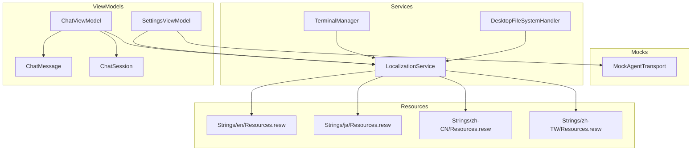
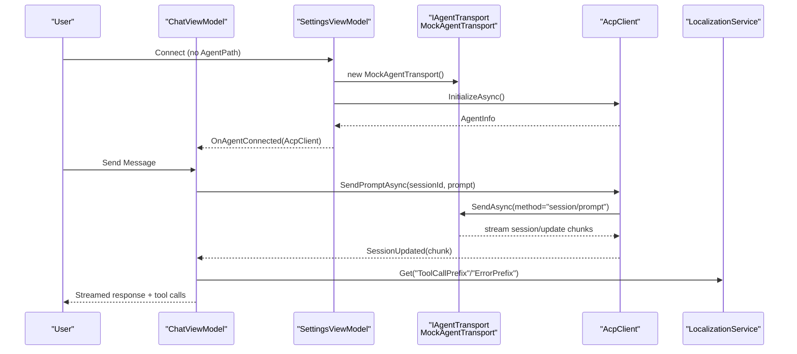
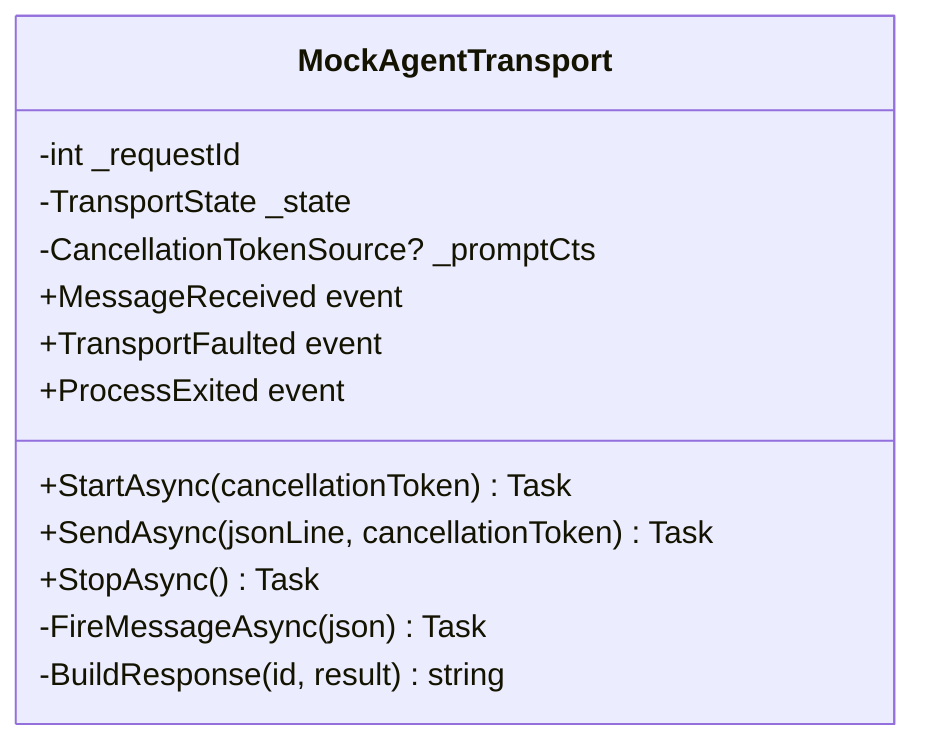
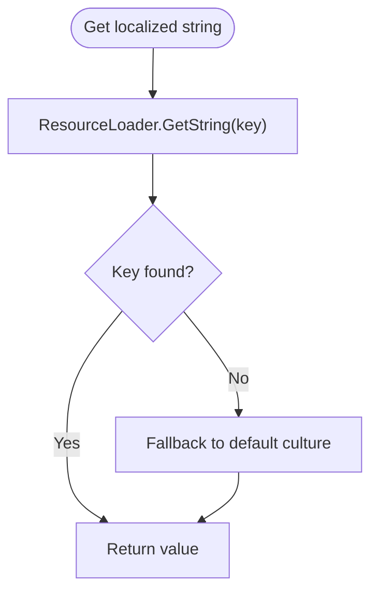
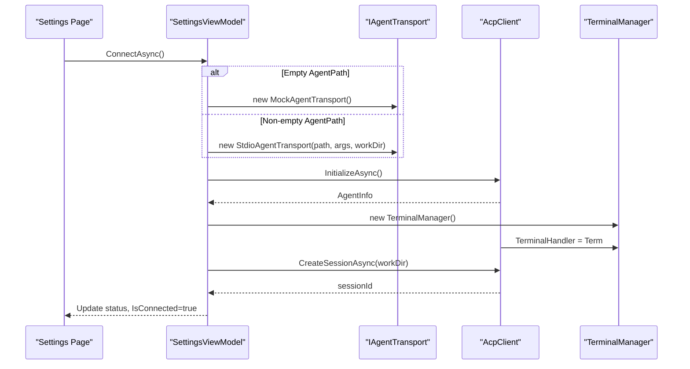
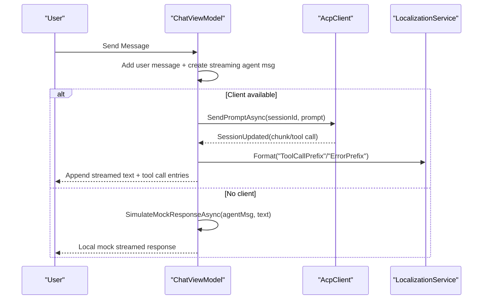
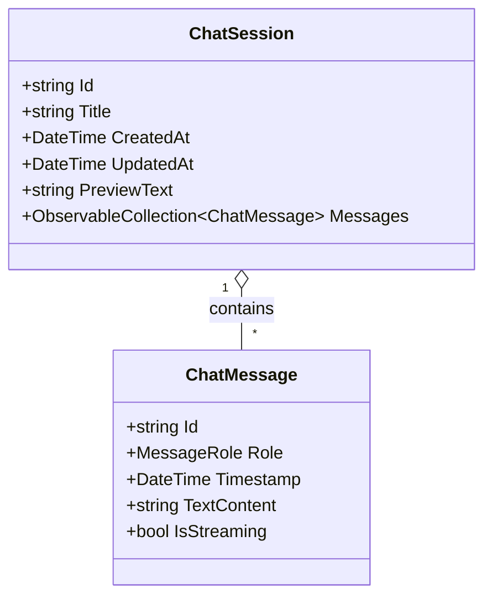
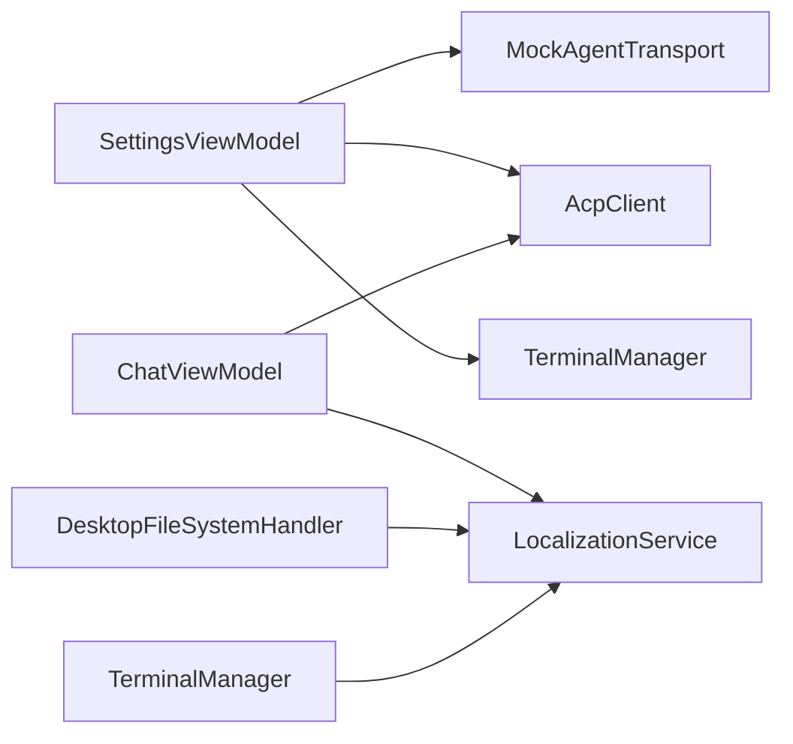

# Development Tools

<cite>
**Referenced Files in This Document**
- [MockAgentTransport.cs](file://Agentic.Desktop/Agentic.Desktop/Mocks/MockAgentTransport.cs)
- [LocalizationService.cs](file://Agentic.Desktop/Agentic.Desktop/Services/LocalizationService.cs)
- [Resources.resw (en)](file://Agentic.Desktop/Agentic.Desktop/Strings/en/Resources.resw)
- [Resources.resw (ja)](file://Agentic.Desktop/Agentic.Desktop/Strings/ja/Resources.resw)
- [Resources.resw (zh-CN)](file://Agentic.Desktop/Agentic.Desktop/Strings/zh-CN/Resources.resw)
- [Resources.resw (zh-TW)](file://Agentic.Desktop/Agentic.Desktop/Strings/zh-TW/Resources.resw)
- [ChatViewModel.cs](file://Agentic.Desktop/Agentic.Desktop/ViewModels/ChatViewModel.cs)
- [SettingsViewModel.cs](file://Agentic.Desktop/Agentic.Desktop/ViewModels/SettingsViewModel.cs)
- [TerminalManager.cs](file://Agentic.Desktop/Agentic.Desktop/Services/TerminalManager.cs)
- [FileSystemHandler.cs](file://Agentic.Desktop/Agentic.Desktop/Services/FileSystemHandler.cs)
- [ChatMessage.cs](file://Agentic.Desktop/Agentic.Desktop/ViewModels/Messages/ChatMessage.cs)
- [ChatSession.cs](file://Agentic.Desktop/Agentic.Desktop/ViewModels/Messages/ChatSession.cs)
- [validate_resw.ps1](file://Agentic.Desktop/validate_resw.ps1)
</cite>

## Table of Contents
1. [Introduction](#introduction)
2. [Project Structure](#project-structure)
3. [Core Components](#core-components)
4. [Architecture Overview](#architecture-overview)
5. [Detailed Component Analysis](#detailed-component-analysis)
6. [Dependency Analysis](#dependency-analysis)
7. [Performance Considerations](#performance-considerations)
8. [Troubleshooting Guide](#troubleshooting-guide)
9. [Conclusion](#conclusion)
10. [Appendices](#appendices)

## Introduction
This document explains Agentic.Desktop’s development tools and testing capabilities with a focus on:
- MockAgentTransport: a mock ACP transport that simulates protocol behavior for UI development and testing without external dependencies, including scripted responses and error simulation.
- Localization system: English, Japanese, Simplified Chinese, and Traditional Chinese via .resw resource files, accessed through LocalizationService for dynamic language switching and string management.
- Practical guidance for creating test scenarios, debugging WinUI 3 applications, and performance profiling strategies.
- Extending the mock agent for custom tests and adding new languages to the localization system.
- Unit testing approaches for ViewModels and services.

## Project Structure
The relevant parts of the project structure for development and testing are:
- Mocks: MockAgentTransport implements IAgentTransport to simulate ACP protocol messages and streaming updates.
- Services: LocalizationService reads localized strings from .resw resources; TerminalManager manages terminal processes; FileSystemHandler enforces working directory access.
- ViewModels: ChatViewModel orchestrates chat interactions and uses either a real IAcpClient or local mock simulation; SettingsViewModel wires transports (mock or stdio), initializes sessions, and exposes connection state.
- Strings: Resources.resw per culture provides localized UI text used by both XAML and C#.

**Diagram sources**
- [MockAgentTransport.cs](file://Agentic.Desktop/Agentic.Desktop/Mocks/MockAgentTransport.cs)
- [LocalizationService.cs](file://Agentic.Desktop/Agentic.Desktop/Services/LocalizationService.cs)
- [TerminalManager.cs](file://Agentic.Desktop/Agentic.Desktop/Services/TerminalManager.cs)
- [FileSystemHandler.cs](file://Agentic.Desktop/Agentic.Desktop/Services/FileSystemHandler.cs)
- [SettingsViewModel.cs](file://Agentic.Desktop/Agentic.Desktop/ViewModels/SettingsViewModel.cs)
- [ChatViewModel.cs](file://Agentic.Desktop/Agentic.Desktop/ViewModels/ChatViewModel.cs)
- [ChatMessage.cs](file://Agentic.Desktop/Agentic.Desktop/ViewModels/Messages/ChatMessage.cs)
- [ChatSession.cs](file://Agentic.Desktop/Agentic.Desktop/ViewModels/Messages/ChatSession.cs)
- [Resources.resw (en)](file://Agentic.Desktop/Agentic.Desktop/Strings/en/Resources.resw)
- [Resources.resw (ja)](file://Agentic.Desktop/Agentic.Desktop/Strings/ja/Resources.resw)
- [Resources.resw (zh-CN)](file://Agentic.Desktop/Agentic.Desktop/Strings/zh-CN/Resources.resw)
- [Resources.resw (zh-TW)](file://Agentic.Desktop/Agentic.Desktop/Strings/zh-TW/Resources.resw)

**Section sources**
- [MockAgentTransport.cs](file://Agentic.Desktop/Agentic.Desktop/Mocks/MockAgentTransport.cs)
- [LocalizationService.cs](file://Agentic.Desktop/Agentic.Desktop/Services/LocalizationService.cs)
- [SettingsViewModel.cs](file://Agentic.Desktop/Agentic.Desktop/ViewModels/SettingsViewModel.cs)
- [ChatViewModel.cs](file://Agentic.Desktop/Agentic.Desktop/ViewModels/ChatViewModel.cs)

## Core Components
- MockAgentTransport: Implements IAgentTransport and emits JSON-RPC-like messages for initialize, session/new, session/prompt, and session/cancel. It supports streaming chunks and cancellation tokens, and raises events for message delivery and faults.
- LocalizationService: Static wrapper around Windows ResourceLoader to fetch localized strings by key and format them with arguments.
- SettingsViewModel: Wires up either MockAgentTransport or StdioAgentTransport based on configuration, initializes AcpClient, creates sessions, and exposes connection state and lifecycle hooks.
- ChatViewModel: Orchestrates sending prompts, handling streaming updates, tool call notifications, and fallback local mock simulation when no client is bound.
- TerminalManager: Manages multiple terminal processes, reading stdout/stderr asynchronously and exposing output and lifecycle methods.
- DesktopFileSystemHandler: Enforces working-directory-scoped file access and throws localized unauthorized access exceptions.

**Section sources**
- [MockAgentTransport.cs](file://Agentic.Desktop/Agentic.Desktop/Mocks/MockAgentTransport.cs)
- [LocalizationService.cs](file://Agentic.Desktop/Agentic.Desktop/Services/LocalizationService.cs)
- [SettingsViewModel.cs](file://Agentic.Desktop/Agentic.Desktop/ViewModels/SettingsViewModel.cs)
- [ChatViewModel.cs](file://Agentic.Desktop/Agentic.Desktop/ViewModels/ChatViewModel.cs)
- [TerminalManager.cs](file://Agentic.Desktop/Agentic.Desktop/Services/TerminalManager.cs)
- [FileSystemHandler.cs](file://Agentic.Desktop/Agentic.Desktop/Services/FileSystemHandler.cs)

## Architecture Overview
The application uses a layered architecture where ViewModels coordinate user actions and orchestrate services and transports. The mock transport enables UI development and testing without an external agent process.

**Diagram sources**
- [SettingsViewModel.cs](file://Agentic.Desktop/Agentic.Desktop/ViewModels/SettingsViewModel.cs)
- [MockAgentTransport.cs](file://Agentic.Desktop/Agentic.Desktop/Mocks/MockAgentTransport.cs)
- [ChatViewModel.cs](file://Agentic.Desktop/Agentic.Desktop/ViewModels/ChatViewModel.cs)
- [LocalizationService.cs](file://Agentic.Desktop/Agentic.Desktop/Services/LocalizationService.cs)

## Detailed Component Analysis

### MockAgentTransport
MockAgentTransport simulates ACP protocol behavior:
- State machine: Created -> Running -> Stopped.
- Methods: StartAsync sets running state; StopAsync cancels any in-flight prompt and transitions to stopped.
- SendAsync parses incoming JSON lines, dispatches by method:
  - initialize: returns protocol version, agent capabilities/info, auth methods.
  - session/new: returns a mock session ID.
  - session/prompt: streams multiple update notifications with randomized delays, then sends final stop reason.
  - session/cancel: cancels linked token source.
- Events: MessageReceived for outgoing JSON, TransportFaulted for errors, ProcessExited not used here.
- Error simulation: Exceptions during SendAsync raise TransportFaulted; OperationCanceledException is handled gracefully.

**Diagram sources**
- [MockAgentTransport.cs](file://Agentic.Desktop/Agentic.Desktop/Mocks/MockAgentTransport.cs)

**Section sources**
- [MockAgentTransport.cs](file://Agentic.Desktop/Agentic.Desktop/Mocks/MockAgentTransport.cs)

### LocalizationSystem
- Resource files: Each culture has a Resources.resw under Strings/{culture}. These contain all UI strings referenced by XAML and code.
- LocalizationService: Uses Windows.ApplicationModel.Resources.ResourceLoader with name "Resources" to retrieve strings by key and format with parameters.
- Dynamic language switching: While the service itself does not change culture, WinRT will resolve strings according to current UI culture; changing the UI culture at runtime causes subsequent calls to return localized values for the new culture.

**Diagram sources**
- [LocalizationService.cs](file://Agentic.Desktop/Agentic.Desktop/Services/LocalizationService.cs)
- [Resources.resw (en)](file://Agentic.Desktop/Agentic.Desktop/Strings/en/Resources.resw)
- [Resources.resw (ja)](file://Agentic.Desktop/Agentic.Desktop/Strings/ja/Resources.resw)
- [Resources.resw (zh-CN)](file://Agentic.Desktop/Agentic.Desktop/Strings/zh-CN/Resources.resw)
- [Resources.resw (zh-TW)](file://Agentic.Desktop/Agentic.Desktop/Strings/zh-TW/Resources.resw)

**Section sources**
- [LocalizationService.cs](file://Agentic.Desktop/Agentic.Desktop/Services/LocalizationService.cs)
- [Resources.resw (en)](file://Agentic.Desktop/Agentic.Desktop/Strings/en/Resources.resw)
- [Resources.resw (ja)](file://Agentic.Desktop/Agentic.Desktop/Strings/ja/Resources.resw)
- [Resources.resw (zh-CN)](file://Agentic.Desktop/Agentic.Desktop/Strings/zh-CN/Resources.resw)
- [Resources.resw (zh-TW)](file://Agentic.Desktop/Agentic.Desktop/Strings/zh-TW/Resources.resw)

### SettingsViewModel and Transport Wiring
SettingsViewModel controls connection lifecycle:
- ConnectAsync chooses MockAgentTransport if AgentPath is empty, otherwise uses StdioAgentTransport with provided arguments and working directory.
- Initializes AcpClient with JsonRpcDispatcher and optional logger.
- Subscribes to AgentProcessExited to report disconnection with localized status.
- Creates a session and notifies ChatViewModel via OnAgentConnected.
- DisconnectAsync cleans up client and terminal manager, resets state.

**Diagram sources**
- [SettingsViewModel.cs](file://Agentic.Desktop/Agentic.Desktop/ViewModels/SettingsViewModel.cs)
- [TerminalManager.cs](file://Agentic.Desktop/Agentic.Desktop/Services/TerminalManager.cs)

**Section sources**
- [SettingsViewModel.cs](file://Agentic.Desktop/Agentic.Desktop/ViewModels/SettingsViewModel.cs)
- [TerminalManager.cs](file://Agentic.Desktop/Agentic.Desktop/Services/TerminalManager.cs)

### ChatViewModel and Streaming Flow
ChatViewModel handles user input and agent responses:
- SendMessageAsync adds user message, creates streaming agent message placeholder, and either sends via AcpClient or simulates locally.
- OnSessionUpdated merges streaming chunks with batching to reduce UI churn and marshals updates to the UI thread.
- ToolCallNotification inserts system messages and updates session preview.
- CancelGenerationAsync requests cancellation and clears streaming state.

**Diagram sources**
- [ChatViewModel.cs](file://Agentic.Desktop/Agentic.Desktop/ViewModels/ChatViewModel.cs)
- [LocalizationService.cs](file://Agentic.Desktop/Agentic.Desktop/Services/LocalizationService.cs)

**Section sources**
- [ChatViewModel.cs](file://Agentic.Desktop/Agentic.Desktop/ViewModels/ChatViewModel.cs)

### Data Models
- ChatMessage: Observable object with Id, Role, Timestamp, TextContent, IsStreaming. Used to represent individual messages in conversation history.
- ChatSession: Observable object with Id, Title (localized default), timestamps, previewText, and Messages collection.

**Diagram sources**
- [ChatMessage.cs](file://Agentic.Desktop/Agentic.Desktop/ViewModels/Messages/ChatMessage.cs)
- [ChatSession.cs](file://Agentic.Desktop/Agentic.Desktop/ViewModels/Messages/ChatSession.cs)

**Section sources**
- [ChatMessage.cs](file://Agentic.Desktop/Agentic.Desktop/ViewModels/Messages/ChatMessage.cs)
- [ChatSession.cs](file://Agentic.Desktop/Agentic.Desktop/ViewModels/Messages/ChatSession.cs)

## Dependency Analysis
- MockAgentTransport depends on the ACP library transport interface and System.Text.Json for serialization.
- LocalizationService depends on Windows.ApplicationModel.Resources.ResourceLoader.
- SettingsViewModel depends on AcpClient, JsonRpcDispatcher, and either MockAgentTransport or StdioAgentTransport.
- ChatViewModel depends on AcpClient, CommunityToolkit.Mvvm, and LocalizationService.
- TerminalManager and FileSystemHandler depend on LocalizationService for localized messages.

**Diagram sources**
- [SettingsViewModel.cs](file://Agentic.Desktop/Agentic.Desktop/ViewModels/SettingsViewModel.cs)
- [MockAgentTransport.cs](file://Agentic.Desktop/Agentic.Desktop/Mocks/MockAgentTransport.cs)
- [ChatViewModel.cs](file://Agentic.Desktop/Agentic.Desktop/ViewModels/ChatViewModel.cs)
- [LocalizationService.cs](file://Agentic.Desktop/Agentic.Desktop/Services/LocalizationService.cs)
- [TerminalManager.cs](file://Agentic.Desktop/Agentic.Desktop/Services/TerminalManager.cs)
- [FileSystemHandler.cs](file://Agentic.Desktop/Agentic.Desktop/Services/FileSystemHandler.cs)

**Section sources**
- [SettingsViewModel.cs](file://Agentic.Desktop/Agentic.Desktop/ViewModels/SettingsViewModel.cs)
- [MockAgentTransport.cs](file://Agentic.Desktop/Agentic.Desktop/Mocks/MockAgentTransport.cs)
- [ChatViewModel.cs](file://Agentic.Desktop/Agentic.Desktop/ViewModels/ChatViewModel.cs)
- [LocalizationService.cs](file://Agentic.Desktop/Agentic.Desktop/Services/LocalizationService.cs)
- [TerminalManager.cs](file://Agentic.Desktop/Agentic.Desktop/Services/TerminalManager.cs)
- [FileSystemHandler.cs](file://Agentic.Desktop/Agentic.Desktop/Services/FileSystemHandler.cs)

## Performance Considerations
- Streaming batching: ChatViewModel batches incoming text chunks over a short delay to reduce UI updates and improve responsiveness.
- DispatcherQueue usage: All UI updates are marshaled to the UI thread using DispatcherQueue.TryEnqueue to avoid cross-thread exceptions.
- Token-based cancellation: MockAgentTransport uses CancellationTokenSource to support prompt cancellation and graceful shutdown.
- Terminal output buffering: TerminalManager buffers stdout/stderr asynchronously to prevent blocking and ensure smooth operation.
- Resource loading: LocalizationService uses ResourceLoader which caches strings; ensure keys are consistent across cultures to avoid misses.

[No sources needed since this section provides general guidance]

## Troubleshooting Guide
- Missing localized strings: If a key is missing in a culture’s Resources.resw, ResourceLoader may throw or fall back to default. Use validate_resw.ps1 to verify XML validity and count data entries.
- Transport faults: MockAgentTransport raises TransportFaulted on exceptions during SendAsync; subscribe to this event to capture and log errors.
- Cancellation issues: Ensure session/cancel is sent before stopping transport; MockAgentTransport cancels linked tokens to abort streaming prompts.
- File access denied: DesktopFileSystemHandler validates paths against working directory; UnauthorizedAccessException includes localized message indicating denied path.
- Terminal process leaks: TerminalManager.Dispose kills remaining processes and releases resources; ensure it is disposed on app shutdown.

**Section sources**
- [validate_resw.ps1](file://Agentic.Desktop/validate_resw.ps1)
- [MockAgentTransport.cs](file://Agentic.Desktop/Agentic.Desktop/Mocks/MockAgentTransport.cs)
- [FileSystemHandler.cs](file://Agentic.Desktop/Agentic.Desktop/Services/FileSystemHandler.cs)
- [TerminalManager.cs](file://Agentic.Desktop/Agentic.Desktop/Services/TerminalManager.cs)

## Conclusion
Agentic.Desktop provides robust development and testing tools:
- MockAgentTransport enables deterministic, scriptable ACP behavior for UI development and tests without external dependencies.
- LocalizationService centralizes string retrieval and formatting, supporting multiple cultures via .resw files.
- SettingsViewModel and ChatViewModel integrate seamlessly with both mock and real transports, enabling flexible testing scenarios.
- TerminalManager and DesktopFileSystemHandler add practical utilities for process management and secure file access.
These components together facilitate unit testing, debugging, and performance optimization for WinUI 3 applications.

[No sources needed since this section summarizes without analyzing specific files]

## Appendices

### Creating Test Scenarios with MockAgentTransport
- Instantiate MockAgentTransport and wire it into AcpClient via SettingsViewModel.ConnectAsync with empty AgentPath.
- Subscribe to MessageReceived to assert emitted JSON messages and payloads.
- Trigger session/prompt and verify streaming updates and final stop reason.
- Validate cancellation by invoking session/cancel and checking that streaming stops.

**Section sources**
- [MockAgentTransport.cs](file://Agentic.Desktop/Agentic.Desktop/Mocks/MockAgentTransport.cs)
- [SettingsViewModel.cs](file://Agentic.Desktop/Agentic.Desktop/ViewModels/SettingsViewModel.cs)

### Debugging Techniques for WinUI 3 Applications
- Use Visual Studio debugger with breakpoints in ViewModels and Services.
- Inspect DispatcherQueue operations to ensure UI thread marshaling.
- Log AcpClient initialization and session lifecycle events.
- Monitor TerminalManager stdout/stderr outputs for process diagnostics.

[No sources needed since this section provides general guidance]

### Performance Profiling Strategies
- Profile UI updates by measuring batching intervals in ChatViewModel.
- Use CPU/GPU profilers to identify bottlenecks in streaming handlers.
- Measure memory usage for large terminal outputs and ensure proper disposal.

[No sources needed since this section provides general guidance]

### Extending MockAgentTransport for Custom Testing
- Add new methods in SendAsync switch cases to simulate additional ACP commands.
- Introduce configurable response scripts or fixtures for deterministic testing.
- Expose events or callbacks for test assertions on internal state changes.

**Section sources**
- [MockAgentTransport.cs](file://Agentic.Desktop/Agentic.Desktop/Mocks/MockAgentTransport.cs)

### Adding New Languages to the Localization System
- Create a new folder under Strings with the target culture code (e.g., fr).
- Copy and translate Resources.resw entries for the new culture.
- Ensure all keys match existing cultures to avoid missing string exceptions.
- Optionally run validate_resw.ps1 to verify XML integrity and entry counts.

**Section sources**
- [Resources.resw (en)](file://Agentic.Desktop/Agentic.Desktop/Strings/en/Resources.resw)
- [validate_resw.ps1](file://Agentic.Desktop/validate_resw.ps1)

### Unit Testing Approaches for ViewModels and Services
- SettingsViewModel:
  - Verify ConnectAsync constructs correct transport based on AgentPath.
  - Assert OnAgentConnected invokes with valid AcpClient instance.
  - Check DisconnectAsync resets state and disposes resources.
- ChatViewModel:
  - Bind a mock AcpClient and assert SendMessageAsync triggers expected prompts.
  - Validate OnSessionUpdated merges chunks correctly and updates UI properties.
  - Confirm CancelGenerationAsync clears streaming state.
- Services:
  - DesktopFileSystemHandler: Assert UnauthorizedAccessException for out-of-scope paths.
  - TerminalManager: Create terminals, read outputs, and verify cleanup on Dispose.

**Section sources**
- [SettingsViewModel.cs](file://Agentic.Desktop/Agentic.Desktop/ViewModels/SettingsViewModel.cs)
- [ChatViewModel.cs](file://Agentic.Desktop/Agentic.Desktop/ViewModels/ChatViewModel.cs)
- [FileSystemHandler.cs](file://Agentic.Desktop/Agentic.Desktop/Services/FileSystemHandler.cs)
- [TerminalManager.cs](file://Agentic.Desktop/Agentic.Desktop/Services/TerminalManager.cs)