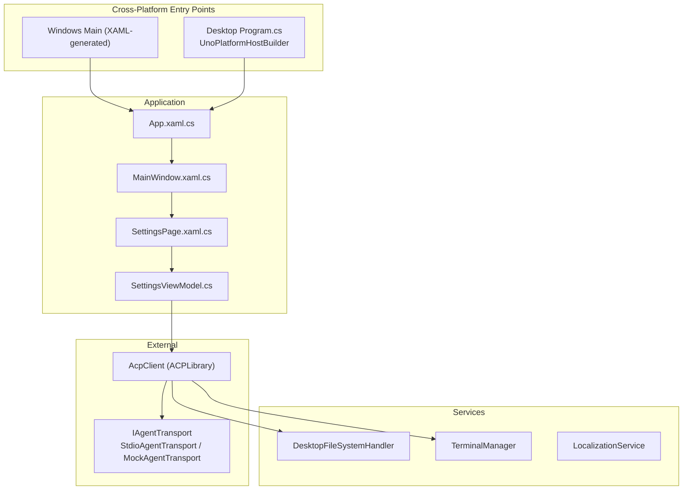
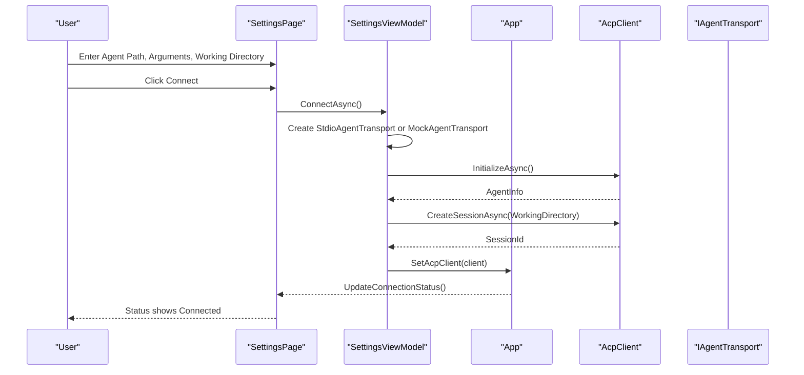
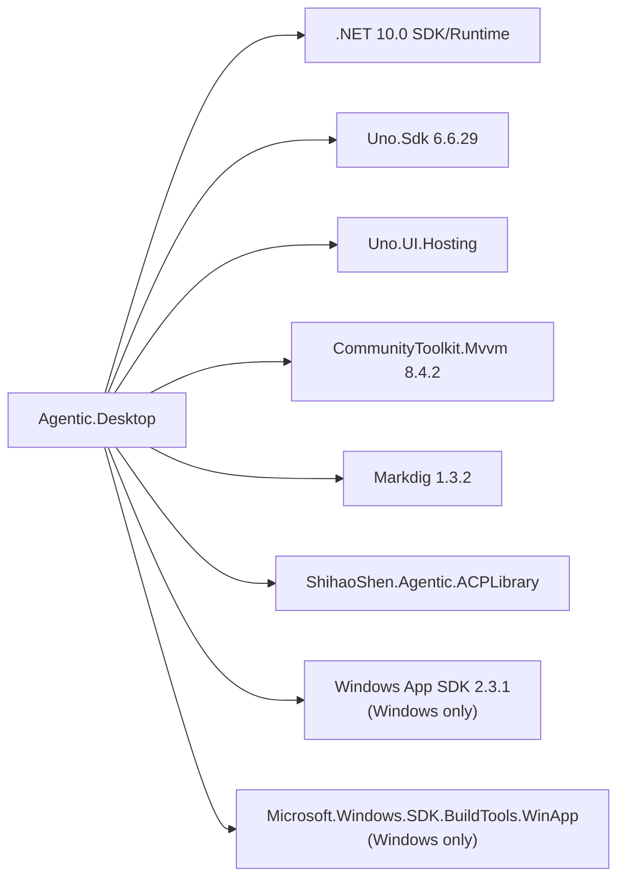

# Getting Started

<cite>
**Referenced Files in This Document**
- [README.md](file://README.md)
- [Agentic.Desktop.csproj](file://Agentic.Desktop/Agentic.Desktop.csproj)
- [global.json](file://global.json)
- [Directory.Build.props](file://Directory.Build.props)
- [Program.cs](file://Agentic.Desktop/Platforms/Desktop/Program.cs)
- [App.xaml.cs](file://Agentic.Desktop/App.xaml.cs)
- [SettingsPage.xaml.cs](file://Agentic.Desktop/SettingsPage.xaml.cs)
- [SettingsViewModel.cs](file://Agentic.Desktop/ViewModels/SettingsViewModel.cs)
- [MainWindow.xaml.cs](file://Agentic.Desktop/MainWindow.xaml.cs)
- [launchSettings.json](file://Agentic.Desktop/Properties/launchSettings.json)
- [Resources.resw](file://Agentic.Desktop/Strings/en/Resources.resw)
</cite>

## Update Summary
**Changes Made**
- Updated installation requirements to include Uno.Sdk dependencies and cross-platform setup
- Added multi-target framework configuration details for Windows and desktop Skia backends
- Updated build commands to support cross-platform compilation
- Enhanced troubleshooting section with platform-specific issues
- Added new sections for cross-platform architecture and deployment options

## Table of Contents
1. [Introduction](#introduction)
2. [Project Structure](#project-structure)
3. [Core Components](#core-components)
4. [Architecture Overview](#architecture-overview)
5. [Cross-Platform Architecture](#cross-platform-architecture)
6. [Detailed Component Analysis](#detailed-component-analysis)
7. [Dependency Analysis](#dependency-analysis)
8. [Performance Considerations](#performance-considerations)
9. [Troubleshooting Guide](#troubleshooting-guide)
10. [Conclusion](#conclusion)
11. [Appendices](#appendices)

## Introduction
This guide helps you set up and run Agentic.Desktop on multiple platforms including Windows, Linux, and macOS. The application now uses Uno.Sdk for cross-platform support with multi-target framework configuration, allowing you to build for both Windows (WinAppSDK) and desktop Skia backends. You will install the required tools, clone the repository, build the project for your target platform, and launch it using appropriate commands for each platform.

## Project Structure
Agentic.Desktop is a cross-platform WinUI 3 application that communicates with an external ACP agent via stdio or a mock transport. The UI is organized into pages (Chat and Settings), with MVVM view models handling connection state and user interactions. The project now supports multiple target frameworks: `net10.0-windows10.0.26100` for Windows and `net10.0-desktop` for cross-platform desktop applications.

**Diagram sources**
- [App.xaml.cs:18-84](file://Agentic.Desktop/App.xaml.cs#L18-L84)
- [MainWindow.xaml.cs:14-96](file://Agentic.Desktop/MainWindow.xaml.cs#L14-L96)
- [SettingsPage.xaml.cs:10-95](file://Agentic.Desktop/SettingsPage.xaml.cs#L10-L95)
- [SettingsViewModel.cs:15-161](file://Agentic.Desktop/ViewModels/SettingsViewModel.cs#L15-L161)
- [Program.cs:9-24](file://Agentic.Desktop/Platforms/Desktop/Program.cs#L9-L24)

**Section sources**
- [README.md:1-92](file://README.md#L1-L92)
- [Agentic.Desktop.csproj:1-83](file://Agentic.Desktop/Agentic.Desktop.csproj#L1-L83)

## Core Components
- Application entrypoint initializes logging, creates the main window, and exposes global references for UI thread dispatching and window handle.
- Settings page manages Agent configuration and connection lifecycle. It wires permission and file system handlers and updates the title bar status.
- Settings ViewModel handles connecting/disconnecting, creating sessions, and managing terminal integration.
- MainWindow provides navigation between Chat and Settings and displays connection status.
- Cross-platform entry points provide platform-specific initialization for Windows (XAML-generated) and desktop (Skia-based) targets.

Key responsibilities:
- App: global logger factory, window reference, dispatcher queue, current AcpClient.
- SettingsPage: binds UI to shared SettingsViewModel, sets up permission and file handlers, updates status.
- SettingsViewModel: connects via StdioAgentTransport or MockAgentTransport, initializes AcpClient, creates session, manages lifecycle events.
- MainWindow: UI shell and status indicator.
- Desktop Program: UnoPlatformHostBuilder configuration for cross-platform runtime.

**Section sources**
- [App.xaml.cs:18-84](file://Agentic.Desktop/App.xaml.cs#L18-L84)
- [SettingsPage.xaml.cs:10-95](file://Agentic.Desktop/SettingsPage.xaml.cs#L10-L95)
- [SettingsViewModel.cs:15-161](file://Agentic.Desktop/ViewModels/SettingsViewModel.cs#L15-L161)
- [MainWindow.xaml.cs:14-96](file://Agentic.Desktop/MainWindow.xaml.cs#L14-L96)
- [Program.cs:9-24](file://Agentic.Desktop/Platforms/Desktop/Program.cs#L9-L24)

## Architecture Overview
The app uses MVVM and communicates with agents through the ACPLibrary client over stdio or a mock transport. The settings flow configures the transport and establishes a session before enabling chat features. The application now supports multiple runtime environments through Uno.Sdk's cross-platform capabilities.

**Diagram sources**
- [SettingsPage.xaml.cs:19-55](file://Agentic.Desktop/SettingsPage.xaml.cs#L19-L55)
- [SettingsViewModel.cs:60-126](file://Agentic.Desktop/ViewModels/SettingsViewModel.cs#L60-L126)
- [App.xaml.cs:78-84](file://Agentic.Desktop/App.xaml.cs#L78-L84)

## Cross-Platform Architecture
The application now supports multiple target frameworks through Uno.Sdk, enabling deployment across different operating systems and runtime environments.

### Target Frameworks
- **net10.0-windows10.0.26100**: Windows-specific target using WinAppSDK and XAML
- **net10.0-desktop**: Cross-platform desktop target using Skia backend

### Platform-Specific Features
- **Windows**: Uses XAML-generated Main method with full WinAppSDK integration
- **Desktop (Linux/macOS)**: Uses UnoPlatformHostBuilder with Skia rendering backend
- **Conditional Compilation**: Platform-specific code paths using MSBuild conditions

### Build Configuration
The project automatically configures platform-specific packages and features:
- Windows-only packages (Microsoft.WindowsAppSDK, SDK BuildTools) are only included for Windows target
- Uno.Sdk manages cross-platform dependencies and implicit package references
- WPF Skia host is removed for desktop target to avoid conflicts

**Section sources**
- [Agentic.Desktop.csproj:4-16](file://Agentic.Desktop/Agentic.Desktop.csproj#L4-L16)
- [Agentic.Desktop.csproj:49-73](file://Agentic.Desktop/Agentic.Desktop.csproj#L49-L73)
- [Program.cs:5-24](file://Agentic.Desktop/Platforms/Desktop/Program.cs#L5-L24)

## Detailed Component Analysis

### Installation Requirements
**Updated** The installation requirements now include Uno.Sdk dependencies and cross-platform setup considerations.

- **Operating System**: 
  - Windows 10 1809 (Build 17763) or later for Windows target
  - Linux distributions with X11/Wayland support for desktop target
  - macOS for desktop target
- **.NET SDK**: version 10.0.100 (as pinned by global.json)
- **Uno.Sdk**: version 6.6.29 (via NuGet package)
- **Windows App SDK**: version 2.3.1 (for Windows target only)
- **WinApp CLI**: installed globally as a dotnet tool (for Windows packaging)
- **Developer Mode**: enabled in Windows Settings (for Windows target)
- **Platform Dependencies**:
  - Linux: X11 or Wayland display server
  - macOS: Native macOS runtime
  - Windows: Visual Studio Build Tools or standalone SDK

These requirements are documented in the project README and enforced by the project's target framework and SDK pinning.

**Section sources**
- [README.md:24-38](file://README.md#L24-L38)
- [global.json:1-11](file://global.json#L1-L11)
- [Agentic.Desktop.csproj:4-16](file://Agentic.Desktop/Agentic.Desktop.csproj#L4-L16)

### Step-by-step Setup

**Updated** The setup process now includes cross-platform build options and platform-specific instructions.

1. **Install prerequisites**
   - Install .NET SDK 10.0.x (ensure version 10.0.100 or compatible roll-forward).
   - Install Uno.Sdk 6.6.29 (automatically resolved via global.json).
   - For Windows target: Install Windows App SDK 2.3.1 components.
   - Install WinApp CLI globally: `dotnet tool install -g winapp`.
   - Enable Developer Mode in Windows Settings (Windows target only).
   - For Linux: Ensure X11 or Wayland display server is running.
   - For macOS: Install native macOS runtime.

2. **Clone the repository**
   - Use git to clone the repository to your local machine.

3. **Build the project**
   - **For Windows target**: `dotnet build -p:Platform=x64`
   - **For cross-platform desktop**: `dotnet build -f net10.0-desktop`
   - **For all targets**: `dotnet build` (builds both Windows and desktop targets)

4. **Run the application**
   - **Windows target**: `winapp run bin\x64\Debug\net10.0-windows10.0.26100\win-x64`
   - **Desktop target**: `dotnet run -f net10.0-desktop`
   - **Visual Studio**: Use project profiles for Package or Unpackaged builds

Verification steps:
- Confirm the app launches and shows the default Chat page.
- Navigate to Settings; ensure fields for Agent Path, Agent Arguments, and Working Directory are visible.
- If no Agent Path is provided, the app should use the built-in Mock Agent.

**Section sources**
- [README.md:31-49](file://README.md#L31-L49)
- [Agentic.Desktop.csproj:4-16](file://Agentic.Desktop/Agentic.Desktop.csproj#L4-L16)
- [launchSettings.json:1-10](file://Agentic.Desktop/Properties/launchSettings.json#L1-L10)

### Initial Setup and Configuration

- Open the app and navigate to Settings.
- Configure Agent Path:
  - Leave empty to use the built-in Mock Agent for demo purposes.
  - Provide the full path to an ACP-compatible agent executable to connect to a real agent.
- Optional Agent Arguments:
  - Pass command-line arguments to the agent process when starting it.
- Working Directory:
  - Specify the working directory for the agent process.
  - Use the Browse button to select a folder.
- Connect:
  - Click Connect to establish a session.
  - The title bar status indicator reflects connection state (Disconnected, Connecting, Connected).

Behavior details:
- When connected, the app sets the current AcpClient globally and updates UI elements accordingly.
- Permission requests from the agent trigger a dialog for user approval.
- File operations are restricted to the configured working directory.

**Section sources**
- [SettingsPage.xaml.cs:19-55](file://Agentic.Desktop/SettingsPage.xaml.cs#L19-L55)
- [SettingsViewModel.cs:60-126](file://Agentic.Desktop/ViewModels/SettingsViewModel.cs#L60-L126)
- [Resources.resw:108-146](file://Agentic.Desktop/Strings/en/Resources.resw#L108-L146)

### Running and Verifying the Development Environment

**Updated** Verification now includes cross-platform testing scenarios.

- **Build verification**:
  - Ensure `dotnet build -p:Platform=x64` completes without errors for Windows target.
  - Ensure `dotnet build -f net10.0-desktop` completes without errors for desktop target.
- **Run verification**:
  - Launch via `winapp run` for Windows target and confirm the UI appears.
  - Launch via `dotnet run -f net10.0-desktop` for desktop target and confirm the UI appears.
- **Connection verification**:
  - In Settings, leave Agent Path empty to test the Mock Agent.
  - Click Connect and verify the status changes to Connected.
  - Switch to Chat and send a message to validate end-to-end flow.

If you prefer Visual Studio debugging:
- Use the "Agentic.Desktop (Package)" or "Agentic.Desktop (Unpackaged)" profiles defined in launch settings for Windows target.
- Use standard .NET debugging for desktop target.

**Section sources**
- [README.md:31-49](file://README.md#L31-L49)
- [launchSettings.json:1-10](file://Agentic.Desktop/Properties/launchSettings.json#L1-L10)
- [SettingsViewModel.cs:60-126](file://Agentic.Desktop/ViewModels/SettingsViewModel.cs#L60-L126)

## Dependency Analysis
**Updated** The dependency analysis now includes Uno.Sdk and cross-platform dependencies.

Agentic.Desktop depends on:
- .NET 10.0 runtime and SDK (enforced by global.json).
- Uno.Sdk 6.6.29 for cross-platform support and multi-target framework management.
- Windows App SDK 2.3.1 for WinUI 3 packaging and runtime (Windows target only).
- CommunityToolkit.Mvvm for MVVM primitives.
- Markdig for Markdown rendering.
- ShihaoShen.Agentic.ACPLibrary for ACP client functionality.
- Microsoft.Windows.SDK.BuildTools.WinApp for WinApp CLI integration (Windows target only).
- Uno.UI.Hosting for cross-platform runtime and platform abstraction.

**Diagram sources**
- [Agentic.Desktop.csproj:41-54](file://Agentic.Desktop/Agentic.Desktop.csproj#L41-L54)
- [global.json:1-11](file://global.json#L1-L11)

**Section sources**
- [Agentic.Desktop.csproj:41-54](file://Agentic.Desktop/Agentic.Desktop.csproj#L41-L54)
- [global.json:1-11](file://global.json#L1-L11)

## Performance Considerations
- Debug builds disable ReadyToRun and trimming for faster iteration.
- Release builds enable ReadyToRun and trimming to reduce startup time and binary size.
- Logging is set to Debug level during launch; consider adjusting for production scenarios.
- Cross-platform builds may have slightly larger binary sizes due to platform abstraction layers.
- Windows-specific optimizations are only applied to the Windows target framework.

## Troubleshooting Guide
**Updated** The troubleshooting guide now includes cross-platform specific issues.

Common issues and resolutions:
- **Missing .NET SDK 10.0.x**:
  - Install the correct SDK version and ensure global.json resolves to a compatible roll-forward.
- **Uno.Sdk not found**:
  - Ensure global.json specifies the correct Uno.Sdk version (6.6.29).
  - Run `dotnet restore` to download missing packages.
- **Windows App SDK not installed**:
  - Install Windows App SDK 2.3.1 components required for WinUI 3 packaging (Windows target only).
- **WinApp CLI not found**:
  - Install globally using `dotnet tool install -g winapp` and restart your terminal.
- **Developer Mode disabled**:
  - Enable Developer Mode in Windows Settings under System > For developers (Windows target only).
- **Build fails for x64**:
  - Ensure Platform=x64 is specified and the target framework matches net10.0-windows10.0.26100.
- **Cross-platform build issues**:
  - For Linux: Ensure X11 or Wayland display server is running.
  - For macOS: Verify native macOS runtime is installed.
  - Check platform-specific dependencies and libraries.
- **App does not launch**:
  - Verify the path used with `winapp run` points to the correct output directory for the selected platform and configuration.
  - For desktop target, ensure the correct runtime is available on the target system.
- **Connection fails**:
  - Check Agent Path validity and permissions.
  - Review error messages in the UI status area.
  - Ensure the agent executable runs correctly from the specified Working Directory.

Verification checklist:
- `dotnet build -p:Platform=x64` succeeds for Windows target.
- `dotnet build -f net10.0-desktop` succeeds for desktop target.
- `winapp run` launches the app and shows the UI (Windows target).
- `dotnet run -f net10.0-desktop` launches the app and shows the UI (desktop target).
- Settings page allows entering Agent Path, Arguments, and Working Directory.
- Connect transitions status to Connected; Chat page becomes interactive.

**Section sources**
- [README.md:24-49](file://README.md#L24-L49)
- [Agentic.Desktop.csproj:4-16](file://Agentic.Desktop/Agentic.Desktop.csproj#L4-L16)
- [SettingsViewModel.cs:115-126](file://Agentic.Desktop/ViewModels/SettingsViewModel.cs#L115-L126)

## Conclusion
You now have the prerequisites, build steps, and initial configuration needed to run Agentic.Desktop across multiple platforms. The application now supports both Windows (WinAppSDK) and cross-platform desktop (Skia) targets through Uno.Sdk. Use the Settings page to connect to a real ACP agent or rely on the built-in Mock Agent to explore the UI. Refer to the troubleshooting section if you encounter setup issues on any platform.

## Appendices

### Quick Commands Reference
- Clone repository: `git clone <repository-url>`
- Build for Windows x64: `dotnet build -p:Platform=x64`
- Build for desktop target: `dotnet build -f net10.0-desktop`
- Build all targets: `dotnet build`
- Run Windows target: `winapp run bin\x64\Debug\net10.0-windows10.0.26100\win-x64`
- Run desktop target: `dotnet run -f net10.0-desktop`

**Section sources**
- [README.md:31-39](file://README.md#L31-L39)

### Cross-Platform Deployment Options
- **Windows**: Use WinApp CLI for packaging and distribution
- **Linux**: Deploy as self-contained application with Skia backend
- **macOS**: Deploy as native macOS application
- **Containerization**: Docker images can be created for consistent deployment across platforms

[No sources needed since this section provides general guidance]