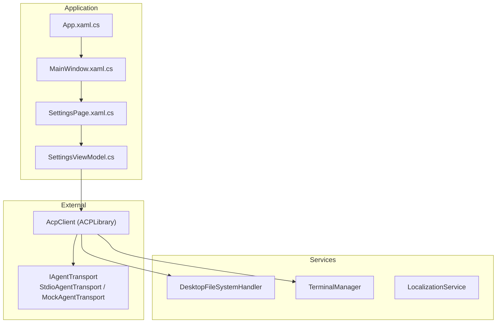
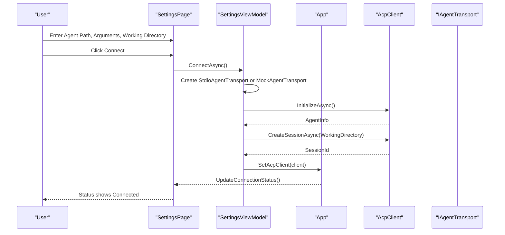
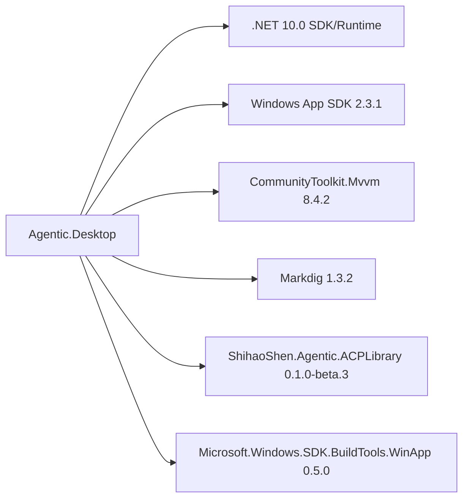

# Getting Started

<cite>
**Referenced Files in This Document**
- [README.md](file://README.md)
- [Agentic.Desktop.csproj](file://Agentic.Desktop/Agentic.Desktop.csproj)
- [global.json](file://global.json)
- [Directory.Build.props](file://Directory.Build.props)
- [App.xaml.cs](file://Agentic.Desktop/App.xaml.cs)
- [SettingsPage.xaml.cs](file://Agentic.Desktop/SettingsPage.xaml.cs)
- [SettingsViewModel.cs](file://Agentic.Desktop/ViewModels/SettingsViewModel.cs)
- [MainWindow.xaml.cs](file://Agentic.Desktop/MainWindow.xaml.cs)
- [launchSettings.json](file://Agentic.Desktop/Properties/launchSettings.json)
- [Resources.resw](file://Agentic.Desktop/Strings/en/Resources.resw)
</cite>

## Table of Contents
1. [Introduction](#introduction)
2. [Project Structure](#project-structure)
3. [Core Components](#core-components)
4. [Architecture Overview](#architecture-overview)
5. [Detailed Component Analysis](#detailed-component-analysis)
6. [Dependency Analysis](#dependency-analysis)
7. [Performance Considerations](#performance-considerations)
8. [Troubleshooting Guide](#troubleshooting-guide)
9. [Conclusion](#conclusion)
10. [Appendices](#appendices)

## Introduction
This guide helps you set up and run Agentic.Desktop on Windows. You will install the required tools, clone the repository, build the project for x64, and launch it using the WinApp CLI. You will also configure the Agent path, optional parameters, and working directory to connect to a real ACP-compatible agent or use the built-in mock agent.

## Project Structure
Agentic.Desktop is a WinUI 3 desktop application that communicates with an external ACP agent via stdio or a mock transport. The UI is organized into pages (Chat and Settings), with MVVM view models handling connection state and user interactions.

**Diagram sources**
- [App.xaml.cs:18-84](file://Agentic.Desktop/App.xaml.cs#L18-L84)
- [MainWindow.xaml.cs:14-96](file://Agentic.Desktop/MainWindow.xaml.cs#L14-L96)
- [SettingsPage.xaml.cs:10-95](file://Agentic.Desktop/SettingsPage.xaml.cs#L10-L95)
- [SettingsViewModel.cs:15-161](file://Agentic.Desktop/ViewModels/SettingsViewModel.cs#L15-L161)

**Section sources**
- [README.md:1-92](file://README.md#L1-L92)
- [Agentic.Desktop.csproj:1-79](file://Agentic.Desktop/Agentic.Desktop.csproj#L1-L79)

## Core Components
- Application entrypoint initializes logging, creates the main window, and exposes global references for UI thread dispatching and window handle.
- Settings page manages Agent configuration and connection lifecycle. It wires permission and file system handlers and updates the title bar status.
- Settings ViewModel handles connecting/disconnecting, creating sessions, and managing terminal integration.
- MainWindow provides navigation between Chat and Settings and displays connection status.

Key responsibilities:
- App: global logger factory, window reference, dispatcher queue, current AcpClient.
- SettingsPage: binds UI to shared SettingsViewModel, sets up permission and file handlers, updates status.
- SettingsViewModel: connects via StdioAgentTransport or MockAgentTransport, initializes AcpClient, creates session, manages lifecycle events.
- MainWindow: UI shell and status indicator.

**Section sources**
- [App.xaml.cs:18-84](file://Agentic.Desktop/App.xaml.cs#L18-L84)
- [SettingsPage.xaml.cs:10-95](file://Agentic.Desktop/SettingsPage.xaml.cs#L10-L95)
- [SettingsViewModel.cs:15-161](file://Agentic.Desktop/ViewModels/SettingsViewModel.cs#L15-L161)
- [MainWindow.xaml.cs:14-96](file://Agentic.Desktop/MainWindow.xaml.cs#L14-L96)

## Architecture Overview
The app uses MVVM and communicates with agents through the ACPLibrary client over stdio or a mock transport. The settings flow configures the transport and establishes a session before enabling chat features.

**Diagram sources**
- [SettingsPage.xaml.cs:19-55](file://Agentic.Desktop/SettingsPage.xaml.cs#L19-L55)
- [SettingsViewModel.cs:60-126](file://Agentic.Desktop/ViewModels/SettingsViewModel.cs#L60-L126)
- [App.xaml.cs:78-84](file://Agentic.Desktop/App.xaml.cs#L78-L84)

## Detailed Component Analysis

### Installation Requirements
- Operating System: Windows 10 1809 (Build 17763) or later.
- .NET SDK: version 10.0.100 (as pinned by global.json).
- Windows App SDK: version 2.3.1 (via NuGet package).
- WinApp CLI: installed globally as a dotnet tool.
- Developer Mode: enabled in Windows Settings.

These requirements are documented in the project README and enforced by the project’s target framework and SDK pinning.

**Section sources**
- [README.md:24-38](file://README.md#L24-L38)
- [global.json:1-8](file://global.json#L1-L8)
- [Agentic.Desktop.csproj:4-17](file://Agentic.Desktop/Agentic.Desktop.csproj#L4-L17)

### Step-by-step Setup

1. Install prerequisites
   - Install .NET SDK 10.0.x (ensure version 10.0.100 or compatible roll-forward).
   - Install Windows App SDK 2.3.1 components.
   - Install WinApp CLI globally: dotnet tool install -g winapp.
   - Enable Developer Mode in Windows Settings.

2. Clone the repository
   - Use git to clone the repository to your local machine.

3. Build the project for x64
   - From the repository root, run: dotnet build -p:Platform=x64.
   - The project targets net10.0-windows10.0.26100.0 and supports x64 platform.

4. Run the application
   - Use the WinApp CLI to run the packaged app: winapp run bin\x64\Debug\net10.0-windows10.0.26100.0\win-x64.
   - Alternatively, Visual Studio profiles support running as Package or Unpackaged.

Verification steps:
- Confirm the app launches and shows the default Chat page.
- Navigate to Settings; ensure fields for Agent Path, Agent Arguments, and Working Directory are visible.
- If no Agent Path is provided, the app should use the built-in Mock Agent.

**Section sources**
- [README.md:31-49](file://README.md#L31-L49)
- [Agentic.Desktop.csproj:4-17](file://Agentic.Desktop/Agentic.Desktop.csproj#L4-L17)
- [launchSettings.json:1-10](file://Agentic.Desktop/Properties/launchSettings.json#L1-L10)

### Initial Setup and Configuration

- Open the app and navigate to Settings.
- Configure Agent Path:
  - Leave empty to use the built-in Mock Agent for demo purposes.
  - Provide the full path to an ACP-compatible agent executable to connect to a real agent.
- Optional Agent Arguments:
  - Pass command-line arguments to the agent process when starting it.
- Working Directory:
  - Specify the working directory for the agent process.
  - Use the Browse button to select a folder.
- Connect:
  - Click Connect to establish a session.
  - The title bar status indicator reflects connection state (Disconnected, Connecting, Connected).

Behavior details:
- When connected, the app sets the current AcpClient globally and updates UI elements accordingly.
- Permission requests from the agent trigger a dialog for user approval.
- File operations are restricted to the configured working directory.

**Section sources**
- [SettingsPage.xaml.cs:19-55](file://Agentic.Desktop/SettingsPage.xaml.cs#L19-L55)
- [SettingsViewModel.cs:60-126](file://Agentic.Desktop/ViewModels/SettingsViewModel.cs#L60-L126)
- [Resources.resw:108-146](file://Agentic.Desktop/Strings/en/Resources.resw#L108-L146)

### Running and Verifying the Development Environment

- Build verification:
  - Ensure dotnet build -p:Platform=x64 completes without errors.
- Run verification:
  - Launch via winapp run and confirm the UI appears.
- Connection verification:
  - In Settings, leave Agent Path empty to test the Mock Agent.
  - Click Connect and verify the status changes to Connected.
  - Switch to Chat and send a message to validate end-to-end flow.

If you prefer Visual Studio debugging:
- Use the “Agentic.Desktop (Package)” or “Agentic.Desktop (Unpackaged)” profiles defined in launch settings.

**Section sources**
- [README.md:31-49](file://README.md#L31-L49)
- [launchSettings.json:1-10](file://Agentic.Desktop/Properties/launchSettings.json#L1-L10)
- [SettingsViewModel.cs:60-126](file://Agentic.Desktop/ViewModels/SettingsViewModel.cs#L60-L126)

## Dependency Analysis
Agentic.Desktop depends on:
- .NET 10.0 runtime and SDK (enforced by global.json).
- Windows App SDK 2.3.1 for WinUI 3 packaging and runtime.
- CommunityToolkit.Mvvm for MVVM primitives.
- Markdig for Markdown rendering.
- ShihaoShen.Agentic.ACPLibrary for ACP client functionality.
- Microsoft.Windows.SDK.BuildTools.WinApp for WinApp CLI integration.

**Diagram sources**
- [Agentic.Desktop.csproj:52-60](file://Agentic.Desktop/Agentic.Desktop.csproj#L52-L60)
- [global.json:1-8](file://global.json#L1-L8)

**Section sources**
- [Agentic.Desktop.csproj:52-60](file://Agentic.Desktop/Agentic.Desktop.csproj#L52-L60)
- [global.json:1-8](file://global.json#L1-L8)

## Performance Considerations
- Debug builds disable ReadyToRun and trimming for faster iteration.
- Release builds enable ReadyToRun and trimming to reduce startup time and binary size.
- Logging is set to Debug level during launch; consider adjusting for production scenarios.

[No sources needed since this section provides general guidance]

## Troubleshooting Guide

Common issues and resolutions:
- Missing .NET SDK 10.0.x:
  - Install the correct SDK version and ensure global.json resolves to a compatible roll-forward.
- Windows App SDK not installed:
  - Install Windows App SDK 2.3.1 components required for WinUI 3 packaging.
- WinApp CLI not found:
  - Install globally using dotnet tool install -g winapp and restart your terminal.
- Developer Mode disabled:
  - Enable Developer Mode in Windows Settings under System > For developers.
- Build fails for x64:
  - Ensure Platform=x64 is specified and the target framework matches net10.0-windows10.0.26100.0.
- App does not launch:
  - Verify the path used with winapp run points to the correct output directory for the selected platform and configuration.
- Connection fails:
  - Check Agent Path validity and permissions.
  - Review error messages in the UI status area.
  - Ensure the agent executable runs correctly from the specified Working Directory.

Verification checklist:
- dotnet build -p:Platform=x64 succeeds.
- winapp run launches the app and shows the UI.
- Settings page allows entering Agent Path, Arguments, and Working Directory.
- Connect transitions status to Connected; Chat page becomes interactive.

**Section sources**
- [README.md:24-49](file://README.md#L24-L49)
- [Agentic.Desktop.csproj:4-17](file://Agentic.Desktop/Agentic.Desktop.csproj#L4-L17)
- [SettingsViewModel.cs:115-126](file://Agentic.Desktop/ViewModels/SettingsViewModel.cs#L115-L126)

## Conclusion
You now have the prerequisites, build steps, and initial configuration needed to run Agentic.Desktop. Use the Settings page to connect to a real ACP agent or rely on the built-in Mock Agent to explore the UI. Refer to the troubleshooting section if you encounter setup issues.

[No sources needed since this section summarizes without analyzing specific files]

## Appendices

### Quick Commands Reference
- Clone repository: git clone <repository-url>
- Build for x64: dotnet build -p:Platform=x64
- Run with WinApp CLI: winapp run bin\x64\Debug\net10.0-windows10.0.26100.0\win-x64

**Section sources**
- [README.md:31-39](file://README.md#L31-L39)