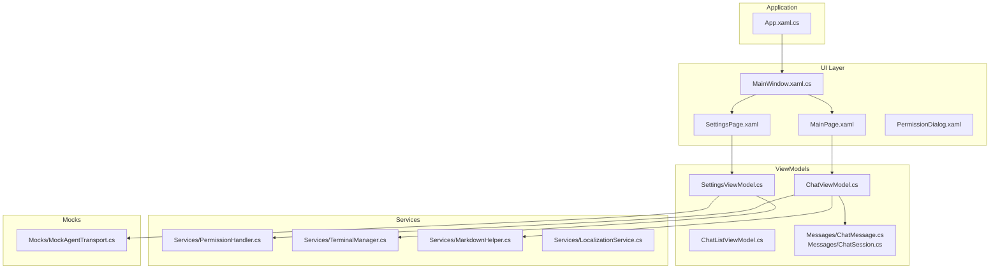
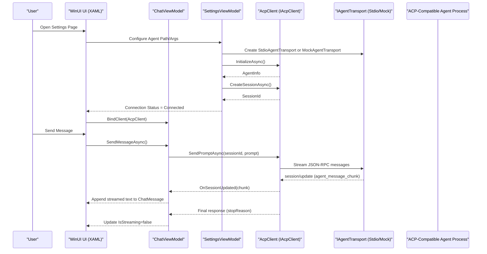
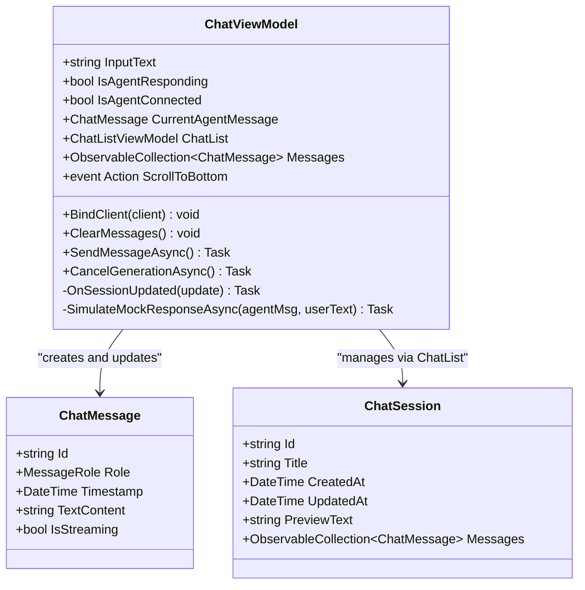
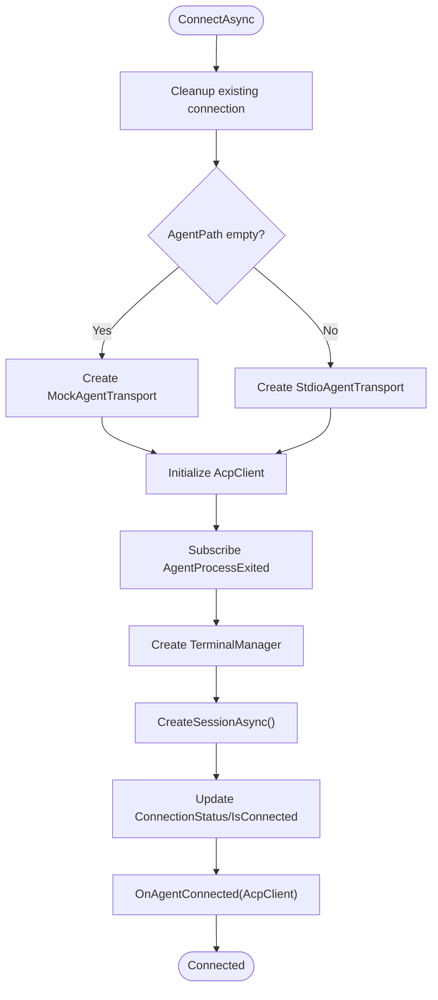
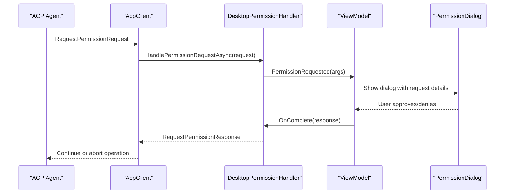
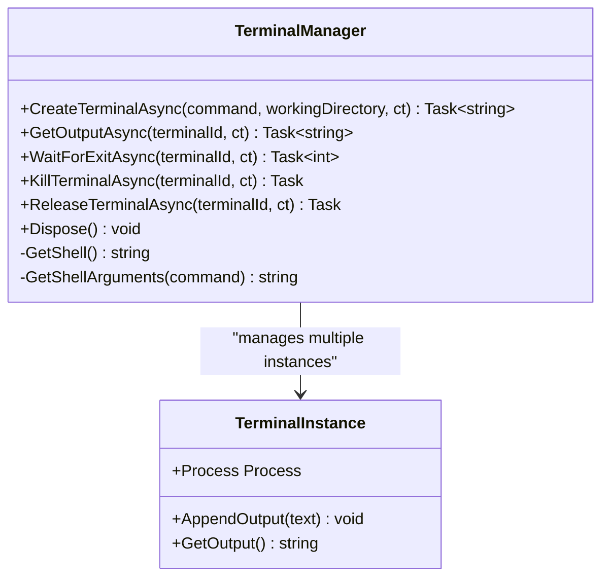
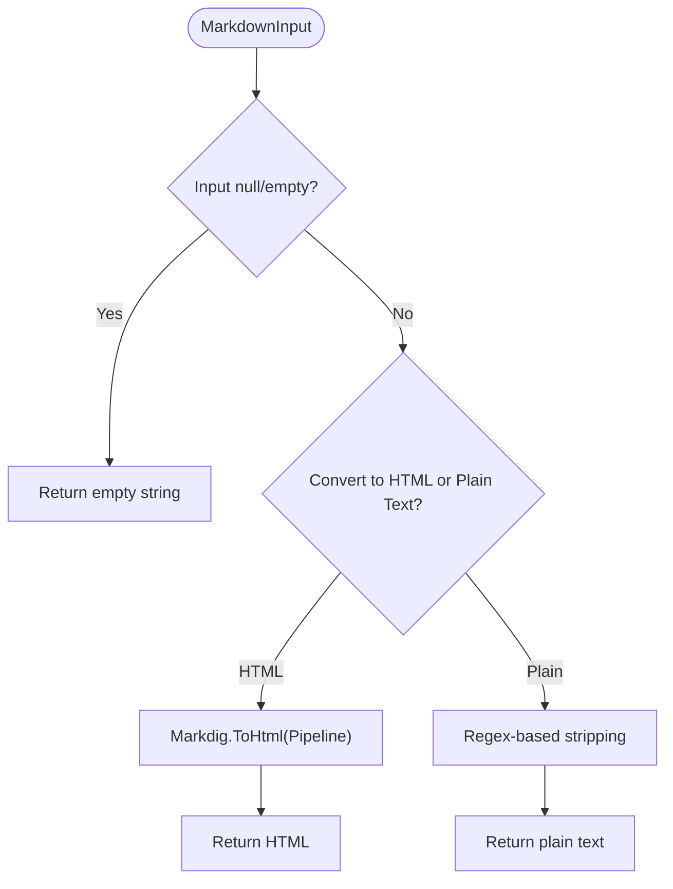
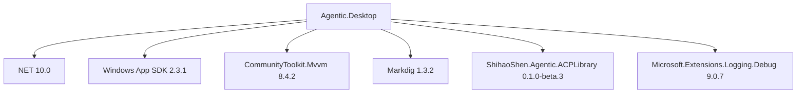

# Project Overview

<cite>
**Referenced Files in This Document**
- [README.md](file://README.md)
- [Agentic.Desktop.csproj](file://Agentic.Desktop/Agentic.Desktop.csproj)
- [global.json](file://global.json)
- [App.xaml.cs](file://Agentic.Desktop/App.xaml.cs)
- [MainWindow.xaml.cs](file://Agentic.Desktop/MainWindow.xaml.cs)
- [ChatViewModel.cs](file://Agentic.Desktop/ViewModels/ChatViewModel.cs)
- [SettingsViewModel.cs](file://Agentic.Desktop/ViewModels/SettingsViewModel.cs)
- [PermissionHandler.cs](file://Agentic.Desktop/Services/PermissionHandler.cs)
- [TerminalManager.cs](file://Agentic.Desktop/Services/TerminalManager.cs)
- [MarkdownHelper.cs](file://Agentic.Desktop/Services/MarkdownHelper.cs)
- [MockAgentTransport.cs](file://Agentic.Desktop/Mocks/MockAgentTransport.cs)
- [ChatMessage.cs](file://Agentic.Desktop/ViewModels/Messages/ChatMessage.cs)
- [ChatSession.cs](file://Agentic.Desktop/ViewModels/Messages/ChatSession.cs)
- [LocalizationService.cs](file://Agentic.Desktop/Services/LocalizationService.cs)
</cite>

## Table of Contents
1. [Introduction](#introduction)
2. [Project Structure](#project-structure)
3. [Core Components](#core-components)
4. [Architecture Overview](#architecture-overview)
5. [Detailed Component Analysis](#detailed-component-analysis)
6. [Dependency Analysis](#dependency-analysis)
7. [Performance Considerations](#performance-considerations)
8. [Troubleshooting Guide](#troubleshooting-guide)
9. [Conclusion](#conclusion)

## Introduction
Agentic.Desktop is a WinUI 3 desktop client for ACP (Agent Communication Protocol). Its purpose is to provide a modern, Fluent Design chat interface that lets users interact with ACP-compatible agents through a real-time streaming conversation experience. The application connects to any ACP agent executable via the stdio transport layer and supports features such as Markdown rendering, permission management, and terminal command execution initiated by agents. It also includes a built-in mock agent to demonstrate the full UI flow without requiring a real agent process.

The project targets .NET 10.0 and Windows App SDK 2.3.1, and leverages CommunityToolkit.Mvvm for MVVM, Markdig for Markdown processing, and ShihaoShen.Agentic.ACPLibrary for ACP protocol support.

Conceptually, ACP defines how AI agents communicate over a standardized JSON-RPC-like protocol. Agentic.Desktop implements the client side: it initializes an AcpClient, manages sessions, streams updates from agents, and presents them in a user-friendly chat UI. For developers new to ACP, think of ACP as a contract between your desktop app and external agent processes; for experienced developers, the architecture emphasizes decoupling via IAgentTransport and clear separation of concerns across ViewModels, Services, and Views.

Key terminology used throughout this document:
- ACP-compatible agents: Any external process implementing the ACP protocol that can be launched and communicated with via stdio.
- stdio transport layer: The communication channel that reads/writes JSON messages to the standard input/output of the agent process.
- MVVM pattern: Model-View-ViewModel architecture where ViewModels expose observable state and commands bound to XAML views.

Practical capabilities demonstrated by the application include:
- Real-time streaming conversations with incremental text chunks.
- Markdown rendering utilities for converting agent responses to HTML or plain text.
- Interactive permission management when agents request file system or terminal access.
- Terminal session management for executing shell commands on behalf of agents.

**Section sources**
- [README.md:1-92](file://README.md#L1-L92)
- [Agentic.Desktop.csproj:1-79](file://Agentic.Desktop/Agentic.Desktop.csproj#L1-L79)
- [global.json:1-8](file://global.json#L1-L8)

## Project Structure
The repository follows a feature-oriented layout with clear separation between Views, ViewModels, and Services:
- ViewModels implement MVVM logic and bind to XAML views.
- Services encapsulate cross-cutting concerns like permissions, terminal management, localization, and Markdown conversion.
- Mocks provide a testable transport implementation for development and demonstration.
- XAML pages define the UI, while code-behind handles navigation and window lifecycle.

**Diagram sources**
- [MainWindow.xaml.cs:1-97](file://Agentic.Desktop/MainWindow.xaml.cs#L1-L97)
- [App.xaml.cs:1-85](file://Agentic.Desktop/App.xaml.cs#L1-L85)
- [ChatViewModel.cs:1-235](file://Agentic.Desktop/ViewModels/ChatViewModel.cs#L1-L235)
- [SettingsViewModel.cs:1-162](file://Agentic.Desktop/ViewModels/SettingsViewModel.cs#L1-L162)
- [PermissionHandler.cs:1-52](file://Agentic.Desktop/Services/PermissionHandler.cs#L1-L52)
- [TerminalManager.cs:1-161](file://Agentic.Desktop/Services/TerminalManager.cs#L1-L161)
- [MarkdownHelper.cs:1-52](file://Agentic.Desktop/Services/MarkdownHelper.cs#L1-L52)
- [MockAgentTransport.cs:1-142](file://Agentic.Desktop/Mocks/MockAgentTransport.cs#L1-L142)
- [ChatMessage.cs:1-39](file://Agentic.Desktop/ViewModels/Messages/ChatMessage.cs#L1-L39)
- [ChatSession.cs:1-28](file://Agentic.Desktop/ViewModels/Messages/ChatSession.cs#L1-L28)

**Section sources**
- [README.md:51-71](file://README.md#L51-L71)

## Core Components
This section highlights the core components that power the application’s functionality and their responsibilities:

- Application bootstrap and global state:
  - App exposes the main window, dispatcher queue, native handle, and current AcpClient instance. It also raises events when the AcpClient changes.
- Navigation and windowing:
  - MainWindow hosts a NavigationView and switches between Chat and Settings pages. It updates connection status indicators based on ACP connection state.
- Chat interaction:
  - ChatViewModel manages message history, streaming updates, session selection, and cancellation. It binds to IAcpClient and updates UI via DispatcherQueue.
- Agent connection management:
  - SettingsViewModel creates and configures AcpClient using either StdioAgentTransport or MockAgentTransport. It handles initialization, session creation, and cleanup.
- Permissions:
  - DesktopPermissionHandler bridges ACP permission requests to UI dialogs, marshalling calls to the UI thread and returning user decisions asynchronously.
- Terminal management:
  - TerminalManager orchestrates multiple shell processes, reading stdout/stderr asynchronously and providing APIs to query output, wait for exit, kill, and release terminals.
- Markdown processing:
  - MarkdownHelper converts Markdown to HTML or plain text using Markdig, preparing content for future WebView2 integration or immediate plain-text display.
- Localization:
  - LocalizationService loads localized strings from .resw files and supports formatted messages.

These components collectively enable a robust, extensible desktop client for ACP agents.

**Section sources**
- [App.xaml.cs:1-85](file://Agentic.Desktop/App.xaml.cs#L1-L85)
- [MainWindow.xaml.cs:1-97](file://Agentic.Desktop/MainWindow.xaml.cs#L1-L97)
- [ChatViewModel.cs:1-235](file://Agentic.Desktop/ViewModels/ChatViewModel.cs#L1-L235)
- [SettingsViewModel.cs:1-162](file://Agentic.Desktop/ViewModels/SettingsViewModel.cs#L1-L162)
- [PermissionHandler.cs:1-52](file://Agentic.Desktop/Services/PermissionHandler.cs#L1-L52)
- [TerminalManager.cs:1-161](file://Agentic.Desktop/Services/TerminalManager.cs#L1-L161)
- [MarkdownHelper.cs:1-52](file://Agentic.Desktop/Services/MarkdownHelper.cs#L1-L52)
- [LocalizationService.cs:1-23](file://Agentic.Desktop/Services/LocalizationService.cs#L1-L23)

## Architecture Overview
Agentic.Desktop follows the MVVM pattern with clear separation between UI, ViewModels, and services. The ACP client communicates with agents via IAgentTransport, which abstracts the underlying transport (stdio or mock). The application uses a global AcpClient instance managed by App and shared across ViewModels.

**Diagram sources**
- [SettingsViewModel.cs:60-126](file://Agentic.Desktop/ViewModels/SettingsViewModel.cs#L60-L126)
- [ChatViewModel.cs:94-149](file://Agentic.Desktop/ViewModels/ChatViewModel.cs#L94-L149)
- [MockAgentTransport.cs:27-117](file://Agentic.Desktop/Mocks/MockAgentTransport.cs#L27-L117)

## Detailed Component Analysis

### ChatViewModel Analysis
ChatViewModel orchestrates the chat experience:
- Manages message collections and session switching.
- Streams incremental text updates from agents and batches UI updates to reduce churn.
- Handles tool call notifications and updates session previews.
- Supports cancellation of ongoing generation.

**Diagram sources**
- [ChatViewModel.cs:11-235](file://Agentic.Desktop/ViewModels/ChatViewModel.cs#L11-L235)
- [ChatMessage.cs:14-39](file://Agentic.Desktop/ViewModels/Messages/ChatMessage.cs#L14-L39)
- [ChatSession.cs:10-28](file://Agentic.Desktop/ViewModels/Messages/ChatSession.cs#L10-L28)

**Section sources**
- [ChatViewModel.cs:1-235](file://Agentic.Desktop/ViewModels/ChatViewModel.cs#L1-L235)
- [ChatMessage.cs:1-39](file://Agentic.Desktop/ViewModels/Messages/ChatMessage.cs#L1-L39)
- [ChatSession.cs:1-28](file://Agentic.Desktop/ViewModels/Messages/ChatSession.cs#L1-L28)

### SettingsViewModel Analysis
SettingsViewModel handles agent connection lifecycle:
- Creates IAgentTransport (Stdio or Mock).
- Initializes AcpClient, subscribes to process exit events, and sets up TerminalManager.
- Manages connection state and notifies ChatViewModel upon successful connection.

**Diagram sources**
- [SettingsViewModel.cs:60-126](file://Agentic.Desktop/ViewModels/SettingsViewModel.cs#L60-L126)
- [MockAgentTransport.cs:1-142](file://Agentic.Desktop/Mocks/MockAgentTransport.cs#L1-L142)

**Section sources**
- [SettingsViewModel.cs:1-162](file://Agentic.Desktop/ViewModels/SettingsViewModel.cs#L1-L162)

### Permission Management Analysis
DesktopPermissionHandler implements IPermissionHandler to bridge ACP permission requests to UI dialogs:
- Marshals requests to the UI thread.
- Raises an event for the ViewModel to show a ContentDialog.
- Returns user decision asynchronously.

**Diagram sources**
- [PermissionHandler.cs:11-52](file://Agentic.Desktop/Services/PermissionHandler.cs#L11-L52)

**Section sources**
- [PermissionHandler.cs:1-52](file://Agentic.Desktop/Services/PermissionHandler.cs#L1-L52)

### Terminal Management Analysis
TerminalManager implements ITerminalHandler to manage multiple shell processes:
- Spawns cmd.exe or /bin/sh depending on OS.
- Asynchronously reads stdout/stderr into buffers.
- Provides APIs to get output, wait for exit, kill, and release terminals.

**Diagram sources**
- [TerminalManager.cs:11-161](file://Agentic.Desktop/Services/TerminalManager.cs#L11-L161)

**Section sources**
- [TerminalManager.cs:1-161](file://Agentic.Desktop/Services/TerminalManager.cs#L1-L161)

### Markdown Rendering Analysis
MarkdownHelper provides utilities for converting Markdown to HTML or plain text:
- Uses Markdig pipeline with advanced extensions.
- ToHtml prepares content for potential WebView2 rendering.
- ToPlainText strips formatting markers for immediate display.

**Diagram sources**
- [MarkdownHelper.cs:10-52](file://Agentic.Desktop/Services/MarkdownHelper.cs#L10-L52)

**Section sources**
- [MarkdownHelper.cs:1-52](file://Agentic.Desktop/Services/MarkdownHelper.cs#L1-L52)

## Dependency Analysis
The project depends on several key libraries and frameworks:
- .NET 10.0 and Windows App SDK 2.3.1 for modern Windows desktop development.
- CommunityToolkit.Mvvm for MVVM infrastructure.
- Markdig for Markdown processing.
- ShihaoShen.Agentic.ACPLibrary for ACP protocol support.
- Microsoft.Extensions.Logging.Debug for logging.

**Diagram sources**
- [Agentic.Desktop.csproj:53-60](file://Agentic.Desktop/Agentic.Desktop.csproj#L53-L60)
- [global.json:1-8](file://global.json#L1-L8)

**Section sources**
- [Agentic.Desktop.csproj:1-79](file://Agentic.Desktop/Agentic.Desktop.csproj#L1-L79)
- [global.json:1-8](file://global.json#L1-L8)

## Performance Considerations
- Streaming updates are batched with a 50ms delay to reduce UI churn during high-frequency agent responses.
- DispatcherQueue is used to marshal UI updates safely from background threads.
- Terminal output is read asynchronously to avoid blocking the UI thread.
- Mock transport simulates realistic delays and chunked responses for testing UI responsiveness.

[No sources needed since this section provides general guidance]

## Troubleshooting Guide
Common issues and resolutions:
- Connection failures: Check agent path, arguments, and working directory. Review connection status messages and ensure developer mode is enabled.
- Permission dialog not appearing: Verify DesktopPermissionHandler is properly wired and UI thread marshalling is functioning.
- Terminal not responding: Ensure shell is available and process redirection is configured correctly.
- Markdown rendering limitations: Current implementation displays raw text; consider integrating WebView2 for rich HTML rendering.

**Section sources**
- [SettingsViewModel.cs:115-126](file://Agentic.Desktop/ViewModels/SettingsViewModel.cs#L115-L126)
- [PermissionHandler.cs:26-44](file://Agentic.Desktop/Services/PermissionHandler.cs#L26-L44)
- [TerminalManager.cs:16-68](file://Agentic.Desktop/Services/TerminalManager.cs#L16-L68)
- [MarkdownHelper.cs:6-9](file://Agentic.Desktop/Services/MarkdownHelper.cs#L6-L9)

## Conclusion
Agentic.Desktop provides a comprehensive, modern desktop client for interacting with ACP-compatible agents. Its MVVM architecture, robust transport abstraction, and rich feature set make it an excellent foundation for building intelligent desktop applications. The combination of real-time streaming, Markdown processing, permission management, and terminal control enables powerful agent interactions while maintaining a clean, maintainable codebase.

[No sources needed since this section summarizes without analyzing specific files]