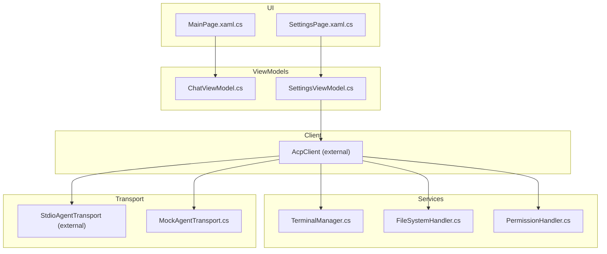
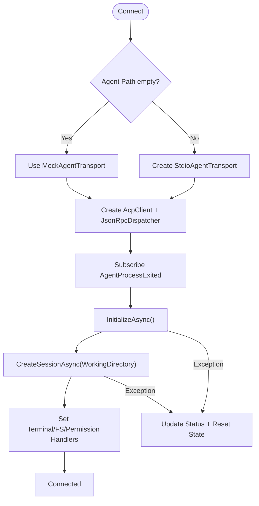
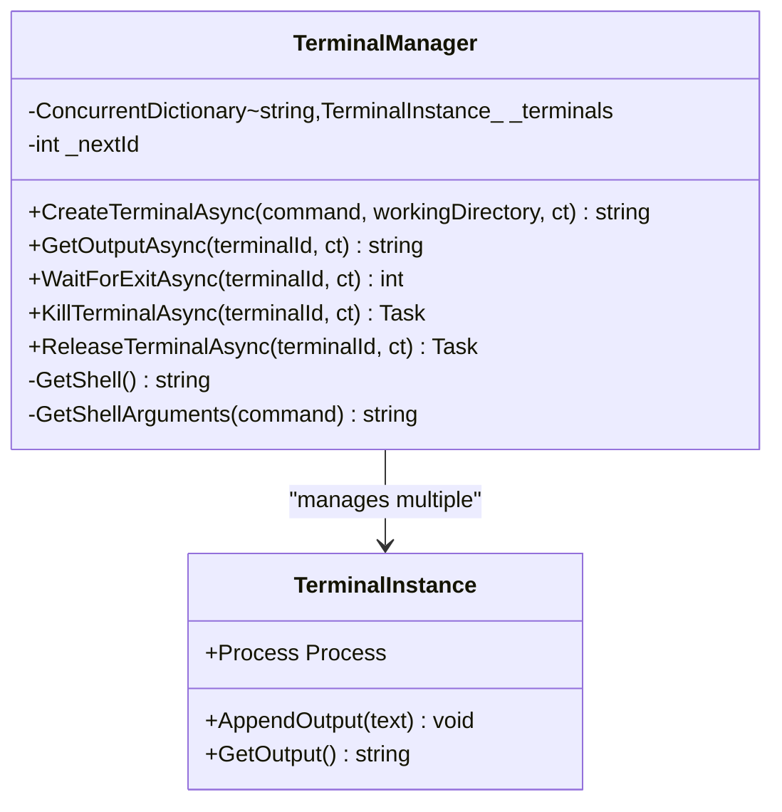
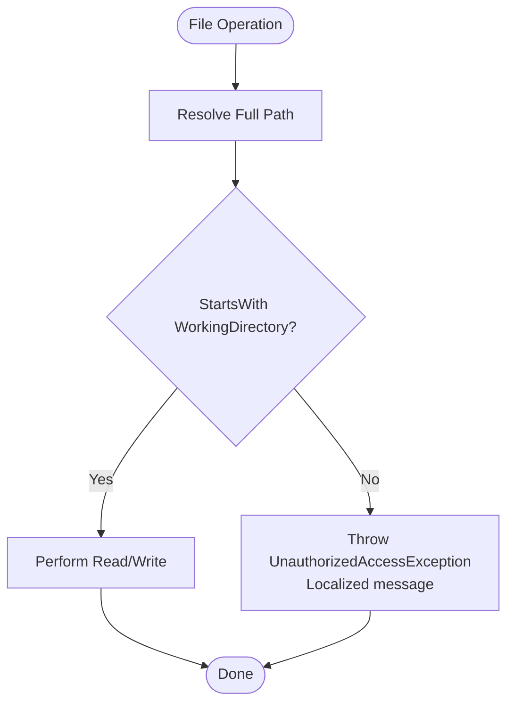
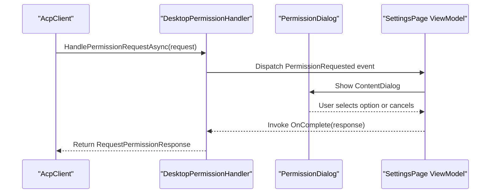
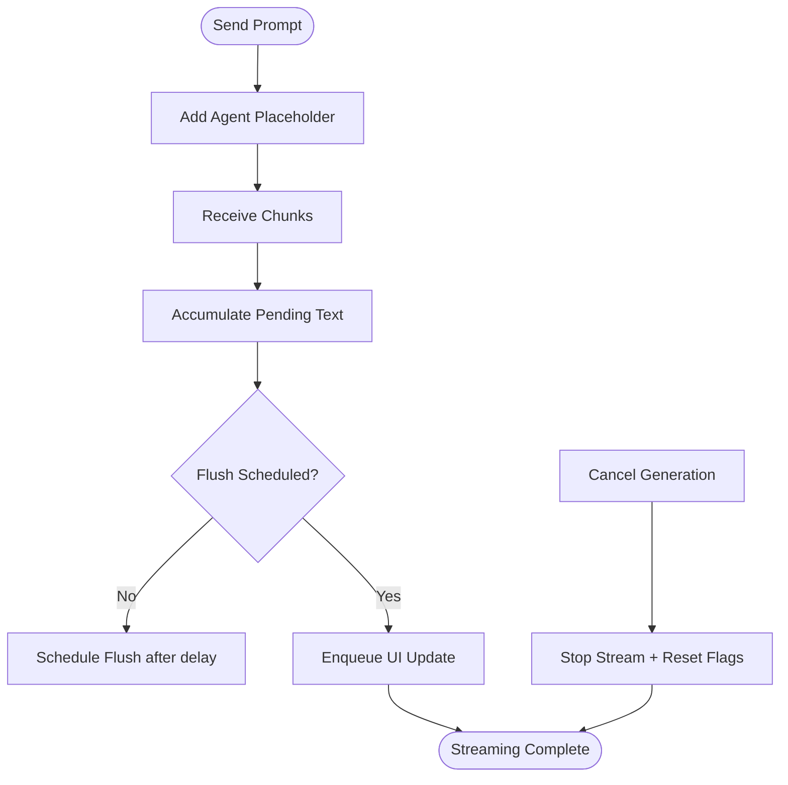
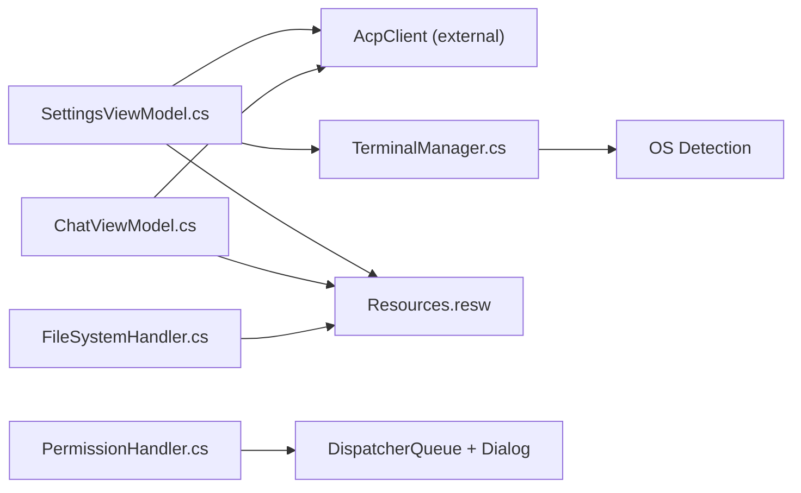

# Troubleshooting and FAQ

<cite>
**Referenced Files in This Document**
- [README.md](file://README.md)
- [App.xaml.cs](file://Agentic.Desktop/App.xaml.cs)
- [SettingsViewModel.cs](file://Agentic.Desktop/ViewModels/SettingsViewModel.cs)
- [ChatViewModel.cs](file://Agentic.Desktop/ViewModels/ChatViewModel.cs)
- [TerminalManager.cs](file://Agentic.Desktop/Services/TerminalManager.cs)
- [FileSystemHandler.cs](file://Agentic.Desktop/Services/FileSystemHandler.cs)
- [PermissionHandler.cs](file://Agentic.Desktop/Services/PermissionHandler.cs)
- [MockAgentTransport.cs](file://Agentic.Desktop/Mocks/MockAgentTransport.cs)
- [SettingsPage.xaml.cs](file://Agentic.Desktop/SettingsPage.xaml.cs)
- [MainPage.xaml.cs](file://Agentic.Desktop/MainPage.xaml.cs)
- [Resources.resw](file://Agentic.Desktop/Strings/en/Resources.resw)
</cite>

## Table of Contents
1. [Introduction](#introduction)
2. [Project Structure](#project-structure)
3. [Core Components](#core-components)
4. [Architecture Overview](#architecture-overview)
5. [Detailed Component Analysis](#detailed-component-analysis)
6. [Dependency Analysis](#dependency-analysis)
7. [Performance Considerations](#performance-considerations)
8. [Troubleshooting Guide](#troubleshooting-guide)
9. [Conclusion](#conclusion)
10. [Appendices](#appendices)

## Introduction
This document provides comprehensive troubleshooting guidance for Agentic.Desktop, a WinUI 3 desktop client that communicates with ACP (Agent Communication Protocol) agents via stdio or a built-in mock transport. It focuses on connection problems, terminal behavior, file system access, debugging techniques, logging configuration, performance profiling, environment-specific issues across Windows versions, and network connectivity when communicating with external agents. It also includes an FAQ covering ACP protocol compatibility, supported agent types, and performance optimization tips.

## Project Structure
Agentic.Desktop follows an MVVM architecture:
- UI layers are implemented in XAML pages and code-behind.
- ViewModels manage state and orchestrate interactions with the ACP client and services.
- Services encapsulate cross-cutting concerns such as terminal management, file system access, permissions, and localization.
- Mock transport enables UI development without a real agent.



**Diagram sources**
- [MainPage.xaml.cs](file://Agentic.Desktop/MainPage.xaml.cs)
- [SettingsPage.xaml.cs](file://Agentic.Desktop/SettingsPage.xaml.cs)
- [ChatViewModel.cs](file://Agentic.Desktop/ViewModels/ChatViewModel.cs)
- [SettingsViewModel.cs](file://Agentic.Desktop/ViewModels/SettingsViewModel.cs)
- [TerminalManager.cs](file://Agentic.Desktop/Services/TerminalManager.cs)
- [FileSystemHandler.cs](file://Agentic.Desktop/Services/FileSystemHandler.cs)
- [PermissionHandler.cs](file://Agentic.Desktop/Services/PermissionHandler.cs)
- [MockAgentTransport.cs](file://Agentic.Desktop/Mocks/MockAgentTransport.cs)

**Section sources**
- [README.md](file://README.md)

## Core Components
- Connection lifecycle and state management are handled in the settings flow, including initialization, session creation, and cleanup.
- Terminal execution is managed by a process-based manager that streams stdout/stderr and supports termination and release.
- File system access is restricted to the configured working directory to prevent boundary violations.
- Permission requests from agents are surfaced through a UI dialog and coordinated via a dispatcher queue.
- Logging is configured at application launch and used throughout the client.

Key responsibilities:
- SettingsViewModel: Connect/disconnect, initialize AcpClient, create sessions, handle process exit events, and coordinate services.
- ChatViewModel: Stream messages, batch updates, and cancel generation.
- TerminalManager: Start shell processes, stream output, wait for exit, kill/release terminals.
- DesktopFileSystemHandler: Validate paths against working directory and perform read/write operations.
- DesktopPermissionHandler: Marshal permission dialogs onto the UI thread and return user decisions.
- App: Initialize logging, expose window handle and dispatcher, and maintain current AcpClient.

**Section sources**
- [SettingsViewModel.cs](file://Agentic.Desktop/ViewModels/SettingsViewModel.cs)
- [ChatViewModel.cs](file://Agentic.Desktop/ViewModels/ChatViewModel.cs)
- [TerminalManager.cs](file://Agentic.Desktop/Services/TerminalManager.cs)
- [FileSystemHandler.cs](file://Agentic.Desktop/Services/FileSystemHandler.cs)
- [PermissionHandler.cs](file://Agentic.Desktop/Services/PermissionHandler.cs)
- [App.xaml.cs](file://Agentic.Desktop/App.xaml.cs)

## Architecture Overview
The application uses AcpClient to communicate with agents over stdio or a mock transport. The UI triggers actions via ViewModels, which interact with services and the client.

```mermaid
sequenceDiagram
participant User as "User"
participant Settings as "SettingsViewModel"
participant Client as "AcpClient"
participant Transport as "StdioAgentTransport / MockAgentTransport"
participant Term as "TerminalManager"
participant FS as "DesktopFileSystemHandler"
participant Perm as "DesktopPermissionHandler"
User->>Settings : Click Connect
Settings->>Transport : Create and start
Settings->>Client : InitializeAsync()
Client-->>Settings : AgentInfo
Settings->>Client : CreateSessionAsync(WorkingDirectory)
Client-->>Settings : SessionId
Settings->>Client : Set TerminalHandler = Term
Settings->>Client : Set FileSystemHandler = FS
Settings->>Client : Set PermissionHandler = Perm
Note over Settings,Client : Connected; notify UI
```

**Diagram sources**
- [SettingsViewModel.cs](file://Agentic.Desktop/ViewModels/SettingsViewModel.cs)
- [MockAgentTransport.cs](file://Agentic.Desktop/Mocks/MockAgentTransport.cs)
- [TerminalManager.cs](file://Agentic.Desktop/Services/TerminalManager.cs)
- [FileSystemHandler.cs](file://Agentic.Desktop/Services/FileSystemHandler.cs)
- [PermissionHandler.cs](file://Agentic.Desktop/Services/PermissionHandler.cs)

## Detailed Component Analysis

### Connection and Process Startup
- Connection flow initializes the transport, creates an AcpClient, subscribes to process exit events, and sets up handlers for terminal, file system, and permissions.
- Errors during connection update status messages and reset state.



**Diagram sources**
- [SettingsViewModel.cs](file://Agentic.Desktop/ViewModels/SettingsViewModel.cs)

**Section sources**
- [SettingsViewModel.cs](file://Agentic.Desktop/ViewModels/SettingsViewModel.cs)

### Terminal Management
- TerminalManager starts a shell process, streams stdout/stderr asynchronously, and manages lifecycle (wait, kill, release).
- On Windows, it uses cmd.exe; on other platforms, /bin/sh. Arguments are constructed per OS.



**Diagram sources**
- [TerminalManager.cs](file://Agentic.Desktop/Services/TerminalManager.cs)

**Section sources**
- [TerminalManager.cs](file://Agentic.Desktop/Services/TerminalManager.cs)

### File System Access Control
- DesktopFileSystemHandler enforces path validation to ensure all file operations remain within the configured working directory.
- Unauthorized attempts throw localized access denied errors.



**Diagram sources**
- [FileSystemHandler.cs](file://Agentic.Desktop/Services/FileSystemHandler.cs)

**Section sources**
- [FileSystemHandler.cs](file://Agentic.Desktop/Services/FileSystemHandler.cs)

### Permission Handling Flow
- DesktopPermissionHandler marshals permission requests to the UI thread and displays a dialog.
- The dialog returns either an allowed option or cancellation.



**Diagram sources**
- [PermissionHandler.cs](file://Agentic.Desktop/Services/PermissionHandler.cs)
- [SettingsPage.xaml.cs](file://Agentic.Desktop/SettingsPage.xaml.cs)

**Section sources**
- [PermissionHandler.cs](file://Agentic.Desktop/Services/PermissionHandler.cs)
- [SettingsPage.xaml.cs](file://Agentic.Desktop/SettingsPage.xaml.cs)

### Message Streaming and Cancellation
- ChatViewModel batches incoming text chunks and flushes them to the UI thread periodically.
- Cancellation stops ongoing prompts and resets streaming state.



**Diagram sources**
- [ChatViewModel.cs](file://Agentic.Desktop/ViewModels/ChatViewModel.cs)

**Section sources**
- [ChatViewModel.cs](file://Agentic.Desktop/ViewModels/ChatViewModel.cs)

## Dependency Analysis
- SettingsViewModel depends on AcpClient, TerminalManager, and localization resources.
- ChatViewModel depends on AcpClient and UI dispatcher for safe updates.
- TerminalManager depends on OS detection and process APIs.
- DesktopFileSystemHandler depends on path utilities and localization.
- DesktopPermissionHandler depends on DispatcherQueue and UI dialog.



**Diagram sources**
- [SettingsViewModel.cs](file://Agentic.Desktop/ViewModels/SettingsViewModel.cs)
- [ChatViewModel.cs](file://Agentic.Desktop/ViewModels/ChatViewModel.cs)
- [TerminalManager.cs](file://Agentic.Desktop/Services/TerminalManager.cs)
- [FileSystemHandler.cs](file://Agentic.Desktop/Services/FileSystemHandler.cs)
- [PermissionHandler.cs](file://Agentic.Desktop/Services/PermissionHandler.cs)
- [Resources.resw](file://Agentic.Desktop/Strings/en/Resources.resw)

**Section sources**
- [SettingsViewModel.cs](file://Agentic.Desktop/ViewModels/SettingsViewModel.cs)
- [ChatViewModel.cs](file://Agentic.Desktop/ViewModels/ChatViewModel.cs)
- [TerminalManager.cs](file://Agentic.Desktop/Services/TerminalManager.cs)
- [FileSystemHandler.cs](file://Agentic.Desktop/Services/FileSystemHandler.cs)
- [PermissionHandler.cs](file://Agentic.Desktop/Services/PermissionHandler.cs)
- [Resources.resw](file://Agentic.Desktop/Strings/en/Resources.resw)

## Performance Considerations
- Message batching reduces UI churn during streaming; consider tuning the flush interval based on expected throughput.
- Terminal output buffering should be sized appropriately to avoid excessive memory growth for long-running commands.
- Avoid frequent reconnections; reuse AcpClient instances where possible.
- Minimize synchronous I/O in hot paths; prefer async operations.
- Profile terminal process startup times and shell selection logic if latency is observed.

[No sources needed since this section provides general guidance]

## Troubleshooting Guide

### Connection Problems
Common symptoms:
- Cannot connect to agent executable.
- Permission denied when starting the agent.
- Process startup failures or immediate exit.

Resolution steps:
- Verify the agent executable path is correct and accessible. If left empty, the app uses the built-in mock transport for testing.
- Ensure the working directory exists and is writable by the application.
- Confirm the agent process can start under the current user context; check antivirus or security policies blocking execution.
- Inspect connection status messages and error details displayed in the UI.
- Review logs generated by the application logger factory.

Relevant implementation references:
- Connection setup and error handling: [SettingsViewModel.cs](file://Agentic.Desktop/ViewModels/SettingsViewModel.cs)
- Mock transport usage when no agent path is provided: [SettingsViewModel.cs](file://Agentic.Desktop/ViewModels/SettingsViewModel.cs), [MockAgentTransport.cs](file://Agentic.Desktop/Mocks/MockAgentTransport.cs)
- Logging configuration: [App.xaml.cs](file://Agentic.Desktop/App.xaml.cs)

**Section sources**
- [SettingsViewModel.cs](file://Agentic.Desktop/ViewModels/SettingsViewModel.cs)
- [MockAgentTransport.cs](file://Agentic.Desktop/Mocks/MockAgentTransport.cs)
- [App.xaml.cs](file://Agentic.Desktop/App.xaml.cs)

### Terminal Issues
Common symptoms:
- Shell compatibility problems (commands not recognized).
- Output streaming failures or missing stderr lines.
- Processes not terminating or lingering after disconnect.

Resolution steps:
- On Windows, the default shell is cmd.exe; ensure commands are compatible with cmd syntax. For POSIX shells, adjust arguments accordingly.
- Verify that stdout/stderr redirection is enabled and asynchronous reading loops are active.
- Use the kill and release methods to terminate and clean up terminal processes.
- Check for exceptions in output readers and ensure cancellation tokens propagate correctly.

Relevant implementation references:
- Shell selection and argument construction: [TerminalManager.cs](file://Agentic.Desktop/Services/TerminalManager.cs)
- Asynchronous output reading and error handling: [TerminalManager.cs](file://Agentic.Desktop/Services/TerminalManager.cs)
- Process lifecycle management (wait, kill, release): [TerminalManager.cs](file://Agentic.Desktop/Services/TerminalManager.cs)

**Section sources**
- [TerminalManager.cs](file://Agentic.Desktop/Services/TerminalManager.cs)

### File System Access Problems
Common symptoms:
- Path validation errors when accessing files outside the working directory.
- Working directory isolation causing unexpected file locations.
- Permission boundary violations due to insufficient privileges.

Resolution steps:
- Ensure all requested paths resolve within the configured working directory.
- Confirm the working directory is set correctly and has appropriate read/write permissions.
- Review localized access denied messages to understand which path was rejected.

Relevant implementation references:
- Path validation and access control: [FileSystemHandler.cs](file://Agentic.Desktop/Services/FileSystemHandler.cs)
- Localized error messages: [Resources.resw](file://Agentic.Desktop/Strings/en/Resources.resw)

**Section sources**
- [FileSystemHandler.cs](file://Agentic.Desktop/Services/FileSystemHandler.cs)
- [Resources.resw](file://Agentic.Desktop/Strings/en/Resources.resw)

### Debugging Techniques for WinUI 3 Applications
- Use the global logger factory to capture detailed logs at startup.
- Leverage the window handle for interop scenarios like file pickers and data transfer.
- Marshal UI updates using the dispatcher queue to avoid cross-thread exceptions.
- Inspect connection state changes and notifications to track lifecycle events.

Relevant implementation references:
- Logger factory initialization and minimum level: [App.xaml.cs](file://Agentic.Desktop/App.xaml.cs)
- Window handle exposure: [App.xaml.cs](file://Agentic.Desktop/App.xaml.cs)
- Dispatcher usage in permission handler and chat view model: [PermissionHandler.cs](file://Agentic.Desktop/Services/PermissionHandler.cs), [ChatViewModel.cs](file://Agentic.Desktop/ViewModels/ChatViewModel.cs)

**Section sources**
- [App.xaml.cs](file://Agentic.Desktop/App.xaml.cs)
- [PermissionHandler.cs](file://Agentic.Desktop/Services/PermissionHandler.cs)
- [ChatViewModel.cs](file://Agentic.Desktop/ViewModels/ChatViewModel.cs)

### Logging Configuration for Enhanced Diagnostics
- The application configures a debug logger with a minimum level of Debug at launch.
- Logs are emitted by the AcpClient and other components via the shared logger factory.
- Increase verbosity or add additional providers if deeper diagnostics are required.

Relevant implementation references:
- Logger factory setup: [App.xaml.cs](file://Agentic.Desktop/App.xaml.cs)

**Section sources**
- [App.xaml.cs](file://Agentic.Desktop/App.xaml.cs)

### Performance Profiling Strategies
- Measure time spent in connection initialization and session creation.
- Profile terminal process startup and output streaming throughput.
- Monitor UI update frequency and batch sizes during message streaming.
- Identify bottlenecks in path resolution and file I/O operations.

[No sources needed since this section provides general guidance]

### Environment-Specific Problems on Different Windows Versions
- Minimum supported version is Windows 10 1809 (Build 17763); earlier versions may lack required APIs.
- Ensure developer mode is enabled for running unpackaged apps.
- Verify .NET SDK and WinApp CLI tooling are installed and available.

Relevant implementation references:
- Target platform and framework requirements: [README.md](file://README.md)

**Section sources**
- [README.md](file://README.md)

### Network Connectivity Issues When Communicating with External Agents
- If using a remote agent via stdio over network transports, verify firewall rules and proxy settings.
- Confirm that the agent process can bind to required endpoints and accept connections.
- Inspect transport fault events and retry strategies if applicable.

[No sources needed since this section provides general guidance]

### Step-by-Step Resolution Guides for Frequent Issues
- Cannot connect to agent:
  - Open Settings, enter a valid agent executable path or leave empty to use mock.
  - Click Connect and observe status messages.
  - If failed, review error details and logs.
- Terminal commands fail:
  - Ensure command syntax matches the selected shell (cmd.exe on Windows).
  - Check working directory and permissions.
  - Kill and restart terminal sessions if necessary.
- File access denied:
  - Verify the target path is within the configured working directory.
  - Adjust working directory or request permissions if needed.

Relevant implementation references:
- Connection flow and status updates: [SettingsViewModel.cs](file://Agentic.Desktop/ViewModels/SettingsViewModel.cs)
- Terminal lifecycle and output: [TerminalManager.cs](file://Agentic.Desktop/Services/TerminalManager.cs)
- File system validation: [FileSystemHandler.cs](file://Agentic.Desktop/Services/FileSystemHandler.cs)

**Section sources**
- [SettingsViewModel.cs](file://Agentic.Desktop/ViewModels/SettingsViewModel.cs)
- [TerminalManager.cs](file://Agentic.Desktop/Services/TerminalManager.cs)
- [FileSystemHandler.cs](file://Agentic.Desktop/Services/FileSystemHandler.cs)

## Conclusion
Agentic.Desktop provides a robust foundation for interacting with ACP-compatible agents through a modern WinUI 3 interface. By understanding the connection lifecycle, terminal management, file system controls, and permission flows, users can diagnose and resolve common issues effectively. Leveraging logging, debugging tools, and performance profiling will further enhance reliability and responsiveness.

[No sources needed since this section summarizes without analyzing specific files]

## Appendices

### FAQ
- What ACP protocol versions are supported?
  - The client uses the ACP library’s JSON-RPC dispatcher and transport abstractions. Compatibility depends on the agent implementation adhering to the same protocol expectations.
- Which agent types are supported?
  - Any ACP-compatible agent executable can be launched via stdio. The built-in mock transport is available for UI development without a real agent.
- How can I optimize performance?
  - Tune message streaming batch intervals, minimize unnecessary reconnections, and ensure efficient terminal output handling.
- How do I enable verbose logging?
  - The logger factory is initialized at startup with Debug level; additional providers can be added to capture more detail.
- Why does my terminal command not work?
  - Commands must match the selected shell syntax. On Windows, cmd.exe is used by default; adjust arguments accordingly.
- How do I fix file access denied errors?
  - Ensure the requested path resolves within the configured working directory and that the application has sufficient permissions.

[No sources needed since this section provides general guidance]