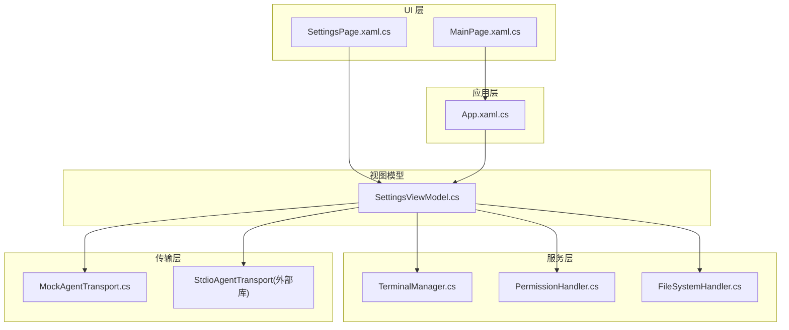
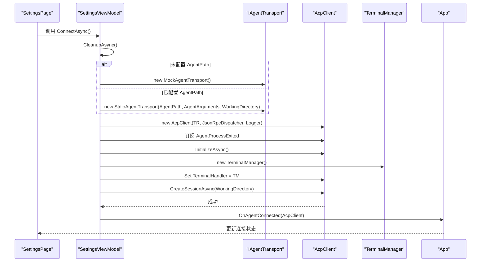
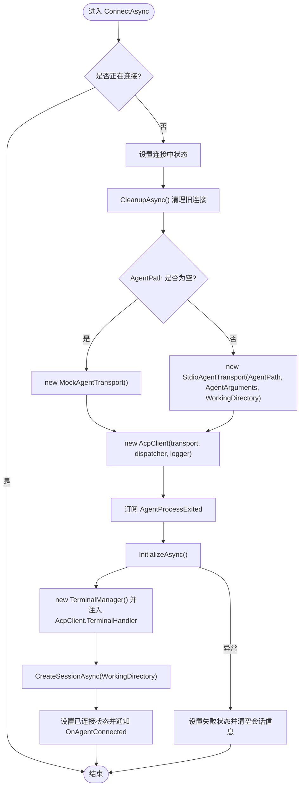
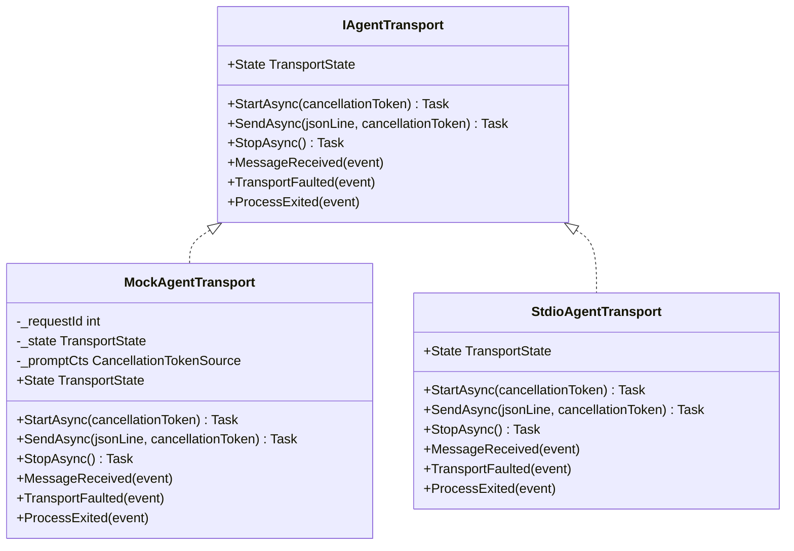
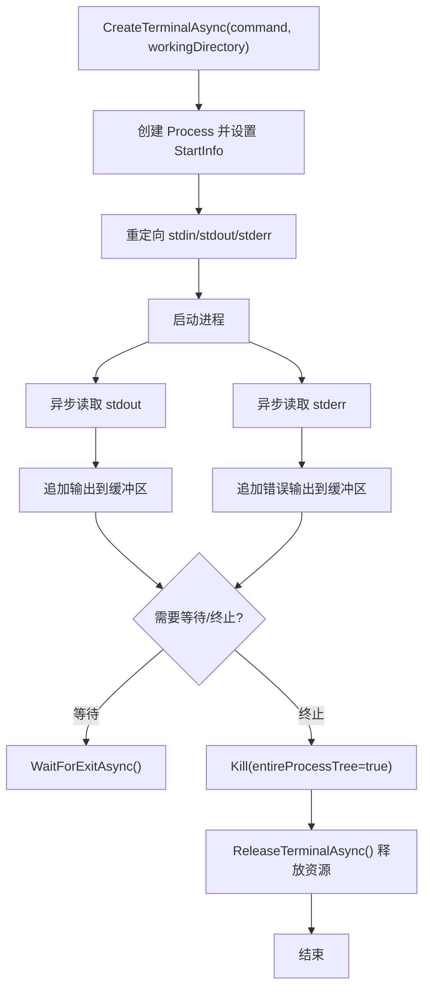
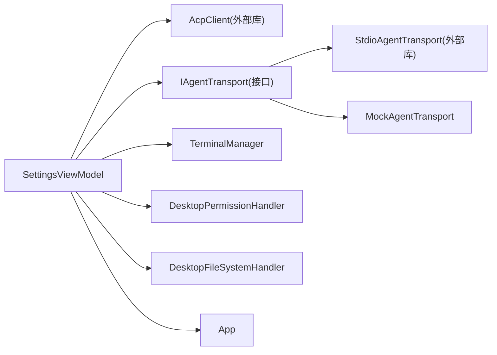

# Agent 连接管理

<cite>
**本文引用的文件**   
- [SettingsViewModel.cs](file://Agentic.Desktop/ViewModels/SettingsViewModel.cs)
- [MockAgentTransport.cs](file://Agentic.Desktop/Mocks/MockAgentTransport.cs)
- [TerminalManager.cs](file://Agentic.Desktop/Services/TerminalManager.cs)
- [PermissionHandler.cs](file://Agentic.Desktop/Services/PermissionHandler.cs)
- [FileSystemHandler.cs](file://Agentic.Desktop/Services/FileSystemHandler.cs)
- [App.xaml.cs](file://Agentic.Desktop/App.xaml.cs)
- [SettingsPage.xaml.cs](file://Agentic.Desktop/SettingsPage.xaml.cs)
- [MainPage.xaml.cs](file://Agentic.Desktop/MainPage.xaml.cs)
- [SettingsPage.xaml](file://Agentic.Desktop/SettingsPage.xaml)
</cite>

## 目录
1. [简介](#简介)
2. [项目结构](#项目结构)
3. [核心组件](#核心组件)
4. [架构总览](#架构总览)
5. [详细组件分析](#详细组件分析)
6. [依赖关系分析](#依赖关系分析)
7. [性能与可靠性考虑](#性能与可靠性考虑)
8. [故障排查指南](#故障排查指南)
9. [结论](#结论)
10. [附录：配置示例与自定义传输层实现指南](#附录配置示例与自定义传输层实现指南)

## 简介
本文件面向 Agent 连接管理功能，系统性说明 SettingsViewModel 的连接配置逻辑、进程生命周期管理与错误处理机制；详解 IAgentTransport 接口的两种实现（stdio 传输层与 Mock 传输层）的差异与使用场景；给出连接建立流程、进程启动参数与工作目录设置、环境变量配置要点；并覆盖连接状态监控、重连机制与异常处理策略。最后提供自定义传输层的实现指导，帮助开发者扩展新的通信通道。

## 项目结构
- ViewModels 层负责连接配置与生命周期控制（SettingsViewModel）。
- Services 层提供终端进程管理、权限与文件系统访问等能力（TerminalManager、DesktopPermissionHandler、DesktopFileSystemHandler）。
- Mocks 层提供用于 UI 开发的模拟传输（MockAgentTransport）。
- App 层维护全局 AcpClient 实例与事件通知（App.xaml.cs）。
- XAML 页面负责用户交互与状态展示（SettingsPage.xaml/.cs、MainPage.xaml.cs）。

图表来源
- [SettingsViewModel.cs:60-126](file://Agentic.Desktop/ViewModels/SettingsViewModel.cs#L60-L126)
- [MockAgentTransport.cs:21-124](file://Agentic.Desktop/Mocks/MockAgentTransport.cs#L21-L124)
- [TerminalManager.cs:16-98](file://Agentic.Desktop/Services/TerminalManager.cs#L16-L98)
- [PermissionHandler.cs:26-44](file://Agentic.Desktop/Services/PermissionHandler.cs#L26-L44)
- [FileSystemHandler.cs:17-41](file://Agentic.Desktop/Services/FileSystemHandler.cs#L17-L41)
- [App.xaml.cs:78-83](file://Agentic.Desktop/App.xaml.cs#L78-L83)
- [SettingsPage.xaml.cs:20-55](file://Agentic.Desktop/SettingsPage.xaml.cs#L20-L55)

章节来源
- [SettingsViewModel.cs:1-161](file://Agentic.Desktop/ViewModels/SettingsViewModel.cs#L1-L161)
- [MockAgentTransport.cs:1-142](file://Agentic.Desktop/Mocks/MockAgentTransport.cs#L1-L142)
- [TerminalManager.cs:1-161](file://Agentic.Desktop/Services/TerminalManager.cs#L1-L161)
- [PermissionHandler.cs:1-51](file://Agentic.Desktop/Services/PermissionHandler.cs#L1-L51)
- [FileSystemHandler.cs:1-41](file://Agentic.Desktop/Services/FileSystemHandler.cs#L1-L41)
- [App.xaml.cs:1-85](file://Agentic.Desktop/App.xaml.cs#L1-L85)
- [SettingsPage.xaml.cs:1-96](file://Agentic.Desktop/SettingsPage.xaml.cs#L1-L96)
- [SettingsPage.xaml:1-93](file://Agentic.Desktop/SettingsPage.xaml#L1-L93)

## 核心组件
- SettingsViewModel：集中管理连接配置（Agent 路径、参数、工作目录）、连接生命周期（初始化、会话创建、断开清理）、状态同步与事件通知。
- IAgentTransport 实现：
  - StdioAgentTransport：通过标准输入输出与外部 Agent 进程通信，支持进程启动参数与工作目录设置。
  - MockAgentTransport：纯内存模拟，返回预设的 JSON-RPC 响应，便于 UI 开发与演示。
- TerminalManager：管理多个终端子进程，异步读取 stdout/stderr，支持等待退出、强制终止与资源释放。
- DesktopPermissionHandler/DesktopFileSystemHandler：为 Agent 请求提供 UI 权限确认与受限的文件系统访问。
- App：全局持有当前连接的 IAcpClient，并提供连接状态变更事件。

章节来源
- [SettingsViewModel.cs:15-161](file://Agentic.Desktop/ViewModels/SettingsViewModel.cs#L15-L161)
- [MockAgentTransport.cs:9-142](file://Agentic.Desktop/Mocks/MockAgentTransport.cs#L9-L142)
- [TerminalManager.cs:11-161](file://Agentic.Desktop/Services/TerminalManager.cs#L11-L161)
- [PermissionHandler.cs:11-51](file://Agentic.Desktop/Services/PermissionHandler.cs#L11-L51)
- [FileSystemHandler.cs:8-41](file://Agentic.Desktop/Services/FileSystemHandler.cs#L8-L41)
- [App.xaml.cs:44-83](file://Agentic.Desktop/App.xaml.cs#L44-L83)

## 架构总览
连接建立的关键步骤由 SettingsViewModel 驱动，根据配置选择传输层，构造 AcpClient，完成初始化与会话创建，并将客户端暴露给 UI 层。

图表来源
- [SettingsViewModel.cs:60-126](file://Agentic.Desktop/ViewModels/SettingsViewModel.cs#L60-L126)
- [MockAgentTransport.cs:21-124](file://Agentic.Desktop/Mocks/MockAgentTransport.cs#L21-L124)
- [TerminalManager.cs:16-98](file://Agentic.Desktop/Services/TerminalManager.cs#L16-L98)
- [App.xaml.cs:78-83](file://Agentic.Desktop/App.xaml.cs#L78-L83)

## 详细组件分析

### SettingsViewModel：连接配置与生命周期管理
- 配置属性：
  - AgentPath：Agent 可执行文件路径（为空时启用 Mock 传输）。
  - AgentArguments：传递给 Agent 进程的命令行参数。
  - WorkingDirectory：工作目录，影响会话与终端进程的工作路径。
- 连接状态：
  - ConnectionState：0=未连接，1=连接中，2=已连接。
  - IsConnecting/IsConnected：UI 绑定用。
  - ConnectionStatus：本地化状态文本。
- 连接流程：
  - 先清理旧连接（取消事件订阅、关闭 AcpClient、释放 TerminalManager）。
  - 根据 AgentPath 选择传输层（Mock 或 Stdio）。
  - 构造 AcpClient，订阅进程退出事件，调用 InitializeAsync 获取 Agent 信息。
  - 创建 TerminalManager 并注入到 AcpClient。
  - 调用 CreateSessionAsync(WorkingDirectory) 建立会话。
  - 更新状态并通过 OnAgentConnected 通知 UI。
- 断开流程：
  - 调用 CleanupAsync 释放资源，重置状态，清空全局 AcpClient。
- 错误处理：
  - 捕获异常并设置失败状态文本，清空会话信息，回退到未连接状态。

图表来源
- [SettingsViewModel.cs:60-126](file://Agentic.Desktop/ViewModels/SettingsViewModel.cs#L60-L126)

章节来源
- [SettingsViewModel.cs:15-161](file://Agentic.Desktop/ViewModels/SettingsViewModel.cs#L15-L161)

### IAgentTransport 接口实现对比：Stdio vs Mock
- StdioAgentTransport（外部库）：
  - 通过标准输入输出与外部 Agent 进程通信。
  - 支持传入进程启动参数与工作目录。
  - 适合真实部署环境，具备完整进程生命周期管理能力。
- MockAgentTransport（内部实现）：
  - 在内存中模拟 JSON-RPC 协议交互。
  - 对 initialize、session/new、session/prompt、session/cancel 等方法返回预设响应。
  - 支持流式消息推送（session/update），便于 UI 开发演示。
  - 不依赖外部进程，启动快、无 IO 开销。

图表来源
- [MockAgentTransport.cs:9-142](file://Agentic.Desktop/Mocks/MockAgentTransport.cs#L9-L142)

章节来源
- [MockAgentTransport.cs:1-142](file://Agentic.Desktop/Mocks/MockAgentTransport.cs#L1-L142)

### 进程生命周期管理：TerminalManager
- 多实例管理：使用并发字典保存多个终端实例，每个实例封装一个 Process。
- 启动与输出：
  - 根据操作系统选择 shell（Windows 使用 cmd.exe，其他平台使用 /bin/sh）。
  - 异步读取 stdout 与 stderr 并追加到缓冲区。
- 生命周期控制：
  - WaitForExitAsync：等待进程退出并返回退出码。
  - KillTerminalAsync：强制终止进程树。
  - ReleaseTerminalAsync：从字典移除并释放进程资源。
  - Dispose：析构时确保所有子进程被终止并释放。

图表来源
- [TerminalManager.cs:16-98](file://Agentic.Desktop/Services/TerminalManager.cs#L16-L98)
- [TerminalManager.cs:100-128](file://Agentic.Desktop/Services/TerminalManager.cs#L100-L128)

章节来源
- [TerminalManager.cs:1-161](file://Agentic.Desktop/Services/TerminalManager.cs#L1-L161)

### 权限与文件系统访问
- DesktopPermissionHandler：
  - 将权限请求调度到 UI 线程，触发对话框让用户确认。
  - 通过 TaskCompletionSource 等待用户操作结果并返回。
- DesktopFileSystemHandler：
  - 限制文件访问范围在工作目录内，防止越权访问。
  - 读写前进行路径校验，拒绝非法路径并抛出异常。

章节来源
- [PermissionHandler.cs:11-51](file://Agentic.Desktop/Services/PermissionHandler.cs#L11-L51)
- [FileSystemHandler.cs:8-41](file://Agentic.Desktop/Services/FileSystemHandler.cs#L8-L41)

### 连接状态监控与全局共享
- App.CurrentAcpClient：全局持有当前连接的 AcpClient。
- App.AcpClientChanged：连接状态变化事件，供 MainPage 等订阅。
- SettingsPage：
  - 在连接成功后设置 PermissionHandler 与 FileSystemHandler。
  - 监听 ViewModel 的属性变化以更新窗口标题栏的连接状态。
- MainPage：
  - 若已有连接则立即绑定，否则订阅 App.AcpClientChanged 动态绑定。
  - 断开时清空消息列表。

章节来源
- [App.xaml.cs:44-83](file://Agentic.Desktop/App.xaml.cs#L44-L83)
- [SettingsPage.xaml.cs:20-55](file://Agentic.Desktop/SettingsPage.xaml.cs#L20-L55)
- [MainPage.xaml.cs:26-46](file://Agentic.Desktop/MainPage.xaml.cs#L26-L46)

## 依赖关系分析
- SettingsViewModel 依赖：
  - AcpClient（外部库）：负责 JSON-RPC 通信与会话管理。
  - IAgentTransport（接口）：抽象传输层，具体实现包括 StdioAgentTransport 与 MockAgentTransport。
  - TerminalManager：终端进程管理。
  - DesktopPermissionHandler/DesktopFileSystemHandler：权限与文件系统访问。
  - App：全局 AcpClient 与事件通知。
- 松耦合设计：
  - 通过接口 IAgentTransport 解耦传输实现，便于替换与测试。
  - 通过事件与回调（OnAgentConnected、OnAgentDisconnected、App.AcpClientChanged）解耦 UI 与业务逻辑。

图表来源
- [SettingsViewModel.cs:60-126](file://Agentic.Desktop/ViewModels/SettingsViewModel.cs#L60-L126)
- [MockAgentTransport.cs:9-142](file://Agentic.Desktop/Mocks/MockAgentTransport.cs#L9-L142)
- [TerminalManager.cs:11-161](file://Agentic.Desktop/Services/TerminalManager.cs#L11-L161)
- [PermissionHandler.cs:11-51](file://Agentic.Desktop/Services/PermissionHandler.cs#L11-L51)
- [FileSystemHandler.cs:8-41](file://Agentic.Desktop/Services/FileSystemHandler.cs#L8-L41)
- [App.xaml.cs:44-83](file://Agentic.Desktop/App.xaml.cs#L44-L83)

章节来源
- [SettingsViewModel.cs:1-161](file://Agentic.Desktop/ViewModels/SettingsViewModel.cs#L1-L161)
- [MockAgentTransport.cs:1-142](file://Agentic.Desktop/Mocks/MockAgentTransport.cs#L1-L142)
- [TerminalManager.cs:1-161](file://Agentic.Desktop/Services/TerminalManager.cs#L1-L161)
- [PermissionHandler.cs:1-51](file://Agentic.Desktop/Services/PermissionHandler.cs#L1-L51)
- [FileSystemHandler.cs:1-41](file://Agentic.Desktop/Services/FileSystemHandler.cs#L1-L41)
- [App.xaml.cs:1-85](file://Agentic.Desktop/App.xaml.cs#L1-L85)

## 性能与可靠性考虑
- 传输层选择：
  - Mock 传输层无 IO 开销，适合快速 UI 迭代与演示。
  - Stdio 传输层涉及进程启动与 IO，需注意进程启动时间与资源占用。
- 异步与并发：
  - TerminalManager 使用异步读取 stdout/stderr，避免阻塞 UI 线程。
  - 使用并发字典管理多终端实例，保证线程安全。
- 资源释放：
  - 明确 CleanupAsync 与 Dispose 的职责，确保进程与句柄释放。
  - 强制终止进程树以避免僵尸进程。
- 错误处理：
  - 连接失败时及时回滚状态，避免 UI 显示不一致。
  - 捕获 OperationCanceledException 处理取消场景。

[本节为通用指导，不直接分析具体文件]

## 故障排查指南
- 连接失败：
  - 检查 AgentPath 是否正确，AgentArguments 是否符合预期。
  - 查看 ConnectionStatus 中的失败原因（来自异常消息）。
  - 确认工作目录存在且可写。
- 进程意外退出：
  - 订阅 OnAgentDisconnected 获取退出码，定位问题。
  - 检查 Stdio 传输层日志（App.LoggerFactory 输出）。
- 权限拒绝：
  - 确认 DesktopFileSystemHandler 的路径校验逻辑，确保访问路径在工作目录内。
- 终端输出缺失：
  - 检查 TerminalManager 的异步读取任务是否正常执行。
  - 确认 stdout/stderr 重定向与缓冲写入逻辑。

章节来源
- [SettingsViewModel.cs:115-126](file://Agentic.Desktop/ViewModels/SettingsViewModel.cs#L115-L126)
- [SettingsPage.xaml.cs:46-55](file://Agentic.Desktop/SettingsPage.xaml.cs#L46-L55)
- [PermissionHandler.cs:26-44](file://Agentic.Desktop/Services/PermissionHandler.cs#L26-L44)
- [FileSystemHandler.cs:32-41](file://Agentic.Desktop/Services/FileSystemHandler.cs#L32-L41)
- [TerminalManager.cs:38-64](file://Agentic.Desktop/Services/TerminalManager.cs#L38-L64)

## 结论
SettingsViewModel 作为连接管理的核心，通过清晰的配置属性与状态机驱动连接生命周期，结合 IAgentTransport 抽象实现了传输层的灵活替换。Stdio 传输层适用于生产环境，Mock 传输层便于开发与演示。TerminalManager 提供了健壮的终端进程管理能力，配合权限与文件系统处理器，构建了安全的 Agent 交互环境。通过事件与全局状态共享，UI 层能够实时反映连接状态并进行相应处理。

[本节为总结性内容，不直接分析具体文件]

## 附录：配置示例与自定义传输层实现指南

### 配置示例
- 使用 Mock 传输层（无需 Agent 路径）：
  - AgentPath：留空
  - AgentArguments：留空
  - WorkingDirectory：任意有效目录（如用户主目录）
- 使用 Stdio 传输层（真实 Agent 进程）：
  - AgentPath：Agent 可执行文件路径
  - AgentArguments：按 Agent 要求传递的参数（例如 --config=path/to/config.json）
  - WorkingDirectory：Agent 工作目录（影响会话与终端进程）

章节来源
- [SettingsPage.xaml:26-65](file://Agentic.Desktop/SettingsPage.xaml#L26-L65)
- [SettingsViewModel.cs:75-83](file://Agentic.Desktop/ViewModels/SettingsViewModel.cs#L75-L83)

### 连接建立流程
- 调用 ConnectAsync：
  - 清理旧连接
  - 选择传输层（Mock 或 Stdio）
  - 构造 AcpClient 并初始化
  - 注入 TerminalManager
  - 创建会话并更新状态
- 断开连接：
  - 调用 DisconnectAsync 清理资源并重置状态

章节来源
- [SettingsViewModel.cs:60-126](file://Agentic.Desktop/ViewModels/SettingsViewModel.cs#L60-L126)
- [SettingsViewModel.cs:128-140](file://Agentic.Desktop/ViewModels/SettingsViewModel.cs#L128-L140)

### 进程启动参数、工作目录与环境变量
- 进程启动参数：
  - 通过 AgentArguments 传入，具体格式取决于 Agent 实现。
- 工作目录设置：
  - WorkingDirectory 影响会话与终端进程的工作路径。
- 环境变量：
  - 如需设置环境变量，可在 StdioAgentTransport 的进程启动配置中添加（外部库实现细节）。
  - 当前代码未显式设置环境变量，可通过修改进程启动参数或外部库配置实现。

章节来源
- [SettingsViewModel.cs:82-83](file://Agentic.Desktop/ViewModels/SettingsViewModel.cs#L82-L83)
- [TerminalManager.cs:21-33](file://Agentic.Desktop/Services/TerminalManager.cs#L21-L33)

### 连接状态监控、重连机制与异常处理策略
- 连接状态监控：
  - ConnectionState、IsConnecting、IsConnected、ConnectionStatus 提供 UI 绑定。
  - App.AcpClientChanged 事件通知全局连接状态变化。
- 重连机制：
  - 当前代码未实现自动重连，建议在 OnAgentDisconnected 中引入重试逻辑（指数退避、最大重试次数）。
- 异常处理策略：
  - 捕获连接过程中的异常并更新状态。
  - 处理 OperationCanceledException 以支持取消操作。
  - 记录日志以便诊断问题。

章节来源
- [SettingsViewModel.cs:44-46](file://Agentic.Desktop/ViewModels/SettingsViewModel.cs#L44-L46)
- [SettingsViewModel.cs:115-126](file://Agentic.Desktop/ViewModels/SettingsViewModel.cs#L115-L126)
- [App.xaml.cs:46-47](file://Agentic.Desktop/App.xaml.cs#L46-L47)

### 自定义传输层实现指导
- 实现 IAgentTransport 接口：
  - StartAsync：启动传输通道（如打开网络套接字或管道）。
  - SendAsync：发送 JSON-RPC 消息。
  - StopAsync：停止传输通道。
  - State：返回当前传输状态（Created、Running、Stopped 等）。
  - 事件：
    - MessageReceived：接收消息时触发。
    - TransportFaulted：传输错误时触发。
    - ProcessExited：进程退出时触发（仅适用于基于进程的传输）。
- 注意事项：
  - 确保线程安全与异步操作的正确性。
  - 正确处理取消令牌与异常。
  - 合理管理资源（如网络连接、文件句柄）。
- 集成到 SettingsViewModel：
  - 在 ConnectAsync 中根据配置选择自定义传输层。
  - 注册到 AcpClient 并参与连接生命周期。

章节来源
- [MockAgentTransport.cs:9-142](file://Agentic.Desktop/Mocks/MockAgentTransport.cs#L9-L142)
- [SettingsViewModel.cs:73-83](file://Agentic.Desktop/ViewModels/SettingsViewModel.cs#L73-L83)