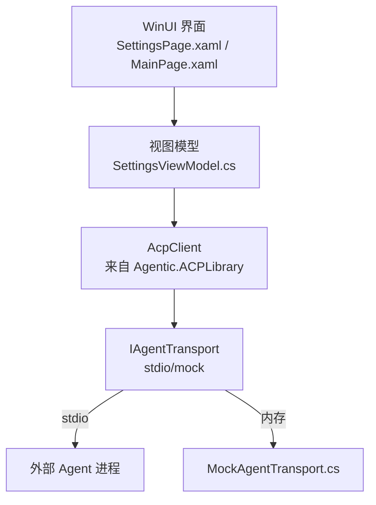
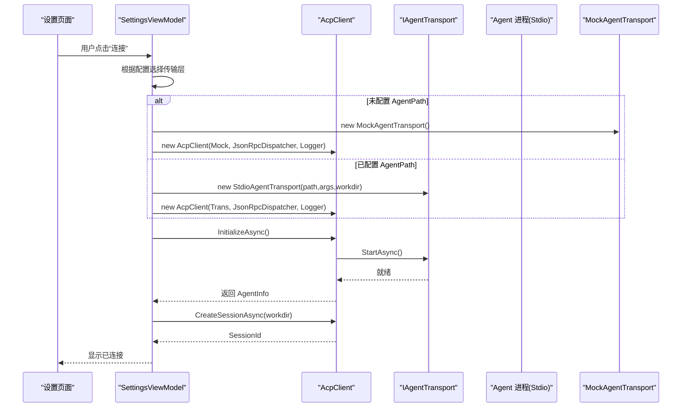
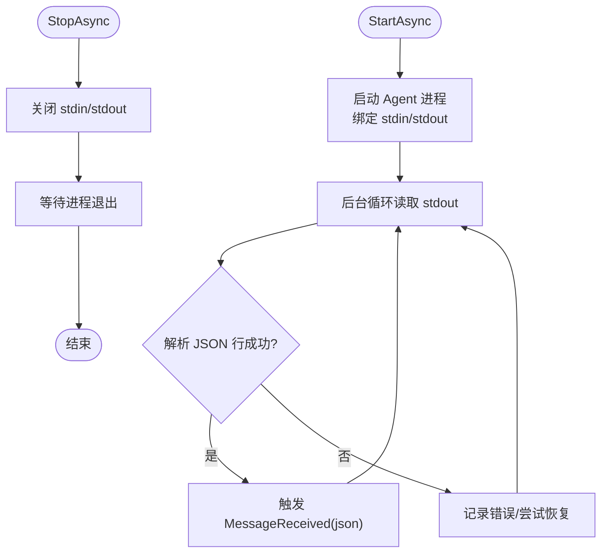
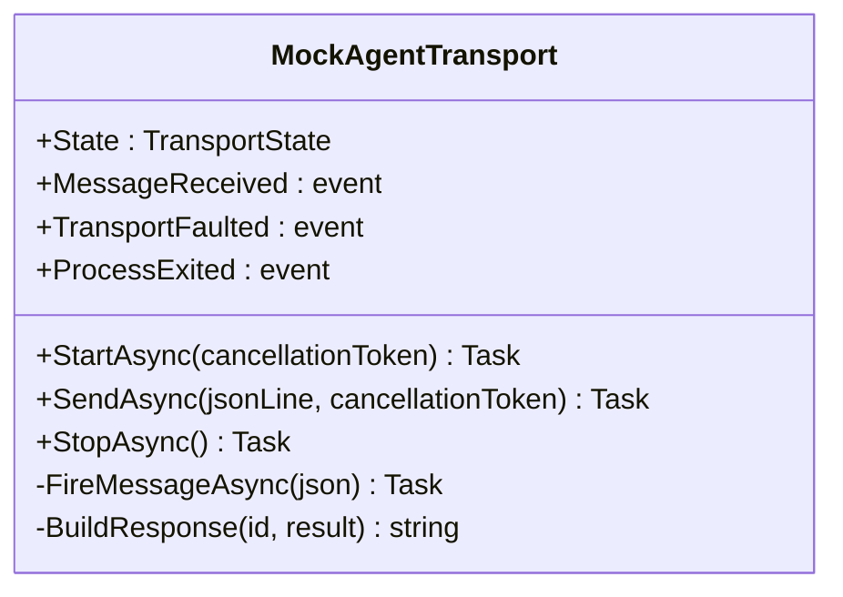
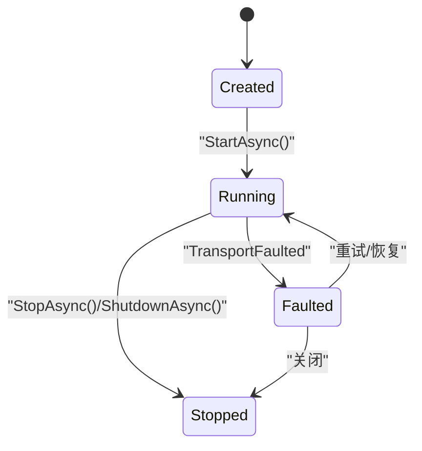
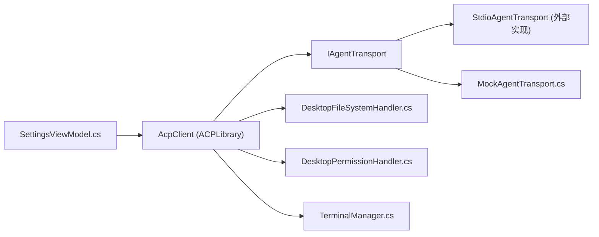

# 传输层架构

<cite>
**本文引用的文件**   
- [MockAgentTransport.cs](file://Agentic.Desktop/Mocks/MockAgentTransport.cs)
- [SettingsViewModel.cs](file://Agentic.Desktop/ViewModels/SettingsViewModel.cs)
- [README.md](file://README.md)
- [App.xaml.cs](file://Agentic.Desktop/App.xaml.cs)
- [SettingsPage.xaml](file://Agentic.Desktop/SettingsPage.xaml)
- [MainPage.xaml](file://Agentic.Desktop/MainPage.xaml)
- [PermissionHandler.cs](file://Agentic.Desktop/Services/PermissionHandler.cs)
- [FileSystemHandler.cs](file://Agentic.Desktop/Services/FileSystemHandler.cs)
- [TerminalManager.cs](file://Agentic.Desktop/Services/TerminalManager.cs)
- [Agentic.Desktop.csproj](file://Agentic.Desktop/Agentic.Desktop.csproj)
</cite>

## 目录
1. [简介](#简介)
2. [项目结构](#项目结构)
3. [核心组件](#核心组件)
4. [架构总览](#架构总览)
5. [详细组件分析](#详细组件分析)
6. [依赖关系分析](#依赖关系分析)
7. [性能考量](#性能考量)
8. [故障排查指南](#故障排查指南)
9. [结论](#结论)
10. [附录](#附录)

## 简介
本文件聚焦于传输层架构，围绕 IAgentTransport 接口的设计与实现展开，重点说明：
- StdioAgentTransport 的 stdio 通信机制（进程启动、标准输入输出重定向、消息传递）
- MockAgentTransport 的实现及其在测试与演示中的作用
- 传输层的生命周期管理、错误处理与异常恢复
- 自定义传输层实现的指导与最佳实践
- 数据传输格式、协议版本兼容性与性能优化策略

该桌面应用通过 AcpClient 与 Agent 进行通信，传输层由 IAgentTransport 抽象，具体实现包括基于 stdio 的进程间通信以及用于开发调试的 Mock 实现。

## 项目结构
传输层相关代码主要位于以下位置：
- Mock 实现：Agentic.Desktop/Mocks/MockAgentTransport.cs
- 连接与生命周期管理：Agentic.Desktop/ViewModels/SettingsViewModel.cs
- UI 配置入口：Agentic.Desktop/SettingsPage.xaml
- 应用全局上下文：Agentic.Desktop/App.xaml.cs
- 外部库引用（包含 ACP Library 及传输层接口定义）：Agentic.Desktop/Agentic.Desktop.csproj

图表来源
- [SettingsPage.xaml:1-120](file://Agentic.Desktop/SettingsPage.xaml#L1-L120)
- [MainPage.xaml:1-134](file://Agentic.Desktop/MainPage.xaml#L1-L134)
- [SettingsViewModel.cs:60-126](file://Agentic.Desktop/ViewModels/SettingsViewModel.cs#L60-L126)
- [MockAgentTransport.cs:1-142](file://Agentic.Desktop/Mocks/MockAgentTransport.cs#L1-L142)
- [Agentic.Desktop.csproj:54-60](file://Agentic.Desktop/Agentic.Desktop.csproj#L54-L60)

章节来源
- [README.md:1-92](file://README.md#L1-L92)
- [Agentic.Desktop.csproj:54-60](file://Agentic.Desktop/Agentic.Desktop.csproj#L54-L60)

## 核心组件
- IAgentTransport 接口：定义传输层的最小契约，包括 StartAsync、SendAsync、StopAsync、事件（MessageReceived、TransportFaulted、ProcessExited）和状态（State）。
- StdioAgentTransport：基于标准输入输出的进程间通信实现，负责启动外部 Agent 进程、读写 JSON-RPC 行、处理取消与错误。
- MockAgentTransport：纯内存实现，模拟 ACP 协议交互，便于 UI 开发与演示。
- SettingsViewModel：负责选择并创建传输层实例、初始化 AcpClient、建立会话、订阅进程退出事件、清理资源。
- App：提供全局日志工厂与窗口句柄等运行时上下文。

章节来源
- [SettingsViewModel.cs:60-126](file://Agentic.Desktop/ViewModels/SettingsViewModel.cs#L60-L126)
- [MockAgentTransport.cs:1-142](file://Agentic.Desktop/Mocks/MockAgentTransport.cs#L1-L142)
- [App.xaml.cs:1-73](file://Agentic.Desktop/App.xaml.cs#L1-L73)

## 架构总览
传输层处于 AcpClient 与外部 Agent 之间，屏蔽底层通信细节，向上暴露统一的请求/响应与事件通道。

图表来源
- [SettingsViewModel.cs:60-126](file://Agentic.Desktop/ViewModels/SettingsViewModel.cs#L60-L126)
- [MockAgentTransport.cs:1-142](file://Agentic.Desktop/Mocks/MockAgentTransport.cs#L1-L142)

## 详细组件分析

### IAgentTransport 接口设计与实现原理
- 设计目标：为不同通信后端（stdio、网络、内存）提供统一抽象，使 AcpClient 无需关心具体实现。
- 关键成员：
  - StartAsync：启动传输层（如启动子进程、打开管道）
  - SendAsync：发送一行 JSON 文本到对端
  - StopAsync：停止传输层（释放资源、关闭管道或进程）
  - State：当前状态（Created、Running、Stopped 等）
  - 事件：
    - MessageReceived：收到对端消息时触发
    - TransportFaulted：传输层发生错误时触发
    - ProcessExited：进程退出时触发（适用于 stdio）
- 实现要点：
  - 线程安全：SendAsync 与事件回调需保证并发安全
  - 取消支持：SendAsync 应接受 CancellationToken
  - 错误上报：异常通过 TransportFaulted 事件通知上层

章节来源
- [SettingsViewModel.cs:73-83](file://Agentic.Desktop/ViewModels/SettingsViewModel.cs#L73-L83)
- [MockAgentTransport.cs:1-142](file://Agentic.Desktop/Mocks/MockAgentTransport.cs#L1-L142)

### StdioAgentTransport 的 stdio 通信机制
- 进程启动：
  - 使用传入的可执行路径、参数与工作目录启动外部进程
  - 将进程的 StandardInput 与 StandardOutput 作为双向通道
- 消息传递：
  - 上行：SendAsync 将 JSON 行写入 StandardInput
  - 下行：后台任务持续读取 StandardOutput，逐行解析后触发 MessageReceived
- 生命周期：
  - StartAsync：启动进程并开始读流
  - StopAsync：关闭流、等待进程退出、释放资源
- 错误与恢复：
  - 捕获 IO 异常、进程崩溃等，触发 TransportFaulted
  - 可结合重试与退避策略提升鲁棒性

图表来源
- [SettingsViewModel.cs:80-83](file://Agentic.Desktop/ViewModels/SettingsViewModel.cs#L80-L83)

章节来源
- [SettingsViewModel.cs:80-83](file://Agentic.Desktop/ViewModels/SettingsViewModel.cs#L80-L83)

### MockAgentTransport 的实现与作用
- 作用：在不运行真实 Agent 的情况下，模拟 ACP 协议的 initialize、session/new、session/prompt、session/cancel 等交互，便于 UI 开发与演示。
- 行为特征：
  - 维护内部状态与请求 ID
  - 按方法名分发逻辑，生成符合 jsonrpc 2.0 的响应或通知
  - 支持 session/prompt 的分块流式响应与取消
  - 通过 MessageReceived 事件推送消息，TransportFaulted 上报异常
- 适用场景：
  - 前端联调、自动化测试、CI 环境无 Agent 时的回归测试

图表来源
- [MockAgentTransport.cs:1-142](file://Agentic.Desktop/Mocks/MockAgentTransport.cs#L1-L142)

章节来源
- [MockAgentTransport.cs:1-142](file://Agentic.Desktop/Mocks/MockAgentTransport.cs#L1-L142)

### 生命周期管理与错误处理
- 生命周期：
  - 创建传输层实例（Mock 或 Stdio）
  - 调用 StartAsync 启动
  - 通过 AcpClient.InitializeAsync 完成握手
  - 创建会话 CreateSessionAsync
  - 正常断开 ShutdownAsync，清理资源
- 错误处理：
  - 连接失败：捕获异常并更新 UI 状态
  - 进程退出：订阅 AgentProcessExited 事件，提示用户
  - 传输层异常：TransportFaulted 事件上报，便于统一处理

图表来源
- [SettingsViewModel.cs:60-126](file://Agentic.Desktop/ViewModels/SettingsViewModel.cs#L60-L126)
- [MockAgentTransport.cs:1-142](file://Agentic.Desktop/Mocks/MockAgentTransport.cs#L1-L142)

章节来源
- [SettingsViewModel.cs:60-126](file://Agentic.Desktop/ViewModels/SettingsViewModel.cs#L60-L126)

### 数据传输格式与协议兼容性
- 数据格式：JSON-RPC 2.0，每行一条 JSON 消息
- 关键字段：jsonrpc、method、id、params、result、error
- 版本兼容：
  - initialize 响应中包含 protocolVersion、agentCapabilities、agentInfo、authMethods
  - 客户端应根据协议版本与能力集决定功能启用
- 流式响应：
  - session/update 通知携带分块内容，最终以 stopReason 结束

章节来源
- [MockAgentTransport.cs:1-142](file://Agentic.Desktop/Mocks/MockAgentTransport.cs#L1-L142)

### 性能优化策略
- 缓冲与批处理：
  - 合理设置缓冲区大小，避免频繁小写
  - 批量发送合并减少系统调用开销
- 异步与取消：
  - 全面使用异步 I/O，避免阻塞 UI 线程
  - 及时取消长时间操作（如 prompt）
- 资源管理：
  - 确保 StopAsync/ShutdownAsync 正确释放进程与流
  - 避免重复订阅事件导致内存泄漏
- 序列化优化：
  - 复用 JsonSerializerOptions，减少分配
  - 避免不必要的对象装箱

[本节为通用建议，不直接分析具体文件]

## 依赖关系分析
- 应用层依赖 AcpClient，AcpClient 依赖 IAgentTransport
- SettingsViewModel 负责装配传输层与 AcpClient
- MockAgentTransport 仅依赖 ACPLibrary 的传输层接口
- 权限与文件系统处理通过服务层注入到 AcpClient

图表来源
- [SettingsViewModel.cs:60-126](file://Agentic.Desktop/ViewModels/SettingsViewModel.cs#L60-L126)
- [MockAgentTransport.cs:1-142](file://Agentic.Desktop/Mocks/MockAgentTransport.cs#L1-L142)
- [PermissionHandler.cs:1-51](file://Agentic.Desktop/Services/PermissionHandler.cs#L1-L51)
- [FileSystemHandler.cs:1-41](file://Agentic.Desktop/Services/FileSystemHandler.cs#L1-L41)
- [TerminalManager.cs](file://Agentic.Desktop/Services/TerminalManager.cs)

章节来源
- [Agentic.Desktop.csproj:54-60](file://Agentic.Desktop/Agentic.Desktop.csproj#L54-L60)

## 性能考量
- 传输层应尽量避免同步阻塞，所有 I/O 走异步
- 对于大消息或长流，采用分块与背压控制
- 减少 JSON 序列化/反序列化的开销，复用选项与对象池
- 监控与日志：记录关键路径耗时与错误率，便于定位瓶颈

[本节为通用建议，不直接分析具体文件]

## 故障排查指南
- 连接失败：
  - 检查 Agent 路径与参数是否正确
  - 查看 AcpClient 初始化异常信息
- 进程意外退出：
  - 订阅 AgentProcessExited 事件，获取退出码
  - 检查工作目录与权限
- 传输层异常：
  - 监听 TransportFaulted 事件，记录堆栈与上下文
- 权限问题：
  - DesktopFileSystemHandler 会校验路径是否在允许的工作目录内
  - DesktopPermissionHandler 通过 UI 线程调度弹出确认对话框

章节来源
- [SettingsViewModel.cs:89-95](file://Agentic.Desktop/ViewModels/SettingsViewModel.cs#L89-L95)
- [PermissionHandler.cs:1-51](file://Agentic.Desktop/Services/PermissionHandler.cs#L1-L51)
- [FileSystemHandler.cs:1-41](file://Agentic.Desktop/Services/FileSystemHandler.cs#L1-L41)

## 结论
传输层通过 IAgentTransport 抽象了不同的通信后端，使得 AcpClient 能够以统一方式与 Agent 交互。StdioAgentTransport 实现了标准的进程间通信，MockAgentTransport 提供了零依赖的开发与测试体验。良好的生命周期管理、错误处理与性能优化策略，是构建稳定可靠的传输层的关键。

[本节为总结，不直接分析具体文件]

## 附录

### 自定义传输层实现指南
- 必须实现 IAgentTransport 的所有成员：
  - StartAsync、SendAsync、StopAsync
  - 事件：MessageReceived、TransportFaulted、ProcessExited
  - 状态：State
- 最佳实践：
  - 保持线程安全与取消语义
  - 明确错误边界，避免未捕获异常
  - 提供清晰的日志与诊断信息
  - 考虑资源回收与超时控制

[本节为通用指导，不直接分析具体文件]

### 参考流程与入口
- 连接入口：SettingsViewModel.ConnectAsync
- 传输层选择：根据 AgentPath 是否为空选择 Mock 或 Stdio
- 会话建立：AcpClient.InitializeAsync 与 CreateSessionAsync

章节来源
- [SettingsViewModel.cs:60-126](file://Agentic.Desktop/ViewModels/SettingsViewModel.cs#L60-L126)
- [SettingsPage.xaml:1-120](file://Agentic.Desktop/SettingsPage.xaml#L1-L120)
- [MainPage.xaml:1-134](file://Agentic.Desktop/MainPage.xaml#L1-L134)
- [App.xaml.cs:1-73](file://Agentic.Desktop/App.xaml.cs#L1-L73)