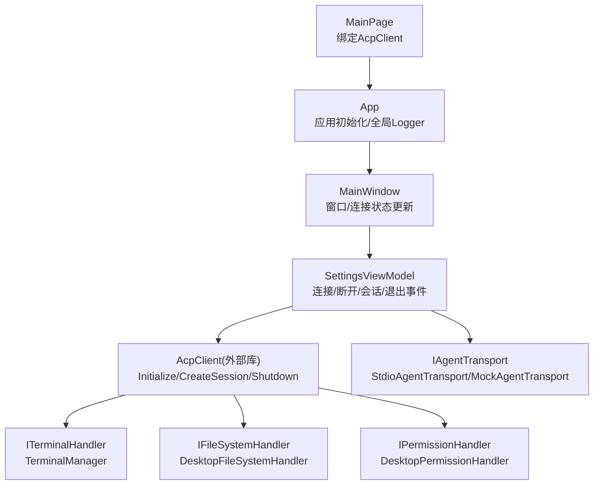
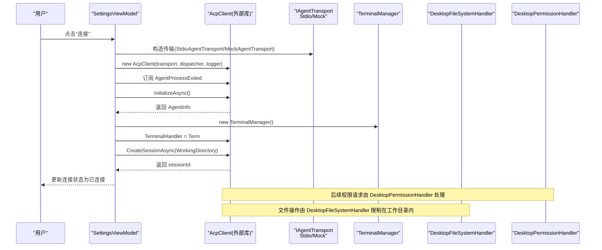
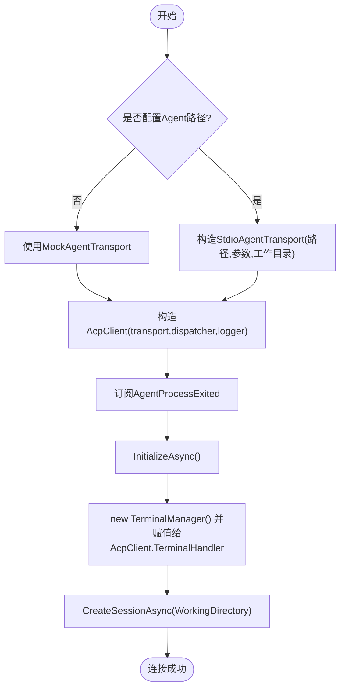
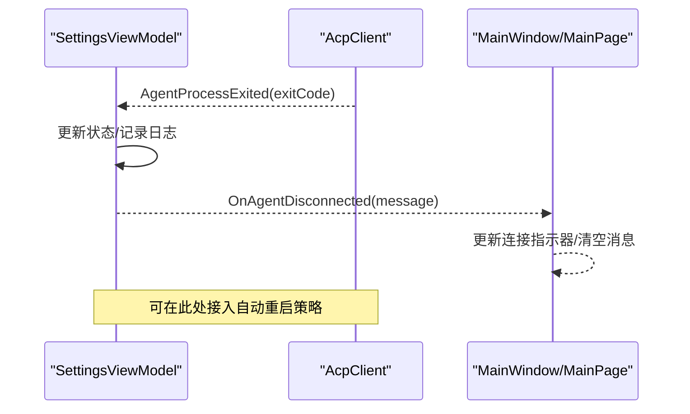
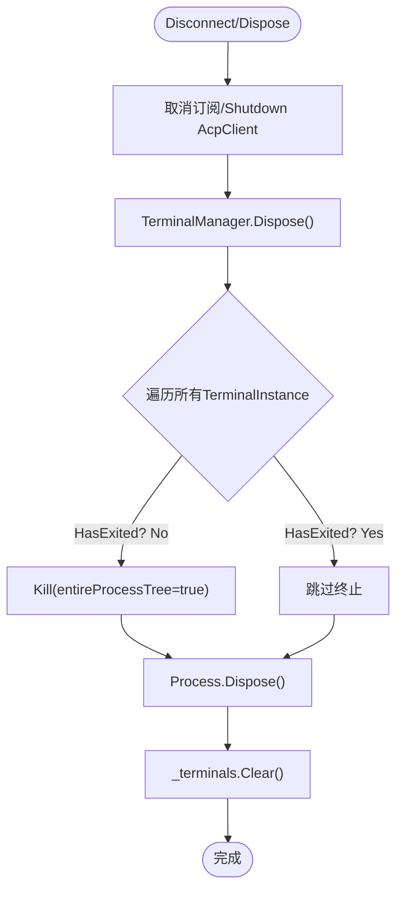
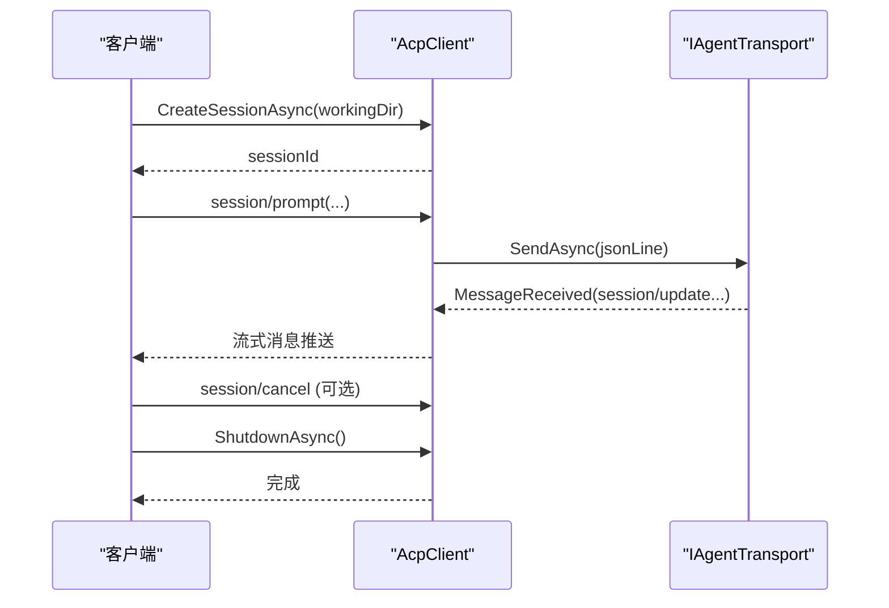
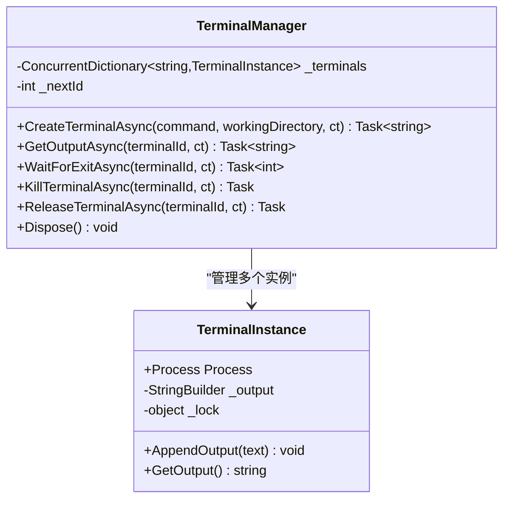
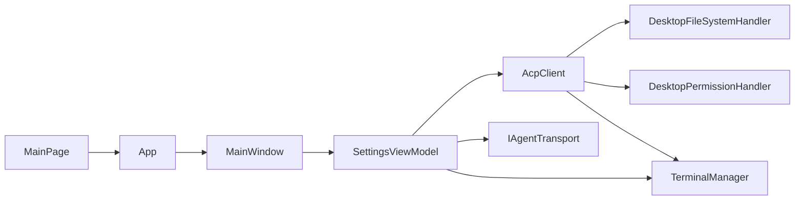

# 进程生命周期管理

<cite>
**本文引用的文件**   
- [App.xaml.cs](file://Agentic.Desktop/App.xaml.cs)
- [MainWindow.xaml.cs](file://Agentic.Desktop/MainWindow.xaml.cs)
- [SettingsViewModel.cs](file://Agentic.Desktop/ViewModels/SettingsViewModel.cs)
- [TerminalManager.cs](file://Agentic.Desktop/Services/TerminalManager.cs)
- [FileSystemHandler.cs](file://Agentic.Desktop/Services/FileSystemHandler.cs)
- [PermissionHandler.cs](file://Agentic.Desktop/Services/PermissionHandler.cs)
- [MockAgentTransport.cs](file://Agentic.Desktop/Mocks/MockAgentTransport.cs)
- [MainPage.xaml.cs](file://Agentic.Desktop/MainPage.xaml.cs)
- [launchSettings.json](file://Agentic.Desktop/Properties/launchSettings.json)
- [README.md](file://README.md)
</cite>

## 目录
1. [简介](#简介)
2. [项目结构](#项目结构)
3. [核心组件](#核心组件)
4. [架构总览](#架构总览)
5. [详细组件分析](#详细组件分析)
6. [依赖关系分析](#依赖关系分析)
7. [性能考量](#性能考量)
8. [故障排除指南](#故障排除指南)
9. [结论](#结论)
10. [附录](#附录)

## 简介
本文件围绕“进程生命周期管理”展开，聚焦于 Agent 进程的启动、监控、资源清理与进程间通信的生命周期。结合代码库中的设置页连接流程、终端子进程管理与 Mock 传输层，系统性地说明：
- Agent 进程启动流程（参数配置、工作目录、环境变量注入）
- 进程监控机制（退出事件、异常检测、自动重启策略建议）
- 资源清理机制（终止、句柄释放、内存回收）
- 进程间通信的生命周期（会话创建、消息传递、优雅关闭）
- 调试技巧、日志记录策略与故障排除方法
- 多进程并发管理与资源竞争解决方案

## 项目结构
该 WinUI 3 应用通过 MVVM 组织 UI 与逻辑，核心进程与通信相关能力分布在以下位置：
- 应用入口与全局状态：App.xaml.cs
- 主窗口与连接状态展示：MainWindow.xaml.cs
- 设置页视图模型（连接/断开、会话、进程退出处理）：SettingsViewModel.cs
- 终端子进程管理（多实例、输出缓冲、Kill/Release/Dispose）：TerminalManager.cs
- 文件系统权限控制（工作目录白名单）：FileSystemHandler.cs
- 权限请求 UI 调度（DispatcherQueue 派发）：PermissionHandler.cs
- Mock 传输层（无真实进程，模拟 ACP 协议交互）：MockAgentTransport.cs
- 聊天页面绑定当前 AcpClient：MainPage.xaml.cs
- 运行配置（MSIX/Project 两种 Profile）：launchSettings.json

图表来源
- [App.xaml.cs:64-76](file://Agentic.Desktop/App.xaml.cs#L64-L76)
- [MainWindow.xaml.cs:29-50](file://Agentic.Desktop/MainWindow.xaml.cs#L29-L50)
- [SettingsViewModel.cs:60-126](file://Agentic.Desktop/ViewModels/SettingsViewModel.cs#L60-L126)
- [TerminalManager.cs:11-128](file://Agentic.Desktop/Services/TerminalManager.cs#L11-L128)
- [FileSystemHandler.cs:8-41](file://Agentic.Desktop/Services/FileSystemHandler.cs#L8-L41)
- [PermissionHandler.cs:11-45](file://Agentic.Desktop/Services/PermissionHandler.cs#L11-L45)
- [MockAgentTransport.cs:9-124](file://Agentic.Desktop/Mocks/MockAgentTransport.cs#L9-L124)
- [MainPage.xaml.cs:26-47](file://Agentic.Desktop/MainPage.xaml.cs#L26-L47)

章节来源
- [README.md:51-71](file://README.md#L51-L71)

## 核心组件
- 应用与全局状态
  - 应用启动时创建 Logger 工厂与主窗口，暴露 DispatcherQueue 和当前 AcpClient，提供 SetAcpClient 通知订阅者。
- 设置页连接流程
  - 根据是否配置 Agent 路径选择 Mock 或 Stdio 传输；构造 AcpClient，订阅进程退出事件；执行 InitializeAsync、CreateSessionAsync；创建 TerminalManager 并赋值给 AcpClient.TerminalHandler。
- 终端子进程管理
  - 使用 Process.StartInfo 指定 Shell、参数、工作目录、重定向 I/O；后台异步读取 stdout/stderr；支持 Kill(entireProcessTree)、Release、Dispose。
- 权限与文件系统
  - 基于工作目录的白名单校验，拒绝越权访问；权限请求通过 DispatcherQueue 派发到 UI 线程显示对话框。
- Mock 传输层
  - 模拟 ACP 协议消息流（initialize/session/new/session/prompt/cancel），用于无需真实 Agent 时的 UI 开发。

章节来源
- [App.xaml.cs:64-84](file://Agentic.Desktop/App.xaml.cs#L64-L84)
- [SettingsViewModel.cs:60-126](file://Agentic.Desktop/ViewModels/SettingsViewModel.cs#L60-L126)
- [TerminalManager.cs:16-128](file://Agentic.Desktop/Services/TerminalManager.cs#L16-L128)
- [FileSystemHandler.cs:8-41](file://Agentic.Desktop/Services/FileSystemHandler.cs#L8-L41)
- [PermissionHandler.cs:21-45](file://Agentic.Desktop/Services/PermissionHandler.cs#L21-L45)
- [MockAgentTransport.cs:21-124](file://Agentic.Desktop/Mocks/MockAgentTransport.cs#L21-L124)

## 架构总览
下图展示了从用户点击“连接”到建立 ACP 会话、创建终端子进程、以及后续消息流转的整体时序。

图表来源
- [SettingsViewModel.cs:60-126](file://Agentic.Desktop/ViewModels/SettingsViewModel.cs#L60-L126)
- [MockAgentTransport.cs:21-124](file://Agentic.Desktop/Mocks/MockAgentTransport.cs#L21-L124)
- [TerminalManager.cs:16-128](file://Agentic.Desktop/Services/TerminalManager.cs#L16-L128)
- [FileSystemHandler.cs:8-41](file://Agentic.Desktop/Services/FileSystemHandler.cs#L8-L41)
- [PermissionHandler.cs:21-45](file://Agentic.Desktop/Services/PermissionHandler.cs#L21-L45)

## 详细组件分析

### Agent 进程启动流程（参数、工作目录、环境变量）
- 参数与工作目录
  - 用户在设置页输入 Agent 路径、可选参数与工作目录。
  - 若未配置路径则使用 MockAgentTransport；否则使用 StdioAgentTransport(AgentPath, AgentArguments, WorkingDirectory)。
  - 工作目录在 CreateSessionAsync(WorkingDirectory) 中传递给 ACP 会话，确保 Agent 以该目录为根进行文件与命令操作。
- 环境变量注入
  - 当前实现未显式设置环境变量；如需注入，可在构造 StdioAgentTransport 前通过 ProcessStartInfo.EnvironmentVariables 扩展（需对传输层进行封装）。
- 启动顺序
  - 构造传输 → 构造 AcpClient → 订阅进程退出事件 → InitializeAsync → 创建 TerminalManager → CreateSessionAsync → 成功回调。

图表来源
- [SettingsViewModel.cs:60-126](file://Agentic.Desktop/ViewModels/SettingsViewModel.cs#L60-L126)
- [MockAgentTransport.cs:21-124](file://Agentic.Desktop/Mocks/MockAgentTransport.cs#L21-L124)

章节来源
- [SettingsViewModel.cs:60-126](file://Agentic.Desktop/ViewModels/SettingsViewModel.cs#L60-L126)
- [README.md:41-49](file://README.md#L41-L49)

### 进程监控机制（退出事件、异常检测、自动重启策略）
- 退出事件
  - SettingsViewModel 订阅 AcpClient.AgentProcessExited，收到退出码后触发 OnAgentDisconnected，通知上层 UI 或业务逻辑。
- 异常检测
  - MockAgentTransport 内部捕获异常并通过 TransportFaulted 事件上报；Stdio 传输层（外部库）会在底层异常时触发相应事件（由 AcpClient 统一处理）。
- 自动重启策略
  - 当前代码未实现自动重启。建议在 OnAgentDisconnected 中增加重试计数器与退避策略，并在达到阈值后提示用户或停止重试。

图表来源
- [SettingsViewModel.cs:89-95](file://Agentic.Desktop/ViewModels/SettingsViewModel.cs#L89-L95)
- [MainWindow.xaml.cs:29-50](file://Agentic.Desktop/MainWindow.xaml.cs#L29-L50)
- [MockAgentTransport.cs:112-116](file://Agentic.Desktop/Mocks/MockAgentTransport.cs#L112-L116)

章节来源
- [SettingsViewModel.cs:89-95](file://Agentic.Desktop/ViewModels/SettingsViewModel.cs#L89-L95)
- [MainWindow.xaml.cs:29-50](file://Agentic.Desktop/MainWindow.xaml.cs#L29-L50)

### 资源清理机制（进程终止、句柄释放、内存回收）
- 断开连接
  - DisconnectAsync 调用 CleanupAsync：取消订阅退出事件、调用 AcpClient.ShutdownAsync、释放 TerminalManager。
- 终端子进程清理
  - TerminalManager.Dispose 遍历所有实例，强制终止未退出的进程树，释放 Process 句柄，并清空字典。
  - ReleaseTerminalAsync 按 ID 移除实例并释放资源。
- 内存回收
  - 释放引用后由 GC 回收；避免持有长生命周期静态引用导致泄漏。

图表来源
- [SettingsViewModel.cs:142-160](file://Agentic.Desktop/ViewModels/SettingsViewModel.cs#L142-L160)
- [TerminalManager.cs:115-128](file://Agentic.Desktop/Services/TerminalManager.cs#L115-L128)

章节来源
- [SettingsViewModel.cs:128-160](file://Agentic.Desktop/ViewModels/SettingsViewModel.cs#L128-L160)
- [TerminalManager.cs:115-128](file://Agentic.Desktop/Services/TerminalManager.cs#L115-L128)

### 进程间通信的生命周期（会话、消息、优雅关闭）
- 会话创建
  - CreateSessionAsync(WorkingDirectory) 建立 ACP 会话，后续消息均携带 sessionId。
- 消息传递
  - MockAgentTransport 演示了 initialize/session/new/session/prompt/session/cancel 等方法的响应与推送（session/update）。
- 优雅关闭
  - ShutdownAsync 用于释放传输层资源；对于 Stdio 传输，应等待管道关闭并释放句柄。

图表来源
- [MockAgentTransport.cs:27-117](file://Agentic.Desktop/Mocks/MockAgentTransport.cs#L27-L117)
- [SettingsViewModel.cs:97-106](file://Agentic.Desktop/ViewModels/SettingsViewModel.cs#L97-L106)

章节来源
- [MockAgentTransport.cs:27-117](file://Agentic.Desktop/Mocks/MockAgentTransport.cs#L27-L117)
- [SettingsViewModel.cs:97-106](file://Agentic.Desktop/ViewModels/SettingsViewModel.cs#L97-L106)

### 终端子进程管理（并发与资源竞争）
- 并发模型
  - ConcurrentDictionary 存储多个 TerminalInstance；每个实例独立 Process 与输出缓冲区。
  - 后台 Task 异步读取 stdout/stderr，避免阻塞 UI。
- 资源竞争
  - 输出缓冲区使用 lock 保护 StringBuilder 写入/读取，保证线程安全。
- 生命周期
  - CreateTerminalAsync 启动 Shell 并注册回调；WaitForExitAsync/KillTerminalAsync/ReleaseTerminalAsync 分别提供等待、强制终止与释放接口。

图表来源
- [TerminalManager.cs:11-160](file://Agentic.Desktop/Services/TerminalManager.cs#L11-L160)

章节来源
- [TerminalManager.cs:16-128](file://Agentic.Desktop/Services/TerminalManager.cs#L16-L128)
- [TerminalManager.cs:137-160](file://Agentic.Desktop/Services/TerminalManager.cs#L137-L160)

### 权限与文件系统安全（工作目录白名单）
- 路径校验
  - DesktopFileSystemHandler 将传入路径规范化后检查是否以工作目录开头，越权访问抛出 UnauthorizedAccessException。
- 目录创建
  - 写文件前确保目标目录存在。

章节来源
- [FileSystemHandler.cs:8-41](file://Agentic.Desktop/Services/FileSystemHandler.cs#L8-L41)

### 权限请求 UI 调度
- 通过 DispatcherQueue.TryEnqueue 将权限请求派发至 UI 线程，显示对话框并等待用户决策。

章节来源
- [PermissionHandler.cs:21-45](file://Agentic.Desktop/Services/PermissionHandler.cs#L21-L45)

### 应用与窗口状态同步
- App.SetAcpClient 更新全局 CurrentAcpClient 并触发 AcpClientChanged，MainPage 订阅变更以绑定/解绑客户端。

章节来源
- [App.xaml.cs:78-84](file://Agentic.Desktop/App.xaml.cs#L78-L84)
- [MainPage.xaml.cs:26-47](file://Agentic.Desktop/MainPage.xaml.cs#L26-L47)

## 依赖关系分析
- 组件耦合
  - SettingsViewModel 依赖 AcpClient、IAgentTransport、TerminalManager、LocalizationService。
  - TerminalManager 依赖 System.Diagnostics.Process，负责子进程生命周期。
  - DesktopFileSystemHandler 与 DesktopPermissionHandler 作为 AcpClient 的处理器注入。
- 外部依赖
  - AcpClient、JsonRpcDispatcher、IAgentTransport 来自外部库（ShihaoShen.Agentic.ACPLibrary）。
- 潜在循环依赖
  - 未发现直接循环；注意避免在回调中反向强引用 ViewModel 造成 GC 问题。

图表来源
- [SettingsViewModel.cs:60-126](file://Agentic.Desktop/ViewModels/SettingsViewModel.cs#L60-L126)
- [App.xaml.cs:64-84](file://Agentic.Desktop/App.xaml.cs#L64-L84)
- [MainWindow.xaml.cs:29-50](file://Agentic.Desktop/MainWindow.xaml.cs#L29-L50)
- [MainPage.xaml.cs:26-47](file://Agentic.Desktop/MainPage.xaml.cs#L26-L47)

章节来源
- [SettingsViewModel.cs:60-126](file://Agentic.Desktop/ViewModels/SettingsViewModel.cs#L60-L126)
- [App.xaml.cs:64-84](file://Agentic.Desktop/App.xaml.cs#L64-L84)

## 性能考量
- I/O 异步化
  - 终端 stdout/stderr 读取采用异步 Task，避免阻塞 UI 线程。
- 锁粒度
  - TerminalInstance 的输出缓冲区使用细粒度 lock，减少竞争。
- 进程树终止
  - Kill(entireProcessTree=true) 能快速回收资源，但可能影响子进程链；应在必要时使用。
- 日志级别
  - 默认 Debug 级别便于排查，生产环境建议降低至 Info/Warn。

[本节为通用指导，不直接分析具体文件]

## 故障排除指南
- 连接失败
  - 检查 Agent 路径与参数是否正确；查看 ConnectionStatus 错误信息；确认工作目录是否存在且可访问。
- 进程意外退出
  - 订阅 OnAgentDisconnected，记录退出码；检查外部进程崩溃日志；考虑增加自动重启与退避策略。
- 终端无输出
  - 确认 RedirectStandardInput/Output/Error 已启用；检查后台读取 Task 是否被取消或异常吞掉。
- 权限拒绝
  - 确认请求路径位于工作目录内；检查 DesktopFileSystemHandler 的路径校验逻辑。
- 资源泄漏
  - 确保调用 DisconnectAsync/CleanupAsync；验证 TerminalManager.Dispose 是否被执行。

章节来源
- [SettingsViewModel.cs:115-126](file://Agentic.Desktop/ViewModels/SettingsViewModel.cs#L115-L126)
- [TerminalManager.cs:38-64](file://Agentic.Desktop/Services/TerminalManager.cs#L38-L64)
- [FileSystemHandler.cs:32-41](file://Agentic.Desktop/Services/FileSystemHandler.cs#L32-L41)

## 结论
本项目通过清晰的 MVVM 分层与外部 ACP 库协作，实现了 Agent 进程的启动、会话管理、终端子进程管理与权限控制。当前缺失的环境变量注入与自动重启策略可通过扩展传输层与事件处理补齐。建议在生产环境中完善日志、监控与自愈机制，以提升稳定性与可维护性。

[本节为总结，不直接分析具体文件]

## 附录
- 运行配置
  - launchSettings.json 提供 MSIX 与 Project 两种运行模式，便于开发与打包测试。
- 快速开始
  - README 提供了构建与运行步骤，帮助快速体验完整流程。

章节来源
- [launchSettings.json:1-10](file://Agentic.Desktop/Properties/launchSettings.json#L1-L10)
- [README.md:31-39](file://README.md#L31-L39)