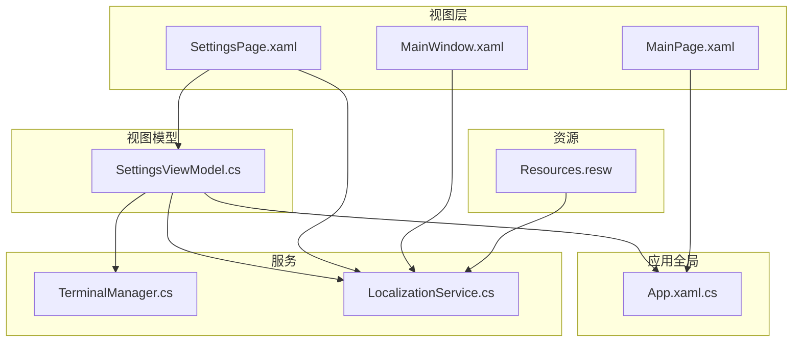
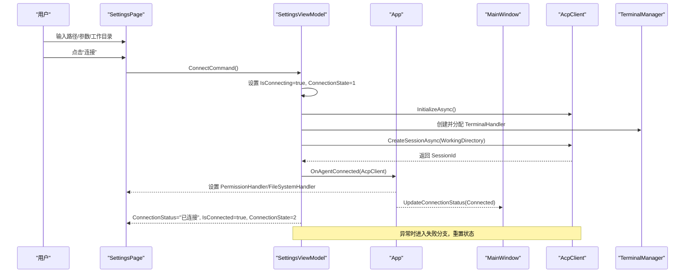
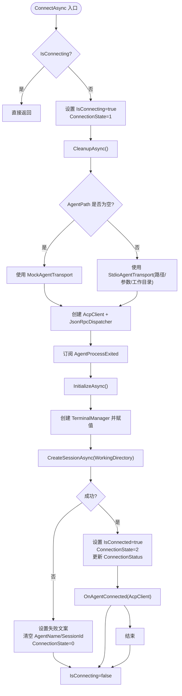
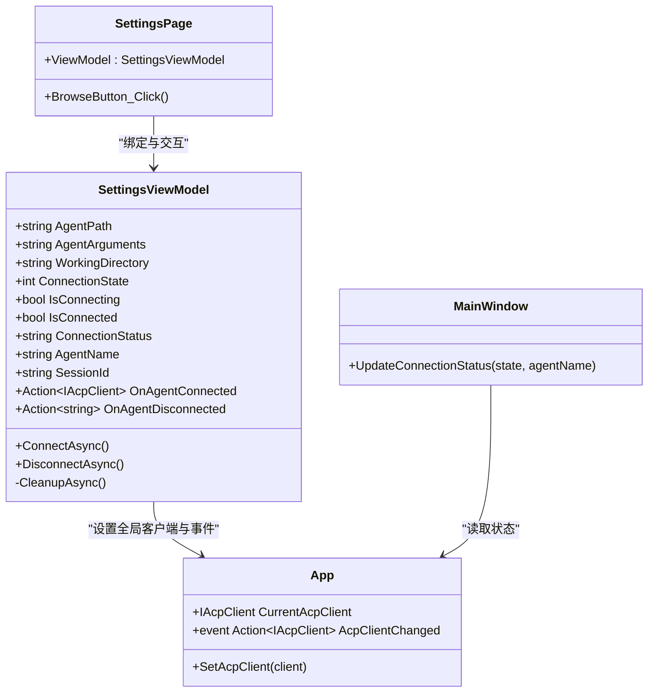
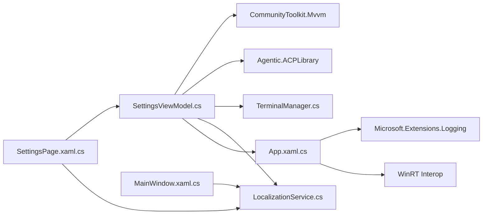

# 连接配置管理

<cite>
**本文引用的文件**   
- [SettingsViewModel.cs](file://Agentic.Desktop/ViewModels/SettingsViewModel.cs)
- [SettingsPage.xaml.cs](file://Agentic.Desktop/SettingsPage.xaml.cs)
- [SettingsPage.xaml](file://Agentic.Desktop/SettingsPage.xaml)
- [App.xaml.cs](file://Agentic.Desktop/App.xaml.cs)
- [MainWindow.xaml.cs](file://Agentic.Desktop/MainWindow.xaml.cs)
- [TerminalManager.cs](file://Agentic.Desktop/Services/TerminalManager.cs)
- [LocalizationService.cs](file://Agentic.Desktop/Services/LocalizationService.cs)
- [Resources.resw](file://Agentic.Desktop/Strings/zh-CN/Resources.resw)
</cite>

## 目录
1. [简介](#简介)
2. [项目结构](#项目结构)
3. [核心组件](#核心组件)
4. [架构总览](#架构总览)
5. [详细组件分析](#详细组件分析)
6. [依赖关系分析](#依赖关系分析)
7. [性能考量](#性能考量)
8. [故障排查指南](#故障排查指南)
9. [结论](#结论)
10. [附录](#附录)

## 简介
本文件聚焦“连接配置管理”功能，围绕 SettingsViewModel 中的 Agent 路径配置、命令行参数与工作目录管理展开，详细说明连接状态管理机制（连接中、已连接、断开）的转换逻辑。文档还包含实际配置示例（如何设置 Agent 可执行文件路径、命令行参数与环境变量）、配置验证机制与用户界面绑定方式，以及连接状态的全局共享实例模式和多页面状态同步策略，并给出配置持久化与默认值管理的最佳实践建议。

## 项目结构
该功能涉及视图模型、页面、应用全局状态、服务层与本地化资源：
- 视图模型：SettingsViewModel 负责连接生命周期、配置项与状态通知
- 视图：SettingsPage 提供 UI 绑定与交互（浏览工作目录、连接/断开按钮）
- 应用全局：App 维护当前 AcpClient 与事件广播，供多页面共享
- 窗口：MainWindow 更新标题栏连接状态指示
- 服务：TerminalManager 管理终端进程；LocalizationService 提供本地化字符串
- 资源：Resources.resw 定义中文本地化文案

图表来源
- [SettingsPage.xaml:1-121](file://Agentic.Desktop/SettingsPage.xaml#L1-L121)
- [SettingsViewModel.cs:1-162](file://Agentic.Desktop/ViewModels/SettingsViewModel.cs#L1-L162)
- [App.xaml.cs:1-85](file://Agentic.Desktop/App.xaml.cs#L1-L85)
- [MainWindow.xaml.cs:1-97](file://Agentic.Desktop/MainWindow.xaml.cs#L1-L97)
- [TerminalManager.cs:1-161](file://Agentic.Desktop/Services/TerminalManager.cs#L1-L161)
- [LocalizationService.cs:1-23](file://Agentic.Desktop/Services/LocalizationService.cs#L1-L23)
- [Resources.resw:1-224](file://Agentic.Desktop/Strings/zh-CN/Resources.resw#L1-L224)

章节来源
- [SettingsPage.xaml:1-121](file://Agentic.Desktop/SettingsPage.xaml#L1-L121)
- [SettingsViewModel.cs:1-162](file://Agentic.Desktop/ViewModels/SettingsViewModel.cs#L1-L162)
- [App.xaml.cs:1-85](file://Agentic.Desktop/App.xaml.cs#L1-L85)
- [MainWindow.xaml.cs:1-97](file://Agentic.Desktop/MainWindow.xaml.cs#L1-L97)

## 核心组件
- SettingsViewModel：集中管理 Agent 路径、参数、工作目录、连接状态、会话信息，并通过命令驱动连接/断开流程，使用全局单例保证跨页面状态一致。
- SettingsPage：将 UI 控件与 ViewModel 属性双向绑定，处理“浏览工作目录”等交互，并在连接成功后注入权限处理器与文件系统处理器，同时更新主窗口状态。
- App：作为全局容器持有当前连接的 AcpClient，并提供 AcpClientChanged 事件，实现多页面间状态同步。
- MainWindow：根据连接状态更新标题栏的状态点与文本。
- TerminalManager：为 Agent 会话提供终端能力，支持创建、读取输出、等待退出、终止与释放。
- LocalizationService：统一从 .resw 资源文件中获取本地化文案，支持格式化。

章节来源
- [SettingsViewModel.cs:1-162](file://Agentic.Desktop/ViewModels/SettingsViewModel.cs#L1-L162)
- [SettingsPage.xaml.cs:1-96](file://Agentic.Desktop/SettingsPage.xaml.cs#L1-L96)
- [App.xaml.cs:1-85](file://Agentic.Desktop/App.xaml.cs#L1-L85)
- [MainWindow.xaml.cs:1-97](file://Agentic.Desktop/MainWindow.xaml.cs#L1-L97)
- [TerminalManager.cs:1-161](file://Agentic.Desktop/Services/TerminalManager.cs#L1-L161)
- [LocalizationService.cs:1-23](file://Agentic.Desktop/Services/LocalizationService.cs#L1-L23)

## 架构总览
连接配置管理的关键流程如下：用户在设置页输入 Agent 路径、参数与工作目录后点击“连接”，SettingsViewModel 初始化传输层与客户端，建立会话并通知其他页面；若未填写路径则回退到 Mock 传输；连接成功后通过 App 全局事件广播，使聊天页自动绑定新客户端；断开时清理资源并重置状态。

图表来源
- [SettingsViewModel.cs:60-126](file://Agentic.Desktop/ViewModels/SettingsViewModel.cs#L60-L126)
- [SettingsPage.xaml.cs:19-55](file://Agentic.Desktop/SettingsPage.xaml.cs#L19-L55)
- [App.xaml.cs:78-84](file://Agentic.Desktop/App.xaml.cs#L78-L84)
- [MainWindow.xaml.cs:29-50](file://Agentic.Desktop/MainWindow.xaml.cs#L29-L50)

## 详细组件分析

### SettingsViewModel：Agent 路径、参数与工作目录管理
- 配置属性
  - AgentPath：Agent 可执行文件路径，为空时使用 Mock 传输
  - AgentArguments：启动参数，传递给 StdioAgentTransport
  - WorkingDirectory：工作目录，用于创建会话与终端进程的工作目录
- 连接状态属性
  - ConnectionState：0=断开，1=连接中，2=已连接
  - IsConnecting：是否正在连接
  - IsConnected：是否已连接
  - ConnectionStatus：本地化的连接状态文案
  - AgentName、SessionId：连接成功后填充
- 连接流程
  - ConnectAsync：校验重复连接、清理旧连接、选择传输（Mock 或 Stdio）、初始化客户端、订阅进程退出事件、创建会话、更新状态并通知外部
  - DisconnectAsync：清理资源、重置状态、清空全局 AcpClient
  - CleanupAsync：取消订阅、关闭客户端、释放终端管理器
- 错误处理
  - 捕获异常并设置失败文案，清空名称与会话，状态回退至断开

图表来源
- [SettingsViewModel.cs:60-126](file://Agentic.Desktop/ViewModels/SettingsViewModel.cs#L60-L126)

章节来源
- [SettingsViewModel.cs:1-162](file://Agentic.Desktop/ViewModels/SettingsViewModel.cs#L1-L162)

### 连接状态管理与全局共享实例
- 全局共享实例
  - SettingsViewModel.Shared 确保页面导航重建后连接状态不丢失
- 全局 AcpClient 与事件
  - App.CurrentAcpClient 保存当前连接客户端
  - App.AcpClientChanged 事件通知所有订阅者（如 Chat 页面）
- 页面绑定与状态同步
  - SettingsPage 在连接成功后设置权限处理器与文件系统处理器，并调用 App.SetAcpClient(client)
  - MainWindow.UpdateConnectionStatus 根据 ConnectionState 更新标题栏状态点与文案
  - MainPage 订阅 App.AcpClientChanged，自动绑定或清理事件

图表来源
- [SettingsViewModel.cs:15-59](file://Agentic.Desktop/ViewModels/SettingsViewModel.cs#L15-L59)
- [App.xaml.cs:42-84](file://Agentic.Desktop/App.xaml.cs#L42-L84)
- [MainWindow.xaml.cs:29-50](file://Agentic.Desktop/MainWindow.xaml.cs#L29-L50)
- [SettingsPage.xaml.cs:12-55](file://Agentic.Desktop/SettingsPage.xaml.cs#L12-L55)

章节来源
- [SettingsViewModel.cs:15-59](file://Agentic.Desktop/ViewModels/SettingsViewModel.cs#L15-L59)
- [App.xaml.cs:42-84](file://Agentic.Desktop/App.xaml.cs#L42-L84)
- [MainWindow.xaml.cs:29-50](file://Agentic.Desktop/MainWindow.xaml.cs#L29-L50)
- [SettingsPage.xaml.cs:12-55](file://Agentic.Desktop/SettingsPage.xaml.cs#L12-L55)

### 用户界面绑定与交互
- 数据绑定
  - AgentPathTextBox、AgentArgumentsTextBox、WorkingDirectoryTextBox 均通过 TwoWay 绑定到 ViewModel 对应属性，实时更新
  - 连接控制按钮绑定 ConnectCommand 与 DisconnectCommand
  - 进度环 IsActive 绑定 IsConnecting
  - 连接状态区域显示 ConnectionStatus、AgentName、SessionId，并根据 IsConnected 控制可见性
- 交互逻辑
  - BrowseButton_Click 打开文件夹选择器，设置 ViewModel.WorkingDirectory
  - SettingsPage 在连接成功后注入权限处理器与文件系统处理器，并更新主窗口状态

章节来源
- [SettingsPage.xaml:26-116](file://Agentic.Desktop/SettingsPage.xaml#L26-L116)
- [SettingsPage.xaml.cs:79-94](file://Agentic.Desktop/SettingsPage.xaml.cs#L79-L94)

### 配置验证机制
- 路径验证
  - 工作目录通过 Path.GetFullPath 规范化，后续文件系统访问会校验是否在允许范围内
- 权限控制
  - DesktopFileSystemHandler 对每个文件操作进行路径白名单校验，越界抛出 UnauthorizedAccessException
- 连接前校验
  - AgentPath 为空时自动切换到 Mock 传输，避免无效路径导致连接失败

章节来源
- [TerminalManager.cs:16-35](file://Agentic.Desktop/Services/TerminalManager.cs#L16-L35)
- [SettingsViewModel.cs:75-83](file://Agentic.Desktop/ViewModels/SettingsViewModel.cs#L75-L83)

### 配置示例（基于现有代码行为）
- 设置 Agent 可执行文件路径
  - 在“Agent 路径”输入框中填写绝对路径，例如 Windows 下的 exe 路径
  - 留空将使用内置 Mock Agent 进行演示
- 设置命令行参数
  - 在“Agent 参数”输入框中填写启动参数，例如 “run --project path/to/project”
- 设置工作目录
  - 在“工作目录”输入框填写路径，或通过“浏览...”按钮选择文件夹
  - 该目录将用于创建会话与终端进程的工作目录
- 环境变量
  - 当前代码未暴露环境变量字段；如需扩展，可在 SettingsViewModel 增加环境变量属性并在构建传输时传入

章节来源
- [SettingsPage.xaml:26-65](file://Agentic.Desktop/SettingsPage.xaml#L26-L65)
- [SettingsViewModel.cs:75-83](file://Agentic.Desktop/ViewModels/SettingsViewModel.cs#L75-L83)
- [Resources.resw:106-132](file://Agentic.Desktop/Strings/zh-CN/Resources.resw#L106-L132)

### 连接状态的全局共享与多页面同步
- 共享实例
  - SettingsViewModel.Shared 保证跨页面导航后状态不丢失
- 全局客户端
  - App.CurrentAcpClient 由 SettingsPage 设置，MainPage 订阅 App.AcpClientChanged 自动绑定
- 状态同步
  - MainWindow.UpdateConnectionStatus 根据 ConnectionState 更新标题栏状态点与文案
  - SettingsPage 监听 ViewModel.PropertyChanged，当 ConnectionState 变化时刷新标题栏

章节来源
- [SettingsViewModel.cs:17-18](file://Agentic.Desktop/ViewModels/SettingsViewModel.cs#L17-L18)
- [App.xaml.cs:42-84](file://Agentic.Desktop/App.xaml.cs#L42-L84)
- [MainWindow.xaml.cs:29-50](file://Agentic.Desktop/MainWindow.xaml.cs#L29-L50)
- [SettingsPage.xaml.cs:56-67](file://Agentic.Desktop/SettingsPage.xaml.cs#L56-L67)

### 配置持久化与默认值管理（最佳实践建议）
- 现状
  - 当前代码未实现配置的持久化存储，默认值来源于运行时环境（如工作目录默认为用户主目录）
- 建议方案
  - 使用应用级配置文件（如 JSON）或系统注册表/设置存储，保存 AgentPath、AgentArguments、WorkingDirectory
  - 在 SettingsViewModel 构造函数或首次加载时读取默认值，并在属性变更时触发保存
  - 提供“恢复默认值”功能，便于用户快速重置
  - 对敏感信息（如认证令牌）采用安全存储机制

[本节为通用建议，不直接分析具体文件]

## 依赖关系分析
- SettingsViewModel 依赖
  - CommunityToolkit.Mvvm（ObservableObject、RelayCommand）
  - Agentic.ACPLibrary（AcpClient、Transport、Protocol、Models）
  - 桌面服务（TerminalManager、LocalizationService）
  - 应用全局（App）
- SettingsPage 依赖
  - WinUI 3（XAML、Picker、Interop）
  - 视图模型与服务（SettingsViewModel、LocalizationService）
- App 依赖
  - Microsoft.Extensions.Logging（日志工厂）
  - WinRT Interop（WindowHandle）

图表来源
- [SettingsViewModel.cs:1-10](file://Agentic.Desktop/ViewModels/SettingsViewModel.cs#L1-L10)
- [SettingsPage.xaml.cs:1-7](file://Agentic.Desktop/SettingsPage.xaml.cs#L1-L7)
- [App.xaml.cs:1-10](file://Agentic.Desktop/App.xaml.cs#L1-L10)
- [TerminalManager.cs:1-5](file://Agentic.Desktop/Services/TerminalManager.cs#L1-L5)
- [LocalizationService.cs:1-4](file://Agentic.Desktop/Services/LocalizationService.cs#L1-L4)

章节来源
- [SettingsViewModel.cs:1-10](file://Agentic.Desktop/ViewModels/SettingsViewModel.cs#L1-L10)
- [SettingsPage.xaml.cs:1-7](file://Agentic.Desktop/SettingsPage.xaml.cs#L1-L7)
- [App.xaml.cs:1-10](file://Agentic.Desktop/App.xaml.cs#L1-L10)
- [TerminalManager.cs:1-5](file://Agentic.Desktop/Services/TerminalManager.cs#L1-L5)
- [LocalizationService.cs:1-4](file://Agentic.Desktop/Services/LocalizationService.cs#L1-L4)

## 性能考量
- 异步连接与 I/O
  - 连接流程使用异步方法（InitializeAsync、CreateSessionAsync），避免阻塞 UI 线程
- 资源清理
  - CleanupAsync 确保取消订阅、关闭客户端与释放终端管理器，防止内存泄漏
- 终端输出流
  - TerminalManager 使用异步读取标准输出/错误流，减少阻塞
- 状态更新
  - 通过 DispatcherQueue 调度 UI 更新，避免跨线程异常

[本节为通用指导，不直接分析具体文件]

## 故障排查指南
- 连接失败
  - 检查 AgentPath 是否正确，或留空以使用 Mock
  - 查看 ConnectionStatus 中的失败原因（来自异常消息）
  - 确认 WorkingDirectory 存在且具备读写权限
- 断开连接
  - 若 Agent 进程意外退出，OnAgentDisconnected 会收到退出码并更新状态
- 权限拒绝
  - 文件系统访问被限制在工作目录内，越界将抛出 UnauthorizedAccessException
- 状态不同步
  - 确认 App.AcpClientChanged 事件是否被订阅，检查 MainWindow.UpdateConnectionStatus 是否被调用

章节来源
- [SettingsViewModel.cs:115-126](file://Agentic.Desktop/ViewModels/SettingsViewModel.cs#L115-L126)
- [SettingsPage.xaml.cs:45-55](file://Agentic.Desktop/SettingsPage.xaml.cs#L45-L55)
- [MainWindow.xaml.cs:29-50](file://Agentic.Desktop/MainWindow.xaml.cs#L29-L50)
- [TerminalManager.cs:115-128](file://Agentic.Desktop/Services/TerminalManager.cs#L115-L128)

## 结论
SettingsViewModel 通过清晰的配置属性与连接状态管理，实现了灵活的 Agent 连接流程，并结合 App 全局事件完成多页面状态同步。UI 层通过双向绑定与交互逻辑提供了良好的用户体验。当前版本未实现配置持久化，建议在后续迭代中加入配置存储与默认值管理，以提升可用性与一致性。

[本节为总结，不直接分析具体文件]

## 附录
- 本地化资源键参考（节选）
  - 连接状态：StatusNotConnected、StatusConnectingProgress、StatusConnectedConfirm、StatusAgentDisconnected、StatusConnectionFailed
  - 设置页文案：SettingsAgentConfig、SettingsAgentPath、SettingsAgentArgs、SettingsWorkDir、SettingsConnect、SettingsDisconnect、SettingsConnectionStatus
- 关键类与方法路径
  - SettingsViewModel.ConnectAsync、DisconnectAsync、CleanupAsync
  - SettingsPage.BrowseButton_Click、OnViewModelPropertyChanged、UpdateConnectionStatus
  - App.SetAcpClient、AcpClientChanged
  - MainWindow.UpdateConnectionStatus
  - TerminalManager.CreateTerminalAsync、ReleaseTerminalAsync、Dispose

章节来源
- [Resources.resw:177-192](file://Agentic.Desktop/Strings/zh-CN/Resources.resw#L177-L192)
- [SettingsViewModel.cs:60-160](file://Agentic.Desktop/ViewModels/SettingsViewModel.cs#L60-L160)
- [SettingsPage.xaml.cs:56-94](file://Agentic.Desktop/SettingsPage.xaml.cs#L56-L94)
- [App.xaml.cs:78-84](file://Agentic.Desktop/App.xaml.cs#L78-L84)
- [MainWindow.xaml.cs:29-50](file://Agentic.Desktop/MainWindow.xaml.cs#L29-L50)
- [TerminalManager.cs:16-128](file://Agentic.Desktop/Services/TerminalManager.cs#L16-L128)