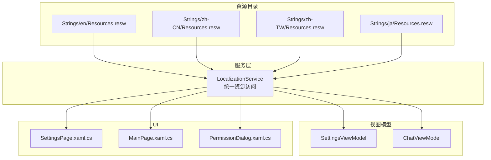
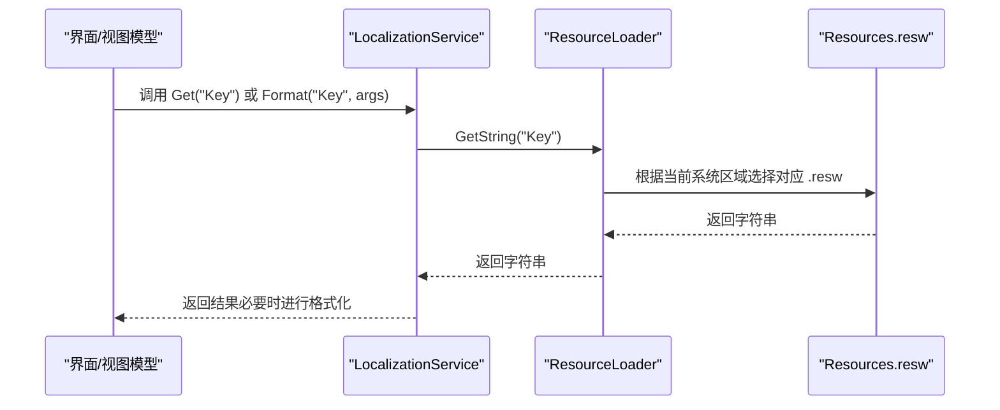
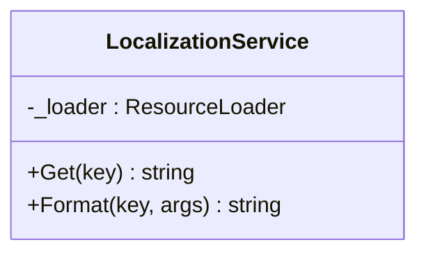
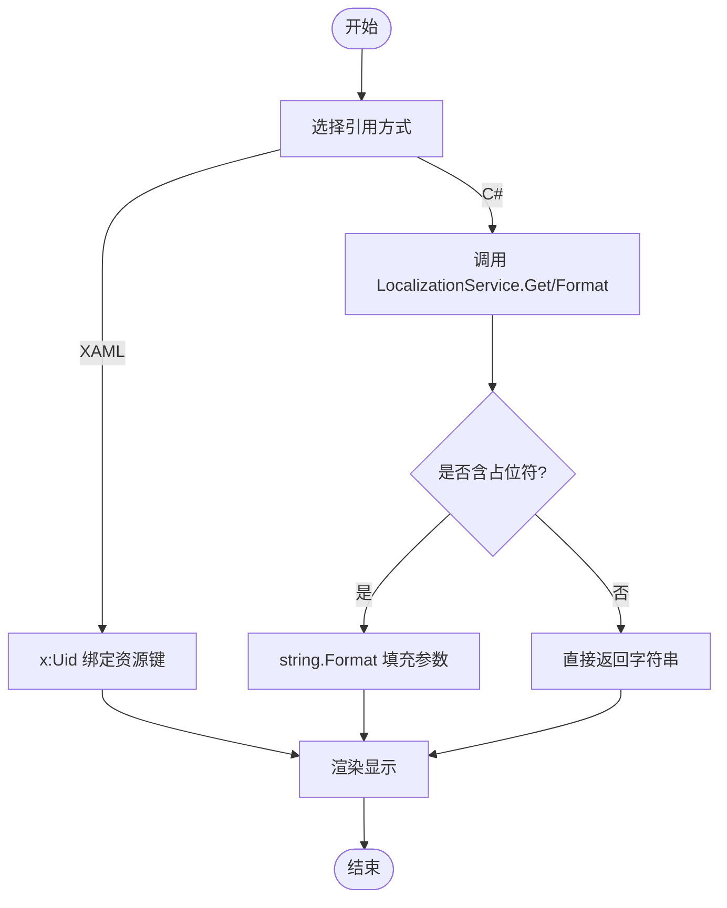
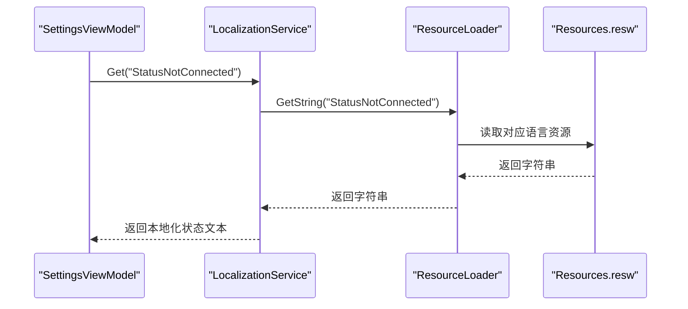
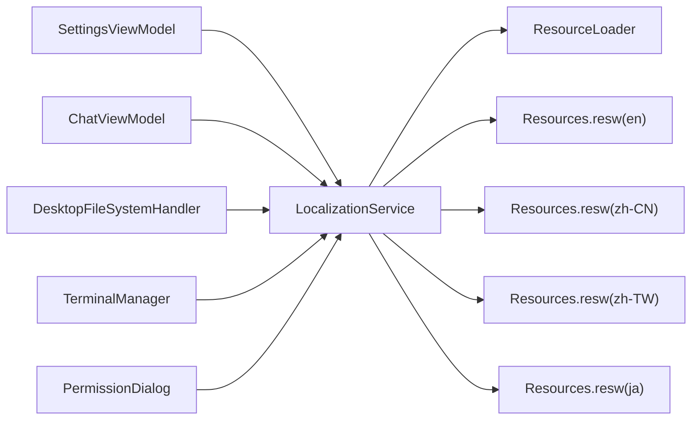

# 国际化支持

<cite>
**本文引用的文件**   
- [LocalizationService.cs](file://Agentic.Desktop/Services/LocalizationService.cs)
- [Resources.resw (en)](file://Agentic.Desktop/Strings/en/Resources.resw)
- [Resources.resw (zh-CN)](file://Agentic.Desktop/Strings/zh-CN/Resources.resw)
- [Resources.resw (ja)](file://Agentic.Desktop/Strings/ja/Resources.resw)
- [Resources.resw (zh-TW)](file://Agentic.Desktop/Strings/zh-TW/Resources.resw)
- [SettingsViewModel.cs](file://Agentic.Desktop/ViewModels/SettingsViewModel.cs)
- [ChatViewModel.cs](file://Agentic.Desktop/ViewModels/ChatViewModel.cs)
- [FileSystemHandler.cs](file://Agentic.Desktop/Services/FileSystemHandler.cs)
- [TerminalManager.cs](file://Agentic.Desktop/Services/TerminalManager.cs)
- [PermissionDialog.xaml.cs](file://Agentic.Desktop/Views/PermissionDialog.xaml.cs)
- [SettingsPage.xaml.cs](file://Agentic.Desktop/SettingsPage.xaml.cs)
- [MainPage.xaml.cs](file://Agentic.Desktop/MainPage.xaml.cs)
- [App.xaml.cs](file://Agentic.Desktop/App.xaml.cs)
</cite>

## 目录
1. [简介](#简介)
2. [项目结构](#项目结构)
3. [核心组件](#核心组件)
4. [架构总览](#架构总览)
5. [详细组件分析](#详细组件分析)
6. [依赖关系分析](#依赖关系分析)
7. [性能考虑](#性能考虑)
8. [故障排查指南](#故障排查指南)
9. [结论](#结论)
10. [附录](#附录)

## 简介
本文件面向 Agentic.Desktop 的国际化（i18n）能力，系统性说明多语言资源文件管理、.resw 组织与命名规范、动态语言切换机制、资源加载策略与本地化服务使用方式。文档还涵盖新增语言的完整流程、字符串引用与格式化参数处理、复数形式支持建议、字体与文本方向适配、文化特定格式设置，以及国际化测试与质量保证实践。

## 项目结构
- 资源文件位于 Strings 目录下，按语言子文件夹组织，每个语言一个 Resources.resw 文件：
  - en: 英文默认资源
  - zh-CN: 简体中文
  - zh-TW: 繁体中文
  - ja: 日文
- 代码通过统一的本地化服务访问资源键值，避免在 UI 或业务逻辑中硬编码文案。

**图表来源** 
- [LocalizationService.cs](file://Agentic.Desktop/Services/LocalizationService.cs)
- [Resources.resw (en)](file://Agentic.Desktop/Strings/en/Resources.resw)
- [Resources.resw (zh-CN)](file://Agentic.Desktop/Strings/zh-CN/Resources.resw)
- [Resources.resw (ja)](file://Agentic.Desktop/Strings/ja/Resources.resw)
- [Resources.resw (zh-TW)](file://Agentic.Desktop/Strings/zh-TW/Resources.resw)
- [SettingsViewModel.cs](file://Agentic.Desktop/ViewModels/SettingsViewModel.cs)
- [ChatViewModel.cs](file://Agentic.Desktop/ViewModels/ChatViewModel.cs)
- [SettingsPage.xaml.cs](file://Agentic.Desktop/SettingsPage.xaml.cs)
- [MainPage.xaml.cs](file://Agentic.Desktop/MainPage.xaml.cs)
- [PermissionDialog.xaml.cs](file://Agentic.Desktop/Views/PermissionDialog.xaml.cs)

**章节来源**
- [LocalizationService.cs](file://Agentic.Desktop/Services/LocalizationService.cs)
- [Resources.resw (en)](file://Agentic.Desktop/Strings/en/Resources.resw)
- [Resources.resw (zh-CN)](file://Agentic.Desktop/Strings/zh-CN/Resources.resw)
- [Resources.resw (ja)](file://Agentic.Desktop/Strings/ja/Resources.resw)
- [Resources.resw (zh-TW)](file://Agentic.Desktop/Strings/zh-TW/Resources.resw)

## 核心组件
- 本地化服务 LocalizationService
  - 封装 Windows.ApplicationModel.Resources.ResourceLoader，提供 Get(key) 和 Format(key, params) 两个方法，用于获取本地化字符串及带参数的格式化输出。
  - 资源名称为“Resources”，对应各语言下的 Resources.resw。
- 视图模型与服务中的本地化使用点
  - SettingsViewModel：连接状态、错误信息、工具调用前缀等。
  - ChatViewModel：错误前缀、工具调用提示、Mock 响应片段等。
  - FileSystemHandler：路径校验失败时的拒绝访问消息。
  - TerminalManager：标准错误输出前缀。
  - PermissionDialog：未知操作提示。

**章节来源**
- [LocalizationService.cs](file://Agentic.Desktop/Services/LocalizationService.cs)
- [SettingsViewModel.cs](file://Agentic.Desktop/ViewModels/SettingsViewModel.cs)
- [ChatViewModel.cs](file://Agentic.Desktop/ViewModels/ChatViewModel.cs)
- [FileSystemHandler.cs](file://Agentic.Desktop/Services/FileSystemHandler.cs)
- [TerminalManager.cs](file://Agentic.Desktop/Services/TerminalManager.cs)
- [PermissionDialog.xaml.cs](file://Agentic.Desktop/Views/PermissionDialog.xaml.cs)

## 架构总览
下图展示了从 UI 到资源文件的调用链，以及本地化服务如何被多个模块复用。

**图表来源** 
- [LocalizationService.cs](file://Agentic.Desktop/Services/LocalizationService.cs)
- [Resources.resw (en)](file://Agentic.Desktop/Strings/en/Resources.resw)
- [Resources.resw (zh-CN)](file://Agentic.Desktop/Strings/zh-CN/Resources.resw)
- [Resources.resw (ja)](file://Agentic.Desktop/Strings/ja/Resources.resw)
- [Resources.resw (zh-TW)](file://Agentic.Desktop/Strings/zh-TW/Resources.resw)

## 详细组件分析

### 本地化服务与资源加载策略
- 资源加载器
  - 使用 ResourceLoader("Resources")，自动依据当前线程的文化上下文选择对应语言的 Resources.resw。
- 字符串获取与格式化
  - Get(key)：直接返回指定 key 的本地化字符串。
  - Format(key, params)：先获取字符串模板，再使用 string.Format 进行参数替换。
- 适用场景
  - 静态文案：导航项、按钮标签、提示信息。
  - 动态文案：错误消息、连接状态、工具调用提示、Mock 响应片段。

**图表来源** 
- [LocalizationService.cs](file://Agentic.Desktop/Services/LocalizationService.cs)

**章节来源**
- [LocalizationService.cs](file://Agentic.Desktop/Services/LocalizationService.cs)

### 资源文件组织与命名规范
- 目录结构
  - Strings/{culture}/Resources.resw，其中 culture 为 BCP-47 语言代码（如 en、zh-CN、zh-TW、ja）。
- 命名约定
  - 所有资源的 name 属性保持跨语言一致，便于代码中通过同一 key 访问。
  - 建议在注释区块内按功能域分组（如全局导航、聊天页、设置页、权限对话框、C# 代码字符串等），提升可维护性。
- 内容一致性
  - 确保每个语言包包含相同数量的 key，缺失 key 会导致运行时异常或回退到默认语言。

**章节来源**
- [Resources.resw (en)](file://Agentic.Desktop/Strings/en/Resources.resw)
- [Resources.resw (zh-CN)](file://Agentic.Desktop/Strings/zh-CN/Resources.resw)
- [Resources.resw (ja)](file://Agentic.Desktop/Strings/ja/Resources.resw)
- [Resources.resw (zh-TW)](file://Agentic.Desktop/Strings/zh-TW/Resources.resw)

### 动态语言切换机制
- 当前实现
  - 应用未内置用户态语言切换入口；语言选择由操作系统文化上下文决定，ResourceLoader 自动匹配对应 .resw。
- 扩展建议
  - 若需运行时切换语言，可在 App 启动时设置当前线程文化，或在设置页面增加切换逻辑并刷新 UI。
  - 注意：WinRT 资源加载基于线程文化，切换后需要重新触发 UI 绑定更新。

[本节为概念性说明，不直接分析具体文件]

### 字符串资源引用与格式化参数
- 引用方式
  - XAML：通过 x:Uid 指向资源键，XAML 编译器将自动解析显示文本。
  - C#：通过 LocalizationService.Get/Format 获取字符串。
- 格式化参数
  - 使用占位符 {0}、{1} 等，配合 LocalizationService.Format 传入参数数组。
  - 示例用途：错误消息、退出码、工具调用标题等。

**图表来源** 
- [LocalizationService.cs](file://Agentic.Desktop/Services/LocalizationService.cs)
- [SettingsViewModel.cs](file://Agentic.Desktop/ViewModels/SettingsViewModel.cs)
- [ChatViewModel.cs](file://Agentic.Desktop/ViewModels/ChatViewModel.cs)
- [FileSystemHandler.cs](file://Agentic.Desktop/Services/FileSystemHandler.cs)
- [TerminalManager.cs](file://Agentic.Desktop/Services/TerminalManager.cs)
- [PermissionDialog.xaml.cs](file://Agentic.Desktop/Views/PermissionDialog.xaml.cs)

**章节来源**
- [LocalizationService.cs](file://Agentic.Desktop/Services/LocalizationService.cs)
- [SettingsViewModel.cs](file://Agentic.Desktop/ViewModels/SettingsViewModel.cs)
- [ChatViewModel.cs](file://Agentic.Desktop/ViewModels/ChatViewModel.cs)
- [FileSystemHandler.cs](file://Agentic.Desktop/Services/FileSystemHandler.cs)
- [TerminalManager.cs](file://Agentic.Desktop/Services/TerminalManager.cs)
- [PermissionDialog.xaml.cs](file://Agentic.Desktop/Views/PermissionDialog.xaml.cs)

### 复数形式与文化特定格式
- 复数形式
  - .resw 不支持复数规则；如需复数，应在资源中定义多个 key（如 ItemCountOne、ItemCountMany），并在代码中根据数量选择合适 key。
- 文化特定格式
  - 数字、日期、货币等格式应使用 CultureInfo 相关 API 进行格式化，避免在资源中嵌入格式细节。
  - 对于终端输出或日志，建议使用统一的前缀与分隔符，保证可读性。

[本节为通用指导，不直接分析具体文件]

### 字体适配与文本方向
- 字体适配
  - 不同语言对字符集需求不同，建议为东亚语言配置合适的字体族，确保字符显示正常。
- 文本方向
  - 大多数语言为从左到右（LTR），阿拉伯语等从右到左（RTL）需在 UI 层面调整布局与对齐。
- 换行与间距
  - 长文本在不同语言下长度差异较大，需预留足够空间并启用自动换行。

[本节为通用指导，不直接分析具体文件]

### 新增语言支持的完整流程
- 步骤
  1. 在 Strings 目录下新建语言子文件夹（如 fr）。
  2. 复制现有 Resources.resw 作为模板，翻译所有 value。
  3. 确保所有 key 与默认语言保持一致。
  4. 构建并运行应用，验证新语言是否正确加载。
  5. 在测试用例中覆盖关键 UI 与错误消息的本地化检查。
- 最佳实践
  - 使用一致的命名与注释分组，便于协作与维护。
  - 对关键文案进行评审，确保语义准确且符合目标文化习惯。
  - 避免在资源中嵌入 HTML 或富文本标记，除非 UI 明确支持。

[本节为流程指导，不直接分析具体文件]

### 本地化服务在各模块的使用
- SettingsViewModel
  - 初始化连接状态、连接进度、成功确认、断开原因、连接失败信息等。
- ChatViewModel
  - 错误前缀、工具调用前缀、Mock 响应片段等。
- FileSystemHandler
  - 路径越界访问时的拒绝消息。
- TerminalManager
  - 标准错误输出前缀。
- PermissionDialog
  - 未知操作的提示文本。

**图表来源** 
- [SettingsViewModel.cs](file://Agentic.Desktop/ViewModels/SettingsViewModel.cs)
- [LocalizationService.cs](file://Agentic.Desktop/Services/LocalizationService.cs)
- [Resources.resw (en)](file://Agentic.Desktop/Strings/en/Resources.resw)
- [Resources.resw (zh-CN)](file://Agentic.Desktop/Strings/zh-CN/Resources.resw)
- [Resources.resw (ja)](file://Agentic.Desktop/Strings/ja/Resources.resw)
- [Resources.resw (zh-TW)](file://Agentic.Desktop/Strings/zh-TW/Resources.resw)

**章节来源**
- [SettingsViewModel.cs](file://Agentic.Desktop/ViewModels/SettingsViewModel.cs)
- [ChatViewModel.cs](file://Agentic.Desktop/ViewModels/ChatViewModel.cs)
- [FileSystemHandler.cs](file://Agentic.Desktop/Services/FileSystemHandler.cs)
- [TerminalManager.cs](file://Agentic.Desktop/Services/TerminalManager.cs)
- [PermissionDialog.xaml.cs](file://Agentic.Desktop/Views/PermissionDialog.xaml.cs)

## 依赖关系分析
- 组件耦合
  - 本地化服务为单例式静态类，被多个视图模型与服务直接依赖，耦合度低、内聚性高。
- 外部依赖
  - 依赖 Windows.ApplicationModel.Resources.ResourceLoader，自动根据系统文化选择资源。
- 潜在循环依赖
  - 当前未发现循环依赖；资源加载仅单向从服务到资源。

**图表来源** 
- [LocalizationService.cs](file://Agentic.Desktop/Services/LocalizationService.cs)
- [Resources.resw (en)](file://Agentic.Desktop/Strings/en/Resources.resw)
- [Resources.resw (zh-CN)](file://Agentic.Desktop/Strings/zh-CN/Resources.resw)
- [Resources.resw (ja)](file://Agentic.Desktop/Strings/ja/Resources.resw)
- [Resources.resw (zh-TW)](file://Agentic.Desktop/Strings/zh-TW/Resources.resw)
- [SettingsViewModel.cs](file://Agentic.Desktop/ViewModels/SettingsViewModel.cs)
- [ChatViewModel.cs](file://Agentic.Desktop/ViewModels/ChatViewModel.cs)
- [FileSystemHandler.cs](file://Agentic.Desktop/Services/FileSystemHandler.cs)
- [TerminalManager.cs](file://Agentic.Desktop/Services/TerminalManager.cs)
- [PermissionDialog.xaml.cs](file://Agentic.Desktop/Views/PermissionDialog.xaml.cs)

**章节来源**
- [LocalizationService.cs](file://Agentic.Desktop/Services/LocalizationService.cs)
- [SettingsViewModel.cs](file://Agentic.Desktop/ViewModels/SettingsViewModel.cs)
- [ChatViewModel.cs](file://Agentic.Desktop/ViewModels/ChatViewModel.cs)
- [FileSystemHandler.cs](file://Agentic.Desktop/Services/FileSystemHandler.cs)
- [TerminalManager.cs](file://Agentic.Desktop/Services/TerminalManager.cs)
- [PermissionDialog.xaml.cs](file://Agentic.Desktop/Views/PermissionDialog.xaml.cs)

## 性能考虑
- 资源加载
  - ResourceLoader 缓存已加载的资源，频繁调用 Get/Format 不会产生额外 I/O 开销。
- 格式化成本
  - string.Format 开销较低，但在高频路径（如流式消息拼接）中应注意减少不必要的格式化调用。
- UI 刷新
  - 大量本地化文本更新时应批量刷新，避免频繁 UI 重绘。

[本节为通用指导，不直接分析具体文件]

## 故障排查指南
- 常见问题
  - 缺少 key：运行时抛出异常或回退到默认语言。检查所有语言包的 key 是否一致。
  - 格式化参数不匹配：占位符数量与传入参数不一致导致异常。核对 Format 调用与资源模板。
  - 文化选择不正确：系统区域设置影响资源选择，确认当前线程文化是否符合预期。
- 定位方法
  - 在 LocalizationService 调用处添加日志，记录 key 与返回值。
  - 检查 XAML 的 x:Uid 绑定是否正确映射到资源键。
  - 验证资源文件编码与 XML 结构是否合法。

**章节来源**
- [LocalizationService.cs](file://Agentic.Desktop/Services/LocalizationService.cs)
- [SettingsViewModel.cs](file://Agentic.Desktop/ViewModels/SettingsViewModel.cs)
- [ChatViewModel.cs](file://Agentic.Desktop/ViewModels/ChatViewModel.cs)
- [FileSystemHandler.cs](file://Agentic.Desktop/Services/FileSystemHandler.cs)
- [TerminalManager.cs](file://Agentic.Desktop/Services/TerminalManager.cs)
- [PermissionDialog.xaml.cs](file://Agentic.Desktop/Views/PermissionDialog.xaml.cs)

## 结论
本项目通过统一的 LocalizationService 与标准化的 .resw 资源管理，实现了良好的国际化基础。资源按语言分目录组织，key 命名一致，便于扩展与维护。当前语言切换依赖系统文化，如需运行时切换可扩展文化设置与 UI 刷新逻辑。建议在新增语言时遵循命名与分组规范，完善复数与文化格式支持，并通过自动化测试保障质量。

[本节为总结性内容，不直接分析具体文件]

## 附录
- 相关文件参考
  - 本地化服务：[LocalizationService.cs](file://Agentic.Desktop/Services/LocalizationService.cs)
  - 资源文件：[Resources.resw (en)](file://Agentic.Desktop/Strings/en/Resources.resw)、[Resources.resw (zh-CN)](file://Agentic.Desktop/Strings/zh-CN/Resources.resw)、[Resources.resw (ja)](file://Agentic.Desktop/Strings/ja/Resources.resw)、[Resources.resw (zh-TW)](file://Agentic.Desktop/Strings/zh-TW/Resources.resw)
  - 视图模型与服务：[SettingsViewModel.cs](file://Agentic.Desktop/ViewModels/SettingsViewModel.cs)、[ChatViewModel.cs](file://Agentic.Desktop/ViewModels/ChatViewModel.cs)、[FileSystemHandler.cs](file://Agentic.Desktop/Services/FileSystemHandler.cs)、[TerminalManager.cs](file://Agentic.Desktop/Services/TerminalManager.cs)
  - UI 与对话框：[SettingsPage.xaml.cs](file://Agentic.Desktop/SettingsPage.xaml.cs)、[MainPage.xaml.cs](file://Agentic.Desktop/MainPage.xaml.cs)、[PermissionDialog.xaml.cs](file://Agentic.Desktop/Views/PermissionDialog.xaml.cs)
  - 应用入口：[App.xaml.cs](file://Agentic.Desktop/App.xaml.cs)

[本节为索引性内容，不直接分析具体文件]