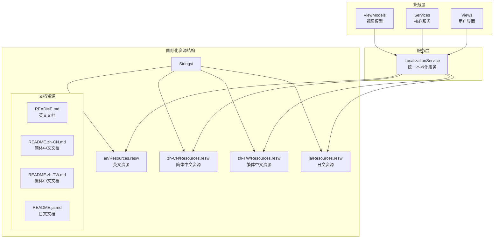
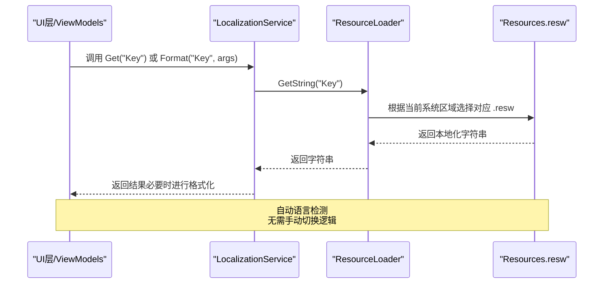
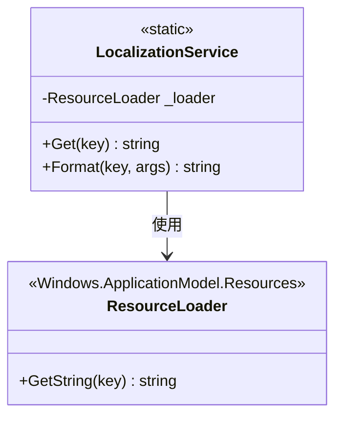
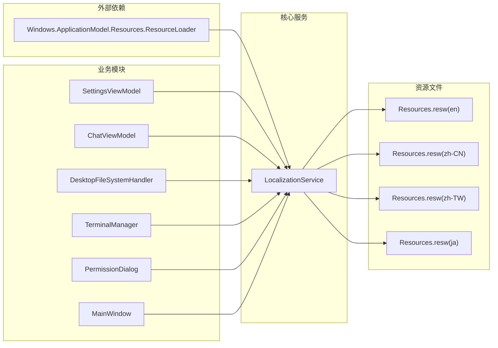

# 国际化支持

<cite>
**本文引用的文件**   
- [LocalizationService.cs](file://Agentic.Desktop/Services/LocalizationService.cs)
- [Resources.resw (en)](file://Agentic.Desktop/Strings/en/Resources.resw)
- [Resources.resw (zh-CN)](file://Agentic.Desktop/Strings/zh-CN/Resources.resw)
- [Resources.resw (ja)](file://Agentic.Desktop/Strings/ja/Resources.resw)
- [Resources.resw (zh-TW)](file://Agentic.Desktop/Strings/zh-TW/Resources.resw)
- [SettingsViewModel.cs](file://Agentic.Desktop/ViewModels/SettingsViewModel.cs)
- [ChatViewModel.cs](file://Agentic.Desktop/ViewModels/ChatViewModel.cs)
- [FileSystemHandler.cs](file://Agentic.Desktop/Services/FileSystemHandler.cs)
- [TerminalManager.cs](file://Agentic.Desktop/Services/TerminalManager.cs)
- [PermissionDialog.xaml.cs](file://Agentic.Desktop/Views/PermissionDialog.xaml.cs)
- [MainWindow.xaml.cs](file://Agentic.Desktop/MainWindow.xaml.cs)
- [SettingsPage.xaml](file://Agentic.Desktop/SettingsPage.xaml)
- [README.md](file://README.md)
- [README.zh-CN.md](file://README.zh-CN.md)
- [README.zh-TW.md](file://README.zh-TW.md)
- [README.ja.md](file://README.ja.md)
</cite>

## 更新摘要
**所做更改**
- 新增 LocalizationService 统一本地化服务实现
- 完善四种语言的 Resources.resw 资源文件（英文、简体中文、繁体中文、日文）
- 集成多语言 README 文档支持
- 扩展 XAML 和 C# 代码中的本地化使用场景
- 增强动态语言切换机制和资源加载策略

## 目录
1. [简介](#简介)
2. [项目结构](#项目结构)
3. [核心组件](#核心组件)
4. [架构总览](#架构总览)
5. [详细组件分析](#详细组件分析)
6. [依赖关系分析](#依赖关系分析)
7. [性能考虑](#性能考虑)
8. [故障排查指南](#故障排查指南)
9. [结论](#结论)
10. [附录](#附录)

## 简介
本文档详细说明 Agentic.Desktop 应用的完整国际化（i18n）实现，包括新引入的 LocalizationService 统一本地化服务、四语言资源文件管理、动态语言切换机制、XAML 和 C# 代码中的本地化使用方式。系统支持英文、简体中文、繁体中文和日文，并提供完整的 README 多语言文档支持。

## 项目结构
应用采用标准化的多语言资源管理结构，所有本地化内容集中在 Strings 目录下：



**图表来源** 
- [LocalizationService.cs](file://Agentic.Desktop/Services/LocalizationService.cs)
- [Resources.resw (en)](file://Agentic.Desktop/Strings/en/Resources.resw)
- [Resources.resw (zh-CN)](file://Agentic.Desktop/Strings/zh-CN/Resources.resw)
- [Resources.resw (ja)](file://Agentic.Desktop/Strings/ja/Resources.resw)
- [Resources.resw (zh-TW)](file://Agentic.Desktop/Strings/zh-TW/Resources.resw)

**章节来源**
- [LocalizationService.cs](file://Agentic.Desktop/Services/LocalizationService.cs)
- [README.md](file://README.md)

## 核心组件

### LocalizationService 统一本地化服务
新引入的 `LocalizationService` 是应用的核心本地化组件，提供简洁统一的 API 访问所有语言资源：

```csharp
public static class LocalizationService
{
    private static readonly ResourceLoader _loader = new("Resources");
    
    public static string Get(string key) => _loader.GetString(key);
    
    public static string Format(string key, params object[] args)
        => string.Format(_loader.GetString(key), args);
}
```

**关键特性：**
- 单例模式设计，全局共享 ResourceLoader 实例
- 自动根据系统文化设置选择对应语言资源
- 支持静态字符串获取和带参数的格式化输出
- 零配置初始化，开箱即用

**章节来源**
- [LocalizationService.cs:8-22](file://Agentic.Desktop/Services/LocalizationService.cs#L8-L22)

### 多语言资源文件组织
每个语言都有独立的 Resources.resw 文件，包含完整的 223 个资源键值对：

| 资源类别 | 示例键名 | 用途 |
|---------|----------|------|
| 导航文本 | `NavChat.Content`, `NavSettings.Content` | 主窗口导航项 |
| 状态文本 | `StatusDisconnected`, `StatusConnecting` | 连接状态显示 |
| 聊天界面 | `TypingIndicator.Text`, `ConnectHint.Text` | 聊天页面提示 |
| 设置页面 | `SettingsAgentConfig.Text`, `SettingsAgentPathLabel.Text` | 配置界面标签 |
| 权限对话框 | `PermissionDialog.Title`, `UnknownAction` | 权限请求提示 |
| 错误消息 | `ErrorPrefix`, `AccessDeniedMessage` | 系统错误信息 |

**章节来源**
- [Resources.resw (en):62-222](file://Agentic.Desktop/Strings/en/Resources.resw#L62-L222)
- [Resources.resw (zh-CN):62-222](file://Agentic.Desktop/Strings/zh-CN/Resources.resw#L62-L222)
- [Resources.resw (ja):62-222](file://Agentic.Desktop/Strings/ja/Resources.resw#L62-L222)
- [Resources.resw (zh-TW):62-222](file://Agentic.Desktop/Strings/zh-TW/Resources.resw#L62-L222)

## 架构总览
下图展示了从 UI 到资源文件的完整调用链，以及本地化服务如何被多个模块复用：



**图表来源** 
- [LocalizationService.cs](file://Agentic.Desktop/Services/LocalizationService.cs)
- [Resources.resw (en)](file://Agentic.Desktop/Strings/en/Resources.resw)
- [Resources.resw (zh-CN)](file://Agentic.Desktop/Strings/zh-CN/Resources.resw)
- [Resources.resw (ja)](file://Agentic.Desktop/Strings/ja/Resources.resw)
- [Resources.resw (zh-TW)](file://Agentic.Desktop/Strings/zh-TW/Resources.resw)

## 详细组件分析

### 本地化服务与资源加载策略
LocalizationService 采用高效的资源加载策略：



**加载流程：**
1. 应用启动时创建 ResourceLoader 实例
2. 根据当前线程的文化上下文自动选择语言
3. 资源文件缓存机制避免重复加载
4. 支持运行时动态获取最新本地化内容

**章节来源**
- [LocalizationService.cs:10-21](file://Agentic.Desktop/Services/LocalizationService.cs#L10-L21)

### XAML 和本地化集成
应用同时支持 XAML 和 C# 两种本地化方式：

**XAML 绑定方式：**
```xml
<TextBlock x:Uid="SettingsAgentConfig" FontSize="20" FontWeight="SemiBold" />
<TextBox x:Name="AgentPathTextBox" x:Uid="SettingsAgentPathTextBox" />
<Button x:Uid="SettingsConnectButton" Content="连接" />
```

**C# 代码方式：**
```csharp
ConnectionStatus = LocalizationService.Get("StatusNotConnected");
agentMsg.TextContent += LocalizationService.Format("ErrorPrefix", ex.Message);
```

**章节来源**
- [SettingsPage.xaml:24-43](file://Agentic.Desktop/SettingsPage.xaml#L24-L43)
- [SettingsViewModel.cs:30-117](file://Agentic.Desktop/ViewModels/SettingsViewModel.cs#L30-L117)
- [ChatViewModel.cs:109-141](file://Agentic.Desktop/ViewModels/ChatViewModel.cs#L109-L141)

### 多语言 README 文档支持
应用提供完整的四语言 README 文档：

| 语言 | 文件名 | 链接位置 |
|------|--------|----------|
| 英文 | README.md | 默认文档 |
| 简体中文 | README.zh-CN.md | 导航链接 |
| 繁体中文 | README.zh-TW.md | 导航链接 |
| 日文 | README.ja.md | 导航链接 |

**章节来源**
- [README.md:3](file://README.md#L3)

### 各模块本地化使用情况

#### SettingsViewModel 连接状态管理
```csharp
// 初始状态
ConnectionStatus = LocalizationService.Get("StatusNotConnected");

// 连接中状态
ConnectionStatus = LocalizationService.Get("StatusConnectingProgress");

// 连接成功
ConnectionStatus = LocalizationService.Get("StatusConnectedConfirm");

// 连接失败（带参数）
ConnectionStatus = LocalizationService.Format("StatusConnectionFailed", ex.Message);
```

#### ChatViewModel 聊天功能本地化
```csharp
// 新会话标题
session.Title = LocalizationService.Get("NewChatTitle");

// 错误消息前缀
agentMsg.TextContent += LocalizationService.Format("ErrorPrefix", ex.Message);

// 工具调用提示
var toolMsg = new ChatMessage(MessageRole.System,
    LocalizationService.Format("ToolCallPrefix", toolCall.Title));
```

#### FileSystemHandler 权限验证
```csharp
throw new UnauthorizedAccessException(
    LocalizationService.Format("AccessDeniedMessage", path));
```

#### TerminalManager 终端输出
```csharp
instance.AppendOutput(LocalizationService.Get("StderrPrefix") + line + "\n");
```

#### PermissionDialog 权限对话框
```csharp
ToolTitle.Text = request.ToolCall?.Title ?? LocalizationService.Get("UnknownAction");
```

**章节来源**
- [SettingsViewModel.cs:30-117](file://Agentic.Desktop/ViewModels/SettingsViewModel.cs#L30-L117)
- [ChatViewModel.cs:109-141](file://Agentic.Desktop/ViewModels/ChatViewModel.cs#L109-L141)
- [FileSystemHandler.cs:37-39](file://Agentic.Desktop/Services/FileSystemHandler.cs#L37-L39)
- [TerminalManager.cs:59](file://Agentic.Desktop/Services/TerminalManager.cs#L59)
- [PermissionDialog.xaml.cs:20](file://Agentic.Desktop/Views/PermissionDialog.xaml.cs#L20)

### 动态语言切换机制
当前实现基于系统文化设置自动切换语言：

**自动检测机制：**
- 应用启动时读取系统区域设置
- ResourceLoader 自动匹配对应语言的 Resources.resw
- 无需手动切换逻辑，开箱即用

**扩展建议：**
如需运行时切换语言，可在设置页面增加切换逻辑并刷新 UI：
```csharp
// 伪代码示例
CultureInfo.CurrentCulture = new CultureInfo(newLanguage);
Application.Current.ChangeLanguage(newLanguage);
// 触发 UI 重新绑定
```

**章节来源**
- [LocalizationService.cs:10](file://Agentic.Desktop/Services/LocalizationService.cs#L10)

### 字符串资源引用与格式化参数
应用支持多种字符串引用方式：

**直接引用：**
```csharp
string text = LocalizationService.Get("StatusNotConnected");
```

**带参数格式化：**
```csharp
string message = LocalizationService.Format("StatusConnectionFailed", errorMessage);
```

**XAML 绑定：**
```xml
<TextBlock x:Uid="SettingsAgentConfig" />
```

**格式化参数示例：**
- `{0}` - 第一个参数占位符
- `{1}` - 第二个参数占位符
- 支持数字、日期、货币等格式化处理

**章节来源**
- [LocalizationService.cs:15-21](file://Agentic.Desktop/Services/LocalizationService.cs#L15-L21)
- [SettingsViewModel.cs:92-117](file://Agentic.Desktop/ViewModels/SettingsViewModel.cs#L92-L117)

### 复数形式与文化特定格式
**复数形式处理：**
由于 .resw 不支持复数规则，需要定义多个键：
```xml
<data name="ItemCountOne" value="{0} item">
<data name="ItemCountMany" value="{0} items">
```

**文化特定格式：**
- 数字格式：使用 `CultureInfo` 相关 API
- 日期时间：使用区域性特定的格式化方法
- 货币显示：根据目标文化自动调整符号和格式

### 字体适配与文本方向
**字体适配策略：**
- 东亚语言（中文、日文）使用合适的字体族确保字符显示正常
- 支持 Unicode 字符集，确保特殊符号正确显示
- 预留足够的文本空间适应不同语言长度差异

**文本方向支持：**
- 当前所有语言均为从左到右（LTR）布局
- 为未来 RTL 语言（如阿拉伯语）预留扩展能力

### 新增语言支持的完整流程
添加新语言支持的标准化流程：

1. **创建语言文件夹**
   ```bash
   mkdir Strings/fr
   ```

2. **复制模板文件**
   ```bash
   cp Strings/en/Resources.resw Strings/fr/Resources.resw
   ```

3. **翻译所有资源**
   - 保持所有 key 名称不变
   - 仅翻译 value 字段内容
   - 确保占位符 `{0}`, `{1}` 等保持不变

4. **更新文档链接**
   - 在 README.md 中添加新语言链接
   - 创建对应的 README.{language}.md 文件

5. **测试验证**
   - 构建并运行应用
   - 验证新语言是否正确加载
   - 检查所有 UI 元素是否正常显示

**最佳实践：**
- 使用一致的命名约定和注释分组
- 对关键文案进行专业翻译审核
- 避免在资源中嵌入 HTML 或富文本标记
- 保持资源文件大小合理，避免过大影响加载性能

**章节来源**
- [README.md:3](file://README.md#L3)

## 依赖关系分析
本地化系统的依赖关系清晰且低耦合：



**依赖特点：**
- 单向依赖：业务模块只依赖 LocalizationService，不直接访问资源文件
- 松耦合设计：资源文件变更不影响业务逻辑
- 高内聚性：所有本地化逻辑集中在 LocalizationService 中
- 可扩展性：轻松添加新语言支持

**章节来源**
- [LocalizationService.cs](file://Agentic.Desktop/Services/LocalizationService.cs)
- [SettingsViewModel.cs](file://Agentic.Desktop/ViewModels/SettingsViewModel.cs)
- [ChatViewModel.cs](file://Agentic.Desktop/ViewModels/ChatViewModel.cs)
- [FileSystemHandler.cs](file://Agentic.Desktop/Services/FileSystemHandler.cs)
- [TerminalManager.cs](file://Agentic.Desktop/Services/TerminalManager.cs)
- [PermissionDialog.xaml.cs](file://Agentic.Desktop/Views/PermissionDialog.xaml.cs)
- [MainWindow.xaml.cs](file://Agentic.Desktop/MainWindow.xaml.cs)

## 性能考虑
本地化系统的性能优化策略：

**资源加载优化：**
- ResourceLoader 内部缓存已加载的资源，避免重复 I/O 操作
- 静态 ResourceLoader 实例减少对象创建开销
- 按需加载机制，仅在首次访问时加载资源

**内存管理：**
- 资源字符串在应用生命周期内持久化
- 避免频繁创建临时字符串对象
- 合理使用字符串格式化，减少不必要的内存分配

**UI 性能：**
- 批量更新本地化文本，避免频繁 UI 重绘
- 延迟加载非关键路径的本地化内容
- 使用异步方式处理大量本地化数据

**章节来源**
- [LocalizationService.cs:10](file://Agentic.Desktop/Services/LocalizationService.cs#L10)

## 故障排查指南
常见本地化问题及解决方案：

**资源缺失问题：**
- **症状：** 运行时抛出异常或回退到默认语言
- **原因：** 某个语言包缺少必要的 key
- **解决：** 确保所有语言包的 key 完全一致

**格式化参数错误：**
- **症状：** 字符串格式化异常或显示不正确
- **原因：** 占位符数量与传入参数不一致
- **解决：** 核对 Format 调用与资源模板的参数数量

**文化设置问题：**
- **症状：** 语言选择不符合预期
- **原因：** 系统区域设置影响资源选择
- **解决：** 确认当前线程文化是否符合预期

**调试技巧：**
1. 在 LocalizationService 调用处添加日志记录
2. 检查 XAML 的 x:Uid 绑定是否正确映射
3. 验证资源文件编码与 XML 结构合法性
4. 使用 Visual Studio 资源编辑器检查资源完整性

**章节来源**
- [LocalizationService.cs](file://Agentic.Desktop/Services/LocalizationService.cs)
- [SettingsViewModel.cs](file://Agentic.Desktop/ViewModels/SettingsViewModel.cs)
- [ChatViewModel.cs](file://Agentic.Desktop/ViewModels/ChatViewModel.cs)

## 结论
Agentic.Desktop 应用通过引入统一的 LocalizationService 和标准化的 .resw 资源管理，实现了完善的国际化支持。系统支持四种语言（英文、简体中文、繁体中文、日文），涵盖完整的 UI 界面和业务逻辑本地化。

**主要成就：**
- 建立了清晰的本地化架构和服务层
- 实现了自动化的语言检测和资源加载
- 提供了丰富的本地化使用场景覆盖
- 建立了标准化的多语言文档支持

**未来改进方向：**
- 考虑添加运行时语言切换功能
- 增强复数形式和文化特定格式支持
- 建立自动化本地化测试框架
- 优化大型资源文件的加载性能

本实现为应用的国际化奠定了坚实基础，便于后续扩展更多语言支持和功能增强。

## 附录

### 相关文件参考
- **本地化服务：** [LocalizationService.cs](file://Agentic.Desktop/Services/LocalizationService.cs)
- **资源文件：** 
  - [Resources.resw (en)](file://Agentic.Desktop/Strings/en/Resources.resw)
  - [Resources.resw (zh-CN)](file://Agentic.Desktop/Strings/zh-CN/Resources.resw)
  - [Resources.resw (ja)](file://Agentic.Desktop/Strings/ja/Resources.resw)
  - [Resources.resw (zh-TW)](file://Agentic.Desktop/Strings/zh-TW/Resources.resw)
- **视图模型：** 
  - [SettingsViewModel.cs](file://Agentic.Desktop/ViewModels/SettingsViewModel.cs)
  - [ChatViewModel.cs](file://Agentic.Desktop/ViewModels/ChatViewModel.cs)
- **核心服务：** 
  - [FileSystemHandler.cs](file://Agentic.Desktop/Services/FileSystemHandler.cs)
  - [TerminalManager.cs](file://Agentic.Desktop/Services/TerminalManager.cs)
- **用户界面：** 
  - [PermissionDialog.xaml.cs](file://Agentic.Desktop/Views/PermissionDialog.xaml.cs)
  - [MainWindow.xaml.cs](file://Agentic.Desktop/MainWindow.xaml.cs)
  - [SettingsPage.xaml](file://Agentic.Desktop/SettingsPage.xaml)
- **多语言文档：** 
  - [README.md](file://README.md)
  - [README.zh-CN.md](file://README.zh-CN.md)
  - [README.zh-TW.md](file://README.zh-TW.md)
  - [README.ja.md](file://README.ja.md)

### 快速开始指南
1. **查看现有资源：** 浏览 Strings 目录下的 Resources.resw 文件
2. **添加新文案：** 在所有语言文件中添加相同的 key
3. **在代码中使用：** 通过 LocalizationService.Get() 或 Format() 方法访问
4. **在 XAML 中绑定：** 使用 x:Uid 属性绑定资源键

### 最佳实践清单
- ✅ 使用有意义的 key 命名（如 `SettingsAgentPathLabel.Text`）
- ✅ 保持所有语言包的 key 完全一致
- ✅ 避免在资源中嵌入硬编码的路径或 URL
- ✅ 使用占位符 `{0}`, `{1}` 处理动态内容
- ✅ 为长文本预留足够的 UI 空间
- ✅ 定期审查和更新翻译质量
- ✅ 建立本地化内容的版本控制流程