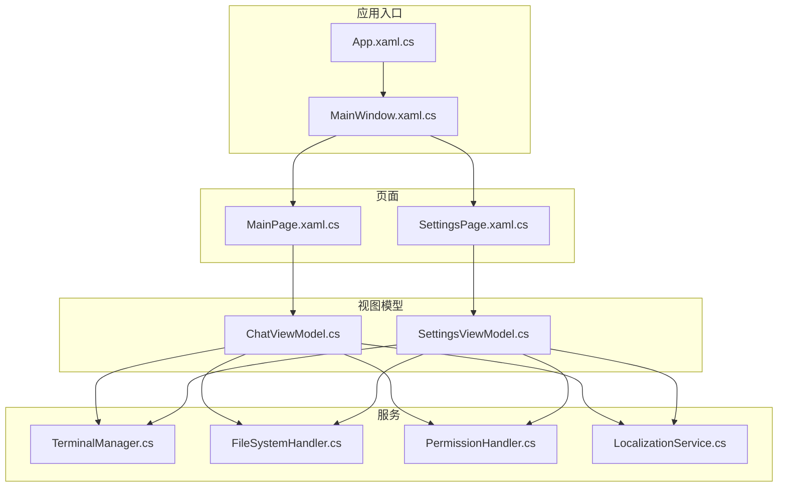
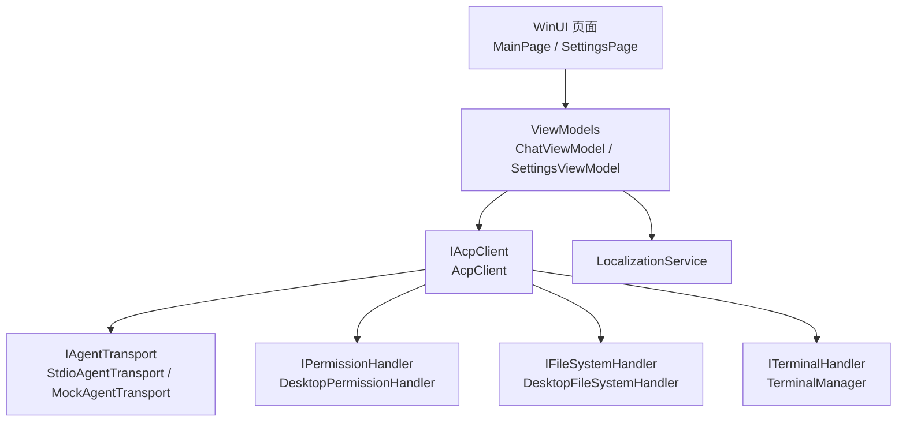
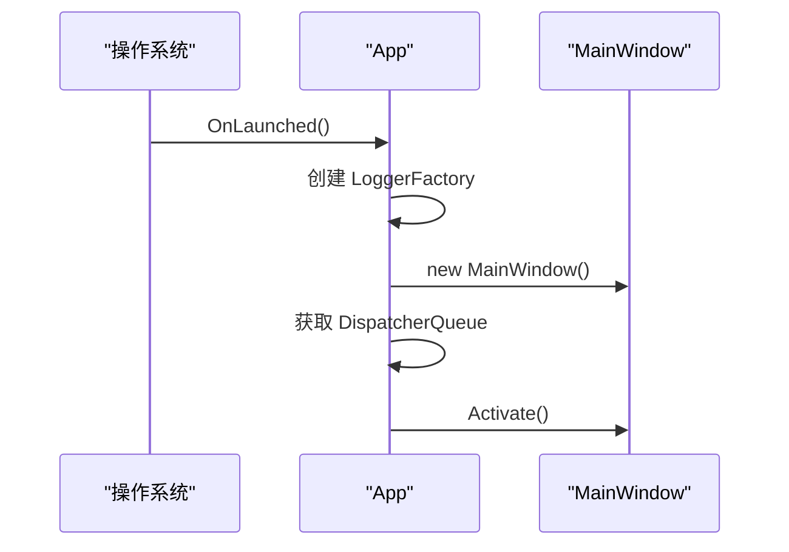
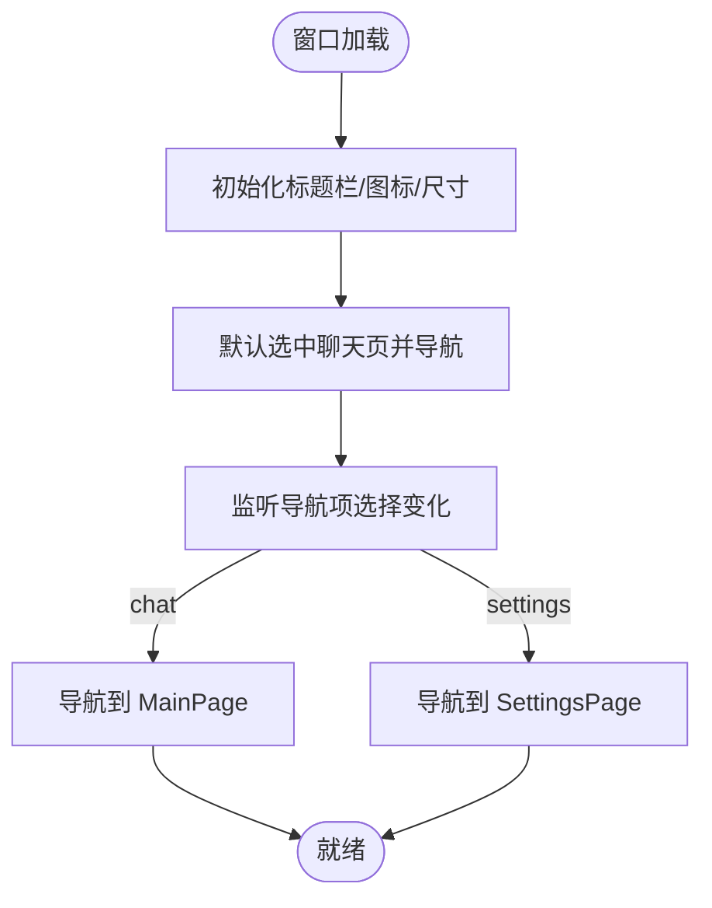
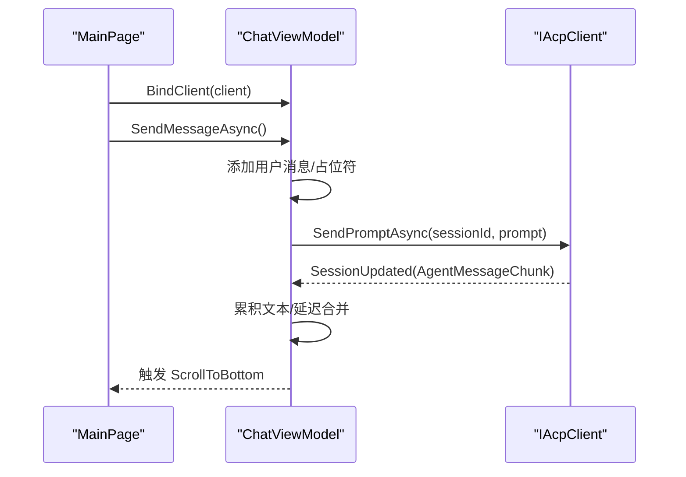
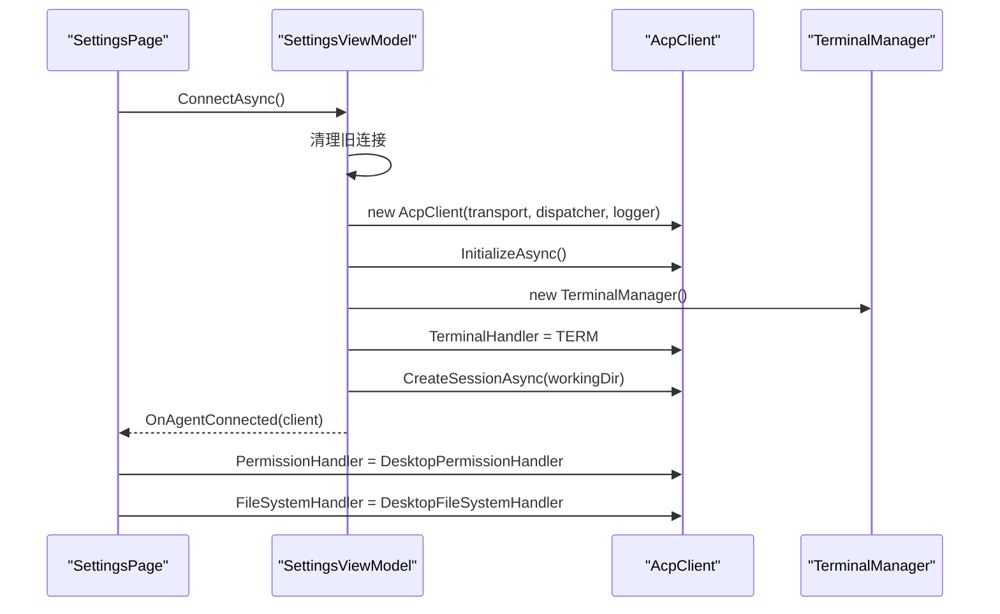
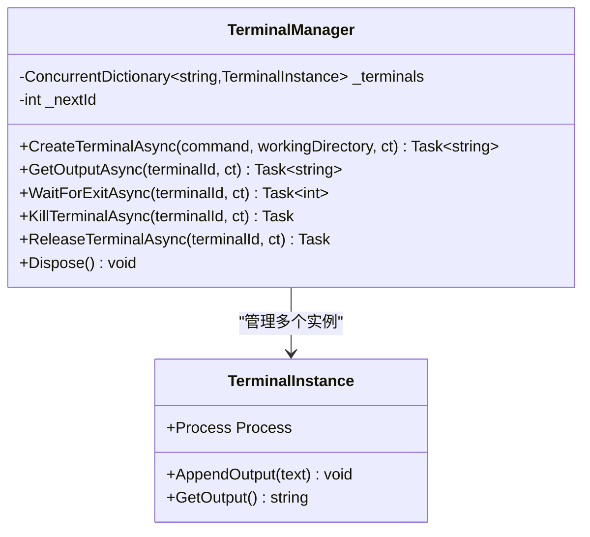
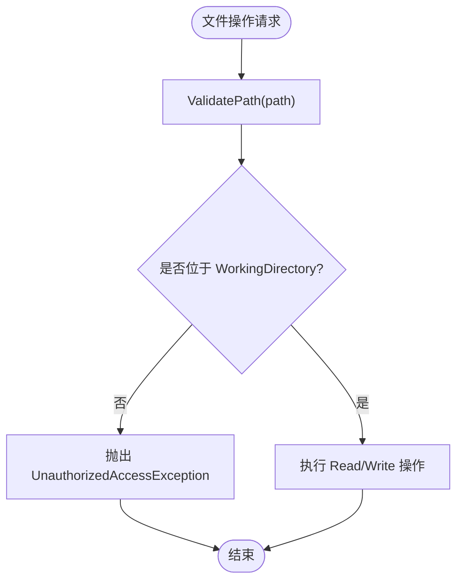
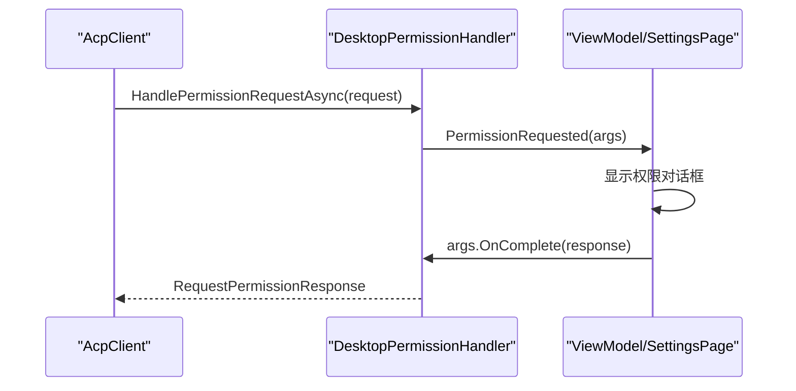
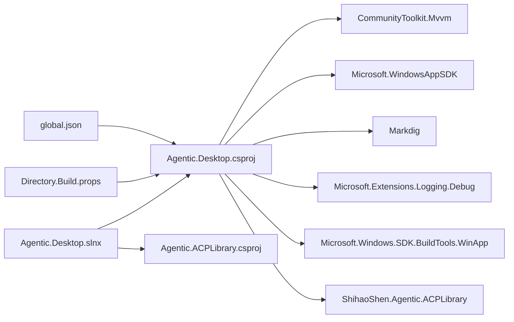

# 开发指南

<cite>
**本文引用的文件**   
- [README.md](file://README.md)
- [global.json](file://global.json)
- [Directory.Build.props](file://Directory.Build.props)
- [Agentic.Desktop.slnx](file://Agentic.Desktop.slnx)
- [Agentic.Desktop.csproj](file://Agentic.Desktop/Agentic.Desktop.csproj)
- [App.xaml.cs](file://Agentic.Desktop/App.xaml.cs)
- [MainWindow.xaml.cs](file://Agentic.Desktop/MainWindow.xaml.cs)
- [MainPage.xaml.cs](file://Agentic.Desktop/MainPage.xaml.cs)
- [SettingsPage.xaml.cs](file://Agentic.Desktop/SettingsPage.xaml.cs)
- [ChatViewModel.cs](file://Agentic.Desktop/ViewModels/ChatViewModel.cs)
- [SettingsViewModel.cs](file://Agentic.Desktop/ViewModels/SettingsViewModel.cs)
- [TerminalManager.cs](file://Agentic.Desktop/Services/TerminalManager.cs)
- [FileSystemHandler.cs](file://Agentic.Desktop/Services/FileSystemHandler.cs)
- [PermissionHandler.cs](file://Agentic.Desktop/Services/PermissionHandler.cs)
- [LocalizationService.cs](file://Agentic.Desktop/Services/LocalizationService.cs)
</cite>

## 目录
1. [简介](#简介)
2. [项目结构](#项目结构)
3. [核心组件](#核心组件)
4. [架构总览](#架构总览)
5. [详细组件分析](#详细组件分析)
6. [依赖关系分析](#依赖关系分析)
7. [性能与内存优化](#性能与内存优化)
8. [调试与测试](#调试与测试)
9. [代码质量与规范](#代码质量与规范)
10. [Git 工作流与分支策略](#git-工作流与分支策略)
11. [常见问题排查](#常见问题排查)
12. [结论](#结论)
13. [附录：构建与发布命令](#附录构建与发布命令)

## 简介
本指南面向 Agentic.Desktop 的开发者，覆盖环境搭建、项目结构与配置、NuGet 包管理、构建脚本使用、调试技巧、单元测试编写、代码质量检查、Git 工作流与分支策略、性能分析与内存泄漏检测、错误追踪、扩展与插件开发、第三方集成以及常见问题排查与优化建议。该项目基于 WinUI 3 与 .NET 10，采用 MVVM 架构，通过 ACP（Agent Communication Protocol）与外部 Agent 进程通信，并提供内置 Mock Agent 用于无真实 Agent 时的 UI 体验。

## 项目结构
- 应用入口与窗口
  - App.xaml.cs：应用生命周期、全局日志工厂、AcpClient 单例持有与事件通知、UI 线程调度器暴露
  - MainWindow.xaml.cs：主窗口、导航框架、连接状态指示更新、页面切换
- 页面与视图模型
  - MainPage.xaml.cs：聊天页，绑定 ChatViewModel，处理输入、滚动、侧边栏切换
  - SettingsPage.xaml.cs：设置页，负责 Agent 连接、权限对话框、文件系统处理器注入、连接状态同步
  - ViewModels：ChatViewModel（会话与消息流式渲染）、SettingsViewModel（连接/断开、进程退出监听、终端管理器创建）
- 服务层
  - TerminalManager：多终端进程管理、标准输出/错误异步读取、进程生命周期控制
  - DesktopFileSystemHandler：受控的文件读写，路径校验限制在 WorkingDirectory 内
  - DesktopPermissionHandler：权限请求 UI 桥接，事件驱动显示确认对话框
  - LocalizationService：资源字符串加载与格式化
- 配置与构建
  - global.json：锁定 .NET SDK 版本与回滚策略
  - Directory.Build.props：全局编译选项（可空、隐式 using、语言版本）
  - Agentic.Desktop.csproj：目标框架、平台、NuGet 包引用、MSIX 工具支持、发布优化开关
  - Agentic.Desktop.slnx：解决方案定义（包含桌面项目与 ACPLibrary 子项目）

**图表来源** 
- [App.xaml.cs:1-85](file://Agentic.Desktop/App.xaml.cs#L1-L85)
- [MainWindow.xaml.cs:1-97](file://Agentic.Desktop/MainWindow.xaml.cs#L1-L97)
- [MainPage.xaml.cs:1-105](file://Agentic.Desktop/MainPage.xaml.cs#L1-L105)
- [SettingsPage.xaml.cs:1-96](file://Agentic.Desktop/SettingsPage.xaml.cs#L1-L96)
- [ChatViewModel.cs:1-237](file://Agentic.Desktop/ViewModels/ChatViewModel.cs#L1-L237)
- [SettingsViewModel.cs:1-162](file://Agentic.Desktop/ViewModels/SettingsViewModel.cs#L1-L162)
- [TerminalManager.cs:1-161](file://Agentic.Desktop/Services/TerminalManager.cs#L1-L161)
- [FileSystemHandler.cs:1-42](file://Agentic.Desktop/Services/FileSystemHandler.cs#L1-L42)
- [PermissionHandler.cs:1-52](file://Agentic.Desktop/Services/PermissionHandler.cs#L1-L52)
- [LocalizationService.cs:1-23](file://Agentic.Desktop/Services/LocalizationService.cs#L1-L23)

**章节来源**
- [README.md:1-92](file://README.md#L1-L92)
- [Agentic.Desktop.csproj:1-79](file://Agentic.Desktop/Agentic.Desktop.csproj#L1-L79)
- [Agentic.Desktop.slnx:1-7](file://Agentic.Desktop.slnx#L1-L7)
- [global.json:1-8](file://global.json#L1-L8)
- [Directory.Build.props:1-8](file://Directory.Build.props#L1-L8)

## 核心组件
- 应用生命周期与全局状态
  - App 提供 Window、DispatcherQueue、WindowHandle、CurrentAcpClient、AcpClientChanged 事件、LoggerFactory
- 主窗口与导航
  - MainWindow 维护 NavigationView、RootFrame，统一更新连接状态指示
- 聊天界面与流式消息
  - MainPage 绑定 ChatViewModel，处理键盘发送、侧边栏切换、自动滚动到底部
- 设置与连接管理
  - SettingsPage 负责权限对话框、文件系统处理器注入、连接状态同步到 App 和 MainWindow
- 视图模型
  - ChatViewModel：消息集合、会话切换、流式文本合并、工具调用提示、取消生成
  - SettingsViewModel：连接/断开、进程退出监听、终端管理器创建、会话创建
- 服务
  - TerminalManager：并发字典管理多个终端实例，异步读取 stdout/stderr，进程终止与释放
  - DesktopFileSystemHandler：路径校验，确保仅访问 WorkingDirectory 内的文件
  - DesktopPermissionHandler：将权限请求派发至 UI 线程并等待用户选择结果
  - LocalizationService：封装资源加载与格式化

**章节来源**
- [App.xaml.cs:1-85](file://Agentic.Desktop/App.xaml.cs#L1-L85)
- [MainWindow.xaml.cs:1-97](file://Agentic.Desktop/MainWindow.xaml.cs#L1-L97)
- [MainPage.xaml.cs:1-105](file://Agentic.Desktop/MainPage.xaml.cs#L1-L105)
- [SettingsPage.xaml.cs:1-96](file://Agentic.Desktop/SettingsPage.xaml.cs#L1-L96)
- [ChatViewModel.cs:1-237](file://Agentic.Desktop/ViewModels/ChatViewModel.cs#L1-L237)
- [SettingsViewModel.cs:1-162](file://Agentic.Desktop/ViewModels/SettingsViewModel.cs#L1-L162)
- [TerminalManager.cs:1-161](file://Agentic.Desktop/Services/TerminalManager.cs#L1-L161)
- [FileSystemHandler.cs:1-42](file://Agentic.Desktop/Services/FileSystemHandler.cs#L1-L42)
- [PermissionHandler.cs:1-52](file://Agentic.Desktop/Services/PermissionHandler.cs#L1-L52)
- [LocalizationService.cs:1-23](file://Agentic.Desktop/Services/LocalizationService.cs#L1-L23)

## 架构总览
应用采用 MVVM + ACP 客户端模式。UI 层通过 XAML 与 ViewModel 交互；ViewModel 通过 IAcpClient 与 Agent 通信，传输层支持 stdio 或 Mock。权限与文件系统操作通过 IPermissionHandler 与 IFileSystemHandler 抽象，由桌面实现完成。

**图表来源** 
- [MainPage.xaml.cs:1-105](file://Agentic.Desktop/MainPage.xaml.cs#L1-L105)
- [SettingsPage.xaml.cs:1-96](file://Agentic.Desktop/SettingsPage.xaml.cs#L1-L96)
- [ChatViewModel.cs:1-237](file://Agentic.Desktop/ViewModels/ChatViewModel.cs#L1-L237)
- [SettingsViewModel.cs:1-162](file://Agentic.Desktop/ViewModels/SettingsViewModel.cs#L1-L162)
- [PermissionHandler.cs:1-52](file://Agentic.Desktop/Services/PermissionHandler.cs#L1-L52)
- [FileSystemHandler.cs:1-42](file://Agentic.Desktop/Services/FileSystemHandler.cs#L1-L42)
- [TerminalManager.cs:1-161](file://Agentic.Desktop/Services/TerminalManager.cs#L1-L161)

## 详细组件分析

### 应用启动与全局状态（App）
- 初始化日志工厂（Debug 输出，最低级别 Debug）
- 创建主窗口、获取 UI 线程 DispatcherQueue
- 暴露 CurrentAcpClient 与 AcpClientChanged 事件，供页面订阅
- SetAcpClient 方法用于设置当前 AcpClient 并触发变更通知

**图表来源** 
- [App.xaml.cs:1-85](file://Agentic.Desktop/App.xaml.cs#L1-L85)

**章节来源**
- [App.xaml.cs:1-85](file://Agentic.Desktop/App.xaml.cs#L1-L85)

### 主窗口与导航（MainWindow）
- 设置标题栏扩展、图标、初始尺寸
- UpdateConnectionStatus 根据状态码更新圆点颜色与文字
- RootNavView 切换“聊天”与“设置”页面
- NavigateToSettings 从聊天页跳转到设置页

**图表来源** 
- [MainWindow.xaml.cs:1-97](file://Agentic.Desktop/MainWindow.xaml.cs#L1-L97)

**章节来源**
- [MainWindow.xaml.cs:1-97](file://Agentic.Desktop/MainWindow.xaml.cs#L1-L97)

### 聊天页面与流式消息（MainPage + ChatViewModel）
- MainPage 绑定 ChatListPanel 与 ViewModel，订阅 ScrollToBottom 事件
- 若已存在 AcpClient，立即绑定；否则订阅 App.AcpClientChanged 后续绑定
- ChatViewModel 维护会话列表、消息集合、流式文本合并、工具调用提示、取消生成
- 流式合并策略：累积文本，延迟 50ms 批量刷新 UI，避免频繁重绘

**图表来源** 
- [MainPage.xaml.cs:1-105](file://Agentic.Desktop/MainPage.xaml.cs#L1-L105)
- [ChatViewModel.cs:1-237](file://Agentic.Desktop/ViewModels/ChatViewModel.cs#L1-L237)

**章节来源**
- [MainPage.xaml.cs:1-105](file://Agentic.Desktop/MainPage.xaml.cs#L1-L105)
- [ChatViewModel.cs:1-237](file://Agentic.Desktop/ViewModels/ChatViewModel.cs#L1-L237)

### 设置页与连接管理（SettingsPage + SettingsViewModel）
- SettingsPage 在连接成功后创建权限处理器与文件系统处理器，注入到 AcpClient
- 订阅 ViewModel 的连接状态变化，更新 MainWindow 的状态指示
- SettingsViewModel 负责连接/断开、进程退出监听、终端管理器创建、会话创建
- 连接流程：选择传输层（Mock 或 Stdio），创建 AcpClient，初始化、创建会话、设置回调

**图表来源** 
- [SettingsPage.xaml.cs:1-96](file://Agentic.Desktop/SettingsPage.xaml.cs#L1-L96)
- [SettingsViewModel.cs:1-162](file://Agentic.Desktop/ViewModels/SettingsViewModel.cs#L1-L162)
- [TerminalManager.cs:1-161](file://Agentic.Desktop/Services/TerminalManager.cs#L1-L161)

**章节来源**
- [SettingsPage.xaml.cs:1-96](file://Agentic.Desktop/SettingsPage.xaml.cs#L1-L96)
- [SettingsViewModel.cs:1-162](file://Agentic.Desktop/ViewModels/SettingsViewModel.cs#L1-L162)

### 终端管理（TerminalManager）
- 并发字典管理多个终端实例，分配唯一 ID
- 启动 cmd.exe 或 /bin/sh，重定向标准输入/输出/错误
- 异步读取 stdout/stderr 并追加到缓冲区，支持取消令牌
- 提供获取输出、等待退出、终止进程、释放资源等方法
- Dispose 时确保所有进程被终止并释放句柄

**图表来源** 
- [TerminalManager.cs:1-161](file://Agentic.Desktop/Services/TerminalManager.cs#L1-L161)

**章节来源**
- [TerminalManager.cs:1-161](file://Agentic.Desktop/Services/TerminalManager.cs#L1-L161)

### 文件系统处理器（DesktopFileSystemHandler）
- 构造函数接收 WorkingDirectory，规范化为绝对路径
- 读写文本文件前进行路径校验，确保路径以 WorkingDirectory 开头
- 写入时自动创建目录

**图表来源** 
- [FileSystemHandler.cs:1-42](file://Agentic.Desktop/Services/FileSystemHandler.cs#L1-L42)

**章节来源**
- [FileSystemHandler.cs:1-42](file://Agentic.Desktop/Services/FileSystemHandler.cs#L1-L42)

### 权限处理器（DesktopPermissionHandler）
- 将权限请求派发至 UI 线程，触发 PermissionRequested 事件
- ViewModel 展示 ContentDialog，用户确认后调用 OnComplete 返回结果

**图表来源** 
- [PermissionHandler.cs:1-52](file://Agentic.Desktop/Services/PermissionHandler.cs#L1-L52)
- [SettingsPage.xaml.cs:1-96](file://Agentic.Desktop/SettingsPage.xaml.cs#L1-L96)

**章节来源**
- [PermissionHandler.cs:1-52](file://Agentic.Desktop/Services/PermissionHandler.cs#L1-L52)
- [SettingsPage.xaml.cs:1-96](file://Agentic.Desktop/SettingsPage.xaml.cs#L1-L96)

### 本地化服务（LocalizationService）
- 封装 Windows.ApplicationModel.Resources.ResourceLoader
- 提供 Get(key) 与 Format(key, params) 方法

**章节来源**
- [LocalizationService.cs:1-23](file://Agentic.Desktop/Services/LocalizationService.cs#L1-L23)

## 依赖关系分析
- NuGet 包引用
  - Markdig：Markdown 渲染
  - Microsoft.Windows.SDK.BuildTools：SDK 构建工具
  - Microsoft.WindowsAppSDK：WinUI 3 运行时与 API
  - CommunityToolkit.Mvvm：MVVM 基础（ObservableObject、RelayCommand）
  - Microsoft.Extensions.Logging.Debug：调试日志输出
  - Microsoft.Windows.SDK.BuildTools.WinApp：dotnet run 对打包 WinUI 的支持
  - ShihaoShen.Agentic.ACPLibrary：ACP 协议客户端与传输层
- 解决方案与项目
  - Agentic.Desktop.slnx 包含桌面项目与 ACPLibrary 子项目
  - Agentic.Desktop.csproj 指定目标框架 net10.0-windows10.0.26100.0，平台 x86/x64/ARM64
- 全局构建属性
  - Directory.Build.props 启用可空、隐式 using、最新语言版本
  - global.json 锁定 SDK 版本 10.0.100，允许预发行与特性回滚

**图表来源** 
- [Agentic.Desktop.csproj:1-79](file://Agentic.Desktop/Agentic.Desktop.csproj#L1-L79)
- [Agentic.Desktop.slnx:1-7](file://Agentic.Desktop.slnx#L1-L7)
- [Directory.Build.props:1-8](file://Directory.Build.props#L1-L8)
- [global.json:1-8](file://global.json#L1-L8)

**章节来源**
- [Agentic.Desktop.csproj:1-79](file://Agentic.Desktop/Agentic.Desktop.csproj#L1-L79)
- [Agentic.Desktop.slnx:1-7](file://Agentic.Desktop.slnx#L1-L7)
- [Directory.Build.props:1-8](file://Directory.Build.props#L1-L8)
- [global.json:1-8](file://global.json#L1-L8)

## 性能与内存优化
- 流式消息合并
  - ChatViewModel 使用 50ms 延迟批量合并文本，减少 UI 重绘次数
  - 使用 DispatcherQueue.TryEnqueue 确保 UI 线程安全更新
- 终端进程管理
  - TerminalManager 使用 ConcurrentDictionary 管理多实例，避免锁竞争
  - 异步读取 stdout/stderr，避免阻塞 UI 线程
  - 释放时强制终止进程树并释放句柄，防止资源泄漏
- 文件系统访问
  - 路径校验避免越权访问，减少异常开销
- 日志与调试
  - App 初始化 ILoggerFactory 输出 Debug 级别日志，便于定位问题
- 发布优化
  - 非 Debug 配置启用 ReadyToRun 与 Trimmed，减小体积并提升启动速度

**章节来源**
- [ChatViewModel.cs:1-237](file://Agentic.Desktop/ViewModels/ChatViewModel.cs#L1-L237)
- [TerminalManager.cs:1-161](file://Agentic.Desktop/Services/TerminalManager.cs#L1-L161)
- [FileSystemHandler.cs:1-42](file://Agentic.Desktop/Services/FileSystemHandler.cs#L1-L42)
- [App.xaml.cs:1-85](file://Agentic.Desktop/App.xaml.cs#L1-L85)
- [Agentic.Desktop.csproj:71-78](file://Agentic.Desktop/Agentic.Desktop.csproj#L71-L78)

## 调试与测试
- 调试技巧
  - 使用 Visual Studio 或 VS Code 附加到进程，查看日志输出
  - 在 App 中启用 Debug 日志，观察 AcpClient 初始化与事件
  - 使用内置 Mock Agent 快速验证 UI 流程与消息流式渲染
- 单元测试建议
  - 针对 ChatViewModel 的流式合并逻辑与取消生成行为编写测试
  - 针对 TerminalManager 的进程生命周期与输出缓冲进行测试
  - 针对 DesktopFileSystemHandler 的路径校验与异常场景进行测试
  - 使用 Moq 模拟 IAcpClient 与 IAgentTransport，隔离外部依赖
- 代码覆盖率
  - 使用 dotnet test 运行测试并生成覆盖率报告
  - 关注关键路径：连接/断开、消息发送、权限请求、文件读写

**章节来源**
- [ChatViewModel.cs:1-237](file://Agentic.Desktop/ViewModels/ChatViewModel.cs#L1-L237)
- [TerminalManager.cs:1-161](file://Agentic.Desktop/Services/TerminalManager.cs#L1-L161)
- [FileSystemHandler.cs:1-42](file://Agentic.Desktop/Services/FileSystemHandler.cs#L1-L42)
- [PermissionHandler.cs:1-52](file://Agentic.Desktop/Services/PermissionHandler.cs#L1-L52)

## 代码质量与规范
- 全局编译选项
  - Nullable enable：启用可空引用类型检查
  - ImplicitUsings enable：简化常用命名空间引入
  - LangVersion latest：使用最新 C# 语言特性
- 编码规范建议
  - 遵循 MVVM 模式，保持 UI 与业务逻辑分离
  - 使用 CommunityToolkit.Mvvm 的 ObservableObject 与 RelayCommand
  - 异步方法使用 async/await，避免阻塞 UI 线程
  - 资源与本地化通过 LocalizationService 统一管理
- 代码审查清单
  - 是否存在未处理的异常与取消令牌
  - 是否正确释放资源（进程、文件句柄、事件订阅）
  - 是否进行路径与权限校验
  - 是否使用 DispatcherQueue 进行 UI 线程更新

**章节来源**
- [Directory.Build.props:1-8](file://Directory.Build.props#L1-L8)
- [ChatViewModel.cs:1-237](file://Agentic.Desktop/ViewModels/ChatViewModel.cs#L1-L237)
- [SettingsViewModel.cs:1-162](file://Agentic.Desktop/ViewModels/SettingsViewModel.cs#L1-L162)
- [LocalizationService.cs:1-23](file://Agentic.Desktop/Services/LocalizationService.cs#L1-L23)

## Git 工作流与分支策略
- 分支策略
  - main：稳定发布分支
  - develop：集成开发分支
  - feature/*：功能分支
  - bugfix/*：缺陷修复分支
  - hotfix/*：紧急修复分支
- 提交规范
  - 使用约定式提交（如 feat、fix、docs、refactor、test、chore）
  - 提交信息简洁明确，描述变更目的与影响范围
- 代码审查流程
  - 提交 Pull Request，至少一名成员审查
  - 通过 CI 检查（构建、测试、静态分析）
  - 合并后更新版本号与发布说明

[本节为通用指导，不直接分析具体文件]

## 常见问题排查
- 无法连接到 Agent
  - 检查 Agent 路径与参数是否正确
  - 确认工作目录存在且具备读写权限
  - 查看 App 日志输出，定位初始化失败原因
- 权限对话框未显示
  - 确认 DesktopPermissionHandler 已正确注入到 AcpClient
  - 检查 UI 线程调度是否正常
- 文件访问被拒绝
  - 确认请求路径位于 WorkingDirectory 内
  - 检查路径校验逻辑与异常信息
- 终端进程未释放
  - 确保 ReleaseTerminalAsync 或 Dispose 被调用
  - 检查 KillTerminalAsync 是否成功终止进程树

**章节来源**
- [SettingsViewModel.cs:1-162](file://Agentic.Desktop/ViewModels/SettingsViewModel.cs#L1-L162)
- [PermissionHandler.cs:1-52](file://Agentic.Desktop/Services/PermissionHandler.cs#L1-L52)
- [FileSystemHandler.cs:1-42](file://Agentic.Desktop/Services/FileSystemHandler.cs#L1-L42)
- [TerminalManager.cs:1-161](file://Agentic.Desktop/Services/TerminalManager.cs#L1-L161)

## 结论
Agentic.Desktop 基于 WinUI 3 与 ACP 协议，提供了完整的桌面端 Agent 交互能力。通过清晰的 MVVM 架构、健壮的服务层与完善的构建配置，开发者可以快速扩展功能、集成第三方库与插件。遵循本文档的规范与实践，可有效提升代码质量、调试效率与系统稳定性。

[本节为总结性内容，不直接分析具体文件]

## 附录：构建与发布命令
- 克隆与构建
  - git clone 仓库
  - dotnet build -p:Platform=x64
- 运行应用
  - winapp run bin\x64\Debug\net10.0-windows10.0.26100.0\win-x64
- 发布与打包
  - 使用 MSIX 工具进行打包与发布
  - 非 Debug 配置启用 ReadyToRun 与 Trimmed 优化

**章节来源**
- [README.md:31-39](file://README.md#L31-L39)
- [Agentic.Desktop.csproj:71-78](file://Agentic.Desktop/Agentic.Desktop.csproj#L71-L78)