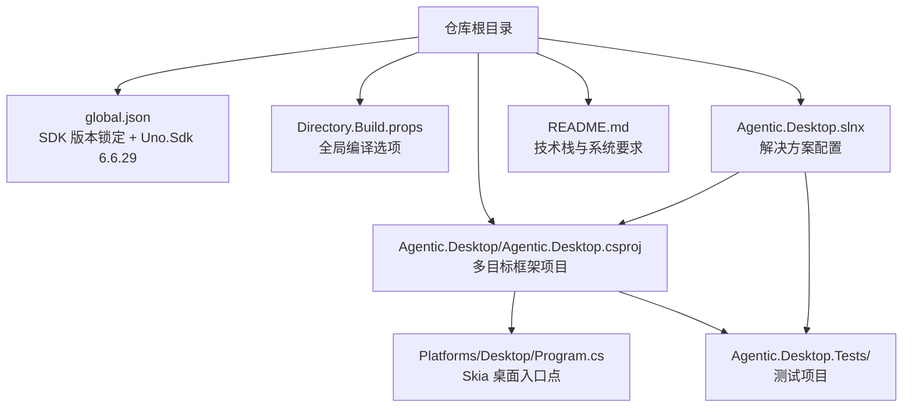
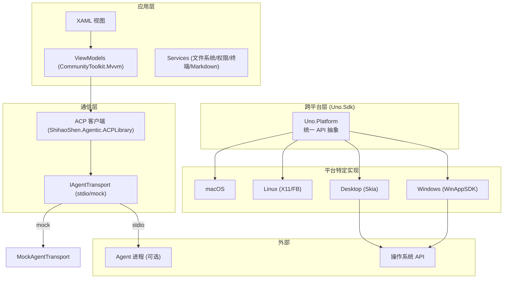
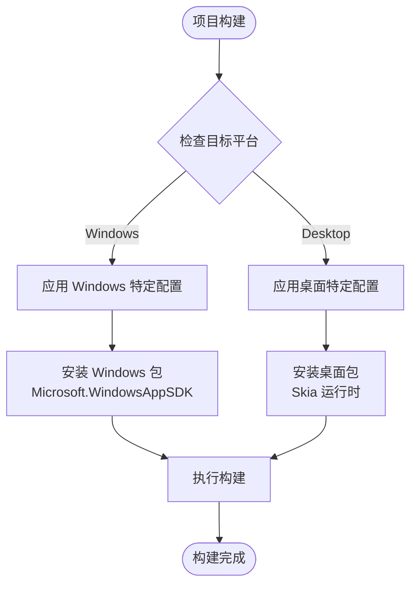
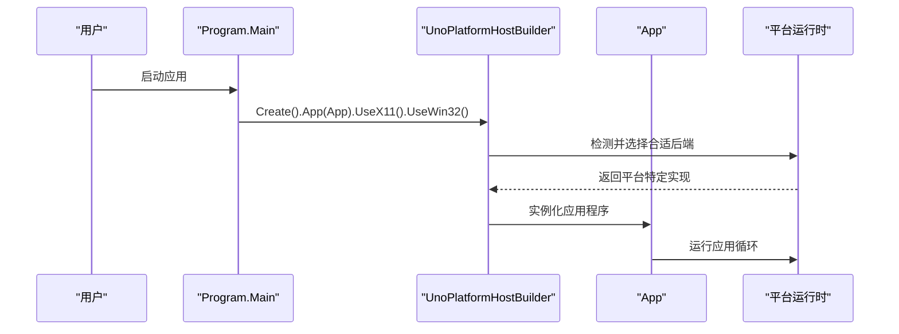
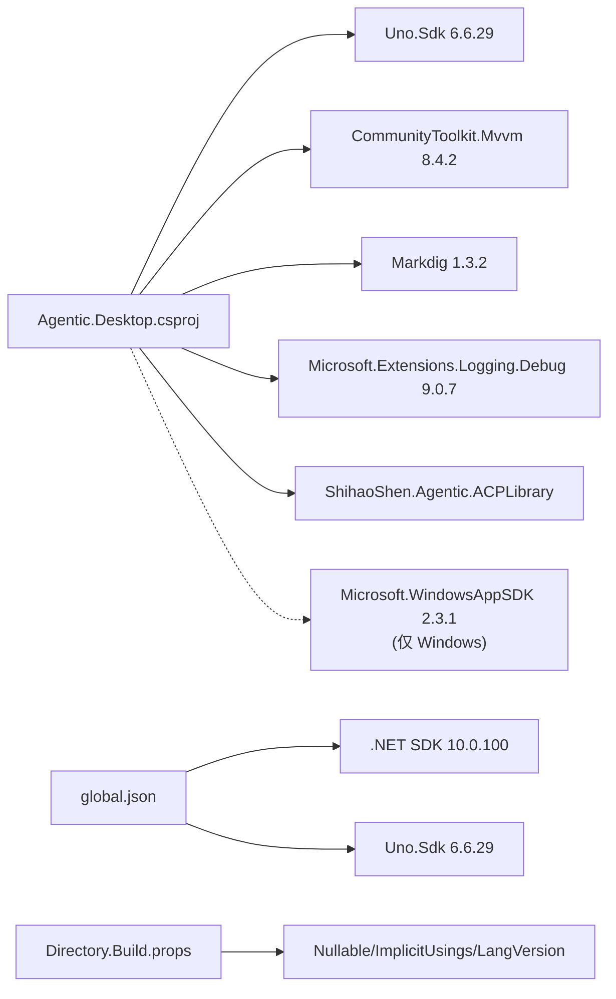

# 环境搭建

<cite>
**本文引用的文件**
- [global.json](file://global.json)
- [Agentic.Desktop.csproj](file://Agentic.Desktop/Agentic.Desktop.csproj)
- [Directory.Build.props](file://Directory.Build.props)
- [README.md](file://README.md)
- [Program.cs](file://Agentic.Desktop/Platforms/Desktop/Program.cs)
- [Agentic.Desktop.slnx](file://Agentic.Desktop.slnx)
- [Agentic.Desktop.Tests.csproj](file://Agentic.Desktop.Tests/Agentic.Desktop.Tests.csproj)
</cite>

## 更新摘要
**所做更改**
- 新增 Uno.Sdk 6.6.29 安装与配置说明
- 更新多目标框架配置 (.net10.0-windows10.0.26100 和 .net10.0-desktop)
- 添加跨平台开发环境和工具配置
- 更新解决方案结构和构建配置
- 新增 Skia 桌面运行时配置

## 目录
1. [简介](#简介)
2. [系统要求](#系统要求)
3. [开发环境安装](#开发环境安装)
4. [项目结构](#项目结构)
5. [核心组件](#核心组件)
6. [架构总览](#架构总览)
7. [详细组件分析](#详细组件分析)
8. [依赖分析](#依赖分析)
9. [性能考虑](#性能考虑)
10. [故障排除指南](#故障排除指南)
11. [结论](#结论)
12. [附录](#附录)

## 简介
本指南面向首次接触本项目的开发者，提供从零开始的环境搭建与调试配置说明。内容涵盖：
- .NET 10.0 SDK 与 Uno.Sdk 6.6.29 的安装与验证
- Visual Studio / VS Code 开发环境设置
- NuGet 包管理与版本锁定机制（含 global.json）
- 多目标框架配置与跨平台开发支持
- 常用开发工具、调试器与 IntelliSense 优化
- 常见环境问题与排错步骤

## 系统要求
### 操作系统支持
- **Windows**: Windows 10 1809 (Build 17763) 或更高版本
- **Linux**: 支持 X11 和 Linux FrameBuffer 的发行版
- **macOS**: macOS 10.15 或更高版本

### 必需软件
- [.NET SDK 10.0.100](https://dotnet.microsoft.com/download/dotnet/10.0)
- [Uno.Sdk 6.6.29](https://github.com/unoplatform/uno)
- [WinApp CLI](https://learn.microsoft.com/windows/apps/windows-app-sdk/) (`dotnet tool install -g winapp`)
- **开发者模式**已启用（设置 > 系统 > 开发者选项）

**章节来源**
- [README.md:26-32](file://README.md#L26-L32)
- [global.json:1-11](file://global.json#L1-L11)

## 开发环境安装

### 1. 安装 .NET 10.0 SDK
```bash
# 验证安装
dotnet --info

# 检查 SDK 版本应为 10.0.100
```

### 2. 安装 Uno.Sdk
Uno.Sdk 通过 global.json 自动管理，无需手动安装：
```json
{
  "msbuild-sdks": {
    "Uno.Sdk": "6.6.29"
  }
}
```

### 3. 安装 WinApp CLI（Windows 专用）
```powershell
# 全局安装 WinApp CLI
dotnet tool install -g winapp

# 验证安装
winapp --version
```

### 4. 配置开发工具

#### Visual Studio 配置
- 安装工作负载：
  - "ASP.NET 和 Web 开发"
  - "桌面开发"
  - ".NET 桌面开发"
- 启用 MSIX 打包工具与 WinUI 3 模板
- 安装 C# 开发扩展

#### VS Code 配置
- 安装 C# Dev Kit 扩展
- 安装 .NET 扩展
- 安装 Uno Platform 扩展（可选）

**章节来源**
- [global.json:7-9](file://global.json#L7-L9)
- [README.md:30-31](file://README.md#L30-L31)

## 项目结构
本项目采用 Uno.Sdk 进行多目标框架管理，支持 Windows 和跨平台桌面应用。根目录包含解决方案与全局构建配置，应用工程位于 Agentic.Desktop 子目录。关键文件包括：
- 全局 SDK 锁定：global.json
- 项目定义与依赖：Agentic.Desktop.csproj
- 全局构建属性：Directory.Build.props
- 解决方案配置：Agentic.Desktop.slnx
- 测试项目：Agentic.Desktop.Tests/Agentic.Desktop.Tests.csproj



**图表来源**
- [global.json:1-11](file://global.json#L1-L11)
- [Directory.Build.props:1-23](file://Directory.Build.props#L1-L23)
- [Agentic.Desktop.slnx:1-9](file://Agentic.Desktop.slnx#L1-L9)
- [Agentic.Desktop.csproj:1-83](file://Agentic.Desktop/Agentic.Desktop.csproj#L1-L83)
- [Program.cs:1-25](file://Agentic.Desktop/Platforms/Desktop/Program.cs#L1-L25)

**章节来源**
- [README.md:53-80](file://README.md#L53-L80)
- [Agentic.Desktop.csproj:1-83](file://Agentic.Desktop/Agentic.Desktop.csproj#L1-L83)
- [global.json:1-11](file://global.json#L1-L11)
- [Directory.Build.props:1-23](file://Directory.Build.props#L1-L23)

## 核心组件
### 多目标框架配置
项目现在支持两个目标框架：
- `net10.0-windows10.0.26100`: Windows 特定实现，使用 WinAppSDK 和 XAML
- `net10.0-desktop`: 跨平台桌面实现，使用 Skia 图形后端

### 应用入口点
- **Windows 平台**: 使用 XAML 生成的 Main 方法
- **跨平台桌面**: 使用 Platforms/Desktop/Program.cs 作为 Skia 桌面应用的入口点

### 构建配置
- UnoSingleProject 模式简化了多平台构建
- 条件编译符号区分不同平台的特定代码
- 自动移除冲突的 Uno 包以避免与 Windows App SDK 冲突

**章节来源**
- [Agentic.Desktop.csproj:4-16](file://Agentic.Desktop/Agentic.Desktop.csproj#L4-L16)
- [Program.cs:1-25](file://Agentic.Desktop/Platforms/Desktop/Program.cs#L1-L25)

## 架构总览
应用采用 Uno.Sdk 进行跨平台管理，支持 Windows 和桌面平台。UI 层通过 ViewModel 调用 ACP 客户端库与 Agent 通信；本地 Mock 传输层用于无真实 Agent 时的 UI 联调。



**图表来源**
- [Agentic.Desktop.csproj:4-4](file://Agentic.Desktop/Agentic.Desktop.csproj#L4-L4)
- [Program.cs:14-20](file://Agentic.Desktop/Platforms/Desktop/Program.cs#L14-L20)

## 详细组件分析

### 组件一：多目标框架配置（Agentic.Desktop.csproj）
- **职责**
  - 定义多目标框架：net10.0-windows10.0.26100 和 net10.0-desktop
  - 配置 Uno.Sdk 单项目模式
  - 管理平台特定的包引用和构建选项
- **关键点**
  - TargetFrameworks 指定多个目标框架
  - 条件编译符号 WINDOWS 用于 Windows 特定代码
  - 自动移除冲突的 Uno 包



**图表来源**
- [Agentic.Desktop.csproj:4-4](file://Agentic.Desktop/Agentic.Desktop.csproj#L4-L4)
- [Agentic.Desktop.csproj:49-54](file://Agentic.Desktop/Agentic.Desktop.csproj#L49-L54)

**章节来源**
- [Agentic.Desktop.csproj:1-83](file://Agentic.Desktop/Agentic.Desktop.csproj#L1-L83)

### 组件二：跨平台桌面入口点（Program.cs）
- **职责**
  - 为 Skia 桌面目标创建应用程序主机
  - 配置跨平台运行时支持
  - 初始化 Uno 平台宿主
- **关键点**
  - 使用 UnoPlatformHostBuilder 创建跨平台应用
  - 支持多种后端：X11、Linux FrameBuffer、macOS、Win32
  - 与 Windows 平台的 XAML 生成 Main 方法共存



**图表来源**
- [Program.cs:14-20](file://Agentic.Desktop/Platforms/Desktop/Program.cs#L14-L20)

**章节来源**
- [Program.cs:1-25](file://Agentic.Desktop/Platforms/Desktop/Program.cs#L1-L25)

### 组件三：解决方案配置（Agentic.Desktop.slnx）
- **职责**
  - 定义解决方案中的项目和平台配置
  - 指定默认构建平台为 x86
- **关键点**
  - 包含主项目和测试项目
  - 统一的平台配置管理

**章节来源**
- [Agentic.Desktop.slnx:1-9](file://Agentic.Desktop.slnx#L1-L9)

## 依赖分析
项目依赖由 NuGet 管理，核心包如下：
- **跨平台包**（所有平台共享）：
  - CommunityToolkit.Mvvm：MVVM 基础能力
  - Markdig：Markdown 渲染
  - Microsoft.Extensions.Logging.Debug：调试日志输出
  - ShihaoShen.Agentic.ACPLibrary：ACP 协议客户端库
- **Windows 特定包**：
  - Microsoft.WindowsAppSDK：Windows App SDK 运行时与 API
  - Microsoft.Windows.SDK.BuildTools：构建工具
  - Microsoft.Windows.SDK.BuildTools.WinApp：dotnet run 支持

版本锁定与 SDK 管理：
- global.json 指定 SDK 版本和 Uno.Sdk 版本，确保团队一致
- Directory.Build.props 统一启用 Nullable 与 ImplicitUsings，提升一致性



**图表来源**
- [Agentic.Desktop.csproj:42-54](file://Agentic.Desktop/Agentic.Desktop.csproj#L42-L54)
- [global.json:1-11](file://global.json#L1-L11)
- [Directory.Build.props:1-6](file://Directory.Build.props#L1-L6)

**章节来源**
- [Agentic.Desktop.csproj:41-54](file://Agentic.Desktop/Agentic.Desktop.csproj#L41-L54)
- [global.json:1-11](file://global.json#L1-L11)
- [Directory.Build.props:1-23](file://Directory.Build.props#L1-L23)

## 性能考虑
- **发布优化**
  - Release 配置开启 ReadyToRun 与 Trimmed，减小体积并提升启动速度
  - 针对不同平台优化包引用，避免不必要的依赖
- **跨平台性能**
  - Skia 桌面后端提供高性能图形渲染
  - 条件编译减少平台特定代码的开销
- **内存管理**
  - 使用 ImplicitUsings 和 Nullable 提升代码质量
  - 合理的包引用避免内存泄漏

## 故障排除指南
### 常见问题与解决步骤

#### Uno.Sdk 相关问题
- **无法识别 Uno.Sdk**
  - 确认 global.json 中 Uno.Sdk 版本正确
  - 运行 `dotnet restore` 重新恢复包
- **构建失败**
  - 清理 bin/obj 目录后重新构建
  - 检查 .NET SDK 版本是否为 10.0.100

#### 多目标框架问题
- **特定平台构建失败**
  - 使用 `dotnet build -f net10.0-windows10.0.26100` 指定目标框架
  - 检查平台特定的包引用是否正确
- **运行时错误**
  - Windows 平台：确保已安装 Windows App SDK 2.3.1
  - 跨平台：检查相应的运行时依赖是否安装

#### 跨平台开发问题
- **Linux/macOS 环境配置**
  - 安装必要的图形后端依赖（X11、FrameBuffer 等）
  - 检查平台特定的环境变量
- **路径和权限问题**
  - 确保有足够的文件访问权限
  - 检查工作目录路径的正确性

#### 调试与诊断
- **查看构建输出**
  - 使用 `dotnet build -v detailed` 查看详细构建信息
  - 检查 NuGet 包还原日志
- **运行时调试**
  - 在 Program.Main 处设置断点
  - 检查 Uno 平台初始化过程

**章节来源**
- [global.json:1-11](file://global.json#L1-L11)
- [Agentic.Desktop.csproj:1-83](file://Agentic.Desktop/Agentic.Desktop.csproj#L1-L83)
- [Program.cs:1-25](file://Agentic.Desktop/Platforms/Desktop/Program.cs#L1-L25)

## 结论
通过本指南，您应能完成 .NET 10.0 SDK 与 Uno.Sdk 6.6.29 的安装与配置，正确设置 Visual Studio 或 VS Code 的开发环境，理解多目标框架配置与跨平台开发支持，并使用内置 Mock 进行高效联调。遇到问题时，可参考故障排除章节定位与解决。

## 附录

### 环境安装与验证
- **安装 .NET 10.0 SDK**
  - 从官方下载页安装，并在命令行验证 dotnet --info
- **安装 Uno.Sdk**
  - 通过 global.json 自动管理，无需手动安装
- **安装 WinApp CLI（Windows）**
  - 使用 dotnet tool install -g winapp 安装
- **启用开发者模式**
  - 设置 > 系统 > 开发者选项

**章节来源**
- [README.md:26-32](file://README.md#L26-L32)

### 开发工具与环境设置
- **Visual Studio**
  - 安装 "ASP.NET 和 Web 开发"、"桌面开发" 工作负载
  - 启用 MSIX 打包工具与 WinUI 3 模板
  - 使用多目标框架进行构建和调试
- **VS Code**
  - 安装 C# Dev Kit 与 .NET 扩展
  - 使用 .NET CLI 与 winapp 命令进行构建与运行
- **IntelliSense 优化**
  - 保持 NuGet 包还原成功
  - 清理 bin/obj 后重新生成
  - 确保 SDK 版本与 global.json 一致

**章节来源**
- [Agentic.Desktop.csproj:1-83](file://Agentic.Desktop/Agentic.Desktop.csproj#L1-L83)
- [global.json:1-11](file://global.json#L1-L11)

### 调试器配置
- **日志输出**
  - 应用启动时已配置 ILoggerFactory 输出到调试器
- **断点与监视**
  - 在 Program.Main、Uno 平台初始化处设置断点
  - 针对多目标框架切换设置条件断点
- **跨平台调试**
  - 使用平台特定的调试配置
  - 检查 Uno 平台初始化过程

**章节来源**
- [Program.cs:11-23](file://Agentic.Desktop/Platforms/Desktop/Program.cs#L11-L23)

### 构建与部署
- **多目标构建**
  - 使用 `dotnet build` 构建所有目标框架
  - 使用 `dotnet build -f <framework>` 构建特定框架
- **发布配置**
  - 针对不同平台优化发布配置
  - 自动根据目标框架选择合适的运行时
- **跨平台部署**
  - Windows：使用 MSIX 打包或自包含发布
  - 其他平台：使用 Skia 运行时进行部署

**章节来源**
- [Agentic.Desktop.csproj:75-81](file://Agentic.Desktop/Agentic.Desktop.csproj#L75-L81)
- [Program.cs:14-20](file://Agentic.Desktop/Platforms/Desktop/Program.cs#L14-L20)

### 测试环境配置
- **测试项目配置**
  - 使用 net10.0-windows10.0.26100 目标框架
  - 禁用 MSIX 工具链以避免冲突
- **运行测试**
  - 使用 `dotnet test` 运行所有测试
  - 使用 `dotnet test -f <framework>` 指定目标框架

**章节来源**
- [Agentic.Desktop.Tests.csproj:1-32](file://Agentic.Desktop.Tests/Agentic.Desktop.Tests.csproj#L1-L32)