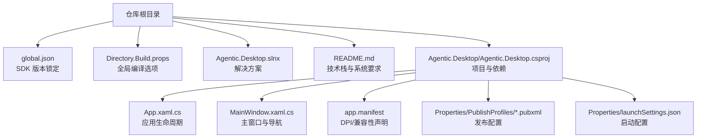
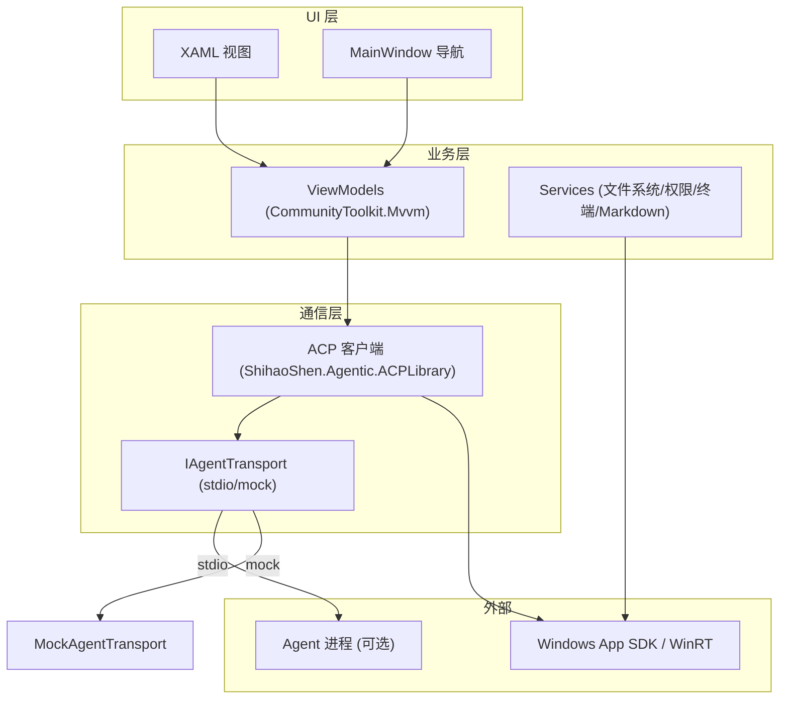
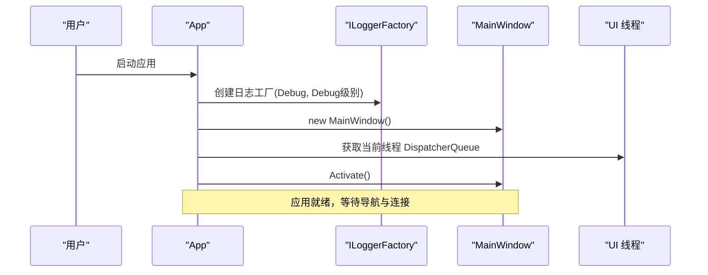
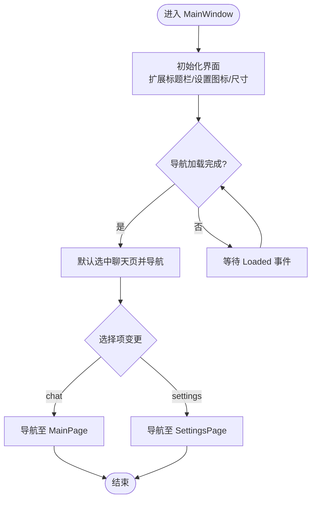
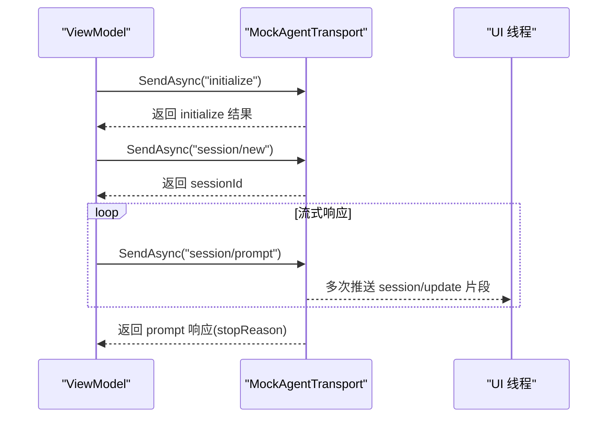
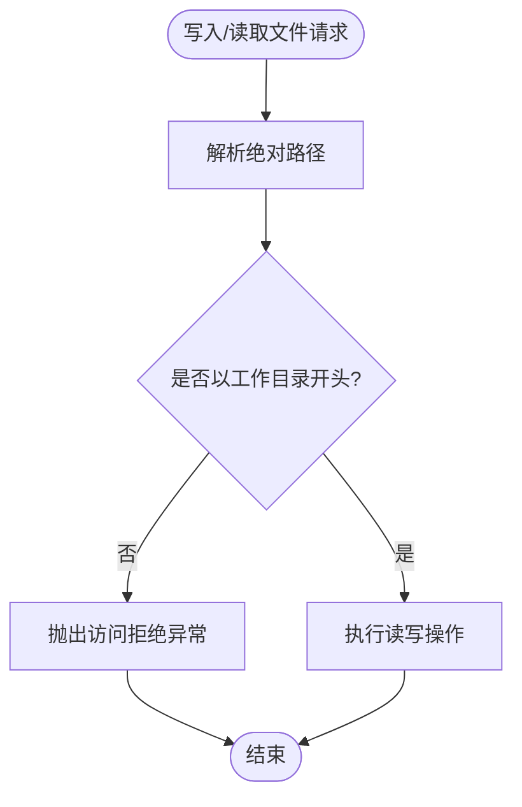
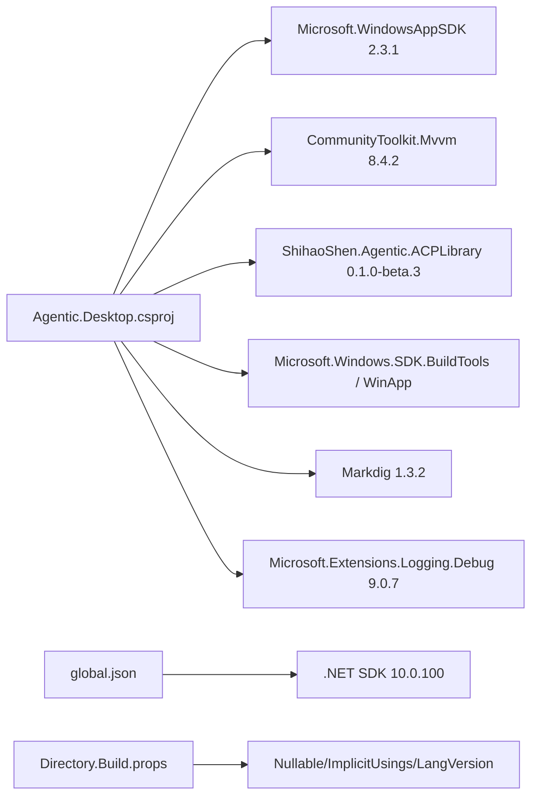

# 环境搭建

<cite>
**本文引用的文件**
- [global.json](file://global.json)
- [Agentic.Desktop.csproj](file://Agentic.Desktop/Agentic.Desktop.csproj)
- [Directory.Build.props](file://Directory.Build.props)
- [README.md](file://README.md)
- [App.xaml.cs](file://Agentic.Desktop/App.xaml.cs)
- [MainWindow.xaml.cs](file://Agentic.Desktop/MainWindow.xaml.cs)
- [app.manifest](file://Agentic.Desktop/app.manifest)
- [win-x64.pubxml](file://Agentic.Desktop/Properties/PublishProfiles/win-x64.pubxml)
- [launchSettings.json](file://Agentic.Desktop/Properties/launchSettings.json)
- [MockAgentTransport.cs](file://Agentic.Desktop/Mocks/MockAgentTransport.cs)
- [FileSystemHandler.cs](file://Agentic.Desktop/Services/FileSystemHandler.cs)
</cite>

## 目录
1. [简介](#简介)
2. [项目结构](#项目结构)
3. [核心组件](#核心组件)
4. [架构总览](#架构总览)
5. [详细组件分析](#详细组件分析)
6. [依赖分析](#依赖分析)
7. [性能考虑](#性能考虑)
8. [故障排除指南](#故障排除指南)
9. [结论](#结论)
10. [附录](#附录)

## 简介
本指南面向首次接触本项目的开发者，提供从零开始的环境搭建与调试配置说明。内容涵盖：
- .NET 10.0 SDK 与 Windows App SDK 2.3.1 的安装与验证
- Visual Studio / VS Code 开发环境设置
- NuGet 包管理与版本锁定机制（含 global.json）
- 常用开发工具、调试器与 IntelliSense 优化
- 常见环境问题与排错步骤

## 项目结构
本项目为基于 WinUI 3 的桌面应用，采用 MVVM 架构，通过 ACP 协议与 Agent 通信。根目录包含解决方案与全局构建配置，应用工程位于 Agentic.Desktop 子目录。关键文件包括：
- 全局 SDK 锁定：global.json
- 项目定义与依赖：Agentic.Desktop.csproj
- 全局构建属性：Directory.Build.props
- 应用入口与窗口：App.xaml.cs、MainWindow.xaml.cs
- 系统清单与 DPI 支持：app.manifest
- 发布配置：Properties/PublishProfiles/*.pubxml
- 启动配置：Properties/launchSettings.json

**图表来源**
- [global.json:1-7](file://global.json#L1-L7)
- [Directory.Build.props:1-8](file://Directory.Build.props#L1-L8)
- [Agentic.Desktop.csproj:1-79](file://Agentic.Desktop/Agentic.Desktop.csproj#L1-L79)
- [App.xaml.cs:1-85](file://Agentic.Desktop/App.xaml.cs#L1-L85)
- [MainWindow.xaml.cs:1-97](file://Agentic.Desktop/MainWindow.xaml.cs#L1-L97)
- [app.manifest:1-19](file://Agentic.Desktop/app.manifest#L1-L19)
- [win-x64.pubxml:1-14](file://Agentic.Desktop/Properties/PublishProfiles/win-x64.pubxml#L1-L14)
- [launchSettings.json:1-10](file://Agentic.Desktop/Properties/launchSettings.json#L1-L10)

**章节来源**
- [README.md:1-92](file://README.md#L1-L92)
- [Agentic.Desktop.csproj:1-79](file://Agentic.Desktop/Agentic.Desktop.csproj#L1-L79)
- [global.json:1-7](file://global.json#L1-L7)
- [Directory.Build.props:1-8](file://Directory.Build.props#L1-L8)

## 核心组件
- 应用生命周期与全局服务
  - App.xaml.cs：初始化日志工厂、创建主窗口、暴露 UI 线程调度器与当前 AcpClient 状态
- 主窗口与导航
  - MainWindow.xaml.cs：自定义标题栏、图标、尺寸、页面导航与连接状态更新
- 资源与清单
  - app.manifest：声明 PerMonitorV2 DPI 感知与 Windows 10 兼容
  - Properties/PublishProfiles/*.pubxml：发布目标平台与运行时标识
- 启动配置
  - launchSettings.json：支持打包与未打包两种启动方式

**章节来源**
- [App.xaml.cs:1-85](file://Agentic.Desktop/App.xaml.cs#L1-L85)
- [MainWindow.xaml.cs:1-97](file://Agentic.Desktop/MainWindow.xaml.cs#L1-L97)
- [app.manifest:1-19](file://Agentic.Desktop/app.manifest#L1-L19)
- [win-x64.pubxml:1-14](file://Agentic.Desktop/Properties/PublishProfiles/win-x64.pubxml#L1-L14)
- [launchSettings.json:1-10](file://Agentic.Desktop/Properties/launchSettings.json#L1-L10)

## 架构总览
应用采用 WinUI 3 + MVVM，UI 层通过 ViewModel 调用 ACP 客户端库与 Agent 通信；本地 Mock 传输层用于无真实 Agent 时的 UI 联调。

**图表来源**
- [App.xaml.cs:1-85](file://Agentic.Desktop/App.xaml.cs#L1-L85)
- [MainWindow.xaml.cs:1-97](file://Agentic.Desktop/MainWindow.xaml.cs#L1-L97)
- [MockAgentTransport.cs:1-142](file://Agentic.Desktop/Mocks/MockAgentTransport.cs#L1-L142)
- [FileSystemHandler.cs:1-42](file://Agentic.Desktop/Services/FileSystemHandler.cs#L1-L42)
- [Agentic.Desktop.csproj:52-60](file://Agentic.Desktop/Agentic.Desktop.csproj#L52-L60)

## 详细组件分析

### 组件一：应用启动与全局服务（App.xaml.cs）
- 职责
  - 创建并持有主窗口实例
  - 初始化 Microsoft.Extensions.Logging 输出到调试器
  - 暴露 UI 线程 DispatcherQueue 与当前 AcpClient
- 关键点
  - OnLaunched 中完成日志工厂创建与窗口激活
  - SetAcpClient 方法用于设置连接并触发事件通知

**图表来源**
- [App.xaml.cs:64-76](file://Agentic.Desktop/App.xaml.cs#L64-L76)

**章节来源**
- [App.xaml.cs:1-85](file://Agentic.Desktop/App.xaml.cs#L1-L85)

### 组件二：主窗口与导航（MainWindow.xaml.cs）
- 职责
  - 自定义标题栏、设置图标与窗口尺寸
  - 根据标签切换“聊天”和“设置”页面
  - 更新连接状态指示器（颜色与文案）
- 关键点
  - UpdateConnectionStatus 使用 DispatcherQueue 安全更新 UI
  - RootNavView_SelectionChanged 实现页面导航

**图表来源**
- [MainWindow.xaml.cs:16-27](file://Agentic.Desktop/MainWindow.xaml.cs#L16-L27)
- [MainWindow.xaml.cs:65-86](file://Agentic.Desktop/MainWindow.xaml.cs#L65-L86)

**章节来源**
- [MainWindow.xaml.cs:1-97](file://Agentic.Desktop/MainWindow.xaml.cs#L1-L97)

### 组件三：Mock 传输层（MockAgentTransport.cs）
- 职责
  - 模拟 IAgentTransport，提供脚本化 ACP 响应，便于 UI 联调
- 关键点
  - 处理 initialize、session/new、session/prompt、session/cancel 等方法
  - 流式推送 session/update 消息片段，最终返回 stopReason

**图表来源**
- [MockAgentTransport.cs:21-124](file://Agentic.Desktop/Mocks/MockAgentTransport.cs#L21-L124)

**章节来源**
- [MockAgentTransport.cs:1-142](file://Agentic.Desktop/Mocks/MockAgentTransport.cs#L1-L142)

### 组件四：文件系统处理器（FileSystemHandler.cs）
- 职责
  - 实现 IFileSystemHandler，限制 Agent 仅能访问工作目录内的文件
- 关键点
  - ValidatePath 校验路径前缀，越权访问抛出 UnauthorizedAccessException

**图表来源**
- [FileSystemHandler.cs:17-40](file://Agentic.Desktop/Services/FileSystemHandler.cs#L17-L40)

**章节来源**
- [FileSystemHandler.cs:1-42](file://Agentic.Desktop/Services/FileSystemHandler.cs#L1-L42)

## 依赖分析
项目依赖由 NuGet 管理，核心包如下：
- Microsoft.WindowsAppSDK：Windows App SDK 运行时与 API
- CommunityToolkit.Mvvm：MVVM 基础能力（ObservableObject、RelayCommand 等）
- ShihaoShen.Agentic.ACPLibrary：ACP 协议客户端库
- Microsoft.Windows.SDK.BuildTools / WinApp：构建工具与 dotnet run 支持
- Markdig：Markdown 渲染
- Microsoft.Extensions.Logging.Debug：调试日志输出

版本锁定与 SDK 管理：
- global.json 指定 SDK 版本与滚动策略，确保团队一致
- Directory.Build.props 统一启用 Nullable 与 ImplicitUsings，提升一致性

**图表来源**
- [Agentic.Desktop.csproj:52-60](file://Agentic.Desktop/Agentic.Desktop.csproj#L52-L60)
- [global.json:1-7](file://global.json#L1-L7)
- [Directory.Build.props:1-8](file://Directory.Build.props#L1-L8)

**章节来源**
- [Agentic.Desktop.csproj:1-79](file://Agentic.Desktop/Agentic.Desktop.csproj#L1-L79)
- [global.json:1-7](file://global.json#L1-L7)
- [Directory.Build.props:1-8](file://Directory.Build.props#L1-L8)

## 性能考虑
- 发布优化
  - Release 配置开启 ReadyToRun 与 Trimmed，减小体积并提升启动速度
- UI 线程调度
  - 所有 UI 更新通过 DispatcherQueue.TryEnqueue，避免跨线程异常
- 日志级别
  - 默认 Debug 级别，生产建议调整为 Warning/Information 以减少开销

[本节为通用指导，不直接分析具体文件]

## 故障排除指南
常见问题与解决步骤：
- 无法识别 .NET SDK 或版本不匹配
  - 确认已安装 .NET 10.0 SDK，且与 global.json 中的版本兼容
  - 运行 dotnet --info 检查可用 SDK
- Windows App SDK 相关错误
  - 确保已安装 Windows App SDK 2.3.1 及对应构建工具
  - 在开发者模式下运行，必要时重启 IDE
- 打包/运行失败
  - 使用 winapp CLI 注册调试身份后运行
  - 检查 launchSettings.json 的启动配置（打包/未打包）
- 权限与路径问题
  - 文件系统处理器会拒绝工作目录外的访问，请修正路径
- 日志与诊断
  - 查看调试输出（Microsoft.Extensions.Logging.Debug）
  - 使用 MockAgentTransport 快速验证 UI 流程

**章节来源**
- [global.json:1-7](file://global.json#L1-L7)
- [Agentic.Desktop.csproj:1-79](file://Agentic.Desktop/Agentic.Desktop.csproj#L1-L79)
- [launchSettings.json:1-10](file://Agentic.Desktop/Properties/launchSettings.json#L1-L10)
- [FileSystemHandler.cs:1-42](file://Agentic.Desktop/Services/FileSystemHandler.cs#L1-L42)
- [MockAgentTransport.cs:1-142](file://Agentic.Desktop/Mocks/MockAgentTransport.cs#L1-L142)

## 结论
通过本指南，您应能完成 .NET 10.0 SDK 与 Windows App SDK 2.3.1 的安装与配置，正确设置 Visual Studio 或 VS Code 的开发环境，理解 NuGet 依赖与版本锁定机制，并使用内置 Mock 进行高效联调。遇到问题时，可参考故障排除章节定位与解决。

[本节为总结性内容，不直接分析具体文件]

## 附录

### 环境安装与验证
- 安装 .NET 10.0 SDK
  - 从官方下载页安装，并在命令行验证 dotnet --info
- 安装 Windows App SDK 2.3.1
  - 按官方文档安装运行时与构建工具
- 安装 WinApp CLI
  - 使用 dotnet tool install -g winapp 安装
- 启用开发者模式
  - 设置 > 系统 > 开发者选项

**章节来源**
- [README.md:24-30](file://README.md#L24-L30)

### 开发工具与环境设置
- Visual Studio
  - 安装 “ASP.NET 和 Web 开发”、“桌面开发” 工作负载
  - 启用 MSIX 打包工具与 WinUI 3 模板
  - 使用 “Agentic.Desktop (Package)” 与 “(Unpackaged)” 两种启动配置
- VS Code
  - 安装 C# Dev Kit 与 .NET 扩展
  - 使用 .NET CLI 与 winapp 命令进行构建与运行
- IntelliSense 优化
  - 保持 NuGet 包还原成功
  - 清理 bin/obj 后重新生成
  - 确保 SDK 版本与 global.json 一致

**章节来源**
- [launchSettings.json:1-10](file://Agentic.Desktop/Properties/launchSettings.json#L1-L10)
- [Agentic.Desktop.csproj:1-79](file://Agentic.Desktop/Agentic.Desktop.csproj#L1-L79)
- [global.json:1-7](file://global.json#L1-L7)

### 调试器配置
- 日志输出
  - 应用启动时已配置 ILoggerFactory 输出到调试器
- 断点与监视
  - 在 App.OnLaunched、MainWindow 导航、MockAgentTransport.SendAsync 处设置断点
- 条件断点
  - 针对特定 method（如 session/prompt）过滤断点

**章节来源**
- [App.xaml.cs:64-76](file://Agentic.Desktop/App.xaml.cs#L64-L76)
- [MockAgentTransport.cs:27-117](file://Agentic.Desktop/Mocks/MockAgentTransport.cs#L27-L117)

### 发布与部署
- 发布配置
  - 使用 Properties/PublishProfiles/win-x64.pubxml 指定目标平台与自包含发布
- 运行时标识
  - 自动根据当前架构选择 win-x86/x64/ARM64
- 清单与 DPI
  - app.manifest 声明 PerMonitorV2 与 Windows 10 兼容

**章节来源**
- [win-x64.pubxml:1-14](file://Agentic.Desktop/Properties/PublishProfiles/win-x64.pubxml#L1-L14)
- [Agentic.Desktop.csproj:8-10](file://Agentic.Desktop/Agentic.Desktop.csproj#L8-L10)
- [app.manifest:1-19](file://Agentic.Desktop/app.manifest#L1-L19)