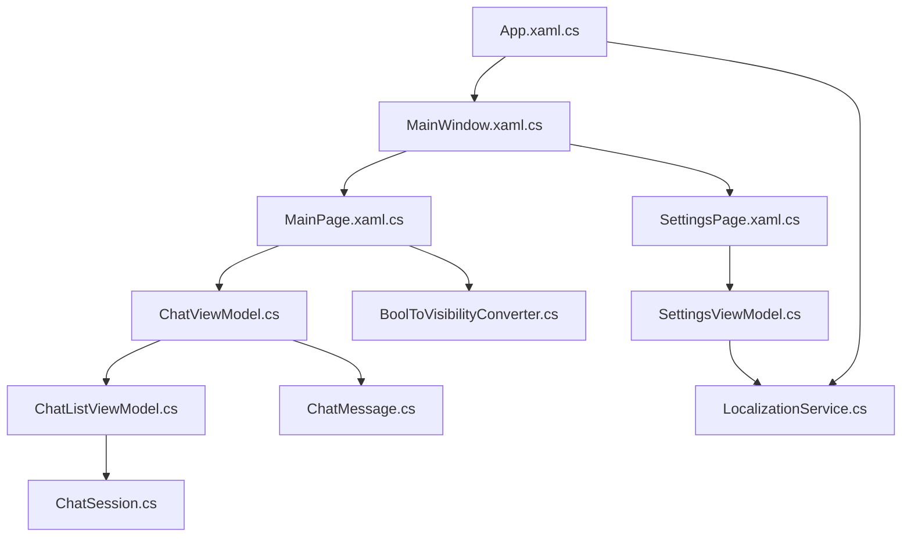
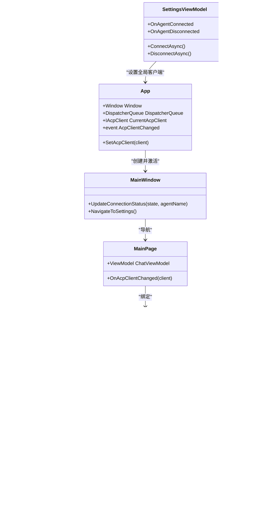
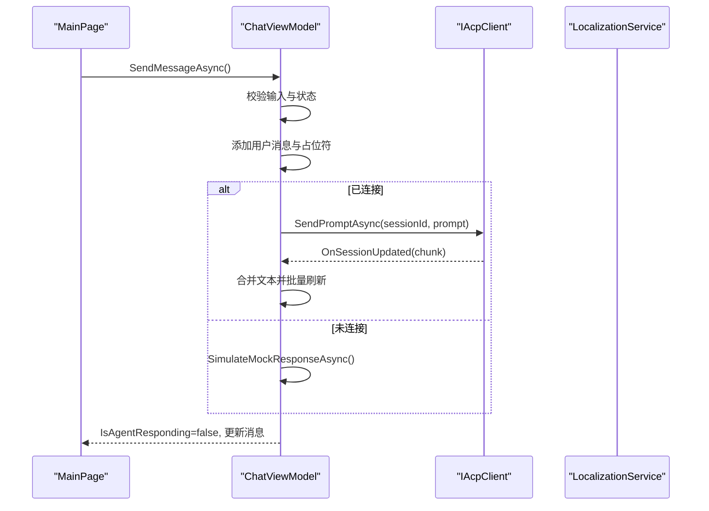
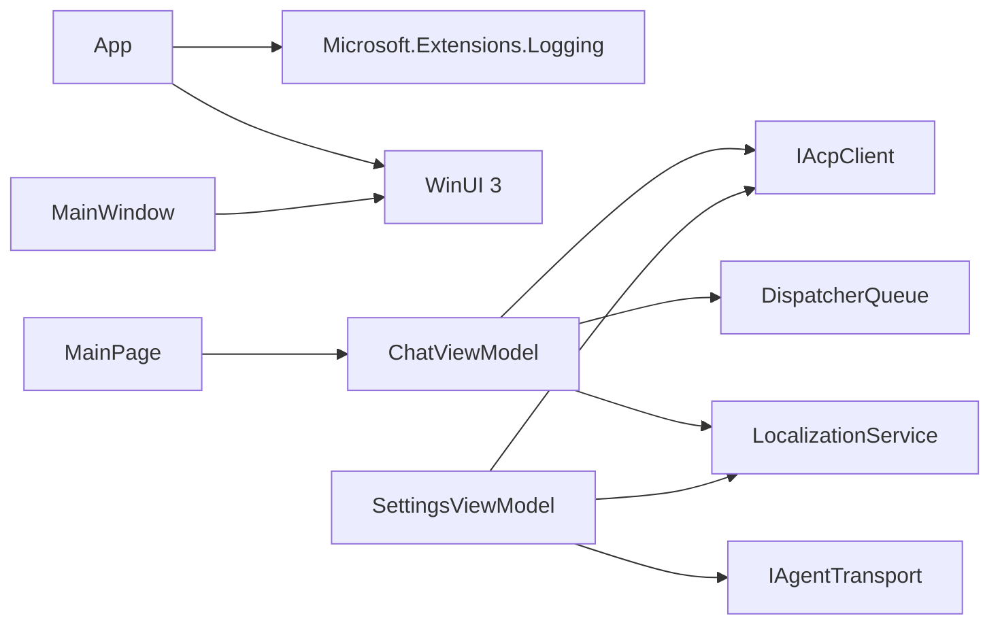

# 编码规范

<cite>
**本文引用的文件**   
- [App.xaml.cs](file://Agentic.Desktop/App.xaml.cs)
- [MainWindow.xaml.cs](file://Agentic.Desktop/MainWindow.xaml.cs)
- [MainPage.xaml.cs](file://Agentic.Desktop/MainPage.xaml.cs)
- [ChatViewModel.cs](file://Agentic.Desktop/ViewModels/ChatViewModel.cs)
- [ChatListViewModel.cs](file://Agentic.Desktop/ViewModels/ChatListViewModel.cs)
- [SettingsViewModel.cs](file://Agentic.Desktop/ViewModels/SettingsViewModel.cs)
- [ChatMessage.cs](file://Agentic.Desktop/ViewModels/Messages/ChatMessage.cs)
- [ChatSession.cs](file://Agentic.Desktop/ViewModels/Messages/ChatSession.cs)
- [LocalizationService.cs](file://Agentic.Desktop/Services/LocalizationService.cs)
- [BoolToVisibilityConverter.cs](file://Agentic.Desktop/Converters/BoolToVisibilityConverter.cs)
- [SettingsPage.xaml.cs](file://Agentic.Desktop/SettingsPage.xaml.cs)
- [App.xaml](file://Agentic.Desktop/App.xaml)
- [MainWindow.xaml](file://Agentic.Desktop/MainWindow.xaml)
- [README.md](file://README.md)
</cite>

## 目录
1. [引言](#引言)
2. [项目结构](#项目结构)
3. [核心组件](#核心组件)
4. [架构总览](#架构总览)
5. [详细组件分析](#详细组件分析)
6. [依赖关系分析](#依赖关系分析)
7. [性能与异步最佳实践](#性能与异步最佳实践)
8. [XAML 组织与资源管理](#xaml-组织与资源管理)
9. [代码风格约定](#代码风格约定)
10. [MVVM 实现规范](#mvvm-实现规范)
11. [命令模式使用规范](#命令模式使用规范)
12. [错误处理策略](#错误处理策略)
13. [代码审查检查清单](#代码审查检查清单)
14. [质量保证流程](#质量保证流程)
15. [结论](#结论)

## 引言
本规范面向 Agentic.Desktop 项目的 C# 与 XAML 开发，覆盖代码风格、命名约定、注释标准、MVVM 数据绑定、命令模式、异步编程、XAML 组织与资源管理，以及代码审查与质量保证流程。目标是确保团队在 WinUI 3 + CommunityToolkit.Mvvm 技术栈下保持一致、可维护、高性能的实现方式。

## 项目结构
- 应用入口与全局状态：App.xaml.cs 负责日志工厂、窗口与 UI 线程调度器暴露；MainWindow.xaml 提供导航框架与标题栏状态展示。
- 页面与视图模型：MainPage 承载聊天界面，SettingsPage 承载连接设置；ViewModels 包含 ChatViewModel、ChatListViewModel、SettingsViewModel。
- 数据模型：Messages 子目录定义 ChatMessage、ChatSession。
- 服务层：LocalizationService 提供本地化字符串访问；其他服务（如 TerminalManager、FileSystemHandler）由 SettingsPage 装配到 AcpClient。
- 转换器：Converters 提供值转换器（如 BoolToVisibilityConverter）。
- Mock：用于无真实 Agent 时的模拟传输。

**图示来源** 
- [App.xaml.cs:1-85](file://Agentic.Desktop/App.xaml.cs#L1-L85)
- [MainWindow.xaml.cs:1-97](file://Agentic.Desktop/MainWindow.xaml.cs#L1-L97)
- [MainPage.xaml.cs:1-105](file://Agentic.Desktop/MainPage.xaml.cs#L1-L105)
- [ChatViewModel.cs:1-237](file://Agentic.Desktop/ViewModels/ChatViewModel.cs#L1-L237)
- [ChatListViewModel.cs:1-64](file://Agentic.Desktop/ViewModels/ChatListViewModel.cs#L1-L64)
- [SettingsViewModel.cs:1-162](file://Agentic.Desktop/ViewModels/SettingsViewModel.cs#L1-L162)
- [ChatMessage.cs:1-39](file://Agentic.Desktop/ViewModels/Messages/ChatMessage.cs#L1-L39)
- [ChatSession.cs:1-28](file://Agentic.Desktop/ViewModels/Messages/ChatSession.cs#L1-L28)
- [LocalizationService.cs:1-23](file://Agentic.Desktop/Services/LocalizationService.cs#L1-L23)
- [BoolToVisibilityConverter.cs:1-28](file://Agentic.Desktop/Converters/BoolToVisibilityConverter.cs#L1-L28)

**章节来源**
- [README.md:1-92](file://README.md#L1-L92)

## 核心组件
- App：初始化日志、窗口、UI 线程调度器，暴露当前 AcpClient 与变更事件。
- MainWindow：导航框架、标题栏扩展、连接状态更新。
- MainPage：绑定 ChatViewModel，处理输入键、侧边栏切换、滚动到底部。
- ChatViewModel：消息发送、流式响应合并、会话切换、取消生成、Mock 模拟。
- ChatListViewModel：会话集合、新建/删除/选择会话。
- SettingsViewModel：Agent 连接生命周期、进程退出处理、终端与权限处理器装配。
- ChatMessage/ChatSession：消息与会话的 ObservableObject 模型。
- LocalizationService：统一读取 .resw 资源并格式化。
- BoolToVisibilityConverter：布尔到可见性的转换。

**章节来源**
- [App.xaml.cs:1-85](file://Agentic.Desktop/App.xaml.cs#L1-L85)
- [MainWindow.xaml.cs:1-97](file://Agentic.Desktop/MainWindow.xaml.cs#L1-L97)
- [MainPage.xaml.cs:1-105](file://Agentic.Desktop/MainPage.xaml.cs#L1-L105)
- [ChatViewModel.cs:1-237](file://Agentic.Desktop/ViewModels/ChatViewModel.cs#L1-L237)
- [ChatListViewModel.cs:1-64](file://Agentic.Desktop/ViewModels/ChatListViewModel.cs#L1-L64)
- [SettingsViewModel.cs:1-162](file://Agentic.Desktop/ViewModels/SettingsViewModel.cs#L1-L162)
- [ChatMessage.cs:1-39](file://Agentic.Desktop/ViewModels/Messages/ChatMessage.cs#L1-L39)
- [ChatSession.cs:1-28](file://Agentic.Desktop/ViewModels/Messages/ChatSession.cs#L1-L28)
- [LocalizationService.cs:1-23](file://Agentic.Desktop/Services/LocalizationService.cs#L1-L23)
- [BoolToVisibilityConverter.cs:1-28](file://Agentic.Desktop/Converters/BoolToVisibilityConverter.cs#L1-L28)

## 架构总览
应用采用 MVVM 架构，通过 IAcpClient 与 Agent 通信。UI 层（XAML）仅做展示与交互，业务逻辑集中在 ViewModel，底层通过 AcpClient 与传输层（stdio/mock）交互。

**图示来源** 
- [App.xaml.cs:1-85](file://Agentic.Desktop/App.xaml.cs#L1-L85)
- [MainWindow.xaml.cs:1-97](file://Agentic.Desktop/MainWindow.xaml.cs#L1-L97)
- [MainPage.xaml.cs:1-105](file://Agentic.Desktop/MainPage.xaml.cs#L1-L105)
- [ChatViewModel.cs:1-237](file://Agentic.Desktop/ViewModels/ChatViewModel.cs#L1-L237)
- [ChatListViewModel.cs:1-64](file://Agentic.Desktop/ViewModels/ChatListViewModel.cs#L1-L64)
- [SettingsViewModel.cs:1-162](file://Agentic.Desktop/ViewModels/SettingsViewModel.cs#L1-L162)
- [ChatMessage.cs:1-39](file://Agentic.Desktop/ViewModels/Messages/ChatMessage.cs#L1-L39)
- [ChatSession.cs:1-28](file://Agentic.Desktop/ViewModels/Messages/ChatSession.cs#L1-L28)
- [LocalizationService.cs:1-23](file://Agentic.Desktop/Services/LocalizationService.cs#L1-L23)

## 详细组件分析

### App 组件
- 职责：初始化日志工厂、创建主窗口、暴露 UI 线程调度器、维护当前 AcpClient 与变更事件。
- 关键点：静态属性便于跨页面共享；事件驱动通知订阅者。

**章节来源**
- [App.xaml.cs:1-85](file://Agentic.Desktop/App.xaml.cs#L1-L85)

### MainWindow 组件
- 职责：窗口外观与导航控制、标题栏内容扩展、连接状态更新。
- 关键点：使用 DispatcherQueue 进行 UI 线程更新；根据状态码更新颜色与文本。

**章节来源**
- [MainWindow.xaml.cs:1-97](file://Agentic.Desktop/MainWindow.xaml.cs#L1-L97)
- [MainWindow.xaml:1-70](file://Agentic.Desktop/MainWindow.xaml#L1-L70)

### MainPage 组件
- 职责：绑定 ChatViewModel、处理输入键触发命令、侧边栏切换、滚动到底部。
- 关键点：直接调用 RelayCommand 执行；通过 App.AcpClientChanged 订阅连接变化。

**章节来源**
- [MainPage.xaml.cs:1-105](file://Agentic.Desktop/MainPage.xaml.cs#L1-L105)

### ChatViewModel 组件
- 职责：消息发送、流式响应合并、会话切换、取消生成、Mock 模拟。
- 关键点：
  - 使用 lock 与延迟批处理合并流式文本，减少 UI 刷新频率。
  - 通过 DispatcherQueue 将 UI 更新封送到 UI 线程。
  - 捕获 OperationCanceledException 与普通异常，分别处理用户取消与错误提示。
  - 会话切换时取消正在进行的生成，避免数据损坏。

**图示来源** 
- [ChatViewModel.cs:1-237](file://Agentic.Desktop/ViewModels/ChatViewModel.cs#L1-L237)
- [LocalizationService.cs:1-23](file://Agentic.Desktop/Services/LocalizationService.cs#L1-L23)

**章节来源**
- [ChatViewModel.cs:1-237](file://Agentic.Desktop/ViewModels/ChatViewModel.cs#L1-L237)

### ChatListViewModel 组件
- 职责：会话集合管理、新建/删除/选择会话。
- 关键点：删除后自动选择相邻会话或创建新会话；通过事件通知外部订阅者。

**章节来源**
- [ChatListViewModel.cs:1-64](file://Agentic.Desktop/ViewModels/ChatListViewModel.cs#L1-L64)

### SettingsViewModel 组件
- 职责：Agent 连接生命周期、进程退出处理、Terminal/FileSystem 处理器装配。
- 关键点：
  - 支持 Mock 与 Stdio 两种传输层。
  - 连接成功后回调通知 MainPage 绑定客户端。
  - 断开时清理资源并同步全局状态。

**章节来源**
- [SettingsViewModel.cs:1-162](file://Agentic.Desktop/ViewModels/SettingsViewModel.cs#L1-L162)
- [SettingsPage.xaml.cs:1-96](file://Agentic.Desktop/SettingsPage.xaml.cs#L1-L96)

### ChatMessage 与 ChatSession 模型
- 职责：表示单条消息与会话，包含时间戳、角色、预览文本等。
- 关键点：继承 ObservableObject，支持双向绑定与集合变更通知。

**章节来源**
- [ChatMessage.cs:1-39](file://Agentic.Desktop/ViewModels/Messages/ChatMessage.cs#L1-L39)
- [ChatSession.cs:1-28](file://Agentic.Desktop/ViewModels/Messages/ChatSession.cs#L1-L28)

### LocalizationService
- 职责：从 .resw 资源文件中获取本地化字符串并提供格式化能力。
- 关键点：静态类封装 ResourceLoader，简化调用。

**章节来源**
- [LocalizationService.cs:1-23](file://Agentic.Desktop/Services/LocalizationService.cs#L1-L23)

### BoolToVisibilityConverter
- 职责：将布尔值转换为 Visibility，支持反转参数。
- 关键点：ConvertBack 未实现，适用于单向绑定场景。

**章节来源**
- [BoolToVisibilityConverter.cs:1-28](file://Agentic.Desktop/Converters/BoolToVisibilityConverter.cs#L1-L28)

## 依赖关系分析
- App 依赖日志库与 WinUI 基础类型。
- MainWindow 依赖 NavigationView、TitleBar、AppWindow。
- MainPage 依赖 ChatViewModel、App 全局状态。
- ChatViewModel 依赖 AcpClient、DispatcherQueue、LocalizationService。
- SettingsViewModel 依赖 AcpClient、Transport、LoggerFactory、LocalizationService。
- 所有 ViewModel 均依赖 CommunityToolkit.Mvvm 提供的 ObservableObject 与 RelayCommand。

**图示来源** 
- [App.xaml.cs:1-85](file://Agentic.Desktop/App.xaml.cs#L1-L85)
- [MainWindow.xaml.cs:1-97](file://Agentic.Desktop/MainWindow.xaml.cs#L1-L97)
- [MainPage.xaml.cs:1-105](file://Agentic.Desktop/MainPage.xaml.cs#L1-L105)
- [ChatViewModel.cs:1-237](file://Agentic.Desktop/ViewModels/ChatViewModel.cs#L1-L237)
- [SettingsViewModel.cs:1-162](file://Agentic.Desktop/ViewModels/SettingsViewModel.cs#L1-L162)
- [LocalizationService.cs:1-23](file://Agentic.Desktop/Services/LocalizationService.cs#L1-L23)

**章节来源**
- [README.md:1-92](file://README.md#L1-L92)

## 性能与异步最佳实践
- 流式响应合并：使用锁与延迟批处理（约 50ms）累积文本，降低 UI 刷新频率，提升渲染性能。
- UI 线程调度：所有 UI 更新通过 DispatcherQueue.TryEnqueue 安全调度，避免跨线程异常。
- 取消机制：用户取消生成时抛出 OperationCanceledException，finally 中统一恢复状态。
- 资源清理：断开连接时释放订阅、关闭客户端、释放 TerminalManager。
- 空集合优化：使用静态空集合作为默认 Messages 引用，避免频繁分配。

**章节来源**
- [ChatViewModel.cs:1-237](file://Agentic.Desktop/ViewModels/ChatViewModel.cs#L1-L237)
- [SettingsViewModel.cs:1-162](file://Agentic.Desktop/ViewModels/SettingsViewModel.cs#L1-L162)

## XAML 组织与资源管理
- 应用资源：App.xaml 中合并系统控件资源字典，便于主题与样式统一管理。
- 窗口布局：MainWindow.xaml 使用 Grid 与 TitleBar 扩展，结合 NavigationView 实现多页导航。
- 自动化属性：为关键控件设置 AutomationProperties.AutomationId，便于测试与无障碍访问。
- 本地化：文本使用 x:Uid 指向 Resources.resw，通过 LocalizationService 动态加载。

**章节来源**
- [App.xaml:1-17](file://Agentic.Desktop/App.xaml#L1-L17)
- [MainWindow.xaml:1-70](file://Agentic.Desktop/MainWindow.xaml#L1-L70)
- [LocalizationService.cs:1-23](file://Agentic.Desktop/Services/LocalizationService.cs#L1-L23)

## 代码风格约定
- 命名规范
  - 类名：PascalCase，如 ChatViewModel、SettingsViewModel。
  - 方法名：动词开头，如 ConnectAsync、SendMessageAsync。
  - 属性名：PascalCase，如 InputText、IsAgentResponding。
  - 私有字段：前缀下划线，如 _acpClient、_dispatcherQueue。
  - 常量：全大写或 PascalCase，如 DefaultChatTitle。
- 缩进与格式
  - 使用 4 空格缩进，大括号换行风格遵循现有代码。
  - using 语句按命名空间分组，内部按字母顺序排列。
- 注释标准
  - 公共成员需添加 XML 文档注释（summary、param、returns）。
  - 复杂逻辑块添加行内注释说明意图与边界条件。
  - 避免冗余注释，保持代码自解释性。

**章节来源**
- [ChatViewModel.cs:1-237](file://Agentic.Desktop/ViewModels/ChatViewModel.cs#L1-L237)
- [SettingsViewModel.cs:1-162](file://Agentic.Desktop/ViewModels/SettingsViewModel.cs#L1-L162)
- [App.xaml.cs:1-85](file://Agentic.Desktop/App.xaml.cs#L1-L85)

## MVVM 实现规范
- ViewModel 基类：统一继承 ObservableObject，使用 [ObservableProperty] 自动生成属性变更通知。
- 数据绑定：XAML 通过 Binding 绑定 ViewModel 的公共属性与集合；集合使用 ObservableCollection。
- 视图与模型分离：View 不持有业务逻辑，仅处理用户交互与 UI 状态；业务逻辑在 ViewModel。
- 事件与回调：通过事件（如 SessionChanged、AcpClientChanged）解耦组件间通信。
- 生命周期管理：ViewModel 实例化与销毁需明确，避免内存泄漏（如订阅与取消订阅）。

**章节来源**
- [ChatViewModel.cs:1-237](file://Agentic.Desktop/ViewModels/ChatViewModel.cs#L1-L237)
- [ChatListViewModel.cs:1-64](file://Agentic.Desktop/ViewModels/ChatListViewModel.cs#L1-L64)
- [SettingsViewModel.cs:1-162](file://Agentic.Desktop/ViewModels/SettingsViewModel.cs#L1-L162)

## 命令模式使用规范
- 使用 [RelayCommand] 生成命令，避免手动实现 ICommand。
- 命令方法应为 async Task 或 void（UI 事件），返回类型与签名符合约束。
- 命令执行前进行参数校验与状态检查（如 IsAgentResponding）。
- 在 View 中通过 Command 属性绑定，或在后台代码中调用 Execute/CanExecute。

**章节来源**
- [ChatViewModel.cs:1-237](file://Agentic.Desktop/ViewModels/ChatViewModel.cs#L1-L237)
- [ChatListViewModel.cs:1-64](file://Agentic.Desktop/ViewModels/ChatListViewModel.cs#L1-L64)
- [SettingsViewModel.cs:1-162](file://Agentic.Desktop/ViewModels/SettingsViewModel.cs#L1-L162)
- [MainPage.xaml.cs:1-105](file://Agentic.Desktop/MainPage.xaml.cs#L1-L105)

## 错误处理策略
- 异常分类：区分 OperationCanceledException（用户取消）与其他异常（网络/IO/解析错误）。
- 用户反馈：通过 LocalizationService.Format 生成友好错误信息，附加到消息内容。
- 状态恢复：finally 块中统一恢复 IsAgentResponding、CurrentAgentMessage 等状态。
- 资源清理：断开连接时释放订阅、关闭客户端、释放 TerminalManager。

**章节来源**
- [ChatViewModel.cs:1-237](file://Agentic.Desktop/ViewModels/ChatViewModel.cs#L1-L237)
- [SettingsViewModel.cs:1-162](file://Agentic.Desktop/ViewModels/SettingsViewModel.cs#L1-L162)

## 代码审查检查清单
- 命名是否遵循 PascalCase/下划线前缀约定？
- 是否正确使用 [ObservableProperty] 与 [RelayCommand]？
- 异步方法是否返回 Task/Task<T>，是否避免 async void？
- UI 更新是否通过 DispatcherQueue.TryEnqueue 调度？
- 是否处理了 OperationCanceledException 与通用异常？
- 资源是否正确释放（订阅、客户端、TerminalManager）？
- XAML 是否使用 x:Uid 与 AutomationProperties.AutomationId？
- 是否添加了必要的 XML 文档注释？

[无需来源，因为这是通用检查清单]

## 质量保证流程
- 构建与测试：dotnet build 与单元测试（如有）；WinUI 应用可使用 winapp run 启动调试。
- 静态分析：启用 Roslyn 分析器与 Code Analysis，修复警告与错误。
- 代码审查：Pull Request 需至少一名 reviewer 批准，关注架构一致性与性能影响。
- 持续集成：CI 流水线执行构建、测试与打包，失败则阻止合并。
- 发布流程：版本号管理、签名与打包、发布渠道分发。

[无需来源，因为这是通用流程建议]

## 结论
本规范基于 Agentic.Desktop 的实际代码结构与实现细节，明确了 C# 代码风格、MVVM 数据绑定、命令模式、异步编程与 XAML 资源管理的最佳实践。遵循这些规范有助于提升代码质量、可维护性与团队协作效率。