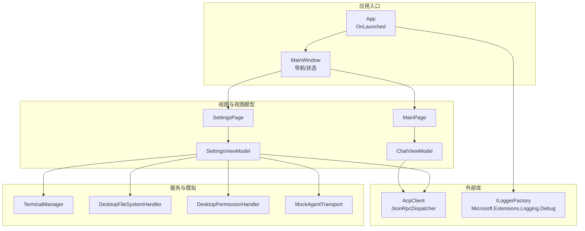
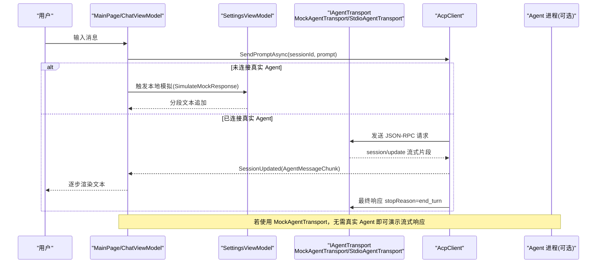
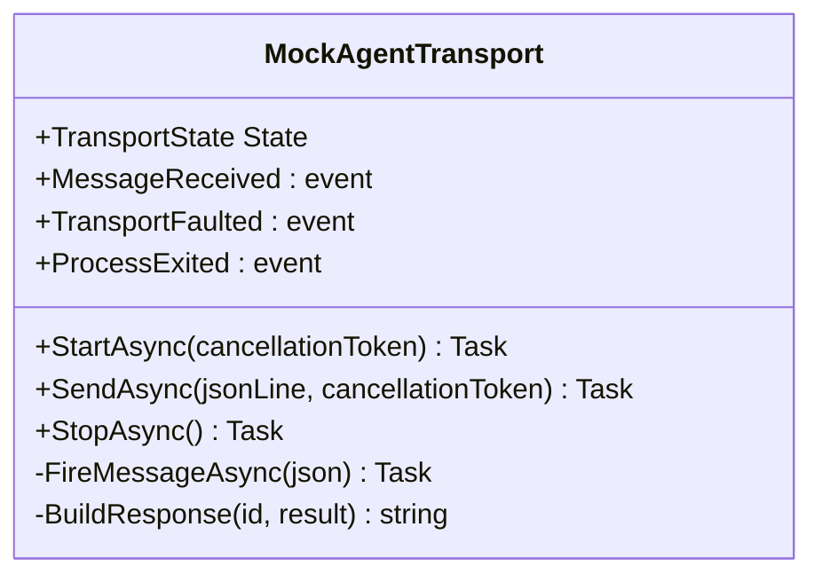
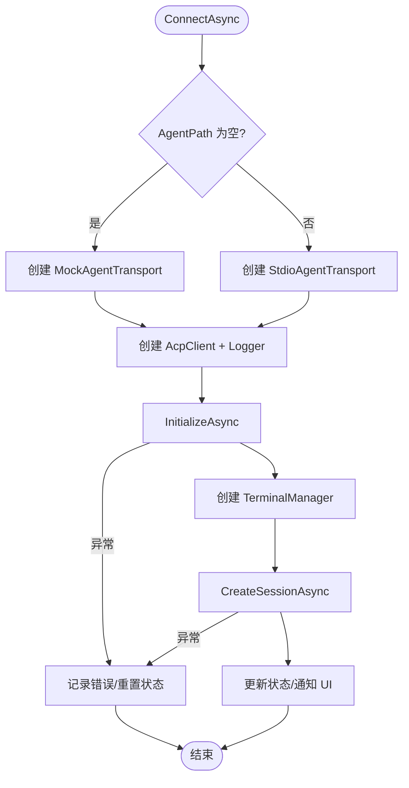
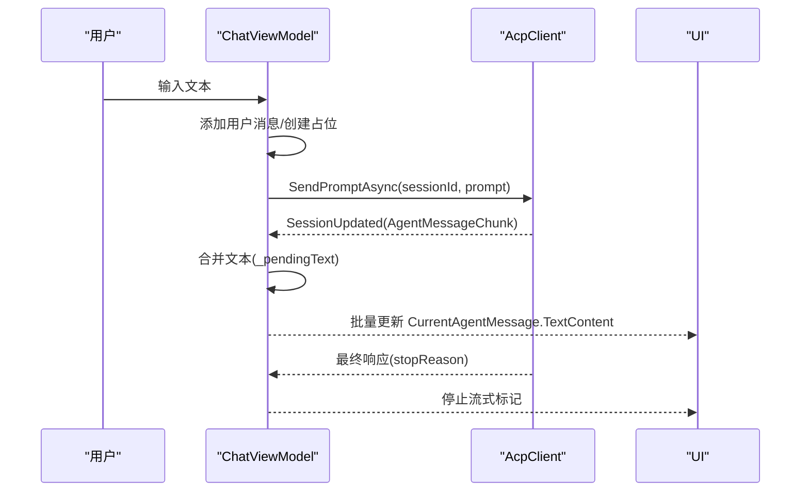
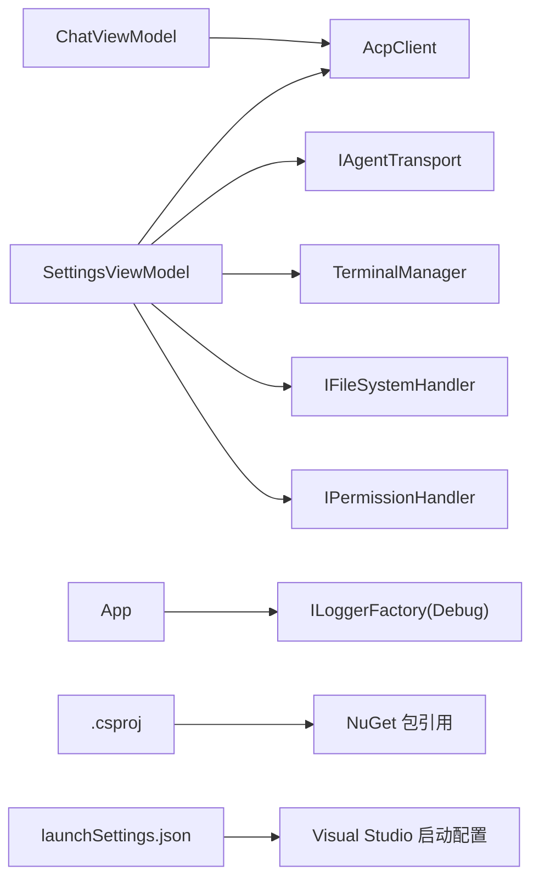

# 调试测试

<cite>
**本文引用的文件**   
- [App.xaml.cs](file://Agentic.Desktop/App.xaml.cs)
- [MainWindow.xaml.cs](file://Agentic.Desktop/MainWindow.xaml.cs)
- [SettingsPage.xaml.cs](file://Agentic.Desktop/SettingsPage.xaml.cs)
- [MainPage.xaml.cs](file://Agentic.Desktop/MainPage.xaml.cs)
- [ChatViewModel.cs](file://Agentic.Desktop/ViewModels/ChatViewModel.cs)
- [SettingsViewModel.cs](file://Agentic.Desktop/ViewModels/SettingsViewModel.cs)
- [MockAgentTransport.cs](file://Agentic.Desktop/Mocks/MockAgentTransport.cs)
- [TerminalManager.cs](file://Agentic.Desktop/Services/TerminalManager.cs)
- [FileSystemHandler.cs](file://Agentic.Desktop/Services/FileSystemHandler.cs)
- [PermissionHandler.cs](file://Agentic.Desktop/Services/PermissionHandler.cs)
- [LocalizationService.cs](file://Agentic.Desktop/Services/LocalizationService.cs)
- [Agentic.Desktop.csproj](file://Agentic.Desktop/Agentic.Desktop.csproj)
- [launchSettings.json](file://Agentic.Desktop/Properties/launchSettings.json)
</cite>

## 目录
1. [简介](#简介)
2. [项目结构](#项目结构)
3. [核心组件](#核心组件)
4. [架构总览](#架构总览)
5. [详细组件分析](#详细组件分析)
6. [依赖关系分析](#依赖关系分析)
7. [性能考虑](#性能考虑)
8. [故障排查指南](#故障排查指南)
9. [结论](#结论)
10. [附录](#附录)

## 简介
本指南面向 Agentic.Desktop 的调试与测试，覆盖以下主题：
- Visual Studio 调试器使用技巧（断点、变量监视、调用堆栈）
- MockAgentTransport 模拟类的使用与单元测试/集成测试方法
- 日志系统配置与 Microsoft.Extensions.Logging.Debug 输出查看
- 性能分析与内存泄漏检测、性能瓶颈识别
- 常见调试场景与问题排查方法

## 项目结构
本项目为 WinUI 3 桌面应用，采用 MVVM 模式，通过 ACP 协议与 Agent 进程通信。关键目录与职责：
- App.xaml.cs：应用启动、全局 ILoggerFactory、窗口与 DispatcherQueue 初始化
- MainWindow.xaml.cs：主窗口、导航与连接状态指示
- SettingsPage.xaml.cs / SettingsViewModel.cs：设置页与连接管理（含 Mock 与真实 Stdio 传输切换）
- MainPage.xaml.cs / ChatViewModel.cs：聊天 UI 与消息流式更新
- Services/*：终端管理、权限处理、文件系统访问、本地化服务
- Mocks/MockAgentTransport.cs：模拟 ACP 传输，用于无真实 Agent 时的 UI 开发与测试
- .csproj：NuGet 依赖与构建属性（包含 Microsoft.Extensions.Logging.Debug）
- launchSettings.json：VS 启动配置（打包/非打包两种模式）

图表来源 
- [App.xaml.cs:64-76](file://Agentic.Desktop/App.xaml.cs#L64-L76)
- [MainWindow.xaml.cs:16-27](file://Agentic.Desktop/MainWindow.xaml.cs#L16-L27)
- [SettingsPage.xaml.cs:15-59](file://Agentic.Desktop/SettingsPage.xaml.cs#L15-L59)
- [SettingsViewModel.cs:60-126](file://Agentic.Desktop/ViewModels/SettingsViewModel.cs#L60-L126)
- [MainPage.xaml.cs:16-34](file://Agentic.Desktop/MainPage.xaml.cs#L16-L34)
- [ChatViewModel.cs:77-87](file://Agentic.Desktop/ViewModels/ChatViewModel.cs#L77-L87)
- [MockAgentTransport.cs:9-25](file://Agentic.Desktop/Mocks/MockAgentTransport.cs#L9-L25)
- [TerminalManager.cs:11-36](file://Agentic.Desktop/Services/TerminalManager.cs#L11-L36)
- [FileSystemHandler.cs:8-15](file://Agentic.Desktop/Services/FileSystemHandler.cs#L8-L15)
- [PermissionHandler.cs:11-24](file://Agentic.Desktop/Services/PermissionHandler.cs#L11-L24)

章节来源
- [App.xaml.cs:64-76](file://Agentic.Desktop/App.xaml.cs#L64-L76)
- [Agentic.Desktop.csproj:53-60](file://Agentic.Desktop/Agentic.Desktop.csproj#L53-L60)
- [launchSettings.json:1-10](file://Agentic.Desktop/Properties/launchSettings.json#L1-L10)

## 核心组件
- 应用生命周期与日志工厂
  - 在 OnLaunched 中创建 ILoggerFactory，并添加 Debug 输出，最小级别设为 Debug
  - 暴露 Window、DispatcherQueue、CurrentAcpClient 等全局资源
- 连接与传输
  - SettingsViewModel 根据 AgentPath 是否为空选择 MockAgentTransport 或 StdioAgentTransport
  - 通过 AcpClient 进行初始化、会话创建、提示发送与取消
- 聊天与流式响应
  - ChatViewModel 订阅 SessionUpdated，合并帧级文本批量刷新 UI
  - 支持工具调用通知与滚动到底部
- 终端与权限
  - TerminalManager 管理子进程标准输入/输出/错误流
  - DesktopPermissionHandler 将权限请求派发至 UI 线程弹窗
  - DesktopFileSystemHandler 限制文件访问到工作目录

章节来源
- [App.xaml.cs:67-71](file://Agentic.Desktop/App.xaml.cs#L67-L71)
- [SettingsViewModel.cs:73-87](file://Agentic.Desktop/ViewModels/SettingsViewModel.cs#L73-L87)
- [ChatViewModel.cs:153-206](file://Agentic.Desktop/ViewModels/ChatViewModel.cs#L153-L206)
- [TerminalManager.cs:16-68](file://Agentic.Desktop/Services/TerminalManager.cs#L16-L68)
- [PermissionHandler.cs:26-44](file://Agentic.Desktop/Services/PermissionHandler.cs#L26-L44)
- [FileSystemHandler.cs:17-30](file://Agentic.Desktop/Services/FileSystemHandler.cs#L17-L30)

## 架构总览
下图展示从用户交互到 ACP 协议通信的关键流程，包括 Mock 与真实传输路径。

图表来源 
- [ChatViewModel.cs:96-151](file://Agentic.Desktop/ViewModels/ChatViewModel.cs#L96-L151)
- [ChatViewModel.cs:153-206](file://Agentic.Desktop/ViewModels/ChatViewModel.cs#L153-L206)
- [SettingsViewModel.cs:73-113](file://Agentic.Desktop/ViewModels/SettingsViewModel.cs#L73-L113)
- [MockAgentTransport.cs:27-117](file://Agentic.Desktop/Mocks/MockAgentTransport.cs#L27-L117)

## 详细组件分析

### MockAgentTransport 模拟类
- 作用：实现 IAgentTransport，提供脚本化的 ACP 响应，便于 UI 开发与测试
- 关键行为
  - StartAsync/StopAsync：维护 TransportState
  - SendAsync：解析 method，返回 initialize/session/new/session/prompt 等响应
  - session/prompt：分片推送 session/update 通知，支持取消
  - 事件：MessageReceived、TransportFaulted、ProcessExited
- 调试建议
  - 在 SendAsync 分支处设置条件断点（method == "session/prompt"）
  - 监视 _requestId、_state、_promptCts.Token 的状态变化
  - 在 FireMessageAsync 处观察 MessageReceived 回调参数

图表来源 
- [MockAgentTransport.cs:9-25](file://Agentic.Desktop/Mocks/MockAgentTransport.cs#L9-L25)
- [MockAgentTransport.cs:27-117](file://Agentic.Desktop/Mocks/MockAgentTransport.cs#L27-L117)
- [MockAgentTransport.cs:126-140](file://Agentic.Desktop/Mocks/MockAgentTransport.cs#L126-L140)

章节来源
- [MockAgentTransport.cs:27-117](file://Agentic.Desktop/Mocks/MockAgentTransport.cs#L27-L117)

### 连接与传输选择（SettingsViewModel）
- 逻辑要点
  - 当 AgentPath 为空时，使用 MockAgentTransport；否则使用 StdioAgentTransport
  - 创建 JsonRpcDispatcher 与 AcpClient，注入 ILogger
  - 订阅 AgentProcessExited，处理异常断开
  - 创建 TerminalManager 与 FileSystemHandler，建立会话
- 调试建议
  - 在 ConnectAsync 的 try/catch 块设置断点，检查异常信息
  - 监视 ConnectionState、IsConnected、ConnectionStatus 的变化
  - 在 InitializeAsync/CreateSessionAsync 前后记录耗时

图表来源 
- [SettingsViewModel.cs:60-126](file://Agentic.Desktop/ViewModels/SettingsViewModel.cs#L60-L126)

章节来源
- [SettingsViewModel.cs:60-126](file://Agentic.Desktop/ViewModels/SettingsViewModel.cs#L60-L126)

### 聊天与流式响应（ChatViewModel）
- 关键点
  - BindClient 绑定 AcpClient，订阅 SessionUpdated
  - SendMessageAsync 发送用户消息，创建占位 Agent 消息并开始流式更新
  - OnSessionUpdated 对 AgentMessageChunk 做帧级合并，延迟 50ms 批量刷新 UI
  - CancelGenerationAsync 取消当前生成
- 调试建议
  - 在 OnSessionUpdated 分支设置断点，观察 chunk.Content.Text 增量
  - 监视 _pendingText、_flushScheduled 与 UI 线程调度
  - 在 finally 块确认 IsStreaming 状态复位

图表来源 
- [ChatViewModel.cs:96-151](file://Agentic.Desktop/ViewModels/ChatViewModel.cs#L96-L151)
- [ChatViewModel.cs:153-206](file://Agentic.Desktop/ViewModels/ChatViewModel.cs#L153-L206)

章节来源
- [ChatViewModel.cs:96-151](file://Agentic.Desktop/ViewModels/ChatViewModel.cs#L96-L151)
- [ChatViewModel.cs:153-206](file://Agentic.Desktop/ViewModels/ChatViewModel.cs#L153-L206)

### 终端管理（TerminalManager）
- 功能：创建/管理多个终端进程，异步读取 stdout/stderr，支持等待退出、终止、释放
- 调试建议
  - 在 CreateTerminalAsync 中设置断点，验证 ProcessStartInfo 参数
  - 在 ReadLines 循环中观察输出缓冲增长
  - 在 Kill/Release 中确保进程树被正确终止

章节来源
- [TerminalManager.cs:16-98](file://Agentic.Desktop/Services/TerminalManager.cs#L16-L98)

### 权限与文件系统（PermissionHandler / FileSystemHandler）
- PermissionHandler：将权限请求派发至 UI 线程，显示对话框后回传结果
- FileSystemHandler：校验路径是否在工作目录下，读写文本文件
- 调试建议
  - 在 HandlePermissionRequestAsync 中设置断点，观察 Request 内容
  - 在 ValidatePath 中检查路径前缀匹配逻辑

章节来源
- [PermissionHandler.cs:26-44](file://Agentic.Desktop/Services/PermissionHandler.cs#L26-L44)
- [FileSystemHandler.cs:17-40](file://Agentic.Desktop/Services/FileSystemHandler.cs#L17-L40)

## 依赖关系分析
- 应用层依赖
  - SettingsViewModel 依赖 AcpClient、IAgentTransport、TerminalManager、IFileSystemHandler、IPermissionHandler
  - ChatViewModel 依赖 AcpClient、UI 调度器
- 外部库
  - Microsoft.Extensions.Logging.Debug：提供 Debug 输出
  - ShihaoShen.Agentic.ACPLibrary：ACP 客户端与协议
- 构建与运行
  - .csproj 指定目标框架、平台、WinUI SDK、NuGet 引用
  - launchSettings.json 定义 VS 启动配置（Package/Unpackaged）

图表来源 
- [SettingsViewModel.cs:73-113](file://Agentic.Desktop/ViewModels/SettingsViewModel.cs#L73-L113)
- [ChatViewModel.cs:77-87](file://Agentic.Desktop/ViewModels/ChatViewModel.cs#L77-L87)
- [App.xaml.cs:67-71](file://Agentic.Desktop/App.xaml.cs#L67-L71)
- [Agentic.Desktop.csproj:53-60](file://Agentic.Desktop/Agentic.Desktop.csproj#L53-L60)
- [launchSettings.json:1-10](file://Agentic.Desktop/Properties/launchSettings.json#L1-L10)

章节来源
- [Agentic.Desktop.csproj:53-60](file://Agentic.Desktop/Agentic.Desktop.csproj#L53-L60)
- [launchSettings.json:1-10](file://Agentic.Desktop/Properties/launchSettings.json#L1-L10)

## 性能考虑
- 流式响应批处理
  - ChatViewModel 对 AgentMessageChunk 进行 50ms 批处理，减少 UI 刷新频率
  - 建议在大量数据场景下调整批处理间隔，平衡实时性与性能
- 异步 I/O
  - TerminalManager 使用异步读取 stdout/stderr，避免阻塞 UI 线程
  - 注意取消令牌传递，防止任务悬挂
- 日志级别
  - 默认 Debug 级别可能产生较多输出，生产环境可调整为 Warning/Information
- 内存管理
  - 及时释放 TerminalManager、AcpClient 等资源，避免进程句柄泄露
  - 关注 CancellationTokenSource 的生命周期，避免重复创建

[本节为通用指导，不直接分析具体文件]

## 故障排查指南
- 无法连接 Agent
  - 检查 SettingsViewModel.ConnectAsync 的异常捕获与 ConnectionStatus 更新
  - 确认 AgentPath 与 AgentArguments 是否正确
  - 查看 App.LoggerFactory 的 Debug 输出，定位初始化失败原因
- 流式响应不显示或卡顿
  - 检查 ChatViewModel.OnSessionUpdated 的批处理逻辑与 UI 调度
  - 确认 MessageReceived 事件是否正常触发
  - 在 MockAgentTransport.SendAsync 中验证分片推送逻辑
- 权限弹窗不出现
  - 检查 DesktopPermissionHandler.HandlePermissionRequestAsync 是否派发至 UI 线程
  - 确认 SettingsPage 中 PermissionRequested 事件订阅与对话框显示
- 终端进程未退出
  - 在 TerminalManager.ReleaseTerminalAsync/KillTerminalAsync 中确认进程终止
  - 使用任务管理器检查残留进程
- 日志输出不可见
  - 确认 App.OnLaunched 中 AddDebug 与 SetMinimumLevel(LogLevel.Debug)
  - 在 Visual Studio “输出”窗口筛选“调试器”或“应用程序”

章节来源
- [SettingsViewModel.cs:115-126](file://Agentic.Desktop/ViewModels/SettingsViewModel.cs#L115-L126)
- [ChatViewModel.cs:153-206](file://Agentic.Desktop/ViewModels/ChatViewModel.cs#L153-L206)
- [MockAgentTransport.cs:27-117](file://Agentic.Desktop/Mocks/MockAgentTransport.cs#L27-L117)
- [PermissionHandler.cs:26-44](file://Agentic.Desktop/Services/PermissionHandler.cs#L26-L44)
- [TerminalManager.cs:86-113](file://Agentic.Desktop/Services/TerminalManager.cs#L86-L113)
- [App.xaml.cs:67-71](file://Agentic.Desktop/App.xaml.cs#L67-L71)

## 结论
本指南围绕 Agentic.Desktop 的调试与测试提供了系统性方法：
- 利用 MockAgentTransport 在无真实 Agent 的情况下快速验证 UI 与流程
- 通过 Visual Studio 断点、监视与调用堆栈定位问题
- 借助 Microsoft.Extensions.Logging.Debug 输出追踪关键路径
- 结合性能分析与内存检测工具优化流式响应与资源管理
- 针对常见问题给出排查步骤与修复建议

[本节为总结性内容，不直接分析具体文件]

## 附录

### Visual Studio 调试器使用技巧
- 断点设置
  - 在关键方法入口（如 ConnectAsync、SendAsync、OnSessionUpdated）设置断点
  - 使用条件断点过滤特定 method 或状态
- 变量监视
  - 监视 _state、_requestId、_promptCts.Token、ConnectionState、IsConnected
  - 在 UI 线程上观察 CurrentAgentMessage.TextContent 变化
- 调用堆栈分析
  - 遇到异常时查看堆栈，定位异常来源与传播路径
  - 区分 UI 线程与非 UI 线程调用，避免跨线程访问

[本节为通用指导，不直接分析具体文件]

### 单元测试与集成测试建议
- 单元测试
  - 针对 MockAgentTransport 的行为编写用例，验证 initialize/session/new/session/prompt 响应
  - 验证 Cancel 与 Stop 对 _promptCts 的影响
- 集成测试
  - 使用真实 StdioAgentTransport 与外部 Agent 进程进行端到端测试
  - 验证 AcpClient 初始化、会话创建、消息发送与取消全流程
- 测试数据与断言
  - 构造标准化 JSON 请求行，断言返回结果结构与字段
  - 验证事件触发顺序与次数（MessageReceived、TransportFaulted）

[本节为通用指导，不直接分析具体文件]

### 日志系统配置与查看
- 配置位置
  - App.OnLaunched 中创建 ILoggerFactory，添加 Debug 输出，设置最低级别为 Debug
- 查看方式
  - 在 Visual Studio “输出”窗口选择“调试器”或“应用程序”
  - 过滤关键字（如 AcpClient、InitializeAsync、CreateSessionAsync）

章节来源
- [App.xaml.cs:67-71](file://Agentic.Desktop/App.xaml.cs#L67-L71)

### 性能分析与内存泄漏检测
- 性能分析
  - 使用 Visual Studio “性能探查器”采集 CPU/内存快照
  - 重点关注流式响应批处理间隔与异步 I/O 耗时
- 内存泄漏检测
  - 检查 TerminalManager、AcpClient 的释放路径
  - 确认 CancellationTokenSource 不再使用时被释放
  - 使用内存快照对比连接/断开前后的对象图

[本节为通用指导，不直接分析具体文件]

### 常见调试场景与问题排查
- 场景一：点击连接无响应
  - 检查 SettingsViewModel.ConnectAsync 的异常捕获与状态更新
  - 查看日志输出，确认 InitializeAsync 是否成功
- 场景二：流式文本不显示
  - 检查 ChatViewModel.OnSessionUpdated 的批处理与 UI 调度
  - 在 MockAgentTransport 中验证分片推送
- 场景三：权限弹窗不出现
  - 检查 DesktopPermissionHandler 的事件派发与 UI 线程调度
- 场景四：终端进程未退出
  - 检查 TerminalManager 的 Kill/Release 逻辑

章节来源
- [SettingsViewModel.cs:115-126](file://Agentic.Desktop/ViewModels/SettingsViewModel.cs#L115-L126)
- [ChatViewModel.cs:153-206](file://Agentic.Desktop/ViewModels/ChatViewModel.cs#L153-L206)
- [MockAgentTransport.cs:27-117](file://Agentic.Desktop/Mocks/MockAgentTransport.cs#L27-L117)
- [PermissionHandler.cs:26-44](file://Agentic.Desktop/Services/PermissionHandler.cs#L26-L44)
- [TerminalManager.cs:86-113](file://Agentic.Desktop/Services/TerminalManager.cs#L86-L113)