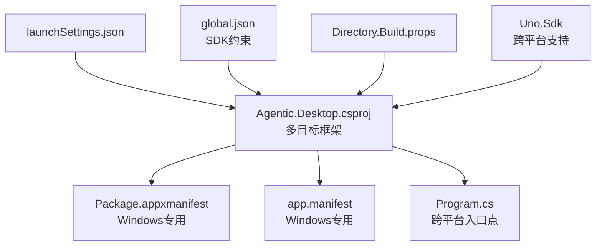
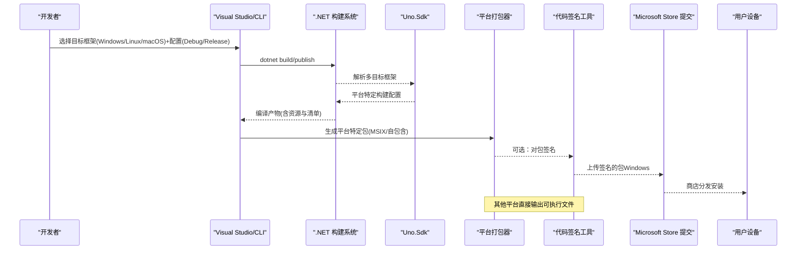
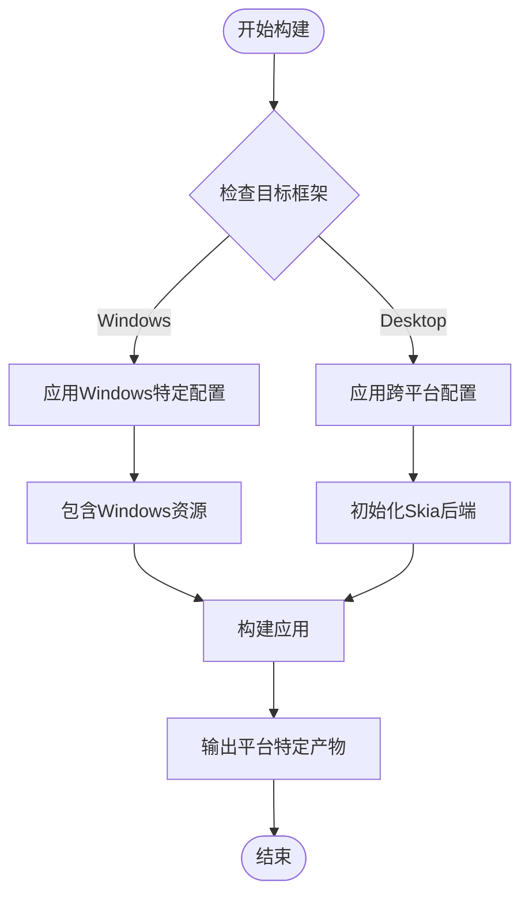
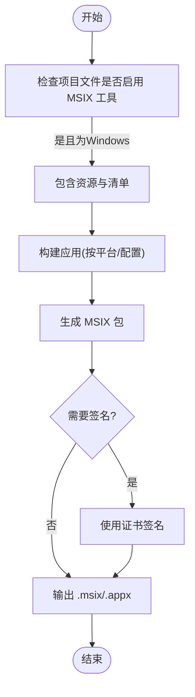
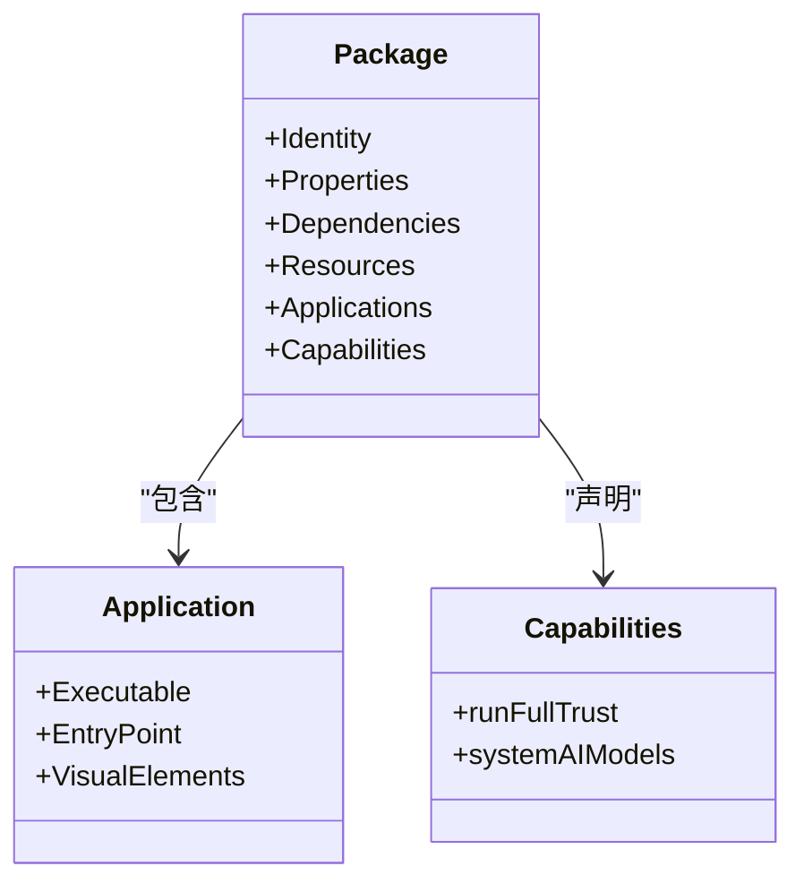
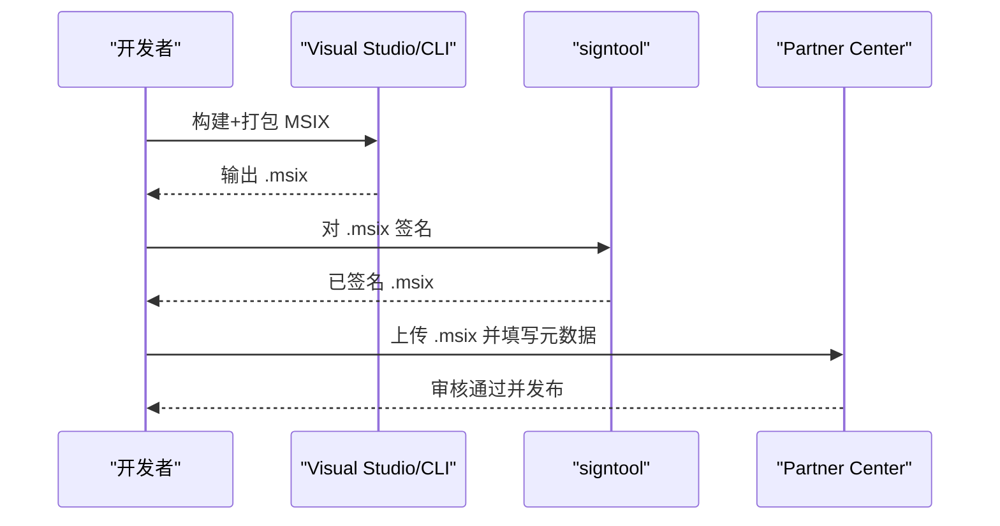
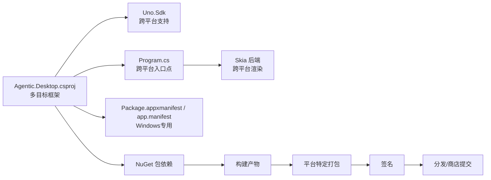

# 部署发布

<cite>
**本文引用的文件**   
- [Agentic.Desktop.csproj](file://Agentic.Desktop/Agentic.Desktop.csproj)
- [Package.appxmanifest](file://Agentic.Desktop/Package.appxmanifest)
- [app.manifest](file://Agentic.Desktop/app.manifest)
- [Program.cs](file://Agentic.Desktop/Platforms/Desktop/Program.cs)
- [launchSettings.json](file://Agentic.Desktop/Properties/launchSettings.json)
- [global.json](file://global.json)
- [Directory.Build.props](file://Directory.Build.props)
- [README.md](file://README.md)
</cite>

## 更新摘要
**所做更改**   
- 新增跨平台支持（Windows、Linux、macOS）的部署说明
- 更新Uno.Sdk和Skia后端的配置说明
- 添加多目标框架构建配置
- 更新平台特定的部署选项
- 增强跨平台兼容性说明

## 目录
1. [简介](#简介)
2. [项目结构](#项目结构)
3. [核心组件](#核心组件)
4. [架构总览](#架构总览)
5. [详细组件分析](#详细组件分析)
6. [依赖分析](#依赖分析)
7. [性能考虑](#性能考虑)
8. [故障排查指南](#故障排查指南)
9. [结论](#结论)
10. [附录](#附录)

## 简介
本文件面向 Agentic.Desktop 的跨平台部署与发布，覆盖 Uno.Sdk 多目标框架支持、MSIX 打包配置与生成、清单文件修改与权限声明、跨平台构建选项（Windows、Linux、macOS）、应用商店发布准备与提交流程、独立部署选项、签名证书配置、版本管理与更新机制，以及发布前的质量检查与验证步骤。内容基于仓库中的项目文件与清单配置进行说明，确保读者能够按步骤完成本地打包、签名、分发与商店提交。

**更新** 项目现已支持跨平台部署，使用 Uno.Sdk 提供 Windows、Linux 和 macOS 的统一开发体验。

## 项目结构
本项目为基于 Uno.Sdk 的跨平台 .NET 桌面应用，支持多目标框架编译。关键发布相关位置：
- 项目文件：定义多目标框架（net10.0-windows10.0.26100;net10.0-desktop）、Uno.Sdk 集成、平台特定配置等
- 清单文件：Package.appxmanifest（MSIX 包清单，仅Windows）、app.manifest（进程级兼容性/DPI，仅Windows）
- 启动配置：Properties/launchSettings.json 支持"打包"和"未打包"两种调试模式
- 全局 SDK 约束：global.json 锁定 .NET SDK 版本和 Uno.Sdk 版本
- 跨平台入口点：Platforms/Desktop/Program.cs 使用 Skia 后端初始化

**图表来源**
- [Agentic.Desktop.csproj:1-83](file://Agentic.Desktop/Agentic.Desktop.csproj#L1-L83)
- [Package.appxmanifest:1-62](file://Agentic.Desktop/Package.appxmanifest#L1-L62)
- [app.manifest:1-19](file://Agentic.Desktop/app.manifest#L1-L19)
- [Program.cs:1-25](file://Agentic.Desktop/Platforms/Desktop/Program.cs#L1-L25)
- [launchSettings.json:1-10](file://Agentic.Desktop/Properties/launchSettings.json#L1-L10)
- [global.json:1-11](file://global.json#L1-L11)
- [Directory.Build.props:1-23](file://Directory.Build.props#L1-L23)

章节来源
- [Agentic.Desktop.csproj:1-83](file://Agentic.Desktop/Agentic.Desktop.csproj#L1-L83)
- [README.md:1-101](file://README.md#L1-L101)

## 核心组件
- **跨平台框架支持**
  - 使用 Uno.Sdk 6.6.29 提供统一的跨平台开发体验
  - 支持 net10.0-windows10.0.26100（Windows）和 net10.0-desktop（Linux/macOS）双目标框架
  - 通过条件编译和平台特定配置实现功能差异化
- **MSIX 打包能力（Windows）**
  - 通过项目文件启用 EnableMsixTooling，并引入 Msix 项目能力
  - 资源与图标由项目文件包含，清单中指定可执行入口点与应用视觉元素
- **跨平台 UI 渲染**
  - 使用 Skia 后端实现 Linux 和 macOS 上的原生 UI 渲染
  - 通过 Uno.UI.Hosting 提供统一的应用宿主管理
- **清单与权限（Windows）**
  - Package.appxmanifest 定义包身份、显示名、语言资源、应用入口、可视元素与能力
  - app.manifest 声明运行时兼容性与 DPI 感知（PerMonitorV2）
- **调试与运行**
  - launchSettings.json 提供"打包"和"未打包"两种启动方式
  - 支持跨平台调试和测试

**更新** 新增跨平台支持和 Skia 后端初始化配置。

章节来源
- [Agentic.Desktop.csproj:1-83](file://Agentic.Desktop/Agentic.Desktop.csproj#L1-L83)
- [Package.appxmanifest:1-62](file://Agentic.Desktop/Package.appxmanifest#L1-L62)
- [app.manifest:1-19](file://Agentic.Desktop/app.manifest#L1-L19)
- [Program.cs:1-25](file://Agentic.Desktop/Platforms/Desktop/Program.cs#L1-L25)
- [launchSettings.json:1-10](file://Agentic.Desktop/Properties/launchSettings.json#L1-L10)

## 架构总览
下图展示了从开发者到最终产物的跨平台发布流程概览，包括多目标构建、平台特定打包、签名与分发路径。

[此图为概念性流程图，不直接映射具体源码文件]

## 详细组件分析

### 跨平台框架配置与构建
- **多目标框架支持**
  - TargetFrameworks 指定 net10.0-windows10.0.26100 和 net10.0-desktop
  - 使用 Uno.Sdk 6.6.29 提供跨平台编译支持
  - 通过 MSBuild 条件表达式实现平台特定配置
- **平台特定常量**
  - WINDOWS 符号仅在 Windows 目标框架下定义
  - ApplicationManifest 仅在 Windows 目标框架下应用
- **跨平台入口点**
  - Platforms/Desktop/Program.cs 使用 UnoPlatformHostBuilder 初始化跨平台应用
  - 支持 X11、Linux FrameBuffer、macOS 和 Win32 后端
  - 自动检测并选择合适的平台后端

**图表来源**
- [Agentic.Desktop.csproj:1-83](file://Agentic.Desktop/Agentic.Desktop.csproj#L1-L83)
- [Program.cs:1-25](file://Agentic.Desktop/Platforms/Desktop/Program.cs#L1-L25)

章节来源
- [Agentic.Desktop.csproj:1-83](file://Agentic.Desktop/Agentic.Desktop.csproj#L1-L83)
- [Program.cs:1-25](file://Agentic.Desktop/Platforms/Desktop/Program.cs#L1-L25)
- [global.json:1-11](file://global.json#L1-L11)

### MSIX 打包配置与生成（Windows）
- **启用 MSIX 工具链**
  - 项目文件中启用 EnableMsixTooling，并添加 Msix 项目能力
  - 仅在 Windows 目标框架下启用 MSIX 打包功能
- **清单与资源**
  - Package.appxmanifest 定义包标识、显示名、Logo、语言资源、应用入口点与可视元素
  - 项目文件将 Assets 下的多种尺寸 Logo 作为 Content 包含，供打包使用
- **打包入口**
  - 可通过 Visual Studio 的"打包和发布"菜单或命令行调用 MSIX 打包任务
  - launchSettings.json 提供"MsixPackage"启动配置，便于在 IDE 内直接调试打包后的应用

**图表来源**
- [Agentic.Desktop.csproj:36-39](file://Agentic.Desktop/Agentic.Desktop.csproj#L36-L39)
- [Package.appxmanifest:1-62](file://Agentic.Desktop/Package.appxmanifest#L1-L62)
- [launchSettings.json:1-10](file://Agentic.Desktop/Properties/launchSettings.json#L1-L10)

章节来源
- [Agentic.Desktop.csproj:36-39](file://Agentic.Desktop/Agentic.Desktop.csproj#L36-L39)
- [Package.appxmanifest:1-62](file://Agentic.Desktop/Package.appxmanifest#L1-L62)
- [launchSettings.json:1-10](file://Agentic.Desktop/Properties/launchSettings.json#L1-L10)

### Package.appxmanifest 清单与权限声明（Windows）
- **包身份与属性**
  - Identity 节点定义 Name、Publisher、Version；Properties 定义 DisplayName、PublisherDisplayName、Logo
- **依赖与资源**
  - Dependencies 声明 Universal 与 Desktop 目标设备族及最低/测试版本
  - Resources 声明支持的语言（en、zh-CN、zh-TW、ja）
- **应用入口与可视化**
  - Applications/Application 指定 Executable 与 EntryPoint，uap:VisualElements 定义显示名、描述、背景色与各类 Logo/SplashScreen
- **能力声明**
  - Capabilities 包含 runFullTrust（允许完全信任运行）与 systemAIModels（系统 AI 模型能力）

**图表来源**
- [Package.appxmanifest:1-62](file://Agentic.Desktop/Package.appxmanifest#L1-L62)

章节来源
- [Package.appxmanifest:1-62](file://Agentic.Desktop/Package.appxmanifest#L1-L62)

### app.manifest 应用清单（Windows）
- **兼容性声明**
  - 声明支持的操作系统版本，确保在未打包应用中也能正确使用新特性（例如自定义标题栏）
- **DPI 感知**
  - dpiAwareness 设置为 PerMonitorV2，提升多显示器高 DPI 场景下的体验

章节来源
- [app.manifest:1-19](file://Agentic.Desktop/app.manifest#L1-L19)

### 跨平台发布配置
- **多目标框架构建**
  - 支持同时构建 Windows、Linux 和 macOS 版本
  - 使用 `dotnet build -f net10.0-windows10.0.26100` 构建 Windows 版本
  - 使用 `dotnet build -f net10.0-desktop` 构建跨平台版本
- **平台特定优化**
  - Windows 版本支持 MSIX 打包和商店发布
  - Linux/macOS 版本生成自包含的可执行文件
  - 通过 PublishReadyToRun 和 PublishTrimmed 优化发布体积
- **运行时要求**
  - Windows：需要 Windows App SDK 2.3.1
  - Linux：需要相应的图形库（X11 或 Wayland）
  - macOS：需要 macOS 10.15+ 和相应的运行时

**更新** 新增跨平台发布配置和多目标框架支持。

章节来源
- [Agentic.Desktop.csproj:4-16](file://Agentic.Desktop/Agentic.Desktop.csproj#L4-L16)
- [Agentic.Desktop.csproj:75-81](file://Agentic.Desktop/Agentic.Desktop.csproj#L75-L81)

### 应用商店发布准备与提交流程（Windows）
- **准备工作**
  - 确认 Package.appxmanifest 中 Identity、Version、Logo、资源语言等正确
  - 确认 Capabilities 满足应用需求（如 runFullTrust、systemAIModels）
  - 准备企业/个人开发者证书（.pfx），并确保签名工具可用
- **打包与签名**
  - 使用 Visual Studio 或 CLI 生成 MSIX
  - 使用 signtool 对 MSIX 进行签名（推荐时间戳服务器）
- **提交商店**
  - 登录 Microsoft Partner Center
  - 创建或选择应用条目，上传签名的 MSIX
  - 填写元数据（名称、描述、截图、分类、隐私政策等）
  - 提交审核并发布

[此图为概念性流程图，不直接映射具体源码文件]

### 独立部署选项
- **Windows 独立部署**
  - 使用 `dotnet publish -c Release -r win-x64 --self-contained` 生成自包含的 Windows 版本
  - 无需目标机器预装 .NET 运行时
  - 支持 MSIX 打包或直接分发可执行文件
- **Linux 独立部署**
  - 使用 `dotnet publish -c Release -r linux-x64 --self-contained` 生成 Linux 版本
  - 需要安装必要的系统依赖（X11、GTK+ 等）
  - 生成可直接执行的二进制文件
- **macOS 独立部署**
  - 使用 `dotnet publish -c Release -r osx-x64 --self-contained` 生成 macOS 版本
  - 生成 .app 包格式，支持拖拽安装
  - 需要 macOS 10.15+ 系统支持

**更新** 新增跨平台独立部署选项。

章节来源
- [Agentic.Desktop.csproj:75-81](file://Agentic.Desktop/Agentic.Desktop.csproj#L75-L81)
- [Program.cs:14-23](file://Agentic.Desktop/Platforms/Desktop/Program.cs#L14-L23)

### 签名证书配置
- **证书类型**
  - 建议使用受信任的第三方代码签名证书（.pfx），避免自签名证书导致用户信任问题
- **签名时机**
  - 建议在 MSIX 打包完成后立即签名，确保包完整性与可信来源
- **工具与环境**
  - 使用 signtool 进行签名，建议配置时间戳服务器以保证长期有效性
- **本地调试**
  - 可使用开发证书进行本地测试，但正式发布必须使用受信任证书

章节来源
- [Agentic.Desktop.csproj:36-39](file://Agentic.Desktop/Agentic.Desktop.csproj#L36-L39)

### 版本管理与更新机制
- **版本来源**
  - MSIX 包的版本号来自 Package.appxmanifest 中的 Identity.Version
  - 应用商店发布时，版本号需递增且符合商店规则
- **更新策略**
  - 商店发布：通过商店自动推送更新
  - 独立部署：如需自动更新，可集成第三方更新库或在应用内实现检查更新逻辑（当前项目未内置更新模块）

章节来源
- [Package.appxmanifest:11-14](file://Agentic.Desktop/Package.appxmanifest#L11-L14)

### 发布前的质量检查与验证
- **构建与依赖**
  - 使用 global.json 固定 SDK 版本，确保构建一致性
  - 清理并重新构建，确认无警告与错误
- **清单校验**
  - 检查 Package.appxmanifest 的 Identity、Version、Logo、资源语言、Capabilities 是否正确
  - 检查 app.manifest 的兼容性与 DPI 设置
- **平台验证**
  - 分别在 Windows、Linux、macOS 上构建与运行，确保无平台相关问题
  - 验证 Skia 后端在不同平台上的正确初始化
- **签名验证**
  - 使用 signtool verify 验证签名与时间戳
- **功能验证**
  - 验证应用启动、界面渲染、Agent 连接、权限弹窗、终端命令执行等核心功能
  - 测试跨平台 UI 渲染的一致性和性能
- **性能与体积**
  - 评估包大小与启动时间，必要时调整 PublishTrimmed 与 PublishReadyToRun

**更新** 新增跨平台验证和 Skia 后端测试要求。

章节来源
- [global.json:1-11](file://global.json#L1-L11)
- [Agentic.Desktop.csproj:1-83](file://Agentic.Desktop/Agentic.Desktop.csproj#L1-L83)
- [Package.appxmanifest:1-62](file://Agentic.Desktop/Package.appxmanifest#L1-L62)
- [app.manifest:1-19](file://Agentic.Desktop/app.manifest#L1-L19)
- [Program.cs:14-23](file://Agentic.Desktop/Platforms/Desktop/Program.cs#L14-L23)

## 依赖分析
- **项目依赖**
  - Uno.Sdk 6.6.29 提供跨平台支持
  - Windows App SDK 2.3.1（仅 Windows）
  - CommunityToolkit.Mvvm、Markdig、日志扩展等通用包
  - 通过 NuGet 管理版本，确保构建环境一致
- **清单依赖**
  - Package.appxmanifest 依赖 Assets 资源与语言资源（仅 Windows）
  - app.manifest 依赖操作系统特性（DPI、兼容性，仅 Windows）
- **发布依赖**
  - MSIX 打包依赖 EnableMsixTooling 与 Msix 能力（仅 Windows）
  - 跨平台发布依赖 Uno.Sdk 和正确的 RuntimeIdentifier

**图表来源**
- [Agentic.Desktop.csproj:1-83](file://Agentic.Desktop/Agentic.Desktop.csproj#L1-L83)
- [Package.appxmanifest:1-62](file://Agentic.Desktop/Package.appxmanifest#L1-L62)
- [app.manifest:1-19](file://Agentic.Desktop/app.manifest#L1-L19)
- [Program.cs:1-25](file://Agentic.Desktop/Platforms/Desktop/Program.cs#L1-L25)
- [global.json:7-9](file://global.json#L7-L9)

章节来源
- [Agentic.Desktop.csproj:1-83](file://Agentic.Desktop/Agentic.Desktop.csproj#L1-L83)

## 性能考虑
- **发布优化**
  - Release 配置下启用 PublishReadyToRun 与 PublishTrimmed，减少体积并加速启动
  - 针对不同平台优化发布参数
- **运行时选择**
  - SelfContained 会捆绑运行时，增大包体积但提升兼容性
  - 非 SelfContained 减小体积但要求目标机具备运行时
- **资源与图标**
  - 合理裁剪不必要的资源与图标，降低包大小
  - 使用条件编译排除不需要的平台特定资源
- **跨平台性能**
  - Skia 后端在不同平台上的性能表现可能有所差异
  - 需要针对各平台进行性能调优和测试

**更新** 新增跨平台性能考虑和优化建议。

章节来源
- [Agentic.Desktop.csproj:75-81](file://Agentic.Desktop/Agentic.Desktop.csproj#L75-L81)

## 故障排查指南
- **构建失败**
  - 检查 Uno.Sdk 版本和 .NET SDK 版本兼容性
  - 确认目标框架和平台特定依赖是否正确安装
  - 检查 Package.appxmanifest 语法与必填字段完整（Windows）
- **跨平台问题**
  - 验证 Skia 后端在各平台的正确初始化
  - 检查系统依赖（X11、Wayland、macOS 框架等）
  - 确认图形库和字体渲染支持
- **签名失败**
  - 确认证书有效、私钥可用，时间戳服务器可达
  - 使用 signtool 单独验证签名结果
- **运行异常**
  - 检查 app.manifest 的 DPI 与兼容性设置（Windows）
  - 确认 Capabilities 是否满足运行时权限需求（Windows）
  - 验证跨平台 UI 渲染的正确性
- **平台差异**
  - 分别验证 Windows、Linux、macOS 的构建与运行
  - 关注平台特定的 API 限制和功能差异

**更新** 新增跨平台故障排查指南。

章节来源
- [Agentic.Desktop.csproj:1-83](file://Agentic.Desktop/Agentic.Desktop.csproj#L1-L83)
- [Package.appxmanifest:1-62](file://Agentic.Desktop/Package.appxmanifest#L1-L62)
- [app.manifest:1-19](file://Agentic.Desktop/app.manifest#L1-L19)
- [Program.cs:14-23](file://Agentic.Desktop/Platforms/Desktop/Program.cs#L14-L23)

## 结论
本项目采用现代 Uno.Sdk + WinUI 3 + Windows App SDK 的跨平台方案，支持 Windows、Linux 和 macOS 三平台。通过清晰的清单配置、多目标框架支持和 Skia 后端，能够实现高质量的跨平台桌面应用交付。配合合理的签名、版本管理与发布前验证，可以稳定地支持商店发布与独立部署。若需进一步自动化，可在 CI/CD 中集成多平台构建、签名与商店提交流程。

**更新** 项目现已具备完整的跨平台部署能力，支持主流桌面操作系统。

## 附录
- **快速参考**
  - 构建 Windows 版本：`dotnet build -f net10.0-windows10.0.26100`
  - 构建跨平台版本：`dotnet build -f net10.0-desktop`
  - 发布 Windows 版本：`dotnet publish -c Release -f net10.0-windows10.0.26100 -r win-x64 --self-contained`
  - 发布 Linux 版本：`dotnet publish -c Release -f net10.0-desktop -r linux-x64 --self-contained`
  - 发布 macOS 版本：`dotnet publish -c Release -f net10.0-desktop -r osx-x64 --self-contained`
  - 运行打包应用：`winapp run <输出目录>`（Windows）
  - 签名命令：`signtool sign /f <证书.pfx> /t <时间戳服务器> <包文件>`

**更新** 新增跨平台构建和发布命令。

章节来源
- [README.md:35-41](file://README.md#L35-L41)
- [Agentic.Desktop.csproj:4](file://Agentic.Desktop/Agentic.Desktop.csproj#L4)
- [Program.cs:14-23](file://Agentic.Desktop/Platforms/Desktop/Program.cs#L14-L23)