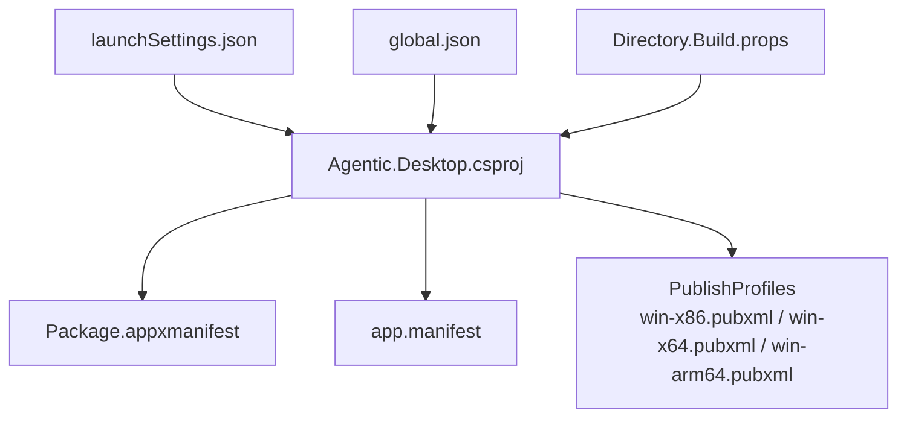
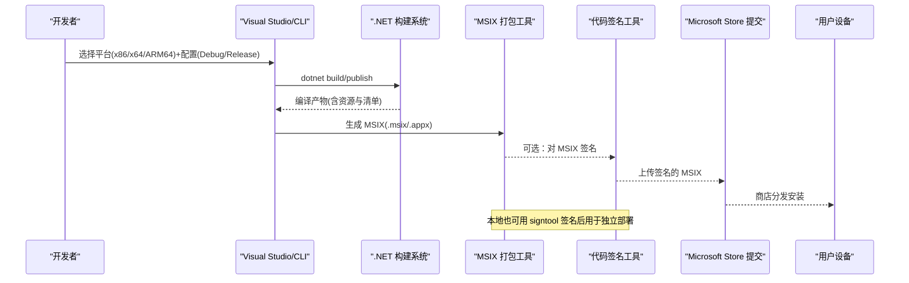
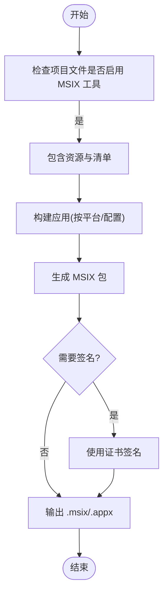
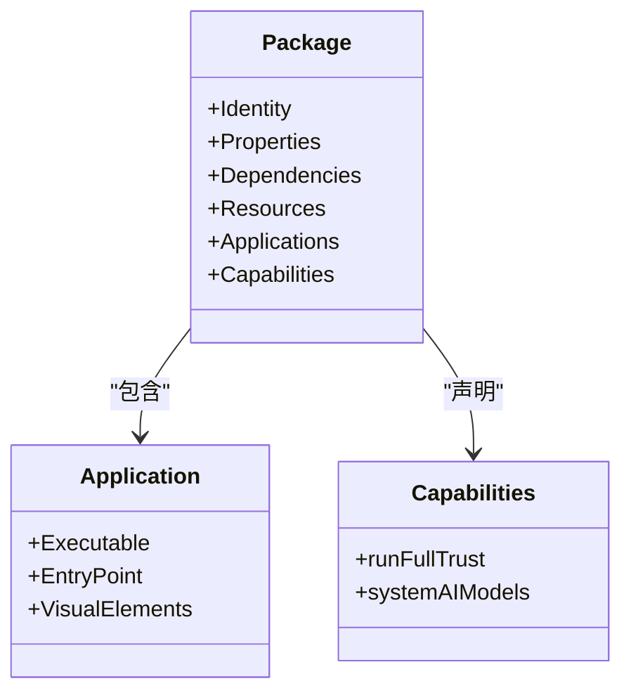
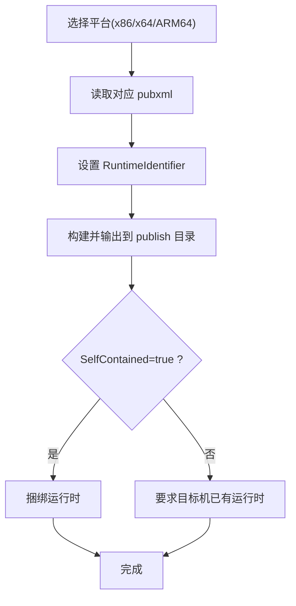
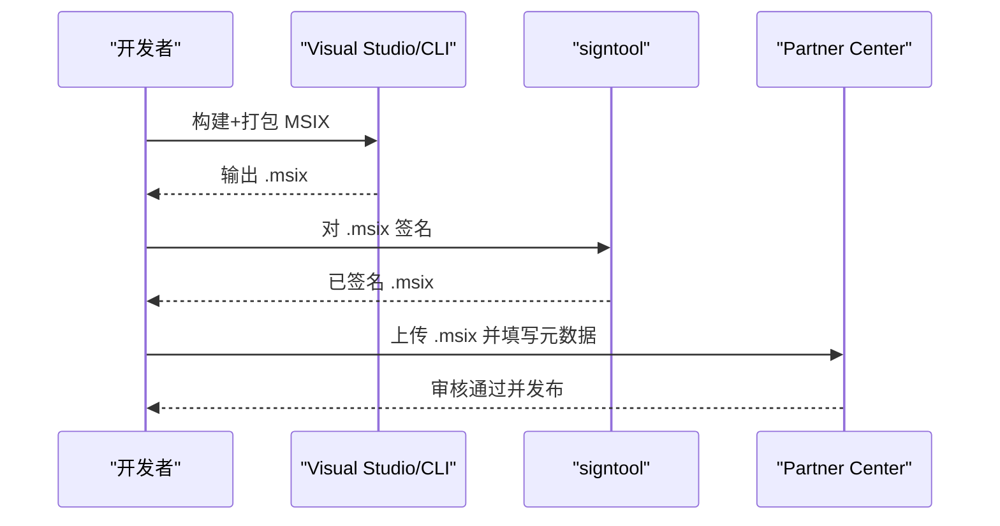
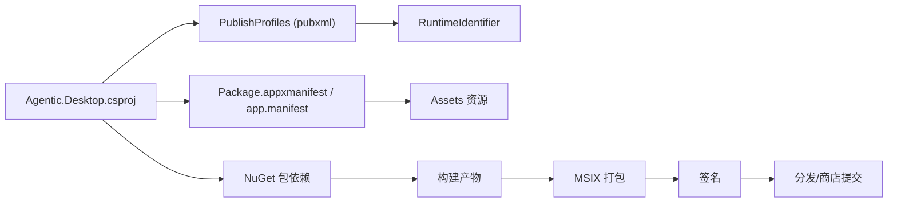

# 部署发布

<cite>
**本文引用的文件**   
- [Agentic.Desktop.csproj](file://Agentic.Desktop/Agentic.Desktop.csproj)
- [Package.appxmanifest](file://Agentic.Desktop/Package.appxmanifest)
- [app.manifest](file://Agentic.Desktop/app.manifest)
- [win-x86.pubxml](file://Agentic.Desktop/Properties/PublishProfiles/win-x86.pubxml)
- [win-x64.pubxml](file://Agentic.Desktop/Properties/PublishProfiles/win-x64.pubxml)
- [win-arm64.pubxml](file://Agentic.Desktop/Properties/PublishProfiles/win-arm64.pubxml)
- [launchSettings.json](file://Agentic.Desktop/Properties/launchSettings.json)
- [global.json](file://global.json)
- [Directory.Build.props](file://Directory.Build.props)
- [README.md](file://README.md)
</cite>

## 目录
1. [简介](#简介)
2. [项目结构](#项目结构)
3. [核心组件](#核心组件)
4. [架构总览](#架构总览)
5. [详细组件分析](#详细组件分析)
6. [依赖分析](#依赖分析)
7. [性能考虑](#性能考虑)
8. [故障排查指南](#故障排查指南)
9. [结论](#结论)
10. [附录](#附录)

## 简介
本文件面向 Agentic.Desktop 的部署与发布，覆盖 MSIX 打包配置与生成、清单文件修改与权限声明、多平台（x86/x64/ARM64）构建选项、应用商店发布准备与提交流程、独立部署与 ClickOnce 部署选项、签名证书配置、版本管理与更新机制，以及发布前的质量检查与验证步骤。内容基于仓库中的项目文件与清单配置进行说明，确保读者能够按步骤完成本地打包、签名、分发与商店提交。

## 项目结构
本项目为 WinUI 3 + Windows App SDK 的 .NET 桌面应用，使用单项目 MSIX 打包工具链。关键发布相关位置：
- 项目文件：定义目标框架、平台、MSIX 工具启用、资源与清单引用等
- 清单文件：Package.appxmanifest（MSIX 包清单）、app.manifest（进程级兼容性/DPI）
- 发布配置文件：Properties/PublishProfiles 下各平台的 pubxml
- 启动配置：Properties/launchSettings.json 支持“打包”和“未打包”两种调试模式
- 全局 SDK 约束：global.json 锁定 .NET SDK 版本

图表来源
- [Agentic.Desktop.csproj:1-79](file://Agentic.Desktop/Agentic.Desktop.csproj#L1-L79)
- [Package.appxmanifest:1-57](file://Agentic.Desktop/Package.appxmanifest#L1-L57)
- [app.manifest:1-19](file://Agentic.Desktop/app.manifest#L1-L19)
- [win-x86.pubxml:1-14](file://Agentic.Desktop/Properties/PublishProfiles/win-x86.pubxml#L1-L14)
- [win-x64.pubxml:1-14](file://Agentic.Desktop/Properties/PublishProfiles/win-x64.pubxml#L1-L14)
- [win-arm64.pubxml:1-14](file://Agentic.Desktop/Properties/PublishProfiles/win-arm64.pubxml#L1-L14)
- [launchSettings.json:1-10](file://Agentic.Desktop/Properties/launchSettings.json#L1-L10)
- [global.json:1-8](file://global.json#L1-L8)
- [Directory.Build.props:1-8](file://Directory.Build.props#L1-L8)

章节来源
- [Agentic.Desktop.csproj:1-79](file://Agentic.Desktop/Agentic.Desktop.csproj#L1-L79)
- [README.md:1-92](file://README.md#L1-L92)

## 核心组件
- MSIX 打包能力
  - 通过项目文件启用 EnableMsixTooling，并引入 Msix 项目能力，使 Visual Studio 或 CLI 能直接打包 MSIX
  - 资源与图标由项目文件包含，清单中指定可执行入口点与应用视觉元素
- 清单与权限
  - Package.appxmanifest 定义包身份、显示名、语言资源、应用入口、可视元素与能力（如 runFullTrust、systemAIModels）
  - app.manifest 声明运行时兼容性与 DPI 感知（PerMonitorV2），保证窗口标题栏等行为正确
- 多平台发布
  - 项目支持 x86、x64、ARM64 三平台；每个平台有独立的 pubxml 发布配置，输出为自包含（SelfContained）的独立部署产物
- 调试与运行
  - launchSettings.json 提供“打包”和“未打包”两种启动方式，便于在开发阶段快速验证打包行为

章节来源
- [Agentic.Desktop.csproj:1-79](file://Agentic.Desktop/Agentic.Desktop.csproj#L1-L79)
- [Package.appxmanifest:1-57](file://Agentic.Desktop/Package.appxmanifest#L1-L57)
- [app.manifest:1-19](file://Agentic.Desktop/app.manifest#L1-L19)
- [win-x86.pubxml:1-14](file://Agentic.Desktop/Properties/PublishProfiles/win-x86.pubxml#L1-L14)
- [win-x64.pubxml:1-14](file://Agentic.Desktop/Properties/PublishProfiles/win-x64.pubxml#L1-L14)
- [win-arm64.pubxml:1-14](file://Agentic.Desktop/Properties/PublishProfiles/win-arm64.pubxml#L1-L14)
- [launchSettings.json:1-10](file://Agentic.Desktop/Properties/launchSettings.json#L1-L10)

## 架构总览
下图展示了从开发者到最终产物的发布流程概览，包括构建、打包、签名与分发路径。

[此图为概念性流程图，不直接映射具体源码文件]

## 详细组件分析

### MSIX 打包配置与生成
- 启用 MSIX 工具链
  - 项目文件中启用 EnableMsixTooling，并添加 Msix 项目能力，从而激活单项目 MSIX 打包功能
- 清单与资源
  - Package.appxmanifest 定义包标识、显示名、Logo、语言资源、应用入口点与可视元素
  - 项目文件将 Assets 下的多种尺寸 Logo 作为 Content 包含，供打包使用
- 打包入口
  - 可通过 Visual Studio 的“打包和发布”菜单或命令行调用 MSIX 打包任务
  - launchSettings.json 提供“MsixPackage”启动配置，便于在 IDE 内直接调试打包后的应用

图表来源
- [Agentic.Desktop.csproj:1-79](file://Agentic.Desktop/Agentic.Desktop.csproj#L1-L79)
- [Package.appxmanifest:1-57](file://Agentic.Desktop/Package.appxmanifest#L1-L57)
- [launchSettings.json:1-10](file://Agentic.Desktop/Properties/launchSettings.json#L1-L10)

章节来源
- [Agentic.Desktop.csproj:1-79](file://Agentic.Desktop/Agentic.Desktop.csproj#L1-L79)
- [Package.appxmanifest:1-57](file://Agentic.Desktop/Package.appxmanifest#L1-L57)
- [launchSettings.json:1-10](file://Agentic.Desktop/Properties/launchSettings.json#L1-L10)

### Package.appxmanifest 清单与权限声明
- 包身份与属性
  - Identity 节点定义 Name、Publisher、Version；Properties 定义 DisplayName、PublisherDisplayName、Logo
- 依赖与资源
  - Dependencies 声明 Universal 与 Desktop 目标设备族及最低/测试版本
  - Resources 声明支持的语言（en、zh-CN、zh-TW、ja）
- 应用入口与可视化
  - Applications/Application 指定 Executable 与 EntryPoint，uap:VisualElements 定义显示名、描述、背景色与各类 Logo/SplashScreen
- 能力声明
  - Capabilities 包含 runFullTrust（允许完全信任运行）与 systemAIModels（系统 AI 模型能力）

图表来源
- [Package.appxmanifest:1-57](file://Agentic.Desktop/Package.appxmanifest#L1-L57)

章节来源
- [Package.appxmanifest:1-57](file://Agentic.Desktop/Package.appxmanifest#L1-L57)

### app.manifest 应用清单（进程级）
- 兼容性声明
  - 声明支持的操作系统版本，确保在未打包应用中也能正确使用新特性（例如自定义标题栏）
- DPI 感知
  - dpiAwareness 设置为 PerMonitorV2，提升多显示器高 DPI 场景下的体验

章节来源
- [app.manifest:1-19](file://Agentic.Desktop/app.manifest#L1-L19)

### 多平台发布配置（x86、x64、ARM64）
- 平台支持
  - 项目文件 Platforms 指定 x86、x64、ARM64
  - RuntimeIdentifier 默认根据当前进程架构推断，也可在发布时显式指定
- 发布配置文件
  - Properties/PublishProfiles 下分别定义了 win-x86、win-x64、win-arm64 的发布参数
  - 均使用 FileSystem 协议，输出到 bin\$(Configuration)\$(TargetFramework)\$(RuntimeIdentifier)\publish\
  - SelfContained=true，表示生成自包含的独立部署包（无需目标机器预装 .NET 运行时）
  - PublishSingleFile=false，保持多文件输出（便于按需替换与调试）

图表来源
- [Agentic.Desktop.csproj:1-79](file://Agentic.Desktop/Agentic.Desktop.csproj#L1-L79)
- [win-x86.pubxml:1-14](file://Agentic.Desktop/Properties/PublishProfiles/win-x86.pubxml#L1-L14)
- [win-x64.pubxml:1-14](file://Agentic.Desktop/Properties/PublishProfiles/win-x64.pubxml#L1-L14)
- [win-arm64.pubxml:1-14](file://Agentic.Desktop/Properties/PublishProfiles/win-arm64.pubxml#L1-L14)

章节来源
- [Agentic.Desktop.csproj:1-79](file://Agentic.Desktop/Agentic.Desktop.csproj#L1-L79)
- [win-x86.pubxml:1-14](file://Agentic.Desktop/Properties/PublishProfiles/win-x86.pubxml#L1-L14)
- [win-x64.pubxml:1-14](file://Agentic.Desktop/Properties/PublishProfiles/win-x64.pubxml#L1-L14)
- [win-arm64.pubxml:1-14](file://Agentic.Desktop/Properties/PublishProfiles/win-arm64.pubxml#L1-L14)

### 应用商店发布准备与提交流程
- 准备工作
  - 确认 Package.appxmanifest 中 Identity、Version、Logo、资源语言等正确
  - 确认 Capabilities 满足应用需求（如 runFullTrust、systemAIModels）
  - 准备企业/个人开发者证书（.pfx），并确保签名工具可用
- 打包与签名
  - 使用 Visual Studio 或 CLI 生成 MSIX
  - 使用 signtool 对 MSIX 进行签名（推荐时间戳服务器）
- 提交商店
  - 登录 Microsoft Partner Center
  - 创建或选择应用条目，上传签名的 MSIX
  - 填写元数据（名称、描述、截图、分类、隐私政策等）
  - 提交审核并发布

[此图为概念性流程图，不直接映射具体源码文件]

### 独立部署与 ClickOnce 部署选项
- 独立部署（SelfContained）
  - 当前 pubxml 已启用 SelfContained=true，适合离线分发与无运行时环境的目标机器
  - 优点：无需预装 .NET；缺点：安装包体积较大
- ClickOnce 部署
  - 当前项目未配置 ClickOnce 发布（未见 *.pubxml 或相关属性）
  - 若需启用 ClickOnce，可在项目中添加相应发布配置与更新策略（自动检查更新、增量更新等）

章节来源
- [win-x86.pubxml:1-14](file://Agentic.Desktop/Properties/PublishProfiles/win-x86.pubxml#L1-L14)
- [win-x64.pubxml:1-14](file://Agentic.Desktop/Properties/PublishProfiles/win-x64.pubxml#L1-L14)
- [win-arm64.pubxml:1-14](file://Agentic.Desktop/Properties/PublishProfiles/win-arm64.pubxml#L1-L14)

### 签名证书配置
- 证书类型
  - 建议使用受信任的第三方代码签名证书（.pfx），避免自签名证书导致用户信任问题
- 签名时机
  - 建议在 MSIX 打包完成后立即签名，确保包完整性与可信来源
- 工具与环境
  - 使用 signtool 进行签名，建议配置时间戳服务器以保证长期有效性
- 本地调试
  - 可使用开发证书进行本地测试，但正式发布必须使用受信任证书

章节来源
- [Agentic.Desktop.csproj:1-79](file://Agentic.Desktop/Agentic.Desktop.csproj#L1-L79)

### 版本管理与更新机制
- 版本来源
  - MSIX 包的版本号来自 Package.appxmanifest 中的 Identity.Version
  - 应用商店发布时，版本号需递增且符合商店规则
- 更新策略
  - 商店发布：通过商店自动推送更新
  - 独立部署：如需自动更新，可集成第三方更新库或在应用内实现检查更新逻辑（当前项目未内置更新模块）

章节来源
- [Package.appxmanifest:1-57](file://Agentic.Desktop/Package.appxmanifest#L1-L57)

### 发布前的质量检查与验证
- 构建与依赖
  - 使用 global.json 固定 SDK 版本，确保构建一致性
  - 清理并重新构建，确认无警告与错误
- 清单校验
  - 检查 Package.appxmanifest 的 Identity、Version、Logo、资源语言、Capabilities 是否正确
  - 检查 app.manifest 的兼容性与 DPI 设置
- 平台验证
  - 分别在 x86、x64、ARM64 上构建与运行，确保无架构相关问题
- 签名验证
  - 使用 signtool verify 验证签名与时间戳
- 功能验证
  - 验证应用启动、界面渲染、Agent 连接、权限弹窗、终端命令执行等核心功能
- 性能与体积
  - 评估包大小与启动时间，必要时调整 PublishTrimmed 与 PublishReadyToRun

章节来源
- [global.json:1-8](file://global.json#L1-L8)
- [Agentic.Desktop.csproj:1-79](file://Agentic.Desktop/Agentic.Desktop.csproj#L1-L79)
- [Package.appxmanifest:1-57](file://Agentic.Desktop/Package.appxmanifest#L1-L57)
- [app.manifest:1-19](file://Agentic.Desktop/app.manifest#L1-L19)

## 依赖分析
- 项目依赖
  - Windows App SDK、WinUI 3、CommunityToolkit.Mvvm、Markdig、日志扩展等
  - 通过 NuGet 管理版本，确保构建环境一致
- 清单依赖
  - Package.appxmanifest 依赖 Assets 资源与语言资源
  - app.manifest 依赖操作系统特性（DPI、兼容性）
- 发布依赖
  - MSIX 打包依赖 EnableMsixTooling 与 Msix 能力
  - 独立部署依赖 SelfContained 与正确的 RuntimeIdentifier

图表来源
- [Agentic.Desktop.csproj:1-79](file://Agentic.Desktop/Agentic.Desktop.csproj#L1-L79)
- [Package.appxmanifest:1-57](file://Agentic.Desktop/Package.appxmanifest#L1-L57)
- [app.manifest:1-19](file://Agentic.Desktop/app.manifest#L1-L19)
- [win-x86.pubxml:1-14](file://Agentic.Desktop/Properties/PublishProfiles/win-x86.pubxml#L1-L14)
- [win-x64.pubxml:1-14](file://Agentic.Desktop/Properties/PublishProfiles/win-x64.pubxml#L1-L14)
- [win-arm64.pubxml:1-14](file://Agentic.Desktop/Properties/PublishProfiles/win-arm64.pubxml#L1-L14)

章节来源
- [Agentic.Desktop.csproj:1-79](file://Agentic.Desktop/Agentic.Desktop.csproj#L1-L79)

## 性能考虑
- 发布优化
  - Release 配置下启用 PublishReadyToRun 与 PublishTrimmed，减少体积并加速启动
- 运行时选择
  - SelfContained 会捆绑运行时，增大包体积但提升兼容性；非 SelfContained 减小体积但要求目标机具备运行时
- 资源与图标
  - 合理裁剪不必要的资源与图标，降低包大小

章节来源
- [Agentic.Desktop.csproj:1-79](file://Agentic.Desktop/Agentic.Desktop.csproj#L1-L79)

## 故障排查指南
- 打包失败
  - 检查 EnableMsixTooling 与 Msix 能力是否启用
  - 确认 Package.appxmanifest 语法与必填字段完整
- 签名失败
  - 确认证书有效、私钥可用，时间戳服务器可达
  - 使用 signtool 单独验证签名结果
- 运行异常
  - 检查 app.manifest 的 DPI 与兼容性设置
  - 确认 Capabilities 是否满足运行时权限需求（如 runFullTrust）
- 平台差异
  - 分别验证 x86/x64/ARM64 的构建与运行，关注架构相关依赖

章节来源
- [Agentic.Desktop.csproj:1-79](file://Agentic.Desktop/Agentic.Desktop.csproj#L1-L79)
- [Package.appxmanifest:1-57](file://Agentic.Desktop/Package.appxmanifest#L1-L57)
- [app.manifest:1-19](file://Agentic.Desktop/app.manifest#L1-L19)

## 结论
本项目采用现代 WinUI 3 + Windows App SDK 的单项目 MSIX 打包方案，配合清晰的清单与多平台发布配置，能够实现高质量的桌面应用交付。通过合理的签名、版本管理与发布前验证，可以稳定地支持商店发布与独立部署。若需进一步自动化，可在 CI/CD 中集成构建、签名与商店提交流程。

## 附录
- 快速参考
  - 构建命令：dotnet build -p:Platform=x64
  - 运行打包应用：winapp run <输出目录>
  - 签名命令：signtool sign /f <证书.pfx> /t <时间戳服务器> <包文件>

章节来源
- [README.md:1-92](file://README.md#L1-L92)