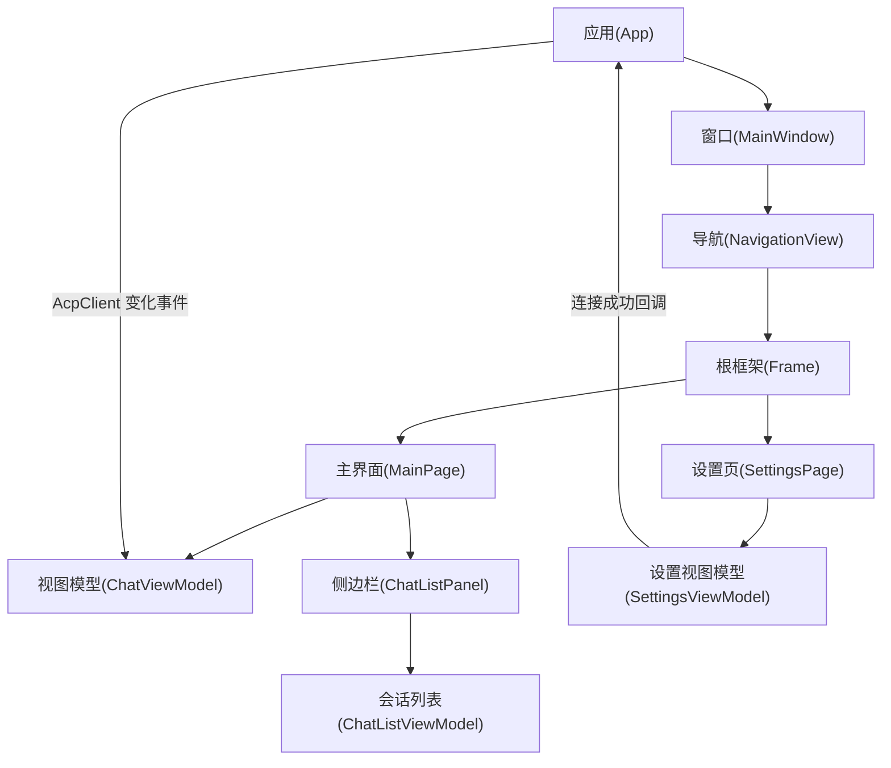
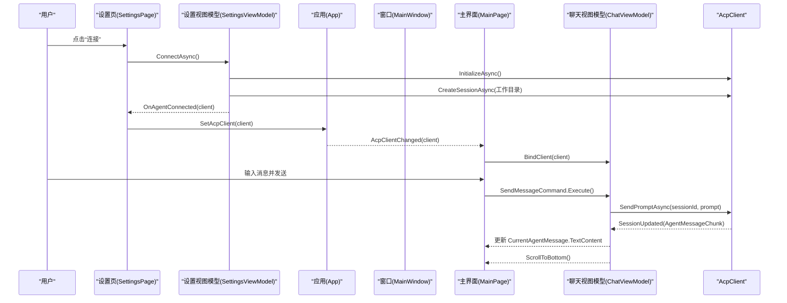
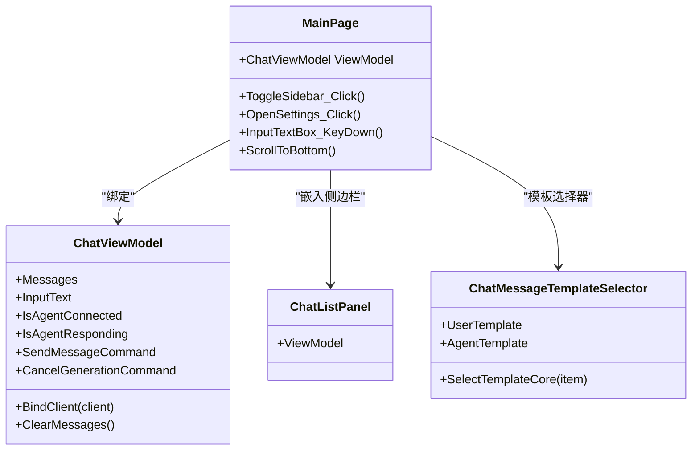
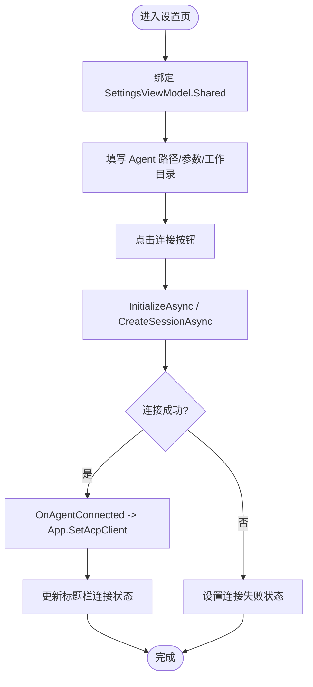
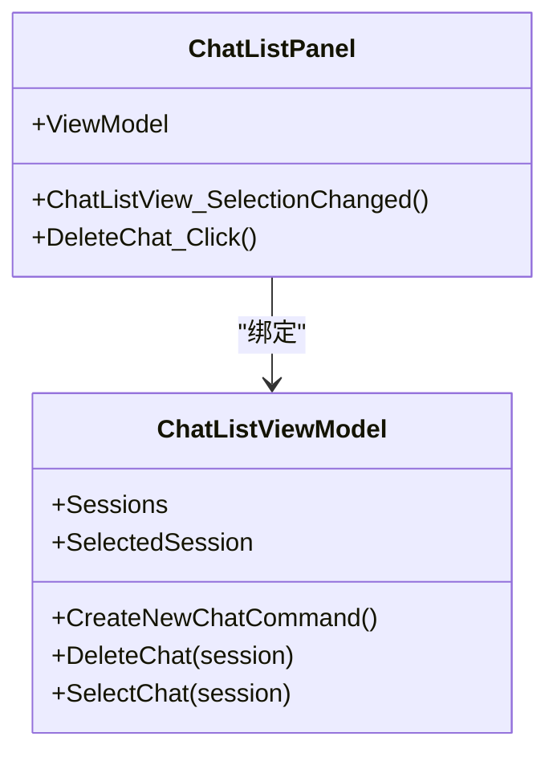
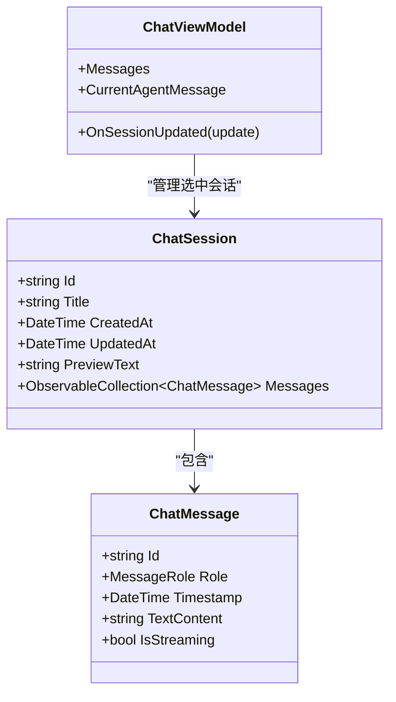
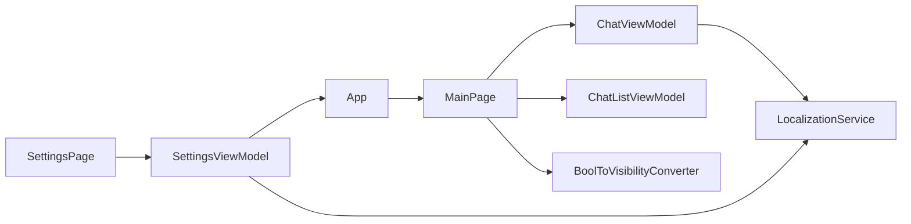

# 主界面

<cite>
**本文引用的文件**   
- [MainPage.xaml](file://Agentic.Desktop/MainPage.xaml)
- [MainPage.xaml.cs](file://Agentic.Desktop/MainPage.xaml.cs)
- [SettingsPage.xaml](file://Agentic.Desktop/SettingsPage.xaml)
- [SettingsPage.xaml.cs](file://Agentic.Desktop/SettingsPage.xaml.cs)
- [MainWindow.xaml](file://Agentic.Desktop/MainWindow.xaml)
- [MainWindow.xaml.cs](file://Agentic.Desktop/MainWindow.xaml.cs)
- [App.xaml.cs](file://Agentic.Desktop/App.xaml.cs)
- [ChatViewModel.cs](file://Agentic.Desktop/ViewModels/ChatViewModel.cs)
- [SettingsViewModel.cs](file://Agentic.Desktop/ViewModels/SettingsViewModel.cs)
- [ChatListViewModel.cs](file://Agentic.Desktop/ViewModels/ChatListViewModel.cs)
- [ChatMessage.cs](file://Agentic.Desktop/ViewModels/Messages/ChatMessage.cs)
- [ChatSession.cs](file://Agentic.Desktop/ViewModels/Messages/ChatSession.cs)
- [ChatListPanel.xaml](file://Agentic.Desktop/Views/ChatListPanel.xaml)
- [BoolToVisibilityConverter.cs](file://Agentic.Desktop/Converters/BoolToVisibilityConverter.cs)
- [LocalizationService.cs](file://Agentic.Desktop/Services/LocalizationService.cs)
</cite>

## 目录
1. [简介](#简介)
2. [项目结构](#项目结构)
3. [核心组件](#核心组件)
4. [架构总览](#架构总览)
5. [详细组件分析](#详细组件分析)
6. [依赖关系分析](#依赖关系分析)
7. [性能考虑](#性能考虑)
8. [故障排查指南](#故障排查指南)
9. [结论](#结论)
10. [附录](#附录)

## 简介
本文件详细说明 Agentic.Desktop 的主界面 MainPage 的实现与用户交互逻辑，涵盖 XAML 布局、聊天面板与设置面板的集成方式、MVVM 数据绑定与命令模式、页面导航流程、生命周期管理与资源清理、主题与自定义支持，以及错误处理与用户反馈机制。目标是帮助开发者快速理解并扩展主界面的行为。

## 项目结构
- 窗口与导航
  - MainWindow 使用 NavigationView 承载根 Frame，默认导航到 MainPage；底部菜单项可切换到 SettingsPage。
- 主界面
  - MainPage 使用 SplitView 组织侧边栏（聊天列表）与内容区（消息流与输入框）。
  - 通过 x:Bind 将 UI 与 ChatViewModel 进行双向/单向绑定。
- 设置页
  - SettingsPage 负责 Agent 路径、参数与工作目录配置，提供连接/断开控制，并在连接成功后将 AcpClient 注入全局状态，通知 MainPage 更新。
- ViewModel 层
  - ChatViewModel：管理会话、消息流、发送/取消命令、与 AcpClient 的事件订阅。
  - SettingsViewModel：单例共享，管理连接生命周期、状态与回调。
  - ChatListViewModel：维护会话集合与选中会话，驱动侧边栏。
- 数据模型
  - ChatMessage、ChatSession：封装消息与会话数据，基于 ObservableObject 实现属性变更通知。
- 转换器与服务
  - BoolToVisibilityConverter：布尔到可见性的转换。
  - LocalizationService：本地化字符串读取。

**图表来源** 
- [MainWindow.xaml:1-70](file://Agentic.Desktop/MainWindow.xaml#L1-L70)
- [MainWindow.xaml.cs:1-97](file://Agentic.Desktop/MainWindow.xaml.cs#L1-L97)
- [MainPage.xaml:1-163](file://Agentic.Desktop/MainPage.xaml#L1-L163)
- [MainPage.xaml.cs:1-105](file://Agentic.Desktop/MainPage.xaml.cs#L1-L105)
- [SettingsPage.xaml:1-121](file://Agentic.Desktop/SettingsPage.xaml#L1-L121)
- [SettingsPage.xaml.cs:1-96](file://Agentic.Desktop/SettingsPage.xaml.cs#L1-L96)
- [App.xaml.cs:1-85](file://Agentic.Desktop/App.xaml.cs#L1-L85)
- [ChatViewModel.cs:1-237](file://Agentic.Desktop/ViewModels/ChatViewModel.cs#L1-L237)
- [SettingsViewModel.cs:1-162](file://Agentic.Desktop/ViewModels/SettingsViewModel.cs#L1-L162)
- [ChatListViewModel.cs:1-64](file://Agentic.Desktop/ViewModels/ChatListViewModel.cs#L1-L64)

**章节来源**
- [MainWindow.xaml:1-70](file://Agentic.Desktop/MainWindow.xaml#L1-L70)
- [MainWindow.xaml.cs:1-97](file://Agentic.Desktop/MainWindow.xaml.cs#L1-L97)
- [MainPage.xaml:1-163](file://Agentic.Desktop/MainPage.xaml#L1-L163)
- [MainPage.xaml.cs:1-105](file://Agentic.Desktop/MainPage.xaml.cs#L1-L105)
- [SettingsPage.xaml:1-121](file://Agentic.Desktop/SettingsPage.xaml#L1-L121)
- [SettingsPage.xaml.cs:1-96](file://Agentic.Desktop/SettingsPage.xaml.cs#L1-L96)
- [App.xaml.cs:1-85](file://Agentic.Desktop/App.xaml.cs#L1-L85)

## 核心组件
- MainPage
  - 使用 SplitView 组织侧边栏与内容区；内容区包含消息滚动区域与输入区。
  - 通过 x:Bind 绑定 ViewModel.Messages、InputText、IsAgentConnected、IsAgentResponding 等属性。
  - 使用 DataTemplateSelector 区分用户消息与 Agent 消息模板。
  - 监听 ScrollToBottom 事件，在消息变更后自动滚动到底部。
  - 提供“打开设置”按钮，调用主窗口的导航方法跳转到设置页。
- SettingsPage
  - 绑定 SettingsViewModel.Shared，确保跨页面导航时连接状态不丢失。
  - 连接成功后创建权限处理器与文件系统处理器，并设置到 AcpClient。
  - 通过回调更新标题栏连接状态，并将 AcpClient 写入全局 App.CurrentAcpClient。
- ChatViewModel
  - 管理当前会话的消息集合、输入文本、响应状态。
  - 通过 RelayCommand 暴露 SendMessage 与 CancelGeneration 命令。
  - 订阅 AcpClient.SessionUpdated，采用帧级合并策略批量更新 UI，避免频繁刷新。
  - 断连时清空消息并重置连接状态。
- ChatListViewModel
  - 维护会话集合与选中会话，提供新建、删除、选择会话的命令。
  - 当选中会话变化时触发 SessionChanged 事件，用于切换消息源。
- 数据模型
  - ChatMessage：消息角色、时间戳、文本内容与流式标记。
  - ChatSession：会话标题、预览文本、创建/更新时间与消息集合。

**章节来源**
- [MainPage.xaml:1-163](file://Agentic.Desktop/MainPage.xaml#L1-L163)
- [MainPage.xaml.cs:1-105](file://Agentic.Desktop/MainPage.xaml.cs#L1-L105)
- [SettingsPage.xaml:1-121](file://Agentic.Desktop/SettingsPage.xaml#L1-L121)
- [SettingsPage.xaml.cs:1-96](file://Agentic.Desktop/SettingsPage.xaml.cs#L1-L96)
- [ChatViewModel.cs:1-237](file://Agentic.Desktop/ViewModels/ChatViewModel.cs#L1-L237)
- [ChatListViewModel.cs:1-64](file://Agentic.Desktop/ViewModels/ChatListViewModel.cs#L1-L64)
- [ChatMessage.cs:1-39](file://Agentic.Desktop/ViewModels/Messages/ChatMessage.cs#L1-L39)
- [ChatSession.cs:1-28](file://Agentic.Desktop/ViewModels/Messages/ChatSession.cs#L1-L28)

## 架构总览
下图展示从设置页连接到主界面消息流的完整序列，包括 AcpClient 初始化、会话创建、事件回调与 UI 更新。

**图表来源** 
- [SettingsPage.xaml.cs:1-96](file://Agentic.Desktop/SettingsPage.xaml.cs#L1-L96)
- [SettingsViewModel.cs:1-162](file://Agentic.Desktop/ViewModels/SettingsViewModel.cs#L1-L162)
- [App.xaml.cs:1-85](file://Agentic.Desktop/App.xaml.cs#L1-L85)
- [MainPage.xaml.cs:1-105](file://Agentic.Desktop/MainPage.xaml.cs#L1-L105)
- [ChatViewModel.cs:1-237](file://Agentic.Desktop/ViewModels/ChatViewModel.cs#L1-L237)

## 详细组件分析

### MainPage 主界面分析
- 布局与控件组织
  - SplitView 作为容器，Pane 放置 ChatListPanel，Content 放置消息滚动区与输入区。
  - ItemsRepeater 绑定 ViewModel.Messages，使用 ChatMessageTemplateSelector 根据角色选择模板。
  - 未连接时显示提示面板，包含“打开设置”按钮。
- 数据绑定与 MVVM
  - InputText 双向绑定到 ViewModel.InputText，SendButton 与 CancelGeneration 按钮绑定命令。
  - IsAgentConnected 控制输入框与发送按钮可用性；IsAgentResponding 控制取消按钮可见性。
- 用户交互流程
  - Enter 键触发发送命令；侧边栏切换按钮控制 SplitView.IsPaneOpen。
  - “打开设置”按钮调用主窗口 NavigateToSettings。
- 生命周期与资源清理
  - 构造函数中订阅 App.AcpClientChanged 与 ViewModel.ScrollToBottom。
  - 断连时清空消息并重置连接状态。
- 主题与自定义
  - 使用 ThemeResource 与 Fluent 样式，支持系统主题与深色/浅色切换。
  - 自定义 DataTemplate 与 Converter 实现差异化渲染与可见性控制。

**图表来源** 
- [MainPage.xaml:1-163](file://Agentic.Desktop/MainPage.xaml#L1-L163)
- [MainPage.xaml.cs:1-105](file://Agentic.Desktop/MainPage.xaml.cs#L1-L105)
- [ChatViewModel.cs:1-237](file://Agentic.Desktop/ViewModels/ChatViewModel.cs#L1-L237)

**章节来源**
- [MainPage.xaml:1-163](file://Agentic.Desktop/MainPage.xaml#L1-L163)
- [MainPage.xaml.cs:1-105](file://Agentic.Desktop/MainPage.xaml.cs#L1-L105)

### 设置页与导航逻辑
- 设置页职责
  - 绑定 SettingsViewModel.Shared，提供 Agent 路径、参数与工作目录输入。
  - 连接成功后创建权限处理器与文件系统处理器，设置到 AcpClient。
  - 通过回调更新标题栏连接状态，并将 AcpClient 写入全局 App.CurrentAcpClient。
- 导航逻辑
  - MainPage 的“打开设置”按钮调用 MainWindow.NavigateToSettings，切换 NavigationView 选中项并导航到 SettingsPage。
  - MainWindow 默认加载 MainPage，NavigationView 的 SelectionChanged 控制页面切换。

**图表来源** 
- [SettingsPage.xaml:1-121](file://Agentic.Desktop/SettingsPage.xaml#L1-L121)
- [SettingsPage.xaml.cs:1-96](file://Agentic.Desktop/SettingsPage.xaml.cs#L1-L96)
- [SettingsViewModel.cs:1-162](file://Agentic.Desktop/ViewModels/SettingsViewModel.cs#L1-L162)
- [MainWindow.xaml.cs:1-97](file://Agentic.Desktop/MainWindow.xaml.cs#L1-L97)

**章节来源**
- [SettingsPage.xaml:1-121](file://Agentic.Desktop/SettingsPage.xaml#L1-L121)
- [SettingsPage.xaml.cs:1-96](file://Agentic.Desktop/SettingsPage.xaml.cs#L1-L96)
- [MainWindow.xaml.cs:1-97](file://Agentic.Desktop/MainWindow.xaml.cs#L1-L97)

### 聊天列表与侧边栏
- ChatListPanel
  - 绑定 ChatListViewModel.Sessions 与 SelectedSession，提供新建与删除会话操作。
  - 删除会话后自动选择相邻会话或新建会话，保证列表始终可用。
- 数据绑定
  - ListView 的 ItemTemplate 使用 ChatSession 的数据模板，显示标题与预览文本。
  - 删除按钮通过 Click 事件调用 ViewModel.DeleteChat。

**图表来源** 
- [ChatListPanel.xaml:1-88](file://Agentic.Desktop/Views/ChatListPanel.xaml#L1-L88)
- [ChatListViewModel.cs:1-64](file://Agentic.Desktop/ViewModels/ChatListViewModel.cs#L1-L64)

**章节来源**
- [ChatListPanel.xaml:1-88](file://Agentic.Desktop/Views/ChatListPanel.xaml#L1-L88)
- [ChatListViewModel.cs:1-64](file://Agentic.Desktop/ViewModels/ChatListViewModel.cs#L1-L64)

### 数据模型与消息流
- ChatMessage
  - 包含 Id、Role、Timestamp、TextContent、IsStreaming 等属性，支持流式更新。
- ChatSession
  - 包含 Id、Title、CreatedAt、UpdatedAt、PreviewText 与 Messages 集合。
- 消息流
  - ChatViewModel.OnSessionUpdated 对 AgentMessageChunk 进行帧级合并，批量更新 CurrentAgentMessage.TextContent。
  - ToolCallNotification 插入系统消息并更新会话预览。

**图表来源** 
- [ChatMessage.cs:1-39](file://Agentic.Desktop/ViewModels/Messages/ChatMessage.cs#L1-L39)
- [ChatSession.cs:1-28](file://Agentic.Desktop/ViewModels/Messages/ChatSession.cs#L1-L28)
- [ChatViewModel.cs:1-237](file://Agentic.Desktop/ViewModels/ChatViewModel.cs#L1-L237)

**章节来源**
- [ChatMessage.cs:1-39](file://Agentic.Desktop/ViewModels/Messages/ChatMessage.cs#L1-L39)
- [ChatSession.cs:1-28](file://Agentic.Desktop/ViewModels/Messages/ChatSession.cs#L1-L28)
- [ChatViewModel.cs:1-237](file://Agentic.Desktop/ViewModels/ChatViewModel.cs#L1-L237)

## 依赖关系分析
- 页面与视图模型
  - MainPage 依赖 ChatViewModel 与 ChatListViewModel；SettingsPage 依赖 SettingsViewModel.Shared。
- 应用全局状态
  - App.CurrentAcpClient 与 AcpClientChanged 事件用于跨页面共享连接状态。
- 转换器与服务
  - BoolToVisibilityConverter 用于可见性控制；LocalizationService 提供本地化字符串。

**图表来源** 
- [MainPage.xaml.cs:1-105](file://Agentic.Desktop/MainPage.xaml.cs#L1-L105)
- [SettingsPage.xaml.cs:1-96](file://Agentic.Desktop/SettingsPage.xaml.cs#L1-L96)
- [App.xaml.cs:1-85](file://Agentic.Desktop/App.xaml.cs#L1-L85)
- [BoolToVisibilityConverter.cs:1-28](file://Agentic.Desktop/Converters/BoolToVisibilityConverter.cs#L1-L28)
- [LocalizationService.cs:1-23](file://Agentic.Desktop/Services/LocalizationService.cs#L1-L23)

**章节来源**
- [MainPage.xaml.cs:1-105](file://Agentic.Desktop/MainPage.xaml.cs#L1-L105)
- [SettingsPage.xaml.cs:1-96](file://Agentic.Desktop/SettingsPage.xaml.cs#L1-L96)
- [App.xaml.cs:1-85](file://Agentic.Desktop/App.xaml.cs#L1-L85)
- [BoolToVisibilityConverter.cs:1-28](file://Agentic.Desktop/Converters/BoolToVisibilityConverter.cs#L1-L28)
- [LocalizationService.cs:1-23](file://Agentic.Desktop/Services/LocalizationService.cs#L1-L23)

## 性能考虑
- 帧级合并与批处理
  - ChatViewModel 对 AgentMessageChunk 进行 50ms 批处理，减少 UI 刷新频率，提升流畅度。
- 滚动优化
  - 使用 DispatcherQueue.TryEnqueue 在布局完成后滚动到底部，避免阻塞 UI 线程。
- 资源清理
  - SettingsViewModel.CleanupAsync 释放 AcpClient 与 TerminalManager，防止内存泄漏。
- 模板选择器
  - ChatMessageTemplateSelector 按角色选择模板，避免条件判断开销。

[本节为通用性能建议，无需特定文件引用]

## 故障排查指南
- 连接失败
  - 检查 SettingsViewModel.ConnectAsync 异常分支，确认 ConnectionStatus 是否更新为失败信息。
  - 确认 AgentPath 与参数是否正确，或使用 Mock 传输进行测试。
- 消息不更新
  - 检查 ChatViewModel.OnSessionUpdated 是否被触发，确认 CurrentAgentMessage 是否为空。
  - 确认 ScrollToBottom 事件是否订阅成功。
- 权限请求无响应
  - 检查 SettingsPage 中 PermissionHandler 的订阅与对话框结果回传。
- 主题与可见性问题
  - 检查 BoolToVisibilityConverter 的 Invert 参数是否正确使用。
  - 确认 ThemeResource 与 Fluent 样式是否生效。

**章节来源**
- [SettingsViewModel.cs:1-162](file://Agentic.Desktop/ViewModels/SettingsViewModel.cs#L1-L162)
- [ChatViewModel.cs:1-237](file://Agentic.Desktop/ViewModels/ChatViewModel.cs#L1-L237)
- [SettingsPage.xaml.cs:1-96](file://Agentic.Desktop/SettingsPage.xaml.cs#L1-L96)
- [BoolToVisibilityConverter.cs:1-28](file://Agentic.Desktop/Converters/BoolToVisibilityConverter.cs#L1-L28)

## 结论
MainPage 通过 SplitView 与 x:Bind 实现了清晰的 MVVM 架构，结合 ChatViewModel 与 SettingsViewModel 的职责分离，提供了良好的可扩展性与可维护性。设置页与主界面通过 App 全局状态与事件机制协同工作，确保连接状态一致。帧级合并与批处理策略提升了 UI 性能，主题与转换器支持了灵活的界面定制。整体设计符合现代桌面应用的交互与架构要求。

[本节为总结性内容，无需特定文件引用]

## 附录
- 主题与自定义
  - 使用 ThemeResource 与 Fluent 样式，支持系统主题切换。
  - 可通过替换 DataTemplate 与 Converter 实现个性化渲染。
- 本地化
  - LocalizationService 统一读取 .resw 资源文件，支持多语言。
- 最佳实践
  - 保持 ViewModel 单例或共享实例，避免跨页面状态丢失。
  - 使用 RelayCommand 暴露命令，避免在代码隐藏中编写业务逻辑。
  - 合理订阅与取消订阅事件，防止内存泄漏。

[本节为通用指导，无需特定文件引用]