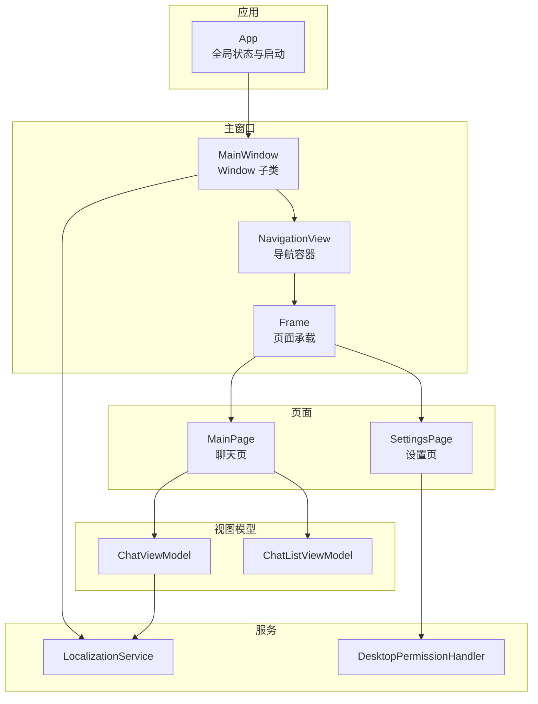
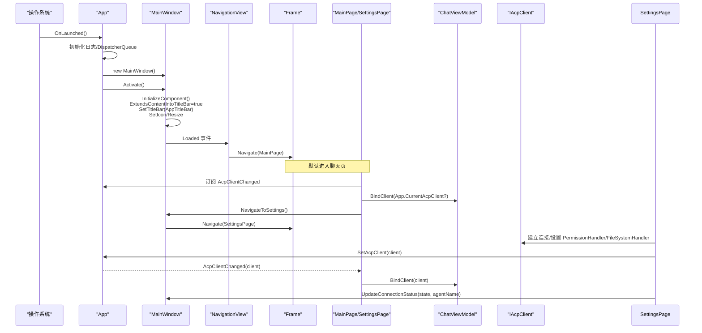
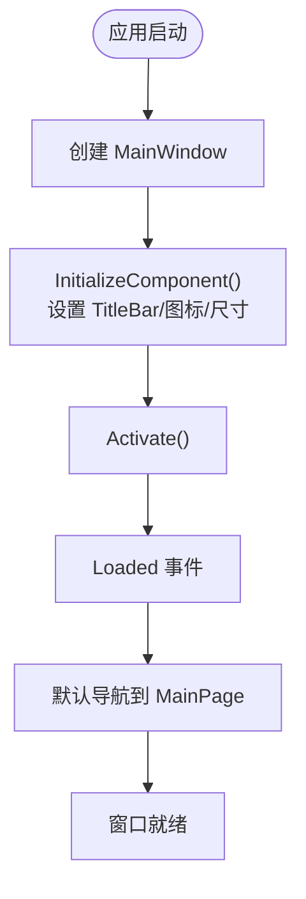
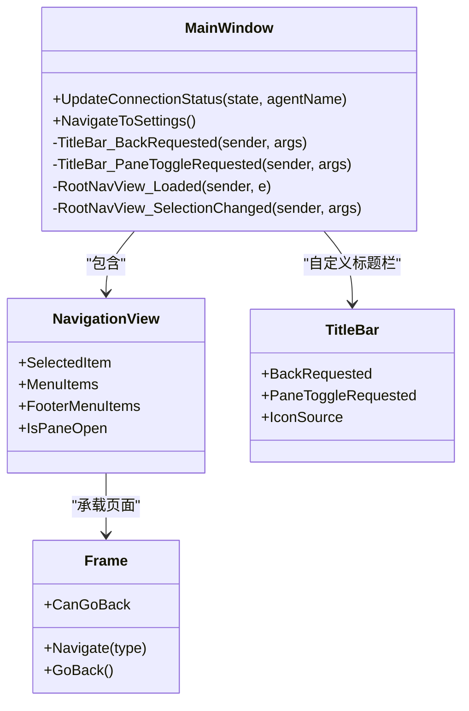
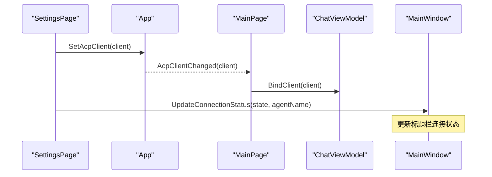
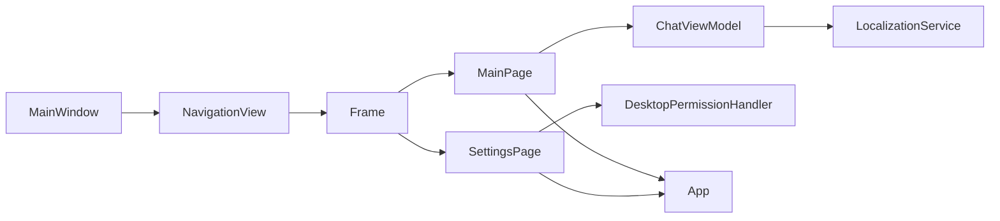

# 主窗口框架

<cite>
**本文引用的文件**   
- [MainWindow.xaml](file://Agentic.Desktop/MainWindow.xaml)
- [MainWindow.xaml.cs](file://Agentic.Desktop/MainWindow.xaml.cs)
- [App.xaml](file://Agentic.Desktop/App.xaml)
- [App.xaml.cs](file://Agentic.Desktop/App.xaml.cs)
- [MainPage.xaml.cs](file://Agentic.Desktop/MainPage.xaml.cs)
- [SettingsPage.xaml.cs](file://Agentic.Desktop/SettingsPage.xaml.cs)
- [ChatViewModel.cs](file://Agentic.Desktop/ViewModels/ChatViewModel.cs)
- [ChatListViewModel.cs](file://Agentic.Desktop/ViewModels/ChatListViewModel.cs)
- [PermissionHandler.cs](file://Agentic.Desktop/Services/PermissionHandler.cs)
- [LocalizationService.cs](file://Agentic.Desktop/Services/LocalizationService.cs)
- [ChatListPanel.xaml](file://Agentic.Desktop/Views/ChatListPanel.xaml)
</cite>

## 目录
1. [简介](#简介)
2. [项目结构](#项目结构)
3. [核心组件](#核心组件)
4. [架构总览](#架构总览)
5. [详细组件分析](#详细组件分析)
6. [依赖关系分析](#依赖关系分析)
7. [性能考虑](#性能考虑)
8. [故障排查指南](#故障排查指南)
9. [结论](#结论)
10. [附录](#附录)

## 简介
本文件围绕 UWP/WinUI 桌面应用的 MainWindow 主窗口实现与导航框架进行系统化说明，涵盖 Window 基类继承、窗口生命周期管理、布局结构与页面导航机制、窗口属性配置（标题、图标、最小化/最大化按钮）、响应式布局与大小调整、与 App 全局状态交互（特别是 CurrentAcpClient 的使用）、事件处理与用户交互示例，以及窗口关闭与资源清理的最佳实践。文档以代码级为依据，配合图示帮助读者快速理解整体设计与关键流程。

## 项目结构
本项目采用 WinUI 3 的 XAML + C# 组合方式组织 UI 与逻辑：
- 应用入口与全局状态：App.xaml / App.xaml.cs
- 主窗口与导航容器：MainWindow.xaml / MainWindow.xaml.cs
- 页面与视图模型：MainPage.xaml.cs、SettingsPage.xaml.cs、ViewModels/*
- 服务与工具：Services/*（权限、本地化等）
- 子视图与模板：Views/*、Converters/*

图表来源
- [App.xaml.cs:64-76](file://Agentic.Desktop/App.xaml.cs#L64-L76)
- [MainWindow.xaml:15-68](file://Agentic.Desktop/MainWindow.xaml#L15-L68)
- [MainWindow.xaml.cs:65-87](file://Agentic.Desktop/MainWindow.xaml.cs#L65-L87)
- [MainPage.xaml.cs:16-34](file://Agentic.Desktop/MainPage.xaml.cs#L16-L34)
- [SettingsPage.xaml.cs:15-59](file://Agentic.Desktop/SettingsPage.xaml.cs#L15-L59)
- [ChatViewModel.cs:11-47](file://Agentic.Desktop/ViewModels/ChatViewModel.cs#L11-L47)
- [ChatListViewModel.cs:17-28](file://Agentic.Desktop/ViewModels/ChatListViewModel.cs#L17-L28)
- [PermissionHandler.cs:26-44](file://Agentic.Desktop/Services/PermissionHandler.cs#L26-L44)
- [LocalizationService.cs:10-22](file://Agentic.Desktop/Services/LocalizationService.cs#L10-L22)

章节来源
- [App.xaml:1-17](file://Agentic.Desktop/App.xaml#L1-L17)
- [App.xaml.cs:1-85](file://Agentic.Desktop/App.xaml.cs#L1-L85)
- [MainWindow.xaml:1-70](file://Agentic.Desktop/MainWindow.xaml#L1-L70)
- [MainWindow.xaml.cs:1-97](file://Agentic.Desktop/MainWindow.xaml.cs#L1-L97)

## 核心组件
- App：应用启动、全局 DispatcherQueue、当前 AcpClient、窗口句柄、日志工厂等；负责创建并激活 MainWindow。
- MainWindow：继承自 Window，承载 TitleBar 与 NavigationView，管理页面导航与连接状态显示。
- MainPage：聊天主界面，绑定 ChatViewModel，订阅 App.AcpClientChanged，支持键盘发送消息、侧边栏切换、滚动到底部。
- SettingsPage：设置与连接管理，设置 IAcpClient 到 App.CurrentAcpClient，更新窗口连接状态，处理权限请求与文件系统处理器。
- ChatViewModel：聊天会话与消息流管理，绑定 AcpClient，处理消息发送、流式合并、取消生成、Mock 模拟。
- ChatListViewModel：会话列表管理，新增/删除/选择会话。
- DesktopPermissionHandler：将 Agent 权限请求桥接到 UI 对话框。
- LocalizationService：提供多语言字符串获取与格式化。

章节来源
- [App.xaml.cs:18-85](file://Agentic.Desktop/App.xaml.cs#L18-L85)
- [MainWindow.xaml.cs:10-97](file://Agentic.Desktop/MainWindow.xaml.cs#L10-L97)
- [MainPage.xaml.cs:9-81](file://Agentic.Desktop/MainPage.xaml.cs#L9-L81)
- [SettingsPage.xaml.cs:10-96](file://Agentic.Desktop/SettingsPage.xaml.cs#L10-L96)
- [ChatViewModel.cs:11-237](file://Agentic.Desktop/ViewModels/ChatViewModel.cs#L11-L237)
- [ChatListViewModel.cs:8-64](file://Agentic.Desktop/ViewModels/ChatListViewModel.cs#L8-L64)
- [PermissionHandler.cs:11-52](file://Agentic.Desktop/Services/PermissionHandler.cs#L11-L52)
- [LocalizationService.cs:8-23](file://Agentic.Desktop/Services/LocalizationService.cs#L8-L23)

## 架构总览
下图展示从应用启动到主窗口加载、默认页面导航、以及设置页建立连接后更新全局状态的完整时序。

图表来源
- [App.xaml.cs:64-76](file://Agentic.Desktop/App.xaml.cs#L64-L76)
- [MainWindow.xaml.cs:16-27](file://Agentic.Desktop/MainWindow.xaml.cs#L16-L27)
- [MainWindow.xaml.cs:65-70](file://Agentic.Desktop/MainWindow.xaml.cs#L65-L70)
- [MainPage.xaml.cs:26-34](file://Agentic.Desktop/MainPage.xaml.cs#L26-L34)
- [SettingsPage.xaml.cs:19-59](file://Agentic.Desktop/SettingsPage.xaml.cs#L19-L59)
- [MainWindow.xaml.cs:90-95](file://Agentic.Desktop/MainWindow.xaml.cs#L90-L95)

## 详细组件分析

### Window 基类与窗口生命周期
- MainWindow 继承自 Window，通过 XAML 定义根布局与 TitleBar，并在构造函数中完成以下初始化：
  - 扩展内容到标题栏并设置自定义 TitleBar
  - 设置窗口图标与初始尺寸
- 生命周期关键点：
  - App.OnLaunched 中创建并激活 MainWindow
  - MainWindow 构造完成后由系统触发 Loaded 事件，用于默认导航到首页
  - 窗口关闭时建议释放订阅、清空引用，避免内存泄漏

图表来源
- [App.xaml.cs:64-76](file://Agentic.Desktop/App.xaml.cs#L64-L76)
- [MainWindow.xaml.cs:16-27](file://Agentic.Desktop/MainWindow.xaml.cs#L16-L27)
- [MainWindow.xaml.cs:65-70](file://Agentic.Desktop/MainWindow.xaml.cs#L65-L70)

章节来源
- [App.xaml.cs:64-76](file://Agentic.Desktop/App.xaml.cs#L64-L76)
- [MainWindow.xaml.cs:16-27](file://Agentic.Desktop/MainWindow.xaml.cs#L16-L27)

### 主窗口布局与导航机制
- 布局结构：
  - Grid 两行：第一行为 Auto 高度的 TitleBar，第二行为 * 占满剩余空间的 NavigationView
  - TitleBar 内嵌连接状态指示器（圆点+文本），支持返回与侧边栏切换
  - NavigationView 左侧菜单项“聊天”，底部菜单项“设置”
  - Frame 作为页面容器，根据选中项导航到对应 Page
- 导航逻辑：
  - RootNavView_Loaded：默认选中第一个菜单项并导航到 MainPage
  - RootNavView_SelectionChanged：根据 Tag 值在 MainPage 与 SettingsPage 之间切换
  - NavigateToSettings：通过 FooterMenuItems 定位“设置”项并选中，触发导航

图表来源
- [MainWindow.xaml:15-68](file://Agentic.Desktop/MainWindow.xaml#L15-L68)
- [MainWindow.xaml.cs:65-87](file://Agentic.Desktop/MainWindow.xaml.cs#L65-L87)
- [MainWindow.xaml.cs:90-95](file://Agentic.Desktop/MainWindow.xaml.cs#L90-L95)

章节来源
- [MainWindow.xaml:15-68](file://Agentic.Desktop/MainWindow.xaml#L15-L68)
- [MainWindow.xaml.cs:65-87](file://Agentic.Desktop/MainWindow.xaml.cs#L65-L87)

### 窗口属性配置（标题、图标、最小化/最大化）
- 标题与图标：
  - XAML 中设置 Title 与 TitleBar.IconSource
  - 代码中通过 AppWindow.SetIcon 设置任务栏图标
- 最小化/最大化按钮：
  - 使用默认 Window 行为，未显式禁用，因此保留最小化/最大化/关闭按钮
- 扩展标题栏：
  - ExtendsContentIntoTitleBar = true，并通过 SetTitleBar 指定自定义 TitleBar
- 窗口尺寸：
  - 构造中调用 AppWindow.Resize 设置初始大小

章节来源
- [MainWindow.xaml:21-28](file://Agentic.Desktop/MainWindow.xaml#L21-L28)
- [MainWindow.xaml.cs:20-26](file://Agentic.Desktop/MainWindow.xaml.cs#L20-L26)

### 响应式布局与大小调整
- 使用 Grid 的行高 Auto/* 自适应高度变化
- TitleBar 与 NavigationView 随窗口尺寸自动重排
- 建议在 Resize 事件中监听窗口尺寸变化，动态调整布局或字体大小（如需）
- 当前实现未显式处理 SizeChanged，但基础布局已具备一定响应性

章节来源
- [MainWindow.xaml:15-20](file://Agentic.Desktop/MainWindow.xaml#L15-L20)

### 与 App 全局状态交互（CurrentAcpClient）
- App 暴露：
  - CurrentAcpClient：当前连接的 IAcpClient
  - AcpClientChanged：连接状态变更事件
  - SetAcpClient：设置客户端并触发事件
  - Window/WindowHandle/DispatcherQueue：供 UI 与 WinRT 互操作使用
- MainPage：
  - 构造时若已有 CurrentAcpClient，立即绑定到 ViewModel
  - 订阅 AcpClientChanged，连接时绑定，断开时清空消息
- SettingsPage：
  - 连接成功后调用 App.SetAcpClient 保存客户端
  - 断开时设置为 null，并更新 UI 状态
- MainWindow：
  - UpdateConnectionStatus：根据连接状态更新标题栏指示器

图表来源
- [App.xaml.cs:44-83](file://Agentic.Desktop/App.xaml.cs#L44-L83)
- [MainPage.xaml.cs:26-34](file://Agentic.Desktop/MainPage.xaml.cs#L26-L34)
- [SettingsPage.xaml.cs:19-59](file://Agentic.Desktop/SettingsPage.xaml.cs#L19-L59)
- [MainWindow.xaml.cs:30-50](file://Agentic.Desktop/MainWindow.xaml.cs#L30-L50)

章节来源
- [App.xaml.cs:44-83](file://Agentic.Desktop/App.xaml.cs#L44-L83)
- [MainPage.xaml.cs:26-34](file://Agentic.Desktop/MainPage.xaml.cs#L26-L34)
- [SettingsPage.xaml.cs:19-59](file://Agentic.Desktop/SettingsPage.xaml.cs#L19-L59)
- [MainWindow.xaml.cs:30-50](file://Agentic.Desktop/MainWindow.xaml.cs#L30-L50)

### 页面导航与用户交互示例
- 导航到设置页：
  - MainPage 通过 App.Window 获取 MainWindow 并调用 NavigateToSettings
- 输入框回车发送消息：
  - MainPage 监听 KeyDown，Enter 键触发 ViewModel.SendMessageCommand
- 侧边栏切换：
  - MainPage 切换 ChatSplitView.IsPaneOpen
- 标题栏返回与侧边栏切换：
  - MainWindow 的 TitleBar 事件分别调用 RootFrame.GoBack 与切换 IsPaneOpen

章节来源
- [MainPage.xaml.cs:49-70](file://Agentic.Desktop/MainPage.xaml.cs#L49-L70)
- [MainWindow.xaml.cs:52-63](file://Agentic.Desktop/MainWindow.xaml.cs#L52-L63)

### 窗口关闭与资源清理最佳实践
- 建议做法：
  - 在 Unloaded/Closing 中取消 ViewModel 的事件订阅（如 ScrollToBottom、SessionChanged、AcpClientChanged）
  - 清空对 IAcpClient 的引用，避免循环引用
  - 释放非托管资源（如文件句柄、网络流）
  - 确保 UI 线程上的异步任务安全退出（TryEnqueue 前检查窗口有效性）
- 当前实现注意点：
  - SettingsPage 在 Unloaded 中移除 PropertyChanged 订阅，避免重复订阅
  - ChatViewModel 在会话切换时取消旧集合订阅，防止内存泄漏

章节来源
- [SettingsPage.xaml.cs:56-59](file://Agentic.Desktop/SettingsPage.xaml.cs#L56-L59)
- [ChatViewModel.cs:52-74](file://Agentic.Desktop/ViewModels/ChatViewModel.cs#L52-L74)

## 依赖关系分析
- 组件耦合：
  - MainWindow 依赖 NavigationView 与 Frame 进行页面导航
  - MainPage 依赖 App 的全局状态与 ChatViewModel
  - SettingsPage 依赖 App 的全局状态与权限/文件系统服务
  - ChatViewModel 依赖 IAcpClient 与 LocalizationService
- 外部依赖：
  - Microsoft.UI.Xaml（WinUI 3）
  - Agentic.ACPLibrary.Client（IAcpClient）
  - Windows.Storage.Pickers（文件夹选择器）
  - WinRT.Interop（HWND 初始化）

图表来源
- [MainWindow.xaml:44-67](file://Agentic.Desktop/MainWindow.xaml#L44-L67)
- [MainPage.xaml.cs:16-34](file://Agentic.Desktop/MainPage.xaml.cs#L16-L34)
- [SettingsPage.xaml.cs:19-59](file://Agentic.Desktop/SettingsPage.xaml.cs#L19-L59)
- [ChatViewModel.cs:11-47](file://Agentic.Desktop/ViewModels/ChatViewModel.cs#L11-L47)
- [PermissionHandler.cs:26-44](file://Agentic.Desktop/Services/PermissionHandler.cs#L26-L44)

章节来源
- [MainWindow.xaml:44-67](file://Agentic.Desktop/MainWindow.xaml#L44-L67)
- [MainPage.xaml.cs:16-34](file://Agentic.Desktop/MainPage.xaml.cs#L16-L34)
- [SettingsPage.xaml.cs:19-59](file://Agentic.Desktop/SettingsPage.xaml.cs#L19-L59)
- [ChatViewModel.cs:11-47](file://Agentic.Desktop/ViewModels/ChatViewModel.cs#L11-L47)
- [PermissionHandler.cs:26-44](file://Agentic.Desktop/Services/PermissionHandler.cs#L26-L44)

## 性能考虑
- 流式消息合并：
  - ChatViewModel 对 AgentMessageChunk 进行批处理（50ms 延迟合并），减少 UI 刷新频率
- UI 线程调度：
  - 使用 DispatcherQueue.TryEnqueue 确保 UI 更新在主线程执行
- 集合变更订阅：
  - 在会话切换时及时取消旧订阅，避免不必要的通知开销
- 资源占用：
  - 断开连接时清空消息与引用，降低内存占用

章节来源
- [ChatViewModel.cs:153-206](file://Agentic.Desktop/ViewModels/ChatViewModel.cs#L153-L206)
- [ChatViewModel.cs:52-74](file://Agentic.Desktop/ViewModels/ChatViewModel.cs#L52-L74)

## 故障排查指南
- 连接状态不更新：
  - 检查 SettingsPage 是否正确调用 App.SetAcpClient
  - 确认 MainWindow.UpdateConnectionStatus 被调用且 state 正确
- 页面无法导航：
  - 检查 NavigationView 的 SelectedItem 与 Tag 是否匹配
  - 确认 RootFrame.Navigate 的目标类型存在
- 权限对话框未弹出：
  - 确认 DesktopPermissionHandler.PermissionRequested 已订阅
  - 检查 XamlRoot 是否正确设置
- 消息未滚动到底部：
  - 检查 ScrollToBottom 事件是否触发
  - 确认 MessageScroller.ChangeView 参数正确

章节来源
- [SettingsPage.xaml.cs:69-77](file://Agentic.Desktop/SettingsPage.xaml.cs#L69-L77)
- [MainWindow.xaml.cs:90-95](file://Agentic.Desktop/MainWindow.xaml.cs#L90-L95)
- [PermissionHandler.cs:26-44](file://Agentic.Desktop/Services/PermissionHandler.cs#L26-L44)
- [MainPage.xaml.cs:72-80](file://Agentic.Desktop/MainPage.xaml.cs#L72-L80)

## 结论
MainWindow 作为 WinUI 3 的主窗口，通过自定义 TitleBar 与 NavigationView 实现了清晰的导航框架与良好的用户体验。结合 App 的全局状态管理与 ViewModel 的数据驱动模式，实现了连接状态同步、页面切换与消息流的高效处理。遵循本文提供的最佳实践，可进一步提升稳定性与可维护性。

## 附录
- 相关资源文件：
  - Strings/zh-CN/Resources.resw、Strings/en/Resources.resw 等用于本地化
- 转换器与模板：
  - Converters/BoolToVisibilityConverter.cs
  - Views/ChatListPanel.xaml 中的 DataTemplate 与 ItemTemplate

章节来源
- [ChatListPanel.xaml:1-88](file://Agentic.Desktop/Views/ChatListPanel.xaml#L1-L88)
- [LocalizationService.cs:10-22](file://Agentic.Desktop/Services/LocalizationService.cs#L10-L22)