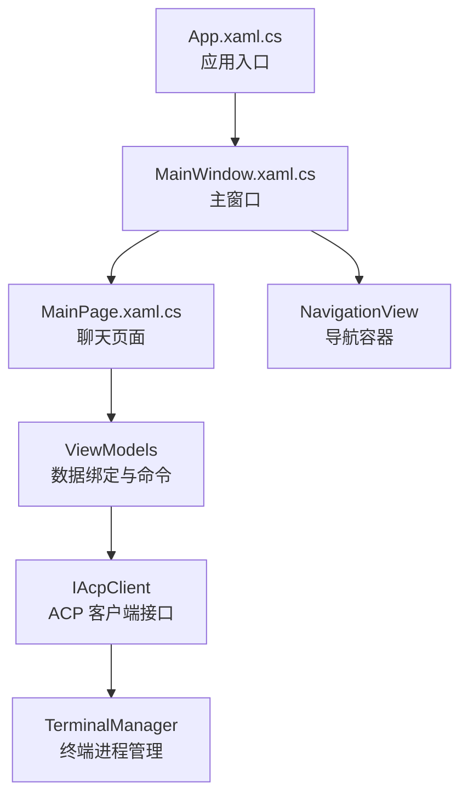
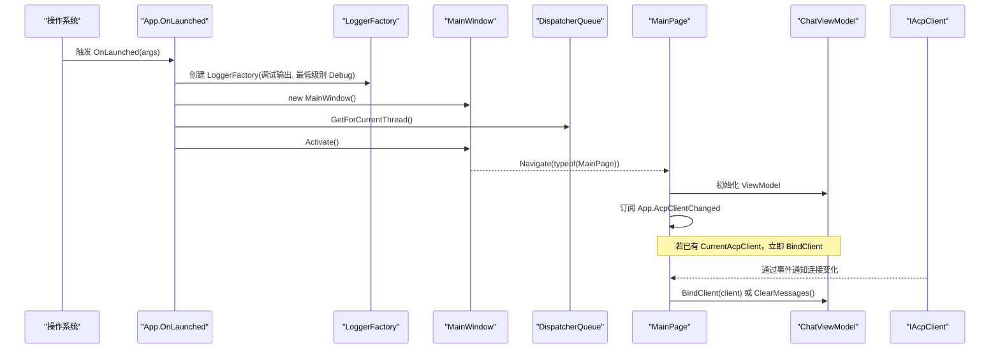
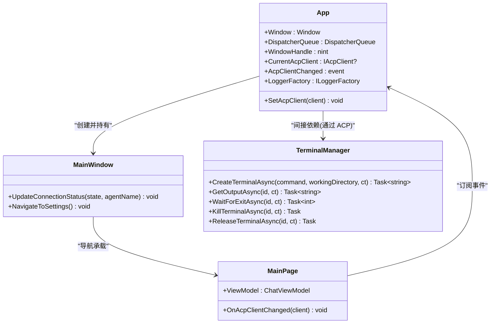

# 应用程序入口

<cite>
**本文引用的文件**   
- [App.xaml.cs](file://Agentic.Desktop/App.xaml.cs)
- [App.xaml](file://Agentic.Desktop/App.xaml)
- [MainWindow.xaml.cs](file://Agentic.Desktop/MainWindow.xaml.cs)
- [MainWindow.xaml](file://Agentic.Desktop/MainWindow.xaml)
- [MainPage.xaml.cs](file://Agentic.Desktop/MainPage.xaml.cs)
- [MainPage.xaml](file://Agentic.Desktop/MainPage.xaml)
- [TerminalManager.cs](file://Agentic.Desktop/Services/TerminalManager.cs)
</cite>

## 目录
1. [简介](#简介)
2. [项目结构](#项目结构)
3. [核心组件](#核心组件)
4. [架构总览](#架构总览)
5. [详细组件分析](#详细组件分析)
6. [依赖关系分析](#依赖关系分析)
7. [性能考量](#性能考量)
8. [故障排查指南](#故障排查指南)
9. [结论](#结论)
10. [附录](#附录)

## 简介
本文聚焦 Agentic.Desktop 应用程序的入口点 App.xaml.cs，系统阐述 Application 类的继承与生命周期管理、OnLaunched 的执行流程、全局静态属性（主窗口引用、UI 线程调度器、原生窗口句柄、当前 ACP 客户端）的作用与使用方式，日志系统的初始化配置，AcpClientChanged 事件机制与 SetAcpClient 方法职责，以及 WinRT 互操作相关的 WindowHandle 获取方式。文末提供完整的启动时序图与关键代码路径，帮助读者快速理解并扩展该应用。

## 项目结构
WinUI 3 桌面应用采用 XAML + C# 的代码分离模式：
- App.xaml.cs 定义应用生命周期与全局状态
- MainWindow.xaml/.cs 定义主窗口与导航框架
- MainPage.xaml/.cs 定义聊天界面与消息交互
- Services 层提供终端管理等服务

图表来源
- [App.xaml.cs:18-76](file://Agentic.Desktop/App.xaml.cs#L18-L76)
- [MainWindow.xaml.cs:14-27](file://Agentic.Desktop/MainWindow.xaml.cs#L14-L27)
- [MainPage.xaml.cs:12-34](file://Agentic.Desktop/MainPage.xaml.cs#L12-L34)
- [TerminalManager.cs:11-68](file://Agentic.Desktop/Services/TerminalManager.cs#L11-L68)

章节来源
- [App.xaml.cs:18-76](file://Agentic.Desktop/App.xaml.cs#L18-L76)
- [MainWindow.xaml.cs:14-27](file://Agentic.Desktop/MainWindow.xaml.cs#L14-L27)
- [MainPage.xaml.cs:12-34](file://Agentic.Desktop/MainPage.xaml.cs#L12-L34)

## 核心组件
- 应用类 App：继承自 Microsoft.UI.Xaml.Application，负责全局资源、日志工厂、主窗口实例、UI 线程调度器、原生窗口句柄、当前 ACP 客户端及连接变化事件。
- 主窗口 MainWindow：承载 NavigationView 与 Frame，用于在聊天页与设置页之间切换，并提供连接状态更新能力。
- 聊天页 MainPage：展示消息列表与输入区域，订阅 AcpClientChanged 事件以响应连接变化，并通过 ViewModel 驱动 UI。

章节来源
- [App.xaml.cs:18-76](file://Agentic.Desktop/App.xaml.cs#L18-L76)
- [MainWindow.xaml.cs:14-27](file://Agentic.Desktop/MainWindow.xaml.cs#L14-L27)
- [MainPage.xaml.cs:12-34](file://Agentic.Desktop/MainPage.xaml.cs#L12-L34)

## 架构总览
下图展示了从应用启动到主窗口显示的关键调用链，以及 ACP 客户端变更事件的传播路径。

图表来源
- [App.xaml.cs:64-76](file://Agentic.Desktop/App.xaml.cs#L64-L76)
- [MainWindow.xaml.cs:65-70](file://Agentic.Desktop/MainWindow.xaml.cs#L65-L70)
- [MainPage.xaml.cs:16-34](file://Agentic.Desktop/MainPage.xaml.cs#L16-L34)

## 详细组件分析

### App 类：Application 继承与生命周期
- 继承关系：App 继承自 Microsoft.UI.Xaml.Application，覆盖 OnLaunched 完成应用初始化。
- 生命周期关键点：
  - 构造函数中调用 InitializeComponent() 加载 XAML 资源。
  - OnLaunched 中初始化日志工厂、创建主窗口、获取 UI 线程调度器、激活窗口。
- 全局静态属性：
  - Window：主窗口引用，供任意类访问（对话框、选择器、互操作等）。
  - DispatcherQueue：UI 线程调度器，用于跨线程安全更新 UI。
  - WindowHandle：原生窗口句柄（HWND），通过 WinRT.Interop.WindowNative.GetWindowHandle 获取，用于需要 InitializeWithWindow 的 WinRT 互操作。
  - CurrentAcpClient：当前连接的 ACP 客户端，由设置页设置，聊天页读取。
  - AcpClientChanged：连接状态变化事件，订阅者可在连接建立或断开时执行逻辑。
  - LoggerFactory：全局日志工厂，统一配置日志输出与级别。

章节来源
- [App.xaml.cs:18-50](file://Agentic.Desktop/App.xaml.cs#L18-L50)
- [App.xaml.cs:55-76](file://Agentic.Desktop/App.xaml.cs#L55-L76)

### OnLaunched 执行流程
- 初始化日志：使用 Microsoft.Extensions.Logging.LoggerFactory.Create 添加调试输出，并将最小级别设置为 Debug。
- 创建主窗口：new MainWindow() 并赋值给 App.Window。
- 获取 UI 线程调度器：Microsoft.UI.Dispatching.DispatcherQueue.GetForCurrentThread()。
- 激活窗口：Window.Activate() 使主窗口可见。

章节来源
- [App.xaml.cs:64-76](file://Agentic.Desktop/App.xaml.cs#L64-L76)

### 全局静态属性的作用与用法
- Window：作为全局窗口引用，便于在其他模块中打开对话框、调用选择器或进行 Win32/WinRT 互操作。
- DispatcherQueue：用于将后台任务的结果封送到 UI 线程，确保 UI 更新的线程安全。
- WindowHandle：通过 WinRT.Interop.WindowNative.GetWindowHandle(Window) 获取 HWND，适用于需要原生窗口句柄的 API（如文件选择器、DataTransferManager 等）。
- CurrentAcpClient：保存当前已连接的 ACP 客户端实例，供 Chat 页面直接绑定。
- AcpClientChanged：当连接状态变化时触发，通知所有订阅者更新 UI 或业务状态。
- LoggerFactory：为整个应用提供统一的日志记录能力。

章节来源
- [App.xaml.cs:24-50](file://Agentic.Desktop/App.xaml.cs#L24-L50)
- [App.xaml.cs:38-39](file://Agentic.Desktop/App.xaml.cs#L38-L39)

### 日志系统初始化配置
- 使用 Microsoft.Extensions.Logging.LoggerFactory.Create 构建日志工厂。
- 添加调试输出源（AddDebug），便于在开发环境中查看日志。
- 设置最小日志级别为 Debug，捕获更详细的运行信息。
- 将工厂实例保存到 App.LoggerFactory，供其他组件（如 AcpClient）创建具体 Logger。

章节来源
- [App.xaml.cs:67-71](file://Agentic.Desktop/App.xaml.cs#L67-L71)

### AcpClientChanged 事件机制与 SetAcpClient 方法
- 事件定义：AcpClientChanged 是一个 Action<IAcpClient?> 事件，用于广播连接状态变化。
- SetAcpClient 方法：设置 CurrentAcpClient 并触发 AcpClientChanged 事件，通知订阅者（如 MainPage）更新绑定或清理状态。
- 订阅者示例：MainPage 在构造时订阅该事件，根据传入的 client 决定是绑定新客户端还是清空消息。

章节来源
- [App.xaml.cs:44-50](file://Agentic.Desktop/App.xaml.cs#L44-L50)
- [App.xaml.cs:79-83](file://Agentic.Desktop/App.xaml.cs#L79-L83)
- [MainPage.xaml.cs:27-34](file://Agentic.Desktop/MainPage.xaml.cs#L27-L34)

### WinRT 互操作：WindowHandle 获取方式
- 通过 WinRT.Interop.WindowNative.GetWindowHandle(App.Window) 获取原生窗口句柄（HWND）。
- 用途：文件选择器、DataTransferManager 以及其他需要 InitializeWithWindow 的 WinRT API。
- 注意：必须在 Window 实例化之后调用，确保句柄有效。

章节来源
- [App.xaml.cs:38-39](file://Agentic.Desktop/App.xaml.cs#L38-L39)

### 主窗口与页面导航
- MainWindow 使用 NavigationView 作为导航容器，包含“聊天”和“设置”两个菜单项。
- RootFrame 用于承载页面内容，默认导航至 MainPage。
- UpdateConnectionStatus 方法通过 DispatcherQueue.TryEnqueue 更新标题栏的连接状态指示器。

章节来源
- [MainWindow.xaml.cs:14-27](file://Agentic.Desktop/MainWindow.xaml.cs#L14-L27)
- [MainWindow.xaml.cs:65-70](file://Agentic.Desktop/MainWindow.xaml.cs#L65-L70)
- [MainWindow.xaml.cs:30-50](file://Agentic.Desktop/MainWindow.xaml.cs#L30-L50)

### 聊天页面与事件响应
- MainPage 初始化时绑定 ChatListPanel 的 ViewModel，订阅滚动到底部事件。
- 若 App.CurrentAcpClient 已存在，立即调用 ViewModel.BindClient 绑定客户端。
- 订阅 App.AcpClientChanged，当连接建立时绑定客户端，断开时清空消息。
- 支持通过 Enter 键发送消息，按钮禁用状态由 IsAgentConnected 控制。

章节来源
- [MainPage.xaml.cs:16-34](file://Agentic.Desktop/MainPage.xaml.cs#L16-L34)
- [MainPage.xaml.cs:36-47](file://Agentic.Desktop/MainPage.xaml.cs#L36-L47)
- [MainPage.xaml.cs:57-65](file://Agentic.Desktop/MainPage.xaml.cs#L57-L65)

## 依赖关系分析
- App 依赖 Microsoft.UI.Xaml.Application、Microsoft.Extensions.Logging、WinRT.Interop。
- MainWindow 依赖 Microsoft.UI.Xaml.Controls.NavigationView、Frame 与本地服务（LocalizationService）。
- MainPage 依赖 ViewModels 与 IAcpClient 接口，通过 App 的全局状态进行通信。
- TerminalManager 实现 ITerminalHandler，管理多个终端进程实例，异步读取标准输出与错误流。

图表来源
- [App.xaml.cs:18-50](file://Agentic.Desktop/App.xaml.cs#L18-L50)
- [MainWindow.xaml.cs:14-27](file://Agentic.Desktop/MainWindow.xaml.cs#L14-L27)
- [MainPage.xaml.cs:12-34](file://Agentic.Desktop/MainPage.xaml.cs#L12-L34)
- [TerminalManager.cs:11-68](file://Agentic.Desktop/Services/TerminalManager.cs#L11-L68)

章节来源
- [App.xaml.cs:18-50](file://Agentic.Desktop/App.xaml.cs#L18-L50)
- [MainWindow.xaml.cs:14-27](file://Agentic.Desktop/MainWindow.xaml.cs#L14-L27)
- [MainPage.xaml.cs:12-34](file://Agentic.Desktop/MainPage.xaml.cs#L12-L34)
- [TerminalManager.cs:11-68](file://Agentic.Desktop/Services/TerminalManager.cs#L11-L68)

## 性能考量
- 日志级别设置为 Debug，适合开发阶段；发布时可调整为更高阈值以减少 I/O 开销。
- 使用 DispatcherQueue.TryEnqueue 避免阻塞 UI 线程，提升响应性。
- TerminalManager 异步读取 stdout/stderr，避免同步阻塞，提高吞吐。
- 主窗口尺寸固定为 1200x780，可根据用户偏好动态调整。

[本节为通用指导，不直接分析具体文件]

## 故障排查指南
- 日志无输出：检查 LoggerFactory 是否正确初始化，确认 AddDebug 与最小级别设置。
- UI 未更新：确认是否通过 DispatcherQueue.TryEnqueue 封送 UI 更新。
- 连接状态不同步：检查 AcpClientChanged 事件是否正确触发，订阅者是否及时响应。
- 原生窗口句柄无效：确保在 Window 实例化后调用 WindowHandle 属性。

章节来源
- [App.xaml.cs:67-71](file://Agentic.Desktop/App.xaml.cs#L67-L71)
- [MainWindow.xaml.cs:30-50](file://Agentic.Desktop/MainWindow.xaml.cs#L30-L50)
- [MainPage.xaml.cs:36-47](file://Agentic.Desktop/MainPage.xaml.cs#L36-L47)

## 结论
App.xaml.cs 作为 Agentic.Desktop 的入口点，承担了应用生命周期管理、全局状态维护、日志初始化与 WinRT 互操作支持等关键职责。通过清晰的事件机制与全局静态属性，应用实现了松耦合的模块通信。结合 MainWindow 与 MainPage 的协作，形成了稳定的 UI 导航与数据绑定体系。遵循本文提供的时序图与最佳实践，可高效扩展与维护该应用。

[本节为总结，不直接分析具体文件]

## 附录
- 关键代码路径参考：
  - 应用入口与生命周期：[App.xaml.cs:18-76](file://Agentic.Desktop/App.xaml.cs#L18-L76)
  - 主窗口导航与状态更新：[MainWindow.xaml.cs:14-70](file://Agentic.Desktop/MainWindow.xaml.cs#L14-L70)
  - 聊天页面事件订阅与绑定：[MainPage.xaml.cs:16-47](file://Agentic.Desktop/MainPage.xaml.cs#L16-L47)
  - 终端进程管理：[TerminalManager.cs:11-68](file://Agentic.Desktop/Services/TerminalManager.cs#L11-L68)

[本节为附录，不直接分析具体文件]