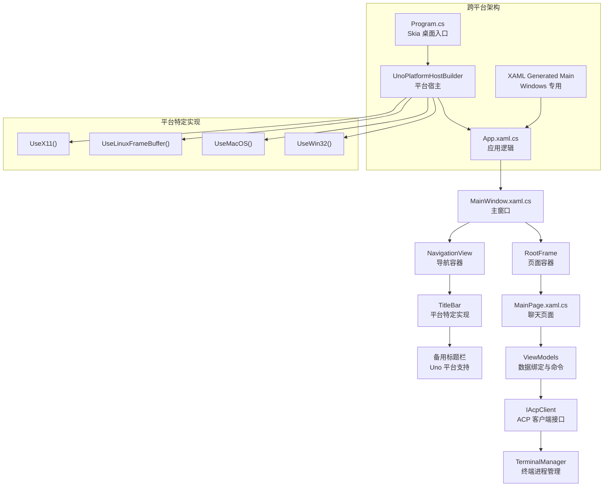
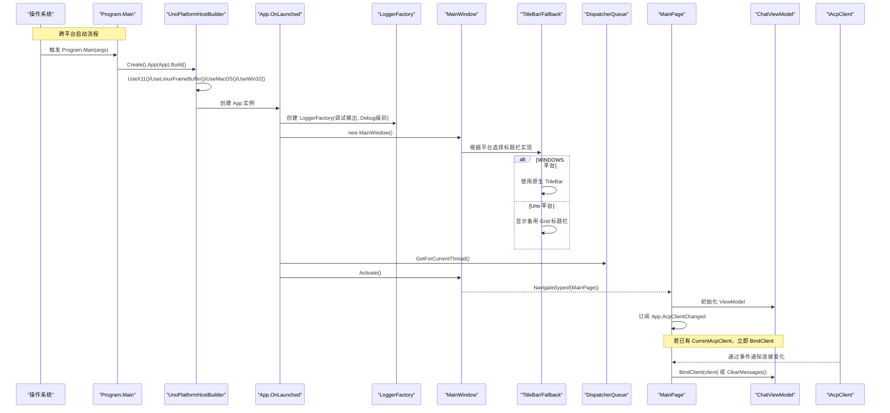
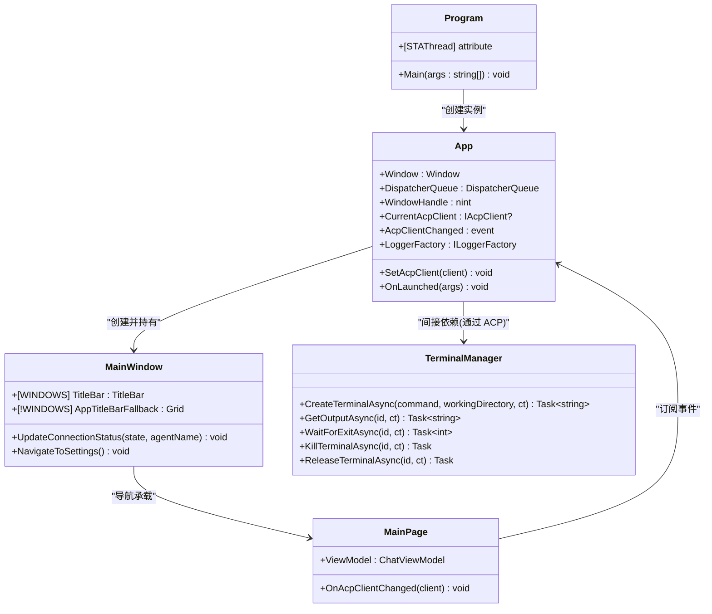

# 应用程序入口

<cite>
**本文引用的文件**   
- [App.xaml.cs](file://Agentic.Desktop/App.xaml.cs)
- [Program.cs](file://Agentic.Desktop/Platforms/Desktop/Program.cs)
- [MainWindow.xaml.cs](file://Agentic.Desktop/MainWindow.xaml.cs)
- [MainWindow.xaml](file://Agentic.Desktop/MainWindow.xaml)
- [MainPage.xaml.cs](file://Agentic.Desktop/MainPage.xaml.cs)
- [TerminalManager.cs](file://Agentic.Desktop/Services/TerminalManager.cs)
- [Agentic.Desktop.csproj](file://Agentic.Desktop/Agentic.Desktop.csproj)
</cite>

## 更新摘要
**所做更改**   
- 新增 Uno Platform 备用标题栏实现的详细说明
- 增强条件编译和多目标框架支持的技术细节
- 更新跨平台架构文档以反映新的 Skia 桌面入口点
- 添加平台特定 UI 组件的条件渲染机制
- 完善跨平台启动流程的时序图和关键代码示例

## 目录
1. [简介](#简介)
2. [项目结构](#项目结构)
3. [核心组件](#核心组件)
4. [架构总览](#架构总览)
5. [详细组件分析](#详细组件分析)
6. [依赖关系分析](#依赖关系分析)
7. [性能考量](#性能考量)
8. [故障排查指南](#故障排查指南)
9. [结论](#结论)
10. [附录](#附录)

## 简介
本文聚焦 Agentic.Desktop 应用程序的入口点实现，系统阐述跨平台桌面应用的架构设计。应用采用 Uno Platform 技术栈，支持 Windows（WinAppSDK）和非 Windows 平台的 Skia 渲染。重点说明 App.xaml.cs 的 Application 类继承与生命周期管理、OnLaunched 的执行流程、全局静态属性（主窗口引用、UI 线程调度器、原生窗口句柄、当前 ACP 客户端）的作用与使用方式，以及新的 Platforms/Desktop/Program.cs 作为 Skia 桌面平台入口点的职责。同时详细介绍了新增的 Uno Platform 备用标题栏实现和条件编译机制，确保在不同平台上提供一致的用户体验。

## 项目结构
Uno Platform 桌面应用采用跨平台架构，支持多目标框架编译：
- **Windows 目标** (net10.0-windows10.0.26100): 使用 WinAppSDK + XAML 生成的 Main 入口点
- **桌面目标** (net10.0-desktop): 使用 Skia 渲染，通过 Platforms/Desktop/Program.cs 作为统一入口点
- App.xaml.cs: 定义应用生命周期与全局状态（跨平台共享）
- MainWindow.xaml/.cs: 定义主窗口与导航框架，包含平台特定的标题栏实现
- MainPage.xaml/.cs: 定义聊天界面与消息交互
- Services 层提供终端管理等服务

**图表来源**
- [Program.cs:14-22](file://Agentic.Desktop/Platforms/Desktop/Program.cs#L14-L22)
- [MainWindow.xaml:18-73](file://Agentic.Desktop/MainWindow.xaml#L18-L73)
- [Agentic.Desktop.csproj:4](file://Agentic.Desktop/Agentic.Desktop.csproj#L4)

**章节来源**
- [Program.cs:1-25](file://Agentic.Desktop/Platforms/Desktop/Program.cs#L1-25)
- [Agentic.Desktop.csproj:1-83](file://Agentic.Desktop/Agentic.Desktop.csproj#L1-83)

## 核心组件
- **跨平台入口点 Program**: 为 Skia 桌面平台提供统一的程序入口，配置 UnoPlatformHostBuilder 并启用多种后端支持
- **应用类 App**: 继承自 Microsoft.UI.Xaml.Application，负责全局资源、日志工厂、主窗口实例、UI 线程调度器、原生窗口句柄、当前 ACP 客户端及连接变化事件
- **主窗口 MainWindow**: 承载 NavigationView 与 Frame，用于在聊天页与设置页之间切换，并提供连接状态更新能力，包含平台特定的标题栏实现
- **聊天页 MainPage**: 展示消息列表与输入区域，订阅 AcpClientChanged 事件以响应连接变化，并通过 ViewModel 驱动 UI

**章节来源**
- [Program.cs:9-24](file://Agentic.Desktop/Platforms/Desktop/Program.cs#L9-L24)
- [App.xaml.cs:18-94](file://Agentic.Desktop/App.xaml.cs#L18-L94)
- [MainWindow.xaml.cs:14-118](file://Agentic.Desktop/MainWindow.xaml.cs#L14-L118)
- [MainPage.xaml.cs:12-105](file://Agentic.Desktop/MainPage.xaml.cs#L12-L105)

## 架构总览
下图展示了从跨平台入口点到应用启动的完整调用链，以及不同平台的初始化流程和备用标题栏机制。

**图表来源**
- [Program.cs:12-23](file://Agentic.Desktop/Platforms/Desktop/Program.cs#L12-L23)
- [MainWindow.xaml.cs:20-35](file://Agentic.Desktop/MainWindow.xaml.cs#L20-L35)
- [App.xaml.cs:73-85](file://Agentic.Desktop/App.xaml.cs#L73-L85)
- [MainWindow.xaml.cs:69-74](file://Agentic.Desktop/MainWindow.xaml.cs#L69-L74)

## 详细组件分析

### 跨平台入口点 Program 类
**新增** 为 Skia 桌面平台提供统一的程序入口点，支持多种后端渲染引擎。

- **STAThread 特性**: 确保单线程 apartment 模型，符合 COM 和 Win32 API 要求
- **UnoPlatformHostBuilder**: 构建跨平台应用宿主，支持 X11、Linux FrameBuffer、macOS 和 Win32 后端
- **平台特定配置**: 
  - UseX11(): 启用 X11 窗口系统支持（Linux/Unix）
  - UseLinuxFrameBuffer(): 启用 Linux 帧缓冲支持
  - UseMacOS(): 启用 macOS 原生支持
  - UseWin32(): 启用 Windows Win32 支持
- **应用工厂**: .App(() => new App()) 指定应用类的构造函数

**章节来源**
- [Program.cs:9-24](file://Agentic.Desktop/Platforms/Desktop/Program.cs#L9-L24)

### App 类：Application 继承与生命周期
- **继承关系**: App 继承自 Microsoft.UI.Xaml.Application，覆盖 OnLaunched 完成应用初始化
- **条件编译支持**: 使用 #if WINDOWS 指令区分 Windows 和非 Windows 平台的实现
- **生命周期关键点**:
  - 构造函数中调用 InitializeComponent() 加载 XAML 资源
  - OnLaunched 中初始化日志工厂、创建主窗口、获取 UI 线程调度器、激活窗口
- **全局静态属性**:
  - Window：主窗口引用，供任意类访问（对话框、选择器、互操作等）
  - DispatcherQueue：UI 线程调度器，用于跨线程安全更新 UI
  - WindowHandle：原生窗口句柄（HWND），通过 WinRT.Interop.WindowNative.GetWindowHandle 获取（仅 Windows 平台）
  - CurrentAcpClient：当前连接的 ACP 客户端，由设置页设置，聊天页读取
  - AcpClientChanged：连接状态变化事件，订阅者可在连接建立或断开时执行逻辑
  - LoggerFactory：全局日志工厂，统一配置日志输出与级别

**章节来源**
- [App.xaml.cs:18-50](file://Agentic.Desktop/App.xaml.cs#L18-L50)
- [App.xaml.cs:55-76](file://Agentic.Desktop/App.xaml.cs#L55-L76)

### OnLaunched 执行流程
- **初始化日志**: 使用 Microsoft.Extensions.Logging.LoggerFactory.Create 添加调试输出，并将最小级别设置为 Debug
- **创建主窗口**: new MainWindow() 并赋值给 App.Window
- **获取 UI 线程调度器**: Microsoft.UI.Dispatching.DispatcherQueue.GetForCurrentThread()
- **激活窗口**: Window.Activate() 使主窗口可见

**章节来源**
- [App.xaml.cs:73-85](file://Agentic.Desktop/App.xaml.cs#L73-L85)

### 全局静态属性的作用与用法
- **Window**: 作为全局窗口引用，便于在其他模块中打开对话框、调用选择器或进行 Win32/WinRT 互操作
- **DispatcherQueue**: 用于将后台任务的结果封送到 UI 线程，确保 UI 更新的线程安全
- **WindowHandle**: 通过 WinRT.Interop.WindowNative.GetWindowHandle(Window) 获取 HWND（仅 Windows 平台），适用于需要原生窗口句柄的 API（如文件选择器、DataTransferManager 等）
- **CurrentAcpClient**: 保存当前已连接的 ACP 客户端实例，供 Chat 页面直接绑定
- **AcpClientChanged**: 当连接状态变化时触发，通知所有订阅者更新 UI 或业务状态
- **LoggerFactory**: 为整个应用提供统一的日志记录能力

**章节来源**
- [App.xaml.cs:24-50](file://Agentic.Desktop/App.xaml.cs#L24-L50)
- [App.xaml.cs:38-48](file://Agentic.Desktop/App.xaml.cs#L38-L48)

### 日志系统初始化配置
- 使用 Microsoft.Extensions.Logging.LoggerFactory.Create 构建日志工厂
- 添加调试输出源（AddDebug），便于在开发环境中查看日志
- 设置最小日志级别为 Debug，捕获更详细的运行信息
- 将工厂实例保存到 App.LoggerFactory，供其他组件（如 AcpClient）创建具体 Logger

**章节来源**
- [App.xaml.cs:75-80](file://Agentic.Desktop/App.xaml.cs#L75-L80)

### AcpClientChanged 事件机制与 SetAcpClient 方法
- **事件定义**: AcpClientChanged 是一个 Action<IAcpClient?> 事件，用于广播连接状态变化
- **SetAcpClient 方法**: 设置 CurrentAcpClient 并触发 AcpClientChanged 事件，通知订阅者（如 MainPage）更新绑定或清理状态
- **订阅者示例**: MainPage 在构造时订阅该事件，根据传入的 client 决定是绑定新客户端还是清空消息

**章节来源**
- [App.xaml.cs:55-56](file://Agentic.Desktop/App.xaml.cs#L55-L56)
- [App.xaml.cs:87-92](file://Agentic.Desktop/App.xaml.cs#L87-L92)
- [MainPage.xaml.cs:32-34](file://Agentic.Desktop/MainPage.xaml.cs#L32-L34)

### WinRT 互操作：WindowHandle 获取方式
- **条件编译**: 仅在 WINDOWS 平台下调用 WinRT.Interop.WindowNative.GetWindowHandle(App.Window)
- **非 Windows 平台**: 返回 nint.Zero，避免在非 Windows 平台上调用 WinRT API
- **用途**: 文件选择器、DataTransferManager 以及其他需要 InitializeWithWindow 的 WinRT API
- **注意**: 必须在 Window 实例化之后调用，确保句柄有效

**章节来源**
- [App.xaml.cs:38-48](file://Agentic.Desktop/App.xaml.cs#L38-L48)

### 主窗口与平台特定标题栏实现
**新增** 实现了跨平台兼容的标题栏机制，支持 Windows 原生标题栏和 Uno 平台的备用标题栏。

- **Windows 平台**: 使用 Microsoft.UI.Xaml.Controls.TitleBar，支持 MicaBackdrop 背景效果和自定义内容
- **Uno 平台**: 使用备用 Grid 标题栏，隐藏原生 TitleBar 并显示自定义 Grid 布局
- **条件编译**: 通过 #if WINDOWS 指令在不同平台间切换不同的标题栏实现
- **状态指示器**: 提供连接状态的颜色指示器和文本显示，支持连接、连接中、已连接三种状态
- **导航集成**: 与 NavigationView 集成，提供菜单切换按钮和后退功能

**章节来源**
- [MainWindow.xaml.cs:20-35](file://Agentic.Desktop/MainWindow.xaml.cs#L20-L35)
- [MainWindow.xaml.cs:48-54](file://Agentic.Desktop/MainWindow.xaml.cs#L48-L54)
- [MainWindow.xaml:18-73](file://Agentic.Desktop/MainWindow.xaml#L18-L73)

### 聊天页面与事件响应
- **MainPage**: 初始化时绑定 ChatListPanel 的 ViewModel，订阅滚动到底部事件
- **智能绑定**: 若 App.CurrentAcpClient 已存在，立即调用 ViewModel.BindClient 绑定客户端
- **事件订阅**: 订阅 App.AcpClientChanged，当连接建立时绑定客户端，断开时清空消息
- **用户交互**: 支持通过 Enter 键发送消息，按钮禁用状态由 IsAgentConnected 控制

**章节来源**
- [MainPage.xaml.cs:16-34](file://Agentic.Desktop/MainPage.xaml.cs#L16-L34)
- [MainPage.xaml.cs:36-47](file://Agentic.Desktop/MainPage.xaml.cs#L36-L47)
- [MainPage.xaml.cs:57-65](file://Agentic.Desktop/MainPage.xaml.cs#L57-L65)

## 依赖关系分析
- **Program**: 依赖 Uno.UI.Hosting 命名空间，提供跨平台宿主功能
- **App**: 依赖 Microsoft.UI.Xaml.Application、Microsoft.Extensions.Logging、WinRT.Interop（条件编译）
- **MainWindow**: 依赖 Microsoft.UI.Xaml.Controls.NavigationView、Frame 与本地服务（LocalizationService），包含平台特定的 UI 组件
- **MainPage**: 依赖 ViewModels 与 IAcpClient 接口，通过 App 的全局状态进行通信
- **TerminalManager**: 实现 ITerminalHandler，管理多个终端进程实例，异步读取标准输出与错误流

**图表来源**
- [Program.cs:9-24](file://Agentic.Desktop/Platforms/Desktop/Program.cs#L9-L24)
- [App.xaml.cs:18-94](file://Agentic.Desktop/App.xaml.cs#L18-L94)
- [MainWindow.xaml.cs:14-118](file://Agentic.Desktop/MainWindow.xaml.cs#L14-L118)
- [MainPage.xaml.cs:12-105](file://Agentic.Desktop/MainPage.xaml.cs#L12-L105)
- [TerminalManager.cs:11-68](file://Agentic.Desktop/Services/TerminalManager.cs#L11-L68)

**章节来源**
- [Program.cs:1-25](file://Agentic.Desktop/Platforms/Desktop/Program.cs#L1-25)
- [App.xaml.cs:18-94](file://Agentic.Desktop/App.xaml.cs#L18-L94)
- [MainWindow.xaml.cs:14-118](file://Agentic.Desktop/MainWindow.xaml.cs#L14-L118)
- [MainPage.xaml.cs:12-105](file://Agentic.Desktop/MainPage.xaml.cs#L12-L105)
- [TerminalManager.cs:11-68](file://Agentic.Desktop/Services/TerminalManager.cs#L11-L68)

## 性能考量
- **日志级别**: 设置为 Debug，适合开发阶段；发布时可调整为更高阈值以减少 I/O 开销
- **DispatcherQueue**: 使用 DispatcherQueue.TryEnqueue 避免阻塞 UI 线程，提升响应性
- **TerminalManager**: 异步读取 stdout/stderr，避免同步阻塞，提高吞吐
- **主窗口尺寸**: 固定为 1200x780，可根据用户偏好动态调整
- **跨平台优化**: Uno Platform 自动处理平台特定的性能优化和资源管理
- **标题栏性能**: 备用标题栏使用简单的 Grid 布局，避免复杂的视觉效果影响性能

## 故障排查指南
- **日志无输出**: 检查 LoggerFactory 是否正确初始化，确认 AddDebug 与最小级别设置
- **UI 未更新**: 确认是否通过 DispatcherQueue.TryEnqueue 封送 UI 更新
- **连接状态不同步**: 检查 AcpClientChanged 事件是否正确触发，订阅者是否及时响应
- **原生窗口句柄无效**: 确保在 Window 实例化后调用 WindowHandle 属性，且仅在 Windows 平台
- **跨平台启动失败**: 检查 UnoPlatformHostBuilder 配置是否正确，确认所需后端库已安装
- **平台特定问题**: 检查条件编译符号 WINDOWS 是否正确设置
- **标题栏显示异常**: 确认平台特定的标题栏实现是否正确加载，检查备用标题栏的可见性设置

**章节来源**
- [App.xaml.cs:75-80](file://Agentic.Desktop/App.xaml.cs#L75-L80)
- [MainWindow.xaml.cs:20-35](file://Agentic.Desktop/MainWindow.xaml.cs#L20-L35)
- [MainWindow.xaml.cs:48-54](file://Agentic.Desktop/MainWindow.xaml.cs#L48-L54)
- [MainPage.xaml.cs:36-47](file://Agentic.Desktop/MainPage.xaml.cs#L36-L47)
- [Program.cs:14-22](file://Agentic.Desktop/Platforms/Desktop/Program.cs#L14-L22)

## 结论
Agentic.Desktop 应用程序通过 Uno Platform 实现了真正的跨平台桌面应用。新的 Platforms/Desktop/Program.cs 作为 Skia 桌面平台的统一入口点，配合 App.xaml.cs 中的 Application 类，提供了完整的生命周期管理和全局状态维护。新增的备用标题栏实现确保了在不同平台上提供一致的用户体验，而条件编译机制则保证了代码的跨平台兼容性。通过清晰的事件机制与全局静态属性，应用实现了松耦合的模块通信。结合 MainWindow 与 MainPage 的协作，形成了稳定的 UI 导航与数据绑定体系。遵循本文提供的时序图与最佳实践，可高效扩展和维护该跨平台应用。

## 附录
- **关键代码路径参考**:
  - 跨平台入口点与宿主配置: [Program.cs:9-24](file://Agentic.Desktop/Platforms/Desktop/Program.cs#L9-L24)
  - 应用入口与生命周期: [App.xaml.cs:18-94](file://Agentic.Desktop/App.xaml.cs#L18-L94)
  - 主窗口导航与状态更新: [MainWindow.xaml.cs:14-118](file://Agentic.Desktop/MainWindow.xaml.cs#L14-L118)
  - 平台特定标题栏实现: [MainWindow.xaml.cs:20-35](file://Agentic.Desktop/MainWindow.xaml.cs#L20-L35)
  - 备用标题栏XAML布局: [MainWindow.xaml:18-73](file://Agentic.Desktop/MainWindow.xaml#L18-L73)
  - 聊天页面事件订阅与绑定: [MainPage.xaml.cs:16-47](file://Agentic.Desktop/MainPage.xaml.cs#L16-L47)
  - 终端进程管理: [TerminalManager.cs:11-68](file://Agentic.Desktop/Services/TerminalManager.cs#L11-L68)
  - 多目标框架配置: [Agentic.Desktop.csproj:1-83](file://Agentic.Desktop/Agentic.Desktop.csproj#L1-83)