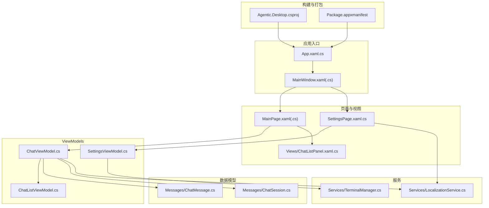
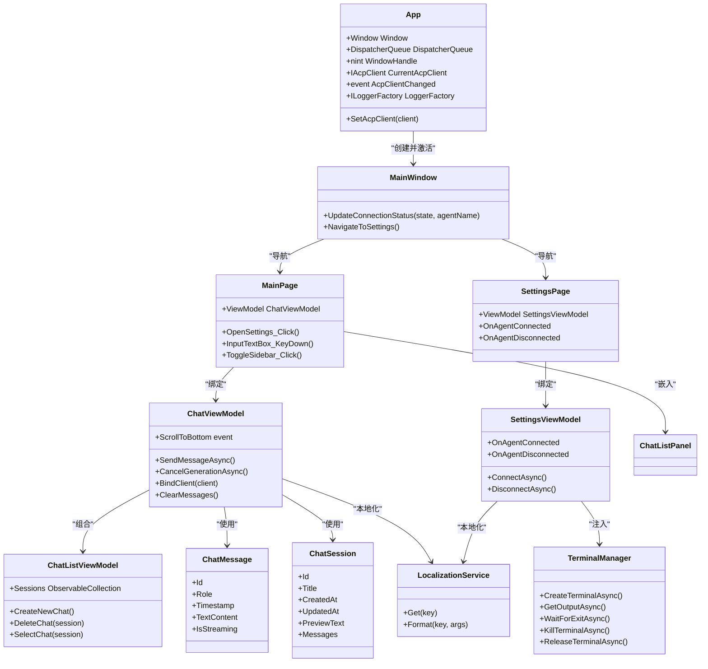
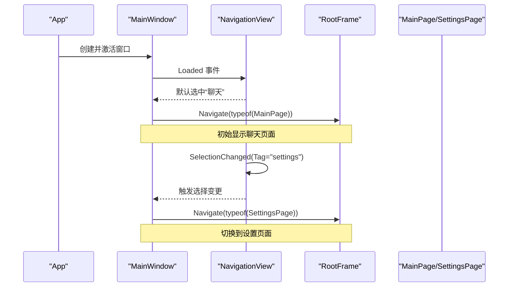
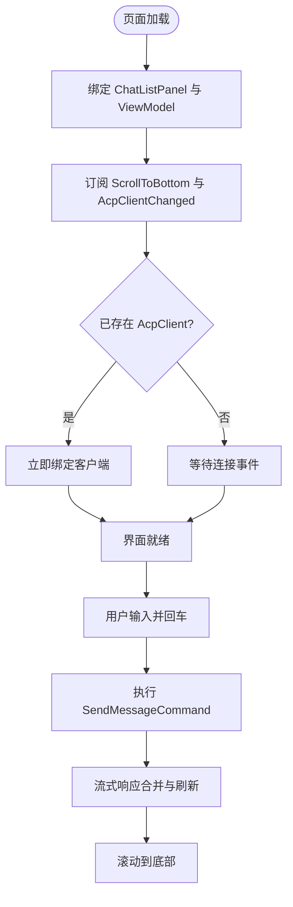
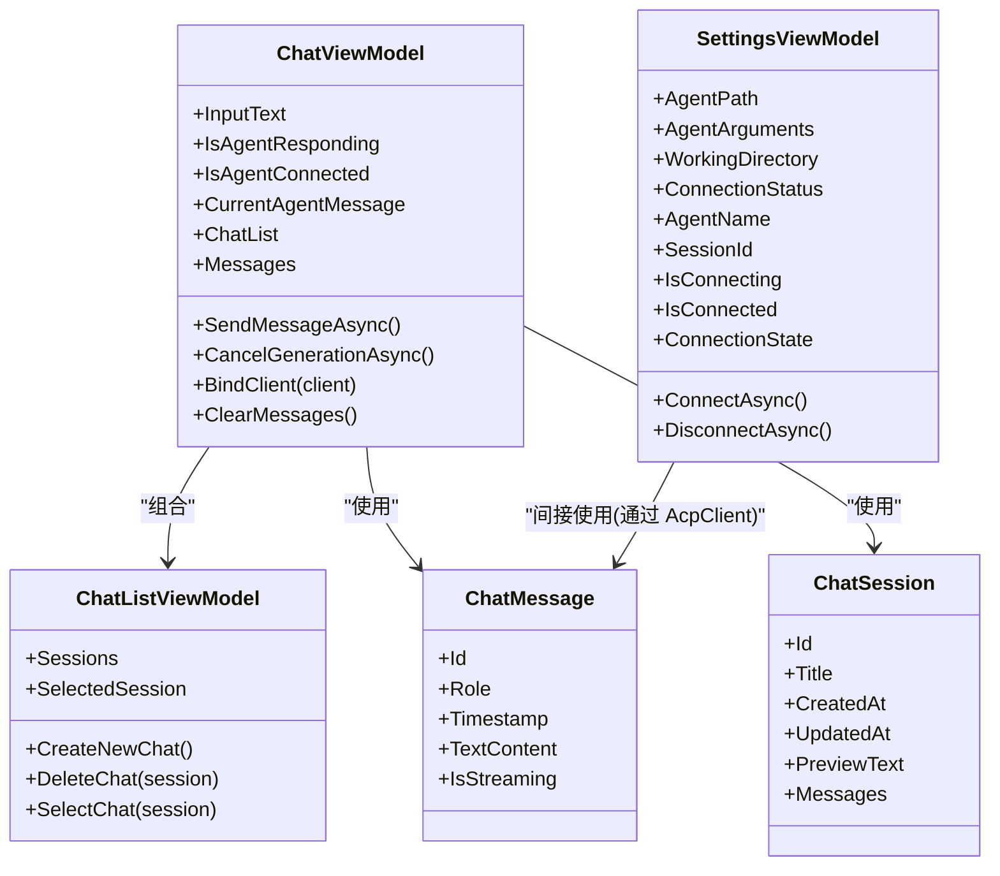
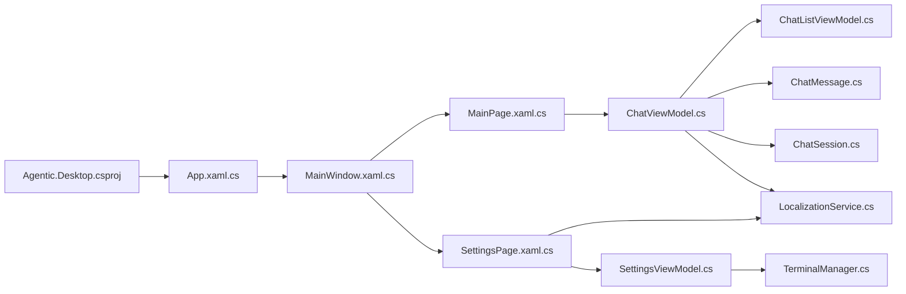

# 项目结构

<cite>
**本文引用的文件**   
- [App.xaml.cs](file://Agentic.Desktop/App.xaml.cs)
- [MainWindow.xaml.cs](file://Agentic.Desktop/MainWindow.xaml.cs)
- [MainWindow.xaml](file://Agentic.Desktop/MainWindow.xaml)
- [MainPage.xaml.cs](file://Agentic.Desktop/MainPage.xaml.cs)
- [MainPage.xaml](file://Agentic.Desktop/MainPage.xaml)
- [SettingsPage.xaml.cs](file://Agentic.Desktop/SettingsPage.xaml.cs)
- [ChatListPanel.xaml.cs](file://Agentic.Desktop/Views/ChatListPanel.xaml.cs)
- [ChatViewModel.cs](file://Agentic.Desktop/ViewModels/ChatViewModel.cs)
- [ChatListViewModel.cs](file://Agentic.Desktop/ViewModels/ChatListViewModel.cs)
- [SettingsViewModel.cs](file://Agentic.Desktop/ViewModels/SettingsViewModel.cs)
- [ChatMessage.cs](file://Agentic.Desktop/ViewModels/Messages/ChatMessage.cs)
- [ChatSession.cs](file://Agentic.Desktop/ViewModels/Messages/ChatSession.cs)
- [LocalizationService.cs](file://Agentic.Desktop/Services/LocalizationService.cs)
- [TerminalManager.cs](file://Agentic.Desktop/Services/TerminalManager.cs)
- [BoolToVisibilityConverter.cs](file://Agentic.Desktop/Converters/BoolToVisibilityConverter.cs)
- [Agentic.Desktop.csproj](file://Agentic.Desktop/Agentic.Desktop.csproj)
- [Package.appxmanifest](file://Agentic.Desktop/Package.appxmanifest)
</cite>

## 目录
1. [简介](#简介)
2. [项目结构](#项目结构)
3. [核心组件](#核心组件)
4. [架构总览](#架构总览)
5. [详细组件分析](#详细组件分析)
6. [依赖关系分析](#依赖关系分析)
7. [性能考量](#性能考量)
8. [故障排查指南](#故障排查指南)
9. [结论](#结论)
10. [附录](#附录)

## 简介
本文件系统性梳理 Agentic.Desktop 项目的整体结构与组织方式，重点解释 MVVM 架构在项目中的体现、各目录职责划分、XAML 与代码后置文件的对应关系，以及应用程序入口 App.xaml.cs、主窗口 MainWindow 的导航机制、主界面 MainPage 的组织。同时解析项目配置文件 Agentic.Desktop.csproj 的关键属性（目标框架、平台支持、MSIX 打包配置等），并给出架构图与流程图帮助理解数据流与控制流。

## 项目结构
- 应用入口与窗口
  - App.xaml.cs：应用生命周期与全局资源（日志工厂、UI 线程调度器、窗口句柄、AcpClient 全局状态）。
  - MainWindow.xaml/.cs：主窗口容器，包含自定义标题栏与 NavigationView 导航，承载 RootFrame 页面切换。
- 页面与视图
  - MainPage.xaml/.cs：聊天主界面，使用 SplitView 布局左侧会话列表与右侧消息区，绑定 ChatViewModel。
  - SettingsPage.xaml.cs：设置页，负责 Agent 连接管理、权限处理、文件系统处理器注入。
  - Views/ChatListPanel.xaml.cs：侧边栏会话列表控件，驱动会话选择与删除命令。
- ViewModel 层
  - ChatViewModel.cs：聊天业务逻辑、消息流式更新、会话切换、发送/取消生成命令。
  - ChatListViewModel.cs：会话集合管理与选中项变更事件。
  - SettingsViewModel.cs：连接/断开、进程退出监听、工作目录与参数配置、共享实例跨页面保持状态。
- 数据模型
  - Messages/ChatMessage.cs、Messages/ChatSession.cs：消息与会话实体，基于 ObservableObject 提供属性变更通知。
- 服务层
  - Services/LocalizationService.cs：本地化字符串读取与格式化。
  - Services/TerminalManager.cs：终端进程管理，实现 ITerminalHandler 接口。
- 转换器与资源
  - Converters/BoolToVisibilityConverter.cs：布尔到可见性的转换。
  - Strings/*：多语言资源文件（resw）。
- 构建与打包
  - Agentic.Desktop.csproj：目标框架、平台、MSIX 工具启用、NuGet 包引用、发布优化。
  - Package.appxmanifest：包标识、能力声明、启动元素与资源语言。

**图表来源** 
- [App.xaml.cs:1-85](file://Agentic.Desktop/App.xaml.cs#L1-L85)
- [MainWindow.xaml.cs:1-97](file://Agentic.Desktop/MainWindow.xaml.cs#L1-L97)
- [MainWindow.xaml:1-70](file://Agentic.Desktop/MainWindow.xaml#L1-L70)
- [MainPage.xaml.cs:1-105](file://Agentic.Desktop/MainPage.xaml.cs#L1-L105)
- [MainPage.xaml:1-163](file://Agentic.Desktop/MainPage.xaml#L1-L163)
- [SettingsPage.xaml.cs:1-96](file://Agentic.Desktop/SettingsPage.xaml.cs#L1-L96)
- [ChatListPanel.xaml.cs:1-40](file://Agentic.Desktop/Views/ChatListPanel.xaml.cs#L1-L40)
- [ChatViewModel.cs:1-237](file://Agentic.Desktop/ViewModels/ChatViewModel.cs#L1-L237)
- [ChatListViewModel.cs:1-64](file://Agentic.Desktop/ViewModels/ChatListViewModel.cs#L1-L64)
- [SettingsViewModel.cs:1-162](file://Agentic.Desktop/ViewModels/SettingsViewModel.cs#L1-L162)
- [ChatMessage.cs:1-39](file://Agentic.Desktop/ViewModels/Messages/ChatMessage.cs#L1-L39)
- [ChatSession.cs:1-28](file://Agentic.Desktop/ViewModels/Messages/ChatSession.cs#L1-L28)
- [LocalizationService.cs:1-23](file://Agentic.Desktop/Services/LocalizationService.cs#L1-L23)
- [TerminalManager.cs:1-161](file://Agentic.Desktop/Services/TerminalManager.cs#L1-L161)
- [Agentic.Desktop.csproj:1-79](file://Agentic.Desktop/Agentic.Desktop.csproj#L1-L79)
- [Package.appxmanifest:1-57](file://Agentic.Desktop/Package.appxmanifest#L1-L57)

**章节来源**
- [App.xaml.cs:1-85](file://Agentic.Desktop/App.xaml.cs#L1-L85)
- [MainWindow.xaml.cs:1-97](file://Agentic.Desktop/MainWindow.xaml.cs#L1-L97)
- [MainWindow.xaml:1-70](file://Agentic.Desktop/MainWindow.xaml#L1-L70)
- [MainPage.xaml.cs:1-105](file://Agentic.Desktop/MainPage.xaml.cs#L1-L105)
- [MainPage.xaml:1-163](file://Agentic.Desktop/MainPage.xaml#L1-L163)
- [SettingsPage.xaml.cs:1-96](file://Agentic.Desktop/SettingsPage.xaml.cs#L1-L96)
- [ChatListPanel.xaml.cs:1-40](file://Agentic.Desktop/Views/ChatListPanel.xaml.cs#L1-L40)
- [ChatViewModel.cs:1-237](file://Agentic.Desktop/ViewModels/ChatViewModel.cs#L1-L237)
- [ChatListViewModel.cs:1-64](file://Agentic.Desktop/ViewModels/ChatListViewModel.cs#L1-L64)
- [SettingsViewModel.cs:1-162](file://Agentic.Desktop/ViewModels/SettingsViewModel.cs#L1-L162)
- [ChatMessage.cs:1-39](file://Agentic.Desktop/ViewModels/Messages/ChatMessage.cs#L1-L39)
- [ChatSession.cs:1-28](file://Agentic.Desktop/ViewModels/Messages/ChatSession.cs#L1-L28)
- [LocalizationService.cs:1-23](file://Agentic.Desktop/Services/LocalizationService.cs#L1-L23)
- [TerminalManager.cs:1-161](file://Agentic.Desktop/Services/TerminalManager.cs#L1-L161)
- [Agentic.Desktop.csproj:1-79](file://Agentic.Desktop/Agentic.Desktop.csproj#L1-L79)
- [Package.appxmanifest:1-57](file://Agentic.Desktop/Package.appxmanifest#L1-L57)

## 核心组件
- 应用入口 App
  - 初始化日志工厂、创建主窗口、获取 UI 线程调度器、暴露窗口句柄与 AcpClient 全局状态，并提供连接状态变更事件。
- 主窗口 MainWindow
  - 自定义标题栏、图标、尺寸；NavigationView 作为导航容器，RootFrame 承载页面；提供连接状态更新方法。
- 主界面 MainPage
  - 绑定 ChatViewModel 与 ChatListPanel；订阅 AcpClient 连接变化；输入框回车发送；滚动到底部；打开设置页。
- 设置页 SettingsPage
  - 使用共享 SettingsViewModel；连接/断开 Agent；注入权限处理器与文件系统处理器；更新标题栏连接状态。
- ViewModels
  - ChatViewModel：消息发送、流式响应合并、会话切换、取消生成、Mock 模拟。
  - ChatListViewModel：会话集合、新建/删除/选择会话。
  - SettingsViewModel：连接流程、进程退出监听、工作目录与参数、共享实例。
- 数据模型
  - ChatMessage：角色、时间戳、文本内容、流式标记。
  - ChatSession：标题、创建/更新时间、预览文本、消息集合。
- 服务
  - LocalizationService：本地化字符串读取与格式化。
  - TerminalManager：终端进程生命周期管理、输出缓冲、异步读取。
- 转换器
  - BoolToVisibilityConverter：布尔到可见性转换，支持反转参数。

**章节来源**
- [App.xaml.cs:1-85](file://Agentic.Desktop/App.xaml.cs#L1-L85)
- [MainWindow.xaml.cs:1-97](file://Agentic.Desktop/MainWindow.xaml.cs#L1-L97)
- [MainPage.xaml.cs:1-105](file://Agentic.Desktop/MainPage.xaml.cs#L1-L105)
- [SettingsPage.xaml.cs:1-96](file://Agentic.Desktop/SettingsPage.xaml.cs#L1-L96)
- [ChatViewModel.cs:1-237](file://Agentic.Desktop/ViewModels/ChatViewModel.cs#L1-L237)
- [ChatListViewModel.cs:1-64](file://Agentic.Desktop/ViewModels/ChatListViewModel.cs#L1-L64)
- [SettingsViewModel.cs:1-162](file://Agentic.Desktop/ViewModels/SettingsViewModel.cs#L1-L162)
- [ChatMessage.cs:1-39](file://Agentic.Desktop/ViewModels/Messages/ChatMessage.cs#L1-L39)
- [ChatSession.cs:1-28](file://Agentic.Desktop/ViewModels/Messages/ChatSession.cs#L1-L28)
- [LocalizationService.cs:1-23](file://Agentic.Desktop/Services/LocalizationService.cs#L1-L23)
- [TerminalManager.cs:1-161](file://Agentic.Desktop/Services/TerminalManager.cs#L1-L161)
- [BoolToVisibilityConverter.cs:1-28](file://Agentic.Desktop/Converters/BoolToVisibilityConverter.cs#L1-L28)

## 架构总览
本项目采用 WinUI 3 + MVVM 架构：
- 视图层（XAML）通过 x:Bind 将 UI 元素绑定到 ViewModel 的属性与命令。
- ViewModel 层使用 CommunityToolkit.Mvvm 提供的 ObservableObject 与 RelayCommand，封装业务逻辑与状态。
- 服务层提供本地化、终端管理等横切功能。
- 应用入口负责生命周期与全局状态，主窗口负责导航与页面切换。

**图表来源** 
- [App.xaml.cs:1-85](file://Agentic.Desktop/App.xaml.cs#L1-L85)
- [MainWindow.xaml.cs:1-97](file://Agentic.Desktop/MainWindow.xaml.cs#L1-L97)
- [MainPage.xaml.cs:1-105](file://Agentic.Desktop/MainPage.xaml.cs#L1-L105)
- [SettingsPage.xaml.cs:1-96](file://Agentic.Desktop/SettingsPage.xaml.cs#L1-L96)
- [ChatViewModel.cs:1-237](file://Agentic.Desktop/ViewModels/ChatViewModel.cs#L1-L237)
- [ChatListViewModel.cs:1-64](file://Agentic.Desktop/ViewModels/ChatListViewModel.cs#L1-L64)
- [SettingsViewModel.cs:1-162](file://Agentic.Desktop/ViewModels/SettingsViewModel.cs#L1-L162)
- [ChatMessage.cs:1-39](file://Agentic.Desktop/ViewModels/Messages/ChatMessage.cs#L1-L39)
- [ChatSession.cs:1-28](file://Agentic.Desktop/ViewModels/Messages/ChatSession.cs#L1-L28)
- [LocalizationService.cs:1-23](file://Agentic.Desktop/Services/LocalizationService.cs#L1-L23)
- [TerminalManager.cs:1-161](file://Agentic.Desktop/Services/TerminalManager.cs#L1-L161)

## 详细组件分析

### App.xaml.cs：应用程序入口点
- 作用
  - 初始化日志工厂（Debug 输出，最低级别 Debug）。
  - 创建并激活 MainWindow。
  - 获取当前线程的 DispatcherQueue，用于 UI 线程调度。
  - 暴露 Window 与 WindowHandle，供文件选择器等需要 HWND 的场景使用。
  - 维护 CurrentAcpClient 与 AcpClientChanged 事件，供其他页面订阅连接状态变化。
- 关键流程
  - OnLaunched：配置日志 → 创建窗口 → 获取调度器 → 激活窗口。
  - SetAcpClient：设置全局客户端并触发事件。

**章节来源**
- [App.xaml.cs:1-85](file://Agentic.Desktop/App.xaml.cs#L1-L85)

### MainWindow.xaml/.cs：主窗口与导航机制
- XAML 结构
  - 自定义 TitleBar，包含连接状态指示点与文本。
  - NavigationView 定义菜单项（聊天）与底部菜单项（设置），Tag 用于路由。
  - Frame RootFrame 作为页面容器。
- 代码后置逻辑
  - 初始化：扩展内容到标题栏、设置图标、调整窗口大小。
  - UpdateConnectionStatus：根据状态更新颜色与本地化文本。
  - RootNavView_Loaded：默认选中聊天项并导航到 MainPage。
  - RootNavView_SelectionChanged：根据 Tag 切换到 MainPage 或 SettingsPage。
  - NavigateToSettings：从任意页面跳转到设置页。

**图表来源** 
- [MainWindow.xaml.cs:1-97](file://Agentic.Desktop/MainWindow.xaml.cs#L1-L97)
- [MainWindow.xaml:1-70](file://Agentic.Desktop/MainWindow.xaml#L1-L70)

**章节来源**
- [MainWindow.xaml.cs:1-97](file://Agentic.Desktop/MainWindow.xaml.cs#L1-L97)
- [MainWindow.xaml:1-70](file://Agentic.Desktop/MainWindow.xaml#L1-L70)

### MainPage.xaml/.cs：主界面组织结构
- XAML 布局
  - SplitView 左侧为 ChatListPanel，右侧为消息区域与输入区。
  - ItemsRepeater 使用 ChatMessageTemplateSelector 区分用户与代理消息模板。
  - 未连接时显示提示面板与跳转设置按钮。
- 代码后置逻辑
  - 绑定 ChatListPanel.ViewModel 与 ViewModel.Messages。
  - 订阅 ScrollToBottom 事件，在消息变更后滚动到底部。
  - 订阅 App.AcpClientChanged，动态绑定或清空消息。
  - 输入框回车触发 SendMessageCommand。
  - ToggleSidebar 控制侧边栏展开/收起。

**图表来源** 
- [MainPage.xaml.cs:1-105](file://Agentic.Desktop/MainPage.xaml.cs#L1-L105)
- [MainPage.xaml:1-163](file://Agentic.Desktop/MainPage.xaml#L1-L163)

**章节来源**
- [MainPage.xaml.cs:1-105](file://Agentic.Desktop/MainPage.xaml.cs#L1-L105)
- [MainPage.xaml:1-163](file://Agentic.Desktop/MainPage.xaml#L1-L163)

### SettingsPage.xaml.cs：设置页与连接管理
- 使用 SettingsViewModel.Shared 保证跨页面状态一致。
- 连接成功后：
  - 创建权限处理器并弹出 PermissionDialog 进行授权。
  - 注入 FileSystemHandler 指定工作目录。
  - 更新标题栏连接状态并通过 App.SetAcpClient 同步全局状态。
- 断开时：
  - 清理状态并调用 App.SetAcpClient(null)。

**章节来源**
- [SettingsPage.xaml.cs:1-96](file://Agentic.Desktop/SettingsPage.xaml.cs#L1-L96)

### ChatListPanel.xaml.cs：侧边栏会话列表
- ViewModel 属性通过 Binding.Update() 触发绑定更新。
- 选择会话与删除会话均通过 ViewModel 的命令执行。

**章节来源**
- [ChatListPanel.xaml.cs:1-40](file://Agentic.Desktop/Views/ChatListPanel.xaml.cs#L1-L40)

### ViewModels 与数据模型
- ChatViewModel
  - 发送消息：添加用户消息、占位代理消息、调用 AcpClient 或 Mock 模拟。
  - 流式响应：帧级合并，延迟批量更新 UI，避免频繁刷新。
  - 会话切换：取消正在进行的生成、解绑旧集合、订阅新集合。
- ChatListViewModel
  - 会话集合管理，新建/删除/选择会话，触发 SessionChanged 事件。
- SettingsViewModel
  - 连接流程：选择传输（Mock 或 Stdio）、初始化 AcpClient、创建会话、注入 TerminalManager。
  - 进程退出监听：回调通知断开并更新 UI。
- ChatMessage/ChatSession
  - 基于 ObservableObject 的属性变更通知，支持双向绑定与 UI 自动刷新。

**图表来源** 
- [ChatViewModel.cs:1-237](file://Agentic.Desktop/ViewModels/ChatViewModel.cs#L1-L237)
- [ChatListViewModel.cs:1-64](file://Agentic.Desktop/ViewModels/ChatListViewModel.cs#L1-L64)
- [SettingsViewModel.cs:1-162](file://Agentic.Desktop/ViewModels/SettingsViewModel.cs#L1-L162)
- [ChatMessage.cs:1-39](file://Agentic.Desktop/ViewModels/Messages/ChatMessage.cs#L1-L39)
- [ChatSession.cs:1-28](file://Agentic.Desktop/ViewModels/Messages/ChatSession.cs#L1-L28)

**章节来源**
- [ChatViewModel.cs:1-237](file://Agentic.Desktop/ViewModels/ChatViewModel.cs#L1-L237)
- [ChatListViewModel.cs:1-64](file://Agentic.Desktop/ViewModels/ChatListViewModel.cs#L1-L64)
- [SettingsViewModel.cs:1-162](file://Agentic.Desktop/ViewModels/SettingsViewModel.cs#L1-L162)
- [ChatMessage.cs:1-39](file://Agentic.Desktop/ViewModels/Messages/ChatMessage.cs#L1-L39)
- [ChatSession.cs:1-28](file://Agentic.Desktop/ViewModels/Messages/ChatSession.cs#L1-L28)

### 服务与转换器
- LocalizationService：集中访问 .resw 资源，支持格式化。
- TerminalManager：实现 ITerminalHandler，管理多个终端进程，异步读取 stdout/stderr，提供等待退出、终止、释放等方法。
- BoolToVisibilityConverter：布尔到 Visibility 转换，支持反转参数。

**章节来源**
- [LocalizationService.cs:1-23](file://Agentic.Desktop/Services/LocalizationService.cs#L1-L23)
- [TerminalManager.cs:1-161](file://Agentic.Desktop/Services/TerminalManager.cs#L1-L161)
- [BoolToVisibilityConverter.cs:1-28](file://Agentic.Desktop/Converters/BoolToVisibilityConverter.cs#L1-L28)

## 依赖关系分析
- 外部依赖
  - Microsoft.WindowsAppSDK、Microsoft.Extensions.Logging.Debug、CommunityToolkit.Mvvm、Markdig、ShihaoShen.Agentic.ACPLibrary。
- 内部依赖
  - App → MainWindow → MainPage/SettingsPage。
  - MainPage → ChatViewModel → ChatListViewModel、ChatMessage、ChatSession。
  - SettingsPage → SettingsViewModel → TerminalManager、LocalizationService。
  - 所有页面与服务通过 App 的全局状态与事件进行协作。

**图表来源** 
- [Agentic.Desktop.csproj:1-79](file://Agentic.Desktop/Agentic.Desktop.csproj#L1-L79)
- [App.xaml.cs:1-85](file://Agentic.Desktop/App.xaml.cs#L1-L85)
- [MainWindow.xaml.cs:1-97](file://Agentic.Desktop/MainWindow.xaml.cs#L1-L97)
- [MainPage.xaml.cs:1-105](file://Agentic.Desktop/MainPage.xaml.cs#L1-L105)
- [SettingsPage.xaml.cs:1-96](file://Agentic.Desktop/SettingsPage.xaml.cs#L1-L96)
- [ChatViewModel.cs:1-237](file://Agentic.Desktop/ViewModels/ChatViewModel.cs#L1-L237)
- [ChatListViewModel.cs:1-64](file://Agentic.Desktop/ViewModels/ChatListViewModel.cs#L1-L64)
- [SettingsViewModel.cs:1-162](file://Agentic.Desktop/ViewModels/SettingsViewModel.cs#L1-L162)
- [ChatMessage.cs:1-39](file://Agentic.Desktop/ViewModels/Messages/ChatMessage.cs#L1-L39)
- [ChatSession.cs:1-28](file://Agentic.Desktop/ViewModels/Messages/ChatSession.cs#L1-L28)
- [LocalizationService.cs:1-23](file://Agentic.Desktop/Services/LocalizationService.cs#L1-L23)
- [TerminalManager.cs:1-161](file://Agentic.Desktop/Services/TerminalManager.cs#L1-L161)

**章节来源**
- [Agentic.Desktop.csproj:1-79](file://Agentic.Desktop/Agentic.Desktop.csproj#L1-L79)

## 性能考量
- 流式响应合并：ChatViewModel 对 AgentMessageChunk 进行帧级合并，延迟 50ms 批量更新 UI，减少频繁重绘。
- UI 线程调度：使用 DispatcherQueue.TryEnqueue 确保 UI 更新在主线程执行。
- 集合变更订阅：会话切换时及时解绑旧集合事件，避免内存泄漏与重复触发。
- 资源与打包：启用 MSIX 工具与 PublishTrimmed/PublishReadyToRun 优化发布体积与启动速度。

[本节为通用指导，不直接分析具体文件]

## 故障排查指南
- 连接失败
  - 检查 SettingsViewModel.ConnectAsync 异常捕获与 ConnectionStatus 更新。
  - 确认 AcpClient.InitializeAsync 与 CreateSessionAsync 是否成功。
- 进程意外退出
  - 监听 AcpClient.AgentProcessExited，更新 UI 并调用 App.SetAcpClient(null)。
- 权限请求未响应
  - 检查 PermissionDialog 是否正确显示并返回结果。
- 终端无输出
  - 查看 TerminalManager 的 stdout/stderr 异步读取是否抛出异常或被取消。

**章节来源**
- [SettingsViewModel.cs:1-162](file://Agentic.Desktop/ViewModels/SettingsViewModel.cs#L1-L162)
- [SettingsPage.xaml.cs:1-96](file://Agentic.Desktop/SettingsPage.xaml.cs#L1-L96)
- [TerminalManager.cs:1-161](file://Agentic.Desktop/Services/TerminalManager.cs#L1-L161)

## 结论
Agentic.Desktop 采用清晰的 WinUI 3 + MVVM 架构，职责分离明确：
- App 负责生命周期与全局状态。
- MainWindow 提供导航与窗口外观。
- MainPage 与 SettingsPage 分别承载聊天与设置功能。
- ViewModels 封装业务逻辑与状态，使用 CommunityToolkit.Mvvm 简化绑定与命令。
- 服务层提供本地化与终端管理能力。
- 构建配置支持多平台与 MSIX 打包，便于分发与部署。

[本节为总结性内容，不直接分析具体文件]

## 附录
- XAML 与代码后置对应关系
  - MainWindow.xaml ↔ MainWindow.xaml.cs
  - MainPage.xaml ↔ MainPage.xaml.cs
  - SettingsPage.xaml.cs（XAML 由模板生成）
  - ChatListPanel.xaml.cs（XAML 由模板生成）
- 项目配置文件关键属性
  - 目标框架：net10.0-windows10.0.26100.0
  - 最小平台版本：10.0.17763.0
  - 平台支持：x86;x64;ARM64
  - MSIX 打包：EnableMsixTooling=true，HasPackageAndPublishMenu=true
  - 发布优化：PublishReadyToRun、PublishTrimmed 按配置启用
  - 资源与清单：Assets 资源、app.manifest、Package.appxmanifest

**章节来源**
- [Agentic.Desktop.csproj:1-79](file://Agentic.Desktop/Agentic.Desktop.csproj#L1-L79)
- [Package.appxmanifest:1-57](file://Agentic.Desktop/Package.appxmanifest#L1-L57)