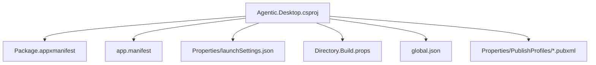
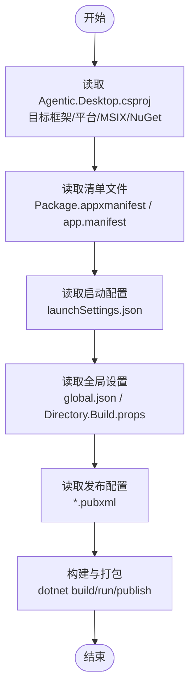
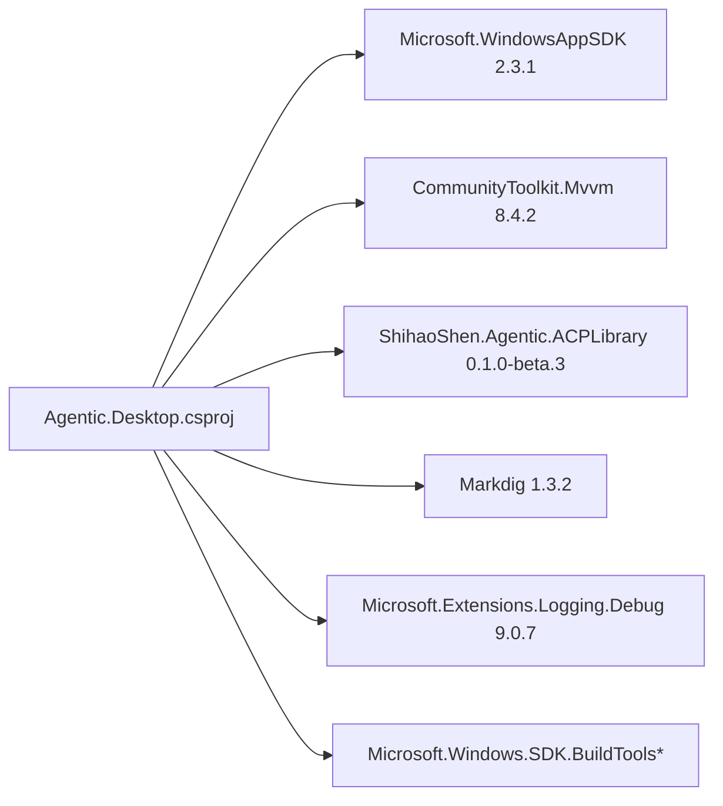

# 项目配置

<cite>
**本文引用的文件**   
- [Agentic.Desktop.csproj](file://Agentic.Desktop/Agentic.Desktop.csproj)
- [Package.appxmanifest](file://Agentic.Desktop/Package.appxmanifest)
- [app.manifest](file://Agentic.Desktop/app.manifest)
- [launchSettings.json](file://Agentic.Desktop/Properties/launchSettings.json)
- [Directory.Build.props](file://Directory.Build.props)
- [global.json](file://global.json)
- [win-x64.pubxml](file://Agentic.Desktop/Properties/PublishProfiles/win-x64.pubxml)
- [win-arm64.pubxml](file://Agentic.Desktop/Properties/PublishProfiles/win-arm64.pubxml)
- [README.md](file://README.md)
- [App.xaml.cs](file://Agentic.Desktop/App.xaml.cs)
</cite>

## 目录
1. [简介](#简介)
2. [项目结构](#项目结构)
3. [核心组件](#核心组件)
4. [架构总览](#架构总览)
5. [详细组件分析](#详细组件分析)
6. [依赖关系分析](#依赖关系分析)
7. [性能考量](#性能考量)
8. [故障排查指南](#故障排查指南)
9. [结论](#结论)
10. [附录](#附录)

## 简介
本文件聚焦 Agentic.Desktop 项目的“配置”维度，系统性说明 .csproj 项目文件、应用清单、UAC 清单、启动配置与 NuGet 包管理策略，并给出扩展与自定义指南。目标是帮助开发者快速理解构建目标、平台支持、打包方式以及运行时行为的关键开关。

## 项目结构
本项目采用 WinUI 3 + Windows App SDK 的桌面应用形态，通过 MSIX 工具链进行打包与发布。关键配置文件分布如下：
- 项目定义与包依赖：Agentic.Desktop.csproj
- 应用清单（MSIX）：Package.appxmanifest
- 应用程序清单（UAC/DPI）：app.manifest
- 启动配置：Properties/launchSettings.json
- 全局构建属性：Directory.Build.props
- SDK 版本锁定：global.json
- 发布配置：Properties/PublishProfiles/*.pubxml

图表来源
- [Agentic.Desktop.csproj:1-79](file://Agentic.Desktop/Agentic.Desktop.csproj#L1-L79)
- [Package.appxmanifest:1-57](file://Agentic.Desktop/Package.appxmanifest#L1-L57)
- [app.manifest:1-19](file://Agentic.Desktop/app.manifest#L1-L19)
- [launchSettings.json:1-10](file://Agentic.Desktop/Properties/launchSettings.json#L1-L10)
- [Directory.Build.props:1-8](file://Directory.Build.props#L1-L8)
- [global.json:1-8](file://global.json#L1-L8)
- [win-x64.pubxml:1-14](file://Agentic.Desktop/Properties/PublishProfiles/win-x64.pubxml#L1-L14)
- [win-arm64.pubxml:1-14](file://Agentic.Desktop/Properties/PublishProfiles/win-arm64.pubxml#L1-L14)

章节来源
- [Agentic.Desktop.csproj:1-79](file://Agentic.Desktop/Agentic.Desktop.csproj#L1-L79)
- [README.md:1-92](file://README.md#L1-L92)

## 核心组件
本节从“构建目标、平台与运行时、打包能力、资源与清单、NuGet 依赖、发布选项”六个方面解析 .csproj 的核心配置。

- 输出类型与目标框架
  - 输出类型为可执行程序，目标框架为 net10.0-windows10.0.26100.0，最小平台版本为 10.0.17763.0。
  - 根命名空间设置为 Agentic_Desktop。

- 平台与运行时标识
  - 平台支持 x86、x64、ARM64。
  - 运行时标识默认根据当前进程架构推断，便于本地调试与运行。

- WinUI 与 MSIX 工具链
  - 启用 UseWinUI 与 EnableMsixTooling，激活 MSIX 打包能力与相关菜单项。
  - 显式包含 Msix 项目能力以支持单项目 MSIX 打包体验。

- 资源与清单
  - 将 app.manifest 作为应用清单引用。
  - 声明多种尺寸与应用图标资源用于商店与任务栏展示。

- NuGet 包依赖
  - Microsoft.WindowsAppSDK 2.3.1：Windows App SDK 运行时与 API。
  - CommunityToolkit.Mvvm 8.4.2：MVVM 基础库（命令、属性通知等）。
  - ShihaoShen.Agentic.ACPLibrary 0.1.0-beta.3：ACP 客户端库，用于与 Agent 通信。
  - Markdig 1.3.2：Markdown 渲染。
  - Microsoft.Extensions.Logging.Debug 9.0.7：调试日志输出。
  - Microsoft.Windows.SDK.BuildTools 与 BuildTools.WinApp：构建工具与 dotnet run 支持。

- 发布与优化
  - Debug 关闭 ReadyToRun 与 Trimmed；非 Debug 开启以提升启动与体积表现。

章节来源
- [Agentic.Desktop.csproj:1-79](file://Agentic.Desktop/Agentic.Desktop.csproj#L1-L79)

## 架构总览
下图展示了配置层如何影响应用的构建、运行与打包流程。

图表来源
- [Agentic.Desktop.csproj:1-79](file://Agentic.Desktop/Agentic.Desktop.csproj#L1-L79)
- [Package.appxmanifest:1-57](file://Agentic.Desktop/Package.appxmanifest#L1-L57)
- [app.manifest:1-19](file://Agentic.Desktop/app.manifest#L1-L19)
- [launchSettings.json:1-10](file://Agentic.Desktop/Properties/launchSettings.json#L1-L10)
- [Directory.Build.props:1-8](file://Directory.Build.props#L1-L8)
- [global.json:1-8](file://global.json#L1-L8)
- [win-x64.pubxml:1-14](file://Agentic.Desktop/Properties/PublishProfiles/win-x64.pubxml#L1-L14)
- [win-arm64.pubxml:1-14](file://Agentic.Desktop/Properties/PublishProfiles/win-arm64.pubxml#L1-L14)

## 详细组件分析

### .csproj 项目文件核心配置
- 目标框架与平台
  - TargetFramework 指定 .NET 10.0 与 Windows 10 特定版本，TargetPlatformMinVersion 限制最低系统版本。
  - Platforms 同时支持 x86/x64/ARM64，RuntimeIdentifier 自动推断当前架构。
- WinUI 与 MSIX
  - UseWinUI=true 启用 WinUI 3 项目模板特性。
  - EnableMsixTooling=true 启用 MSIX 打包工具链，HasPackageAndPublishMenu 暴露“打包与发布”菜单。
- 资源与清单
  - ApplicationManifest 指向 app.manifest，用于 UAC 与 DPI 等系统级设置。
  - Content 包含多尺寸图标与启动画面，供 MSIX 与系统 UI 使用。
- NuGet 包
  - 关键包包括 Microsoft.WindowsAppSDK、CommunityToolkit.Mvvm、ShihaoShen.Agentic.ACPLibrary、Markdig、Microsoft.Extensions.Logging.Debug、Microsoft.Windows.SDK.BuildTools*。
- 发布优化
  - Debug 关闭 ReadyToRun 与 Trimmed，Release/非 Debug 开启以获得更好的启动时间与二进制体积。

章节来源
- [Agentic.Desktop.csproj:1-79](file://Agentic.Desktop/Agentic.Desktop.csproj#L1-L79)

### Package.appxmanifest 应用清单
- 应用标识
  - Identity.Name 与 Publisher 定义包标识与发布者信息，PhoneIdentity 兼容旧版手机清单字段。
- 元数据与资源
  - Properties.DisplayName、PublisherDisplayName、Logo 定义显示名称与图标。
  - Resources 声明支持的语言：en、zh-CN、zh-TW、ja。
- 设备族与依赖
  - Dependencies 声明对 Windows.Universal 与 Windows.Desktop 的设备族支持，最小版本 10.0.17763.0。
- 应用入口与视觉元素
  - Applications.Application.Id 指定可执行名与入口点占位符。
  - uap:VisualElements 定义标题、描述、背景色、磁贴与启动画面图片路径。
- 权限与功能特性
  - Capabilities 声明 runFullTrust（完整信任）与 systemAIModels（系统 AI 模型能力），满足桌面端高级权限需求。

章节来源
- [Package.appxmanifest:1-57](file://Agentic.Desktop/Package.appxmanifest#L1-L57)

### app.manifest 应用程序清单与 UAC/DPI
- 兼容性
  - supportedOS 声明与 Windows 10 新特性的兼容性，确保无包模式下正确启用某些运行时能力。
- DPI 感知
  - dpiAwareness 设置为 PerMonitorV2，使窗口在不同 DPI 显示器上自适应缩放。
- UAC 权限
  - 该清单未显式请求提升权限，如需管理员权限可在 application 节点添加 requestedExecutionLevel。

章节来源
- [app.manifest:1-19](file://Agentic.Desktop/app.manifest#L1-L19)

### launchSettings.json 启动配置
- 提供两种启动配置：
  - “Agentic.Desktop (Package)”：以 MSIX 包形式运行，适合测试打包后的行为。
  - “Agentic.Desktop (Unpackaged)”：直接运行项目，适合开发调试。
- 可扩展性
  - 可在此添加环境变量、命令行参数或附加调试器设置，以满足不同环境需求。

章节来源
- [launchSettings.json:1-10](file://Agentic.Desktop/Properties/launchSettings.json#L1-L10)

### Directory.Build.props 全局构建属性
- 统一启用 Nullable 检查、ImplicitUsings 与最新语言版本，保证跨项目一致性与代码质量。

章节来源
- [Directory.Build.props:1-8](file://Directory.Build.props#L1-L8)

### global.json SDK 锁定
- 固定 SDK 版本为 10.0.100，允许滚动到最新特性版本并允许预发行版本，确保团队一致的构建环境。

章节来源
- [global.json:1-8](file://global.json#L1-L8)

### 发布配置（*.pubxml）
- win-x64 与 win-arm64 两个发布配置分别对应 x64 与 ARM64 平台。
- 关键属性：
  - PublishProtocol=FileSystem，输出到 bin/.../publish 目录。
  - SelfContained=true 生成自包含部署，无需目标机器安装运行时。
  - PublishSingleFile=false 保持多文件输出，便于调试与增量更新。

章节来源
- [win-x64.pubxml:1-14](file://Agentic.Desktop/Properties/PublishProfiles/win-x64.pubxml#L1-L14)
- [win-arm64.pubxml:1-14](file://Agentic.Desktop/Properties/PublishProfiles/win-arm64.pubxml#L1-L14)

### 运行时初始化与日志（App.xaml.cs）
- 应用启动时创建 ILoggerFactory，启用 Debug 输出并将最小级别设为 Debug。
- 创建主窗口并激活，同时获取 UI 线程调度器以便跨线程更新 UI。
- 提供静态 CurrentAcpClient 与事件 AcpClientChanged，用于在设置页连接后通知其他页面。

章节来源
- [App.xaml.cs:1-85](file://Agentic.Desktop/App.xaml.cs#L1-L85)

## 依赖关系分析
- 构建与运行时依赖
  - Microsoft.WindowsAppSDK 2.3.1：提供 WinUI 3 运行时与 API。
  - Microsoft.Windows.SDK.BuildTools 与 BuildTools.WinApp：构建支持与 dotnet run 集成。
- MVVM 与日志
  - CommunityToolkit.Mvvm 8.4.2：简化 MVVM 实现。
  - Microsoft.Extensions.Logging.Debug 9.0.7：调试期日志输出。
- 业务与工具
  - ShihaoShen.Agentic.ACPLibrary 0.1.0-beta.3：ACP 协议客户端。
  - Markdig 1.3.2：Markdown 渲染。

图表来源
- [Agentic.Desktop.csproj:53-60](file://Agentic.Desktop/Agentic.Desktop.csproj#L53-L60)

章节来源
- [Agentic.Desktop.csproj:53-60](file://Agentic.Desktop/Agentic.Desktop.csproj#L53-L60)

## 性能考量
- 发布模式下的 ReadyToRun 与 Trimmed 在非 Debug 配置下启用，有助于缩短冷启动时间并减小二进制体积。
- 自包含发布（SelfContained=true）避免目标机缺少运行时导致的额外开销，但会增加安装包大小。
- 多平台发布（x86/x64/ARM64）需按需选择目标，减少不必要的运行时与依赖。

[本节为通用指导，不直接分析具体文件]

## 故障排查指南
- 无法以 MSIX 包运行
  - 确认已启用 EnableMsixTooling 且安装了 Windows App SDK 相关工具。
  - 检查 Package.appxmanifest 中的 Identity、Resources 与 Capabilities 是否完整。
- 启动时报 DPI 或兼容性错误
  - 检查 app.manifest 中 supportedOS 与 dpiAwareness 是否正确设置。
- 日志未输出
  - 确认 App.xaml.cs 中已创建 ILoggerFactory 并添加 Debug 源，最小级别设置为 Debug。
- 发布产物过大或启动慢
  - 在非 Debug 配置下启用 ReadyToRun 与 Trimmed，评估 PublishSingleFile 的取舍。

章节来源
- [Agentic.Desktop.csproj:67-77](file://Agentic.Desktop/Agentic.Desktop.csproj#L67-L77)
- [Package.appxmanifest:11-55](file://Agentic.Desktop/Package.appxmanifest#L11-L55)
- [app.manifest:5-18](file://Agentic.Desktop/app.manifest#L5-L18)
- [App.xaml.cs:66-76](file://Agentic.Desktop/App.xaml.cs#L66-L76)

## 结论
Agentic.Desktop 的配置围绕 WinUI 3 + Windows App SDK 的现代桌面应用范式展开：通过 .csproj 明确目标框架与平台、启用 MSIX 打包、集中管理 NuGet 依赖；通过 Package.appxmanifest 声明应用标识、资源与权限；通过 app.manifest 控制 UAC 与 DPI 行为；通过 launchSettings.json 灵活切换开发与打包运行模式；通过 *.pubxml 针对不同平台进行发布优化。遵循本文档的配置要点与扩展建议，可高效地定制与交付高质量的桌面应用。

[本节为总结性内容，不直接分析具体文件]

## 附录

### 配置扩展与自定义指南
- 新增目标平台
  - 在 .csproj 的 Platforms 中添加新平台，并在 Properties/PublishProfiles 下新增对应的 *.pubxml 发布配置。
- 调整目标框架或最小系统版本
  - 修改 TargetFramework 与 TargetPlatformMinVersion，确保 SDK 与 Windows App SDK 版本匹配。
- 增加权限或功能特性
  - 在 Package.appxmanifest 的 Capabilities 中添加所需能力，或在 app.manifest 的 application 节点配置 requestedExecutionLevel 以请求 UAC 提升。
- 自定义启动参数与环境变量
  - 在 launchSettings.json 的 profiles 中添加 commandLineArgs 或 environmentVariables。
- 统一构建规则
  - 在 Directory.Build.props 中集中设置 Nullable、ImplicitUsings、LangVersion 等。
- 锁定 SDK 版本
  - 在 global.json 中固定 sdk.version 与 rollForward 策略，确保团队一致性。

章节来源
- [Agentic.Desktop.csproj:1-79](file://Agentic.Desktop/Agentic.Desktop.csproj#L1-L79)
- [Package.appxmanifest:1-57](file://Agentic.Desktop/Package.appxmanifest#L1-L57)
- [app.manifest:1-19](file://Agentic.Desktop/app.manifest#L1-L19)
- [launchSettings.json:1-10](file://Agentic.Desktop/Properties/launchSettings.json#L1-L10)
- [Directory.Build.props:1-8](file://Directory.Build.props#L1-L8)
- [global.json:1-8](file://global.json#L1-L8)
- [win-x64.pubxml:1-14](file://Agentic.Desktop/Properties/PublishProfiles/win-x64.pubxml#L1-L14)
- [win-arm64.pubxml:1-14](file://Agentic.Desktop/Properties/PublishProfiles/win-arm64.pubxml#L1-L14)