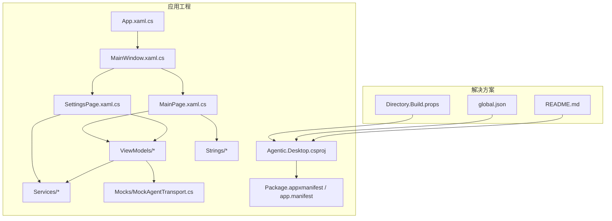
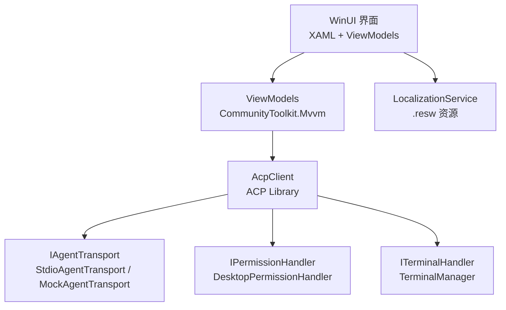
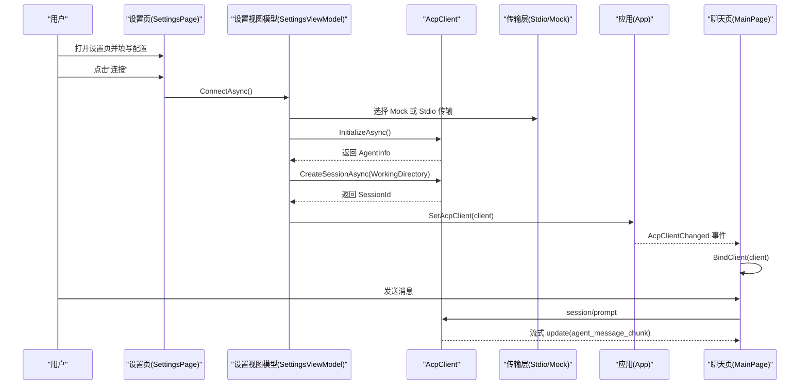
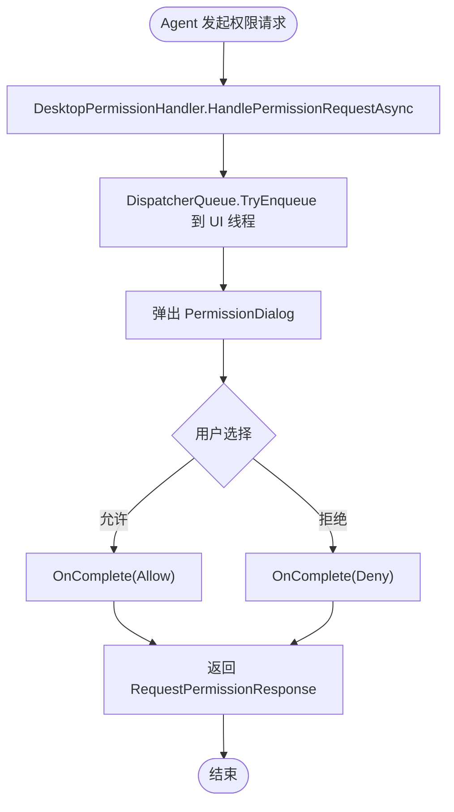
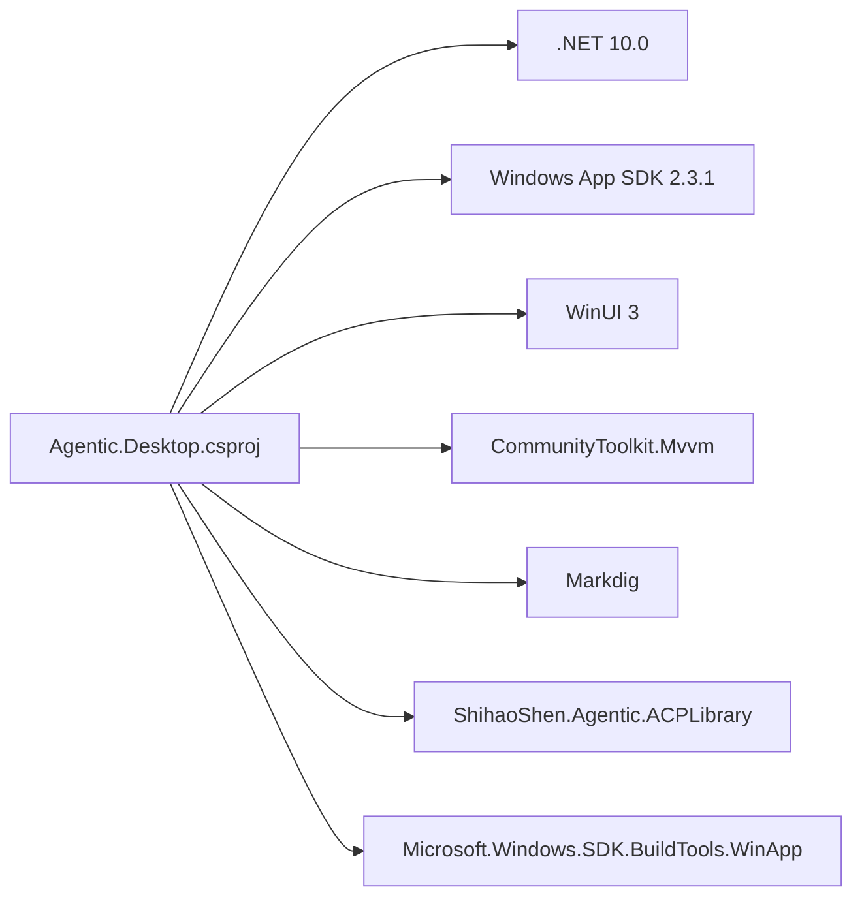

# 快速开始

<cite>
**本文引用的文件**   
- [README.md](file://README.md)
- [global.json](file://global.json)
- [Directory.Build.props](file://Directory.Build.props)
- [Agentic.Desktop.csproj](file://Agentic.Desktop/Agentic.Desktop.csproj)
- [App.xaml.cs](file://Agentic.Desktop/App.xaml.cs)
- [MainWindow.xaml.cs](file://Agentic.Desktop/MainWindow.xaml.cs)
- [SettingsPage.xaml.cs](file://Agentic.Desktop/SettingsPage.xaml.cs)
- [SettingsViewModel.cs](file://Agentic.Desktop/ViewModels/SettingsViewModel.cs)
- [MockAgentTransport.cs](file://Agentic.Desktop/Mocks/MockAgentTransport.cs)
- [launchSettings.json](file://Agentic.Desktop/Properties/launchSettings.json)
- [LocalizationService.cs](file://Agentic.Desktop/Services/LocalizationService.cs)
- [TerminalManager.cs](file://Agentic.Desktop/Services/TerminalManager.cs)
- [PermissionHandler.cs](file://Agentic.Desktop/Services/PermissionHandler.cs)
- [MainPage.xaml.cs](file://Agentic.Desktop/MainPage.xaml.cs)
</cite>

## 目录
1. [简介](#简介)
2. [项目结构](#项目结构)
3. [核心组件](#核心组件)
4. [架构总览](#架构总览)
5. [详细组件分析](#详细组件分析)
6. [依赖分析](#依赖分析)
7. [性能考虑](#性能考虑)
8. [故障排除指南](#故障排除指南)
9. [结论](#结论)
10. [附录](#附录)

## 简介
本指南面向首次接触 Agentic.Desktop 的开发者，目标是帮助你在最短时间内完成环境搭建、克隆、构建与运行，并顺利完成首次启动后的基本设置（包括使用内置 Mock Agent 体验完整流程）。应用基于 WinUI 3 与 Windows App SDK，通过 ACP（Agent Communication Protocol）与任意兼容的 Agent 进程通信；同时提供内置 Mock Agent，无需真实 Agent 即可体验聊天、权限确认与终端执行等能力。

## 项目结构
- 解决方案根目录包含全局配置与说明文档：
  - global.json：锁定 .NET SDK 版本为 10.0.100，允许滚动到最新特性版本
  - Directory.Build.props：启用 Nullable、ImplicitUsings 与最新语言版本
  - README.md：功能、技术栈、系统要求与快速命令
- 应用工程位于 Agentic.Desktop 子目录：
  - 入口与窗口：App.xaml.cs、MainWindow.xaml.cs
  - 页面与视图模型：SettingsPage.xaml.cs、MainPage.xaml.cs、ViewModels/*
  - 服务与工具：Services/*（本地化、权限、终端等）
  - Mock 传输层：Mocks/MockAgentTransport.cs
  - 资源与清单：Strings/*、Package.appxmanifest、app.manifest

图表来源
- [README.md:1-92](file://README.md#L1-L92)
- [global.json:1-8](file://global.json#L1-L8)
- [Directory.Build.props:1-8](file://Directory.Build.props#L1-L8)
- [Agentic.Desktop.csproj:1-79](file://Agentic.Desktop/Agentic.Desktop.csproj#L1-L79)

章节来源
- [README.md:1-92](file://README.md#L1-L92)
- [global.json:1-8](file://global.json#L1-L8)
- [Directory.Build.props:1-8](file://Directory.Build.props#L1-L8)
- [Agentic.Desktop.csproj:1-79](file://Agentic.Desktop/Agentic.Desktop.csproj#L1-L79)

## 核心组件
- 应用生命周期与全局状态
  - App.xaml.cs：初始化日志工厂、创建主窗口、暴露 DispatcherQueue 与当前 AcpClient 实例，并提供连接变更事件
- 主窗口与导航
  - MainWindow.xaml.cs：设置标题栏扩展、图标、尺寸，维护 NavigationView 切换“聊天”和“设置”，更新连接状态指示
- 设置页与连接管理
  - SettingsPage.xaml.cs：绑定共享 ViewModel，处理权限对话框与文件系统处理器，更新连接状态
  - SettingsViewModel.cs：实现连接/断开逻辑，选择 Stdio 或 Mock 传输，初始化 AcpClient、创建会话、订阅退出事件
- 聊天页与消息流
  - MainPage.xaml.cs：绑定 ChatViewModel，监听 App.AcpClientChanged，未连接时显示提示
- Mock 传输层
  - MockAgentTransport.cs：模拟 ACP 协议交互，支持 initialize、session/new、session/prompt 流式响应与取消
- 服务层
  - LocalizationService.cs：从 .resw 读取本地化字符串
  - TerminalManager.cs：管理多个终端进程，异步读取输出，支持等待退出、终止与释放
  - PermissionHandler.cs：将权限请求调度到 UI 线程弹出对话框

章节来源
- [App.xaml.cs:1-85](file://Agentic.Desktop/App.xaml.cs#L1-L85)
- [MainWindow.xaml.cs:1-97](file://Agentic.Desktop/MainWindow.xaml.cs#L1-L97)
- [SettingsPage.xaml.cs:1-96](file://Agentic.Desktop/SettingsPage.xaml.cs#L1-L96)
- [SettingsViewModel.cs:1-162](file://Agentic.Desktop/ViewModels/SettingsViewModel.cs#L1-L162)
- [MainPage.xaml.cs:1-51](file://Agentic.Desktop/MainPage.xaml.cs#L1-L51)
- [MockAgentTransport.cs:1-142](file://Agentic.Desktop/Mocks/MockAgentTransport.cs#L1-L142)
- [LocalizationService.cs:1-23](file://Agentic.Desktop/Services/LocalizationService.cs#L1-L23)
- [TerminalManager.cs:1-161](file://Agentic.Desktop/Services/TerminalManager.cs#L1-L161)
- [PermissionHandler.cs:1-51](file://Agentic.Desktop/Services/PermissionHandler.cs#L1-L51)

## 架构总览
应用采用 MVVM 架构，UI 层通过 ViewModels 调用 AcpClient，AcpClient 通过 IAgentTransport 与 Agent 进程通信（stdio 或 mock）。权限与终端由服务层统一处理，本地化字符串通过 Resources 加载。

图表来源
- [SettingsViewModel.cs:1-162](file://Agentic.Desktop/ViewModels/SettingsViewModel.cs#L1-L162)
- [MockAgentTransport.cs:1-142](file://Agentic.Desktop/Mocks/MockAgentTransport.cs#L1-L142)
- [PermissionHandler.cs:1-51](file://Agentic.Desktop/Services/PermissionHandler.cs#L1-L51)
- [TerminalManager.cs:1-161](file://Agentic.Desktop/Services/TerminalManager.cs#L1-L161)
- [LocalizationService.cs:1-23](file://Agentic.Desktop/Services/LocalizationService.cs#L1-L23)

## 详细组件分析

### 开发环境与安装
- 系统要求
  - Windows 10 1809 (Build 17763) 及以上
  - 开启“开发者模式”
- 必需工具
  - .NET SDK 10.0（由 global.json 锁定 10.0.100）
  - Windows App SDK 2.3.1（NuGet 引用）
  - WinApp CLI（用于打包运行）
- 关键配置文件
  - global.json：指定 SDK 版本与滚动策略
  - Agentic.Desktop.csproj：目标框架 net10.0-windows10.0.26100.0，启用 WinUI 与 MSIX 工具
  - Directory.Build.props：启用 Nullable、ImplicitUsings、最新语言版本

章节来源
- [README.md:24-30](file://README.md#L24-L30)
- [global.json:1-8](file://global.json#L1-L8)
- [Agentic.Desktop.csproj:1-79](file://Agentic.Desktop/Agentic.Desktop.csproj#L1-L79)
- [Directory.Build.props:1-8](file://Directory.Build.props#L1-L8)

### 克隆、构建与运行
- 克隆仓库
  - git clone https://github.com/AgenticDesktop/App.git
  - cd App
- 构建
  - dotnet build -p:Platform=x64
- 运行
  - winapp run bin\x64\Debug\net10.0-windows10.0.26100.0\win-x64
- 调试运行（Visual Studio）
  - launchSettings.json 提供两种配置：
    - “Agentic.Desktop (Package)”：以包方式运行
    - “Agentic.Desktop (Unpackaged)”：直接以项目方式运行

章节来源
- [README.md:31-39](file://README.md#L31-L39)
- [launchSettings.json:1-10](file://Agentic.Desktop/Properties/launchSettings.json#L1-L10)

### 首次启动与基本设置流程
- 启动后默认进入“聊天”页面，若未连接会显示提示引导至设置页
- 切换到“设置”页面进行 Agent 配置：
  - Agent 路径：留空则使用内置 Mock Agent；填写真实 ACP Agent 可执行文件路径以连接真实 Agent
  - Agent 参数：可选，例如传递项目路径等
  - 工作目录：Agent 的工作目录，可通过“浏览...”按钮选择
- 点击“连接”：
  - 若为空路径：使用 MockAgentTransport 模拟 ACP 交互，自动返回 initialize、session/new、session/prompt 流式响应
  - 若填写路径：使用 StdioAgentTransport 启动外部进程并通过 stdio 通信
- 连接成功后：
  - 设置页会创建权限处理器与文件系统处理器，并将 AcpClient 写入 App.CurrentAcpClient
  - 聊天页会自动绑定该 AcpClient，开始接收流式消息
- 断开连接：
  - 清理 AcpClient、TerminalManager，重置全局状态

图表来源
- [SettingsPage.xaml.cs:1-96](file://Agentic.Desktop/SettingsPage.xaml.cs#L1-L96)
- [SettingsViewModel.cs:1-162](file://Agentic.Desktop/ViewModels/SettingsViewModel.cs#L1-L162)
- [MockAgentTransport.cs:1-142](file://Agentic.Desktop/Mocks/MockAgentTransport.cs#L1-L142)
- [App.xaml.cs:1-85](file://Agentic.Desktop/App.xaml.cs#L1-L85)
- [MainPage.xaml.cs:1-51](file://Agentic.Desktop/MainPage.xaml.cs#L1-L51)

章节来源
- [README.md:41-49](file://README.md#L41-L49)
- [SettingsPage.xaml.cs:1-96](file://Agentic.Desktop/SettingsPage.xaml.cs#L1-L96)
- [SettingsViewModel.cs:1-162](file://Agentic.Desktop/ViewModels/SettingsViewModel.cs#L1-L162)
- [MockAgentTransport.cs:1-142](file://Agentic.Desktop/Mocks/MockAgentTransport.cs#L1-L142)
- [App.xaml.cs:1-85](file://Agentic.Desktop/App.xaml.cs#L1-L85)
- [MainPage.xaml.cs:1-51](file://Agentic.Desktop/MainPage.xaml.cs#L1-L51)

### 权限与终端流程
- 权限请求
  - 当 Agent 请求文件/终端权限时，DesktopPermissionHandler 将请求调度到 UI 线程，弹出 PermissionDialog 让用户确认
  - 确认后回调 OnComplete，将结果回传给 AcpClient
- 终端执行
  - TerminalManager 根据平台选择 cmd.exe 或 /bin/sh，启动子进程并异步读取 stdout/stderr
  - 支持获取输出、等待退出、终止进程树、释放资源

图表来源
- [PermissionHandler.cs:1-51](file://Agentic.Desktop/Services/PermissionHandler.cs#L1-L51)
- [SettingsPage.xaml.cs:1-96](file://Agentic.Desktop/SettingsPage.xaml.cs#L1-L96)

章节来源
- [PermissionHandler.cs:1-51](file://Agentic.Desktop/Services/PermissionHandler.cs#L1-L51)
- [TerminalManager.cs:1-161](file://Agentic.Desktop/Services/TerminalManager.cs#L1-L161)
- [SettingsPage.xaml.cs:1-96](file://Agentic.Desktop/SettingsPage.xaml.cs#L1-L96)

## 依赖分析
- 运行时与框架
  - .NET 10.0（SDK 10.0.100）
  - Windows App SDK 2.3.1
  - WinUI 3（UseWinUI=true）
- 关键 NuGet 包
  - CommunityToolkit.Mvvm：MVVM 基础
  - Markdig：Markdown 渲染
  - Microsoft.Windows.SDK.BuildTools.WinApp：dotnet run 支持打包应用
  - ShihaoShen.Agentic.ACPLibrary：ACP 客户端库
- 构建属性
  - TargetFramework=net10.0-windows10.0.26100.0
  - Platforms=x86;x64;ARM64
  - RuntimeIdentifier 自动推断当前架构

图表来源
- [Agentic.Desktop.csproj:1-79](file://Agentic.Desktop/Agentic.Desktop.csproj#L1-L79)

章节来源
- [Agentic.Desktop.csproj:1-79](file://Agentic.Desktop/Agentic.Desktop.csproj#L1-L79)

## 性能考虑
- 流式响应
  - MockAgentTransport 在 session/prompt 中分块推送消息，避免一次性大对象阻塞 UI
- 终端输出
  - TerminalManager 使用异步读取 stdout/stderr，减少 UI 卡顿
- 日志
  - App 初始化 ILoggerFactory，最小级别 Debug，便于问题定位但可能带来额外开销
- 建议
  - 生产发布时关闭不必要的日志输出
  - 合理控制工作目录与终端进程数量，避免过多子进程占用资源

[本节为通用指导，不直接分析具体文件]

## 故障排除指南
- 无法找到 .NET SDK 10.0
  - 确认已安装 .NET SDK 10.0（global.json 锁定 10.0.100），且 PATH 中包含 dotnet
  - 如存在多版本，确保默认版本匹配
- 构建失败或找不到 Windows App SDK
  - 确认已安装 Windows App SDK 2.3.1
  - 检查是否安装了 WinApp CLI（dotnet tool install -g winapp）
- 运行时报“开发者模式未开启”
  - 在“设置 > 系统 > 开发者选项”中开启开发者模式
- 连接失败
  - 若使用真实 Agent：检查 Agent 路径与参数是否正确，工作目录是否存在
  - 若使用 Mock Agent：确认未填写 Agent 路径（留空即使用 Mock）
  - 查看 App 日志（控制台输出）中的错误信息
- 权限对话框未弹出
  - 确认 DesktopPermissionHandler 已正确订阅 PermissionRequested 事件
  - 检查 App.DispatcherQueue 是否可用
- 终端无输出或卡住
  - 检查 TerminalManager 是否正确启动 shell（cmd.exe 或 /bin/sh）
  - 确认命令语法与工作目录有效

章节来源
- [README.md:24-30](file://README.md#L24-L30)
- [global.json:1-8](file://global.json#L1-L8)
- [Agentic.Desktop.csproj:1-79](file://Agentic.Desktop/Agentic.Desktop.csproj#L1-L79)
- [SettingsViewModel.cs:1-162](file://Agentic.Desktop/ViewModels/SettingsViewModel.cs#L1-L162)
- [PermissionHandler.cs:1-51](file://Agentic.Desktop/Services/PermissionHandler.cs#L1-L51)
- [TerminalManager.cs:1-161](file://Agentic.Desktop/Services/TerminalManager.cs#L1-L161)

## 结论
通过以上步骤，你可以在 Windows 上快速搭建 Agentic.Desktop 的开发环境并完成首次运行。使用内置 Mock Agent 可以立即体验完整的聊天、权限与终端流程；接入真实 ACP Agent 只需在设置页填写路径与参数。遇到问题时，优先检查 SDK/SDK 工具链、开发者模式与日志输出。

[本节为总结性内容，不直接分析具体文件]

## 附录
- 常用命令速查
  - 构建：dotnet build -p:Platform=x64
  - 运行：winapp run bin\x64\Debug\net10.0-windows10.0.26100.0\win-x64
  - VS 调试：选择“Agentic.Desktop (Package)”或“(Unpackaged)”配置
- 关键页面与行为
  - 设置页：配置 Agent、工作目录，连接/断开
  - 聊天页：未连接时显示提示，连接后自动绑定 AcpClient
  - 权限对话框：用户确认 Agent 的权限请求
  - 终端：支持多会话、异步输出、终止与释放

章节来源
- [README.md:31-49](file://README.md#L31-L49)
- [launchSettings.json:1-10](file://Agentic.Desktop/Properties/launchSettings.json#L1-L10)
- [SettingsPage.xaml.cs:1-96](file://Agentic.Desktop/SettingsPage.xaml.cs#L1-L96)
- [MainPage.xaml.cs:1-51](file://Agentic.Desktop/MainPage.xaml.cs#L1-L51)